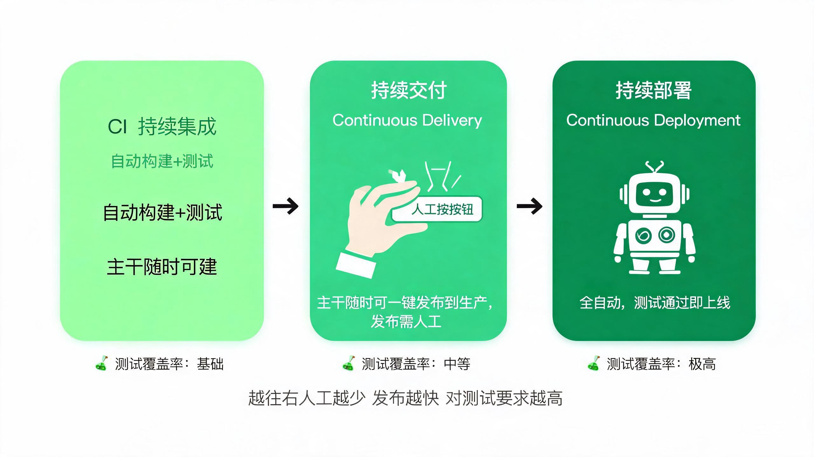
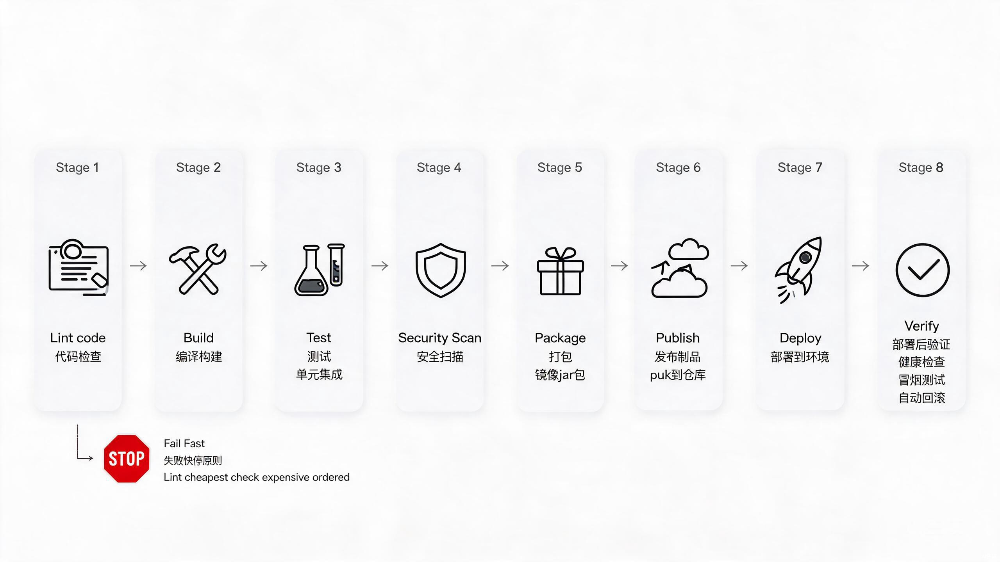
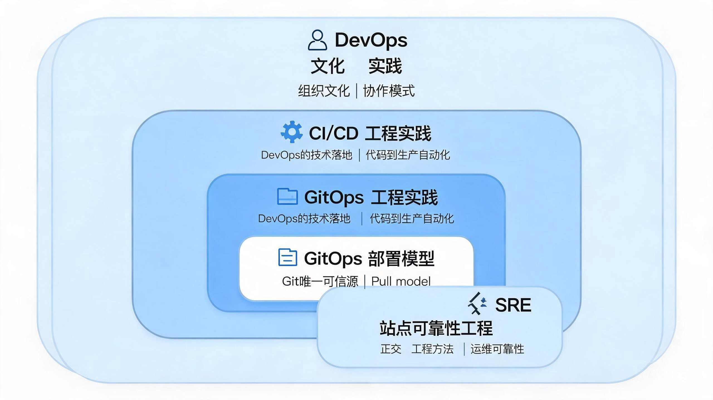

# 00-CI/CD 学习笔记（总览）

> CI/CD 系统化学习笔记，按「市面流行方案 + 后端工程师视角」组织。
> 代码示例语言：**Python / Java / Lua**（不使用 TypeScript）。
> 学习原则：每章学透再进下一章；重要章节结束主动核对开源最佳实践。

---

## 📋 总纲

- ① **认知地基**：厘清 CI/CD/CD 概念，建立标准流水线八阶段心智模型，理清与 DevOps/SRE/GitOps 的关系
- ② **环境与前置技能**：Git 工作流、Docker、YAML、制品仓库（→ 专题 S11、S12）
- ③ **工具选型与对比**：GitHub Actions / GitLab CI / Jenkins / Argo CD / Tekton 全景对比（→ S2、S5、S6、S8、S11）
- ④ **核心工具深入**：三大工具逐一攻破：Actions → GitLab → Jenkins（→ S2、S5、S6、S9、S10、S12）
- ⑤ **构建与测试**：多语言构建、测试分层、覆盖率门禁、缓存优化（→ S8、S9、S10）
- ⑥ **容器化与制品管理**：镜像最佳实践、Trivy 扫描、Harbor、Cosign 签名（→ S1、S4、S9、S10、S11、S12）
- ⑦ **部署与发布策略**：蓝绿/金丝雀/滚动、K8s、GitOps、Feature Flag（→ S5、S7）
- ⑧ **安全与质量门禁**：DevSecOps：SonarQube/CodeQL/SCA/密钥扫描/质量门（→ S1、S4、S5、S6、S9、S12）
- ⑨ **监控、可观测性与回滚**：健康检查、Prometheus、Loki、OTel、回滚策略（→ S3、S12）
- ⑩ **进阶与工程化**：流水线复用、Monorepo、IaC、DORA 指标（→ S2、S3）

---

## 1. 关键架构图

*图 1：CI → 持续交付 → 持续部署 的三层递进关系（详见 [01-认知地基](01-认知地基.md) §1.1）*

*图 2：CI/CD 标准流水线八阶段（黄金八段），按失败快停原则排列（详见 [01-认知地基](01-认知地基.md) §1.3）*

*图 3：DevOps / CI-CD / GitOps / SRE 关系嵌套（详见 [01-认知地基](01-认知地基.md) §1.4）*

---

## 2. 文档结构

### 2.1 主章节（01~10）

- [01-认知地基](01-认知地基.md) — 三个 CD 概念辨析、流水线核心术语、黄金八段、与 DevOps/SRE/GitOps 关系
- [02-环境与前置技能](02-环境与前置技能.md) — Git 工作流、Docker、YAML、制品仓库
- [03-工具选型与对比](03-工具选型与对比.md) — 五大工具（Actions/GitLab/Jenkins/Argo CD/Tekton）全景对比与选型
- [04-核心工具深入](04-核心工具深入.md) — GitHub Actions → GitLab CI → Jenkins 三大工具逐一攻破
- [05-构建与测试](05-构建与测试.md) — 多语言构建、测试分层金字塔、覆盖率门控、Flaky 治理、缓存优化
- [06-容器化与制品管理](06-容器化与制品管理.md) — 镜像最佳实践、Trivy/Harbor/Cosign、制品签名
- [07-部署与发布策略](07-部署与发布策略.md) — 蓝绿/金丝雀/滚动、K8s、GitOps、Feature Flag
- [08-安全与质量门禁](08-安全与质量门禁.md) — DevSecOps：SonarQube/CodeQL/SCA/密钥扫描/质量门
- [09-监控可观测性与回滚](09-监控可观测性与回滚.md) — 健康检查、Prometheus、Loki、OTel、回滚策略
- [10-进阶与工程化](10-进阶与工程化.md) — 流水线复用、Monorepo、IaC、DORA 指标

### 2.2 补充专题（S1~S12，索引见 [补充专题](补充专题.md)）

- [S1-Secret管理](补充专题/S1-Secret管理.md) — OIDC 免 Token / Vault / External Secrets，密钥永不落盘
- [S2-成本与配额](补充专题/S2-成本与配额.md) — CI 云成本算账：缓存命中率、self-hosted Runner
- [S3-DORA四指标](补充专题/S3-DORA四指标.md) — 国际通用 CI/CD 成熟度衡量标准，面试常问
- [S4-供应链安全SBOM](补充专题/S4-供应链安全SBOM.md) — CycloneDX/SPDX + Cosign 签名合规
- [S5-流水线自身安全](补充专题/S5-流水线自身安全.md) — pin SHA / 最小权限 / Runner 隔离（Codecov 事件后必修）
- [S6-数据库迁移](补充专题/S6-数据库迁移.md) — 迁移脚本版本化、Expand-Contract 模式（后端最痛点）
- [S7-FeatureFlag解耦部署](补充专题/S7-FeatureFlag解耦部署.md) — 「部署 ≠ 发布」的落地手段
- [S8-Lua场景CICD](补充专题/S8-Lua场景CICD.md) — OpenResty/Nginx 模块、LuaRocks 发布实践（中文资料少）
- [S9-质量安全扫描集成](补充专题/S9-质量安全扫描集成.md) — SonarQube/CodeQL/Trivy/SCA/Gitleaks 集成方式与阻断策略
- [S10-Pipeline各环节最佳实践](补充专题/S10-Pipeline各环节最佳实践.md) — Checkout/缓存/制品保存/镜像推送/测试分层逐项最佳实践
- [S11-包仓库Nexus-Harbor-GitLabRegistry](补充专题/S11-包仓库Nexus-Harbor-GitLabRegistry.md) — 三类制品仓定位对比、选型与基本使用
- [S12-CICD开源设施部署指南](补充专题/S12-CICD开源设施部署指南.md) — 15 套开源设施 docker-compose 部署与 CI 集成

### 2.3 实战文档

- [我的实践记录](我的实践记录.md) — 过往工作经验 P1~P1.3（分支即环境、Tag 发布、环境晋升门禁），与业界对照
- [新团队最佳实践方案](新团队最佳实践方案.md) — 5~15 人新团队（不上 K8s）3 个月落地清单 + 完整 .gitlab-ci.yml + Swarm 部署
- [老项目改进方案](老项目改进方案.md) — 老项目渐进式改造：无 K8s / 已有 K8s 双方案 + 6 个月路线图
- [面试题集锦](面试题集锦.md) — 8 大领域 45 道面试题（含难度与参考答案要点，高频题标 🔥）
- [踩坑经验集锦](踩坑经验集锦.md) — 30 条真实生产事故案例（P0/P1/P2，含根因、修复脚本与来源）

### 2.4 代码示例（src/）

- `src/03-small-company-gitlab-docker-demo/` — Python + GitLab CI + Swarm 最小可运行 Demo（含 Dockerfile / docker-compose / 多环境配置）

---

## 3. 学习路线

**推进顺序建议**：01 → 02 → 04（GitHub Actions）→ 05 → 06 → 07 → 04（GitLab CI）→ 08 → 04（Jenkins）→ 09 → 10

即学完前置后，先用最简单的 GitHub Actions 跑通最小闭环，再回过头横向扩展工具。

每章完成后可对照 [我的实践记录](我的实践记录.md) 的实践经验引入讨论；重要章节（04、06、07、08）结束建议核对当前开源最佳实践。

---

## 4. 参考资源

- 官方文档：GitHub Actions / GitLab CI / Jenkins / Argo CD / Tekton 各工具官网
- DORA 报告（dora.dev）— S3 指标口径与行业基准
- 开源社区：Codecov 事件复盘、CircleCI 泄露事件复盘（S5 案例来源）
