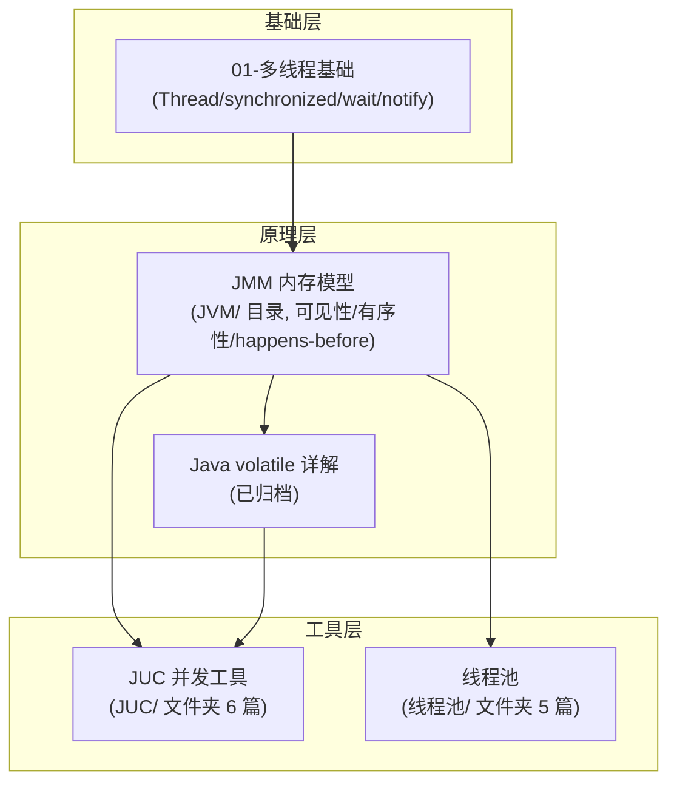

# 00-并发编程总览

> 版本基线：2026-08 整理，覆盖 多线程基础 → JMM → JUC → 线程池 完整体系
> 受众：Java 后端开发，需要一张并发编程技术地图。
> 关联笔记：本目录全部篇目

## 📋 总纲

- 1. 并发编程知识地图
- 2. 各篇导航与阅读顺序
- 3. 核心概念速查
- 4. 常见面试考点索引

## 学习目标

学完本篇你能：

1. 画出并发编程知识体系（基础→内存模型→工具→线程池）
2. 按正确顺序阅读本系列各篇
3. 快速定位"某个并发问题该看哪篇"
4. 把握并发编程面试高频考点

## 前置知识

- 本篇为总览索引，无前置；各篇内部有前置说明

---

## 1. 并发编程知识地图

**主线**：多线程基础（怎么建线程/同步）→ JMM（为什么会有并发问题）→ JUC（用什么工具解决）→ 线程池（线程怎么管理）。

---

## 2. 各篇导航与阅读顺序

| 顺序 | 篇目 | 内容 | 来源 |
|---|---|---|---|
| 1 | [01-多线程基础详解](01-多线程基础详解.md) | Thread/Runnable/synchronized/wait/notify/interrupt | |
| 2 | [Java volatile详解](Java volatile详解.md) | volatile 原理与实测 | 已有 |
| 3 | [00-JUC总览](JUC/00-JUC总览.md) | JUC 全景导航 | 新建 |
| 4 | [01-JUC之锁与AQS](JUC/01-JUC之锁与AQS.md) | ReentrantLock/AQS/读写锁 | 新建(重点) |
| 5 | [02-JUC之原子类与CAS](JUC/02-JUC之原子类与CAS.md) | CAS/原子类/LongAdder | 新建(重点) |
| 6 | [03-JUC之并发容器](JUC/03-JUC之并发容器.md) | ConcurrentHashMap/BlockingQueue | |
| 7 | [04-JUC之工具类](JUC/04-JUC之工具类.md) | CountDownLatch/CyclicBarrier/Semaphore | 新建(重点) |
| 8 | [05-JUC其他类与场景补充](JUC/05-JUC其他类与场景补充.md) | CompletableFuture/ForkJoinPool 等 | 新建(速览) |
| 9 | [01-Java线程池原理与参数详解](线程池/01-Java线程池原理与参数详解.md) | 线程池 7 参数/执行流程 | 已有 |
| 10 | [02-Executors工厂方法详解](线程池/02-Executors工厂方法详解.md) | Executors 各类线程池 | 已有 |
| 11 | [03-线程数设置与虚拟线程选型](线程池/03-线程数设置与虚拟线程选型.md) | 线程数计算/虚拟线程 | 已有 |
| 12 | [04-线程池监控、故障排查与动态调参方案对比](线程池/04-线程池监控、故障排查与动态调参方案对比.md) | 监控/排查/调参 | 已有 |
| 13 | [05-DynamicTp动态线程池详解](线程池/05-DynamicTp动态线程池详解.md) | DynamicTp 框架 | 已有 |

> 📌 **JMM 内存模型详解** 已移至 [JMM内存模型详解](../../JVM/JMM内存模型详解.md)（01-学习/Java/JVM/ 目录，与 GC 并列）——JMM 是 JVM 规范话题（JSR-133），不属于并发工具域。volatile/happens-before 等并发应用仍在并发体系内。

**推荐阅读顺序**：01 → volatile（基础）→ JUC 系列（工具）→ 线程池系列（管理）；JMM 原理（可见性/有序性根源）见 [JMM内存模型详解](../../JVM/JMM内存模型详解.md)（JVM 目录）。

---

## 3. 核心概念速查

| 概念 | 一句话 | 详见 |
|---|---|---|
| 并发三要素 | 原子性/可见性/有序性 | [01-多线程基础详解](01-多线程基础详解.md) |
| 线程五状态 | 创建/就绪/运行/阻塞/死亡 | [01-多线程基础详解](01-多线程基础详解.md) |
| JMM | 主内存+工作内存抽象规范 | [JMM内存模型详解](../../JVM/JMM内存模型详解.md)（JVM 目录） |
| happens-before | 判断数据竞争的规则 | [JMM内存模型详解](../../JVM/JMM内存模型详解.md)（JVM 目录） |
| volatile | 可见性+有序性(不保证原子) | [Java volatile详解](Java volatile详解.md) |
| AQS | state+CLH队列+CAS | [01-JUC之锁与AQS](JUC/01-JUC之锁与AQS.md) |
| CAS | 比较-交换,无锁原子 | [02-JUC之原子类与CAS](JUC/02-JUC之原子类与CAS.md) |
| 并发容器 | ConcurrentHashMap 等 | [03-JUC之并发容器](JUC/03-JUC之并发容器.md) |
| 线程协作 | Latch/Barrier/Semaphore | [04-JUC之工具类](JUC/04-JUC之工具类.md) |
| 异步编排 | CompletableFuture | [05-JUC其他类与场景补充](JUC/05-JUC其他类与场景补充.md) |
| 线程池 | 7 参数/执行流程 | [01-Java线程池原理与参数详解](线程池/01-Java线程池原理与参数详解.md) |

---

## 4. 常见面试考点索引

> 💡 **现代视角（2026-08 复查补充）**：**虚拟线程（JDK 21+）**正在改变并发编程的实践——`Executors.newVirtualThreadPerTaskExecutor()` 让"每任务一线程"变回简单模型，很多原本用线程池/JUC 的场景可以简化。但它**不替代 JUC 的知识**：JUC 工具类（锁/原子类/容器）仍是并发正确性的基础（可见性/原子性问题与线程模型无关），虚拟线程的详解见 [03-线程数设置与虚拟线程选型](线程池/03-线程数设置与虚拟线程选型.md)。

| 考点 | 答案所在 |
|---|---|
| 线程创建几种方式？ | [01-多线程基础详解](01-多线程基础详解.md) |
| synchronized 原理与优化？ | [01-多线程基础详解](01-多线程基础详解.md) |
| wait/notify 为什么必须在同步块？ | [01-多线程基础详解](01-多线程基础详解.md) |
| JMM 是什么？可见性根源？ | [JMM内存模型详解](../../JVM/JMM内存模型详解.md)（JVM 目录） |
| happens-before 规则有哪些？ | [JMM内存模型详解](../../JVM/JMM内存模型详解.md)（JVM 目录） |
| volatile 能保证原子性吗？ | [Java volatile详解](Java volatile详解.md) |
| AQS 原理？ | [01-JUC之锁与AQS](JUC/01-JUC之锁与AQS.md) |
| 公平锁/非公平锁区别？ | [01-JUC之锁与AQS](JUC/01-JUC之锁与AQS.md) |
| CAS 三大问题？ | [02-JUC之原子类与CAS](JUC/02-JUC之原子类与CAS.md) |
| AtomicLong vs LongAdder？ | [02-JUC之原子类与CAS](JUC/02-JUC之原子类与CAS.md) |
| ConcurrentHashMap JDK8 原理？ | [03-JUC之并发容器](JUC/03-JUC之并发容器.md) |
| CountDownLatch vs CyclicBarrier？ | [04-JUC之工具类](JUC/04-JUC之工具类.md) |
| 线程池 7 参数/拒绝策略？ | [01-Java线程池原理与参数详解](线程池/01-Java线程池原理与参数详解.md) |
| 线程数怎么设置？ | [03-线程数设置与虚拟线程选型](线程池/03-线程数设置与虚拟线程选型.md) |
| 虚拟线程是什么？ | [03-线程数设置与虚拟线程选型](线程池/03-线程数设置与虚拟线程选型.md) |

## 相关笔记（导航）

- 并发系列：[01-多线程基础详解](01-多线程基础详解.md) / [Java volatile详解](Java volatile详解.md) / [00-JUC总览](JUC/00-JUC总览.md) / [01-Java线程池原理与参数详解](线程池/01-Java线程池原理与参数详解.md)；JMM 原理见 [JMM内存模型详解](../../JVM/JMM内存模型详解.md)（JVM 目录）
- 邻接主题：[00-RPC与远程调用总览](../../框架/服务通信/00-RPC与远程调用总览.md)（Netty 并发模型）、**00-网络传输协议总览**（见知识库）

## 参考资料

- [JavaGuide: Java 并发](https://javaguide.cn/java/concurrent/)，查询日期：2026-08-09
- [Java 并发编程实战（书）](https://book.douban.com/subject/10484692/)，查询日期：2026-08-09
