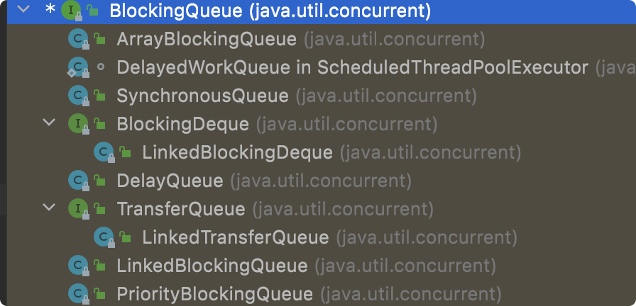

# 03-JUC之并发容器

> 版本基线：JDK 8+（ConcurrentHashMap 为 JDK8 重写版：CAS+synchronized）
> 受众：Java 后端开发，需要线程安全容器。默认你懂 HashMap/ArrayList 基础、[JMM内存模型详解](../../../JVM/JMM内存模型详解.md)。
> 关联笔记：[00-JUC总览](00-JUC总览.md)、[02-JUC之原子类与CAS](02-JUC之原子类与CAS.md)、[01-JUC之锁与AQS](01-JUC之锁与AQS.md)

## 📋 总纲

- 1. 并发容器全景
- 2. ConcurrentHashMap（重点）★
- 3. BlockingQueue（迁移）★
- 4. BlockingQueue 实现类
- 5. CopyOnWriteArrayList
- 6. 并发 Set
- 7. 常见踩坑

## 学习目标

学完本篇你能：

1. 说出并发容器家族（Map/Queue/List/Set）
2. **讲清 ConcurrentHashMap JDK8 原理**：CAS+synchronized 锁桶
3. 理解 BlockingQueue 阻塞语义与四种实现选型
4. 用 CopyOnWriteArrayList 处理读多写少
5. 正确选型并发容器并避开坑

## 前置知识

- [02-JUC之原子类与CAS](02-JUC之原子类与CAS.md)——CAS 是 ConcurrentHashMap 基础
- [01-多线程基础详解](../01-多线程基础详解.md)——synchronized 基础
- 需掌握：HashMap 结构（数组+链表+红黑树）

---

## 1. 并发容器全景

| 容器 | 对应 | 线程安全方案 |
|---|---|---|
| **ConcurrentHashMap** | HashMap | CAS + synchronized 锁桶 |
| **ConcurrentSkipListMap** | TreeMap | 跳表（无锁） |
| **CopyOnWriteArrayList** | ArrayList | 写时复制 |
| **CopyOnWriteArraySet** | HashSet | 写时复制 |
| **BlockingQueue** | Queue | 阻塞队列（线程协作） |
| **ConcurrentLinkedQueue** | Queue | CAS 无锁队列 |

---

## 2. ConcurrentHashMap（重点）★

### 2.1 演进

| 版本 | 方案 | 问题 |
|---|---|---|
| JDK 7 | Segment 分段锁（继承 ReentrantLock） | 锁粒度粗，定位两次 |
| **JDK 8** | **CAS + synchronized 锁桶头节点** | 锁粒度细，性能好 |

### 2.2 JDK8 原理

```
数组 + 链表/红黑树
[桶0] [桶1] ... [桶N]
  |     |
 Node  Node
```

**核心机制**：
- **put**：桶为空 → CAS 直接放入（无锁）；桶非空 → synchronized 锁桶头节点再操作
- **扩容**：多线程协助扩容（transfer），减少停顿
- **读**：无锁（volatile 读，弱一致性）
- **size**：分段统计（CounterCell，类似 LongAdder）

```java
ConcurrentHashMap<String, Integer> map = new ConcurrentHashMap<>();
map.put("key", 1);          // CAS/锁桶
Integer v = map.get("key"); // 无锁读
```

### 2.3 与 Hashtable 对比

| 维度 | Hashtable | ConcurrentHashMap |
|---|---|---|
| 锁粒度 | 整个表（全表锁） | 桶级（CAS+锁桶头） |
| 并发度 | 低（串行） | 高（并行写不同桶） |
| 读 | 加锁 | **无锁** |
| 迭代 | 强一致（fail-fast） | 弱一致（安全） |

> 💡 **记忆锚点**：**Hashtable 是"整栋楼一把锁"，ConcurrentHashMap 是"每层楼一把锁+空房间不锁门"**——并发度天差地别。

### 2.4 易错点

- **不保证强一致**：迭代/复合操作（如先 get 再 put）可能有竞态，复合操作用 `compute`/`merge` 原子方法
- 不允许 null key/value（与 HashMap 不同）

---

## 3. BlockingQueue（迁移）★


在所有的并发容器中，BlockingQueue 是最常见的一种。BlockingQueue 是一个带阻塞功能的队列：**入队列时若队列已满则阻塞调用者；出队列时若队列为空则阻塞调用者**。

在 Concurrent 包中，BlockingQueue 是一个接口，有许多不同的实现类：



接口定义如下：

```java
public interface BlockingQueue<E> extends Queue<E> {
    boolean add(E e);                    // 满则抛异常
    boolean offer(E e);                  // 满则返回 false
    void put(E e) throws InterruptedException;   // 满则阻塞
    E take() throws InterruptedException;        // 空则阻塞
    E poll(long timeout, TimeUnit unit) throws InterruptedException;  // 限时取
}
```

**四种操作语义对比**：

| 操作 | 抛异常 | 返回特殊值 | 阻塞 | 超时 |
|---|---|---|---|---|
| 插入 | add | offer(false) | put | offer(timeout) |
| 移除 | remove | poll(null) | take | poll(timeout) |
| 检查 | element | peek(null) | - | - |

---

## 4. BlockingQueue 实现类

| 实现 | 数据结构 | 有界/无界 | 公平性 | 场景 |
|---|---|---|---|---|
| **ArrayBlockingQueue** | 数组 | 有界 | 可配公平 | 固定容量生产者消费者 |
| **LinkedBlockingQueue** | 链表 | 默认无界 | 无 | 线程池默认队列 |
| **SynchronousQueue** | 无缓冲 | - | - | 直接传递（线程池 workQueue 常用） |
| **PriorityBlockingQueue** | 堆 | 无界 | - | 优先级任务 |
| **DelayQueue** | 堆+延迟 | 无界 | - | 延迟任务/定时 |

**生产者消费者示例**（ArrayBlockingQueue）：

```java
BlockingQueue<String> queue = new ArrayBlockingQueue<>(10);

// 生产者
new Thread(() -> {
    try { queue.put("任务"); }   // 满则阻塞等待
    catch (InterruptedException e) { Thread.currentThread().interrupt(); }
}).start();

// 消费者
new Thread(() -> {
    try {
        String task = queue.take();   // 空则阻塞等待
        System.out.println("处理: " + task);
    } catch (InterruptedException e) { Thread.currentThread().interrupt(); }
}).start();
```

> ⚠️ **注意**：SynchronousQueue 是 [01-Java线程池原理与参数详解](../线程池/01-Java线程池原理与参数详解.md) 里 `Executors.newCachedThreadPool` 的默认队列（不存任务，直接转交）。

---

## 5. CopyOnWriteArrayList

**原理**：写时复制——写操作复制整个数组再改，读操作无锁读旧数组。

```java
CopyOnWriteArrayList<String> list = new CopyOnWriteArrayList<>();
list.add("a");    // 复制数组 → 修改 → 替换引用(volatile)
String s = list.get(0);   // 无锁读
```

| 优点 | 缺点 |
|---|---|
| 读无锁，读多场景极快 | 每次写复制全数组，写开销大 |
| 迭代安全（快照） | 内存占用高（双份） |
| 弱一致性（迭代器看到旧数据） | 不适合写多场景 |

**适用**：读多写极少（如配置列表、黑白名单）。

---

## 6. 并发 Set

| 类 | 原理 | 适用 |
|---|---|---|
| **CopyOnWriteArraySet** | 内部 CopyOnWriteArrayList | 读多写少 |
| **ConcurrentSkipListSet** | 跳表 | 需要有序 + 并发 |

**注意**：没有 ConcurrentHashSet（JDK 没有），需要时用 `ConcurrentHashMap.newKeySet()`：

```java
Set<String> set = ConcurrentHashMap.newKeySet();   // 等价并发 HashSet
set.add("a");
```

---

## 7. 常见踩坑

| 编号 | 坑 | 现象 | 解决方案 |
|---|---|---|---|
| #C1 | ConcurrentHashMap 放 null | NPE | 用空对象占位 |
| #C2 | 复合操作非原子 | get-then-put 竞态 | 用 compute/merge 原子方法 |
| #C3 | CopyOnWrite 写多场景 | 性能差（反复复制） | 写多用 ConcurrentHashMap/锁 |
| #C4 | BlockingQueue 选错实现 | 死锁/内存暴涨 | 按场景选（见第 4 节表） |
| #C5 | 无界队列误用 | OOM（任务堆积） | 用有界队列 ArrayBlockingQueue |
| #C6 | 迭代时修改 | ConcurrentModificationException | 并发容器迭代是弱一致，遍历时不要依赖修改 |

## 小结

- 并发容器家族：Map/Queue/List/Set 都有线程安全版
- ConcurrentHashMap JDK8：CAS + synchronized 锁桶，读无锁，性能最优
- BlockingQueue：阻塞语义（put/take），四种实现按需选
- CopyOnWriteArrayList：读多写少利器（写时复制）
- 选型：Map→ConcurrentHashMap，生产者消费者→BlockingQueue，读多写少→CopyOnWrite

## 下一篇

[04-JUC之工具类](04-JUC之工具类.md)——线程协作工具

## 参考资料

- [JavaGuide: ConcurrentHashMap](https://javaguide.cn/java/concurrent/concurrent-hash-map-source-code.html)，查询日期：2026-08-09
- [java.util.concurrent 并发容器官方文档](https://docs.oracle.com/javase/8/docs/api/java/util/concurrent/package-summary.html)，查询日期：2026-08-09
