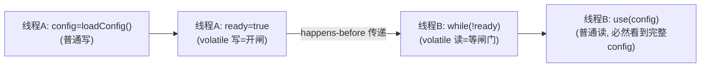
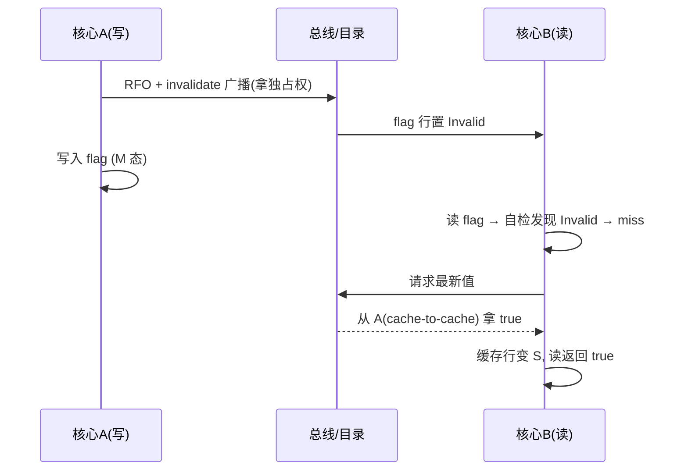

# Java volatile详解

> 版本基线：JDK **17.0.12** (LTS) | 创建日期：2026-08-06 | 实测日期：2026-08-09
> 受众：Java 后端开发，会用 synchronized 但没深究过 JMM。默认你懂线程、内存、缓存的基本概念（L1/L2/主存），但「内存屏障」「MESI」从零讲起。

## 📋 总纲

1. 基本概念：volatile 是什么、教学比喻与真实语义、快速上手 Demo
2. 使用场景：状态标志、安全发布、轻量级共享、选型对比
3. JMM 语义：可见性、有序性、传递性、原子性边界
4. 写读操作流程：从 Java 到硬件的完整链路
5. 底层原理（补充知识）：MESI、内存屏障、内存模型差异、性能代价
6. 最佳实践 + 常见踩坑
7. 面试追问清单（带答案）

## 学习目标

学完本篇，你应当能够：

- 一句话说清 volatile 的三个特性（可见性 ✓ 有序性 ✓ 原子性 ✗）
- 讲清「刷回主内存」为什么只是教学比喻，真实语义是 happens-before + 屏障 + 缓存一致性
- 写出状态标志 / DCL 单例两种标准用法，并解释 DCL 为什么必须 volatile
- 背出 JMM 8 种重排序规则表，说清 volatile 为什么是「双向屏障」
- 讲清 volatile 写的硬件链路：RFO + invalidate 广播 + StoreLoad 屏障
- 画出 MESI 四种状态转换，解释假共享并给出解法
- 答对 10 道面试追问

## 前置知识

- 线程与 synchronized 基本用法（本系列见 [01-Java线程池原理与参数详解](线程池/01-Java线程池原理与参数详解.md)）
- 理解「缓存行」「CPU 缓存」概念即可，MESI/屏障细节本文从零讲
- 相关阅读：[Java代理详解](../核心机制/Java代理详解.md)（volatile 常用于 DCL 单例的安全发布）

## 核心知识点

### 知识点一：是什么——三特性 + 一句话记忆

volatile 是 Java 的**轻量级同步关键字**，用于多线程共享变量的可见性与有序性控制。

| 特性 | 是否保证 | 说明 |
|------|---------|------|
| 可见性 | ✅ | 一个线程写 volatile，其他线程读必然看到最新值 |
| 有序性 | ✅ | volatile 读写不会被编译器/CPU 重排序（双向屏障） |
| 原子性 | ❌ | 不保证复合操作原子性（i++ 该错还是错） |

**一句话记忆：volatile 是「发布信号」，不是「保险柜」。** 它保证「看到信号的人必然看到信号之前的一切」，但不保证「两个人都不会同时往保险柜里放东西」（互斥/原子性交给 synchronized/Atomic）。

定位：比 synchronized 轻（无锁、无阻塞），比 Atomic 弱（只解决可见性+有序性，不解决复合原子性）。

### 知识点二：「刷回主内存」只是教学比喻

> **类比：闸门。** volatile 写 = 线程 A 打开一道闸门；volatile 读 = 线程 B 必须等闸门打开才过。A 在开闸前干的活（普通写），B 一过闸必然全看见——这就是 happens-before 的「连坐发布」。闸门是「顺序语义」（开了就必然看见），不是「时间语义」（不是实时广播到所有人）。

网上最常见的说法：*「写 volatile 变量会立即刷回主内存，读会从主内存重新加载」* —— 这是**教学比喻**，不是 JMM 规范字句。

真实语义是 **happens-before 规则**：

```
volatile 写 happens-before 后续对同一 volatile 的读
```

即：一个线程写 volatile 之后，另一个线程读到该 volatile 值时，**必然能看到写之前的所有操作结果**。中间没有字面意义上的「主内存同步」动作，实际靠内存屏障 + 缓存一致性协议完成（见知识点六）。

### 知识点三：快速上手 Demo（已实测 ★）

```java
public class VolatileDemo {
    private static volatile boolean running = true;   // 不加 volatile：主线程的修改可能永远不被工作线程看到

    public static void main(String[] args) throws InterruptedException {
        Thread worker = new Thread(() -> {
            long count = 0;
            while (running) {          // volatile 读
                count++;
            }
            System.out.println("工作线程停止，共执行: " + count);
        });
        worker.start();
        Thread.sleep(1000);
        running = false;               // volatile 写
        System.out.println("主线程已置 running=false");
    }
}
```

JDK 17.0.12 实测结果（见文末 🧪 小节）：

| 版本 | 结果 |
|------|------|
| 加 `volatile` | worker 正常停止（1s 内执行 24.7 亿次循环）✓ |
| 去掉 `volatile` | worker 2 秒后仍存活，**读不到新值，可见性问题实锤复现** ⚠️ |

### 知识点四：使用场景与选型

#### ① 状态标志（最常用）

```java
public class TaskRunner {
    private volatile boolean stop = false;   // 开关/停止标志
    public void stop() { stop = true; }
    public void run() {
        while (!stop) { /* 干活 */ }
    }
}
```

- 适用：一个线程写、其他线程读的**开关类变量**
- 不需要原子性（布尔赋值本身就是原子的），volatile 正好够用

#### ② 安全发布 / DCL 单例（发布语义）

```java
public class Singleton {
    private static volatile Singleton instance;   // ← 必须 volatile

    public static Singleton get() {
        if (instance == null) {                   // volatile 读（快速路径）
            synchronized (Singleton.class) {
                if (instance == null) {
                    instance = new Singleton();   // volatile 写
                }
            }
        }
        return instance;
    }
}
```

**为什么必须 volatile**：`new Singleton()` 三步可能重排序（分配内存 → 构造 → 引用赋值）。若步骤 2、3 重排，其他线程可能读到「非 null 但未构造完」的对象。volatile 保证：**引用赋值（volatile 写）之前的构造动作对读线程可见**（见知识点五的传递性）。

#### ③ 轻量级共享（读多写少）

```java
public class ConfigHolder {
    private volatile String configVersion = "v1";   // 配置版本号
    private volatile int maxRetry = 3;              // 配置项
}
```

- 适用：配置、指标、水位等**读频率远高于写**的共享数据
- volatile 读在 x86 上几乎免费（普通 load），多读场景无感

#### ④ 不适合的场景

**计数器 / 复合操作**：`count++` 是读-改-写三步，volatile 不保证原子 → 用 `AtomicInteger`。
**多线程写同一变量**：`total += x` 基于旧值计算 → 用 `AtomicLong.addAndGet` 或 LongAdder。

#### ⑤ 三兄弟选型（一句话）

> **只要「可见性+有序性」就 volatile；要「原子性」就 Atomic；要「互斥」就 synchronized/Lock。**

| 场景 | 选择 |
|------|------|
| 布尔开关/状态标志 | volatile |
| 单例发布 / 安全发布 | volatile（配 synchronized） |
| 计数器/累加 | AtomicInteger / LongAdder |
| 复合操作需要原子性 | Atomic*（CAS） |
| 需要互斥/临界区 | synchronized / Lock |
| 读多写少共享值 | volatile（读免费，写有代价） |

### 知识点五：JMM 语义（规范层）

#### 可见性：happens-before 规则

```
对一个 volatile 变量的写，happens-before 后续对该变量的任意读
```

含义：写线程写完 volatile，读线程读到后，**写之前的所有操作对读线程可见**（不止作用于 volatile 变量本身，见传递性）。

#### 有序性：重排序限制（8 种组合表）

JMM 针对 volatile 读写与普通读写定义了 8 种组合的重排序规则：

| 第一个操作 | 第二个操作 | 能否重排序 |
|-----------|-----------|-----------|
| 普通读 | 普通读 | 可以 |
| 普通读 | 普通写 | 可以 |
| 普通写 | 普通读 | 可以 |
| 普通写 | 普通写 | 可以 |
| **volatile 读** | 任意操作 | **禁止** |
| **volatile 写** | 任意操作 | **禁止** |
| 任意操作 | **volatile 读** | **禁止** |
| 任意操作 | **volatile 写** | **禁止** |

即：**volatile 读写是双向屏障** —— 编译器/JIT/CPU 都不能让任何操作跨越 volatile 读写重排。

#### 传递性：volatile 的「连坐」发布 ★

**volatile 写之前的所有普通变量写入，会随这次 volatile 写一起对其他线程可见**：

```java
// 线程 A                              // 线程 B
config = loadConfig();   // 普通写     while (!ready) { }   // volatile 读
ready = true;            // volatile写  use(config);         // 普通读
```

happens-before 链：`config 写 → ready 写 → ready 读 → config 读`，传递得到 `config 写 happens-before config 读` → B 必然看到完整 config。



**这就是 DCL 单例的理论基础**：instance 的 volatile 写「发布」了构造函数里的所有普通字段赋值。volatile 不只是让自己可见，它是**安全发布点**。

#### 原子性边界与 long/double 特例

- volatile **不保证复合操作原子**（i++、x += 1）
- 但 JMM 规定：**volatile 的 long/double 读写是原子的**（JSR-133）
- 为什么强调：普通 long/double 在 32 位 JVM 上可能非原子（高 32 位、低 32 位分两次写，中间可能被其他线程读到撕裂值）→ 共享的 long/double 建议 volatile 修饰

### 知识点六：写读流程与硬件原理（从 Java 到硬件）

> 先立认知：volatile 保证的是**顺序语义**（写已提交则读必然看见），不是**时间语义**（不是"写后立即广播到所有线程"）。

#### volatile 写流程（x86 视角）

```java
x = 1;              // ① 普通写
flag = true;        // ② volatile 写
y = 2;              // ③ 普通写
```

**软件层（编译器/JIT）**：
- 写前插 StoreStore 屏障 → 阻止 ① 跑到 ② 后（x=1 先落定）
- 写后插 StoreLoad 屏障 → 阻止 ③/后续读跑到 ② 前
- 编译器/JIT 不得把 volatile 写与任何操作重排序（见 8 种组合表）

**硬件层**：
- store 指令进入本核心的 store buffer（写缓冲）
- 处理器发现 flag 缓存行不在「独占/修改」态 → 发 **RFO**（Read For Ownership）+ 广播 invalidate
- 其他核心收到 invalidate → 把自己的 flag 行标记 Invalid
- StoreLoad 屏障（x86 上是 mfence / lock 前缀）冲刷 store buffer，让前面的写真正对外可见

**关键**：让其他线程「第一时间知道」靠**缓存一致性协议广播失效**，不是"刷主存"。



#### volatile 读流程

- 读后插 LoadLoad → 阻止后续普通读跑到读前；插 LoadStore → 阻止后续普通写跑到读前
- 执行 load flag：检查本核心 L1 缓存里 flag 行状态
  - S/E 态 → 直接读（有最新值）
  - I 态（Invalid）→ cache miss！总线嗅探/目录 → 从持有最新值的核心（cache-to-cache）或主存拿数据
- **关键**：写方已 invalidate 你的缓存行，所以你读时**必然 miss、必然重取** —— 不可能读到旧值

#### 三个细节修正 ★

**① 广播发生在「写之前」，不是「写之后」**：A 要写 flag → 先发 RFO + invalidate（获取独占权的准备动作）→ 拿到独占权后，才真正执行写。广播是写的「入场券」，B 的失效通知在 A 落笔前就到达了。

**② 是「核心的缓存」，不是「线程的缓存」**：MESI 是核心级协议，Java 线程是 OS 线程、随时可能被调度到别的核心。准确说法：B miss 后从「持有该缓存行 M 态的那个核心」cache-to-cache 拿数据。

**③ 「等待」确实存在，但等的是硬件事务**：如果 B 的读请求撞上 A 正在写同一缓存行，B 的读会 stall——在总线/目录层面排队，等该缓存行事务完成再拿数据。硬件仲裁，纳秒级。

#### MESI 缓存一致性协议（补充）

每个核心有私有 L1/L2，共享 L3 + 主存。缓存行四种状态：

| 状态 | 含义 |
|------|------|
| M Modified | 本核心独占修改，主存是旧的 |
| E Exclusive | 本核心独占，与主存一致 |
| S Shared | 多核心共享，与主存一致 |
| I Invalid | 已失效，读必须重新获取 |

**一句话**：写方靠 MESI 广播失效，读方靠缓存行自检 miss，中间靠屏障锁死顺序——三者配合才是「第一时间发现」的真相。

#### 四种内存屏障

| 屏障 | 语义 | 代价 |
|------|------|------|
| LoadLoad | Load1; LL; Load2 → Load2 前 Load1 读完 | 低 |
| StoreStore | Store1; SS; Store2 → Store2 前 Store1 对其他核可见 | 低 |
| LoadStore | Load1; LS; Store2 → Store2 刷出前 Load1 读完 | 中 |
| StoreLoad | Store1; SL; Load2 → Load2 前 Store1 对所有处理器可见 | **最高（万能屏障）** |

- StoreLoad 是最贵的：兼具其他三种功能，x86 上实现为 mfence / lock 前缀
- 这就是 volatile **写**比普通写贵 10~100 倍、**读**在 x86 上几乎免费的原因
- **final 字段也有屏障语义**（JSR-133）：`x.finalField = v; StoreStore; sharedRef = x;` —— 保证 final 字段在对象发布前完成初始化

#### x86 vs ARM 内存模型

| 平台 | 模型 | 表现 |
|------|------|------|
| x86/x64 | TSO（强内存模型） | load 天然较强，只需写后插 StoreLoad；volatile 读 ≈ 普通 load（免费） |
| ARM/POWER | 弱内存模型 | 读写都要屏障，编译器/JIT 插入更多屏障 |
| Java 层面 | 无需关心 | JVM 已按 JMM 规范插好屏障，同一份代码跨平台语义一致 |

#### 性能代价与假共享

**volatile 写贵**：StoreLoad 屏障（mfence）开销大；高频写 volatile 会显著变慢（AtomicLong 的 lazySet / Unsafe.putOrderedLong 可绕过）。

**假共享（False Sharing）**：多个核心高频写**同一缓存行**（哪怕不同字段），每次写都要 RFO + invalidate 对方 → 缓存行在两核间 ping-pong → 总线拥塞、吞吐暴跌。

```java
// 反例：a 和 b 不同线程各写，但可能落在同一 64 字节缓存行
class Counter {
    volatile long a;   // 线程 1 写
    volatile long b;   // 线程 2 写 —— 互相拖垮！
}
```

**解法**：`@Contended` 注解（Java 8+，需 -XX:-RestrictContended）或手动 padding 把字段拆到不同缓存行。

## 最佳实践

- **开关类变量**（一个线程写、多线程读）优先 volatile，别用 synchronized 杀鸡用牛刀
- **DCL 单例**忘加 volatile 是经典 bug——发布语义必须 volatile
- **计数器/累加**一律 Atomic*，volatile 救不了复合操作
- **long/double 共享**建议 volatile（防 32 位 JVM 撕裂读）
- **高频写共享值**慎用 volatile（StoreLoad 贵），考虑 lazySet 或减少写频率
- **多字段高频写**注意假共享：@Contended 或 padding
- 面试/讲解时用「闸门/happens-before」而非「刷主存」表述（后者是教学比喻）

## 常见踩坑

| 编号 | 坑 | 现象 | 解决方案 |
|------|-----|------|---------|
| #V1 | `count++` 当原子用 | 丢更新，计数偏小 | AtomicInteger / LongAdder |
| #V2 | 多线程写同一 volatile | `total += x` 结果错误 | AtomicLong.addAndGet |
| #V3 | DCL 单例忘 volatile | 读到未构造完的对象 | instance 加 volatile |
| #V4 | 把「刷回主存」当真 | 对时序产生错误预期 | 用 happens-before 表述 |
| #V5 | 想用 volatile 做互斥 | 临界区并发进入 | synchronized / Lock |
| #V6 | 高频写 volatile | 性能暴跌（StoreLoad 贵） | lazySet / 降写频 |
| #V7 | 假共享 | 多核吞吐暴跌 | @Contended / padding |
| #V8 | long/double 不加 volatile（32 位 JVM） | 撕裂值 | volatile 修饰 |

## 面试追问清单（带答案）

### Q1. volatile 的三个特性？

A：可见性（写对后续读可见）、有序性（禁止重排序，双向屏障）、**不保证原子性**。它是轻量级同步：比 synchronized 轻（无锁），比 Atomic 弱（不解决复合原子性）。

### Q2. volatile 能保证原子性吗？i++ 问题？

A：不能。volatile 只保证单次读写的可见性，i++ 是读-改-写三步，可能丢更新。计数器用 AtomicInteger / LongAdder。

### Q3. DCL 单例为什么必须 volatile？

A：new Singleton() 三步（分配→构造→引用赋值）可能重排序，不加 volatile 时其他线程可能读到「非 null 但未构造完」的对象。volatile 保证引用赋值（volatile 写）之前的构造动作对读线程可见（happens-before 传递）。

### Q4. volatile 和 synchronized 的区别？

A：① volatile 无锁、无阻塞、不能做互斥；synchronized 可做临界区。② volatile 只能修饰变量；synchronized 修饰方法/代码块。③ volatile 保证可见性+有序性；synchronized 额外保证原子性（互斥）。④ volatile 写比 synchronized 快，但解决不了复合操作。

### Q5. volatile 和 Atomic 的区别？

A：volatile 只解决可见性/有序性；Atomic 用 CAS 解决原子性（并含 volatile 的可见性）。原子性要求用 Atomic，纯开关用 volatile 更轻。

### Q6. volatile 写为什么比普通写慢？

A：写后要插 StoreLoad 屏障（x86 上 mfence/lock 前缀），它是四种屏障中最贵的万能屏障，还要冲刷 store buffer + 广播 invalidate。volatile 读在 x86 上几乎免费（普通 load）。

### Q7. 假共享是什么？怎么解决？

A：多个核心高频写同一缓存行（哪怕不同字段）→ 每次写都 RFO + invalidate 对方 → 缓存行 ping-pong、总线拥塞、性能暴跌。解决：@Contended 注解或字段 padding 拆行。

### Q8. happens-before 传递性怎么理解？

A：A 写普通变量 → A 写 volatile（发布）→ B 读 volatile → B 读普通变量，链式传递得到「普通写 happens-before 普通读」。volatile 写之前的普通写会随 volatile 写一起对读线程可见——这是 DCL 和「安全发布」的理论基础。

### Q9. volatile long/double 有什么特殊？

A：JMM 规定 volatile 的 long/double 读写是原子的。普通 long/double 在 32 位 JVM 上可能非原子（高 32 位/低 32 位分两次写，可能读到撕裂值）。共享的 long/double 建议 volatile 修饰。

### Q10. 「volatile 会立即刷回主内存」对吗？

A：是教学比喻，不精确。JMM 没有「立即刷回主内存」的字面保证；真实语义是 happens-before + 内存屏障 + 缓存一致性协议（MESI）。volatile 保证顺序语义（写已提交则读必然看见），不是时间语义（不是实时广播）。

## 小结

- volatile 三特性：可见性 ✓ 有序性 ✓ 原子性 ✗——「发布信号，不是保险柜」
- 真实语义 = happens-before + 双向屏障 + MESI 缓存一致性，不是「刷主存」
- 常用：状态标志、DCL 单例（发布语义）、读多写少共享
- 选型一句话：可见性+有序性用 volatile，原子性用 Atomic，互斥用 synchronized
- 实测：不带 volatile 的循环 2 秒读不到新值（可见性问题复现）；带 volatile 必停

## 相关笔记

- [Java-PriorityQueue详解](../集合/Java-PriorityQueue详解.md) — 并发容器/同步器系列（volatile 的可见性是其基础）
- [Java代理详解](../核心机制/Java代理详解.md) — DCL 单例之外的线程安全发布场景
- 并发系列其余笔记（synchronized 原理 / CAS / 锁升级）待补充 📌

## 🧪 本机实测（2026-08-09）

> 环境：JDK 17.0.12 (LTS)，`javac` 编译 + 独立 JVM 运行（非 jshell，避免 REPL 干扰 JIT）。

**Demo 说明**：工作线程 `while (flag) count++;`，主线程 1 秒后置 `flag=false`，再观察 2 秒。

| 版本 | 真实输出 | 结论 |
|------|---------|------|
| `volatile boolean` | 主线程已置 withVolatile=false → YES-worker 停止, count=2475679314 → YES-worker 已停止 | volatile 写对读可见，worker 必停 ✓ |
| 去掉 volatile | 主线程已置 noVolatile=false → 等 2s 观察 → **NO-worker 仍存活** | 读不到新值，**可见性问题实锤复现** ⚠️ |

补充说明：
- 带 volatile 版 1 秒执行 24.7 亿次空循环（约 2.4 亿次/秒），worker 停止耗时 < 3ms（join 立即返回）
- 不带 volatile 版在 JDK 17 server JIT 下循环被优化为「只读一次缓存值」，主线程修改永远不会被看到——正是教学里说的经典现象
- 实验进程均有超时保护（worker 不停止则主线程 System.exit 强杀），不会遗留僵尸线程