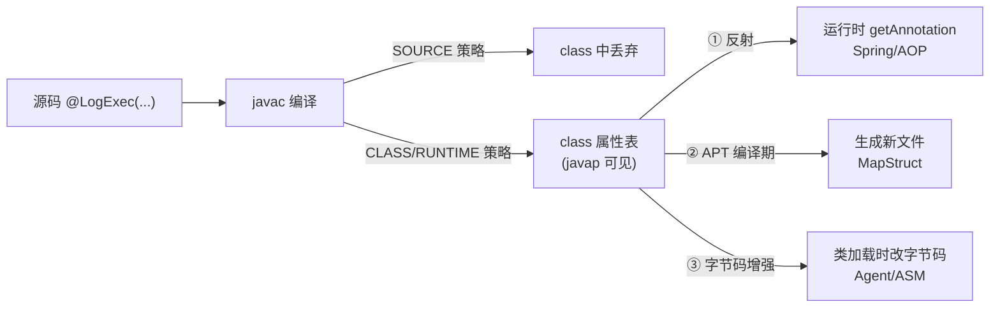

# Java注解机制详解

> 版本基线：JDK 8 为主线，标注高版本演进 | 实测环境：JDK 17.0.12 本机运行（实测数据标注于各节）
> 受众：Java 后端开发，会用 `@Override`/`@Autowired` 但没深究过注解原理。默认你懂接口、class 文件基本概念，但「注解处理器 APT」「字节码属性表」从零讲起。

## 📋 总纲

1. 注解的本质：元数据、特殊接口、编译产物
2. 元注解逐个详解：@Retention / @Target / @Documented / @Inherited / @Repeatable
3. 自定义注解与反射读取：语法细节与完整示例（实测）
4. 可重复注解：容器机制与读取差异（实测）
5. 注解的三种处理方式：反射 / APT / 字节码增强
6. 注解在字节码中的存储：RuntimeVisibleAnnotations（实测 javap）
7. 最佳实践 + 常见踩坑（编号 #A1~#A7）
8. 版本差异与相关知识点导航

## 学习目标

学完本篇，你应当能够：

- 说清注解的本质：是编译进 class 文件的**元数据**（特殊接口），不是注释、不会自己执行
- 逐个讲清 5 个元注解的作用，特别是 @Retention 三种策略与反射的关系
- 写一个自定义注解 + 反射读取的完整闭环（含 value 简写、数组属性、default）
- 说清 @Repeatable 的容器机制，以及为什么 `getAnnotation` 读不到、必须用 `getAnnotationsByType`
- 对比注解的三种处理方式（反射 / APT / 字节码增强）的时机与取舍
- 避开 7 个坑（#A1~#A7）

## 前置知识

- [Java反射详解](Java反射详解.md) — 反射读取注解的底层（getAnnotation 机制）
- [Java代理详解](Java代理详解.md) — AOP 处理注解的动态代理基础
- 相关：[07-Spring核心·AOP详解](../../框架/spring/07-Spring核心·AOP详解.md)、[09-Spring事务管理详解](../../框架/spring/09-Spring事务管理详解.md)（@Transactional 的实际处理者）

## 核心知识点

### 知识点一：注解的本质——一句话记忆

注解（Annotation）是给代码添加的**元数据**（描述数据的数据）：它本身不改变程序逻辑，而是为编译器或框架提供信息，由对应的"处理者"读取后做相应处理。

> **类比：便利贴。** 注解 = 贴在代码上的便利贴（"这个方法过时了"、"这个字段要校验"、"这个类是 Bean"）。便利贴本身不干活——**必须有一个人（处理者）看到便利贴后采取行动**，否则贴了等于没贴。Spring 是勤快的处理者，Lombok 是编译期处理者。

`@interface` 声明编译后就是一个**接口**（自动继承 `java.lang.annotation.Annotation`），注解的属性就是接口里的方法。

| 用途 | 例子 |
| --- | --- |
| 给编译器信息 | @Override、@Deprecated、@SuppressWarnings |
| 框架配置/标记 | Spring @Component、@Autowired、MyBatis @Select |
| 代码生成 | Lombok @Data（编译期生成 getter/setter） |
| 运行时处理 | 校验 @NotNull、序列化 @JsonProperty |

### 知识点二：编译产物（实测 javap）

JDK 17 实测，`@LogExec(value="create order", tags={"a","b"})` 编译进 class 文件后（javap -v 输出）：

```
常量池：
  #12 = Utf8  RuntimeVisibleAnnotations     ← 注解存储在 class 属性表中
  #13 = Utf8  LLogExec;                     ← 注解类型描述符
  #14 = Utf8  value
  #15 = Utf8  create order
  #16 = Utf8  tags

属性表：
  RuntimeVisibleAnnotations:
    0: #13(#14=s#15,#16=[s#17,s#18])
      LogExec(
        value="create order"
        tags=["a","b"]
      )
```

关键认知：**注解是编译进 class 文件的真实数据**（属性表），不是注释。RUNTIME 保留的注解信息在字节码里以 RuntimeVisibleAnnotations 属性存在，反射靠它还原。

### 知识点三：元注解逐个详解

| 元注解 | 作用 |
| --- | --- |
| @Retention | 保留到哪个阶段（SOURCE/CLASS/RUNTIME） |
| @Target | 可标注的位置（TYPE/METHOD/FIELD/PARAMETER…） |
| @Documented | 是否进入 Javadoc |
| @Inherited | 子类是否继承父类**类级别**的该注解 |
| @Repeatable | 是否可重复标注（JDK 8+） |

#### @Retention：保留策略（最核心）

| 策略 | 保留到 | 能否运行时反射读 | 字节码属性 | 例子 |
| --- | --- | --- | --- | --- |
| SOURCE | 仅源码，编译后丢弃 | 否 | 无 | @Override、Lombok 注解 |
| CLASS | 字节码（默认），不载入 JVM | 否 | RuntimeInvisibleAnnotations | 少用 |
| RUNTIME | 运行时保留 | **是** | RuntimeVisibleAnnotations | Spring/框架注解 |

**要点：框架注解必须 RUNTIME**（Spring @Autowired/@Transactional/@RequestMapping 全是）；运行时反射读取的是 RuntimeVisibleAnnotations；CLASS 策略的注解存进字节码但 JVM 不保留（反射读不到），处于"编译器工具用"的尴尬位置，实际极少用。

#### @Target：标注位置

| ElementType | 可标注位置 | 备注 |
| --- | --- | --- |
| TYPE | 类/接口/枚举/注解 | |
| METHOD | 方法 | |
| FIELD | 字段（含枚举常量） | |
| PARAMETER | 方法参数 | |
| CONSTRUCTOR | 构造器 | |
| LOCAL_VARIABLE | 局部变量 | **反射读不到** |
| ANNOTATION_TYPE | 注解声明（元注解用） | |
| PACKAGE | 包 | |
| TYPE_PARAMETER | 泛型类型参数（JDK 8） | `<@NotNull T>` |
| TYPE_USE | 任何类型使用处（JDK 8） | `List<@NonNull String>` |

易错点：贴到 @Target 不允许的位置 → 编译报错；LOCAL_VARIABLE 注解运行时无法反射获取。

#### @Inherited：类级继承（实测）

规则：**只对"类"上的注解生效**（子类继承父类的类级别注解）；接口上的注解不被实现类继承；方法/字段上的注解不继承。

JDK 17 实测：

```
Child @InheritedTag: @InheritedTag()      ← 父类有 @Inherited，子类读到了
Child @NonInheritedTag: null              ← 无 @Inherited，读不到
重写方法 getAnnotation: null              ← 子类重写方法，父类方法注解不继承
未重写方法 getAnnotation: @LogExec(...)   ← 不重写时反射拿到父类方法对象，注解可读
```

注意最后一行：这不是"方法注解继承"，而是反射 getMethod 返回了父类声明的方法。Spring @Transactional 不依赖 @Inherited，而是自己扫描父类/接口方法（见 [09-Spring事务管理详解](../../框架/spring/09-Spring事务管理详解.md)）。

### 知识点四：自定义注解与反射读取

#### 语法细节

```java
@Retention(RetentionPolicy.RUNTIME)   // ① 必须 RUNTIME 才能反射读
@Target(ElementType.METHOD)           // ② 限定位置
public @interface LogExec {
    String value() default "";        // ③ 属性=方法，default 给默认值
    String[] tags() default {};       // ④ 数组属性
    // 属性类型限制：基本类型/String/Class/枚举/注解/以上的一维数组
}
```

- `value` 是特殊属性名：只有它时可直接 `@LogExec("xxx")`，省略 `value=`
- 属性必须有返回值类型（不能 void）；default 可省略（使用时必须给值）
- 数组属性传值：`@LogExec(tags = {"a", "b"})`，单元素可省略花括号 `tags = "a"`

#### 完整示例（实测 JDK 17）

```java
@LogExec(value = "create order", tags = {"a", "b"})
public void create() { }

@LogExec                                // 全默认值
public void noValue() { }

// 反射读取
Method m = OrderService.class.getMethod("create");
if (m.isAnnotationPresent(LogExec.class)) {
    LogExec le = m.getAnnotation(LogExec.class);
    System.out.println(le.value());     // "create order"
    System.out.println(Arrays.toString(le.tags()));  // [a, b]
}
```

实测输出：

```
create: value=create order, tags=[a, b]
noValue 默认值: value=[]          ← default "" 生效
```

#### 关键认知

注解定义完**不会自动生效**——必须有处理者（反射/AOP 切面/APT 处理器）读取并行动。写注解不写处理逻辑 = 白贴标签（见 [07-Spring核心·AOP详解](../../框架/spring/07-Spring核心·AOP详解.md) 中 @Idempotent 的完整闭环）。

### 知识点五：可重复注解 @Repeatable

JDK 8 支持同一位置重复标注，需容器注解：

```java
@Repeatable(Schedules.class)        // 指定容器注解
@Retention(RetentionPolicy.RUNTIME)
@interface Schedule { String day(); }

@Retention(RetentionPolicy.RUNTIME)
@interface Schedules { Schedule[] value(); }   // 容器：数组属性

@Schedule(day = "Mon")
@Schedule(day = "Wed")
@Schedule(day = "Fri")
public void runTask() { }
```

实测输出（JDK 17，关键差异）：

```
getAnnotation(Schedule): null       ← 直接 getAnnotation 拿不到（null！）
getAnnotationsByType: [@Schedule(day="Mon"), @Schedule(day="Wed"), @Schedule(day="Fri")]
容器注解 getAnnotation(Schedules): @Schedules({@Schedule(day="Mon"), ...})
```

要点：`getAnnotation(Schedule.class)` 返回 **null**（重复注解在字节码里是容器形式存储）；必须用 `getAnnotationsByType` 取全部；容器注解本身也可 getAnnotation 拿到。

### 知识点六：注解的三种处理方式

| 处理方式 | 时机 | 例子 | 运行时开销 |
| --- | --- | --- | --- |
| 反射读取 | 运行时 | Spring 扫描 @Component、AOP 读注解 | 反射本身有开销 |
| 注解处理器 APT | 编译期 | MapStruct 生成 Mapper 实现 | 零运行时开销 |
| 字节码增强 | 编译后/类加载时 | 监控埋点、部分 AOP | 织入后无感 |



#### ① 运行时反射（最常见）

Spring 启动时扫描类上注解创建 Bean、运行时读 @Transactional 开事务（见 [09-Spring事务管理详解](../../框架/spring/09-Spring事务管理详解.md)）。特征：注解 RUNTIME 保留 + 反射 getAnnotation + 框架容器驱动。

#### ② 编译期 APT（Annotation Processing Tool）

编译时扫描注解**生成新文件**（源文件/资源），零运行时开销。代表：MapStruct（编译期生成 Mapper 实现类，见 [MapStruct详解](../../三方库/MapStruct详解.md)）。局限：**只能生成新文件，不能修改已有源码**——这正是 Lombok 的特殊之处：Lombok 绕过标准 APT，用 javac 内部 AST API 直接修改语法树注入 getter/setter（黑科技，依赖编译器内部 API，见 [Lombok详解](../../三方库/Lombok详解.md)）。

#### ③ 字节码增强

类加载时用 Instrumentation/ASM 改字节码插入逻辑，见 [Java Agent与字节码增强详解](Java Agent与字节码增强详解.md)。

### 知识点七：注解在字节码中的存储

| class 属性 | 内容 | 对应保留策略 |
| --- | --- | --- |
| RuntimeVisibleAnnotations | 运行时可见注解 | RUNTIME |
| RuntimeInvisibleAnnotations | 运行时不可见注解 | CLASS |
| RuntimeVisibleTypeAnnotations | 类型注解（TYPE_USE） | RUNTIME |
| AnnotationDefault | 注解属性的**默认值** | 存于注解类自身 |

面试追问"默认值存哪"：默认值不在使用处，而存在**注解类自己**的 AnnotationDefault 属性里，反射读取时若使用处未给值则取该默认值（实测 noValue 输出 value=[] 验证）。

## 最佳实践

- **框架/反射要读的注解一律 RUNTIME**；纯编译器标记用 SOURCE（别让运行时背着没用的元数据）
- **@Target 写精确**：只允许真正合法的位置，越早暴露错误越好
- **注解必须配处理者**：定义注解的同时想好谁来读（反射/AOP/APT），否则是死标签
- **可重复注解**读取统一用 `getAnnotationsByType`（别用 getAnnotation——返回 null 是坑）
- **属性用 default 给默认值**，使用方不传也能跑；但注意默认值语义要稳定
- **API 契约类注解**（如校验、序列化）尽量用 JDK 内置或标准库，避免自定义注解生态割裂

## 常见踩坑

| 编号 | 坑 | 现象 | 解决方案 |
|------|-----|------|---------|
| #A1 | 非 RUNTIME 想反射读 | getAnnotation 返回 null | @Retention 改 RUNTIME |
| #A2 | 以为注解自动生效 | 贴上注解无任何效果 | 写处理者（反射/AOP/APT） |
| #A3 | LOCAL_VARIABLE 注解 | 运行时反射拿不到 | 改用方法/字段注解 |
| #A4 | @Inherited 对方法/接口生效的错觉 | 子类/实现类读不到 | 只对类级别注解生效 |
| #A5 | 重复注解用 getAnnotation | 返回 null | getAnnotationsByType |
| #A6 | 混淆 Lombok 与 Spring 注解 | 原理理解错误 | SOURCE+编译期生成 vs RUNTIME+反射 |
| #A7 | 注解贴到 @Target 不允许位置 | 编译错误 | 检查 ElementType |

## 版本差异

| 版本 | 变化 |
| --- | --- |
| JDK 5 | 引入注解 |
| JDK 8 | @Repeatable 可重复注解；TYPE_USE/TYPE_PARAMETER 类型注解（List<@NonNull String>） |
| JDK 9+ | 模块系统相关注解；@Deprecated(forRemoval/since) 增强 |

## 小结

- 注解 = 编译进 class 文件的**元数据**（特殊接口 + 属性表），本身不执行，靠处理者生效（便利贴类比）
- @Retention 决定生死：框架注解必须 RUNTIME
- 自定义注解 = @interface + 属性方法 + default；value 可简写
- 可重复注解是容器形式存储，读取用 getAnnotationsByType
- 三种处理方式：反射（运行时）/ APT（编译期生成）/ 字节码增强（类加载时）

## 相关笔记（导航）

直接互链：

- [Lombok详解](../../三方库/Lombok详解.md)：SOURCE + 编译期改 AST 的黑科技
- [Java反射详解](Java反射详解.md)：反射读取注解的底层
- [Java代理详解](Java代理详解.md)：AOP 处理注解的动态代理基础
- [Java Agent与字节码增强详解](Java Agent与字节码增强详解.md)：第三种处理方式
- [07-Spring核心·AOP详解](../../框架/spring/07-Spring核心·AOP详解.md)：@annotation 切点 + 切面读取注解的完整闭环
- [09-Spring事务管理详解](../../框架/spring/09-Spring事务管理详解.md)：@Transactional 为何不依赖 @Inherited
- [MapStruct详解](../../三方库/MapStruct详解.md)：APT 生成 Mapper 实现

> [!note]- 待总结占位（由本文引出，总结后删除本条）
> - SpEL 表达式详解（@Idempotent 的 SpEL 取参）→ [11-SpEL表达式详解](../../框架/spring/11-SpEL表达式详解.md)
> - 幂等落地示例（Redis SETNX 场景）见 [07-Spring核心·AOP详解](../../框架/spring/07-Spring核心·AOP详解.md)；跨语言原理见 [05-分布式ID与幂等设计详解](../../../分布式/核心原理/05-分布式ID与幂等设计详解.md)
> - 类型注解与静态校验（TYPE_USE + Checker Framework）→ [Java类型注解与静态校验详解](Java类型注解与静态校验详解.md)

## 🧪 本机实测（2026-08-09 汇总）

> 环境：JDK 17.0.12，本机编译运行；以下数据为实测输出。

| 验证点 | 真实输出 | 结论 |
|--------|---------|------|
| javap -v 字节码 | 常量池 `RuntimeVisibleAnnotations` + 属性表 `LogExec(value="create order", tags=["a","b"])` | 注解是编译进 class 的真实数据 ✓ |
| 自定义注解默认值 | `noValue 默认值: value=[]` | default "" 生效 ✓ |
| @Inherited 类级继承 | `Child @InheritedTag: @InheritedTag()` / `@NonInheritedTag: null` | 只对类级别生效 ✓ |
| 重写方法注解 | `重写方法 getAnnotation: null` | 方法注解不继承 ✓ |
| @Repeatable 读取 | `getAnnotation(Schedule): null` / `getAnnotationsByType: [Mon, Wed, Fri]` | 容器存储，必须 ByType ✓ |

## 参考资料

- [Oracle Java Tutorials: Annotations](https://docs.oracle.com/javase/tutorial/java/annotations/)，查询日期：2026-08-08
- [Java SE Docs: java.lang.annotation 包](https://docs.oracle.com/javase/8/docs/api/java/lang/annotation/package-summary.html)，查询日期：2026-08-08
- [The Java Virtual Machine Specification: RuntimeVisibleAnnotations / AnnotationDefault](https://docs.oracle.com/javase/specs/jvms/se8/html/jvms-4.html)，查询日期：2026-08-08
- 实测数据：JDK 17.0.12 本机运行（demo 含 javap -v 字节码输出）
