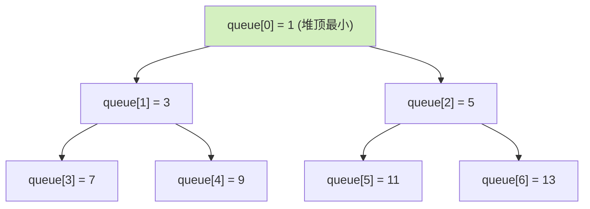
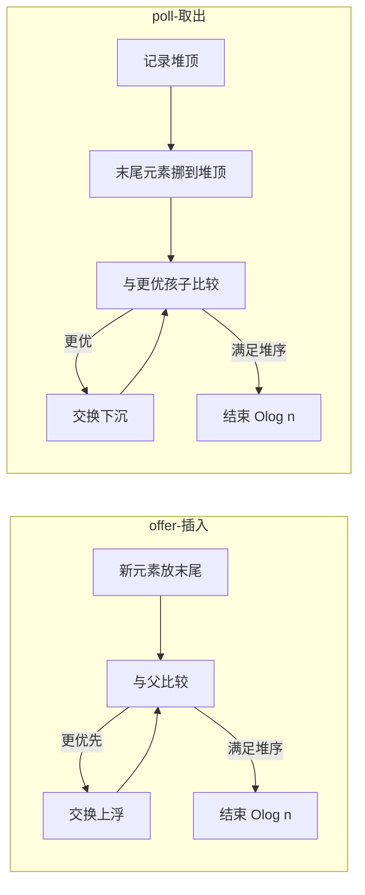

# Java PriorityQueue详解

> 版本基线：JDK **17.0.12** (LTS) | 创建日期：2026-08-06 | 实测日期：2026-08-09
> 受众：Java 后端开发。默认你熟悉 ArrayList/HashMap 的增删查，但「二叉堆」概念从零讲起——不假设你会。

## 📋 总纲

1. 是什么：基于二叉堆的优先队列，默认小顶堆
2. 为什么是堆（类比 + 图）
3. 常用方法详解（含边界行为）
4. 底层实现：siftUp / siftDown / 扩容
5. 构造方式：小顶堆 / 大顶堆 / 自定义比较器
6. 易错点（边界）
7. 经典应用场景
8. PriorityQueue vs TreeSet
9. 面试追问清单（带答案）

## 学习目标

学完本篇，你应当能够：

- 用一句话 + 一个生活类比向别人讲清 PriorityQueue 是什么、堆是什么
- 不看文档写出 5 种构造方式（小顶 / 大顶 / 对象字段 / 多字段 / 从集合）
- 画出示意图讲清 `offer` 的 siftUp 与 `poll` 的 siftDown 为什么都是 O(log n)
- 避开 6 个坑：迭代无序、元素不可比较、禁 null、线程不安全、无 decrease-key、同优先级顺序不稳定
- 徒手写出 Top-K（小顶堆）与数据流中位数（双堆）
- 说清 PriorityQueue vs TreeSet 的选型差异
- 答对 8 道面试追问

## 前置知识

本篇无硬性前置，会用 `List`/`Map` 的增删查即可。想深入容器扩容策略可对照阅读 [Caffeine Java缓存详解](../../三方库/Caffeine Java缓存详解.md)（同为 JDK 容器家族）。

## 核心知识点

### 知识点一：是什么——一句话记忆

- `java.util.PriorityQueue`，JDK 1.5 引入
- 底层是**二叉堆（binary heap）**，默认**小顶堆**：堆顶永远是最小值
- **一句话记忆：它只保证「第一名」最值，完全不保证第二、第三名——"只看第一名，不管第二名"。** 这是理解它一切行为的钥匙
- 线程不安全；不允许 null；无界队列（容量上限 `Integer.MAX_VALUE - 8`）

### 知识点二：为什么是堆——类比

> **类比：客服工单系统。** 工单按「优先级数字小的先处理」排队（小顶堆）。值班员只关心一件事：**当前最优先的是哪张**。新工单来了：先放到队尾，然后一路和上级比，比上级更优先就往上换（**siftUp 上浮**）；最优先的工单处理完，把队尾最后一张挪到队首，再一路往下找位置（**siftDown 下沉**）。
>
> 关键：值班员从不需要知道整队工单的全序——这正是堆比「完全有序的数组/链表」快的地方：插入删除只需要 O(log n) 次比较，而不是 O(n) 次。

堆结构（数组模拟完全二叉树，下标即父子关系）：



### 知识点三：常用方法详解（含边界行为）

#### 插入

| 方法 | 说明 | 空容器时 |
|------|------|---------|
| `offer(E e)` | 插入元素，成功返回 true（无界队列不会满） | — |
| `add(E e)` | 同 offer，Queue 接口语义是失败抛异常，PQ 无界所以基本等同 | — |

#### 取出

| 方法 | 说明 | 空容器时 |
|------|------|---------|
| `poll()` | 取并**移除**堆顶（最值），失败策略=返回哨兵 | **返回 null** |
| `remove()` | 同 poll，失败策略=抛异常 | **抛 NoSuchElementException** |
| `peek()` | **只看不移除**堆顶 | **返回 null** |
| `element()` | 同 peek | **抛 NoSuchElementException** |

> 面试点：`poll/peek` 空时返回 null，`remove/element` 空时抛异常——区别就是 **Queue 接口的两种失败策略**（返回哨兵值 vs 抛异常）。实测见文末。

#### 删除 / 查找（都是 O(n)，堆不是搜索结构）

| 方法 | 说明 |
|------|------|
| `remove(Object o)` | 删除指定元素，存在返回 true |
| `contains(Object o)` | 判断是否存在，线性扫描 |

#### 其他

| 方法 | 说明 |
|------|------|
| `size()` / `isEmpty()` | 元素个数 / 是否为空 |
| `clear()` | 清空（数组元素置 null，帮助 GC） |
| `iterator()` | 迭代器，**无序**（实测：`[1,2,3,5,4]`） |
| `toArray()` | 转数组，无序，需自行排序 |

#### 综合示例

```java
PriorityQueue<Integer> pq = new PriorityQueue<>();
pq.offer(5); pq.offer(1); pq.offer(3);

pq.peek();                        // 1  只看不删
pq.poll();                        // 1  取最小并删除
pq.element();                     // 3  空时抛异常
pq.remove(3);                     // true  按值删除（O(n)）
pq.contains(5);                   // true  O(n) 查找

// 正确的有序输出姿势：反复 poll
while (!pq.isEmpty()) {
    System.out.println(pq.poll()); // 按从小到大输出
}
```

### 知识点四：底层实现（siftUp / siftDown / 扩容）

内部是一个 `Object[] queue` 数组模拟完全二叉树，下标算父子：

```java
parent(i) = (i - 1) / 2
left(i)   = 2 * i + 1
right(i)  = 2 * i + 2
```

> **为什么用数组不用链表？** 完全二叉树天然适合数组——下标即父子关系，**不需要任何指针字段**，内存紧凑、缓存局部性好。链表存左右孩子指针反而空间翻倍还破坏缓存。

两个核心私有方法：

- **siftUp（插入时）**：新元素放数组末尾 → 与父节点比较，比父「更优先」就交换上浮，直到满足堆序
- **siftDown（poll 时）**：把末尾元素挪到堆顶 → 与两个孩子中「更优先」的比较，往下沉到正确位置



其他细节：

- 默认初始容量 11，满了走 `grow()` 扩容
- **扩容规则**：容量 < 64 时 `old + 2`，否则 1.5 倍（`old + (old >> 1)`），上限 `Integer.MAX_VALUE - 8`（实测验证见面试 8.7）
- 容量无上限，是**无界队列**；数组长度是堆的「存储水位」，`size` 才是实际元素数

### 知识点五：构造方式

```java
// 默认：小顶堆
PriorityQueue<Integer> pq = new PriorityQueue<>();

// 大顶堆（两种写法）
PriorityQueue<Integer> maxHeap = new PriorityQueue<>(Collections.reverseOrder());
PriorityQueue<Integer> maxHeap2 = new PriorityQueue<>((a, b) -> b - a); // 注意溢出风险！

// 防溢出写法（推荐，实测：b - a 在 MAX/MIN 时结果错误）
PriorityQueue<Integer> safe = new PriorityQueue<>((a, b) -> Integer.compare(b, a));

// 对象按字段排序
PriorityQueue<Task> tasks = new PriorityQueue<>(Comparator.comparingInt(Task::getPriority));

// 多字段排序：优先级相同再按时间
PriorityQueue<Task> multi = new PriorityQueue<>(
    Comparator.comparingInt(Task::getPriority).thenComparing(Task::getCreateTime));

// 从已有集合构造
PriorityQueue<Integer> fromList = new PriorityQueue<>(existingList);
```

### 知识点六：易错点与边界

1. **迭代无序**：只有 poll 序列有序，排序输出要 `while (!pq.isEmpty()) pq.poll()`
2. **元素必须可比较**：构造时没传 Comparator，元素必须实现 `Comparable`，否则 add 时 `ClassCastException`（实测）
3. **禁止 null**：`offer(null)` 直接 NPE（实测）
4. **线程不安全**：并发场景用 `PriorityBlockingQueue`（注意它也无界，`put` 不阻塞）
5. **没有 decrease-key**：Dijkstra 想更新已入队节点的优先级，用**惰性删除**——重复入队 + visited/距离数组判过期，poll 时跳过
6. **同优先级顺序不稳定**：JDK 不保证相等元素的先进先出（除非传带序号的 comparator）

## 最佳实践

- **预估容量**：知道大概数据量就指定初始容量，避免频繁 `grow()` 搬数组（O(n) 拷贝）
- **大顶堆一律用 `Integer.compare`**，别用 `b - a`（溢出坑有实测证据）
- **Top-K 取最大用「小顶堆」**维护 K 个元素，堆顶是门槛，比新元素小就替换——空间 O(K) 时间 O(n log K)
- **堆中元素做「更新优先级」用惰性删除**，不要试图 O(n) 扫描替换
- **并发场景**：`PriorityBlockingQueue`，但注意无界 + `put` 不阻塞，要有消费端兜底
- **迭代/序列化**：拿到的顺序不可依赖，要排序就用 poll 或自行 toArray 排序

## 常见踩坑

| 编号 | 坑 | 现象 | 解决方案 |
|------|-----|------|---------|
| #J1 | 迭代器/toArray 无序 | 遍历结果不是有序的 | 用 `while (!pq.isEmpty()) poll()` |
| #J2 | 元素不可比较 | `ClassCastException` | 传 Comparator 或实现 Comparable |
| #J3 | offer(null) | `NullPointerException` | 入队前判空 |
| #J4 | 线程不安全 | 并发下数据错乱 | `PriorityBlockingQueue` |
| #J5 | `(a,b) -> b - a` 溢出 | MAX/MIN 相减溢出，排序错误 | `Integer.compare(b, a)` |
| #J6 | 无 decrease-key | 更新优先级不生效 | 惰性删除（重复入队+判过期） |

## 经典应用场景

- **Top-K 问题**：维护大小为 K 的小顶堆，新元素比堆顶大就替换，O(n log K)
- **合并 K 个有序链表**：各链头入堆，poll 最小再补下一个
- **任务调度**：按优先级 / 截止时间取任务
- **Dijkstra / Prim**：配合惰性删除
- **数据流中位数**：大顶堆 + 小顶堆双堆，堆顶即中位数
- 延迟队列 `DelayQueue`、`ScheduledThreadPoolExecutor` 底层也是堆结构

### Top-K 完整示例（已实测）

```java
// 从数组取最大的 K 个数
public int[] topK(int[] nums, int k) {
    PriorityQueue<Integer> heap = new PriorityQueue<>(); // 小顶堆
    for (int n : nums) {
        heap.offer(n);
        if (heap.size() > k) heap.poll(); // 超过 K 就踢掉最小的
    }
    int[] res = new int[k];
    for (int i = 0; i < k; i++) res[i] = heap.poll();
    return res;
}
```

## PriorityQueue vs TreeSet

| 维度 | PriorityQueue | TreeSet |
|------|---------------|---------|
| 重复元素 | 允许 | 不允许 |
| 有序性 | 只保证堆顶 | 整体有序，可有序遍历 |
| 底层 | 数组 + 堆 | 红黑树 |
| 复杂度 | offer/poll O(log n) | 几乎所有操作 O(log n) |
| 查找 | 无按值查找 | ceiling/floor 范围查询 |
| 典型用途 | 取最值/调度 | 有序集合 |

> 选型一句话：**要「反复取最值 + 插入」用 PriorityQueue；要「有序遍历 + 范围查询」用 TreeSet。**

## 面试追问清单（带答案）

### Q1. 为什么用数组实现二叉堆，不用链表/指针？

A：完全二叉树天然适合数组——下标即父子关系（`(i-1)/2`、`2i+1`、`2i+2`），**不需要任何指针字段**，内存紧凑、缓存局部性好。链表实现反而要存左右孩子指针，空间翻倍还破坏缓存。

### Q2. 堆排序和 PriorityQueue 是什么关系？

A：底层是同一个结构——堆。堆排序 = 建堆（O(n)）+ 反复取堆顶（n 次 O(log n)）= O(n log n)。PriorityQueue 可以理解为**动态的、随时能往里加元素的堆**；而堆排序处理的是静态数组。

### Q3. 大顶堆怎么建？`(a, b) -> b - a` 有什么坑？

A：`Collections.reverseOrder()` 或 `(a, b) -> Integer.compare(b, a)`。坑：**`b - a` 可能整数溢出**——`Integer.MAX_VALUE` 和 `Integer.MIN_VALUE` 相减会溢出成负数，排序结果就错了（本机实测：两值入堆后 `poll()` 返回 -2147483648 而非 MAX_VALUE）。一律用 `Integer.compare` 或 `compareTo`。

### Q4. 自定义对象怎么排？

A：两条路：① 类实现 `Comparable<T>`，定义自然序；② 构造时传 `Comparator`，按字段排，如 `Comparator.comparingInt(Task::getPriority).thenComparing(...)` 多字段。优先用 Comparator——不改业务类、可组合、可复用。

### Q5. Top-K 为什么用堆而不用全量排序？

A：海量数据（如 10 亿个数取前 100）内存根本放不下全量排序。堆只维护 **K 个元素**，空间 O(K)，时间 O(n log K)；全量排序要 O(n log n) 时间和 O(n) 空间。K 远小于 n 时优势巨大。

### Q6. PriorityQueue 和 DelayQueue / ScheduledThreadPoolExecutor 什么关系？

A：`DelayQueue` 内部持有一个 `PriorityQueue`，按**到期时间**排序，`take()` 时先看队头有没有到期，没到就等。`ScheduledThreadPoolExecutor` 的延迟任务队列（`DelayedWorkQueue`）本质也是堆 + 延迟判定。所以堆结构是延迟调度的基础设施。

### Q7. PriorityQueue 扩容机制？

A：容量 < 64 时 `old + 2`；之后 1.5 倍扩容（`old + (old >> 1)`）；上限 `Integer.MAX_VALUE - 8`。扩容要 `Arrays.copyOf` 搬数组，频繁扩容有开销，**预估量大可指定初始容量**。

### Q8. 怎么判断堆顶是最小还是最大？

A：默认（无 Comparator / 自然序）是**小顶堆**，堆顶最小；传 `reverseOrder()` 或反序 Comparator 就是**大顶堆**。面试写题前先确认题意要最大还是最小——Top-K 取最大用**小顶堆**（维护 K 个最大者，堆顶是最小那个门槛）。

## 小结

- PriorityQueue = 数组模拟的二叉堆，默认小顶堆，**只保证堆顶最值**（一句话记忆："只看第一名"）
- 插入 siftUp、取出 siftDown，都是 O(log n)；查找/按值删除 O(n)
- 5 种构造要会写；大顶堆禁用 `b - a`（溢出有实测证据）
- 6 个坑：迭代无序 / 不可比较 / 禁 null / 线程不安全 / 无 decrease-key / 顺序不稳定
- 高频应用：Top-K、合并 K 链表、任务调度、Dijkstra、双堆中位数

## 相关笔记

- [Caffeine Java缓存详解](../../三方库/Caffeine Java缓存详解.md) — 同为 JDK 容器家族的缓存实现（LRU 思想可对比）
- 集合系列其余笔记（ArrayDeque / LinkedList 对比）待补充 📌

## 🧪 本机实测（2026-08-09）

> 环境：JDK 17.0.12 (LTS)，jshell 逐条执行。全部结论基于真实输出。

| 验证点 | 命令 | 真实输出 | 结论 |
|--------|------|---------|------|
| 小顶堆取最小 | `offer(5,1,3)` + `peek()`/`poll()` | peek=1, poll=1 | 堆顶最小 ✓ |
| 空容器 poll/peek | 新建空 PQ 直接调用 | `null` / `null` | 失败策略=返回哨兵 ✓ |
| 空容器 remove/element | 同上 | `NoSuchElementException` | 失败策略=抛异常 ✓ |
| 迭代无序 | 5 元素 `new ArrayList<>(pq)` | `[1, 2, 3, 5, 4]` | 迭代器不保证有序 ✓ |
| poll 有序 | `while(!isEmpty) poll()` | `1 2 3 4 5` | 只有 poll 序列有序 ✓ |
| **溢出坑** | 大顶堆 `(a,b)->b-a`，入 MAX_VALUE/MIN_VALUE 后 poll | **-2147483648**（应为 MAX_VALUE） | **b-a 溢出导致排序错误，实锤** ⚠️ |
| 禁 null | `offer(null)` | `NullPointerException` | 不可存 null ✓ |
| 不可比较 | `class Foo{}` 入堆 | `ClassCastException` | 必须可比较/传 Comparator ✓ |
| Top-K 示例 | `{3,9,1,7,5,8,2,6}` k=3 | `[7, 8, 9]` | 算法正确 ✓ |