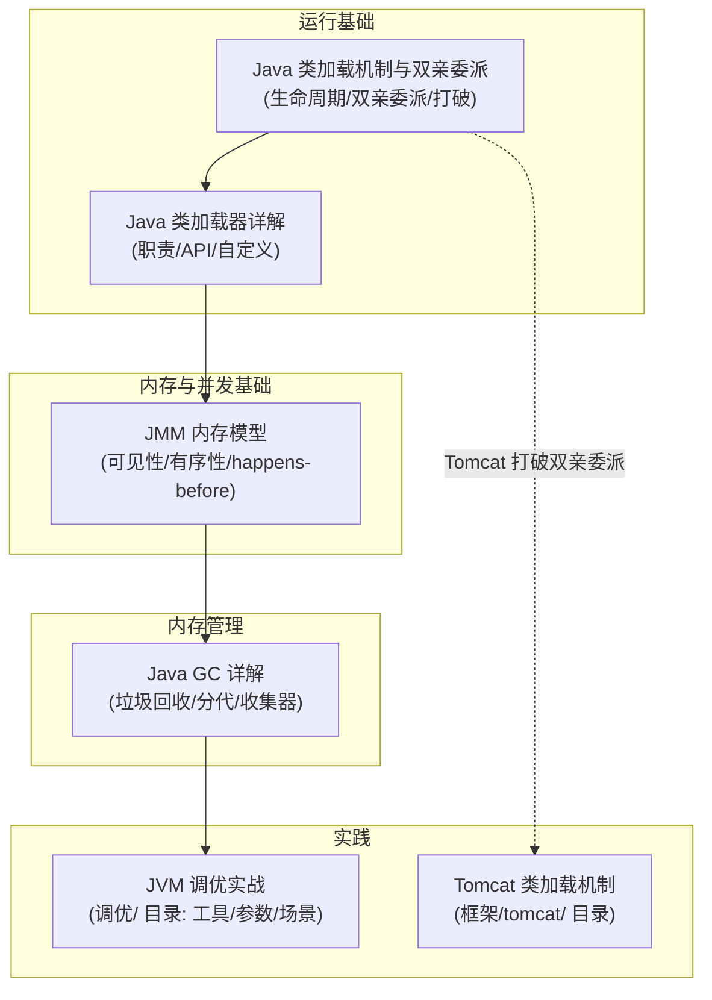

# 00-JVM总览

> 版本基线：2026-08 整理，JVM 知识收敛（类加载/内存模型/GC 归入 JVM/ 目录）
> 受众：Java 后端开发，需要一张 JVM 知识地图。
> 关联笔记：本目录全部篇目 + 调优/Tomcat 互链

## 📋 总纲

- 1. JVM 知识地图
- 2. 各篇导航与阅读顺序
- 3. 与相邻目录的关系
- 4. 常见面试考点索引

## 学习目标

学完本篇你能：

1. 画出 JVM 知识体系（类加载 → 内存模型 → GC → 调优）
2. 知道每类 JVM 知识在哪篇
3. 规划 JVM 学习路径
4. 快速定位"某个 JVM 问题该看哪篇"

## 前置知识

- 本篇为总览索引，无前置；各篇内部有前置说明

---

## 1. JVM 知识地图

**主线**：类加载（代码怎么进来）→ JMM（并发内存语义）→ GC（内存怎么回收）→ 调优（出了问题怎么办）。

---

## 2. 各篇导航与阅读顺序

| 顺序 | 篇目 | 内容 | 位置 |
|---|---|---|---|
| 1 | [Java类加载机制与双亲委派详解](Java类加载机制与双亲委派详解.md) | 生命周期/双亲委派/打破 | JVM/（从核心机制/移入） |
| 2 | [Java类加载器详解](Java类加载器详解.md) | 职责/API/自定义加载器 | JVM/（从核心机制/移入） |
| 3 | [JMM内存模型详解](JMM内存模型详解.md) | 主内存/工作内存/happens-before | JVM/（从并发/移入） |
| 4 | [Java GC详解](Java GC详解.md) | 垃圾回收/分代/收集器 | JVM/ |
| 5 | [JVM调优实战](JVM调优实战.md) | 工具/参数/场景 | JVM/（原调优/，并入） |
| 6 | [Arthas在线诊断](Arthas在线诊断.md) | 在线诊断工具/核心命令 | JVM/（原调优/，并入） |

**推荐阅读顺序**：类加载 → JMM → GC（原理）→ JVM 调优实战（实践）→ Arthas（线上诊断）。

---

## 3. 与相邻目录的关系

| 目录 | 内容 | 与 JVM 的关系 |
|---|---|---|
| **JVM/**（本篇） | 类加载/JMM/GC/调优/在线诊断 | JVM 核心机制 + 实践（含 [JVM调优实战](JVM调优实战.md)、[Arthas在线诊断](Arthas在线诊断.md)）|
| **框架/tomcat/** | Tomcat 类加载机制剖析+详解 | Tomcat 打破双亲委派（互链 Tomcat 类加载）|
| **JDK基础库/并发** | 多线程/JUC/线程池 | 并发工具（[Java volatile详解](../JDK基础库/并发/Java volatile详解.md) 等与 JMM 关联）|

> 📌 **归档说明**：类加载 2 篇原在 核心机制/（现并入 JDK基础库/），因属 JVM 生命周期话题移入本目录；JMM 原在 并发/，因属 JVM 规范话题（JSR-133）移入本目录；原本定位的`调优/`目录（JVM调优实战、Arthas在线诊断）并回 JVM/，作为调优/诊断实践；JDK基础库/并发 承接多线程/JUC（volatile 等与 JMM 关联）。Obsidian 按文件名解析，原互链不受影响。

---

## 4. 常见面试考点索引

| 考点 | 答案所在 |
|---|---|
| 类加载生命周期？ | [Java类加载机制与双亲委派详解](Java类加载机制与双亲委派详解.md) |
| 双亲委派模型？为什么要打破？ | [Java类加载机制与双亲委派详解](Java类加载机制与双亲委派详解.md) |
| 自定义类加载器怎么做？ | [Java类加载器详解](Java类加载器详解.md) |
| JMM 是什么？可见性根源？ | [JMM内存模型详解](JMM内存模型详解.md) |
| happens-before 规则？ | [JMM内存模型详解](JMM内存模型详解.md) |
| GC 分代回收？收集器选型？ | [Java GC详解](Java GC详解.md) |
| 堆 OOM/GC 频繁怎么排查？ | [JVM调优实战](JVM调优实战.md)（调优/） |
| Tomcat 为什么破坏双亲委派？ | [05-Tomcat类加载机制剖析](../框架/网络底座/Web服务器/tomcat/05-Tomcat类加载机制剖析.md)（tomcat/） |

## 相关笔记（导航）

- JVM 系列：[Java类加载机制与双亲委派详解](Java类加载机制与双亲委派详解.md) / [Java类加载器详解](Java类加载器详解.md) / [JMM内存模型详解](JMM内存模型详解.md) / [Java GC详解](Java GC详解.md)
- 调优实践：[JVM调优实战](JVM调优实战.md) / [Arthas在线诊断](Arthas在线诊断.md)（调优/ 目录）
- 并发关联：[Java volatile详解](../JDK基础库/并发/Java volatile详解.md) / [00-并发编程总览](../JDK基础库/并发/00-并发编程总览.md)（并发/ 目录）
- 框架关联：[05-Tomcat类加载机制剖析](../框架/网络底座/Web服务器/tomcat/05-Tomcat类加载机制剖析.md) / [06-Tomcat类加载机制详解](../框架/网络底座/Web服务器/tomcat/06-Tomcat类加载机制详解.md)（框架/tomcat/ 目录）

## 参考资料

- [JVM 规范（Java SE 17）](https://docs.oracle.com/javase/specs/jvms/se17/html/)，查询日期：2026-08-09
- [JavaGuide: JVM](https://javaguide.cn/java/jvm/)，查询日期：2026-08-09
