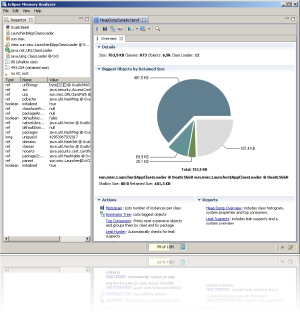

# JVM调优实战（场景 / 工具 / 参数速查）

## 📋 总纲

1. 调优方法论：先测量后调优、三角目标、一次只改一个参数
2. 工具链：jps / jstat / jmap / jstack / jcmd / Arthas / JFR / GC 日志（含本机实战 + 补充知识：SoftMaxHeapSize 陷阱 / 命令版本差异 / 内存三层次 / MAT 堆分析 / jcmd 专题 / JFR 专题）
3. 典型场景收集：堆 OOM、堆外 OOM、GC 频繁/停顿、CPU 100%、死锁、元空间溢出、线程创建失败、栈溢出、池参数不当
4. 关键参数速查表（默认值 + 适用场景）
5. 最佳实践：生产 JVM 启动配置（通用命令 / 逐条解释 / 场景变体）
6. JIT 编译优化与代码级手段：逃逸分析、TLAB、避免过度调优
7. 面试追问 Q&A

---

## 1. 调优方法论

### 1.1 先测量，后调优

- **不要凭感觉调参**：先拿到 GC 日志、内存/CPU 指标，定位瓶颈在哪（GC？锁？业务？IO？）
- 90% 的"JVM 问题"其实不是 JVM 参数问题，而是代码问题（泄漏、死循环、SQL、缓存）——先排代码，再排参数
- 步骤：现象收集 → 数据测量 → 定位根因 → 针对性调整 → 验证对比（前后都要有数据）

### 1.2 三角目标：延迟 / 吞吐 / 内存

| 目标 | 指标 | 手段 | 代价 |
|---|---|---|---|
| 低延迟 | STW 停顿时间 | CMS/G1/ZGC、调小停顿目标 | 吞吐下降、内存占用增 |
| 高吞吐 | GC 总时间占比 | Parallel、调大堆 | 单次停顿变长 |
| 省内存 | 堆大小 | 调小 -Xmx | GC 更频繁 |

**没有最优参数，只有适合场景的折中**。先确定你的业务要哪个，再选收集器和参数。

### 1.3 三条铁律

a. 一次只改一个参数，改完必须验证（前后对比 GC 日志/监控）
b. 上线前用压测/仿真流量验证，别在生产直接调
c. 所有变更留档（改了什么、为什么、效果如何），方便回滚

---

## 2. 工具链

| 工具       | 作用                | 常用命令                                                                            | 什么时候用                          |
| -------- | ----------------- | ------------------------------------------------------------------------------- | ------------------------------ |
| `jps`    | 列 Java 进程         | `jps -l`                                                                        | 找目标 PID                        |
| `jstat`  | 看 GC/类加载统计        | `jstat -gcutil <pid> 1000`                                                      | GC 频繁、内存趋势                     |
| `jmap`   | 堆转储/堆信息           | `jmap -heap <pid>`、`jmap -histo <pid>`、`jmap -dump:format=b,file=x.hprof <pid>` | OOM、泄漏分析                       |
| `jstack` | 线程栈               | `jstack <pid>`                                                                  | CPU 高、死锁、线程卡住                  |
| `jcmd`   | 综合诊断（JDK 8+）      | `jcmd <pid> GC.heap_info`、`jcmd <pid> Thread.print`                             | jmap/jstack 的现代替代              |
| `Arthas` | 线上诊断神器            | `dashboard`、`thread -n 3`、`heapdump`、`trace`                                    | 生产不重启排查（📌 详见 [Arthas在线诊断](Arthas在线诊断.md)） |
| `JFR`    | 飞行记录器（JDK 11+ 免费） | `jcmd <pid> JFR.start duration=60s`                                             | 全面性能画像                         |
| GC 日志    | 一切 GC 问题的源头       | JDK9+: `-Xlog:gc*:file=gc.log:time,uptime`                                      | 长期观察                           |

> 生产注意：jmap -dump 和 jstat -histo:live 会触发 Full GC（STW），高峰期慎用；优先 JFR + GC 日志。

### 2.1 工具本机实战（IDEA 32039，点击展开）

> 📌 本节 6 个折叠块是本机实测的命令解释；涉及的工具使用**补充知识（参数陷阱、命令版本差异等）见下方 2.2**。

> [!note]- jstat -gcutil（GC 使用率统计，逐列解读）
>
> **命令**：`jstat -gcutil <pid> 1000`（每 1000ms 刷一次，Ctrl+C 停止）
>
> **输出示例**——本机 IntelliJ IDEA 主进程（PID 32039，IDEA 开着空放时的真实数据）：
>
> ```
> S0     S1     E      O      M     CCS    YGC     YGCT     FGC    FGCT     CGC    CGCT       GCT
>  -      -  81.87  84.29  98.19  95.04     43     0.530     1     0.195    28     0.170     0.895
> ```
>
> **各列含义**：
>
> | 列 | 全称 | 含义 | 本示例解读 |
> |---|---|---|---|
> | S0 / S1 | Survivor 0 / 1 | 两个幸存区使用率(%) | `-` 表示**当前没有该区**——G1 动态管理，只保留一个 Survivor，另一个为空则显示 `-` |
> | E | Eden | 新生代 Eden 使用率(%) | 81.87% 接近满，Eden 满就触发下一次 Minor GC |
> | O | Old | 老年代使用率(%) | 84.29% 偏高——IDEA 启动加载了大量长生命周期对象 |
> | M | Metaspace | 元空间使用率(%) | **98.19%，快满了**——IDEA 插件体系加载类极多，IDE 类应用常态 |
> | CCS | Compressed Class Space | 压缩类空间使用率(%) | 95.04%，类元数据占用大 |
> | YGC | Young GC Count | Minor GC 总次数 | 43 次 |
> | YGCT | Young GC Time | Minor GC 总耗时(秒) | 0.530s → 平均每次 ~12ms，正常水平 |
> | FGC | Full GC Count | Full GC 总次数 | 1 次 |
> | FGCT | Full GC Time | Full GC 总耗时(秒) | 0.195s → 单次 195ms，可接受 |
> | CGC | Concurrent GC Count | 并发 GC 周期数 | **28 次 → 说明该 JVM 用的是 G1**（G1 专属列） |
> | CGCT | Concurrent GC Time | 并发 GC 总耗时(秒) | 0.170s（并发阶段不 STW，不卡业务） |
> | GCT | Total GC Time | GC 总耗时(秒) | 0.895s（进程启动至今） |
>
> **怎么读**：
>
> a. **先确认收集器**：有 CGC/CGCT 列且有值 = G1（JDK 9+ 默认）；JDK 8 默认 Parallel 没有这两列
> b. **E 接近 100% 是正常的**：Eden 满就 Minor GC，不是问题；真正要警惕的是 **O 持续涨到顶 + FGC 次数频繁**
> c. **M 高但 FGC 不涨 = 元空间够用**；若 M 持续上涨且伴随 FGC → 类加载泄漏（动态代理/热部署）
> d. **健康度速判**：YGC 频繁但单次 <50ms 正常；FGC 分钟级多次才是大问题；GCT 看累计占比
> e. **二次采样看趋势**：连续刷几次，若 O 只涨不降 → 老年代泄漏嫌疑；E 稳定波动 → 正常
>
> **补充 `jstat -gccapacity`**（看各区**容量**，单位 KB）：
>
> ```
> NGCMN  NGCMX   NGC  S0C  S1C    EC  OGCMN  OGCMX   OGC    OC   MCMN  MCMX   MC ...
>  0.0 1048576.0 205824.0 0.0 14336.0 191488.0 0.0 1048576.0 454656.0 454656.0 0.0 1441792.0 393472.0 ...
> ```
>
> - NGCMX=1048576KB（1GB）= 新生代**最大**；OGCMX=1048576KB（1GB）= 老年代**最大**——注意这俩是**各自的上限**，真正的堆上限看 `-Xmx`
> - MC=393472KB ≈ 384MB = 元空间**已用**；MCMX=1441792KB ≈ 1.4GB = 元空间上限
>
> **实锤收集器与堆大小**（`jcmd <pid> VM.flags | grep ...`）：
>
> ```bash
> jcmd 32039 VM.flags | tr ' ' '\n' | grep -iE "MaxHeapSize|InitialHeapSize|SoftMaxHeapSize"
> # 输出: -XX:InitialHeapSize=134217728   -XX:MaxHeapSize=1073741824   -XX:SoftMaxHeapSize=1073741824
> jps -lv | grep -i idea | head -1
> # 输出: ... -Xms128m -Xmx2048m ...
> ```
>
> - `UseG1GC` → 确认 G1，与 CGC 列互相印证
> - **启动参数 ≠ 实际生效值**（重要陷阱）：`jps -v` 看到 `-Xmx2048m`（2GB），但 `jcmd VM.flags` 显示 `MaxHeapSize=1073741824`（1GB）——因为 IDEA 用 **JBR（JetBrains Runtime, JDK 25.0.3）**，带 `SoftMaxHeapSize` 动态堆机制，把堆软限制在 1GB 省内存。**排查内存问题时要两个都看**：`jps -v` 看配置意图，`jcmd VM.flags` 看实际生效值
>
> **IDEA 空放示例的观察结论**：
>
> a. 空放着不动也有 43 次 Minor GC + 28 次并发 GC——JVM 后台持续有工作（JIT 编译、懒加载、内存整理），**不代表异常**
> b. Metaspace 98% 是 IDE 类应用的特征（插件类多），不是泄漏；如果业务应用 M 飙到 98% 就要警惕了
> c. O 84% + 已发生 1 次 FGC（195ms）→ IDE 长时间用建议给足 `-Xmx`（IDEA 在 idea.vmoptions 里调），堆小了会频繁 Full GC 卡顿

> [!note]- jstack（线程栈：看线程数、死锁、CPU 高定位）
> 命令：
> ```bash
> jstack 32039 | grep -c '^"'        # 数线程数
> jstack 32039 | head -20            # 看线程 dump 头部
> jstack 32039 > /tmp/jstack.txt     # 存文件再慢慢翻
> ```
> 本机实测输出（线程数 + 3 个典型线程的完整栈）：
> ```
> 125                                    ← 该 JVM 共 125 个线程
> Full thread dump OpenJDK 64-Bit Server VM (25.0.3+9-b329.124 ...)
>
> "main" #3 ... nid=7171 waiting on condition
>    java.lang.Thread.State: TIMED_WAITING (parking)
> 	at jdk.internal.misc.Unsafe.park(java.base@25.0.3/Native Method)
> 	- parking to wait for  <0x00000007c0300000> (a kotlinx.coroutines.BlockingCoroutine)
> 	at java.util.concurrent.locks.LockSupport.parkNanos(...)
> 	at kotlinx.coroutines.BlockingCoroutine.joinBlocking(...)
> 	at com.intellij.idea.Main.mainImpl(Main.kt:75)   ← IDEA 主线程在等协程
>
> "Reference Handler" #16 ... nid=24579 waiting on condition
>    java.lang.Thread.State: RUNNABLE
> 	at java.lang.ref.Reference.waitForReferencePendingList(Native Method)
> 	at java.lang.ref.Reference.processPendingReferences(...)
>
> "Finalizer" #17 ... nid=29955 in Object.wait()
>    java.lang.Thread.State: WAITING (on object monitor)
> 	at java.lang.Object.wait0(Native Method)
> 	at java.lang.ref.ReferenceQueue.remove0(...)
> ```
> 解读：
> ① `grep -c '^"'` 数出 125 个线程——IDEA 这种 IDE 线程多是正常的（插件、索引、后台任务）
> ② 头部显示 **JBR（JetBrains Runtime）JDK 25.0.3**，不是普通 OpenJDK——IDEA 自带运行时
> ③ **怎么读线程栈**（重点）：
>    - `java.lang.Thread.State`：线程状态——RUNNABLE（执行中）/ TIMED_WAITING（限时等待）/ WAITING（无限等待）/ BLOCKED（等锁）/ NEW / TERMINATED
>    - **BLOCKED 才是锁竞争**：多个线程 BLOCKED 且指向同一把锁 = 锁竞争/死锁信号
>    - TIMED_WAITING / WAITING 是"正常休息"（等 IO、等任务、sleep），不是问题
>    - 栈底往上读：最上面是"正在等什么"，往下是"谁发起的调用"
> ④ 死锁排查：`jstack <pid> | grep -A 15 "deadlock"`（jstack 会在末尾直接打印 Found one Java-level deadlock）；CPU 高定位：`top -Hp <pid>` 找线程号转 16 进制再 grep（见 3.4）
> ⑤ 实测里的彩蛋：main 线程停在 `kotlinx.coroutines` 协程上、Reference Handler 处理引用队列、Finalizer 等 finalize——**JVM 的基础线程（Reference/Finalizer）永远在，别当异常**

> [!note]- jcmd（综合诊断：jmap/jstack 的现代替代）
> 命令：
> ```bash
> jcmd 32039 GC.heap_info                     # 堆使用情况（替代 jmap -heap）
> jcmd 32039 GC.class_histogram | head -10    # 类实例直方图（替代 jmap -histo）
> jcmd 32039 VM.flags | tr ' ' '\n' | grep -i maxheap   # 实际生效参数
> jcmd 32039 Thread.print                     # 线程 dump（替代 jstack）
> ```
> 本机实测 GC.heap_info 输出：
> ```
> garbage-first heap   total reserved 1048576K, committed 660480K, used 341731K
>  region size 1024K, 41 young (41984K), 5 survivors (5120K)
> ```
> 解读：
> ① `garbage-first heap` → 确认 G1
> ② reserved 1GB / committed 645MB / used 333MB——**reserved**（预留）> **committed**（已提交）> **used**（实际用），G1 按需提交内存
> ③ region 1024K → G1 Region 大小 1MB；41 个年轻代 region + 5 个 survivor region
> ④ **jcmd 不触发 Full GC**（GC.class_histogram 不带 :live），比 jmap 更安全，生产首选

> [!note]- jmap（堆转储 / 类直方图 / 堆配置）
> 命令与新版 JDK 的坑：
> ```bash
> jmap -heap <pid>      # ❌ JDK 8 可用，新版 JDK 已废弃！
>                       # 报错: Error: -heap option used ... Use jhsdb jmap instead
> jmap -histo <pid> | head -20    # 类直方图（不带 :live 不触发 Full GC）
> jmap -dump:format=b,file=heap.hprof <pid>   # 堆转储（会 STW，高峰期慎用）
> ```
> 本机实测 `jmap -histo 32039` top 5（JDK 17 的 jmap attach 到 JBR 25 进程，可正常执行）：
> ```
>  num     #instances         #bytes  class name (module)
> -------------------------------------------------------
>    1:       1544190      102395528  [B (java.base@25.0.3)
>    2:       5127589       82041424  java.lang.Integer (java.base@25.0.3)
>    3:       2553861       61292664  kotlin.Pair
>    4:        294827       34041744  [I (java.base@25.0.3)
>    5:         30269       33092560  [J (java.base@25.0.3)
> ```
> 解读：
> ① byte[] 排第一是典型特征——缓存、IO 缓冲、网络数据都落在这
> ② **Integer 512 万个（82MB）**：IDEA 内部大量用 Integer 做缓存/索引键；`kotlin.Pair` 255 万个——IDEA 是 Kotlin 写的，内存里全是 Kotlin 数据结构的痕迹
> ③ **⚠️ 数据是动态的**：同一进程不同时刻采样，top N 和数值都会变（本笔记另一处 jcmd class_histogram 采到的 top1 是 [B 90 万/65MB，就是几分钟前的老数据）——**对比分析要用同一时刻的采样**，别拿两次不同时间的数据直接比
> ④ **JDK 9+ 的 jmap -heap 已移除**，用 `jcmd <pid> GC.heap_info` 替代——这也是面试常考"新老命令差异"

> [!note]- jps -lv（列进程 + 启动参数）
> 命令：
> ```bash
> jps -lv | grep -i idea | head -1
> ```
> 本机实测输出：
> ```
> 32039 com.intellij.idea.Main ... -Xms128m -Xmx2048m -XX:ErrorFile=/Users/lub/java_error_in_idea_%p.log ...
> ```
> 解读：
> ① `-l` 显示全限定主类名（com.intellij.idea.Main），`-v` 显示启动参数
> ② `-Xms128m -Xmx2048m`：IDEA 配置的堆范围——**但实际生效不是 2GB！**
> ③ 还能看到 `-XX:ErrorFile` 等 IDEA 自动加的兜底参数——**看启动参数最快的方式就是 jps -v**
>
> **⚠️ 启动参数 ≠ 实际生效值（重要陷阱）**：
>
> ```bash
> # jps -v 看到：-Xms128m -Xmx2048m（配置意图 2GB）
> # 但用 jcmd 查实际生效：
> jcmd 32039 VM.flags | tr ' ' '\n' | grep -iE "MaxHeapSize|SoftMaxHeapSize"
> # 输出: -XX:MaxHeapSize=1073741824   -XX:SoftMaxHeapSize=1073741824   ← 实际只有 1GB！
> ```
>
> 原因：IDEA 用 **JBR（JetBrains Runtime, JDK 25.0.3）**，带 `SoftMaxHeapSize` 动态堆机制，把堆"软限制"在 1GB 省内存（`-Xmx` 只是上限，SoftMaxHeapSize 才是实际目标）。
>
> **排查内存问题时要两个都看**：`jps -v` 看配置意图，`jcmd VM.flags` 看实际生效值——只看 jps 会被误导以为有 2GB 可用。

> [!note]- JFR（飞行记录器：JDK 11+ 免费的性能画像）
> 命令：
> ```bash
> jcmd 32039 JFR.start duration=5s filename=/tmp/idea_5s.jfr
> sleep 6   # 等录制完成
> ls -lh /tmp/idea_5s.jfr
> # 用 jmc（JDK Mission Control）打开分析：GC/CPU/内存/IO 全画像
> ```
> 本机实测输出：
> ```
> Started recording 1. The result will be written to: /tmp/idea_5s.jfr
> -rw-r--r--  lub  wheel  3.4M  /tmp/idea_5s.jfr   ← 5 秒录了 3.4MB
> ```
> 解读：
> ① 5 秒就 3.4MB——JFR 采样密度高，信息量大（方法采样、分配、锁竞争全记录）
> ② **JFR 对运行中 JVM 影响极小**（<1% 开销），生产可开；对比 jmap -dump 的 Full GC，安全得多
> ③ 它是"找不到问题在哪"时的终极武器：开 1 小时 JFR 回放，比盯实时监控高效
> 📌 JFR 的完整专题（安装澄清 / 三种录制方式 / 文件分析 / 定位对比）见 2.4

---

### 2.2 补充知识（参数陷阱 / 概念澄清 / 最佳实践）

> 📌 工具使用中容易踩的坑和值得深挖的概念，统一放这里；正文 2.1 的命令块引用本节的对应知识点。

> [!note]- 2.2.1 SoftMaxHeapSize 陷阱：启动参数 ≠ 实际生效值
>
> **现象回顾**（本机 IDEA 32039 实测）：
>
> ```bash
> jps -lv | grep -i idea | head -1
> # -Xms128m -Xmx2048m ...                          ← 配置意图：堆 2GB
> jcmd 32039 VM.flags | tr ' ' '\n' | grep -iE "MaxHeapSize|SoftMaxHeapSize"
> # -XX:MaxHeapSize=1073741824                       ← 实际生效：1GB！
> # -XX:SoftMaxHeapSize=1073741824                   ← JBR 设的软限制
> ```
>
> **为什么 JBR 会这样**：IDEA 用 **JBR（JetBrains Runtime, JDK 25.0.3）**，不是普通 OpenJDK——它带**动态堆机制**（`-XX:JbrShrinkingGcMaxHeapFreeRati...` 这类参数），主动设置 `SoftMaxHeapSize=1GB` 来限制 IDE 内存占用（省内存）。普通 OpenJDK 生产环境不会有这层"隐形干预"。
>
> **SoftMaxHeapSize 是什么**（JDK 12 引入，JEP 346）：
> a. 它是 G1/ZGC 的**软上限**：GC 会尽量把堆控制在它以内，堆空闲时积极把内存**归还给操作系统**（省内存）
> b. 但它是"软"的——对象真放不下时可以**临时突破**，一直涨到 `MaxHeapSize`（硬上限）
> c. 所以恒有：`SoftMaxHeapSize ≤ MaxHeapSize`
>
> **关键结论：线上 `-Xms = -Xmx` 时默认不会不一致**：
> - SoftMaxHeapSize 的**默认值 = MaxHeapSize（-Xmx 的值）**
> - 线上配 `-Xms4g -Xmx4g` → MaxHeapSize=4g，SoftMaxHeapSize 默认也=4g，三者一致
> - 不一致只在**有人显式改它**时才出现
>
> **什么时候会"实际 < 配置"**：
> a. **自定义运行时**主动设置（JBR 这种 IDE 运行时最常见）
> b. **显式配了 `-XX:SoftMaxHeapSize`**（少见但存在，某些框架/运维脚本会设）
> c. **容器 + `MaxRAMPercentage`**：只配 `-XX:MaxRAMPercentage=75` 没配 `-Xmx` → MaxHeapSize 按容器内存算，而初始堆很小（默认约 1/64）→ 启动时"实际生效"远小于你以为的
> d. **wrapper 脚本/JDK 被改参数**（部署时被二次加工）
>
> **生产最佳实践**：
> a. `-Xms = -Xmx` 固定堆，避免扩容抖动（你的做法是对的）
> b. **上线后必须验证实际生效值**，别只看启动脚本：
>
> ```bash
> jcmd <pid> VM.flags | tr ' ' '\n' | grep -iE "MaxHeapSize|SoftMaxHeapSize|InitialHeapSize"
> # 三个值都确认，一行命令防止被容器/脚本/JDK 特性"篡改"
> ```
>
> c. 排查内存问题时两个都要看：`jps -v` 看配置意图，`jcmd VM.flags` 看实际生效值——只看 jps 会被误导以为堆很大
>

> [!note]- 2.2.2 命令版本差异：新 JDK 下哪些命令变了
>
> | 想做什么 | JDK 8 的老命令 | JDK 9+ 推荐 | 差异说明 |
> |---|---|---|---|
> | 看堆配置 | `jmap -heap <pid>` | `jcmd <pid> GC.heap_info` | **jmap -heap 已废弃**，报错提示用 `jhsdb jmap` |
> | 看类实例直方图 | `jmap -histo <pid>` | `jcmd <pid> GC.class_histogram` | 等价；都不带 `:live` 则**不触发 Full GC** |
> | 线程 dump | `jstack <pid>` | `jcmd <pid> Thread.print` | 等价 |
> | GC 日志 | `-XX:+PrintGCDetails -XX:+PrintGCDateStamps` | `-Xlog:gc*:file=gc.log:time,uptime,level` | JDK 9+ 统一 `-Xlog` 语法 |
> | 堆转储 | `jmap -dump:format=b,file=x.hprof <pid>` | 同左（保留） | **会触发 Full GC（STW）**，高峰期慎用 |
>
> **记忆口诀**：
> a. **诊断类命令统一走向 jcmd**：heap_info / class_histogram / Thread.print / VM.flags 全能干
> b. **jmap 只留 dump**：`-histo:live` 和 `-heap` 在新 JDK 都是坑（前者触发 Full GC，后者已废弃）
> c. **GC 日志语法变了**：面试常考"JDK 8 的 PrintGCDetails 到 JDK 9+ 怎么配"→ 答 `-Xlog:gc*`
>

> [!note]- 2.2.3 内存三个层次：reserved / committed / used
>
> **现象**（本机 jcmd GC.heap_info 实测）：
>
> ```
> garbage-first heap   total reserved 1048576K, committed 660480K, used 341731K
> ```
>
> **三层含义**（从大到小恒成立）：
>
> | 层次 | 含义 | 本机实测 | 类比 |
> |---|---|---|---|
> | reserved（预留） | JVM 向 OS 申请的**地址空间上限**（= -Xmx） | 1GB | 圈了地皮 |
> | committed（已提交） | 实际分配、可使用的内存 | 645MB | 盖了楼 |
> | used（已使用） | GC 认为正在使用的部分 | 333MB | 住了人 |
>
> **要点**：
> a. G1 按需提交内存：reserved 不花钱，committed 才占物理内存——所以**堆配 4G 不代表立刻占 4G 物理内存**
> b. 排查"JVM 占内存比 -Xmx 还多"时：看 committed + 堆外（Metaspace/直接内存/线程栈），不是 used
> c. 线上看趋势：`used` 持续逼近 `committed` 且 committed 逼近 reserved → 堆快满，准备调大或查泄漏

> [!note]- 2.2.4 MAT 分析堆转储：jmap -dump 之后的完整链路
> **为什么需要 MAT**：jmap -dump 导出的 `.hprof` 是二进制堆快照，人眼没法直接看——MAT（Eclipse Memory Analyzer）是分析它的标准工具，能自动找泄漏嫌疑、看大对象被谁持有。
>
> **① 导出堆转储**：
> ```bash
> # 生产上推荐启动参数自动转储（OOM 时自动生成，不用人工干预）：
> #   -XX:+HeapDumpOnOutOfMemoryError -XX:HeapDumpPath=/data/dumps/
> # 手动导出（会 STW，高峰期慎用）：
> jmap -dump:format=b,file=heap.hprof <pid>
> ```
>
> **② 下载安装 MAT**（Mac，官方 https://eclipse.dev/mat/download/ ）：
> - Intel Mac：MemoryAnalyzer-1.17.0.20260601-macosx.cocoa.x86_64.dmg（约 100MB+）
> - Apple Silicon：...aarch64.dmg
> - 解压即用（RCP 应用，不需要额外安装），首次启动选工作区目录
> - 需要 JDK 17+ 运行（本机已有）；若启动提示找不到 JVM，编辑 `MemoryAnalyzer.ini` 加 `-vm` 指向 JDK
>
> **③ 打开分析**：
> - GUI 方式：File → Open Heap Dump → 选 heap.hprof（大文件要等索引构建）
> - **命令行方式（推荐，一键出报告）**：
>   ```bash
>   cd /Applications/MemoryAnalyzer.app/Contents/Eclipse
>   ./ParseHeapDump.sh /path/to/heap.hprof org.eclipse.mat.api:suspects
>   # 输出: heap_Leak_Suspects.zip → 解压看 index.html
>   # 注意：报告 ID 是 org.eclipse.mat.api:suspects（老教程写的 acquireLeakSuspects 在新版已改名）
>   ```
> - 打开后的核心视图：
>   - **Leak Suspects**（泄漏嫌疑报告）：自动列出最可疑的对象 + 引用链，傻瓜式第一步
>   - **Dominator Tree**（支配树）：按"支配大小"排序看谁吃内存最多
>   - **Path to GC Roots**（到 GC Root 的路径）：右键对象 → 这个选项，看对象被哪些 GC Root 链着 → 判断"该不该被回收"
>   - **Histogram**：类实例统计（对应 jmap -histo，但能深入单对象）
>
> 
> 上图：MAT 主界面（官方图），左侧是视图列表，中间是分析结果
>
> **④ 判断流程**：
> a. 先看 Leak Suspects → 有明确嫌疑直接看引用链
> b. 没嫌疑 → Histogram 找最大对象 → Dominator Tree 看它被谁持有 → Path to GC Roots 确认是否该回收
> c. 结论：泄漏（修代码）vs 不足（调 -Xmx 或改流式处理）
>
> **注意**：dump 文件很大（≈ 堆大小，IDEA 1GB 堆可能产生 1GB+ 文件），分析时 MAT 自身也要吃内存（`MemoryAnalyzer.ini` 里 `-Xmx` 默认 1GB，分析大堆要调大）。

### 2.3 jcmd 综合诊断详解（JDK 8+ 的瑞士军刀）

**定位**：一个 jcmd 顶 jmap + jstack + jstat 大部分能力，JDK 8+ 自带，**生产首选**（多数子命令不触发 Full GC）。

**子命令全家桶**：

| 分类 | 子命令 | 作用 |
|---|---|---|
| JVM 信息 | `VM.version` / `VM.uptime` | 版本、运行时长 |
| | `VM.system_properties` / `VM.command_line` | 系统属性、启动命令 |
| | `VM.flags` | **实际生效的 JVM 参数**（排查"配置≠生效"用它） |
| 内存/GC | `GC.heap_info` | 堆使用情况（替代 jmap -heap） |
| | `GC.class_histogram` | 类实例直方图（替代 jmap -histo，不触发 Full GC） |
| | `GC.run` | 触发 Full GC（⚠️ 慎用，会 STW） |
| | `VM.native_memory summary` | 堆外内存分布（需 -XX:NativeMemoryTracking=summary） |
| 线程 | `Thread.print` | 线程 dump（替代 jstack） |
| JFR | `JFR.start` / `JFR.stop` / `JFR.check` / `JFR.dump` | 飞行记录器全流程（时长/文件路径） |
| 辅助 | `help` | 列出所有可用命令 |
| | `PerfCounter.print` | 性能计数器 |

**与老命令对应关系**：

| 老命令（JDK 8） | jcmd 替代 | 优势 |
|---|---|---|
| `jmap -heap` | `GC.heap_info` | jmap -heap 已废弃 |
| `jmap -histo` | `GC.class_histogram` | 不触发 Full GC（更安全） |
| `jstack` | `Thread.print` | 等价 |
| `jstat -gcutil` | `GC.heap_info`（快照） | 趋势仍用 jstat |
| （无） | `VM.flags` | 看实际生效参数 |

**场景速查**：
① 看实际生效参数 → `jcmd <pid> VM.flags`
② 看堆/类分布 → `jcmd <pid> GC.heap_info` + `GC.class_histogram`
③ 线程问题 → `jcmd <pid> Thread.print`
④ 性能画像 → `jcmd <pid> JFR.start duration=60s filename=/tmp/a.jfr`
⑤ 内存占用超 -Xmx → `jcmd <pid> VM.native_memory summary`

**易错点**：
a. **子命令大小写敏感**：`GC.heap_info` 写成 `gc.heap_info` 会报错
b. **`GC.run` 触发 Full GC（STW）**：生产别乱调，除非明确要触发
c. **attach 权限**：目标 JVM 若 `-XX:+DisableAttachMechanism` 或跨用户，会 attach 失败
d. 对**未开 NMT** 的进程调 `VM.native_memory` 会报错（需启动时 `-XX:NativeMemoryTracking=summary`）
### 2.4 JFR 专题（录制 / 分析 / 文件使用）

**JFR（Java Flight Recorder）是什么**：JDK 内置的**性能飞行记录器**——持续采样 JVM 运行数据（CPU/内存/GC/锁/IO/方法调用），开销 <1%，JDK 11+ **免费**（JDK 8 需商业许可）。定位：找"问题在哪"时的终极武器，录 1 小时回放，比盯实时监控高效。

**安装澄清（很多人搞混）**：
a. **录制：不需要安装**——JDK 11+ 自带 `jfr` 命令和 `jcmd` 的 JFR 子命令，开箱即用
b. **分析 GUI（JMC）：需要单独下载**——JDK 9+ 不再捆绑 JMC；本机未装
c. **命令行分析：不需要 JMC**——`jfr` 命令本身能 summary/print，轻量查看够用

**① 录制（三种方式）**：

```bash
# 方式一：jcmd 动态录制（推荐，不用重启）
jcmd <pid> JFR.start duration=60s filename=/tmp/app.jfr
#   录制 60 秒自动停止并落盘；不写 duration 则一直录，手动 stop

# 方式二：jfr 命令行（JDK 11+ 自带）
jfr record --duration 60s --filename /tmp/app.jfr <pid>

# 方式三：启动参数（从启动就录，适合复现开机问题）
java -XX:StartFlightRecording=duration=60s,filename=/tmp/app.jfr -jar app.jar
```

```bash
# 手动停止 / 查看状态
jcmd <pid> JFR.stop name=1
jcmd <pid> JFR.check               # 看正在录什么
```

**② 输出文件分析（.jfr 两种途径）**：

```bash
# 途径一：命令行（无需 JMC，轻量）
jfr summary /tmp/idea_5s.jfr       # 概览：录制时长、事件数、各事件占比
jfr print --events jdk.GCPhasePause /tmp/idea_5s.jfr   # 打印指定事件
```

```text
# jfr summary 输出示例（简化）：
Version: 2.0
Duration: 5.003 s
Events:
  jdk.GCPhasePause      1234  (12.3%)
  jdk.JavaMonitorEnter  456   (4.5%)
  ...
```

```bash
# 途径二：JMC GUI（图形化，功能全）
# 下载（可选，本机未装，Intel Mac）：
#   Adoptium: https://adoptium.net/jmc  → org.openjdk.jmc-9.1.2-macosx.cocoa.x86_64.tar.gz（约 102MB）
#   Oracle:   https://www.oracle.com/java/technologies/products-jmc9-downloads.html
# 解压即用，File → Open 选 .jfr 文件：
#   - 自动分析报告（CPU/内存/GC/锁 问题摘要）
#   - 火焰图 / 事件时间线 / 堆分析
```

**③ 定位对比（何时用谁）**：

| 工具 | 用途 | 开销 | 时机 |
|---|---|---|---|
| `jstat -gcutil` | 快速看 GC 趋势 | 极低 | 日常监控 |
| `jcmd` | 定点查信息 | 极低 | 现场诊断 |
| `Arthas` | 方法级实时追踪 | 中（探针） | 线上深水区 |
| **JFR** | **全量性能画像（回放分析）** | **<1%** | **说不清问题时录一段回放** |

**④ 易错点**：
a. **JFR.start 不带 duration 会一直录**：注意手动 JFR.stop，别挂一天
b. **stop 前文件可能不完整**：录制中文件在增长，stop/duration 到了才落盘完整
c. **JMC 需与 JDK 版本匹配**：老 JMC 8 打不开高版本 JDK 的事件格式，用 9.x
d. **生产可常开**：开销 <1%，可以配成常驻录制 + 滚动（`-XX:StartFlightRecording=disk=true,maxage=2h`），出问题有历史数据可查


---
## 3. 典型场景收集

### 3.1 堆内存 OOM（Java heap space）

**现象**：`java.lang.OutOfMemoryError: Java heap space`

**根因分类**：
a. 内存泄漏：对象被不该持有的引用留住（静态集合、ThreadLocal 忘 remove、连接未关、监听器未解绑）
b. 内存不足：业务量增长/一次性加载过多（全表查询、大文件读入内存）

**排查命令**：
```bash
# 1. 启动时加自动转储（一定要加！）
#    -XX:+HeapDumpOnOutOfMemoryError -XX:HeapDumpPath=/data/dumps/

# 2. 现场看对象分布
jmap -histo <pid> | head -20          # 看哪些类对象最多

# 3. 拿堆转储分析
jmap -dump:format=b,file=heap.hprof <pid>
# 用 MAT（Eclipse Memory Analyzer）打开：
#   - Leak Suspects：直接给泄漏嫌疑
#   - Dominator Tree：看大对象被谁持有（找 GC Root 路径）
# 📌 MAT 的下载安装、打开步骤、完整分析流程见 2.2.4
```

**标准排查流程（生产堆 OOM 最佳实践，一条龙）**：

① **启动参数兜底**（上线前就要配好，不是出事才想起）：
   `-XX:+HeapDumpOnOutOfMemoryError -XX:HeapDumpPath=/data/dumps/`
   → OOM 时自动留下案发现场 hprof，无需人工干预；没配的话 OOM 直接啥都不剩

② **看现象确认是堆 OOM**：日志报 `java.lang.OutOfMemoryError: Java heap space`
   （区别于 Metaspace / Direct buffer memory，后者走 3.2 / 3.6）

③ **现场速览**（进程还活着时）：`jmap -histo <pid> | head -20`
   看哪些类实例最多，有个初步方向（数组类 `[B`/`[I` 通常是缓存/IO 大户）

④ **拿 dump**：优先用①自动生成的 hprof；进程还活着就 `jmap -dump:format=b,file=heap.hprof <pid>`（会 STW，低峰操作）

⑤ **MAT 分析**（GUI 打开或命令行 `ParseHeapDump.sh ... org.eclipse.mat.api:suspects`）：
   - 先看 **Leak Suspects**：直接给"谁泄漏 + 占多少 + 被谁引用"，一步到位
   - 没嫌疑再走 **Dominator Tree** → **Path to GC Roots** 深挖
   - 实战判据：单个对象占整堆 90%+ = 铁证级泄漏（演示 LeakDemo 的静态 List 占 99.26% 被秒抓）

⑥ **定结论**：泄漏（对象本不该长期存在）→ 修代码；不足（都是必要对象）→ 调 -Xmx 或改流式/分页

⑦ **修复后验证**：修完跑一段时间看对象数/老年代曲线是否回落（`jstat -gcutil`），确认不再涨

**解法**：
a. 泄漏：按 MAT 的 GC Root 路径修代码（改完对象数应下降）
b. 不足：加 -Xmx 前先确认是不是代码一次载入太多；分页/流式处理优先，再考虑调堆
c. 大对象（超大数组/List）：查是否一次查全表、JSON 全量解析等

### 3.2 堆外内存 OOM（Direct buffer memory）

**现象**：`OutOfMemoryError: Direct buffer memory`

**根因**：NIO/Netty 的 DirectByteBuffer 用堆外内存，上限由 `-XX:MaxDirectMemorySize`（默认 = -Xmx）控制；常见于：未释放的 ByteBuf（Netty 忘 release）、申请了不读（零拷贝未消费）、缓冲池配置过大

**排查**：
```bash
# 1. 开启 NMT 看堆外分布
#    -XX:NativeMemoryTracking=summary
jcmd <pid> VM.native_memory summary

# 2. 看 DirectByteBuffer 数量（注意它会触发 Full GC）
jmap -histo:live <pid> | grep -i "DirectByteBuffer"
```

**解法**：
a. 代码：Netty 用池化 ByteBuf（`PooledByteBufAllocator`）+ 确保 release；用完置空引用
b. 参数：合理设置 `-XX:MaxDirectMemorySize`（不是越大越好，要小于物理内存减去堆）
c. 警惕：`-XX:+DisableExplicitGC` 会**阻碍** DirectByteBuffer 依赖 System.gc() 的回收路径（见 GC 篇 5.2），禁用前必须确认

### 3.3 GC 频繁 / 停顿长

**现象**：接口变慢、监控显示 FGC/YGC 次数暴涨、STW 时间长

**排查**：
```bash
# 1. 实时看 GC 频率
jstat -gcutil <pid> 1000        # 关注 YGC/FGC 次数、FCT（FGC 耗时）

# 2. 看 GC 日志确认触发原因
#    Full GC 触发点：老年代不足 / 元空间不足 / System.gc() / 并发失败
grep -i "full" gc.log | head

# 3. 区分"分配太快"还是"回收不动"
#    分配太快 → Eden 秒满、YGC 密集但对象短命（查大对象循环创建）
#    回收不动 → 老年代持续增长（疑似泄漏，走 3.1 的堆分析）
```

**常见根因与解法**：
a. **幽灵 Full GC**：日志显示 `System.gc()` 触发 → RMI（默认每小时）/NIO/第三方库在调 → `-XX:+ExplicitGCInvokesConcurrent` 或确认无堆外依赖后 `-XX:+DisableExplicitGC`
b. **堆太小**：GC 日志显示老年代频繁打满 → 先看业务是否合理，再渐进加 -Xmx
c. **收集器不匹配**：吞吐型业务用了 CMS、低延迟业务用了 Parallel → 按目标换 G1/ZGC
d. **大对象过多**：直接进老年代/大对象区（G1 Humongous）→ 查代码里一次性大数组/大 List
e. **晋升阈值不合理**：对象过早晋升老年代 → 调 `-XX:MaxTenuringThreshold` 或 Survivor 比例
f. **Mixed GC 停顿长（G1）**：单次包含的老年代 Region 太多 → `-XX:G1OldCSetRegionThresholdPercent` 限制单次占比、`-XX:G1MixedGCCountTarget`（默认 8）增加混合回收轮数、`-XX:G1MixedGCLiveThresholdPercent` 提高存活率门槛（存活率高的 Region 不参与回收）
g. **G1 的 RSet 开销**：RSet 约占用堆的 20%+，超大堆要预留这部分内存余量，别把 -Xmx 卡得太死

### 3.4 CPU 100% 飙高

**现象**：top 显示某个 Java 进程 CPU 打满，服务变慢/卡死

**排查步骤**（经典三板斧）：
```bash
# 1. top 找进程 → 再找线程（-H 按线程看）
top -Hp <pid>

# 2. 记下最耗 CPU 的线程号（十进制），转十六进制
printf '%x\n' <线程PID>          # 如 18342 → 47a6

# 3. jstack 导出，搜对应十六进制线程
jstack <pid> > thread.txt
grep -A 20 "nid=0x47a6" thread.txt    # 看它在哪段代码
```

> **⚠️ 本机 macOS 的 top 不支持 `-Hp`**（`-Hp` 是 Linux procps-ng 的参数，macOS 是 BSD top）。生产环境以 **Linux 为准**，本机开发可换等价方案：
> - `top -l 1 -pid <pid> -o cpu -n 3`——按 CPU 排序看该进程（含 #TH 线程数）
> - `ps -M <pid>`——列出该进程所有线程及 CPU 占用
> - 更省事：直接用 Arthas `thread -n 3`（自动按 CPU 排序，不用转十六进制）或 `jcmd <pid> Thread.print`
> - 十六进制转换那步在 macOS 同样适用：`printf '%x\n' <线程PID>`

**常见根因**：
a. 业务死循环/正则回溯/JSON 解析大对象（stack 里能直接看到代码位置）
b. **GC 线程打满**：`GC task thread` 或 `VM Thread` 占 CPU → 本质是 3.3 的 GC 问题
c. 锁自旋/活锁：多线程抢锁空转（stack 看 Locked ownable synchronizers）
d. 死循环重试：网络调用无超时 + 无限重试

**解法**：按 stack 定位的代码修；若是 GC 导致，回 3.3 处理

### 3.5 死锁排查

**现象**：线程互相等待、服务假死、无响应

**排查**：
```bash
jstack <pid> | grep -A 15 "deadlock"
# 或
jcmd <pid> Thread.print | grep -B 2 -A 20 "Found one Java-level deadlock"
```

**要点**：
a. jstack 会在末尾直接打印 `Found one Java-level deadlock`，包含两个线程各自持有的锁和等待的锁
b. 解法：修代码（统一锁顺序、用 tryLock 带超时、减少嵌套锁）
c. 注意：死锁不一定每次都复现，线上先 dump 现场再处理

### 3.6 元空间溢出（Metaspace）

**现象**：`OutOfMemoryError: Metaspace`

**根因**：元空间存类元数据；常见于：运行时动态生成类（CGLIB 代理、反射、Groovy 脚本、热部署未卸载）、大量枚举/注解处理

**排查**：
```bash
# 1. 确认是不是类在膨胀
jcmd <pid> GC.class_histogram | head -20
# 2. 看加载的类数量趋势
jstat -class <pid> 1000        # Loaded 数持续增长 = 类泄漏
```

**解法**：
a. 代码：控制动态代理类数量、热部署后确认类卸载、别用脚本引擎高频编译
b. 参数：`-XX:MaxMetaspaceSize` 设上限（默认无上限，失控会吃掉整个机器内存）
c. 配合 `-XX:+TraceClassLoading` / `-XX:+TraceClassUnloading` 定位是哪个类在膨胀

### 3.7 线程池 / 连接池参数不当

**现象**：任务堆积、拒绝执行、连接超时、线程数暴涨

**排查**：
```bash
jstack <pid> > t.txt
grep -c "pool-" t.txt          # 看线程池线程数
grep -i "rejected\|queue" 日志  # 拒绝策略触发
```

**常见问题**：
a. 线程数过大：内存被线程栈吃掉（每线程默认 1MB 栈，`-Xss`），上下文切换飙升 → 核心线程数按 `CPU 核数 * (1 + 等待/计算比)` 估算
b. 队列无界 + 核心线程太小：任务全堆队列，内存涨、响应慢 → 有界队列 + 明确拒绝策略
c. 连接池（DB/HTTP）过小：线程在等待连接 → 区分"线程在 RUNNABLE 还是 WAITING(parking)"（jstack 可见）

### 3.8 线程创建失败（unable to create new native thread）

**现象**：`OutOfMemoryError: unable to create new native thread`（注意：不是堆 OOM，是**系统层面**创建不了线程）

**根因**：
a. 线程数超系统限制：`ulimit -u`（进程可建线程数上限）
b. 内存不足：每个线程占栈内存（默认 1MB `-Xss`），线程太多吃光内存（32 位系统更是地址空间受限）
c. 代码问题：无限 new Thread、线程池没有上限、任务堆积导致线程暴涨

**排查**：
```bash
ulimit -u                          # 进程线程数限制
jstack <pid> | grep -c "java.lang.Thread"   # 当前线程数
ps -eLf | wc -l                    # 系统总线程数
jcmd <pid> VM.native_memory summary | grep -A 2 thread   # 线程内存占用
```

**解法**：
a. 代码：用有界线程池替代裸 new Thread，拒绝策略明确，排查泄漏的线程
b. 参数：`-Xss` 调小（如 256k~512k）能降低每线程内存，但**别盲目调大**——栈越大能创建的线程越少
c. 系统：检查 `ulimit -u`、容器 cgroup 线程限制（K8s 常见！）

### 3.9 栈溢出（StackOverflowError）

**现象**：`java.lang.StackOverflowError`，jstack 或异常堆栈直接显示递归/方法调用链

**根因**：
a. 无限递归（最常见：递归方法缺出口、JSON 循环序列化、toString 互相调用）
b. 栈帧太深：单次调用栈过深（如深递归 + 大局部变量）
c. `-Xss` 设置过小

**排查**：
```bash
# 异常堆栈本身就指明位置，直接看报错的第一行调用链
jstack <pid> | grep -B 2 -A 30 "StackOverflowError"
```

**解法**：
a. 修代码：递归加出口/改迭代、JSON 用 `@JsonIgnore` 断循环引用
b. 参数：`-Xss` 适当调大（如 512k→1m），但治标不治本，且会减少可创建线程数
c. 注意：`StackOverflowError` 是 Error 不是 Exception，`catch (Exception)` 抓不到

---

## 4. 关键参数速查表

| 参数 | 默认 | 说明 / 适用 |
|---|---|---|
| `-Xms` / `-Xmx` | 物理内存 1/4 | 初始/最大堆；**生产建议设相等**，避免扩容抖动 |
| `-Xmn` | 自动 | 新生代大小；约堆的 1/3~1/4，别拍脑袋设 |
| `-XX:NewRatio` | 2 | 老年代:新生代 = 2:1 |
| `-XX:SurvivorRatio` | 8 | Eden:Survivor = 8:1:1 |
| `-XX:MaxTenuringThreshold` | 15 | 对象晋升老年代的 GC 次数阈值 |
| `-XX:MaxMetaspaceSize` | 无上限 | **生产必设**，防类膨胀吃光内存 |
| `-XX:MaxDirectMemorySize` | = -Xmx | 堆外内存上限，NIO/Netty 场景要显式配 |
| `-XX:+HeapDumpOnOutOfMemoryError` | 关 | **生产必开**，OOM 自动转储 |
| `-XX:HeapDumpPath` | 启动目录 | 转储文件位置 |
| `-XX:MaxGCPauseMillis` | 200（G1） | G1 停顿目标（软目标，不是硬保证） |
| `-XX:G1HeapRegionSize` | 堆 1/2048 | G1 Region 大小（1~32MB，2 的幂） |
| `-XX:G1MixedGCLiveThresholdPercent` | 85 | 存活率高于此值的 Region 不参与 Mixed GC |
| `-XX:G1OldCSetRegionThresholdPercent` | 10 | 单次 Mixed GC 最多回收的老年代 Region 占比 |
| `-XX:G1MixedGCCountTarget` | 8 | 一轮并发标记后的 Mixed GC 轮数 |
| `-XX:+DoEscapeAnalysis` | 开 | 逃逸分析（栈上分配/标量替换的前提） |
| `-XX:+EliminateAllocations` | 开 | 标量替换（对象拆成标量，免去分配） |
| `-XX:+UseTLAB` | 开 | 线程本地分配缓冲（Eden 内线程私有区，减竞争） |
| `-XX:TLABSize` | 自适应 | TLAB 大小，一般不用手调 |
| `-XX:+UseG1GC` | JDK9+ 默认 | 服务端通用 |
| `-XX:+UseZGC` | 关 | 超大堆低延迟（需固定 -Xmx） |
| `-XX:ParallelGCThreads` | 按 CPU | GC 并行线程数 |
| `-XX:+DisableExplicitGC` | 关 | 屏蔽 System.gc()（注意堆外回收依赖） |
| `-XX:+ExplicitGCInvokesConcurrent` | 关 | System.gc() 走并发回收（折中方案） |
| `-Xss` | 1MB（平台相关） | 线程栈大小，别盲目调大 |
| `-XX:NativeMemoryTracking=summary` | off | 堆外内存分析（有少量开销） |
| `-Xlog:gc*:file=gc.log:time,uptime,level` | —— | JDK9+ GC 日志统一语法（替代 PrintGCDetails） |

**生产必配清单**（无脑先加这组）：
```bash
-Xms4g -Xmx4g
-XX:MaxMetaspaceSize=512m
-XX:+HeapDumpOnOutOfMemoryError -XX:HeapDumpPath=/data/dumps/
-Xlog:gc*:file=/data/logs/gc.log:time,uptime,level
```

## 5. 最佳实践：生产 JVM 启动配置

> 📌 目的：一份"复制即用"的生产启动模板。参数逐个讲清"为什么"，场景变体按需展开。

### 5.1 通用版启动命令（复制即用）

```bash
java -Xms4g -Xmx4g \                  # ① 堆固定 4G，避免扩容抖动
     -XX:+UseG1GC \                   # ② G1 收集器（JDK 9+ 默认）
     -XX:MaxGCPauseMillis=200 \       # ③ 停顿软目标 200ms
     -XX:MaxMetaspaceSize=512m \      # ④ 元空间上限，防类膨胀吃光内存
     -XX:MaxDirectMemorySize=1g \     # ⑤ 堆外内存上限（NIO/Netty 场景）
     -XX:+HeapDumpOnOutOfMemoryError \# ⑥ OOM 自动转储（生产必开）
     -XX:HeapDumpPath=/data/dumps/ \  # ⑦ 转储落盘目录
     -Xlog:gc*:file=/data/logs/gc.log:time,uptime,level \  # ⑧ GC 日志
     -Dfile.encoding=UTF-8 \          # ⑨ 编码统一
     -jar app.jar
```

### 5.2 参数逐条解释

① **`-Xms4g -Xmx4g`**：初始=最大堆。相等避免运行期扩容/缩容抖动（扩容是重量级操作）。堆大小按业务定：先看 `jstat -gcutil` 老年代水位，一般给峰值 used 的 2~3 倍。**场景差异**：批处理可给大（如 8G）；容器场景用 `-XX:MaxRAMPercentage=75`（见 5.3 折叠块）。

② **`-XX:+UseG1GC`**：G1 是 JDK 9+ 默认，兼顾吞吐与可控停顿。**场景差异**：追求极限吞吐（离线计算）可换 `-XX:+UseParallelGC`；超大堆低延迟换 ZGC（见 5.3）。

③ **`-XX:MaxGCPauseMillis=200`**：G1 的停顿**软目标**（尽力而为，不是硬保证）。设太小（如 50）会导致 GC 频繁且吞吐下降；设太大（如 1000）停顿不可控。

④ **`-XX:MaxMetaspaceSize=512m`**：元空间上限。**生产必设**——默认无上限，动态生成类（CGLIB/反射/热部署）失控会吃光整机内存。512m 对多数应用够；动态代理多的框架可放宽到 1g。

⑤ **`-XX:MaxDirectMemorySize=1g`**：堆外（直接内存）上限，默认 = -Xmx。**NIO/Netty 应用必显式配**，否则堆外 OOM 时难排查。给多大看堆外用量（`jcmd <pid> VM.native_memory summary`）。

⑥ **`-XX:+HeapDumpOnOutOfMemoryError`**：OOM 时自动生成 hprof。**生产必开**——没它 OOM 现场啥都不剩，排查无从下手。配合 ⑦ 使用。

⑦ **`-XX:HeapDumpPath=/data/dumps/`**：转储目录。**要落到独立磁盘/目录**（hprof 大小≈堆大小，4G 堆能产生 4G 文件，别塞系统盘）。建议配合定期清理。

⑧ **`-Xlog:gc*:file=/data/logs/gc.log:time,uptime,level`**：JDK 9+ GC 日志统一语法（替代 JDK 8 的 PrintGCDetails）。`gc*` 全量 GC 信息，带时间戳和 uptime。**生产必开**——一切 GC 排查的源头。注意文件滚动：加 `::filecount=5,filesize=50m`。

⑨ **`-Dfile.encoding=UTF-8`**：统一文件编码。中文乱码、跨平台一致性都靠它（JDK 18+ 默认 UTF-8 可省略）。

### 5.3 场景变体（按需展开）

> [!note]- 批处理 / 吞吐优先（Parallel）
> ```bash
> java -Xms8g -Xmx8g \
>      -XX:+UseParallelGC \              # 吞吐优先
>      -XX:ParallelGCThreads=8 \         # 按 CPU 核数配
>      -XX:+HeapDumpOnOutOfMemoryError -XX:HeapDumpPath=/data/dumps/ \
>      -Xlog:gc*:file=/data/logs/gc.log:time,uptime,level \
>      -jar batch-app.jar
> ```
> 适用：离线计算、批处理、数据清洗——不介意单次停顿，要总吞吐最大。
> 注意：Parallel 没有停顿目标参数，吞吐优先的设计选择。

> [!note]- 超大堆低延迟（ZGC）
> ```bash
> java -Xms32g -Xmx32g \
>      -XX:+UseZGC \                      # 亚毫秒停顿，不随堆大小增长
>      -XX:MaxDirectMemorySize=2g \
>      -XX:+HeapDumpOnOutOfMemoryError -XX:HeapDumpPath=/data/dumps/ \
>      -Xlog:gc*:file=/data/logs/gc.log:time,uptime,level \
>      -jar latency-app.jar
> ```
> 适用：金融/实时推荐等 32G+ 大堆、P99 极严苛场景。
> 注意：ZGC 需要**固定 -Xmx**（不支持动态调整）；内存占用比 G1 高（染色指针）。

> [!note]- 容器化部署（K8s）
> ```bash
> java -XX:MaxRAMPercentage=75.0 \       # 按容器内存百分比（JVM 自动识别 cgroup）
>      -XX:InitialRAMPercentage=75.0 \
>      -XX:+UseG1GC -XX:MaxGCPauseMillis=200 \
>      -XX:+HeapDumpOnOutOfMemoryError -XX:HeapDumpPath=/data/dumps/ \
>      -Xlog:gc*:file=/data/logs/gc.log:time,uptime,level \
>      -jar app.jar
> ```
> 适用：K8s/Docker 部署，内存配额由容器管理。
> 注意：**别再写死 -Xms/-Xmx**（会忽略容器配额）；JDK 10+ 自动识别 cgroup 限制；`MaxRAMPercentage` 比 `MaxRAM` 更优雅（跟随容器配额变化）。

---
## 6. JIT 编译优化与代码级手段

### 6.1 逃逸分析（栈上分配 / 标量替换 / 同步消除）

JIT 判断对象是否逃逸出方法/线程，不逃逸则优化：

| 优化 | 说明 | 效果 |
|---|---|---|
| 栈上分配 | 对象分配在栈帧，方法返回即销毁 | 免 GC |
| 标量替换 | 对象拆成基本类型字段，分散到寄存器/栈 | 不创建对象 |
| 同步消除 | 对象不逃逸线程，去掉其上的 synchronized | 免锁开销 |

```java
// sb 不逃逸出方法 → JIT 可能栈上分配或标量替换，堆上零分配
public String concat(String a, String b) {
    StringBuilder sb = new StringBuilder();
    sb.append(a).append(b);
    return sb.toString();
}
```

注意：默认开启（`-XX:+DoEscapeAnalysis`），一般**不用调**；它解释了很多"小对象反复 new 也不慢"的现象。相关：`-XX:+EliminateAllocations` / `-XX:+EliminateLocks`。

### 6.2 TLAB（Thread Local Allocation Buffer）

- 堆是共享的，多线程 new 会竞争分配指针 → JVM 给每线程在 Eden 划一块私有区（TLAB），优先在自己 TLAB 内分配（无竞争，近乎 O(1)）
- 默认开启 `-XX:+UseTLAB`，大小自适应，一般不用手调
- 调优意义：理解"new 很快"的机制；TLAB 用完会申请新的，频繁大对象分配会反复触发 TLAB 重申请（可见于 GC 日志）

### 6.3 避免过度调优（重要）

- **G1 对大堆非常友好**：它需要一定空间换低停顿（RSet、Region 冗余），"多给堆一些空间"往往比苛刻调参更实用
- 调优是收益递减的：先解决明显的代码问题（泄漏/大对象/不合理缓存），再考虑参数
- 每个参数改动都要有**前后数据对比**，没有收益就回滚，别为调而调

---

## 7. 面试追问 Q&A

### 7.1 JVM 调优的一般流程？

答：先测量后调优——通过 GC 日志、JFR、监控拿到数据，定位瓶颈是 GC、锁还是业务代码；90% 问题是代码问题而非参数问题。确定目标（延迟/吞吐/内存）后选收集器和参数，一次只改一个、改完验证、留档可回滚。

### 7.2 堆 OOM 怎么排查？

答：先开 `-XX:+HeapDumpOnOutOfMemoryError` 拿现场堆转储，用 MAT 看 Leak Suspects 和 Dominator Tree 找 GC Root 持有链；`jmap -histo` 看对象分布辅助判断。核心是区分"泄漏"（不该持有的引用）还是"不足"（确实装不下），前者修代码、后者调 -Xmx 或改流式处理。

### 7.3 CPU 100% 怎么定位？

答：top -Hp 找最耗 CPU 的线程 → 十进制转十六进制 → jstack 搜 nid=0x... 看代码位置。常见：业务死循环、GC 线程打满（本质是 GC 问题）、锁自旋。

### 7.4 -Xms 和 -Xmx 为什么建议相等？

答：避免 JVM 运行中动态扩容/缩容堆的抖动（扩容是 Full GC 级别的操作，还会伴随内存分配失败），生产直接固定堆大小更稳。

### 7.5 System.gc() 在生产怎么处理？

答：先看 GC 日志确认是不是它触发的 Full GC；框架/JDK（RMI、NIO）会偷偷调。处理：`-XX:+ExplicitGCInvokesConcurrent` 让它并发回收，或确认无堆外内存回收依赖后用 `-XX:+DisableExplicitGC` 屏蔽。

### 7.6 什么时候用 ZGC？

答：堆很大（几十 GB 以上）且对停顿极度敏感的场景——ZGC 停顿亚毫秒级、不随堆大小增长，但吞吐略低于 G1、内存占用更高（染色指针）。小堆/普通延迟要求用 G1 就够。

### 7.7 怎么判断是内存泄漏还是内存不足？

答：观察老年代曲线——持续上升不回落 = 泄漏；涨到顶后 OOM 但每次重启正常 = 可能泄漏；业务高峰才 OOM、平时稳定 = 不足或峰值超配。堆转储 MAT 分析 GC Root 持有链是最终确认手段。

### 7.8 线上排查工具怎么选？

答：优先无侵入的——GC 日志 + JFR（JDK11+ 免费）+ jstat；需要线程栈用 jstack/jcmd；Arthas 适合不重启的线上诊断；jmap -dump 会触发 Full GC（-histo:live 也是），高峰谨慎，必要时低峰操作。

### 7.9 定位 Full GC 发生的原因，有哪些方式？

答：① GC 日志（`-Xlog:gc*`）看触发类型——晋升失败/元空间不足/System.gc()/并发模式失败；② `jstat -gcutil` 看老年代趋势（持续上升=泄漏）；③ heap dump 分析对象来源（MAT）；④ JFR 采样（大堆 dump 不现实时）；⑤ `jcmd GC.heap_info`、Arthas dashboard。核心：先日志定位触发类型，再分析对象增长来源。

---

## 8. 参考

- 《深入理解 Java 虚拟机（第 3 版）》周志明
- Oracle：JFR / JCMD / GC 日志官方文档
- 阿里巴巴 Arthas 官方文档
- 关联笔记：[Java GC详解](Java GC详解.md)（收集器原理与算法，含 G1/ZGC 机制）、[Java反射详解](../JDK基础库/核心机制/Java反射详解.md)（JVM 运行机制相关）
