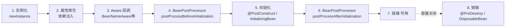
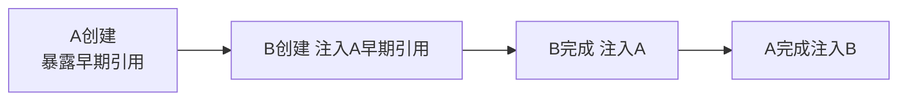

# Spring核心·IoC与Bean生命周期详解

> 版本基线：Spring 5.x/6.x、Spring Boot 2.x/3.x
> 受众：Java 后端开发。假设已懂 Java 反射；需理解 IoC 容器如何接管对象创建。
> 前置知识：**Java反射详解**（见知识库）（反射 getAnnotation/newInstance，容器底层）、**Java注解机制详解**（见知识库）（@Component 注解扫描）
> 下一篇：[02-SpringMVC执行流程详解](02-SpringMVC执行流程详解.md)（Web 层）；关联：[04-Spring核心·AOP详解](04-Spring核心·AOP详解.md)（代理）、[05-Spring事务管理详解](05-Spring事务管理详解.md)（事务）

## 📋 总纲

1. IoC 与 DI：概念与为什么
2. Bean 生命周期：实例化 → 装配 → 初始化 → 销毁（含 Mermaid）
3. 三种装配方式：XML / 注解 / JavaConfig
4. @Component 族与 @ComponentScan
5. 依赖注入：@Autowired / @Qualifier / @Primary / @Resource
6. 作用域 scope：singleton/prototype/request/session
7. 循环依赖与三级缓存（点到为止）
8. @Value 与外部化配置

## 1. 学习目标

1. 讲清 IoC 与 DI 的区别与关系
2. 画出 Bean 生命周期完整链路（含 BeanPostProcessor 钩子）
3. 用注解和 JavaConfig 两种方式装配 Bean
4. 处理 @Autowired 多实现时的注入歧义
5. 说清循环依赖为何能用三级缓存解决（构造器注入不行）

## 2. 前置知识

- **Java反射详解**（见知识库）：容器靠反射 newInstance + setField 完成创建与注入
- **Java注解机制详解**（见知识库）：@Component 是标记，Spring 扫描并注册为 Bean

## 3. 核心知识点

### 3.1 IoC 与 DI

**是什么**：IoC（Inversion of Control 控制反转）= 对象的创建和依赖关系的维护**从程序代码反转给容器**。DI（Dependency Injection 依赖注入）= 容器在创建对象时自动把依赖塞进来。

**为什么（类比）**：不用 IoC = 你自己开餐厅要买菜进货备料（`new` 到底）；用 IoC = 雇了个中央厨房（容器），你要啥菜打声招呼就送到（注入）。好处：解耦、对象统一管理、便于测试替换。

```java
// 传统：手动 new，耦合
OrderService svc = new OrderService(new UserDao());

// Spring：容器注入，OrderService 只声明依赖
@Service
public class OrderService {
    @Autowired private UserDao userDao;   // 容器负责给
}
```

**IoC vs DI**：IoC 是**理念**（控制反转），DI 是**实现手段**（如何把依赖给进来）；IoC 还可通过其他方式实现（如 ServiceLocator），Spring 用 DI。

### 3.2 Bean 生命周期 ★



| 阶段 | 触发点 | 典型用途 |
| --- | --- | --- |
| 实例化 | 反射 newInstance | 创建对象（无参构造） |
| 属性填充 | 注入依赖 | @Autowired 生效 |
| Aware 回调 | BeanNameAware/ApplicationContextAware | 拿 Bean 名/容器 |
| 前置初始化 | BeanPostProcessor.beforeInit | 包装/修改（AOP 代理在此） |
| 初始化 | @PostConstruct / InitializingBean | 初始化资源 |
| 后置初始化 | BeanPostProcessor.afterInit | 生成代理对象 |
| 就绪 | — | 可被注入使用 |
| 销毁 | @PreDestroy / DisposableBean | 释放资源 |

> **关键**：AOP 动态代理正是在 BeanPostProcessor 的 postProcessAfterInitialization 阶段**生成代理对象替换原 Bean**（呼应 [04-Spring核心·AOP详解](04-Spring核心·AOP详解.md)）。所以 final 类无法被代理（无法生成子类）。

### 3.3 三种装配方式

| 方式 | 写法 | 适用 |
| --- | --- | --- |
| XML | `<bean class="..."/><property name=""/>` | 老项目/第三方 bean |
| 注解 | `@Component` + `@Autowired` | 自研类，主流 |
| JavaConfig | `@Configuration` + `@Bean` | 第三方/条件装配 |

```java
// JavaConfig：用 @Bean 装配（适合第三方库/不可加注解的类）
@Configuration
public class AppConfig {
    @Bean
    public DataSource dataSource() {
        return new HikariDataSource();   // 返回对象注册为 Bean
    }
}
```

**@Bean vs @Component**：@Bean 用在 @Configuration 类的方法上，返回对象注册为 Bean，适合外部库/复杂构造；@Component 标注在类上，适合自研类。

### 3.4 @Component 族与 @ComponentScan

```java
@Component      // 通用组件（最底层）
@Service        // 业务服务层（语义化，功能等同 @Component）
@Repository     // 数据访问层
@Controller     // Web 控制器
```

`@ComponentScan(basePackages="com.example")` 扫描包下带 @Component 族注解的类注册为 Bean。`@SpringBootApplication` 自带 @ComponentScan（所在包及子包），见 springboot 域 [01-SpringBoot启动原理与自动装配详解](../springboot/01-SpringBoot启动原理与自动装配详解.md)。

### 3.5 依赖注入注解

| 注解 | 特性 | 注意 |
| --- | --- | --- |
| `@Autowired` | byType 注入 | 多个实现时报歧义 |
| `@Qualifier` | 按 Bean 名精确指定 | 配 @Autowired 用 |
| `@Primary` | 多实现时设默认 | 优先选中 |
| `@Resource` | JSR-250，byName 优先 | Java 标准 |
| `@RequiredArgsConstructor` | Lombok 构造器注入 | 推荐 final 字段构造器注入 |

```java
@Service
public class OrderService {
    private final UserDao userDao;              // 推荐：final + 构造器注入
    public OrderService(UserDao userDao) { this.userDao = userDao; }

    @Autowired @Qualifier("mysqlUserDao")        // 多实现用 Qualifier
    private UserDao backup;
}
```

**构造器注入 vs 字段注入**：官方推荐构造器注入（final 不可变、易测试、防循环依赖死锁）；字段注入简洁但不利于测试。

### 3.6 作用域 scope

| 作用域 | 说明 | 场景 |
| --- | --- | --- |
| singleton | 单例（默认） | 无状态服务 Bean |
| prototype | 每次获取新实例 | 有状态对象 |
| request | 一次 HTTP 请求一个 | Web |
| session | 一个会话一个 | Web |
| application | 整个 ServletContext | Web |

```java
@Scope("prototype")
@Component
public class TaskRunner { ... }
```

**坑**：单例 Bean 注入 prototype Bean 时，注入的是单例持有的同一实例——需用 ObjectProvider/代理 (`@Scope(value=..., proxyMode=...)`) 才能每次取新实例。

### 3.7 循环依赖与三级缓存

**是什么**：A 依赖 B、B 依赖 A。**构造器注入无法解决**（都要先实例化）；**setter/字段注入可解决**。



三级缓存机制：① singletonObjects（成品）② earlySingletonObjects（早期半成品）③ singletonFactories（工厂）。创建 A → 暴露到第三级工厂 → 注入 B → B 需要 A 时从工厂拿早期引用 → 都完成后升级为成品。

> **SpringBoot 默认禁止循环依赖**（Boot 2.6+ 默认 `spring.main.allow-circular-references=false`）。所以最佳实践是**避免循环依赖**，靠三层调用拆解，而非依赖三级缓存。面试讲"三级缓存解决循环依赖"是 Spring 框架层的机制，但新项目别制造循环依赖。

### 3.8 @Value 与外部化配置

```java
@Value("${app.name}")          // 从配置读取，占位符
@Value("${app.timeout:5000}")  // 带默认值
@Value("#{config.retry}")      // SpEL 求值
```

外部化配置优先级、@ConfigurationProperties 结构化绑定见 springboot 域 [02-SpringBoot配置体系与外部化配置详解](../springboot/02-SpringBoot配置体系与外部化配置详解.md)。

## 4. 最佳实践

- 构造器注入优先（final 字段 + Lombok），少用字段注入
- 避免循环依赖，Boot 默认已禁止
- 无状态 Bean 用 singleton；有状态/不安全的才考虑 prototype
- @Primary 定义默认实现，@Qualifier 显式选实现
- 第三方库用 @Bean，自研类用 @Component 族

## 5. 常见踩坑

- **循环依赖**：构造器注入直接报错，字段注入 Boot 默认也禁止 → 重构分层
- **多实现歧义**：两个同类型 Bean 不配 @Primary/@Qualifier → NoUniqueBeanDefinitionException
- **单例注入 prototype 失效**：注入的是单例持有的固定实例
- **final 类**：AOP 代理不了（无法生成子类），见 [04-Spring核心·AOP详解](04-Spring核心·AOP详解.md)
- **@Bean 方法里 new 的对象**：未被容器管理，无生命周期回调，须返回类型声明才被识别

## 6. 小结

- IoC = 控制反转理念，DI = 注入实现；Spring 容器管对象创建与依赖。
- Bean 生命周期：实例化→属性填充→Aware→BeanPostProcessor→初始化→后置代理→就绪→销毁。
- 装配三方式：XML/注解/JavaConfig；自研 @Component，第三方 @Bean。
- 作用域默认 singleton；多实现用 @Primary/@Qualifier。
- 循环依赖靠三级缓存（框架层），但新项目应避免；Boot 默认禁止。

## 7. 关联笔记

- 上一篇：[00-Spring三件套体系总览·Spring与SpringMVC与SpringBoot](00-Spring三件套体系总览·Spring与SpringMVC与SpringBoot.md)
- 下一篇：[02-SpringMVC执行流程详解](02-SpringMVC执行流程详解.md)
- [04-Spring核心·AOP详解](04-Spring核心·AOP详解.md)：代理在 BeanPostProcessor 后置阶段生成
- [05-Spring事务管理详解](05-Spring事务管理详解.md)：事务切面代理
- [06-SpEL表达式详解](06-SpEL表达式详解.md)：@Value SpEL 取参
- springboot 域 [01-SpringBoot启动原理与自动装配详解](../springboot/01-SpringBoot启动原理与自动装配详解.md)：Boot 如何扫描装配

## 8. 参考资料

- [Spring 官方文档：Core（IoC 容器）](https://docs.spring.io/spring-framework/reference/core/beans.html)，查询日期 2026-08-11
- [Spring Bean 生命周期详解（社区）]，查询日期 2026-08-11
