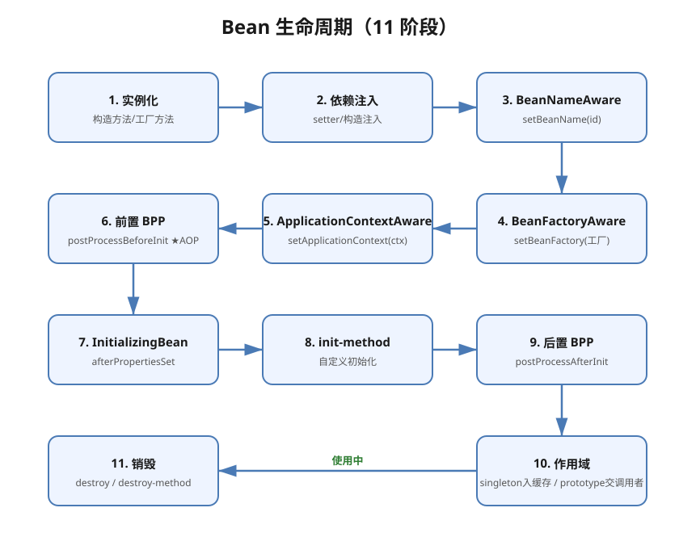
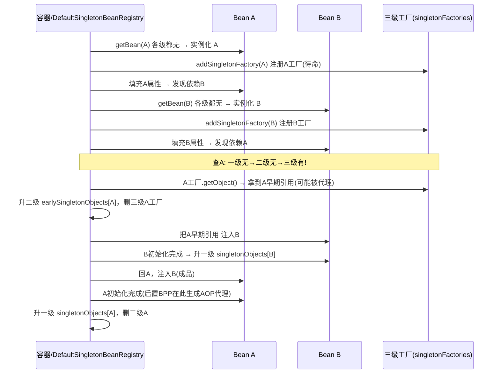

# Spring核心·IoC与Bean生命周期详解

> 版本基线：Spring 5.x/6.x、Spring Boot 2.x/3.x
> 受众：Java 后端开发。假设已懂 Java 反射；需理解 IoC 容器如何接管对象创建。
> 前置知识：[Java反射详解](../Java反射详解.md)（反射 getAnnotation/newInstance，容器底层）、**Java注解机制详解**（见知识库）（@Component 注解扫描）
> 下一篇：[02-SpringMVC执行流程详解](02-SpringMVC执行流程详解.md)（Web 层）；关联：[04-Spring核心·AOP详解](04-Spring核心·AOP详解.md)（代理）、[05-Spring事务管理详解](05-Spring事务管理详解.md)（事务）

## 📋 总纲

1. IoC 与 DI：概念与为什么
2. Bean 生命周期：实例化→注入→Aware→BPP→初始化→就绪→销毁（含 11 步蛇形图 + 详解）
3. 三种装配方式：XML / 注解 / JavaConfig
4. @Component 族与 @ComponentScan
5. 依赖注入：@Autowired / @Qualifier / @Primary / @Resource
6. 作用域 scope：singleton/prototype/request/session
7. 循环依赖与三级缓存：每层缓存职责 + A↔B 完整流程
8. @Value 与外部化配置

## 1. 学习目标

1. 讲清 IoC 与 DI 的区别与关系
2. 画出 Bean 生命周期完整链路（含 BeanPostProcessor 钩子）
3. 用注解和 JavaConfig 两种方式装配 Bean
4. 处理 @Autowired 多实现时的注入歧义
5. 说清循环依赖为何能用三级缓存解决（构造器注入不行）

## 2. 前置知识

- [Java反射详解](../Java反射详解.md)：容器靠反射 newInstance + setField 完成创建与注入
- **Java注解机制详解**（见知识库）：@Component 是标记，Spring 扫描并注册为 Bean

## 3. 核心知识点

### 3.1 IoC 与 DI

**是什么**：IoC（Inversion of Control 控制反转）= 对象的创建和依赖关系的维护**从程序代码反转给容器**。DI（Dependency Injection 依赖注入）= 容器在创建对象时自动把依赖塞进来。

**为什么（类比）**：不用 IoC = 你自己开餐厅要买菜进货备料（`new` 到底）；用 IoC = 雇了个中央厨房（容器），你要啥菜打声招呼就送到（注入）。好处：解耦、对象统一管理、便于测试替换。

```java
// 传统：手动 new，耦合
OrderService svc = new OrderService(new UserDao());

// Spring：容器注入，OrderService 只声明依赖
@Service
public class OrderService {
    @Autowired private UserDao userDao;   // 容器负责给
}
```

**IoC vs DI**：IoC 是**理念**（控制反转），DI 是**实现手段**（如何把依赖给进来）；IoC 还可通过其他方式实现（如 ServiceLocator），Spring 用 DI。

### 3.2 Bean 生命周期 ★

> 🖼 **11 步蛇形图**（图即知识，扫一眼看懂流程）：



#### 生命周期 11 步详解

1. **实例化**：根据配置调用 Bean 的构造方法或工厂方法创建对象。
2. **属性注入**：利用依赖注入完成 Bean 中所有属性值的配置注入（setter / 构造注入，@Autowired 生效）。
3. **BeanNameAware**：如果 Bean 实现了 `BeanNameAware`，Spring 调用 `setBeanName(id)` 传入当前 Bean 的 id 值。
4. **BeanFactoryAware**：如果 Bean 实现了 `BeanFactoryAware`，Spring 调用 `setBeanFactory(工厂)` 传入当前工厂实例引用。
5. **ApplicationContextAware**：如果 Bean 实现了 `ApplicationContextAware`，Spring 调用 `setApplicationContext(ctx)` 传入当前容器实例引用。
6. **前置 BPP**：如果 `BeanPostProcessor` 和 Bean 关联，Spring 调用 `postProcessBeforeInitialization` 对 Bean 进行加工（★ AOP 代理在此介入）。
7. **InitializingBean**：如果 Bean 实现了 `InitializingBean`，Spring 调用 `afterPropertiesSet()`。
8. **init-method**：如果配置文件中通过 `init-method` 指定了初始化方法，则调用该方法。
9. **后置 BPP**：如果 `BeanPostProcessor` 和 Bean 关联，Spring 调用 `postProcessAfterInitialization`（AOP 代理在此生成）——此时 Bean 已可以被应用系统使用。
10. **作用域**：如果 `scope="singleton"`，则将该 Bean 放入 IoC 缓存池，触发 Spring 生命周期管理；如果 `scope="prototype"`，则将该 Bean 交给调用者（Spring 不再管）。
11. **销毁**：如果 Bean 实现了 `DisposableBean`，Spring 调用 `destroy()`；如果通过 `destroy-method` 指定了销毁方法，则调用该方法。

**要点**：
- 第 6、9 步是 **BeanPostProcessor 的两次拦截**，整个生命周期最重要的扩展点；AOP 代理在**第 9 步（后置 BPP）**生成。
- **Aware 分两组**：BeanName/BeanFactory 等直接 Aware 由 `invokeAwareMethods()` 直接调；ApplicationContext 族（含 ResourceLoaderAware 等）由 `ApplicationContextAwareProcessor`（一个 BPP）在**第 6 步前置阶段**调。
- **@PostConstruct 的位置**：由 `InitDestroyAnnotationBeanPostProcessor` 在**第 6 步前置 BPP**阶段触发（不是第 7 步 afterPropertiesSet）。

> **关键**：AOP 动态代理正是在 BeanPostProcessor 的 postProcessAfterInitialization（第 9 步）阶段**生成代理对象替换原 Bean**（呼应 [04-Spring核心·AOP详解](04-Spring核心·AOP详解.md)）。所以 final 类无法被代理（无法生成子类）。

### 3.3 三种装配方式

| 方式 | 写法 | 适用 |
| --- | --- | --- |
| XML | `<bean class="..."/><property name=""/>` | 老项目/第三方 bean |
| 注解 | `@Component` + `@Autowired` | 自研类，主流 |
| JavaConfig | `@Configuration` + `@Bean` | 第三方/条件装配 |

```java
// JavaConfig：用 @Bean 装配（适合第三方库/不可加注解的类）
@Configuration
public class AppConfig {
    @Bean
    public DataSource dataSource() {
        return new HikariDataSource();   // 返回对象注册为 Bean
    }
}
```

**@Bean vs @Component**：@Bean 用在 @Configuration 类的方法上，返回对象注册为 Bean，适合外部库/复杂构造；@Component 标注在类上，适合自研类。

### 3.4 @Component 族与 @ComponentScan

```java
@Component      // 通用组件（最底层）
@Service        // 业务服务层（语义化，功能等同 @Component）
@Repository     // 数据访问层
@Controller     // Web 控制器
```

`@ComponentScan(basePackages="com.example")` 扫描包下带 @Component 族注解的类注册为 Bean。`@SpringBootApplication` 自带 @ComponentScan（所在包及子包），见 springboot 域 [01-SpringBoot启动原理与自动装配详解](../springboot/01-SpringBoot启动原理与自动装配详解.md)。

### 3.5 依赖注入注解

| 注解 | 特性 | 注意 |
| --- | --- | --- |
| `@Autowired` | byType 注入 | 多个实现时报歧义 |
| `@Qualifier` | 按 Bean 名精确指定 | 配 @Autowired 用 |
| `@Primary` | 多实现时设默认 | 优先选中 |
| `@Resource` | JSR-250，byName 优先 | Java 标准 |
| `@RequiredArgsConstructor` | Lombok 构造器注入 | 推荐 final 字段构造器注入 |

```java
@Service
public class OrderService {
    private final UserDao userDao;              // 推荐：final + 构造器注入
    public OrderService(UserDao userDao) { this.userDao = userDao; }

    @Autowired @Qualifier("mysqlUserDao")        // 多实现用 Qualifier
    private UserDao backup;
}
```

**构造器注入 vs 字段注入**：官方推荐构造器注入（final 不可变、易测试、防循环依赖死锁）；字段注入简洁但不利于测试。

### 3.6 作用域 scope

| 作用域 | 说明 | 场景 |
| --- | --- | --- |
| singleton | 单例（默认） | 无状态服务 Bean |
| prototype | 每次获取新实例 | 有状态对象 |
| request | 一次 HTTP 请求一个 | Web |
| session | 一个会话一个 | Web |
| application | 整个 ServletContext | Web |

```java
@Scope("prototype")
@Component
public class TaskRunner { ... }
```

**坑**：单例 Bean 注入 prototype Bean 时，注入的是单例持有的同一实例——需用 ObjectProvider/代理 (`@Scope(value=..., proxyMode=...)`) 才能每次取新实例。

### 3.7 循环依赖与三级缓存

**是什么（界定范围）**：A 依赖 B、B 依赖 A。**仅单例 + setter/字段注入**的循环依赖，Spring 才用「提前暴露 + 三级缓存」解决；**构造器注入无法解决**（互相都要先实例化才能产物，形成死锁直接抛 `BeanCurrentlyInCreationException`）。

#### ① 三级缓存：每层到底存什么、干嘛的

源码位置：`DefaultSingletonBeanRegistry`（`org.springframework.beans.factory.support`），本质就是三个 `Map`：

| 级别  | 字段名                     | Map 类型              | 存的内容                                | 生命周期阶段                 | 一句话职责             |
| --- | ----------------------- | ------------------- | ----------------------------------- | ---------------------- | ----------------- |
| 一级  | `singletonObjects`      | `ConcurrentHashMap` | **成品** Bean（完整对象，应用实际拿到的）           | 走完全部生命周期（含后置 BPP/AOP）后 | 最终容器，所有 Bean 的归宿  |
| 二级  | `earlySingletonObjects` | `HashMap`           | **半成品**（早期引用，已实例化但未完成初始化）           | 发生循环依赖时从三级拿工厂产物后放入     | 缓存已确定的具体半成品对象     |
| 三级  | `singletonFactories`    | `HashMap`           | `ObjectFactory`（lambda 工厂），**不是对象** | Bean 实例化后、属性注入前放入      | 延迟生成半成品，解决 AOP 代理 |

**关键记忆**：`一级=成品，二级=半成品，三级=生产半成品的工厂（惰性）`。

> Spring 源码里三级缓存的值类型：`Map<String, Object>`（一二三均为 `Object`）为何能区分？靠的是**查缓存顺序**与**存取阶段**，不是靠类型。存储时按上述规则放，读取时先查一级没有才查二级、再查三级，顺序即层级。

#### ② 为什么非要三级，两级、甚至一级不行吗？★

这是面试必追问，核心在两个问题：**要不要分级？为什么没三级不行？**

**🔹 一级够吗？—— 不够，必须分级**

只用一级缓存（成品+半成品混放）也在逻辑上能排出循环依赖，但会逼 Spring 用额外标记区分「完成/未完成」，创建过程变得复杂、易错。把成品与半成品物理分开（一级 vs 二级）各司其职，创建流程才简洁直观。所以「**至少二级**」是工程取舍。

**🔹 两级够吗？—— 不引入 AOP 够，引入 AOP 不够，故必须三级**★

不涉及 AOP 时，二级缓存（一+二）就已能解决循环依赖。但 Spring 的 AOP 代理在**后置 BPP（第 9 步）**才生成，而循环依赖 Bean 恰恰会在初始化完成前就索取引用——时机冲突：

- 若在**实例化后立刻把对象固化进二级缓存**：B 注入了 A 的原始对象，但 A 后面在被代理（后置 BPP 生成代理）后，B 手里仍是**原始对象**，代理就白做了（切面失效）。
- **所以三级存的是 `ObjectFactory` 工厂（lambda）而非具体对象**：把「拿到 A 引用」这件事**延迟**到 B 真正需要的那一刻，届时通过工厂调用 `getEarlyBeanReference()` 返回**可能已被代理的正确对象**。

一句话记忆：**第三级 = 把「AOP 代理目标对象的确定」延迟到真被需要的瞬间**。

> 关联 [04-Spring核心·AOP详解](04-Spring核心·AOP详解.md)：代理生成在第 9 步后置 BPP。三级缓存的意义正是与这一时机配合——早期引用不能把「还没决定是否被代理的对象」固定下来。

#### ③ A↔B 完整解决流程（setter/字段注入）★

以两个 Service 互相注入为例，`getSingleton()` 三级查找 + `addSingletonFactory()` 入三级的完整时序：



逐步骤对照（同一语义）：

1. **getBean(A)**：三级缓存都无 A → 标记「A 创建中」（`singletonsCurrentlyInCreation`）→ 实例化 A（`new A()`，此时属性为空）→ **先注册 A 的工厂进三级** `singletonFactories`（此时还未注入、未初始化）。
2. **填充 A 属性**需要 B → `getBean(B)` → 各级无 B → 实例化 B → 注册 B 工厂进三级 → 填充 B 属性需要 A。
3. **B 求 A**：查一级无 → 查二级无 → 查**三级**命中 A 工厂 → 调用 `A.getObject()` 得 A 的早期引用（若 A 需 AOP，此时返回代理对象）→ **存入二级** `earlySingletonObjects` ≠ **移除三级** A 工厂（工厂一次性）→ 把早期引用注入 B。
4. **B 完成初始化** → 升级为成品入一级 `singletonObjects`（B 完整）。
5. **回到 A**：A 的 setter 此时拿到的是**已完成的 B**（从一级），注入 → A 完成后置 BPP（此步 AOP 代理生成）→ 升级为成品入一级 `singletonObjects`，清除二级残留。

**流程口诀**：`实例化→提前暴露三级→需要时升到二级→完成的进一级`。核心就一个动作——**提前暴露**：实例化完还没初始化，就把引用交出去，等被依赖方完整后回填。

#### ④ 什么场景能解 / 不能解（组合矩阵）

| 场景 | 能否解决 | 原因 |
| --- | --- | --- |
| 单例 + 字段/setter 注入 | ✅ | 三级缓存提前暴露半成品，可回填 |
| 单例 + 构造器注入 | ❌ 直接抛异常 | 构造器必须先产完整对象，无法提前暴露 |
| prototype 循环依赖 | ❌ | 每次都要新实例，无从缓存 |
| `@Async`、事务等自动代理 Bean（注入的是代理处理者） | ⚠️ 部分 | 早期引用可能与代理阶段错位，多出复杂场景 |
| SpringBoot 2.6+ | ❌ **默认禁止** | `spring.main.allow-circular-references=false` |

#### ⑤ 追问（面试加分）

- **为什么单例 AOP Bean 循环依赖可能还是报错**？—— 早期暴露提前生成了代理，但代理切面可能要等完整初化后才就位，部分 `@Async`/事务场景即使有三级缓存仍会 `BeanCurrentlyInCreationException`。
- **第三级工厂返回的是什么**？—— `getEarlyBeanReference()` 的结果：无 AOP 就返回原始对象，有 AOP 则返回（包装了 `SmartInstantiationAwareBeanPostprocessor`）代理对象；未命中则回退原始。
- **一级为何用 `ConcurrentHashMap`，二三级用 `HashMap`**？—— 一级是并发读取安全瓶颈，用并发容器；二三级只在单线程创建流程内顺序访问。

> ⚠️ **SpringBoot 默认禁止循环依赖**（Boot 2.6+ 默认 `spring.main.allow-circular-references=false`）。最佳实践是**避免循环依赖**，靠三层调用拆解，而非依赖三级缓存。面试讲「三级缓存解决循环依赖」是 Spring **框架层**的机制，讲完要点名：新项目别制造循环依赖。

### 3.8 @Value 与外部化配置

```java
@Value("${app.name}")          // 从配置读取，占位符
@Value("${app.timeout:5000}")  // 带默认值
@Value("#{config.retry}")      // SpEL 求值
```

外部化配置优先级、@ConfigurationProperties 结构化绑定见 springboot 域 [02-SpringBoot配置体系与外部化配置详解](../springboot/02-SpringBoot配置体系与外部化配置详解.md)。

## 4. 最佳实践

- 构造器注入优先（final 字段 + Lombok），少用字段注入
- 避免循环依赖，Boot 默认已禁止
- 无状态 Bean 用 singleton；有状态/不安全的才考虑 prototype
- @Primary 定义默认实现，@Qualifier 显式选实现
- 第三方库用 @Bean，自研类用 @Component 族

## 5. 常见踩坑

- **循环依赖**：构造器注入直接报错，字段注入 Boot 默认也禁止 → 重构分层
- **多实现歧义**：两个同类型 Bean 不配 @Primary/@Qualifier → NoUniqueBeanDefinitionException
- **单例注入 prototype 失效**：注入的是单例持有的固定实例
- **final 类**：AOP 代理不了（无法生成子类），见 [04-Spring核心·AOP详解](04-Spring核心·AOP详解.md)
- **@Bean 方法里 new 的对象**：未被容器管理，无生命周期回调，须返回类型声明才被识别

## 6. 小结

- IoC = 控制反转理念，DI = 注入实现；Spring 容器管对象创建与依赖。
- Bean 生命周期 11 步：实例化→属性注入→3个Aware→前置BPP(★AOP)→InitializingBean→init-method→后置BPP→作用域→销毁；AOP 代理在第 9 步后置 BPP 生成。
- 装配三方式：XML/注解/JavaConfig；自研 @Component，第三方 @Bean。
- 作用域默认 singleton；多实现用 @Primary/@Qualifier。
- 循环依赖靠三级缓存（框架层），但新项目应避免；Boot 默认禁止。

## 7. 关联笔记

- 上一篇：[00-Spring三件套体系总览·Spring与SpringMVC与SpringBoot](00-Spring三件套体系总览·Spring与SpringMVC与SpringBoot.md)
- 下一篇：[02-SpringMVC执行流程详解](02-SpringMVC执行流程详解.md)
- [04-Spring核心·AOP详解](04-Spring核心·AOP详解.md)：代理在 BeanPostProcessor 后置阶段生成
- [05-Spring事务管理详解](05-Spring事务管理详解.md)：事务切面代理
- [06-SpEL表达式详解](06-SpEL表达式详解.md)：@Value SpEL 取参
- springboot 域 [01-SpringBoot启动原理与自动装配详解](../springboot/01-SpringBoot启动原理与自动装配详解.md)：Boot 如何扫描装配

## 8. 参考资料

- [Spring 官方文档：Core（IoC 容器）](https://docs.spring.io/spring-framework/reference/core/beans.html)，查询日期 2026-08-11
- [Spring Bean 生命周期详解（社区）]，查询日期 2026-08-11
