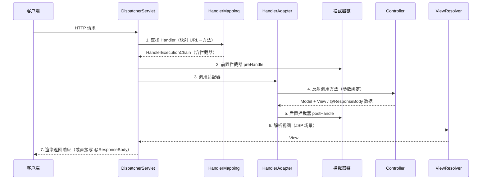

# SpringMVC执行流程详解

> 版本基线：Spring MVC 5.x/6.x（Spring Boot 内嵌）
> 受众：Java 后端开发。假设已懂 Spring 核心（IoC/AOP）；需理解 HTTP 请求如何在 SpringMVC 里被路由、绑定、返回。
> 前置知识：[01-Spring核心·IoC与Bean生命周期详解](01-Spring核心·IoC与Bean生命周期详解.md)（容器/Bean）、[Java反射详解](../Java反射详解.md)（参数绑定底层）、**00-网络传输协议总览**（见知识库）（HTTP）
> 关联笔记：[05-Spring与SpringMVC整合详解](05-Spring与SpringMVC整合详解.md)（传统整合）、springboot 域 [01-SpringBoot启动原理与自动装配详解](../springboot/01-SpringBoot启动原理与自动装配详解.md)（自动装配 DispatcherServlet）

## 📋 总纲

1. DispatcherServlet 定位与启动
2. 请求全流程（Mermaid 时序图）
3. HandlerMapping / HandlerAdapter
4. REST 注解族与参数绑定
5. 返回值处理与 @ResponseBody
6. 拦截器 Interceptor（vs Filter）
7. 全局异常 @ControllerAdvice
8. 静态资源 / 视图解析 / CORS

## 1. 学习目标

1. 画出 DispatcherServlet 处理请求的完整时序
2. 掌握 @PathVariable/@RequestParam/@RequestBody/@ModelAttribute 绑定规则
3. 区分拦截器 Interceptor 与过滤器 Filter
4. 用 @ControllerAdvice 做全局异常处理
5. 处理 CORS/静态资源常见配置

## 2. 前置知识

- [01-Spring核心·IoC与Bean生命周期详解](01-Spring核心·IoC与Bean生命周期详解.md)：@Controller 是 @Component 族，控制器是容器管理的 Bean
- [Java反射详解](../Java反射详解.md)：HandlerAdapter 用反射调用控制器方法 + 参数转换

## 3. 核心知识点

### 3.1 DispatcherServlet 定位与启动

**DispatcherServlet 是所有请求的前端控制器（Front Controller）**：接收所有 HTTP 请求，委托给各组件处理。启动：在 Servlet 容器（Tomcat）初始化时创建，Spring Boot 通过自动装配注册（见 [01-SpringBoot启动原理与自动装配详解](../springboot/01-SpringBoot启动原理与自动装配详解.md)）。

### 3.2 请求全流程 ★



| 步骤 | 组件 | 职责 |
| --- | --- | --- |
| 1 | HandlerMapping | 根据 URL 找到处理方法 + 拦截器链 |
| 2 | 拦截器 preHandle | 请求前处理（鉴权/日志） |
| 3 | HandlerAdapter | 适配调用控制器方法 |
| 4 | Controller | 执行业务，绑定参数 |
| 5 | 拦截器 postHandle | 响应前处理 |
| 6 | ViewResolver | 解析视图（仅返回视图名时） |
| 7 | 渲染/写出 | 返回响应 |

**核心**：请求不直接进 Controller，而是经 DispatcherServlet 中央调度——这就是"前端控制器"模式，也是拦截器/全局异常能统一生效的原因。

### 3.3 HandlerMapping / HandlerAdapter

- **HandlerMapping**：把 URL → 方法（处理器）。`RequestMappingHandlerMapping` 解析 @RequestMapping。返回 `HandlerExecutionChain`（处理器 + 匹配的拦截器列表）。
- **HandlerAdapter**：适配不同风格的处理器，`RequestMappingHandlerAdapter` 负责反射调用 @RequestMapping 方法、参数解析、返回值处理。

扩展点：可通过自定义 HandlerMapping/HandlerAdapter 支持新注解风格，但 99% 场景用默认即可。

### 3.4 REST 注解族与参数绑定

| 注解 | 位置 | 绑定来源 | 示例 |
| --- | --- | --- | --- |
| `@RequestMapping` | 类/方法 | 通用映射 | 父注解 |
| `@GetMapping/@PostMapping/@PutMapping/@DeleteMapping` | 方法 | 简化写法 | `@GetMapping("/user/{id}")` |
| `@PathVariable` | 参数 | URL 路径片段 | `@PathVariable("id") Long id` |
| `@RequestParam` | 参数 | 查询串/表单 | `@RequestParam(required=false) String name` |
| `@RequestBody` | 参数 | JSON 体（需 HttpMessageConverter） | `@RequestBody User user` |
| `@ModelAttribute` | 参数 | 表单对象绑定 | `@ModelAttribute User user` |
| `@RequestHeader` | 参数 | 请求头 | `@RequestHeader("Authorization") String token` |

```java
@RestController
@RequestMapping("/api/orders")
public class OrderController {
    @GetMapping("/{id}")
    public Order get(@PathVariable("id") Long id) {
        return orderService.findById(id);
    }

    @PostMapping
    public Order create(@RequestBody Order order) {       // JSON → Order
        return orderService.save(order);
    }
}
```

**参数绑定底层**：HandlerAdapter 的 ArgumentResolver（参数解析器）逐个把请求数据转成方法参数类型，用转换器（如 Jackson 把 JSON 转对象）。

### 3.5 返回值处理与 @ResponseBody

| 返回类型 | 处理 |
| --- | --- |
| `@ResponseBody` 对象 | HttpMessageConverter（Jackson）直接序列化为 JSON 写出 |
| `@RestController` | 类上 @Controller + 所有方法默认 @ResponseBody |
| `String`（无 @ResponseBody）| 视为视图名 |
| `ModelAndView` | 返回模型 + 视图 |
| `ResponseEntity<T>` | 自定义状态码 + 体 |

```java
@RestController                    // 类级，方法默认 @ResponseBody
public class OrderController {
    @GetMapping("/{id}")
    public Order get(@PathVariable Long id) {
        return orderService.findById(id);      // 自动 JSON 序列化
    }
}
```

**@Controller vs @RestController**：@RestController = @Controller + @ResponseBody，返回对象直接转 JSON，不找视图——现代前后端分离首选。

### 3.6 拦截器 Interceptor（vs Filter）

**拦截器**：SpringMVC 层，在 HandlerExecutionChain 里，按 3.2 步骤 2/5 执行。三个方法：`preHandle`（请求前，返回 false 拦截）、`postHandle`（方法后视图前）、`afterCompletion`（完成后清理）。

```java
@Component
public class AuthInterceptor implements HandlerInterceptor {
    @Override
    public boolean preHandle(HttpServletRequest req, HttpServletResponse resp, Object handler) throws Exception {
        if (req.getHeader("token") == null) { resp.setStatus(401); return false; }
        return true;
    }
}
```

**Interceptor vs Filter**：

| 维度 | Filter | Interceptor |
| --- | --- | --- |
| 归属 | Servlet 容器层 | SpringMVC 层 |
| 触发 | 请求进 Servlet 前 | Handler 执行前（在 Filter 之后） |
| 能拿 | Servlet 对象 | Spring Bean / HandlerMethod |
| 典型 | 编码/跨域/日志 | 鉴权/日志/权限（需 Spring 能力时） |

**关系**：Filter 先于 DispatcherServlet，Interceptor 在 DispatcherServlet 内、Controller 前。两者可叠加（Filter 做通用、Interceptor 做 Spring 感知）。

### 3.7 全局异常 @ControllerAdvice

```java
@RestControllerAdvice
public class GlobalExceptionHandler {
    @ExceptionHandler(BusinessException.class)
    public ResponseEntity<?> handleBiz(BusinessException e) {
        return ResponseEntity.badRequest().body(Map.of("msg", e.getMessage()));
    }

    @ExceptionHandler(Exception.class)
    public ResponseEntity<?> handleAll(Exception e) {
        return ResponseEntity.status(500).body(Map.of("msg", "system error"));
    }
}
```

- `@ControllerAdvice` 全局拦截所有 Controller 抛出的异常
- `@ExceptionHandler(X.class)` 指定处理某异常（精确匹配优先）
- 覆盖默认错误处理，统一返回格式

### 3.8 静态资源 / 视图解析 / CORS

**静态资源**：Spring Boot 默认映射 `classpath:/static/`，放 `static/index.html` 等即可访问。
**视图解析**：返回视图名时 ViewResolver 解析（JSP 的 InternalResourceViewResolver），现代 JSON 接口几乎不用。
**CORS**（跨域）：

```java
@RestController
public class ApiController {
    @GetMapping("/data")
    @CrossOrigin(origins = "https://front.example.com")   // 方法级
    public Data data() { ... }
}
```

全局配置 `WebMvcConfigurer.addCorsMappings` 或 `@CrossOrigin` 注解。

## 4. 最佳实践

- 前后端分离用 @RestController + @ResponseBody JSON
- 参数校验用 Bean Validation（@Valid + 校验注解），见 **Java参数校验详解**（见知识库）
- 全局异常用 @RestControllerAdvice 统一格式，业务异常自定义类
- 鉴权用拦截器/Spring Security（见安全域），Filter 只做通用处理
- CORS 集中配置，别每个方法散写

## 5. 常见踩坑

- **@RequestBody 与 @RequestParam 混用**：一个 @RequestBody 只能一个（体只能绑定一次）
- **JSON 反序列化失败** → 400 异常，需在全局异常处理兼容
- **拦截器不生效**：没注册（Boot 需实现 WebMvcConfigurer.addInterceptors 注册）
- **URL 404 而非拦截器返回**：HandlerMapping 未匹配时拦截器根本不执行
- **@PathVariable 名不匹配**：`@PathVariable("id")` 与 `{}` 中变量名必须一致（或用 -parameters）

## 6. 小结

- DispatcherServlet 是前端控制器，统一调度请求全流程。
- 流程：HandlerMapping 找处理器 → 拦截器 preHandle → HandlerAdapter 反射调用 → postHandle → 渲染。
- 参数绑定靠 ArgumentResolver；返回值 JSON 靠 HttpMessageConverter。
- @RestController = @Controller + @ResponseBody。
- 拦截器在 Spring 层、Filter 在 Servlet 层；@ControllerAdvice 做全局异常。

## 7. 关联笔记

- 上一篇：[02-Spring核心·IoC与Bean生命周期实践](02-Spring核心·IoC与Bean生命周期实践.md)
- 下一篇：[04-SpringMVC执行流程实践](04-SpringMVC执行流程实践.md)（本知识点的代码实盀）
- **Java参数校验详解**（见知识库）：@Valid 参数校验
- 安全域 **01-Spring Security核心架构详解**（见知识库）：Spring Security 基于 MVC 过滤链
- springboot 域 [01-SpringBoot启动原理与自动装配详解](../springboot/01-SpringBoot启动原理与自动装配详解.md)：Boot 自动装配 DispatcherServlet

## 8. 参考资料

- [Spring 官方文档：Web MVC](https://docs.spring.io/spring-framework/reference/web/webmvc.html)，查询日期 2026-08-11
- [SpringMVC 执行流程详解（社区）]，查询日期 2026-08-11
