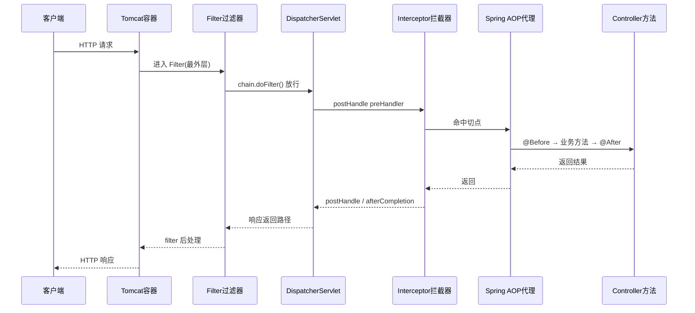
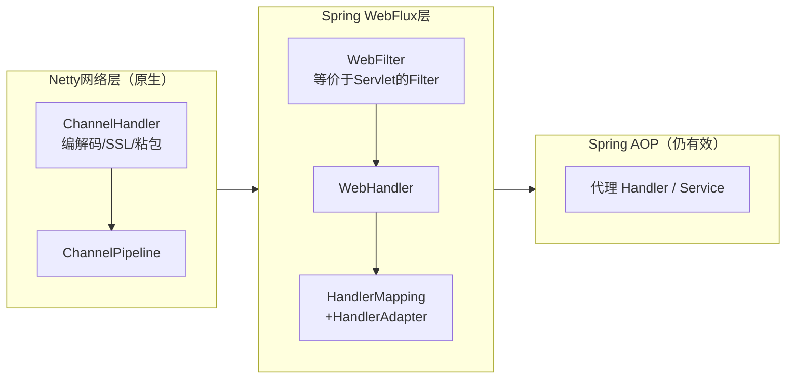

# Filter过滤器详解与三层对比

> 前置知识：[03-SpringMVC执行流程详解](03-SpringMVC执行流程详解.md)（请求如何到达 Controller）、[07-Spring核心·AOP详解](07-Spring核心·AOP详解.md)（方法级切面）、[16-拦截器Interceptor详解](16-拦截器Interceptor详解.md)（本篇对比对象）
> 关联笔记：[07-Spring核心·AOP详解](07-Spring核心·AOP详解.md)、[16-拦截器Interceptor详解](16-拦截器Interceptor详解.md)、springboot 域 [08-Spring WebFlux响应式编程详解](../springboot/08-Spring WebFlux响应式编程详解.md)（响应式 Filter）

## 📋 总纲

1. Filter 概念：Servlet 规范，所有容器统一的请求入口钩子
2. Filter 写法：三方法 / 配置方式 / 完整可运行示例
3. 为什么 Spring Boot 中 Filter 用得少（被内置/被瓜分）
4. 过滤器 vs 拦截器对比
5. 过滤器 vs AOP 对比（AOP 单独成篇，此处只对比）
6. 三层执行顺序图（Filter → Interceptor → AOP）
7. 响应式栈：Netty 支持 Filter 吗？WebFilter / ChannelHandler
8. 总结与选型速查

## 一、Filter 是什么

**过滤器 Filter 是 Servlet 规范（Jakarta Servlet Specification）定义的标准组件**，不是某个具体容器的私有功能。

- **位置**：属于 **Web 容器（Servlet 容器）级别**，在请求**进入 DispatcherServlet 之前**执行。
- **特性**：只要实现 Servlet 规范（Tomcat、Jetty、Undertow、Resin 等）的 Web 容器**都支持 Filter**，写出的 Filter 与具体容器无关。
- **一句话记忆**：Filter 管"请求进出容器"的最外层关口，是 `ServletRequest/ServletResponse` 层面的横切。
- **历史**：Servlet 2.3（J2EE 1.3）引入，存在二十多年，标准化接口。

> ⚠️ 边界：**不是所有 Web 框架都有 Filter**。Filter 只存在于"基于 Servlet 的 Java Web"。Node.js Express / Python Django 的 middleware 是另一套概念，不能混为一谈。Spring Boot 默认内嵌一个 Servlet 容器（Tomcat），所以天然支持 Filter。

## 二、Filter 写法

### 2.1 三个生命周期方法

| 方法 | 时机 | 说明 |
| --- | --- | --- |
| `init(FilterConfig)` | 容器启动创建时 | 初始化（旧式取配置）；Spring 中用 `@Value` 注入更常见 |
| `doFilter(request, response, chain)` | 每次请求 | 核心逻辑；**必须 `chain.doFilter()` 放行**，否则请求被拦截 |
| `destroy()` | 容器销毁时 | 释放资源 |

典型方法体逻辑：**放行前**处理 → `chain.doFilter()` → **放行后**处理（注意后处理在响应返回路径上）。

### 2.2 两种配置方式

#### 方式一：注解 `@WebFilter`（Servlet 规范，Spring Boot 需配合扫描）

```java
@WebFilter(urlPatterns = "/*", filterName = "myFilter")
@Component   // 交给 Spring 容器管理（依赖注入需要）
public class MyFilter implements Filter {
    @Override
    public void doFilter(ServletRequest req, ServletResponse resp, FilterChain chain)
            throws IOException, ServletException {
        HttpServletRequest request = (HttpServletRequest) req;
        System.out.println("Filter 进入：" + request.getRequestURI());
        chain.doFilter(req, resp);          // 放行
    }
}
```

```java
@Configuration
@ServletComponentScan   // 扫描 @WebFilter / @Servlet / @WebListener
public class WebConfig { }
```

#### 方式二：`FilterRegistrationBean`（Spring Boot 推荐，可控顺序）

```java
@Configuration
public class FilterConfig {
    @Bean
    public FilterRegistrationBean<MyFilter> myFilterReg() {
        FilterRegistrationBean<MyFilter> reg = new FilterRegistrationBean<>(new MyFilter());
        reg.addUrlPatterns("/*");   // 匹配路径
        reg.setOrder(1);            // 值越小越先执行
        return reg;
    }
}
```

### 2.3 完整可运行示例（登录校验 + 顺序控制）

```java
@Configuration
public class WebConfig {
    @Bean
    public FilterRegistrationBean<AuthFilter> authFilter() {
        FilterRegistrationBean<AuthFilter> reg = new FilterRegistrationBean<>(new AuthFilter());
        reg.addUrlPatterns("/api/*");     // 只拦 /api 下请求
        reg.setOrder(1);                  // 先执行
        return reg;
    }
}
```

```java
public class AuthFilter implements Filter {
    @Override
    public void doFilter(ServletRequest req, ServletResponse resp, FilterChain chain)
            throws IOException, ServletException {
        HttpServletRequest request = (HttpServletRequest) req;
        String token = request.getHeader("Authorization");
        if (token == null || token.isBlank()) {
            HttpServletResponse response = (HttpServletResponse) resp;
            response.setStatus(401);
            response.getWriter().write("{\"code\":401,\"msg\":\"no auth\"}");
            return;                       // 不放行：直接返回
        }
        chain.doFilter(req, resp);        // 放行
    }
}
```

> 实测要点：一个请求按 `urlPatterns` 匹配；多个 Filter 按 `setOrder` 正序执行，`chain.doFilter()` 串起整条链。

## 三、为什么 Spring Boot 中 Filter 用得少

**不是"没有它"，而是它被"更像框架的机制 + 内置实现"取代/包了一层。** 四个原因：

1. **常用 Filter 已内置**：字符编码（`CharacterEncodingFilter`）、CORS、请求日志等由 Spring Boot 自动配置 + `OncePerRequestFilter` 默认配好，开发者无需手写。
2. **拦截器接手同类需求**：拦截器在同层能拿到 `HandlerMethod`、注解，更贴近 Controller。登录/权限优先用拦截器（见 [16-拦截器Interceptor详解](16-拦截器Interceptor详解.md)）。
3. **业务型切面交给 AOP**：Filter 拿不到 Service 方法、参数类型，切"业务方法"用 AOP（`@Transactional`、`@Around` 审计）更对口，见 [07-Spring核心·AOP详解](07-Spring核心·AOP详解.md)。
4. **Filter 写法"原始"**：要手动 `chain.doFilter` 放行、手动注册，存在感低。

**Filter 真正"必须手工上场"的场景**：最外层、需覆盖静态资源、包装原始请求/响应体、拦截非 MVC 的 servlet。

## 四、过滤器 vs 拦截器

| 维度 | Filter 过滤器 | Interceptor 拦截器 |
| --- | --- | --- |
| 所属规范 | **Servlet 规范**（容器级） | **Spring MVC 框架**（Spring 内） |
| 执行层 | 请求进 Spring 之前（经 Tomcat） | DispatcherServlet 分发后 |
| 拿到什么 | `ServletRequest/Response`，**无** HandlerMethod | **HandlerMethod**（Controller 方法+注解） |
| 范围 | 所有请求（含静态资源、非 MVC servlet） | 只拦 Spring MVC 处理器（静态默认不拦） |
| 粒度 | 请求级（urlPatterns 匹配） | Controller 方法级 |
| 核心方法 | `doFilter` + chain 放行 | `preHandle/postHandle/afterCompletion` |
| 顺序控制 | `FilterRegistrationBean.setOrder` | `addInterceptor` 注册顺序 |
| 典型场景 | 编码、CORS、响应包装、底层安全 | 登录鉴权、权限、Controller 日志 |

**相同点**：都能做日志/鉴权；都依赖"拦截-放行"模型；都在 Controller 业务逻辑之外横切。

## 五、过滤器 vs AOP

详见 [07-Spring核心·AOP详解](07-Spring核心·AOP详解.md)，此处仅列对比维度：

| 维度 | Filter | AOP（Spring） |
| --- | --- | --- |
| 层级 | 容器（Web 层） | Spring IoC 容器（完全脱离 Web） |
| 能否切非 Controller-Bean | 只能沿 HTTP 请求 | **可切任意 Spring Bean 任意方法**（Service/Mapper等） |
| 拿到什么 | Servlet 对象 | Method / JoinPoint / 参数 / 返回值 |
| 实现机制 | Servlet 容器调度 | JDK 动态代理 / CGLIB |
| 典型用途 | 编码、跨域、底层包装 | 事务、日志、审计、缓存、限流 |

## 六、三层执行顺序（Filter → 拦截器 → AOP）



**一句话记忆**：**Filter 管"请求进出容器"，拦截器管"请求到 Controller 的通道"，AOP 管"业务方法调用本身"。** 关系由外到内：Filter ⊃ 拦截器 ⊃ AOP。

## 七、响应式栈：Netty 支持 Filter 吗？

### 7.1 结论（两层）

- **Servlet 容器（Tomcat 等）**：Filter 是标准组件，**支持**。
- **Netty（原生 NIO，非 Servlet 容器）**：**不存在 Servlet 意义的 Filter**，它有自己的替代机制（ChannelPipeline + Handler），Spring 在其上封装了 **WebFilter**。

### 7.2 分层对应



| Servlet 栈 | WebFlux 响应式栈对应 |
| --- | --- |
| Filter（Servlet 规范） | **WebFilter**（Spring 封装）/ Netty ChannelHandler（底层协议） |
| HandlerInterceptor | **（无直接对应）**，用 WebFilter / 链路 Handler |
| AOP | **仍用 Spring AOP**，注意异步时序 |

### 7.3 WebFilter 写法（响应式 Filter）

签名返回 `Mono<Void>`，拿 `ServerWebExchange`（响应式请求/响应抽象），通过 **Mono 链式调用**控制后续处理，天然支持非阻塞异步。

```java
@Component
public class MyWebFilter implements WebFilter {
    @Override
    public Mono<Void> filter(ServerWebExchange exchange, WebFilterChain chain) {
        ServerHttpRequest request = exchange.getRequest();
        System.out.println("WebFilter 进入：" + request.getURI());
        return chain.filter(exchange);        // 响应式放行
    }
}
```

> 背景知识：Spring Security 在 WebFlux 里就是用一串 **WebFilter** 实现的。

### 7.4 Netty 原生层：Handler + Pipeline

- 每条连接是一条 `ChannelPipeline`，串一串 `ChannelHandler`（`Inbound/Outbound`）。
- 职责：HTTP 编解码、SSL、粘包拆包、心跳等网络协议处理。
- 它和 Servlet 环境下"读请求/写响应"那部分对应，但**不是 Filter API**，是独立的 Netty 概念。

### 7.5 拦截器与 AOP 在响应式下的状态

- **拦截器 `HandlerInterceptor`**：Spring MVC（同步 Servlet 模型）专属，**WebFlux 里没有它**，对应的是 WebHandler/WebFilter 链。
- **AOP**：仍基于 Spring AOP 生效（Service/Handler 仍是 Bean 走代理），但注意执行时序**异步化**——方法返回 `Mono/Flux`，切面逻辑可能在 `.subscribe()` 订阅时才真正执行，需配合 `@Around`/Mono 操作符处理异步切面。

## 八、总结与选型速查

| 需求 | 选谁 |
| --- | --- |
| 编码、跨域、响应/请求体包装、覆盖静态资源、非 MVC servlet | **Filter** |
| Controller 方法前鉴权/权限（要判断是哪个方法、识别注解） | **Interceptor** |
| 事务、日志、审计、缓存、限流、任意 Bean 方法 | **AOP** |
| 仅 Spring Boot 日常最常用需求，尽量少动手 | 先想内置/拦截器/AOP |

**决策链**：权限/方法级 → 拦截器；请求最外层/全量覆盖 → Filter；业务方法切面/和请求无关 → AOP。三者同时用时按 `Filter → 拦截器 → AOP` 由外到内嵌套生效。

---

> 下一篇：[16-拦截器Interceptor详解](16-拦截器Interceptor详解.md)（拦截器单独成篇对比阅读）
> 对比项：[07-Spring核心·AOP详解](07-Spring核心·AOP详解.md)（AOP 独立成篇）

