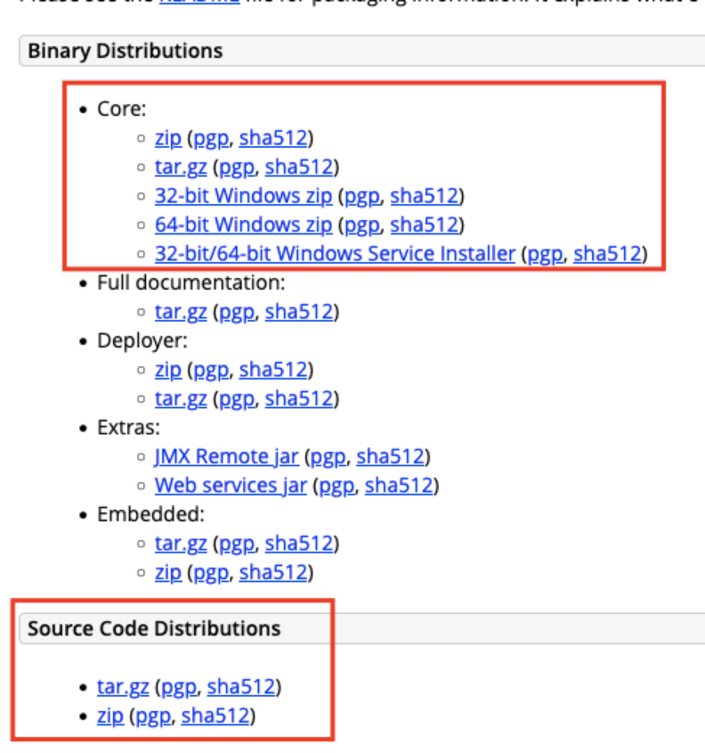

# Tomcat总览

> 基于 **Tomcat 8.5.x** 整理。
> 官方网站：https://tomcat.apache.org/ ｜ 官方文档：https://tomcat.apache.org/tomcat-8.5-doc/index.html

## 📋 总纲

| # | 章节 | 说明 |
|---|---|---|
| 00 | 本页（总览） | 学习路线、章节索引、关联笔记 |
| 01 | [01-Tomcat系统架构与原理剖析](01-Tomcat系统架构与原理剖析.md) | 浏览器访问流程、Coyote 连接器、Catalina 容器、Container 组件体系 |
| 02 | [02-Tomcat服务器核心配置详解](02-Tomcat服务器核心配置详解.md) | server.xml 全标签：Server/Service/Executor/Connector/Engine/Host/Valve/Context |
| 03 | [03-Tomcat源码构建](03-Tomcat源码构建.md) | 源码下载、pom.xml、IDE 导入、Bootstrap 运行配置 |
| 04 | [04-Tomcat核心流程剖析](04-Tomcat核心流程剖析.md) | 启动流程（startup.sh→Bootstrap）、请求流程、源码跟踪 |
| 05 | [05-Tomcat类加载机制剖析](05-Tomcat类加载机制剖析.md) | 类加载器体系（简版，
| 06 | [06-Tomcat类加载机制详解](06-Tomcat类加载机制详解.md) | ⭐ 重点独立篇：双亲委派打破、类隔离、热部署原理（深度展开 05） |
| 07 | [07-Tomcat对HTTPS的支持](07-Tomcat对HTTPS的支持.md) | HTTPS 原理、握手流程、keytool 配置 |
| 08 | [08-Tomcat性能优化策略](08-Tomcat性能优化策略.md) | JVM 内存/GC 调优、线程池/连接器/IO 模式调优、动静分离 |

## 学习路线建议

1. **先读第 1 章**：建立整体架构认知（连接器 Coyote + 容器 Catalina 的分工）
2. **再读第 2 章**：server.xml 配置是日常开发/运维接触最多的部分
3. **第 4 章 + 第 3 章配合**：搭源码环境跑起来，打断点跟启动/请求流程
4. **第 5 → 6 章**：类加载是面试重点，05 简版入门后直接看深度版 [06-Tomcat类加载机制详解](06-Tomcat类加载机制详解.md)
5. **第 7、8 章**：按需查阅（HTTPS 配置、性能调优实战）

## 关联笔记

- [06-Tomcat类加载机制详解](06-Tomcat类加载机制详解.md) —— 类加载专题深度版（双亲委派打破、类隔离、热部署）
- **Java类加载机制与双亲委派详解**（见知识库） —— JDK 侧前置知识
- **JVM调优实战**（见知识库） —— JVM 参数与 GC 实战
- [01-Tomcat系统架构与原理剖析](01-Tomcat系统架构与原理剖析.md) —— 架构专题

