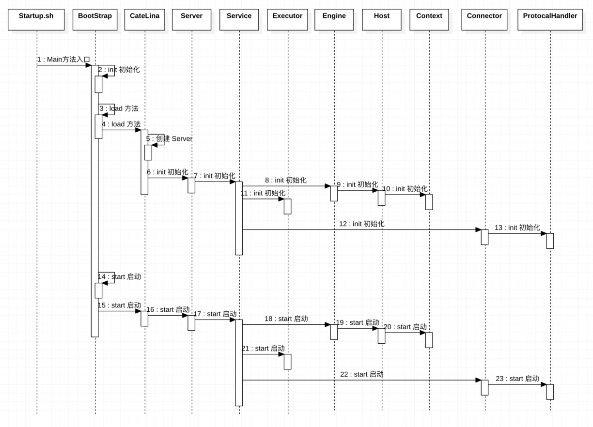
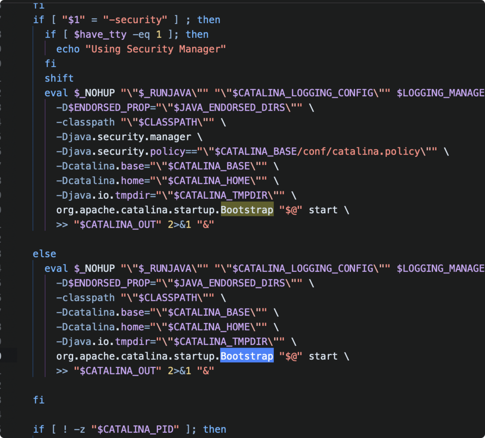
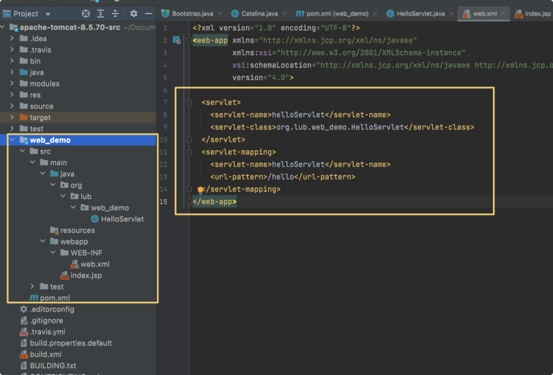
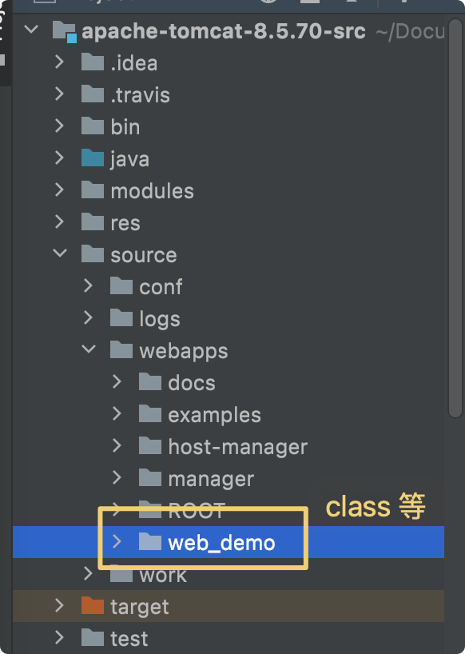
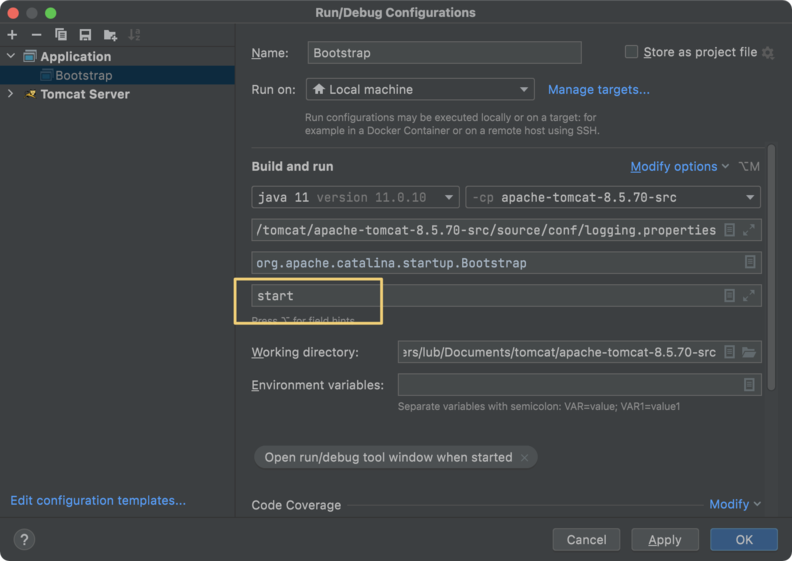

# Tomcat核心流程剖析

> 本文是 Tomcat 学习笔记第 4 章。剖析 Tomcat 的启动流程与请求处理流程，配合源码跟踪理解。
> 关联笔记：[00-Tomcat总览](00-Tomcat总览.md)、[01-Tomcat系统架构与原理剖析](01-Tomcat系统架构与原理剖析.md)、[03-Tomcat源码构建](03-Tomcat源码构建.md)

## 📋 总纲

1. 启动流程（startup.sh → catalina.sh → Bootstrap → init）
2. 请求流程
3. 源码跟踪构建（Web 项目部署验证）

---

## 1. 启动流程



### 1.1 startup.sh

```
startup.sh
   └── 调用 catalina.sh
        └── 之后指向 org.apache.catalina.startup.Bootstrap 的 main 方法
```



- 用户在 bin 目录执行 `startup.sh`
- startup.sh 内部调用 `catalina.sh start`
- catalina.sh 解析参数后，通过 Java 命令执行 **`org.apache.catalina.startup.Bootstrap` 的 `main` 方法**

### 1.2 Bootstrap

**Bootstrap 是 Tomcat 的启动引导类**：

```
Bootstrap.main()
   └── 内部调用 init 方法
        └── 初始化类加载器、加载 Catalina 等
        └── 其他如图顺代码（daemon.start() → Catalina.start()）
```


关键点：

- **Bootstrap**：入口，负责创建类加载器体系（common/catalina/shared），加载并启动 Catalina
- **Catalina**：解析 server.xml，创建 Server → Service → Connector/Engine 组件树，并启动
- **Lifecycle 机制**：所有组件实现 Lifecycle 接口，按层级 init → start（优雅启动/关闭）

**启动链路总结**：

```
startup.sh → catalina.sh → Bootstrap.main() → Bootstrap.init()
→ Catalina.start() → Server.init/start → Service → Connector + Engine
→ Host → Context → Wrapper（应用加载）
```

---

## 2. 请求流程

**略**（原文未展开）。请求处理链路参考：

```
浏览器 HTTP 请求
  → Connector（Coyote：EndPoint 收 Socket → Processor 解析 HTTP）
  → CoyoteAdapter（Tomcat Request → ServletRequest）
  → Engine → Host → Context → Wrapper（Servlet.service()）
  → 响应反向返回
```

> 详细组件职责见 [01-Tomcat系统架构与原理剖析](01-Tomcat系统架构与原理剖析.md) 第 3、4 章。

---

## 3. 源码跟踪构建（Web 项目部署验证）

**目的**：在源码工程中部署一个 Web 项目，验证源码环境可正常处理请求，方便断点跟踪。

### 3.1 新建 Web 项目



- 用 IDE 新建一个 Web 项目（如 web_demo），写一个简单的 Servlet（hello）
- 可以在这里进行**部署到 Tomcat 成品中测试**（先验证业务代码正确）

### 3.2 拷贝到源码 webapps

将上一步项目部署测试后 **War 包解压后的文件夹**，拷贝到源代码的 `webapps` 目录中：



### 3.3 启动源码工程



此处启动项目之后，可在浏览器访问：

```
http://localhost:8080/web_demo/hello
```

能够访问成功，表示**源码环境构建成功**——后续就可以在 IDE 里打断点，跟踪请求从 Connector 到 Servlet 的完整源码链路。

---

## 面试追问 Q&A

### Q1：Tomcat 启动入口是什么？启动链路怎么走？

答：`startup.sh` → `catalina.sh` → `Bootstrap.main()` → `Bootstrap.init()` → `Catalina.start()`。Catalina 解析 server.xml 创建组件树（Server→Service→Connector/Engine→Host→Context），所有组件通过 Lifecycle 接口按层级 init→start。

### Q2：Bootstrap 和 Catalina 的分工？

答：Bootstrap 是**引导类**，负责创建 Tomcat 的类加载器体系（common/catalina/shared）并加载 Catalina；Catalina 是**真正的启动器**，负责解析配置、创建和启动组件树。

### Q3：为什么组件都用 Lifecycle 接口？

答：统一管理复杂组件的**生命周期**（init→start→stop→destroy），实现优雅启动/关闭、按层级传播状态，避免每个组件自己管理启动逻辑。

