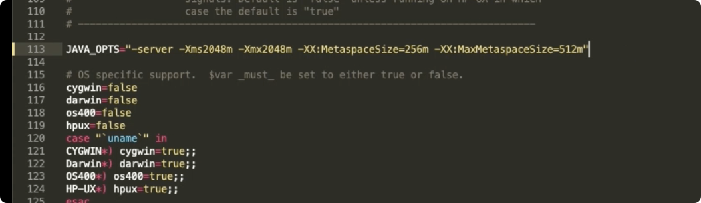
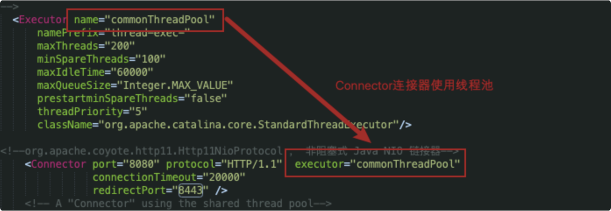
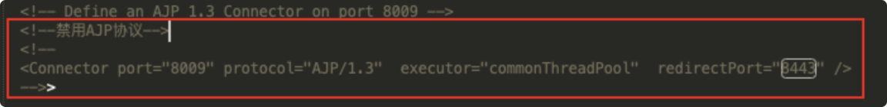

# Tomcat 性能优化策略

> 本文是 Tomcat 学习笔记第 7 章（wolai 转存整理）。从 **JVM 层** 和 **Tomcat 配置层** 两个维度讲解性能优化。
> 性能优化的衡量指标：**响应时间**（执行某个操作的耗时）和**吞吐量**（系统在给定时间内能够支持的事务数量，单位 TPS，Transaction Per Second；一个事务 = 客户机发送请求到服务器做出反应的过程）。
> 关联笔记：[tomcat-overview](tomcat-overview.md)、**JVM 调优实战**（见知识库）、[tomcat-server-config](tomcat-server-config.md)

## 📋 总纲

1. JVM 运行优化（内存参数调整）
2. 垃圾回收策略优化
3. Tomcat 配置调优（线程池/连接器/IO 模式/动静分离）

---

## 1. 虚拟机运行优化（参数调整）

JVM 的运行优化主要是**内存分配**和**垃圾回收策略**的优化：

- 内存直接影响服务的运行效率和吞吐量
- JVM 垃圾回收机制则会不同程度地导致程序运行中断
- 可以选择不同的垃圾回收策略，极大减少垃圾回收次数、提升垃圾回收效率，从而改善运行性能

### 1.1 JVM 内存相关参数

| 参数 | 参数作用 | 优化建议 |
|---|---|---|
| `-server` | 启动 Server 模式运行 | 服务端模式建议开启 |
| `-Xms` | **最小堆内存** | 建议与 `-Xmx` 设置相同（避免堆抖动扩容） |
| `-Xmx` | **最大堆内存** | 建议设置为**可用内存的 80%** |
| `-XX:MetaspaceSize` | 元空间初始值 | 按需设置 |
| `-XX:MaxMetaspaceSize` | 元空间最大内存 | 默认无限 |
| `-XX:NewRatio` | 年轻代和老年代大小比值 | 取整数，默认 2，一般不需要修改 |
| `-XX:SurvivorRatio` | Eden 区和 Survivor 区大小的比值 | 取整数，默认 8，一般不需要修改 |

配置方式：直接放在 **catalina.sh 脚本**中：



```bash
# catalina.sh 中的 JAVA_OPTS
JAVA_OPTS="-server -Xms1024m -Xmx1024m -XX:MetaspaceSize=128m -XX:MaxMetaspaceSize=256m"
```

---

## 2. 垃圾回收策略

### 2.1 垃圾回收性能指标

| 指标 | 说明 |
|---|---|
| **吞吐量** | 工作时间（排除 GC 时间）占总时间的百分比；工作时间不仅是程序运行的时间，还包括内存分配时间 |
| **暂停时间** | 由垃圾回收导致的应用程序停止响应次数/时间 |

### 2.2 垃圾收集器对比

| 收集器 | 特点 | 适用场景 |
|---|---|---|
| **串行收集器**（Serial Collector） | 单线程执行所有垃圾回收工作 | 单核 CPU 服务器 |
| **并行收集器**（Parallel Collector） | 又称吞吐量收集器（关注吞吐量），以并行方式执行年轻代垃圾回收，显著降低垃圾回收开销（多条 GC 线程并行工作，但此时用户线程仍处于等待状态） | 多处理器或多线程硬件上运行的数据量较大的应用 |
| **CMS 收集器**（Concurrent Mark Sweep） | 并发标记清除收集器 | 更愿意缩短垃圾回收暂停时间、且负担得起与 GC 共享处理器资源的应用 |
| **G1 收集器**（Garbage-First） | 满足垃圾回收暂停时间的同时，以最大可能性实现高吞吐量 | **大容量内存的多核服务器**；JDK 1.7 以后 |

> **补充（JDK 版本演进）**：JDK 8 默认 Parallel；JDK 9+ 默认 G1；JDK 17+ G1 仍是主流，ZGC（低延迟）也已可用。生产建议优先 G1。

### 2.3 垃圾回收器参数

| 参数 | 描述 |
|---|---|
| `-XX:+UseSerialGC` | 启动串行收集器 |
| `-XX:+UseParallelGC` | 启动并行收集器；配置该参数后 `-XX:+UseParallelOldGC` 默认启用 |
| `-XX:+UseParNewGC` | 年轻代采用并行收集器；如果设置了 `-XX:+UseConcMarkSweepGC` 选项，自动启用 |
| `-XX:+ParallelGCThreads` | 年轻代即老年代垃圾回收使用的线程数；默认值依赖于 JVM 使用的 CPU 个数 |
| `-XX:+UseConcMarkSweepGC` | 对老年代启动 CMS 收集器；并行收集器无法满足延迟需求时推荐 CMS 或 G1；启用后 `-XX:+UseParNewGC` 自动启用 |
| `-XX:+UseG1GC` | 启动 G1 收集器 |

配置方式（同样在 catalina.sh 中追加）：

```bash
JAVA_OPTS="$JAVA_OPTS -XX:+UseG1GC -XX:ParallelGCThreads=4"
```

---

## 3. Tomcat 配置调优

### 3.1 调整 Tomcat 线程池



在 server.xml 中配置共享线程池：

```xml
<Executor name="tomcatThreadPool"
          namePrefix="catalina-exec-"
          maxThreads="200"
          minSpareThreads="20"
          maxIdleTime="60000"
          prestartminSpareThreads="true"/>
```

- `maxThreads`：最大线程数（结合硬件与并发量设置，参考值 200~500）
- `minSpareThreads`：核心线程数（常驻，建议预启动 `prestartminSpareThreads="true"` 避免首个请求慢）
- 详见 [tomcat-server-config](tomcat-server-config.md) 第 3 章

### 3.2 调整 Tomcat 的连接器

> 调整 Tomcat/conf/server.xml 中关于连接器的配置，可以提升应用服务器的性能。

**参数说明**：

| 参数 | 说明 |
|---|---|
| `maxConnections` | **最大连接数**。到达该值后，服务器接收但不会处理更多的请求，额外的请求将会阻塞直到连接数低于该值。**默认值**：NIO/NIO2 为 10000，APR 为 8192（NIO 下设为 -1 可关闭限制）。可通过 `ulimit -a` 查看服务器限制。对于 CPU 要求更高（计算型）时建议不要配置过大；CPU 要求不是特别高时建议配置在 2000 左右（受服务器性能影响，需要硬件支持） |
| `maxThreads` | 最大线程数，需要根据服务器硬件情况做合适设置（默认 200） |
| `acceptCount` | **最大排队等待数**（OS 层连接队列长度）。当服务器接收的请求数量到达 maxConnections，此时新请求将会阻塞排队。**默认值 100**。队列满时 OS 可能主动拒绝新连接或让其超时 |

**关键公式**（粗略估算）：

```
一台 Tomcat 能同时承载的请求量 ≈ maxConnections + acceptCount
```

> **精确语义**（官方文档）：`maxConnections` 是服务器**同时处理**的连接数上限；达到上限后，新连接进入 `acceptCount` 队列等待；队列也满则 OS 拒绝/超时。`maxThreads` 是处理请求的线程数，三者独立配置，需配合调整（如 maxConnections 小于 maxThreads 时部分线程闲置）。

配置示例：

```xml
<Connector port="8080" protocol="HTTP/1.1"
           maxConnections="2000"
           maxThreads="300"
           acceptCount="500"
           connectionTimeout="20000"
           redirectPort="8443"/>
```

### 3.3 禁用 AJP 连接器



- **AJP 协议**用于 Tomcat 与 Apache/nginx 等 Web 服务器集成
- 如果**没有使用 Apache 等集成需求，建议禁用 AJP**（减少攻击面 + 省资源）
- 注释掉 server.xml 中的 AJP Connector 即可：

```xml
<!-- <Connector port="8009" protocol="AJP/1.3" redirectPort="8443" /> -->
```

### 3.4 调整 IO 模式

- Tomcat **8 之前的版本默认使用 BIO**：对于每一个请求都要创建一个线程来处理，不适用高并发
- **Tomcat 8 以后默认使用 NIO 模式**
- 当 Tomcat 并发性能有较高要求或出现瓶颈时，可以尝试 **APR 模式**

参考：https://blog.csdn.net/xyang81/article/details/51502766 、https://tomcat.apache.org/tomcat-7.0-doc/apr.html

```xml
<!-- 显式指定 NIO（8.5+ 默认） -->
<Connector port="8080" protocol="org.apache.coyote.http11.Http11NioProtocol" .../>
<!-- 或 APR（需安装 native 库） -->
<Connector port="8080" protocol="org.apache.coyote.http11.Http11AprProtocol" .../>
```

### 3.5 动静分离

> 可以使用 **Nginx + Tomcat 相结合**的部署方案：Nginx 负责静态资源访问，Tomcat 负责 JSP 等动态资源访问处理（因为 Tomcat 相对来说不擅长处理静态资源）。

```
客户端 → Nginx（静态资源：html/css/js/图片）
              └→ 动态请求转发 → Tomcat（JSP/Servlet）
```

---

## 面试追问 Q&A

### Q1：Tomcat 性能优化从哪几个层面入手？

答：两层：**JVM 层**（内存参数 Xms/Xmx/Metaspace、GC 收集器选择）和 **Tomcat 配置层**（线程池 Executor、Connector 的 maxConnections/maxThreads/acceptCount、禁用 AJP、IO 模式、动静分离）。

### Q2：maxConnections、maxThreads、acceptCount 的关系？

答：maxConnections 是能同时处理的连接数上限；到达上限后新请求进 acceptCount 队列排队等待；maxThreads 是处理请求的线程数。最大请求处理量 = maxConnections + acceptCount。

### Q3：BIO 和 NIO 的差异？

答：BIO 一请求一线程，高并发线程爆炸；NIO 基于 Selector 事件驱动，少量线程处理大量连接。Tomcat 8 前默认 BIO，8 起默认 NIO，追求更高并发可上 APR。

### Q4：JVM 内存参数 Xms 和 Xmx 为什么要相等？

答：相等可以避免堆在运行中反复扩容/缩容（每次扩容都伴随 Full GC 和停顿）。建议 Xms=Xmx=可用内存 80%，并配合合适的 GC 收集器。

---

*来源：wolai 笔记转存（Apache Tomcat 学习笔记第 7 章），2026-08-08 整理*
