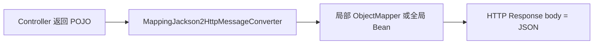

---
tags:
  - Java
  - JSON
  - Jackson
  - SpringBoot
创建日期: 2026-08-14
状态: ✅ 已归档（01-学习/Java/三方库/JSON序列化）
归属: 01-学习/Java/三方库/JSON序列化
---

# Jackson 与 Spring Boot 集成详解

## 📋 总纲

本篇讲 Jackson 的招牌场景——**Spring Boot 全自动集成**。读完你会：知道 Boot 如何默认装配 Jackson（`spring-boot-starter-json`）、用 `spring.jackson.*` 全局配置、用自定义 Bean/`@JsonComponent`/Customizer 精确覆盖、理解 `MappingJackson2HttpMessageConverter` 流程、WebFlux 下的处理，以及 **Jackson 3 迁移方向**。

> 前置：[05-Jackson核心与ObjectMapper详解](05-Jackson核心与ObjectMapper详解.md) + [06-Jackson注解与高级定制详解](06-Jackson注解与高级定制详解.md)；踩坑：[99-JSON序列化踩坑记录](99-JSON序列化踩坑记录.md)。

## 1. 默认安装

`spring-boot-starter-web` 自带 `spring-boot-starter-json`，内置 Jackson：

```xml
<dependency>
    <groupId>org.springframework.boot</groupId>
    <artifactId>spring-boot-starter-web</artifactId>
</dependency>
```

- Boot 自动装配 **`MappingJackson2HttpMessageConverter`**，作为默认 JSON 转换器。
- `ObjectMapper` 由 Boot 预制 Bean 自动创建（自动注册 JSR310、关 timestamp、配置 `spring.jackson.*`）。

**说明**：无需任何手动依赖——引入 starter-web 即获得可用 JSON 序列化/反序列化。这是 Jackson 与 Gson/Fastjson2 集成差异的根源（后两者需排除 Jackson 或第三方扩展）。

## 2. spring.jackson.* 配置（★全表）

`application.yml` 支持的全套 `spring.jackson.*`：

```yaml
spring:
  jackson:
    date-format: "yyyy-MM-dd HH:mm:ss"     # java.util.Date 格式
    time-zone: Asia/Shanghai               # 时区
    default-property-inclusion: non_null    # 全局忽略 null 字段
    serialization:
      indent-output: true                  # 美化
      write-dates-as-timestamps: false      # 日期写字符串而非时间戳
    deserialization:
      fail-on-unknown-properties: false     # 未知字段不报错
    parser:
      allow-single-quotes: true             # 允许单引号 JSON
    generator:
      write-numbers-as-strings: false
    mapper:
      accept-case-insensitive-properties: true
    visibility:
      field: any                            # 字段可见性
```

| 配置块 | 作用 |
|---|---|
| `date-format` / `time-zone` | java.util.Date 格式与时区 |
| `default-property-inclusion` | 全局包含策略（`non_null`/`non_empty` 等） |
| `serialization.*` | 映射 `SerializationFeature` |
| `deserialization.*` | 映射 `DeserializationFeature` |
| `visibility.*` | 字段/getter/setter 可见性 |
| `parser.*` / `generator.*` | 底层 parser/generator feature |

**说明**：Boot 把 `spring.jackson.*` 绑定到 `Jackson2ObjectMapperBuilder`，最终生成全局 `ObjectMapper`。`default-property-inclusion: non_null` 可实现全局 `@JsonInclude(NON_NULL)` 效果。

## 3. 自定义 ObjectMapper Bean（★）

### 3.1 直接 @Bean 覆盖

```java
@Bean
ObjectMapper objectMapper() {
    return new ObjectMapper()
        .registerModule(new JavaTimeModule())
        .disable(SerializationFeature.WRITE_DATES_AS_TIMESTAMPS);
}
```

**说明**：返回的 `ObjectMapper` Bean 会替换 Boot 默认实例。但**注意**：复用了 Boot 的 `Jackson2ObjectMapperBuilder` 提供的自动注册（JSR310 等）吗？手动 `new ObjectMapper()` 会丢掉部分 Boot 预制功能，需自行补齐。

### 3.2 @JsonComponent（Spring 推荐）

```java
@JsonComponent
public class MoneyJson {
    static class Ser extends JsonSerializer<Money> { ... }
    static class Des extends JsonDeserializer<Money> { ... }
}
```

**说明**：`@JsonComponent` 让 Spring 自动把内部的 Serializer/Deserializer 注册进全局 ObjectMapper，无需手动 `registerModule`，是 **Boot 官方推荐**的自定义方式（Bean 内嵌 static 类即可）。

### 3.3 ObjectMapperBuilderCustomizer（Boot 2.2+ / Boot3 推荐，不覆盖 Builder）

```java
@Bean
ObjectMapperBuilderCustomizer jacksonCustomizer() {
    return builder -> builder
        .serializationInclusion(JsonInclude.Include.NON_NULL)
        .featuresToDisable(SerializationFeature.WRITE_DATES_AS_TIMESTAMPS);
}
```

**说明**：`ObjectMapperBuilderCustomizer` 是**对既有 Builder 做追加配置、多个 Customizer 可叠加**的推荐方式，**不覆盖**整个 `Jackson2ObjectMapperBuilder`，比直接 `@Bean ObjectMapper` 更精细、不会丢失 Boot 默认配置。

### 3.4 Jackson2ObjectMapperBuilder 的关系

`Jackson2ObjectMapperBuilder` 是构建管线本身；`spring.jackson.*` → Builder 属性，Customizer 可再改。直接 `@Bean ObjectMapper` 则完全接管、绕过 Builder。推荐用「Customizer 追加」保持兼容。

## 4. HttpMessageConverter

`MappingJackson2HttpMessageConverter` 负责**对象↔HTTP body**：

流程（Web 返回对象 → converter → JSON）：



- 输入同理：HTTP Request body(JSON) → converter 用 ObjectMapper 反序列化成 POJO 参数。
- 如需自定义转换器优先级/列表，可在 Spring MVC 配置：

```java
@Configuration
public class WebConfig implements WebMvcConfigurer {
    @Override
    public void configureMessageConverters(List<HttpMessageConverter<?>> converters) {
        // 手动管理列表（含自己加的 converter）
    }
}
```

**说明**：Boot 默认自动注册此 converter；`configureMessageConverters` 可调整列表，但手动管理会丢 Boot 默认，谨慎使用。

## 5. WebFlux 提示

Spring WebFlux 响应式：

- 默认 JSON 序列化同样走 `Jackson2ObjectMapperBuilder` 生成的 ObjectMapper。
- 但**响应类型是 `Mono`/`Flux` 或 `ServerResponse`**，序列化发生在流式写入阶段。
- 全局 `spring.jackson.*` 与 Customizer 同样生效；对 WebFlux Controller 返回的 POJO/`Flux<POJO>` 自动处理。

**说明**：WebFlux 无需单独配置，`spring.jackson.*` 全局共享；注意 `Flux<POJO>` 默认按数组流式输出。

## 6. Jackson 3 迁移方向（★）

```yaml
# Boot3 默认仍用 Jackson 2（jackson-databind 2.x）
# 未来迁移到 Jackson 3 时包名变化
```

- **Boot 3+ 默认 Jackson 2**（`com.fasterxml.jackson`）。
- **Jackson 3 包名**：`tools.jackson`（`tools.jackson.core.JsonMapper` 等），与 2.x 的 `com.fasterxml.jackson` 不同。
- **兼容模块**：`spring-boot-jackson2` 兼容模块帮助平滑过渡。
- **核心类名变化**：`ObjectMapper` → **`JsonMapper`**（Jackson 3 核心类是 `JsonMapper`），部分 API 调整。

```java
// Jackson 3（示意）
import tools.jackson.databind.json.JsonMapper;
JsonMapper mapper = JsonMapper.builder().build();
var json = mapper.writeValueAsString(obj);
```

**说明**：目前主流仍是 Jackson 2；Jackson 3 迁移点 = 包名 `tools.jackson` + 核心类 `JsonMapper` + 配置式 Builder。**迁移前复核官方迁移文档**（据官方文档请复核）。

## 7. 实操配置示例 + 踩坑

### 7.1 场景：全局驼峰→下划线 + globally 忽略 null + 日期字符串

```yaml
spring:
  jackson:
    default-property-inclusion: non_null
    property-naming-strategy: SNAKE_CASE
    serialization:
      write-dates-as-timestamps: false
```

**说明**：一套配置搞定字段风格、null 省略、日期格式三件事。

### 7.2 踩坑点

| 现象 | 原因/解决方案 |
|---|---|
| 日期变时间戳 | 未 `write-dates-as-timestamps: false` 或未注册 JSR310 |
| 未知字段报错 | `deserialization.fail-on-unknown-properties: false` |
| 下划线/驼峰对不上 | `property-naming-strategy` 或 `@JsonNaming` |
| 全局想忽略 null | `default-property-inclusion: non_null` 或 `@JsonInclude` |
| 时间格式含 T 而非空格 | 配 `date-format` + `time-zone` + 注册模块 |

> 踩坑详细见 [99-JSON序列化踩坑记录](99-JSON序列化踩坑记录.md) 与 #6.1。

## 8. 安全检查

- **避免全站 `enableDefaultTyping`**：Boot 默认**不**启用，安全基线良好，不要为多态全局开。
- Boot 默认安全：未知类型不自动实例化、`FAIL_ON_UNKNOWN_PROPERTIES` 关闭但不做类型注入。
- 多态只在必要时用 `@JsonTypeInfo` + `@JsonSubTypes` 白名单，**不需要特意开全局 DefaultTyping**。
- 版本：保持在安全版本线之上（2.22.1 等），见 00 篇安全表。

```java
// 多态安全：白名单式而非全局 defaultTyping
@JsonTypeInfo(use = Id.NAME, property = "type")
@JsonSubTypes({ @JsonSubTypes.Type(Dog.class, name = "dog") })
```

**说明**：Boot 默认安全姿态（无 DefaultTyping）是首道防线；多态用白名单 `@JsonSubTypes` 是第二道；服务端做具体类校验是第三道。

## 小结

- Boot 通过 `spring-boot-starter-json` 自动装配 `MappingJackson2HttpMessageConverter` + 预置 ObjectMapper。
- `spring.jackson.*` 覆盖日期/包含策略/Feature/可见性等全套。
- 自定义推荐用 `@JsonComponent` 与 `ObjectMapperBuilderCustomizer`（叠加、不丢默认），慎用整 Bean 覆盖。
- WebFlux 共享全局配置；Jackson 3 迁移 = 包名 `tools.jackson` + 核心类 `JsonMapper` + `spring-boot-jackson2`。
- 安全：保持默认（不全局 DefaultTyping），多态白名单。

## 相关笔记

- Jackson 核心：[05-Jackson核心与ObjectMapper详解](05-Jackson核心与ObjectMapper详解.md)
- 注解高级：[06-Jackson注解与高级定制详解](06-Jackson注解与高级定制详解.md)
- 踩坑总库：[99-JSON序列化踩坑记录](99-JSON序列化踩坑记录.md)
