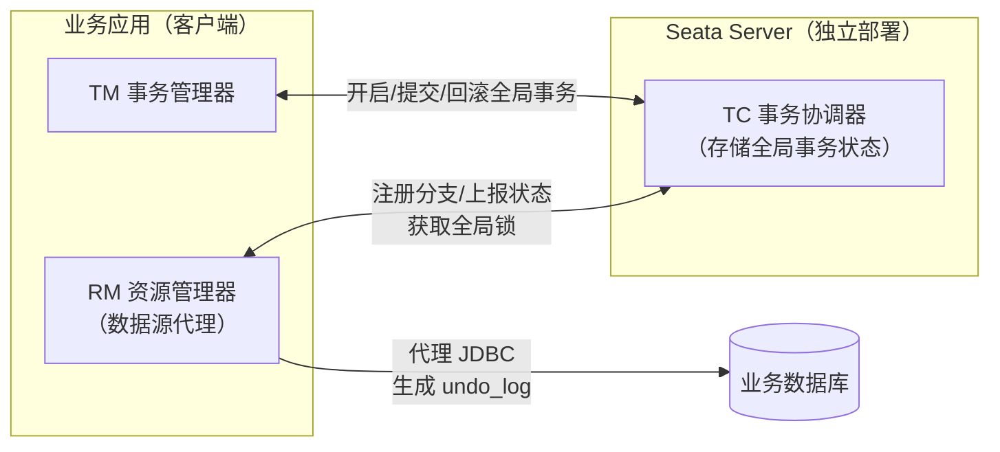

# Seata 分布式事务框架详解

> Seata 是 **Java 生态**的分布式事务框架（Apache 顶级项目，前身阿里 FESCAR），本文是其专项深度笔记：整体架构（TC/TM/RM）、四种模式（AT/TCC/Saga/XA）逐个细化，**重点讲透 AT 模式**的 undo_log 反向 SQL、全局锁与读写隔离。
> **版本基线**：Apache Seata v2.6（官方文档 2026-08-10 查证）| 创建日期：2026-08-10
> **受众**：Java 后端开发熟手，已理解分布式事务各方案原理（见 [04-分布式事务详解](../../../../分布式/核心原理/04-分布式事务详解.md)），需要深入框架实现细节、准备框架级面试。
> 前置知识：[04-分布式事务详解](../../../../分布式/核心原理/04-分布式事务详解.md)（方案原理）、[02-CAP与BASE理论详解](../../../../分布式/核心原理/02-CAP与BASE理论详解.md)、[09-Spring事务管理详解](../../../框架/spring/09-Spring事务管理详解.md)（本地事务/传播机制）、[05-分布式ID与幂等设计详解](../../../../分布式/核心原理/05-分布式ID与幂等设计详解.md)

---

## 目录

- [1. 学习目标](#1-学习目标)
- [2. 前置知识](#2-前置知识)
- [3. 核心知识点](#3-核心知识点)
  - [3.1 知识点一：Seata 是什么——TC / TM / RM 三组件](#31-知识点一seata-是什么tc--tm--rm-三组件)
  - [3.2 知识点二：四种模式总览](#32-知识点二四种模式总览)
  - [3.3 知识点三：AT 模式整体机制（重点①）](#33-知识点三at-模式整体机制重点)
  - [3.4 知识点四：AT 一阶段工作机制——前镜像/后镜像/undo_log（重点②）](#34-知识点四at-一阶段工作机制前镜像后镜像undo_log重点)
  - [3.5 知识点五：AT 写隔离——全局锁（重点③）](#35-知识点五at-写隔离全局锁重点)
  - [3.6 知识点六：AT 读隔离——默认读未提交，FOR UPDATE 提升](#36-知识点六at-读隔离默认读未提交for-update-提升)
  - [3.7 知识点七：undo_log 表结构与工程要求](#37-知识点七undo_log-表结构与工程要求)
  - [3.8 知识点八：Seata TCC 模式](#38-知识点八seata-tcc-模式)
  - [3.9 知识点九：Seata Saga 模式（状态机引擎）](#39-知识点九seata-saga-模式状态机引擎)
  - [3.10 知识点十：Seata XA 模式](#310-知识点十seata-xa-模式)
  - [3.11 知识点十一：版本演进与部署（工程向）](#311-知识点十一版本演进与部署工程向)
  - [3.12 知识点十二：关键参数与调优（官方配置对照表）](#312-知识点十二关键参数与调优官方配置对照表)
  - [3.13 知识点十三：性能优化与监控](#313-知识点十三性能优化与监控)
  - [3.14 知识点十四：安全与高可用（集群/降级/加密）](#314-知识点十四安全与高可用集群降级加密)
  - [3.15 知识点十五：故障排查实战（Global lock wait timeout 等）](#315-知识点十五故障排查实战global-lock-wait-timeout-等)
- [4. 最佳实践](#4-最佳实践)
- [5. 常见踩坑](#5-常见踩坑)
- [6. 小结](#6-小结)
- [7. 关联笔记](#7-关联笔记)
- [8. 参考资料](#8-参考资料)

---

## 1. 学习目标

学完本文你应当能够：

- 讲清 Seata 的**三个角色 TC/TM/RM** 各自职责与通信关系，全局事务 XID 如何透传。
- 完整复述 **AT 模式**一阶段（前镜像/后镜像/undo_log 同事务提交）与二阶段（异步提交/反向补偿）的机制，能画出流程。
- 解释 **undo_log 如何自动生成反向 SQL**，数据校验（后镜像比对）失败时的 dirty check 策略。
- 说清 **全局锁** 的获取时机、与本地锁的关系、为什么能防脏写、什么场景会成为瓶颈。
- 理解 AT 默认**读未提交**、SELECT FOR UPDATE 如何提升到读已提交。
- 对比 **AT vs XA vs TCC** 的取舍，知道 Seata TCC 的注解用法与三大异常处理。
- 了解 **Saga 状态机**（JSON 状态语言）与空补偿/防悬挂/幂等最佳实践。
- 掌握 Seata 部署演进：store.mode（file/db/redis/raft）、1.5.1 lock/session 分离存储、注册中心接入、RocketMQ 事务消息集成。
- 会查**官方参数表**调优：全局锁重试、异步提交缓冲、二阶段并行下发、undo 清理策略。
- 能讲清**性能优化三板斧**与 Metrics 监控接入，说出事务成功率/回滚率看板指标。
- 理解**安全与高可用**：TC 集群（raft/db）、自动降级开关、配置密码加密。
- 掌握**故障排查**：Global lock wait timeout、undo 回滚失败（脏数据）、分支悬挂三类问题的定位思路。

---

## 2. 前置知识

- [04-分布式事务详解](../../../../分布式/核心原理/04-分布式事务详解.md)——2PC/TCC/Saga 方案原理（本文是它们的框架实现）。
- [02-CAP与BASE理论详解](../../../../分布式/核心原理/02-CAP与BASE理论详解.md)——AT 的写隔离为什么是"准强一致"。
- [09-Spring事务管理详解](../../../框架/spring/09-Spring事务管理详解.md)——本地事务、@Transactional 传播，AT 是建立在本地事务之上的。
- [05-分布式ID与幂等设计详解](../../../../分布式/核心原理/05-分布式ID与幂等设计详解.md)——XID/分支 ID 的生成与透传。

---

## 3. 核心知识点

### 知识点一：Seata 是什么——TC / TM / RM 三组件

**一句话记忆**：**Seata 把"全局事务"抽象成 TC（服务端协调者）+ TM/RM（客户端两个代理），用注解把业务方法包进一个全局事务**。

#### ① 是什么

Seata（Simple Extensible Autonomous Transaction Architecture）提供 **AT、TCC、SAGA、XA** 四种模式，覆盖强一致到最终一致。核心是把"分布式事务"标准化为**全局事务（Global Transaction）**，一个全局事务由若干**分支事务（Branch Transaction）**组成，分支之间用两阶段模型协调。

#### ② 三个角色的职责（必背）

| 角色 | 全称 | 部署位置 | 职责 |
|---|---|---|---|
| **TC** | Transaction Coordinator 事务协调器 | **服务端**独立部署（seata-server） | 维护全局/分支事务状态，驱动全局提交或回滚 |
| **TM** | Transaction Manager 事务管理器 | **客户端**（业务应用） | 开启/提交/回滚全局事务（@GlobalTransactional 触发） |
| **RM** | Resource Manager 资源管理器 | **客户端**（业务应用） | 管理分支事务资源，向 TC 注册分支、上报状态、执行分支提交/回滚 |



#### ③ 全局事务 XID 如何传播

TM 开启全局事务生成 **XID**（全局唯一事务 ID），通过 RPC 调用链透传（Dubbo/Feign 等框架自动放入 header/attachment），下游服务拿到 XID 后，RM 才知道自己的本地事务属于哪个全局事务。**XID 透传是 Seata 客户端集成的核心工作**——这就是为什么要有 seata 的 RPC 集成包（dubbo-seata、spring-cloud-alibaba-seata）。

#### ④ 易错点

- TC 是**服务端**，TM/RM 是**客户端**，三者都是"角色"概念，不是独立进程——TM/RM 和业务跑在同一个 JVM。
- 一个服务可以同时是 TM（自己开全局事务）和 RM（参与别人的全局事务）。

#### ⑤ 追问

- 面试官：Seata Server 挂了，业务还能跑吗？→ 分支本地事务照常执行（AT 一阶段已提交），但全局事务无法完成二阶段协调，会挂起/超时回滚，生产必须给 TC 做集群高可用（seata-server 支持多节点）。

---

### 知识点二：四种模式总览

**一句话记忆**：**AT 是自动版 2PC（undo_log 自动补偿）、TCC 是业务版两阶段、Saga 是长事务状态机、XA 是数据库原生两阶段**。

| 模式 | 一致性 | 侵入性 | 依赖 | 一阶段 | 二阶段 | 适用 |
|---|---|---|---|---|---|---|
| **AT** | 准强一致（写隔离） | **低**（注解+数据源代理） | 关系型数据库（支持本地 ACID）+ JDBC | 业务 SQL + undo_log 同本地事务提交 | 提交：异步删 undo_log；回滚：undo_log 反向补偿 | 首选，Java 项目跨库一致性 |
| **TCC** | 业务级强一致 | 高（Try/Confirm/Cancel 三方法） | 无（不依赖数据库事务） | 业务自定义 prepare | 业务自定义 commit/rollback | 核心交易、非数据库资源、跨异构系统 |
| **Saga** | 最终一致（无隔离） | 中（正向+补偿方法，或状态机 JSON） | 无 | 各子事务直接提交 | 反向补偿已成功步骤 | 长流程、多参与方、遗留系统 |
| **XA** | 强一致 | 低（换数据源代理） | 数据库支持 XA 协议 | 数据库 XA prepare | 数据库 XA commit/rollback | 低并发、强一致、数据库原生支持 |

> 💡 **记忆锚点**：**AT = 数据库行锁自动补偿；TCC = 业务方法手动补偿；Saga = 长流程编排补偿；XA = 数据库厂商的 2PC**。四种模式只是"二阶段"的不同实现方式（自动 vs 手动、数据库 vs 业务）。

#### 追问

- 怎么选？→ 有数据库且 Java 服务 → **AT**（零侵入）；跨异构系统/非数据库资源 → **TCC**；流程长可容忍中间态 → **Saga**；并发低强一致且库支持 → **XA**。

---

### 知识点三：AT 模式整体机制（重点①）

**一句话记忆**：**AT = 2PC 的改良版——一阶段业务和回滚日志一起提交（不长时间持锁），二阶段提交异步化、回滚靠日志自动反向补偿**。

#### ① 整体机制

```
一阶段（本地事务内）：
  执行业务 SQL（如 update product set name='GTS' where name='TXC'）
  解析 SQL → 查前镜像 → 执行 SQL → 查后镜像 → 生成 undo_log
  业务数据更新 + undo_log 记录 在【同一个本地事务】提交 ✅
  → 释放本地锁和连接（不像 2PC 全程锁资源）

二阶段：
  全局提交 → 异步、批量删除 undo_log（非常快）
  全局回滚 → 用 undo_log 的前镜像生成反向 SQL 补偿（自动）
```

**与 2PC 的关键区别**：2PC 的 Prepare 持锁等待；AT 一阶段**本地事务直接提交**，锁立刻释放，只多写了一条 undo_log。所以 AT 吞吐远高于 XA/2PC。

#### ② 为什么：AT 想解决什么问题

2PC/XA 性能差的根源是"准备阶段锁资源等到二阶段"。AT 把"锁"从数据库行锁换成**全局锁**（元数据锁，锁的是"记录"而不是"数据库行"），本地事务秒级提交，把持锁时间从"整个全局事务"缩短到"一个本地事务"，性能大幅提升。

#### ③ 前提条件（易错）

- 必须**关系型数据库**且支持本地 ACID 事务（MySQL InnoDB、Oracle、PostgreSQL 等）。
- **Java 应用 + JDBC 访问**（AT 靠代理 JDBC 数据源实现）。
- 业务表必须有**主键**（前/后镜像定位靠主键）。
- 每张业务库都要建 **undo_log 表**（官方 SQL 脚本）。

#### ④ 追问

- AT 能用 Redis 等非关系存储吗？→ 不能，AT 依赖数据库事务和 SQL 解析，非关系资源要用 TCC/Saga。

---

### 知识点四：AT 一阶段工作机制——前镜像 / 后镜像 / undo_log（重点②）

**一句话记忆**：**SQL 前查一遍（前镜像）、执行、再查一遍（后镜像），把"改前改后"存进 undo_log——这就是反向 SQL 的原料**。

#### ① 完整流程（以 `update product set name='GTS' where name='TXC'` 为例）

| 步骤 | 动作 | 说明 |
|---|---|---|
| 1 | 解析 SQL | 得到类型 UPDATE、表 product、条件 `where name='TXC'` |
| 2 | 查**前镜像** | `select id,name,since from product where name='TXC'` → `(1,'TXC',2014)` |
| 3 | 执行业务 SQL | `update product set name='GTS' where name='TXC'` |
| 4 | 查**后镜像** | 按主键查：`select id,name,since from product where id=1` → `(1,'GTS',2014)` |
| 5 | 写 undo_log | 前后镜像 + SQL 信息组装成一条 JSON，插入 undo_log 表 |
| 6 | 注册分支 | 向 TC 注册分支，**申请该记录的全局锁** |
| 7 | 本地提交 | 业务更新 + undo_log **同事务提交** |
| 8 | 上报 TC | 本地事务结果上报 |

#### ② undo_log 记录长什么样（JSON）

```json
{
  "branchId": 641789253,
  "xid": "xid:xxx",
  "undoItems": [{
    "sqlType": "UPDATE",
    "tableName": "product",
    "beforeImage": { "rows": [{ "fields": [
      {"name":"id","type":4,"value":1},
      {"name":"name","type":12,"value":"TXC"},
      {"name":"since","type":12,"value":"2014"}
    ]}]},
    "afterImage": { "rows": [{ "fields": [
      {"name":"id","type":4,"value":1},
      {"name":"name","type":12,"value":"GTS"},
      {"name":"since","type":12,"value":"2014"}
    ]}]}
  }]
}
```

#### ③ 二阶段回滚：如何自动生成反向 SQL

1. 收到 TC 分支回滚请求，开启本地事务。
2. 按 XID + branchId 查 undo_log。
3. **数据校验（dirty check）**：把 undo_log 中的**后镜像**和当前数据比较——
   - 一致 → 数据未被外部改过，可以安全回滚；
   - 不一致 → 数据被全局事务**之外**的动作改过（脏写），按配置策略处理（`client.rm.reportSuccessEnable` 等，默认抛异常并上报，需人工介入）。
4. 用**前镜像**生成反向 SQL：`update product set name='TXC' where id=1`（注意按主键定位，条件精确）。
5. 提交本地事务，结果上报 TC，删除 undo_log。

> 💡 **记忆锚点**：**前镜像=改前值，后镜像=改后值；回滚时"后镜像校验 + 前镜像还原"**。反向 SQL 不是简单 `update ... set 原值`，而是**按主键**把每条记录恢复到前镜像——所以业务表必须有主键。

#### ④ 易错点

- undo_log 的 rollback_info 是 **longblob**（JSON 序列化压缩存储）。
- 回滚是**逐条记录**按主键 UPDATE，不是执行原始 SQL 的反向（避免条件变化导致误改）。
- 后镜像校验失败说明有**并发脏写**，Seata 默认不会强行覆盖，这是"准强一致"的边界。

#### ⑤ 追问

- INSERT/DELETE 的反向 SQL 是什么？→ INSERT 反向=DELETE（按主键）；DELETE 反向=INSERT（前镜像数据）；UPDATE 反向=UPDATE 回前镜像。三种 SQL 类型 undo_log 的 sqlType 字段区分。

---

### 知识点五：AT 写隔离——全局锁（重点③）

**一句话记忆**：**本地事务提交前必须先拿到"该记录的全局锁"，拿不到就重试等待；全局锁让并发全局事务对同一行串行化，杜绝脏写**。

#### ① 是什么

全局锁由 **TC 维护**（存于 lock_table），锁的粒度是"**某张表的主键记录**"。本地事务提交**前**必须持有对应记录的全局锁，否则**不能提交本地事务**。

#### ② 机制演示（两个全局事务 tx1、tx2 同时更新 a 表 m 字段，初始 1000）

```
tx1：开本地事务 → 拿本地行锁 → m = 1000-100 = 900 → 提交前申请 m 记录【全局锁】✅ → 本地提交，释放本地锁
tx2：开本地事务 → 拿本地行锁 → m = 900-100 = 800 → 提交前申请【全局锁】→ 被 tx1 持有 → 重试等待
     ↓
tx1 全局提交 → 释放全局锁 → tx2 拿到全局锁 → 本地提交 ✅
```

如果 tx1 是**全局回滚**：tx1 要重新拿本地锁做反向补偿；此时 tx2 若还在等全局锁且持有本地锁，tx1 回滚会失败 → **tx1 一直重试回滚，直到 tx2 等锁超时放弃全局锁、回滚本地事务释放本地锁**，tx1 回滚最终成功。

#### ③ 为什么：全局锁 vs 本地锁

| 锁 | 谁持有 | 粒度 | 释放时机 |
|---|---|---|---|
| 本地锁（数据库行锁） | 数据库 | 行 | 本地事务提交/回滚 |
| 全局锁（Seata） | TC | 表+主键记录 | 全局事务结束（提交/回滚） |

两把锁配合：**本地锁保证单库内不冲突，全局锁保证跨库的全局事务对同一记录串行**。因为全局锁在 tx1 结束前一直被 tx1 持有，**不会发生脏写**（tx2 不可能在 tx1 回滚前把数据改了）。

#### ④ 特例/边界：全局锁会成为瓶颈吗（面试高频）

会！**扣库存这种高并发写热点**是全局锁的最大瓶颈：

- 所有并发扣同一商品库存的全局事务，都要抢同一行记录的全局锁 → 串行化等待。
- 等锁超时（`lock.retryInterval` / `lock.retryTimes` 默认 30 次×10ms ≈ 0.3s）→ 放弃并回滚本地事务 → 用户看到失败重试。
- 缓解方案：**分段库存**（按商品 ID 取模分桶，扣库存分散到多个桶）、热点行拆分、异步削峰、或核心扣减改用 TCC（Try 预扣也抢，但业务层可更细粒度控制）。

> ⚠️ **易错点**：AT 的全局锁**不是分布式锁替代品**——它只保护"Seata 全局事务内的写"，不保护全局事务外的普通 SQL。外部系统绕过 Seata 直接改数据，后镜像校验会失败。

#### ⑤ 追问

- 面试官："Seata AT 全局事务偶发超时回滚，但各分支本地都很快，瓶颈在哪？"→ 优先查**全局锁竞争**：TC 的 lock_table 是否有大量等待、`seata.log` 里 `GlobalLockWait` 相关日志、压测热点行并发。定位后再看分段库存/等锁参数。

---

### 知识点六：AT 读隔离——默认读未提交，FOR UPDATE 提升

**一句话记忆**：**AT 默认全局读未提交（RC 库上），要全局读已提交就代理 SELECT FOR UPDATE 申请全局锁**。

#### ① 是什么

在数据库本地隔离级别 **读已提交（RC）及以上**的基础上，AT 的**全局默认隔离级别是读未提交（Read Uncommitted）**：全局事务未提交前，其他事务可能读到它一阶段已提交的中间数据（因为一阶段数据已落库）。

#### ② 为什么：性能取舍

对所有 SELECT 做全局代理代价太大，Seata 只代理 **SELECT FOR UPDATE**：执行时申请全局锁，若被其他全局事务持有 → 释放本地锁、重试等待 → 拿到锁后读到的数据是**已提交**的 → 实现全局读已提交。

```
SELECT ... FOR UPDATE → 申请全局锁 → 被持有 → block 重试 → 拿到 → 返回已提交数据
（普通 SELECT 不代理，可能读到未提交中间态）
```

#### ③ 特例/边界

- 需要全局读已提交的业务（如统计、对账前查账），SQL 必须写 **FOR UPDATE** 才能触发。
- 只代理全局事务内的 SELECT FOR UPDATE；事务外的不受影响。
- 读已提交的提升只针对**全局事务内的行**，且付出全局锁等待代价——按需使用。

#### ④ 追问

- 读未提交会不会读到"脏数据"？→ 一阶段数据已提交（不是未提交的本地事务），所以不是传统脏读；但可能读到"最终会回滚"的中间数据。对账/统计类业务建议 FOR UPDATE 或等全局事务完成后读。

---

### 知识点七：undo_log 表结构与工程要求

**一句话记忆**：**每张业务库都要建 undo_log 表（xid+branch_id 唯一键），AT 模式的前提就是"业务表有主键 + 库里有 undo_log"**。

#### ① 建表 SQL（MySQL）

```sql
CREATE TABLE `undo_log` (
  `id`            bigint(20)   NOT NULL AUTO_INCREMENT,
  `branch_id`     bigint(20)   NOT NULL,           -- 分支事务 ID
  `xid`           varchar(100) NOT NULL,           -- 全局事务 ID
  `context`       varchar(128) NOT NULL,           -- 上下文（0.7.0+ 新增）
  `rollback_info` longblob     NOT NULL,           -- 前后镜像 JSON（压缩存储）
  `log_status`    int(11)      NOT NULL,           -- 0=正常 1=已回滚
  `log_created`   datetime     NOT NULL,
  `log_modified`  datetime     NOT NULL,
  PRIMARY KEY (`id`),
  UNIQUE KEY `ux_undo_log` (`xid`,`branch_id`)     -- 唯一键：幂等防重复回滚
) ENGINE=InnoDB AUTO_INCREMENT=1 DEFAULT CHARSET=utf8;
```

#### ② 字段要点

- `ux_undo_log(xid, branch_id)` 唯一键保证**每个分支只有一条回滚日志**，重复回滚请求被幂等拦截。
- `rollback_info` 是 JSON 序列化后的前后镜像，可能很大，longblob + 压缩。
- `log_status` 标记回滚状态，回滚成功的记录会被清理/标记。

#### ③ 易错点

- **每个参与 AT 的数据库都要建** undo_log 表，漏建 → 一阶段插入日志失败 → 事务直接失败。
- 大字段表/大事务的 rollback_info 会膨胀，注意定期清理历史 undo_log。

#### ④ 追问

- undo_log 能手工删吗？→ 全局事务结束后（二阶段完成）记录已删；残留的通常是未完成/异常事务，清理前先确认无未决全局事务，否则会丢回滚能力。

---

### 知识点八：Seata TCC 模式

**一句话记忆**：**Seata TCC = 业务写 Try/Confirm/Cancel 三个方法，用 @TwoPhaseBusinessAction 注解声明，框架负责二阶段调度与异常处理**。

#### ① 是什么：注解式 TCC

TCC 不依赖数据库事务，把"二阶段"下沉到业务代码。Seata 用注解把三阶段绑定：

```java
public interface TccActionOne {
    // Try 方法：@TwoPhaseBusinessAction 声明 Confirm/Cancel 方法名
    @TwoPhaseBusinessAction(name = "DubboTccActionOne",
            commitMethod = "commit", rollbackMethod = "rollback")
    boolean prepare(BusinessActionContext actionContext,
                    @BusinessActionContextParameter(paramName = "a") String a);

    boolean commit(BusinessActionContext actionContext);   // Confirm
    boolean rollback(BusinessActionContext actionContext);  // Cancel
}
```

- `@TwoPhaseBusinessAction`：标注 Try 方法，`name` 全局唯一注册 TCC 资源，`commitMethod`/`rollbackMethod` 指向二阶段方法。
- `@LocalTCC`：本地 bean（非远程 RPC）需要额外标注。
- `BusinessActionContext`：事务上下文，携带 `xid`、`branchId`、`actionName`、`actionContext`（业务参数，用 `@BusinessActionContextParameter` 标注的自动透传）——二阶段方法靠它拿到 Try 阶段的参数（如冻结单号）。

```java
@GlobalTransactional
public String doTransactionCommit() {
    tccActionOne.prepare(null, "one");   // 一阶段：全部 Try
    tccActionTwo.prepare(null, "two");
    // 全部成功 → 框架自动调 commit；任一失败 → 全部调 rollback
}
```

#### ② 为什么：与手写 TCC 的区别

手写 TCC 要自己实现空回滚/悬挂/幂等（事务记录表 + 状态机，见 [04-分布式事务详解](../../../../分布式/核心原理/04-分布式事务详解.md) 知识点四）；**Seata TCC 框架内置了这些控制**（内部有事务控制表/分支状态管理），业务只需写三个方法。但业务方法内部**仍需保证业务幂等**（框架控制调用次数，不控制业务副作用）。

#### ③ 特例/边界

- 适用：**非数据库资源**（如调用第三方接口、操作 Redis/外部系统）、跨异构系统、数据库不支持 AT 的场景。
- Try 的返回值约定：返回 false 表示 Try 失败（触发其他分支 Cancel）；抛异常同理。
- Confirm/Cancel 方法**签名必须与 Try 相同**（BusinessActionContext 参数必须保留）。

#### ④ 对比：Seata TCC vs 手写 TCC vs AT

| 维度 | 手写 TCC | Seata TCC | Seata AT |
|---|---|---|---|
| 三方法 | 自己写 | 自己写（注解声明） | 不用写（自动） |
| 空回滚/悬挂/幂等 | 自己实现 | 框架内置 | 框架内置（undo_log 唯一键） |
| 依赖数据库 | 否 | 否 | 是 |
| 侵入性 | 高 | 高（但省了异常处理） | 低 |
| 适用 | 有精力自研 | 核心交易、非数据库资源 | 数据库场景首选 |

#### ⑤ 追问

- TCC 的 Try 和 AT 的一阶段都"预留"，区别？→ AT 预留的是 undo_log（自动）；TCC 预留的是**业务资源**（冻结余额/预扣库存，业务字段）。AT 依赖数据库，TCC 不依赖。

---

### 知识点九：Seata Saga 模式（状态机引擎）

**一句话记忆**：**Seata Saga 用 JSON 状态图描述长流程，状态机引擎驱动执行，失败按配置反向执行补偿节点**。

#### ① 是什么

理论基础：1987 年论文《Sagas》。每个参与者提交本地事务，某步失败则补偿前面已成功的步骤。Seata 的实现是**状态机引擎**：

1. 用状态图定义服务调用流程 → 生成 **JSON 状态语言定义文件**。
2. 状态图中一个节点=调用一个服务，节点可配置**补偿节点（CompensateState）**。
3. 状态机引擎驱动执行；异常时反向执行已成功节点的补偿节点。
4. 支持单项选择、并发、子流程、参数转换、状态判断、异常捕获——参考了 **AWS Step Functions**。

#### ② JSON 状态机示例（扣库存→扣余额）

```json
{
  "Name": "reduceInventoryAndBalance",
  "StartState": "ReduceInventory",
  "Version": "0.0.1",
  "States": {
    "ReduceInventory": {
      "Type": "ServiceTask",
      "ServiceName": "inventoryAction",
      "ServiceMethod": "reduce",
      "CompensateState": "CompensateReduceInventory",
      "Next": "ReduceBalance",
      "Input": ["$.[businessKey]", "$.[count]"],
      "Status": { "#root == true": "SU", "#root == false": "FA",
                  "$Exception{java.lang.Throwable}": "UN" }
    },
    "ReduceBalance": {
      "Type": "ServiceTask",
      "ServiceName": "balanceAction",
      "ServiceMethod": "reduce",
      "CompensateState": "CompensateReduceBalance",
      "Catch": [{ "Exceptions": ["java.lang.Throwable"],
                  "Next": "CompensationTrigger" }],
      "Next": "Succeed"
    },
    "CompensateReduceInventory": {
      "Type": "ServiceTask",
      "ServiceName": "inventoryAction",
      "ServiceMethod": "compensateReduce",
      "Input": ["$.[businessKey]"]
    },
    "CompensateReduceBalance": {
      "Type": "ServiceTask",
      "ServiceName": "balanceAction",
      "ServiceMethod": "compensateReduce",
      "Input": ["$.[businessKey]"]
    },
    "CompensationTrigger": { "Type": "CompensationTrigger", "Next": "Fail" },
    "Succeed": { "Type": "Succeed" },
    "Fail": { "Type": "Fail", "ErrorCode": "PURCHASE_FAILED",
              "Message": "purchase failed" }
  }
}
```

#### ③ 状态类型速查

| Type | 含义 |
|---|---|
| ServiceTask | 调用服务任务（正向步骤） |
| Choice | 单条件选择路由（表达式决定下一个状态） |
| CompensationTrigger | 触发补偿流程 |
| Succeed / Fail | 状态机正常/异常结束 |
| SubStateMachine | 调用子状态机（复用流程） |
| CompensateSubMachine | 补偿子状态机 |

**核心属性**：`ServiceName`（beanId）、`ServiceMethod`、`CompensateState`（补偿节点）、`Input`（SpringEL 表达式从上下文取参）、`Output`（结果写回上下文）、`Status`（返回/异常映射到 SU/FA/UN 三态）、`Catch`（异常路由）、`Next`（下一状态）、`IsRetryPersistModeUpdate`（重试时日志更新策略）。

#### ④ 最佳实践（官方强调）

- **允许空补偿**：原服务超时（丢包）未执行，补偿先到 → 没找到业务主键就返回补偿成功并记录主键。
- **防悬挂**：补偿比原服务先执行 → 检查业务主键是否已在空补偿记录中，存在则**拒绝执行原服务**。
- **幂等**：原服务与补偿都按业务主键幂等，重试不重复更新。
- **缺乏隔离性的应对**：Saga 无隔离，极端场景（如先给 A 充值再给 B 扣款，A 的钱事务提交前被花掉）无法补偿 → 业务设计遵循**"宁可长款，不可短款"**：**先扣款后加款**（短款追不回，长款可退）。
- **宕机恢复**：状态机实例执行日志落库（`IsPersist: true` 默认），seata server 触发事务恢复，重启后从日志继续/补补偿。

#### ⑤ 对比：Seata Saga vs 手写编排

| 维度 | 手写编排式 Saga | Seata Saga 状态机 |
|---|---|---|
| 流程定义 | 代码/DB 状态机 | JSON 状态语言（可视化设计器） |
| 补偿 | 手写 | 节点配 CompensateState，引擎自动反向 |
| 持久化 | 自己实现 | 引擎落库 + 服务端恢复 |
| 复杂度 | 高 | 中（学 JSON 语法） |
| 适用 | 简单流程 | 复杂长流程、可视化编排 |

#### ⑥ 追问

- 状态机异常一定补偿吗？→ **不一定**，`Catch` 路由由用户自定义（参考 BPMN2.0），可以走到自定义处理而非补偿——不是所有异常都要回滚。
- 异步与同步？→ `startAsync` 是事件驱动执行（上一个状态结束产生下一个事件，实际同步推进）；ServiceTask 配 `IsAsync: true` 才是真异步调用服务（不阻塞状态机推进、不关心结果）。

---

### 知识点十：Seata XA 模式

**一句话记忆**：**XA 模式把数据库原生 XA 协议包装进 Seata 框架，编程模型与 AT 完全一致，只换数据源代理**。

#### ① 是什么

利用数据库对 **XA 协议**的支持（MySQL InnoDB、Oracle 等），以 XA 机制管理分支事务：

- 执行阶段：`XA start / XA end / XA prepare` + SQL + 注册分支 → 由数据库保证**可回滚 + 持久化**。
- 完成阶段：`XA commit / XA rollback`。

#### ② 使用：与 AT 切换只换一行

```java
@Bean("dataSource")
public DataSource dataSource(DruidDataSource druidDataSource) {
    // AT 模式
    // return new DataSourceProxy(druidDataSource);
    // XA 模式
    return new DataSourceProxyXA(druidDataSource);
}
```

编程模型与 AT 完全一致（同样 `@GlobalTransactional`），只换数据源代理即可切换。XA 数据源代理支持两种方式：开发者配 XADataSource（可靠）或由普通 DataSource 自动创建 XAConnection（透明但依赖驱动兼容性，Oracle 有已知兼容问题，见 Druid issue #3707）。

#### ③ 对比：XA vs AT

| 维度 | XA | AT |
|---|---|---|
| 实现 | 数据库原生 XA 协议 | undo_log 反向补偿 |
| 一阶段 | XA prepare（数据库层面） | 本地事务提交 + undo_log |
| 锁 | 数据库全局锁，**持锁到二阶段** | 全局锁（元数据），本地事务提交即释放 |
| 性能 | 低（持锁久） | 高 |
| 一致性 | 强一致 | 准强一致（写隔离） |
| 侵入性 | 低（换代理） | 低（换代理+建 undo_log） |
| 适用 | 低并发、库支持 XA | 高并发首选 |

> ⚠️ **易错点**：XA 的"强一致"靠数据库资源长时间持锁换来的，并发一高就崩；AT 用全局锁 + 补偿换性能，一致性是"写隔离级别"的准强一致。**面试说"AT 性能好"时要能解释代价：读隔离默认是读未提交**。

#### ④ 追问

- AT 和 XA 谁更适合高并发？→ AT。XA 全程持数据库锁，AT 本地事务即提交只持全局锁，且提交异步化。

---

### 知识点十一：版本演进与部署（工程向）

**一句话记忆**：**Seata 演进主线：单机 file → 集群 db/redis → 1.5.1 起 lock 与 session 分离存储；注册/配置中心全面支持 Nacos 等；还能接 RocketMQ 事务消息**。

#### ① store.mode 演进

| 版本阶段 | 存储模式 | 说明 |
|---|---|---|
| 早期 | `file` | 单机模式，事务会话信息落文件，**无法集群**，只用于 demo/测试 |
| 中期 | `db` | 全局事务会话存数据库（global_table/branch_table/lock_table），支持集群 |
| 后期 | `redis` | 会话存 Redis，更高性能 |
| **1.5.1+** | **lock 与 session 分离存储** | lock_table（全局锁）与 session（事务会话）可分别配存储，例如 session 用 db、lock 用 redis，灵活调优 |

**生产部署要点**：file 模式启动命令 `sh seata-server.sh -p 8091 -h 127.0.0.1 -m file`；集群必须 db/redis，多 seata-server 节点注册到同一注册中心（Nacos/Eureka/Consul 等），TC 高可用。

#### ② 配置中心与注册中心

- 注册中心：file、nacos、eureka、redis、zk、consul、etcd3、sofa 等（`registry.type`）。
- 配置中心：file、nacos、apollo 等（`config.type`）。
- 微服务整合常见组合：**seata-server + Nacos（注册+配置）+ store.mode=db(MySQL)**，客户端引入 `spring-cloud-alibaba-seata` 依赖。

#### ③ 与 RocketMQ 事务消息集成

Seata 可以把 **MQ 消息作为全局事务的参与者（RM）**：

```java
SeataMQProducer producer = SeataMQProducerFactory.createSingle("127.0.0.1:9876", "test-group");
// 在 @GlobalTransactional 方法内发送
producer.send(new Message(TOPIC, "testMessage".getBytes(StandardCharsets.UTF_8)));
```

效果：全局事务一阶段完成后，消息才根据二阶段结果 commit/rollback（二阶段前**不可被消费**）；当前线程无 XID 时退化为普通 send（非半消息）。这本质是**把 RocketMQ 事务消息的半消息能力交给 Seata 全局事务统一调度**。

#### ④ 易错点

- 升级到 1.5+ 后配置项变化大（lock/session 分离存储新增配置），老配置迁移要核对官方升级文档。
- file 模式上生产 = 单点 + 重启丢状态，**生产禁止 file**。
- 客户端与服务端版本需兼容（大版本不一致会连不上/协议不匹配）。

#### ⑤ 追问

- 面试官："Seata 1.5+ 后 AT 模式对存储和注册中心的演进，对生产部署有什么实际影响？"→ ① lock/session 分离存储，可按压力拆分调优（session 高可靠用 db、lock 高吞吐用 redis）；② 注册中心接入 Nacos 后多节点 TC 可集群化、支持动态上下线；③ 客户端配置项变更，升级需同步改配置；④ 集群模式下 TC 状态集中存储，监控 lock_table 的等待/超时可定位全局锁瓶颈。

---

### 知识点十二：关键参数与调优（官方配置对照表）

**一句话记忆**：**AT 性能三大旋钮——全局锁重试（retryInterval/retryTimes）、异步提交缓冲（asyncCommitBufferLimit）、二阶段并行下发（enableParallelHandleBranch）；先用默认值，压测出瓶颈再动**。

#### ① client 端关键参数（业务应用侧）

| 参数 | 默认值 | 作用 | 调优建议 |
|---|---|---|---|
| `client.rm.lock.retryInterval` | 10ms | 全局锁重试间隔 | 热点竞争频繁可调小（5ms），但注意 TC 压力 |
| `client.rm.lock.retryTimes` | 30 | 全局锁重试次数 | 总等待=30×10ms≈300ms；长事务可调大，但回滚会变慢 |
| `client.rm.lock.retryPolicyBranchRollbackOnConflict` | true | 分支与其他全局回滚事务冲突时，**优先释放本地锁让回滚成功** | 默认即可，防死锁 |
| `client.rm.asyncCommitBufferLimit` | 10000 | 二阶段提交异步清理 undo 的队列长度 | 高提交量下队列满会退化为同步，可调大 |
| `client.rm.reportSuccessEnable` | false | 是否上报一阶段成功 | 默认 false 省一次上报，性能更好；true 保分支生命周期完整 |
| `client.tm.degradeCheck` | false | 降级开关：连续失败自动降级不走 Seata | 生产建议开启（见知识点十四） |
| `client.tm.degradeCheckAllowTimes` | 10 | 降级达标阈值（连续失败次数） | 默认 10 |
| `client.tm.degradeCheckPeriod` | 2000ms | 降级自检周期 | 默认 2s |
| `service.disableGlobalTransaction` | false | 全局事务总开关 | 灰度/紧急关闭用 |
| `transport.enableClientBatchSendRequest` | true | 客户端批量合并发送请求 | 默认开，降延迟 |

#### ② server 端关键参数（seata-server 侧）

| 参数 | 默认值 | 作用 | 调优建议 |
|---|---|---|---|
| `server.recovery.committingRetryPeriod` | 1000ms | 二阶段提交未完成重试间隔 | 默认 1s |
| `server.recovery.rollbackingRetryPeriod` | 1000ms | 二阶段回滚未完成重试间隔 | 默认 1s |
| `server.maxCommitRetryTimeout` | -1（无限重试） | 提交重试超时上限 | 慎改：超时后不再重试有数据不一致风险 |
| `server.maxRollbackRetryTimeout` | -1（无限重试） | 回滚重试超时上限 | 同上 |
| `server.undo.logSaveDays` | 7 天 | undo_log 保留天数（log_status=1 及未正常清理的） | 清理策略依据 |
| `server.undo.logDeletePeriod` | 86400000ms（1天） | undo 清理线程间隔 | 默认 1 天 |
| `server.enableParallelHandleBranch` | false（2.0.0+） | 二阶段**并行下发**分支 | 分支多时开启，显著降二阶段耗时 |
| `transport.enableTcServerBatchSendResponse` | false（1.5.1+） | TC 批量发送回复，解决线头阻塞 | 建议 true |
| `store.db.maxConn` | 20 | TC 连业务库（db 存储）最大连接 | 高并发 TC 上调 |
| `store.db.url` 加 `rewriteBatchedStatements=true` | — | MySQL 批量插入全局锁优化 | **官方实测批量插入性能 10 倍+，MySQL 必加** |

#### ③ 排查瓶颈的定位思路

```
全局事务超时回滚、但各分支本地很快
→ 八成是全局锁竞争：查 TC 日志 GlobalLockWait/锁冲突
→ 看 lock_table 是否有大量等待行、client 重试次数是否打满
→ 热点行 → 分段库存；参数调优 → 压测复测
```

#### ④ 追问

- 面试官："AT 偶发超时回滚怎么定位？"→ 三板斧：① 看 TC 端日志（分支状态、锁等待）；② 看业务库 lock_table 的锁记录与持有时间；③ 压测复现，区分全局锁竞争 vs TC 性能瓶颈（batch send 是否开启、store.mode 是否合理）。

---

### 知识点十三：性能优化与监控

**一句话记忆**：**性能优化三板斧——批量发送、二阶段并行、MySQL 批量插入优化；监控用内置 Metrics（Prometheus 格式）**。

#### ① 性能优化清单（按收益排序）

| 优化项 | 配置 | 收益 | 适用 |
|---|---|---|---|
| MySQL 批量插入优化 | `store.db.url` 加 `rewriteBatchedStatements=true` | 全局锁批量插入 **10 倍+** | store.mode=db + MySQL |
| 二阶段并行下发 | `server.enableParallelHandleBranch=true` | 分支多时二阶段耗时大幅下降 | 2.0.0+，多分支事务 |
| TC 批量回复 | `transport.enableTcServerBatchSendResponse=true` | 解决 client 批量消息线头阻塞 | 1.5.1+ |
| 客户端批量发送 | `transport.enableClientBatchSendRequest=true` | 减少网络往返 | 默认已开 |
| 锁竞争参数 | retryInterval/retryTimes 按业务调 | 控制等待 vs 失败平衡 | 热点场景 |
| 存储选型 | redis 存储 session/lock | 比 db 快（但需 Redis 高可用） | 高吞吐 |
| lock/session 分离 | `store.lock.mode=redis` + `store.session.mode=db` | 锁高吞吐 + 会话高可靠 | 1.5.1+ |

#### ② 监控：内置 Metrics（Prometheus）

```yaml
# 开启 Seata Metrics（registry.conf / application.yml）
metrics:
  enabled: true                 # 默认 false，开启后有轻微性能损耗
  exporterList: prometheus      # 输出器
  exporterPrometheusPort: 9898  # Prometheus 抓取端口
```

- 暴露指标：全局事务总数、成功/失败数、分支注册数、锁冲突数、二阶段耗时等。
- 接入 Prometheus + Grafana 后即可做**事务成功率/回滚率/锁等待**看板（对应 [04-分布式事务详解](../../../../分布式/核心原理/04-分布式事务详解.md) 知识点十一的监控指标）。
- 控制台：Seata Server 自带控制台（`server.console.enabled`），支持查看/手工处理全局事务与全局锁（事务控制台对 4 种模式提供手工事务变更，通过改存储中事务状态机实现）。

#### ③ 追问

- 面试官："Seata 的 Metrics 默认关还是开？"→ 默认关闭（性能损耗最低）；生产建议开启，用 Prometheus 抓取做成功率/回滚率监控。

---

### 知识点十四：安全与高可用（集群/降级/加密）

**一句话记忆**：**高可用靠 raft/db+多节点 TC，防雪崩靠自动降级，防泄露靠配置加密——生产三件套**。

#### ① TC 集群高可用

| 方案 | 说明 | 适用 |
|---|---|---|
| **raft 模式**（2.0.0+） | `store.mode=raft`，多节点自动选主（类似 ZAB/Raft），状态机落 raft log + 快照 | 生产首选，自动故障转移 |
| db 模式 + 多节点 | 多 seata-server 连同一业务库，`distributed_lock` 表保证同时只有一个节点处理提交/回滚 | 稳定成熟 |
| redis 模式 + 多节点 | 会话存 Redis（sentinel/单机），支持 HA | 高吞吐 |

raft 关键参数：`server.raft.group`（事务分组，客户端 vgroup 对应）、`server.raft.server-addr`（集群列表）、`server.raft.election-timeout-ms`（默认 1000ms）、`server.raft.snapshot-interval`（默认 600s 快照）。

#### ② 自动降级（防 Seata 故障拖垮业务）

```yaml
client:
  tm:
    degradeCheck: true          # 开启降级
    degradeCheckAllowTimes: 10  # 连续失败 10 次
    degradeCheckPeriod: 2000    # 每 2s 自检一次
```

机制：每 2s 做一次 begin/commit 自检；连续失败达阈值 → **自动关闭 Seata 分布式事务**（业务退化为无全局事务，保可用）；之后连续成功达阈值自动恢复。**代价是降级期间失去一致性**——降级要配告警，人工介入。

#### ③ 配置与密码安全

- `store.publicKey`：db/redis 存储密码**加密传输**（1.4.2+ 支持公钥解密）。
- `store.db.password` 等敏感配置建议走配置中心（Nacos）并开启鉴权，避免明文写死在 file.conf。
- 客户端与服务端版本必须匹配；`transport.serialization` 可选 protobuf/kryo 等（默认 seata 私有协议）。
- 生产建议：TC 与业务内网隔离、不暴露公网；监控端口（9898）不对外。

#### ④ 追问

- 面试官："Seata Server 挂了，业务会雪崩吗？"→ 有降级开关（degradeCheck）可以自动降级保可用；没开启时全局事务会超时回滚，本地事务不受影响，但一致性无法保证——所以生产必须 TC 集群 + 降级 + 告警。

---

### 知识点十五：故障排查实战（Global lock wait timeout 等）

**一句话记忆**：**Seata 线上故障三巨头——全局锁超时、undo 回滚失败（脏数据）、分支悬挂；定位思路：日志 → 状态表 → 压测复现**。

#### ① 故障一：Global lock wait timeout（全局锁等待超时）

**现象**：并发下偶发报错 `Global lock wait timeout`，事务回滚，用户重试又成功。

**原因**：热点行被长事务持有全局锁，等锁超时（默认 30 次×10ms≈300ms）。

**排查步骤**：
1. 看 TC 日志中锁冲突记录（谁持有、持有多久）。
2. 查 lock_table：定位热点行（同一主键被频繁锁定）。
3. 分析持有方事务为什么慢：分支多？二阶段未并行？长事务？

**解决**：① 业务侧缩短事务（只把必要的写放进全局事务）；② 热点行分段库存；③ 调 `retryTimes`/`retryInterval`（trade-off：调大等更久，调小更易失败）；④ 开启二阶段并行下发。

#### ② 故障二：undo_log 回滚失败（脏数据冲突）

**现象**：二阶段回滚报错，undo_log 删除失败或后镜像校验不一致。

**原因**：数据被全局事务之外的 SQL 改了（绕过 Seata 直改、定时任务直改、历史数据修复脚本）。

**排查与解决**：
1. 后镜像与当前数据比对，确认"谁改了"（查 binlog/审计）。
2. 约定：**参与全局事务的表，写入必须走 Seata 代理**（@GlobalTransactional/@GlobalLock 内）。
3. 脏数据人工修复后清理对应 undo_log（或等 logSaveDays 自动清）。

#### ③ 故障三：分支悬挂 / 一阶段结果丢失

**现象**：undo_log 出现 `log_status=1` 记录、分支状态与全局不一致。

**原因**：一阶段上报结果丢失（网络），TC 重试下发；`log_status=1` 是防御性标记（收到回滚请求但不确定本地是否执行完，先插入占位防重复执行）。

**处理**：`client.rm.reportRetryCount`（默认 5 次）提高上报可靠性；`log_status=1` 记录由 server.undo.logSaveDays 策略定期清理。

#### ④ 排查工具链

| 工具 | 用途 |
|---|---|
| TC 日志（seata-server.log） | 全局/分支状态流转、锁冲突、重试记录 |
| `lock_table` / `global_table` / `branch_table` | 锁持有、事务状态（db 存储） |
| Seata 控制台 | 可视化查看 + 手工处理异常事务 |
| Metrics（Prometheus） | 成功率/回滚率/锁冲突长期趋势 |
| 业务压测 | 复现偶发问题，验证调优效果 |

#### ⑤ 追问

- 面试官："undo_log 里 log_status=1 是什么？"→ 防御性标记：TC 收到回滚请求但不确定该分支本地事务是否已执行完成时，先插入同 branch_id 的占位记录——若本地事务还在执行会因唯一键冲突自动回滚（防止重复执行）；若已执行完则取出做反向回滚。

---

## 4. 最佳实践

- **默认选 AT**：Java + 关系型数据库的跨库一致性，AT 侵入最小、性能最好。
- **业务表必须有主键**，每库建 undo_log（官方 SQL 脚本，注意 MySQL 8 与 5.7 字段差异）。
- **热点行分段**：扣库存类高并发写，按商品 ID 取模分桶，避免全局锁串行。
- **全局读已提交用 SELECT FOR UPDATE**：对账/统计类查询按需使用，普通查询不代理。
- **TCC 只用于核心链路**：三方法 + 业务幂等，开发成本高，别全项目铺开。
- **Saga 流程遵循"先扣款后加款"**（宁可长款不可短款），补偿/原服务都幂等、允许空补偿、防悬挂。
- **生产集群化**：store.mode 用 db/redis/**raft**，多 seata-server 注册 Nacos，禁止 file 单机上生产。
- **MySQL 必加 `rewriteBatchedStatements=true`**：全局锁批量插入 10 倍+（官方实测）。
- **开启二阶段并行下发**（`server.enableParallelHandleBranch=true`）：多分支事务二阶段大幅提速。
- **开启 Metrics 监控**：事务成功率/回滚率/锁冲突上 Prometheus 看板，阈值告警。
- **开启降级开关**（`client.tm.degradeCheck=true`）：Seata 故障自动降级保业务可用，降级配告警。
- **监控全局锁**：lock_table 等待数、GlobalLockWait 日志，热点瓶颈早发现。
- **写入约定**：参与全局事务的表只走 Seata 代理写入（@GlobalTransactional/@GlobalLock），否则脏写导致回滚失败。

## 5. 常见踩坑

- 忘建 undo_log 表 → 一阶段直接失败。
- 业务表无主键 → 前后镜像无法定位 → AT 不可用。
- file 模式上生产 → 单点 + 重启丢全局事务状态。
- 服务端/客户端版本不匹配 → 连接失败或协议异常。
- 1.5+ 升级不迁移配置 → lock/session 分离存储配置缺失，集群起不来。
- 绕过 Seata 直接改业务表 → 后镜像校验失败（脏写），回滚异常。
- 高并发热点行 → 全局锁超时回滚率高，用户看到偶发失败（需要分段库存）。
- 普通 SELECT 读到未提交中间态 → 业务误用（需要 FOR UPDATE 或异步读）。

## 6. 小结

- Seata = TC（服务端）+ TM/RM（客户端），全局事务 XID 靠 RPC 透传。
- **AT 是主角**：一阶段业务+undo_log 同事务提交、二阶段异步提交/反向补偿；前镜像/后镜像是自动补偿的原料；全局锁保证写隔离，代价是热点行瓶颈与默认读未提交。
- TCC 注解式三方法，框架内置空回滚/悬挂/幂等控制，适合非数据库资源。
- Saga 状态机 JSON 定义长流程，补偿节点自动反向执行，注意无隔离性（先扣后加）。
- XA 换数据源代理即用，低并发强一致。
- 生产：db/redis 存储 + Nacos 集群，1.5.1+ lock/session 分离，热点分段。

## 7. 关联笔记

- 原理篇：[04-分布式事务详解](../../../../分布式/核心原理/04-分布式事务详解.md)（各方案对比选型）
- 基础：[02-CAP与BASE理论详解](../../../../分布式/核心原理/02-CAP与BASE理论详解.md)、[05-分布式ID与幂等设计详解](../../../../分布式/核心原理/05-分布式ID与幂等设计详解.md)
- 本地事务：[09-Spring事务管理详解](../../../框架/spring/09-Spring事务管理详解.md)（AT 建立在本地事务之上）
- 微服务集成：[06-OpenFeign详解](../../../框架/服务通信/06-OpenFeign详解.md)、[04-Apache Dubbo详解](../../../框架/服务通信/04-Apache Dubbo详解.md)（XID 透传的载体）

---

## 8. 参考资料

- [Apache Seata 官方文档 v2.6：Seata 是什么](https://seata.apache.org/zh-cn/docs/overview/what-is-seata/)，查询日期：2026-08-10
- [Apache Seata：AT 模式](https://seata.apache.org/zh-cn/docs/dev/mode/at-mode/)，查询日期：2026-08-10
- [Apache Seata：TCC 模式](https://seata.apache.org/zh-cn/docs/user/mode/tcc/)，查询日期：2026-08-10
- [Apache Seata：Saga 模式](https://seata.apache.org/zh-cn/docs/user/mode/saga/)，查询日期：2026-08-10
- [Apache Seata：XA 模式](https://seata.apache.org/zh-cn/docs/dev/mode/xa-mode/)，查询日期：2026-08-10
- [Apache Seata：快速开始（含 RocketMQ 接入）](https://seata.apache.org/zh-cn/docs/user/quickstart/)，查询日期：2026-08-10
- [Apache Seata v2.0：参数配置（store.mode / lock-session 分离 / 全量参数表）](https://seata.apache.org/zh-cn/docs/v2.0/user/configurations/)，查询日期：2026-08-10
- [Apache Seata Blog：AT 模式隔离级别与全局锁设计（源码级）](https://seata.apache.org/zh-cn/blog/seata-at-lock/)，查询日期：2026-08-10
- [Apache Seata：事务控制及全局锁（控制台）](https://seata.apache.org/zh-cn/docs/user/console/transaction-control/)，查询日期：2026-08-10
- 面试素材：`/Users/lub/Desktop/学习/跟AI学技术/面试笔记/后端工程师面试/分布式系统/分布式事务.md`（已吸收）
