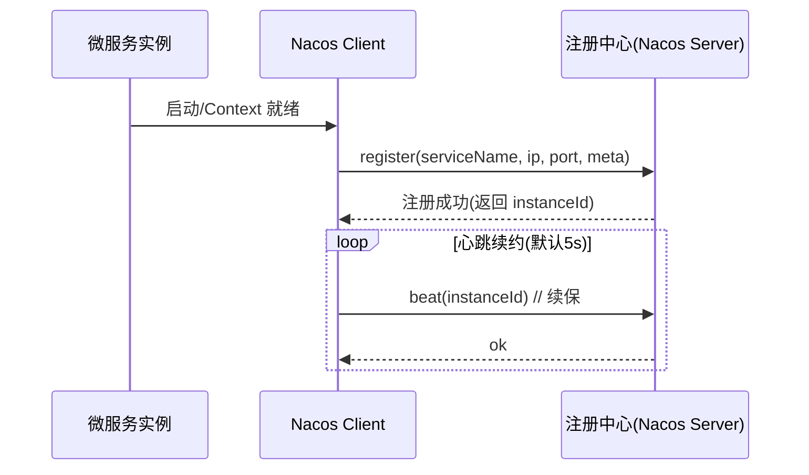
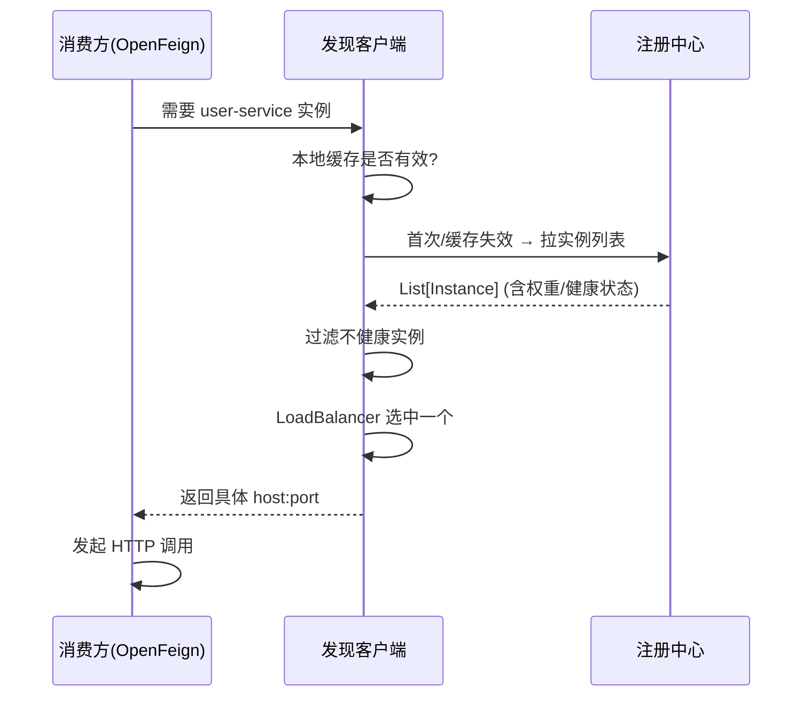
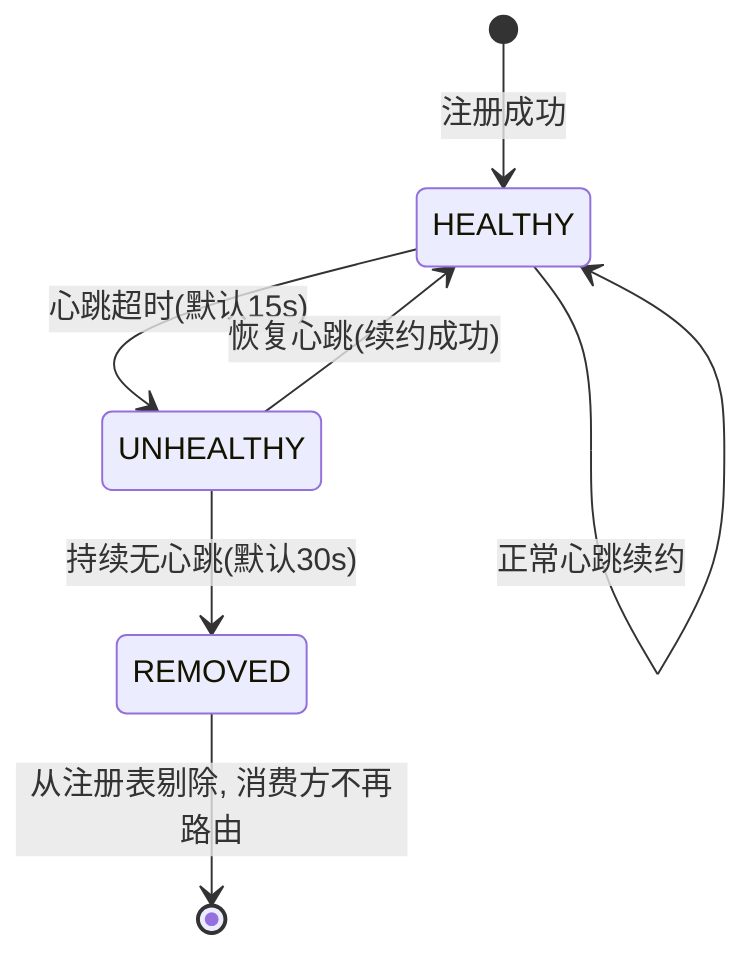
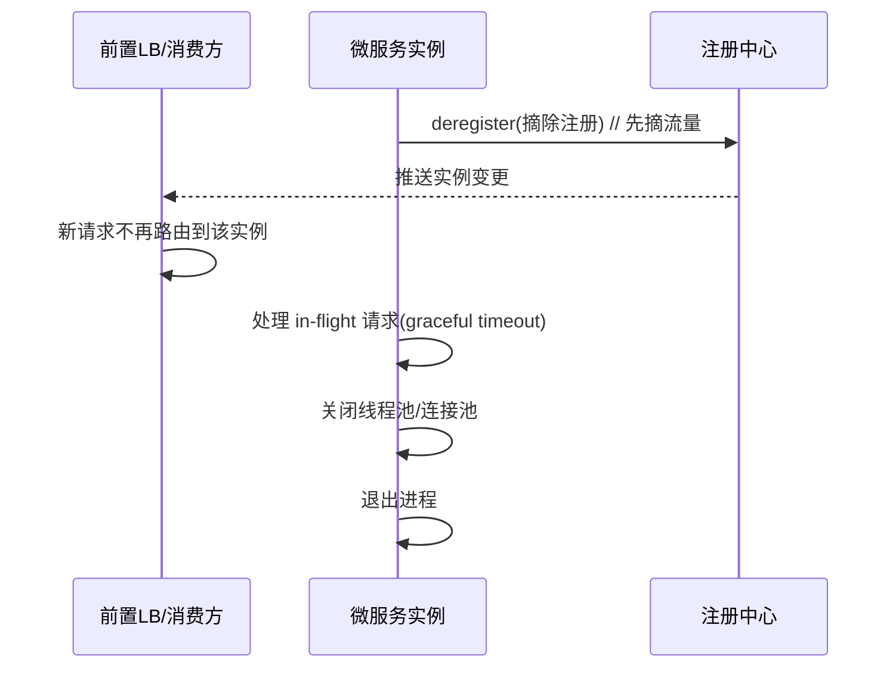

# 服务注册与发现·组合落地

> **组合层视角**：本文讲"微服务里怎么把注册中心用起来"——服务注册/发现/下线/健康检查/集群的落地流程与配置，而非注册中心的底层实现（CAP/哈希/一致性 → 回链 **08-服务注册与发现详解**（见知识库））。
> 组件实现：Nacos 作为注册中心（注册表/心跳）→ [03-服务注册与发现详解](../中间件/配置中心/Nacos/03-服务注册与发现详解.md)（中间件域）。
> 适用版本：Spring Boot 3.x / Spring Cloud Alibaba 2023.x。

## 📋 目录

1. 组合层定位：注册中心在微服务中的角色
2. 服务注册：实例信息怎么上报
3. 服务发现：调用方怎么找到目标
4. 健康检查与剔除（存活 / 探活 / 下线）
5. 优雅下线与发布期处理
6. 客户端接入（Spring Cloud 组合）
7. 常见问题与排查

---

## 1. 组合层定位

服务注册与发现解决微服务最基础的问题：**实例在哪、哪些还可用**。

- 服务实例是动态的（扩缩容 / 故障 / 发布），入口 IP:Port 不能写死。
- 各实例把自己的 `ip:port` 上报注册中心，消费方通过注册中心拿到可用实例列表，再配合负载均衡选一个。

```
服务提供方 ──注册(Register)/心跳续约──> Nacos(注册中心) <──拉取列表/订阅── 服务消费方
    │                                             │
    └── 健康检查 / 故障剔除 / 优雅下线──────────┘
```

**与底层拆分的边界**：
- **底层（回链）**：注册表数据结构、心跳机制、CAP 权衡、哈希一致性 → **08-服务注册与发现详解**（见知识库）
- **组合层（本文）**：注册时机、配置项、生命周期（注册→续约→发现→下线）、与 Spring Cloud/LoadBalancer 的衔接

---

## 2. 服务注册

服务启动后，注册中心客户端把**实例元数据**上报：

| 元数据 | 说明 | 示例 |
|---|---|---|
| 服务名 | 标识一个逻辑服务 | `user-service` |
| 实例 id | 实例唯一标识 | `ip:port` 或 uuid |
| ip + port | 入口地址 | `192.168.1.10:8080` |
| 集群 / 分组 | 分组隔离 | 默认 `DEFAULT_GROUP` / `DEFAULT` 集群 |
| 权重 | 负载均衡权重 | 默认 1 |
| 元数据 Map | 自定义扩展 | 版本、环境、灰度标签 |

**Nacos 客户端组合配置**：

```yaml
spring:
  application:
    name: user-service            # 服务名（注册名）
  cloud:
    nacos:
      discovery:
        server-addr: 127.0.0.1:8848   # 注册中心地址（可多地址逗号分隔）
        namespace: public             # 命名空间, 环境隔离
        group: DEFAULT_GROUP          # 分组, 同环境下多套隔离
        register-enabled: true        # 是否注册（消费-only 服务可 false）
        ip: ""                        # 定制上报 ip（如容器内网→映射公网）
        port: -1                      # 定制上报端口（0 则不覆盖）
        cluster-name: DEFAULT         # 集群名（就近路由）
```

> **要点**：`namespace` 用于环境隔离（dev/test/prod 独立注册表，互不发现）；`group` 用于同环境多套业务隔离；`cluster-name` 用于同服务多集群就近路由（如跨机房）。

**注册时机**：Spring Cloud Alibaba 通过注册中心自动注册，服务已就绪才上报；启动即注册、启动期间异常会自动续注册。

**注册时序**（实例自身的注册生命周期）：



**注册伪代码**（注册中心客户端生命周期）：

```java
// 组合层理解: 客户端注册的核心步骤(伪代码)
public void startRegister() {
    // 1. 收集本机实例元数据
    Instance meta = Instance.builder()
        .serviceName(appName)
        .ip(bindIp)
        .port(bindPort)
        .metadata(extraTagMap).build();
    // 2. 向注册中心注册(可重试)
    retry(3) { nacos.register(meta); }
    // 3. 启动心跳线程, 周期续约
    scheduledThread.scheduleAtFixedRate(() -> beat(), 0, 5, SECONDS);
}
```

---

## 3. 服务发现

消费方从注册中心获取目标服务实例列表。**两种模式**：

| 模式 | 说明 | 适用 |
|---|---|---|
| **拉取（主动查询）** | 每次调用从注册中心取列表，或客户端缓存 + 定时刷新 | 简单、容错可控 |
| **订阅 / 推送** | 实例变更时注册中心主动通知，客户端维护本地缓存 | 变更即时、减少轮询（Nacos 支持 UDP/TCP push） |

**消费方组合配置**（OpenFeign + LoadBalancer 见 [02-远程调用组合](02-远程调用组合·Feign与负载均衡.md)）：

```yaml
spring:
  cloud:
    nacos:
      discovery:
        server-addr: 127.0.0.1:8848   # 消费方也要配注册中心地址
    loadbalancer:
      nacos:
        enabled: true                 # 开启 Nacos 权重/扩展负载均衡
```

调用时用服务名而非地址：
```java
// OpenFeign 声明式, 服务名即 uri
@FeignClient(name = "user-service")
public interface UserClient { ... }
```
`lb://user-service` 会被切面解析为：注册中心查列表 → LoadBalancer 选实例 → 替换 host:port。

**发现链路**：

```
代码: lb://user-service / @FeignClient(name="user-service")
  → 服务发现(从 Nacos 取实例列表, 带缓存)
  → LoadBalancer(加权/轮询/一致性哈希选一个)
  → 替换为目标 http://192.168.1.10:8080
  → 发起 HTTP 请求
```

**发现时序**（消费方拿到并维护可用实例）：



---

## 4. 健康检查与剔除

注册中心需判断实例是否存活，剔除故障实例，避免消费方打到坏节点。

| 机制 | 说明 |
|---|---|
| **心跳续约** | 实例周期性上报心跳（Nacos 默认 5s `beat`）；超时(默认 15s)未续约标记不健康，再超时(默认 30s)剔除 |
| **主动探活（可选）** | 注册中心可对实例发起健康检查（Nacos 支持 HTTP 探活） |
| **临时实例** | 默认临时实例，心跳停止自动剔除；持久实例则在注册表长期保留 |

**实例状态流转（健康 → 不健康 → 剔除）**：



**Nacos 健康策略配置**：

```yaml
spring:
  cloud:
    nacos:
      discovery:
        heart-beat-interval: 5000       # 心跳间隔 ms
        heart-beat-timeout: 15000       # 心跳超时标记不健康 ms
        ip-delete-timeout: 30000        # 不健康到摘除超时 ms
        ephemeral: true                 # false=持久实例（需探活）
```

> **要点**：临时实例（`ephemeral=true`）靠心跳，适合微服务；持久实例靠探活，适合有状态 / 不可随意摘除的节点。生产常见：实例自身配合 Boot 健康端点，注册中心探活接 `/actuator/health`。

---

## 5. 优雅下线与发布期处理

**问题**：直接 kill -9 会让调用方仍打到已停实例，报 `Connection refused`。

**组合层优雅下线流程**：

```
① 摘流量：实例不再接收新请求（从调用方感知层面摘除/标记）
② 处理在途：Spring Boot graceful 停机(timeout) 处理完 in-flight
③ 注销：通知注册中心摘除实例
④ 关闭资源：连接池/线程池清理后退出
```

**优雅下线时序**：



**Nacos 注销**：客户端销毁时自动 `Deregister`；主动下线可用 OpenAPI：
```bash
curl -X DELETE "http://127.0.0.1:8848/nacos/v1/ns/instance?serviceName=user-service&ip=192.168.1.10&port=8080&ephemeral=true"
```
**配合 Boot 优雅停机**：
```yaml
server:
  shutdown: graceful
spring:
  lifecycle:
    timeout-per-shutdown-phase: 30s
```

> **要点**：优雅下线优先级高于重启快。K8s 场景配合 `preStop` + 就绪探针，先摘流量再停，避免新旧实例交替空窗。

---

## 6. 客户端接入（Spring Cloud 组合全流程）

**依赖**（Alibaba 组合）：
```xml
<dependency>com.alibaba.cloud:spring-cloud-starter-alibaba-nacos-discovery</dependency>
```
**提供方**与**消费方**共用同一注册中心配置即可。完整最小可跑（提供方）：

```yaml
spring:
  application:
    name: user-service
  cloud:
    nacos:
      discovery:
        server-addr: 127.0.0.1:8848
server:
  port: 8080
```

**验证**：
```bash
# 1) 注册成功查询实例列表
curl "http://127.0.0.1:8848/nacos/v1/ns/instance/list?serviceName=user-service"
# 2) 消费方健康
curl http://localhost:8080/actuator/health
```

---

## 7. 常见问题与排查

| 现象 | 可能原因 | 排查 |
|---|---|---|
| 调用超时 / 全部失败 | 实例未注册 / 已剔除 | 查注册表实例列表 & 心跳日志 |
| 拿到 IP 但连不通 | 上报 ip 与内网不一致 | 检查 `ip`/网络映射(容器) |
| 环境串扰 | namespace/group 未隔离 | 确认两边 namespace/group 一致 |
| 同实例被多集群看到 | cluster-name 未设 | 用 cluster 就近路由 |
| 重复实例 / 僵尸 | 非临时实例未探活 | 检查 `ephemeral` + 探活配置 |

> 参考连接点：注册表与心跳源码 → [03-服务注册与发现详解](../中间件/配置中心/Nacos/03-服务注册与发现详解.md)；CAP/一致性权衡 → **08-服务注册与发现详解**（见知识库）；负载均衡选实例算法 → [06-负载均衡详解](../../分布式/核心原理/06-负载均衡详解.md)。

---

## 参考

- 组合层总览：[00-微服务总览](00-微服务总览.md)
- 注册中心实现细节：[03-服务注册与发现详解](../中间件/配置中心/Nacos/03-服务注册与发现详解.md)、[02-Nacos服务端](../中间件/配置中心/Nacos/02-Nacos服务端·架构与权限安全详解.md)
- 分布式原理：**08-服务注册与发现详解**（见知识库）、[02-CAP与BASE理论](../../分布式/核心原理/02-CAP与BASE理论详解.md)
- 负载均衡：[06-负载均衡详解](../../分布式/核心原理/06-负载均衡详解.md)、[02-远程调用组合](02-远程调用组合·Feign与负载均衡.md)
