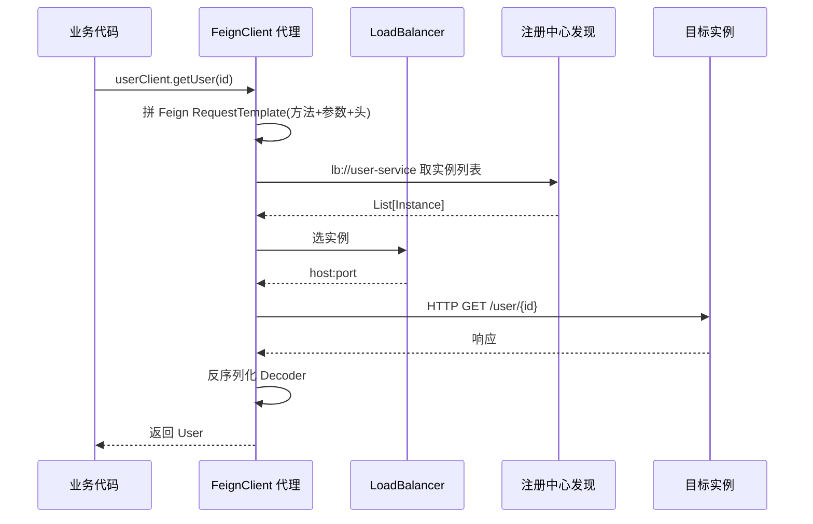
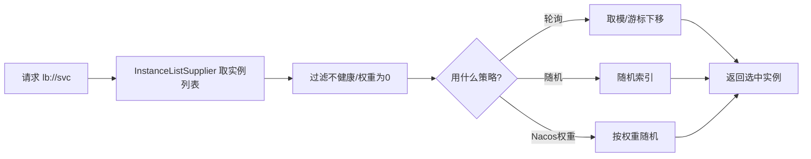

# 远程调用组合·Feign 与负载均衡

> **组合层视角**：本文讲"微服务里怎么用 Feign 声明式调用 + LoadBalancer 负载均衡 + 超时熔断组合落地"，是可照抄的组合方案。
> **组件实现不重写，回链**：OpenFeign 源码/原理 → [06-OpenFeign详解](../框架/服务通信/06-OpenFeign详解.md)；负载均衡算法原理 → [06-负载均衡详解](../../分布式/核心原理/06-负载均衡详解.md)；RPC 选型对比 → [00-RPC与远程调用总览](../框架/服务通信/00-RPC与远程调用总览.md)。
> 适用版本：Spring Boot 3.x / OpenFeign 4.x / Spring Cloud LoadBalancer。

## 📋 目录

1. 组合定位：服务间调用怎么选
2. 引入依赖与基本用法
3. 负载均衡：LoadBalancer 方案（含 Nacos 权重）
4. 超时 / 重试 / 拦截器组合
5. 与熔断降级衔接（Feign + Sentinel）
6. 常见问题与排查

---

## 1. 组合定位

服务间调用（消费方 → 提供方）的工程选型，本域常见三种：

| 方案 | 场景 | 关联 |
|---|---|---|
| **OpenFeign**（声明式 HTTP）| Spring Boot 生态内、REST 风格 | 本文 |
| Dubbo | 高性能 / 泛化调用 / 服务治理集成 | [04-Dubbo](../框架/服务通信/04-Apache Dubbo详解.md) |
| gRPC | 强类型 / 流式 / 跨语言 | [05-gRPC](../框架/服务通信/05-gRPC详解.md) |

> 组合层要点：Feign 负责"声明接口 → 拼 HTTP 请求"，LoadBalancer 负责"选哪个实例"，注册中心提供"有哪些实例"。三者串成调用链路。

---

## 2. 引入依赖与基本用法

**依赖**：
```xml
<dependency>org.springframework.cloud:spring-cloud-starter-openfeign</dependency>
<dependency>org.springframework.cloud:spring-cloud-starter-loadbalancer</dependency>
<!-- 配合 Nacos 注册与权重需再加 nacos-discovery -->
```

**开启**：
```java
@SpringBootApplication
@EnableFeignClients        // 扫描 @FeignClient
public class OrderApplication { ... }
```

**声明接口**：
```java
@FeignClient(name = "user-service")      // name=服务名(注册中心), 触发负载均衡
public interface UserClient {
    @GetMapping("/user/{id}")            // 提供方路径
    User getUser(@PathVariable Long id);
}
```

**调用**：
```java
@Service
public class OrderService {
    private final UserClient userClient;
    public Order assemble(Long userId) {
        User user = userClient.getUser(userId);   // 直接像本地调用
        ...
    }
}
```

**调用真实链路**：
```
@FeignClient("user-service").getUser(id)
  → 注册中心查询实例列表(lb://user-service)
  → LoadBalancer 选一个实例
  → OpenFeign 组 HTTP 请求 → 发出 → 反序列化
```

**Feign 调用时序**（组合层理解一次远程调用的内部流转）：



**Feign 代理原理（伪代码）**：

```java
// 组合层理解: Feign 把接口方法映射为 HTTP 请求(伪代码)
@FeignClient(name="user-service") interface UserClient {
    @GetMapping("/user/{id}")
    User getUser(@PathVariable Long id);
}
// 运行时 ↓ 动态代理生成实现:
// 1. MethodHandler: 把 getUser(id) 拼成 RequestTemplate
//    GET /user/1  + 请求头 + 参数占位替换
// 2. 目标地址解析: lb://user-service → consul/发现 → 具体 host
// 3. 执行: Client(HTTP客户端) → 发送 → Response
// 4. Decoder: 根据返回值类型把响应体转成 User
```

---

## 3. 负载均衡：LoadBalancer 方案

Spring Cloud 新一代默认 LoadBalancer（替代已停更的 Ribbon）。默认**轮询**。

**切换策略**：
```java
@Configuration
public class LoadBalancerConfig {
    @Bean
    public ReactorLoadBalancer<ServiceInstance> rlb(
            ServiceInstanceListSupplier supplier,
            LoadBalancerClientFactory factory) {
        String name = factory.getName();
        return new RoundRobinLoadBalancer(supplier, name);          // 轮询
        // return new RandomLoadBalancer(supplier, name);           // 随机
        // 权重/一致性哈希见 Nacos 扩展或自实现
    }
}
```

**LoadBalancer 选取实例（组合层理解）**：



**Nacos 权重选取（伪代码）**：

```java
// 组合层理解: Nacos 扩展按权重随机选中实例(关键逻辑)
Instance select(List<Instance> list) {
    double total = list.stream().mapToDouble(Instance::getWeight).sum();
    double offset = random() * total;    // 随机落点
    for (Instance in : list) {
        offset -= in.getWeight();
        if (offset <= 0) return in;      // 落到该实例区间
    }
    return list.get(list.size() - 1);
}
```

**Nacos 注册中心权重参与负载均衡**（让实例权重影响选择）：
```yaml
spring:
  cloud:
    loadbalancer:
      nacos:
        enabled: true         # 用 Nacos 的扩展(权重等)
```
实例权重在 Nacos 控制台 / OpenAPI 设置（同服务不同实例可配不同权重做灰度）。

> **要点**：LoadBalancer 只是"选择器"，实例列表来自注册中心发现；没有注册中心时也可用静态列表（`spring.cloud.discovery.client.simple.instances.*`）。

---

## 4. 超时 / 重试 / 拦截器组合

### 4.1 超时（Feign 客户端级别）

```yaml
spring:
  cloud:
    openfeign:
      client:
        config:
          default:                       # 对所有 FeignClient 生效
            connectTimeout: 5000         # 连接超时 ms
            readTimeout: 10000           # 读超时 ms
          user-service:                  # 指定服务覆盖
            readTimeout: 5000
```

### 4.2 日志（编码方式开关）

```yaml
spring:
  cloud:
    openfeign:
      client:
        config:
          default:
            logger-level: FULL           # NONE/BASIC/HEADERS/FULL
```
配合 `logging.level.你的包: DEBUG`。

### 4.3 拦截器（统一加头 / 透传 trace/userId）

```java
public class TokenRelayInterceptor implements RequestInterceptor {
    @Override
    public void apply(RequestTemplate template) {
        template.header("Authorization", "<动态从上下文取 JWT>");
        template.header("X-Request-Id", TraceContext.nextId());   // 透传 traceId
    }
}
```
注册为 Bean（或用 FeignConfigurer 按 FeignClient 绑定）。

### 4.4 重试

官方 `spring.cloud.openfeign.client.config.*` 没有直接重试次数键，常配合 **Spring Retry**：
```yaml
spring:
  cloud:
    loadbalancer:
      retry:
        enabled: true                    # 重试感知 LoadBalancer
```
以及引入 `spring-retry` 依赖后在 Feign 配置里启用重试策略（需 `Retryer` Bean 或 resilience4j retry 组合，见实操族）。

> **注意**：重试只对**幂等**操作安全（查询类）；写操作重试可能重复提交，需下游幂等（[05-分布式ID与幂等](../../分布式/核心原理/05-分布式ID与幂等设计详解.md)）。

---

## 5. 与熔断降级衔接（组合层）

Feign 自身不做熔断，需接 CircuitBreaker（可接 resilient4j 或 Sentinel）。这里以 Sentinel 网关/间调用兜底为例（详见 [01-Sentinel](治理/01-Sentinel流量控制详解.md)）：

```xml
<dependency>com.alibaba.cloud:spring-cloud-starter-alibaba-sentinel</dependency>
```
```java
@FeignClient(name = "user-service",
             fallback = UserClientFallback.class)   // 降级类
public interface UserClient { ... }

@Component
public class UserClientFallback implements UserClient {
    public User getUser(Long id) { return null; }   // 降级行为
}
```
开启 Feign 熔断：
```yaml
spring:
  cloud:
    openfeign:
      circuitbreaker:
        enabled: true
```

> **组合层次**：Feign 负责调用、LoadBalancer 负责选实例、Sentinel/熔断负责"调用失败怎么办"。三者关注点不同，可独立配置组合。

---

## 6. 常见问题与排查

| 现象 | 可能原因 | 处理 |
|---|---|---|
| 注入 FeignClient 报错 | 没 `@EnableFeignClients` 或路径不在扫描范围 | 加注解 / 显式 `basePackages` |
| `lb://` 解析失败 | 没配注册中心 / LoadBalancer 缺依赖 | 保 discovery + loadbalancer 依赖 |
| 接口路径 404 | @FeignClient 路径与提供方不匹配 | 核对 method + path |
| 超时频繁 | 提供方慢 / 读超时太小 | 调大 readTimeout / 查下游 |
| 调用到已下线实例 | 本地缓存未刷新 | 查注册中心续约 & 优雅下线 |
| 不走负载均衡 | 没走 `lb://` 或服务名直连 host | 用服务名触发 LoadBalancer |

> 参考连接点：Feign 源码与原理 → [06-OpenFeign详解](../框架/服务通信/06-OpenFeign详解.md)；RPC 全谱选型 → [00-RPC与远程调用总览](../框架/服务通信/00-RPC与远程调用总览.md)；下游幂等 → [05-分布式ID与幂等](../../分布式/核心原理/05-分布式ID与幂等设计详解.md)。

---

## 参考

- 组合层总览：[00-微服务总览](00-微服务总览.md)、[01-服务注册与发现](01-服务注册与发现组合.md)
- Feign 实现：[06-OpenFeign详解](../框架/服务通信/06-OpenFeign详解.md)
- 负载均衡原理：[06-负载均衡详解](../../分布式/核心原理/06-负载均衡详解.md)
- 熔断降级：[01-Sentinel流量控制详解](治理/01-Sentinel流量控制详解.md)、[02-熔断限流降级选型](治理/02-熔断限流降级·原理与组件选型.md)
- 幂等：[05-分布式ID与幂等设计详解](../../分布式/核心原理/05-分布式ID与幂等设计详解.md)
