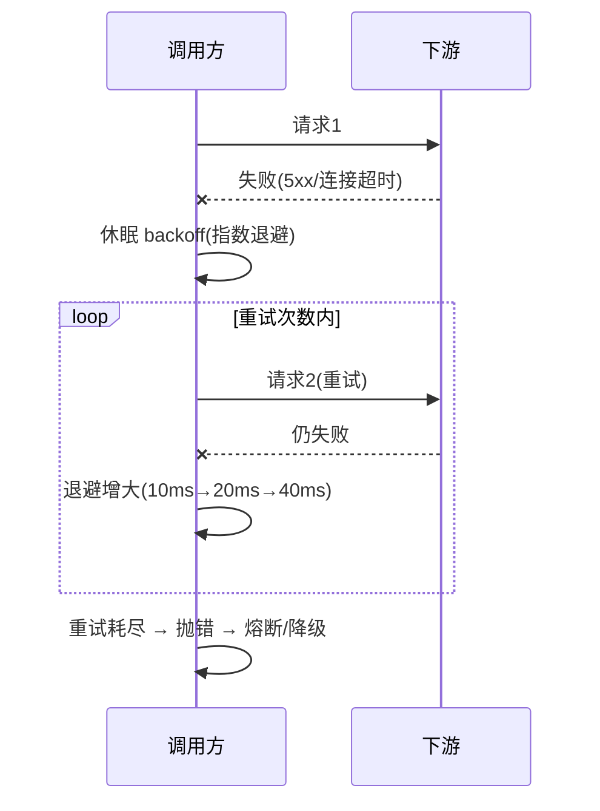

# 服务调用治理组合规范

> **组合层视角**：把"调用一个服务"这件事的**工程规范**统一起来——超时、重试、幂等、优雅停机、灰度、降级，怎么配、怎么取舍、关注哪些坑。**具体组件原理不重写，回链底座域**。
> 关联：网关治理 [01-Gateway](网关/01-Spring Cloud Gateway详解.md)（网关侧）、[01-Sentinel](治理/01-Sentinel流量控制详解.md)、[05-幂等](../../分布式/核心原理/05-分布式ID与幂等设计详解.md)。

## 📋 目录

1. 治理关注点总览
2. 超时设置规范
3. 重试规范（幂等前提）
4. 幂等设计
5. 优雅停机 / 发布灰度
6. 降级与熔断的工程组合
7. 治理检查清单

---

## 1. 治理关注点总览

一次跨服务调用要考虑的六个方面与归属：

| 关注点 | 目标 | 配置位置 | 关联 |
|---|---|---|---|
| **超时** | 不无限等下游 | Feign/连接池/HTTP | 见 §2 |
| **重试** | 容忍瞬时故障 | Retry/LoadBalancer | 见 §3 |
| **幂等** | 重复不产生副作用 | 调用方幂等键 + 下游校验 | 见 §4 |
| **优雅停机** | 发布/下线不中断 | Boot graceful + 注册注销 | 见 §5 |
| **降级/熔断** | 下游故障不拖垮 | Sentinel/Resilience4j | 见 §6 |
| **灰度** | 分批上新 | 注册权重/流控 | 见 §5 |

> 一句话：**超时保护自己不等，重试容忍瞬间错，幂等保证重复无害，降级保证故障不死，优雅保证替换无感。**

---

## 2. 超时设置规范

**超时层级**（调用链路中可选择设置超时的位置）：


- **连接超时**：建立连接到下游的时间（网络不可达/端口错时最快暴露）。
- **读超时**：发出请求到拿到响应的等待时间（响应慢时的限制）。

- **原则**：读超时 > 下游实际处理时延 + 余量；写超时不宜过长。
- 层级：连接超时（`connectTimeout`，默认较短）+ 读超时（`readTimeout`，按业务）。
- 建议：网络抖动重试的前提下连接超时 1~3s、读超时 5~10s 起步，依据压测/监控调。

```yaml
spring:
  cloud:
    openfeign:
      client:
        config:
          default:
            connectTimeout: 3000
            readTimeout: 10000
```

> 常见坑：超时设太小→正常慢接口被拦；太大→故障时拖垮线程。先给业务留余量，再按 P99 微调。

---

## 3. 重试规范

- **只对幂等操作启用重试**（查询 / 接口自带幂等键）。
- 重试要与熔断/限流结合，避免重试风暴放大下游压力。
- 重试一般向前重试对**瞬时故障**（连接超时、5xx 中的可重试类），不重试业务 4xx。

```yaml
# LoadBalancer 重试感知(需 spring-retry 依赖)
spring:
  cloud:
    loadbalancer:
      retry:
        enabled: true
# Feign 重试次数通过 Retryer / 自定义实现控制(见实操族或回链 Feign 篇)
```

> 风险：无界重试在"下游慢"时倍增请求数 → **重试次数固定 + 配合熔断快速失败**。

**重试时序**（首次失败→延时退避→重试）：



---

## 4. 幂等设计

**定义**：同一请求执行多次，结果与执行一次相同。

| 手段 | 说明 |
|---|---|
| 幂等键 | 调用方生成唯一 `Idempotency-Key`，下游按 key 判重（防重复写入）|
| 唯一约束 | 数据库唯一索引 / 请求流水号校验 |
| 幂等方法 | 查询天然幂等；写操作用"先查后写"或状态机 |

```java
// 调用方: 每次写请求带幂等键
header("Idempotency-Key", UUID.randomUUID().toString());
// 下游: 校验 key 是否已处理过, 已处理直接返回原结果
```

**幂等校验完整伪代码**（下游判重防重复写入）：

```java
// 下游接收写请求(伪代码)
public Result handle(CreateOrderReq req, String idemKey) {
    // 1. 按幂等键查是否已处理过(带唯一约束, 防并发双写)
    Existing e = idemRepo.findByKey(idemKey);
    if (e != null) return Result.of(e.getOriginalResult());   // 已处理→直接返回原响应
    // 2. 尝试按幂等键落库(唯一索引兜底并发)
    if (!idemRepo.tryInsertKey(idemKey)) return lockConflict();
    // 3. 执行业务 + 记录结果快照
    Result r = doBiz(req);
    idemRepo.saveResult(idemKey, r);
    return r;
}
```

**幂等关键点**：
- 幂等键必须**唯一且一次一 key**，同 key 重放返回首次结果。
- 并发下用**唯一索引 + 异常捕获**防双写，而不只靠「先查再写」。
- 崩溃恢复：处理中若宕机，靠幂等键 + 结果快照实现「处理到一半可重放不重复」。

> 深入: [05-分布式ID与幂等设计详解](../../分布式/核心原理/05-分布式ID与幂等设计详解.md)。

---

## 5. 优雅停机 / 发布灰度

**优雅停机三步**（防止请求打到正在停止的实例）：
```
① 摘流量: 从注册中心把实例标记下线/注销, 不再接收新请求
② 处理在途: graceful 停机等待 in-flight 完成
③ 关资源: 清理连接池/线程池后退出
```
Boot 配置：
```yaml
server:
  shutdown: graceful
spring:
  lifecycle:
    timeout-per-shutdown-phase: 30s
```
配合注册中心下线（发布脚本先 `DELETE` 实例再停）——见 [01-服务注册与发现](01-服务注册与发现组合.md) §5。

**灰度发布**组合：
- **注册权重**：Nacos 给新实例区低权重，让少量流量先验证。
- **网关/服务路由**：Gateway 或网关层按 header/权重分流（见 [01-Gateway](网关/01-Spring Cloud Gateway详解.md) 的 Weight/Header 断言）。
- **流控**：对新版本限流放量（详见 [01-Sentinel](治理/01-Sentinel流量控制详解.md)）。

---

## 6. 降级与熔断的工程组合

| 机制 | 作用 | 触发位置 |
|---|---|---|
| **限流** | 保护自己/下游不过载 | 网关/服务入口 |
| **熔断** | 下游持续故障→快速失败 | 服务间调用 |
| **降级** | 失败时返回兜底值/备选方案 | Feign fallback/Sentinel 降级 |

**组合建议**：
- 网关做入口限流 + 统一鉴权；服务内做方法级限流兜底。
- 服务间调用（Feign）接熔断 + 降级 fallback。
- 熔断触发后不要再无脑重试，待恢复窗口再放流量。

> 组件细节回链：[01-Sentinel流量控制详解](治理/01-Sentinel流量控制详解.md)、[02-熔断限流降级·原理与组件选型](治理/02-熔断限流降级·原理与组件选型.md)。

---

## 7. 治理检查清单（新服务上线前）

- [ ] 依赖超时是否显式配置（连接/读分开）
- [ ] 非幂等写操作是否带了幂等键 / 下游判重
- [ ] 重试是否只对幂等且固定次数
- [ ] 优雅停机开启、发布脚本先摘注册中心
- [ ] 服务间调用接了熔断 + 降级 fallback
- [ ] 灰度依赖（权重/路由/流控）就绪
- [ ] 有 P99 监控与告警（超时/429/熔断事件）

---

## 参考

- 组合层总览：[00-微服务总览](00-微服务总览.md)
- 服务发现/下线：[01-服务注册与发现](01-服务注册与发现组合.md)
- 网关治理：[01-Spring Cloud Gateway详解](网关/01-Spring Cloud Gateway详解.md)
- 幂等：[05-分布式ID与幂等设计详解](../../分布式/核心原理/05-分布式ID与幂等设计详解.md)
- 熔断限流：[01-Sentinel流量控制详解](治理/01-Sentinel流量控制详解.md)、[02-熔断限流降级·原理与组件选型](治理/02-熔断限流降级·原理与组件选型.md)
