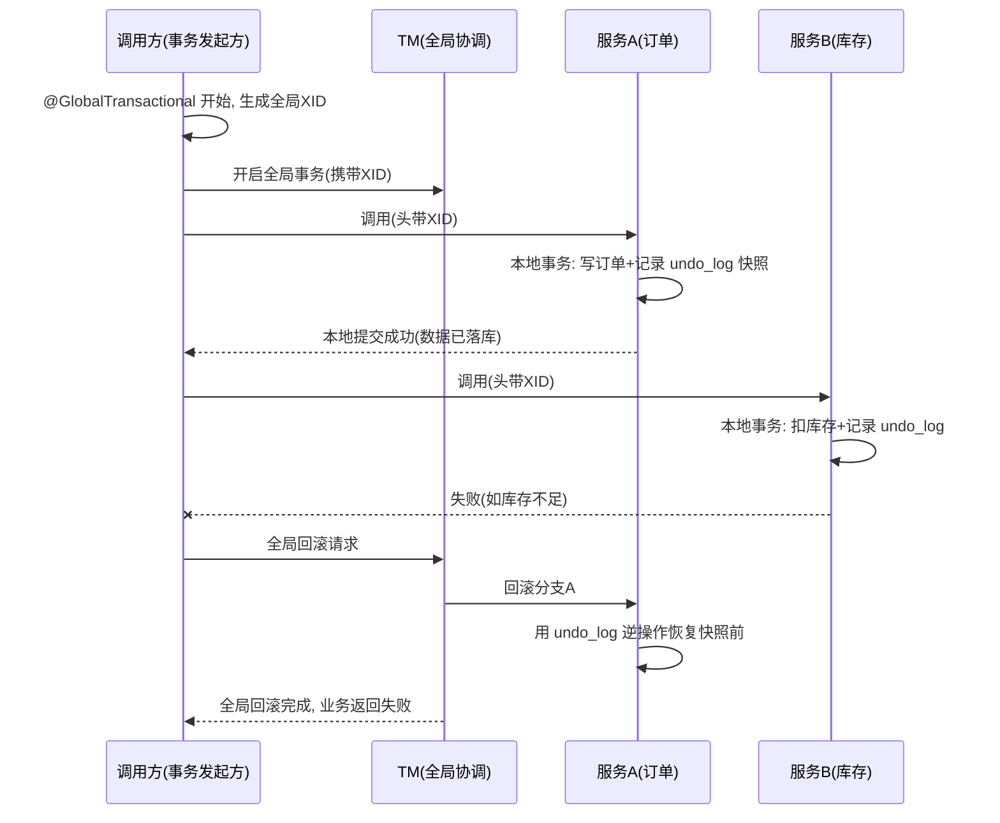

# 分布式事务组合落地

> **组合层视角**：本文讲"微服务里分布式事务怎么选型、Seata 怎么落地"，是可操作的组合指南。
> **实现不重写，回链**：分布式事务基础/两阶段原理 → [04-分布式事务详解](../../分布式/核心原理/04-分布式事务详解.md)；Seata 架构/AT 源码 → [Seata分布式事务框架详解](../中间件/分布式协调/分布式事务/Seata分布式事务框架详解.md)。
> 适用：Spring Boot 3.x / Seata 1.6+(Seata-Spring-Boot-Starter)。

## 📋 目录

1. 组合定位：什么时候需要 / 什么时候不需要
2. 方案选型：XA / AT / TCC / SAGA / 本地消息表
3. Seata 组合落地（AT 模式）
4. 各模式组合对比
5. 常见问题与规避

---

## 1. 组合定位

**先问要不要分布式事务**：
- 跨服务强一致（扣库存 + 下单同成功失败）→ 需要。
- 弱最终一致可接受（通知、异步更新）→ 优先消息 + 补偿，不必引入全局事务重负担。

> 分布式事务是**最后手段**：能拆成单库事务就单库；能异步最终一致就别做强同步。真正跨库强一致才上框架。

---

## 2. 方案选型

| 模式 | 一致性 | 侵入 | 适用 | 关联 |
|---|---|---|---|---|
| **XA**（两阶段）| 强一致 | 中 | 跨库、对一致硬要求 | [04-分布式事务详解](../../分布式/核心原理/04-分布式事务详解.md) |
| **AT**（Seata 默认）| 强（近似）| 低（加注解）| 业务简单、落地快 | 本文 §3 |
| **TCC**（Try-Confirm-Cancel）| 强（业务可补偿）| 高（写三方法）| 对事务时机/隔离要求高 | [04-分布式事务详解](../../分布式/核心原理/04-分布式事务详解.md) |
| **SAGA** | 最终一致 | 中 | 长流程、异步 | 同上 |
| 本地消息表 / 消息事务 | 最终一致 | 中 | 可异步解耦 | [04-分布式事务详解](../../分布式/核心原理/04-分布式事务详解.md) |

> 组合建议：**默认 AT 快速落地**；对性能/隔离要求高或跨语言用 **TCC/SAGA**；强一致硬性要求用 **XA**。

---

## 3. Seata 组合落地（AT 模式）

**依赖**：
```xml
<dependency>com.alibaba.cloud:spring-cloud-starter-alibaba-seata</dependency>
<!-- 或 Seata 官方: io.seata:seata-spring-boot-starter -->
```
**配置**（`application.yml`）：
```yaml
seata:
  enabled: true
  application-id: order-service
  tx-service-group: my_tx_group          # 事务分组(与服务端映射)
  registry:
    type: nacos
    nacos:
      server-addr: 127.0.0.1:8848        # Seata 服务端注册到 Nacos
  config:
    type: nacos
    nacos:
      server-addr: 127.0.0.1:8848
```

**开启分布式事务**：
```java
@Service
public class OrderService {
    @GlobalTransactional               // 开启分支/全局事务
    public void createOrder(Order order) {
        // 1. 本地库写订单(本地事务)
        orderMapper.insert(order);
        // 2. 远程扣库存(远程服务也接 Seata, 参与同分支)
        stockClient.deduct(order.getSkuId(), order.getCount());
        // 任一失败 → 全局回滚(AT 自动补偿已提交的本地变更)
    }
}
```

**AT 工作流程（组合层）**：

```
开始全局事务 @GlobalTransactional
  → 注册全局 XID
  → 各分支本地事务执行(记录 undo_log)
  → 全部成功 → 全局提交
  → 某分支失败 → 全局回滚 → 用 undo_log 反向补偿已本地提交的分支
```

**AT 两阶段时序图**（组合层理解核心机制）：



**XID 传播**：跨服务调用要把全局 XID 通过**请求头/隐式上下文透传**给下游，下游才能加入同一全局事务；Feign/调用框架（Seata 客户端）自动完成该传播，业务无需手动处理（除自定义 RPC 通道需自行提升）。

> **要点**：AT 是"**记录再回滚**"——执行阶段各服务本地提交并记录 `undo_log` 快照，失败时框架逆操作恢复，业务只加一个 `@GlobalTransactional` 注解，侵入最小。原理细节回链 Seata 篇。

---

## 4. 各模式组合对比

| 维度 | XA | AT | TCC | SAGA |
|---|---|---|---|---|
| 一致性 | 强 | 强(近乎) | 强 | 最终 |
| 实现成本 | 中 | 低 | 高 | 中 |
| 业务侵入 | 数据库级 | 注解级 | 手写3方法 | 状态/补偿 |
| 擅场 | 跨库强一致 | 快速落地 | 高隔离/时机 | 长流程异步 |
| 隔离性 | 好 | 中(需避免脏写) | 可控(预留资源) | 弱 |

> 选型口诀：**能不上就不上 → 默认 AT → 要强隔离/跨语言上 TCC → 长流程异步上 SAGA → 硬强一致上 XA**。完整对比回链 [04-分布式事务详解](../../分布式/核心原理/04-分布式事务详解.md)。

---

## 5. 常见问题与规避

| 问题 | 规避 |
|---|---|
| **超时**（全局事务拖长）| 限制全局事务内业务耗时，避免跨很多服务串行长事务 |
| **AT 脏读/脏写** | 避免在未提交分支上再改同一行（用全局锁/幂等）；提高隔离需 TCC |
| **回滚失效（补偿不了）| 确认下游接入同事务分组、undo_log 表存在 |
| **Seata 服务端依赖** | 需要 Seata Server 集群(注册 Nacos)，正式环境别单点 |
| **影响性能（日志多）| AT 记录 undo_log 有额外开销；高并发敏感场景评估 TCC/异步 |

> 深入：[Seata分布式事务框架详解](../中间件/分布式协调/分布式事务/Seata分布式事务框架详解.md)、[04-分布式事务详解](../../分布式/核心原理/04-分布式事务详解.md)。

---

## 参考

- 组合层总览：[00-微服务总览](00-微服务总览.md)
- Seata 实现：[Seata分布式事务框架详解](../中间件/分布式协调/分布式事务/Seata分布式事务框架详解.md)
- 事务原理：[04-分布式事务详解](../../分布式/核心原理/04-分布式事务详解.md)
- 幂等/补偿：[05-分布式ID与幂等设计详解](../../分布式/核心原理/05-分布式ID与幂等设计详解.md)
