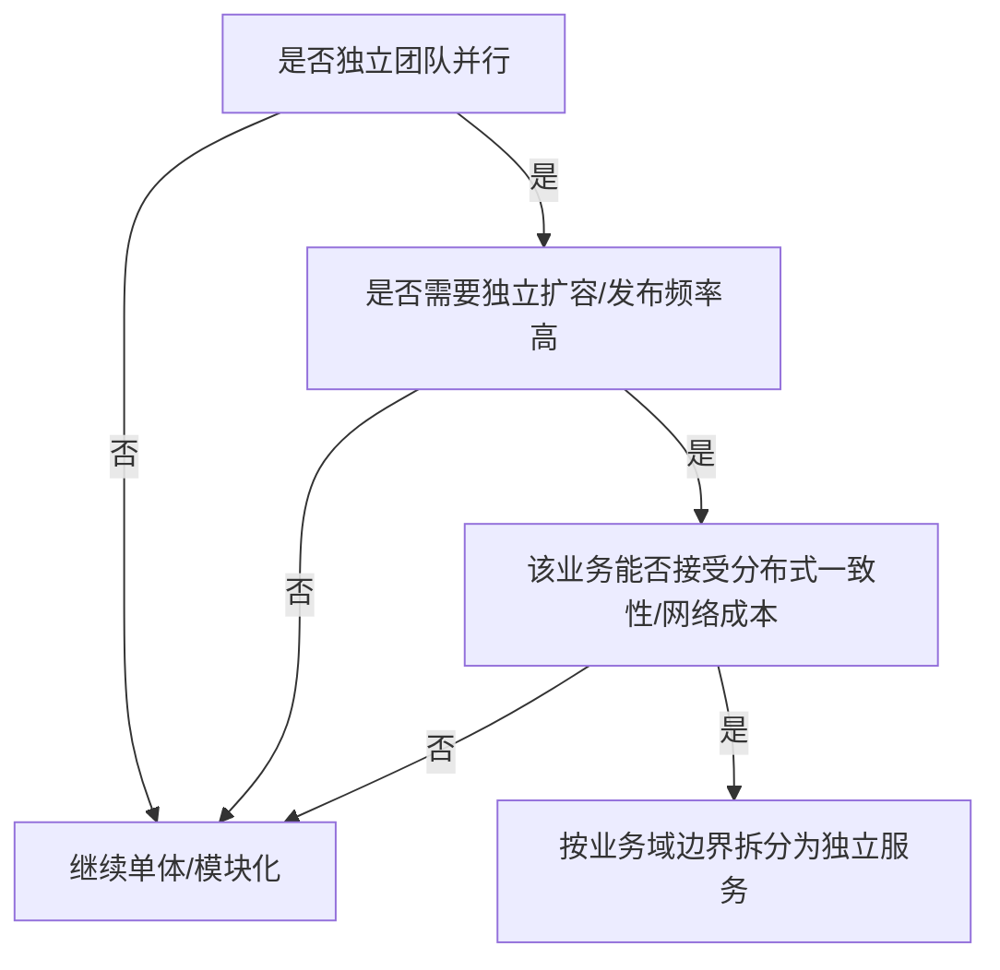

# 微服务拆分方法论与架构设计

> **组合层视角**：设计层面的方法论——何时拆、怎么拆、边界怎么定、目录怎么组织，是微服务实践的"图纸层"。
> 本域定位见 [00-微服务总览](00-微服务总览.md)：微服务=组件组合层，本文解决"组合之前怎么设计"。

## 📋 目录

1. 拆 or 不拆：成本收益判断
2. 拆分维度与边界界定（DDD/业务域）
3. 服务间依赖与调用原则
4. 目录与命名规范
5. 架构演进（单体→微服务→治理完善）
6. 设计检查清单

---

## 1. 拆 or 不拆：成本收益判断

**不是项目都要拆**。拆分的收益（独立扩展/独立部署/团队独立）与成本（分布式复杂度/一致性/运维）需要权衡：

| 因素 | 倾向拆 | 倾向单体 |
|---|---|---|
| 团队数量 | 多团队并行 | 小团队 |
| 部署更新频率 | 各自独立发 | 统一发版 |
| 性能/扩展需求 | 高并发/独立扩 | 适中 |
| 事务一致性 | 可最终一致 | 强一致高频 |
| 复杂度 | 高 | 低 |

> 原则：**能单体尽量单体**；拆分由**独立需求触发**（独立扩容/团队/发布），不因"流行"拆。复杂单体先内部模块化，再按需拆服务。

**拆分决策流程**（判断当前是否该拆）：



---

## 2. 拆分维度与边界界定

**主维度：业务域（按领域/业务把内聚的拆一起）**，辅助维度：团队、性能隔离、技术栈变化。

| 维度 | 说明 | 示例 |
|---|---|---|
| **业务能力**（主）| 同类业务内聚成一服务 | user / order / payment |
| **团队归属** | 一个服务一个团队负责 | 支付团队→payment |
| **数据边界** | 各服务独享数据，不共享表 | 订单表只在 order |
| **技术栈/性能** | 特殊性能或技术独立 | 报表/搜索独立服务 |

**边界界定（DDD 思路）**：
```
限界上下文(Bounded Context) → 每个上下文一个(组)服务
  - 高内聚: 一个上下文内聚合根、实体、领域逻辑内聚
  - 低耦合: 上下文之间通过接口/事件通信, 不共享内部表
```
- **不跨服务共享数据库**：各自库表，通过 API / 消息协作。
- **不共享实现类**：通过接口契约（OpenAPI / Feign 接口）协作。
- **事件驱动**：跨上下文解耦用领域事件 / 消息（用户下单→通知仓储）。

> 深入：领域驱动设计边界划分可参考 [00-微服务总览](00-微服务总览.md) 的学习路线与各组件回链。

---

## 3. 服务间依赖与调用原则

- **依赖朝向**：尽量避免循环依赖（A→B→A）；必要用事件/异步打破。
- **同步/异步选择**：强实时用 Feign 同步；可次用消息异步（顺序、最终一致）。
- **依赖深度**：避免过深的调用链（A→B→C→D），每层超时叠加易超时。
- **降级隔离**：关键路径服务挂掉要有降级（缓存兜底 / 本地兜底）。

```
原则: 高扇出(一人调很多)/深链路要警惕 → 中间件解耦(消息/网关聚合)
```

> 相关：调用治理规范 → [03-服务调用治理组合](03-服务调用治理组合.md)；消息可靠 → [00-中间件总览](../中间件/00-中间件总览.md)（MQ）；网关聚合 → [01-Spring Cloud Gateway详解](网关/01-Spring Cloud Gateway详解.md)。

---

## 4. 目录与命名规范

**推荐目录**（本库微服务域即此组织）：
```
微服务/
├── 00-微服务总览.md
├── 组合篇(注册/远程调用/治理/事务/拆分) ← 组合层
├── 网关/    ← 网关组合
└── 治理/    ← 熔断限流降级
```

**命名规范**：
- 服务名：`业务名`（`user-service` 等），统一 suffix `-service`。
- 域名/包：`com.公司.业务`，边界清晰。
- API 版本：`/api/v1/xxx` 显式版本化，避免下游被破坏。

> 本库规范的命名与写作细节遵循 `note-writing-standards`（skill）约定。

---

## 5. 架构演进（单体→微服务→治理完善）

```
单体(模块化) → 按需拆服务(注册/网关) → 调用治理(超时/熔断/幂等) → 容错/弹性(限流/灰度/优雅停机)
                                        ↓ 增量演进
                                   基础设施完善(监控/链路/配置中心)
```

| 阶段 | 重点组件（本域） | 关联 |
|---|---|---|
| 起步 | 注册中心 + 网关 | [01-服务注册与发现组合](01-服务注册与发现组合.md)、[01-Spring Cloud Gateway详解](网关/01-Spring Cloud Gateway详解.md) |
| 调用 | 远程调用 + 治理 | [02-远程调用组合·Feign与负载均衡](02-远程调用组合·Feign与负载均衡.md)、[03-服务调用治理组合](03-服务调用治理组合.md) |
| 一致 | 分布式事务 | [04-分布式事务组合](04-分布式事务组合.md) |
| 弹性 | 熔断限流/灰度/优雅 | [01-Sentinel流量控制详解](治理/01-Sentinel流量控制详解.md)、[02-熔断限流降级·原理与组件选型](治理/02-熔断限流降级·原理与组件选型.md) |

**演进流程**（单体逐步演进为治理完善的微服务）：


---

## 6. 设计检查清单

- [ ] 拆分是否有独立需求驱动（团队/扩展/发布），非为拆而拆
- [ ] 是否按业务域边界拆，避免共享数据库 / 循环依赖
- [ ] 同步/异步/事件选择是否合理
- [ ] 调用链深度与超时叠加是否评估
- [ ] 是否有降级/兜底设计
- [ ] 目录与命名是否统一
- [ ] 是否规划了架构演进路径与治理完善

---

## 参考

- 组合层总览：[00-微服务总览](00-微服务总览.md)
- 调用与治理：[01-服务注册与发现组合](01-服务注册与发现组合.md)、[02-远程调用组合](02-远程调用组合·Feign与负载均衡.md)、[03-服务调用治理组合](03-服务调用治理组合.md)
- 分布式事务：[04-分布式事务组合](04-分布式事务组合.md)

> 注：本域定位为"组合层"，具体的 DDD/架构模式、消息中间件、监控可回链对应底座域总览。
