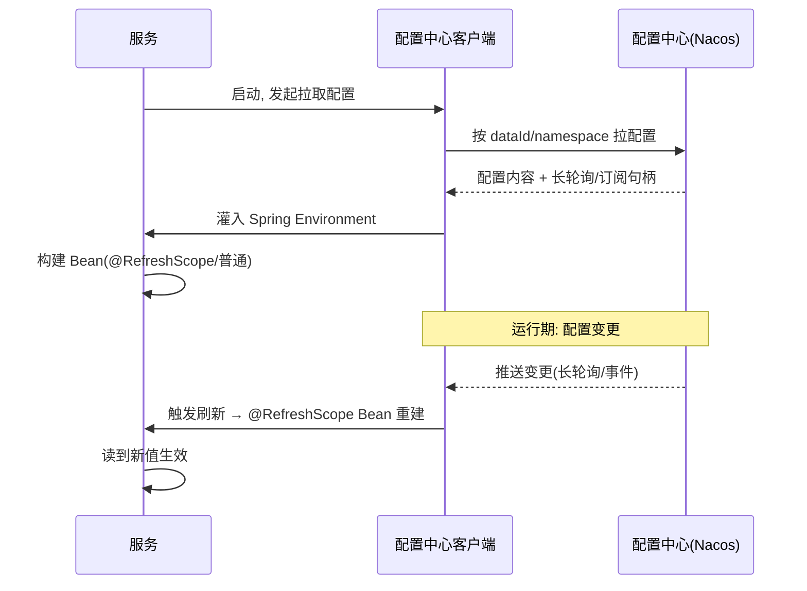

# 配置中心组合规范

> **组合层视角**：微服务里的配置怎么管、怎么分环境、怎么动态刷新、怎么多服务复用——讲"怎么用配置中心搭配置治理"，**不回造实现**。
> 实现回链（中间件域）：Nacos → [01-Nacos配置](../中间件/配置中心/Nacos/01-Nacos配置·动态热加载详解.md)；Apollo → [01-Apollo](../中间件/配置中心/Apollo/01-Apollo配置中心详解.md)。
> 适用：Spring Boot 3.x / Nacos Config / Apollo。

## 📋 目录

1. 组合定位：为什么配置要中心化
2. 配置治理三要素：环境 / 分组 / 刷新
3. Nacos 组合接入
4. Apollo 组合接入
5. 动态刷新机制（为什么 @RefreshScope）
6. 敏感配置与安全
7. 组合检查清单

---

## 1. 组合定位

- **问题**：配置散落在各服务 yaml、改一遍要改很多、环境不一致、改动需重启。
- **解决**：配置集中到配置中心，按环境/分组管理，支持**动态刷新**不重启。

```
各微服务 ──启动加载──> 配置中心(Nacos/Apollo)
    │                         │
    └──运行中变更──> 动态推送/拉取刷新 ──> 服务无需重启
```

> 边界：配置中心的**存储/推送实现**在中间件域（Nacos/Apollo 篇），组合层只讲微服务怎么接、怎么管。

---

## 2. 配置治理三要素

| 要素 | 说明 | 示例 |
|---|---|---|
| **namespace / 环境** | 按 dev/test/prod 隔离 | Nacos namespace |
| **分组 group** | 同环境下多套业务隔离 | DEFAULT_GROUP / 业务组 |
| **刷新生效** | 配置变更实时生效 | `@RefreshScope` / 配置监听 |

**配置分层原则**（避免一把梭）：
```
基础配置(连接串/公共) → 部署配置(端口/实例) → 业务配置(开关/阈值)
```
- **连接类**（DB/Redis/MQ 地址、账号）→ 环境隔离，不写死代码。
- **开关/阈值类**（限流值、灰度开关、超时）→ 放配置中心，便于动态调。

> 一句话：**环境隔离 + 分组管辖 + 动态可调**，是配置治理的三角。

---

## 3. Nacos 组合接入

**依赖**：
```xml
<dependency>com.alibaba.cloud:spring-cloud-starter-alibaba-nacos-config</dependency>
```
**配置（Nacos 作为配置源）** — 指定 dataId/group/命名空间：
```yaml
spring:
  application:
    name: order-service                  # 用于定位 dataId: order-service.yml
  profiles:
    active: dev                          # 环境, 组合出 order-service-dev.yml
  cloud:
    nacos:
      config:
        server-addr: 127.0.0.1:8848
        namespace: public
        group: DEFAULT_GROUP
        file-extension: yml              # 配置文件类型
        refresh-enabled: true            # 开启变更监听刷新
```

> **dataId 规则**：默认 `${spring.application.name}-${spring.profiles.active}.${file-extension}`，如 `order-service-dev.yml`。也支持 `${spring.application.name}.${file-extension}`（无环境）与共享配置 `shared-configs` / `extension-configs` 复用公共段。

**运行时取值**：
```java
@RefreshScope                             // 标记配置类, 变更自动重建 Bean
@Component
@ConfigurationProperties(prefix = "app")
public class AppConfig {
    private String featureFlag;            // 配置中心里的 app.feature-flag, 变更即刷新
}
```

**配置加载与刷新时序**：



---

## 4. Apollo 组合接入

Apollo 强调**可视化配置管理与灰度（Release 发布前后）**，适合大型多环境管理。

**依赖**：
```xml
<dependency>com.ctrip.framework.apollo:apollo-client</dependency>
```
**配置**：
```properties
app.id=order-service
apollo.meta=http://127.0.0.1:8080
```
**启用配置类自动刷新（配置变更→数据仓库更新）**：
```java
@EnableApolloConfig
@ConfigurationProperties
public class OrderProperties { ... }
```

> Apollo vs Nacos 选型（组合层提点）：
> | 维度 | Nacos Config | Apollo |
> |---|---|---|
> | 能力侧重 | 注册+配置一体（阿里生态）| 纯配置、发布灰度、权限强 |
> | 动态刷新 | @RefreshScope 手动/自动 | 更成熟的发布/灰度/回滚 |
> | 生态 | Spring Cloud Alibaba | 单独部署为中心 |
> 组合上：**Nacos 生态/小微用 Nacos；强发布管理/多部门用 Apollo**。详情回链 [01-Apollo](../中间件/配置中心/Apollo/01-Apollo配置中心详解.md)。

---

## 5. 动态刷新机制（为什么 @RefreshScope）

- **原理**：配置中心变更 → 客户端收到变更 → 重新加载 `Environment` → **`@RefreshScope` 标记的 Bean 被销毁重建**，从而读到新值。
- **没标 `@RefreshScope` 的 Bean 不会刷新**——这是最常见"改了没生效"的原因。
- 静态常量 / 方法内每次读 `Environment` 才实时生效；简单类要刷新就用 `@RefreshScope` 或注入后读取。

```java
@Service
@RefreshScope                       // 变更后重新 new 本 Bean
public class FeatureService {
    @Value("${app.feature-flag}")
    private boolean flag;
}
```

**@RefreshScope 刷新原理（伪代码）**：

```java
// 组合层理解: @RefreshScope = 可变作用域 Bean(伪代码)
// 1. 首次访问 → 新建 Bean 并放入 scope 缓存
scopeCache.put(name, newBean());
// 2. 配置变更事件 → 清除 scope 缓存中的 Bean
clearScopeCache();
// 3. 下次访问 → 重新 new(读最新 Environment 值)
Object bean = createBean(Environment.latest());
```

> 这就是为什么**标 @RefreshScope 才刷新**：它让 Bean 随配置变更重建；没标的是固定单例，不回读新值。

> 深入：微服务动态刷新接入与原理 → [01-Nacos配置·动态热加载详解](../中间件/配置中心/Nacos/01-Nacos配置·动态热加载详解.md)。

---

## 6. 敏感配置与安全

- **密钥不进代码/不进 git**：放配置中心并开启加密（或搭配密钥管理）。
- **分权**：配置中心做读写权限（Apollo 支持部门/环境权限）。
- **审计**：关键配置变更日志可回溯。
- **兜底**：连接串等必备配置不要只依赖配置中心，本地保留最低可用配置，避免配置中心故障时服务无法启动。

> 注意：不要把数据库口令、私钥明文放进 yaml 提交 git；Nacos/Apollo 主题安全细节回链中间件域对应篇。

---

## 7. 组合检查清单

- [ ] 环境/namespace 是否隔离（dev/test/prod 不串）
- [ ] 公共配置是否复用（shared/共享配置, 避免每服务重复）
- [ ] 需要动态生效的开关是否 `@RefreshScope`
- [ ] 敏感信息是否不在代码, 配中心加密
- [ ] 是否有配置中心故障时的兜底启动配置
- [ ] dataId / group 命名是否清晰一致

---

## 参考

- 组合层总览：[00-微服务总览](00-微服务总览.md)
- Nacos 实现：[01-Nacos配置·动态热加载详解](../中间件/配置中心/Nacos/01-Nacos配置·动态热加载详解.md)、[02-Nacos服务端](../中间件/配置中心/Nacos/02-Nacos服务端·架构与权限安全详解.md)
- Apollo 实现：[01-Apollo配置中心详解](../中间件/配置中心/Apollo/01-Apollo配置中心详解.md)
- 服务注册/发现（同 Nacos 生态）：[01-服务注册与发现组合](01-服务注册与发现组合.md)
