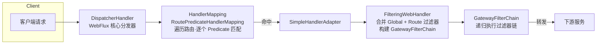

# Spring Cloud Gateway 详解

> 微服务**统一流量入口**（WebFlux + Netty 响应式网关，Spring 官方第二代网关方案）。本文是网关知识域的**主篇 / 骨架**，讲清网关定位与三大核心、请求流水线、编程式路由、速查与面试，并把深度专项拆到各独立篇：
> - 前置：微服务架构([00-微服务总览](../00-微服务总览.md))、响应式([14-Spring WebFlux响应式编程实践](../../框架/springboot/14-Spring WebFlux响应式编程实践.md))、Spring Security([00-安全框架选型总览·Spring Security & Apache Shiro](../../框架/安全/00-安全框架选型总览·Spring Security & Apache Shiro.md))、Nacos([00-中间件总览](../../中间件/00-中间件总览.md))。

---

## 📋 本域文档导航

| 文档 | 定位 |
|---|---|
| **本篇 详解** | 定位、三大核心、请求流水线、编程式路由、速查、面试 |
| [04-内置过滤器详解](04-内置过滤器详解.md) | 内置断言、内置过滤器工厂、三种过滤器对比、跨域/重试/熔断 |
| [05-内置GlobalFilter深度](05-内置GlobalFilter深度.md) | 内置 GlobalFilter 清单/顺序/执行时序/自定义 |
| [06-Actuator运维实操](06-Actuator运维实操.md) | Actuator 运行时观察与调试、动态增删路由 |
| [07-动态路由与高可用](07-动态路由与高可用.md) | WebSocket、动态路由(Nacos)、配置实战、生产实践 |
| [08-网关鉴权详解](08-网关鉴权详解.md) | 网关统一鉴权(JWT/TokenRelay) |
| [02-Spring Cloud Gateway实践](02-Spring Cloud Gateway实践.md) | 完整工程骨架与联调 |
| **03-限流降级与分层防御**（见知识库） | 限流/降级/熔断与 Sentinel |

> 阅读路径：先读本篇 §1-§3 建体系 → 深入过滤器(04/05) → 运维观察(06) → 动态路由与生产(07) → 鉴权(08) → 实践(02)/限流(03)。

---


## 1. 网关定位与选型

**定义**：微服务架构中的统一流量入口，承担路由转发、统一鉴权、限流、跨域、日志、重试等横切逻辑，使下游服务专注业务实现。

**引入原因**：
- 客户端若直连多个微服务，会造成端口暴露、鉴权分散、无法统一管控。
- 统一入口可一次配置实现认证 / 限流 / 路由 / 日志，全局生效。
- **Zuul 1.x 已停更**（Servlet 阻塞模型）；Spring Cloud Gateway 基于 **WebFlux + Netty + Reactor**，非阻塞、高吞吐，为官方推荐方案。

```
客户端 → Spring Cloud Gateway（Netty / WebFlux）
              ├─ 路由匹配（Predicate）
              ├─ 过滤器链（GlobalFilter + GatewayFilter）
              ├─ 限流（RequestRateLimiter + Redis）
              ├─ 统一鉴权（Spring Security Reactive / JWT / TokenRelay）
              └→ 转发至 lb://service-micro
```

> **要点**：Gateway 是 WebFlux（响应式）应用，**不依赖 MVC / Servlet** 容器；集成 Spring Security 时须使用 **Reactive** 配置（`@EnableWebFluxSecurity`），而非 MVC 的 `WebSecurityConfigurerAdapter`。

---


## 2. 三大核心概念

```
Route = id + uri（目标） + Predicate 集合（匹配条件） + Filter 集合（处理逻辑）
路由匹配：请求满足全部 Predicate → 路由命中 → 按过滤器链处理 → 转发至 uri
```

| 概念 | 英文 | 作用 |
|---|---|---|
| **路由** | Route | 一条转发规则：id + 目标 uri + 断言 + 过滤器 |
| **断言** | Predicate | 匹配条件（路径 / Header / Query / 时间 / Cookie 等），满足才走该路由 |
| **过滤器** | Filter | 请求 / 响应处理（改头 / 重写路径 / 限流 / 鉴权等） |

**最小配置示例**：

```yaml
spring:
  cloud:
    gateway:
      routes:
        - id: order-service          # 路由 id，唯一
          uri: lb://order-service    # 目标：服务发现前缀 lb:// + 服务名，或完整 http 地址
          predicates:                # 断言（匹配条件），多个为逻辑 and
            - Path=/api/order/**
            - Method=GET,POST
          filters:                   # 过滤器（处理逻辑）
            - StripPrefix=2          # 去前 2 段前缀：/api/order/xxx → /xxx
            - AddRequestHeader=X-Request-ID, abc-123
```

> **路由优先级**：按路由在列表中定义顺序匹配，**先命中先执行**；`order` 字段可显式指定，数值越小优先。应避免多条路由路径前缀重叠造成的误匹配。

### 2.1 Route 与后端服务的关系（Route ≠ 服务集合）

**Route 是"规则"，服务集群是"目标"，两层概念分开**：

- **Route = 一条转发规则**：断言 + 目标 URI + 过滤器，回答"什么样的请求、转到哪里、路上做什么处理"。类比 Nginx 的 `location` 块。
- **服务集合 = `lb://order-service` 中服务名对应的多实例集群**（注册中心里的实例列表）。路由本身不持有实例，实例列表由 `ReactiveLoadBalancerClientFilter` 运行时从注册中心拉取（见 [05-内置GlobalFilter深度](05-内置GlobalFilter深度.md)）。

配置 N 条 Route，网关即可代理 N 个后端服务的请求——这是网关最核心的用法。但有三点补充：

| 认知点 | 说明 |
|---|---|
| Route 数量 ≠ 服务数量 | 同一服务可配多条 route（如 `Path` 与 `Host` 两条断言各自指向 `lb://order-service`，携带不同 filter 策略） |
| Route 可不指向任何服务 | `uri: forward:/xxx` 转发到网关本地接口；`uri: https://...` 直接指向外部地址，均无后端服务 |
| Route 有序匹配 | 请求按 order 遍历路由表，**第一个断言全通过的路由生效**，后续路由不再参与 |


> **要点**：网关靠 N 条规则把不同请求分发到 N 个目标（多为服务集群）；终端路由过滤器（Netty / Forward / Websocket / LB）只是根据规则里 URI 的 scheme 决定"用什么方式把请求送达目标"（见 [05-内置GlobalFilter深度](05-内置GlobalFilter深度.md)、[04-内置过滤器详解](04-内置过滤器详解.md)）。

---


## 3. 请求处理流水线（底层原理）

Gateway 建在 WebFlux 之上，一次请求经历的完整链路：



各环节职责：

| 组件 | 类 | 职责 |
|---|---|---|
| 分发器 | `DispatcherHandler`（WebFlux 核心） | 接收请求，按序尝试各 `HandlerMapping` 定位处理器 |
| 路由映射 | `RoutePredicateHandlerMapping` | 继承 `AbstractHandlerMapping`；遍历路由列表，用谓词逐一匹配，**首个命中即返回对应处理器** |
| 处理器适配 | `SimpleHandlerAdapter` | 调用 `FilteringWebHandler#handle` 适配处理器 |
| 过滤器链 | `FilteringWebHandler` | 从 `exchange` 取当前 Route，合并全部 `globalFilters` 与 route 的 `gatewayFilters`，构建 `GatewayFilterChain` 递归执行 |

```java
// FilteringWebHandler#handle 核心逻辑（示意）
public Mono<Void> handle(ServerWebExchange exchange) {
    Route route = exchange.getRequiredAttribute(GATEWAY_ROUTE_ATTR);
    List<GatewayFilter> combined = new ArrayList<>(this.globalFilters);   // 全局过滤器
    combined.addAll(route.getFilters());                                   // 路由级过滤器
    return new DefaultGatewayFilterChain(combined)                         // 构建链, 递归执行
               .filter(exchange).switchIfEmpty(handleEx(exchange));
}
```

> **同名区分**：`org.springframework.cloud.gateway.handler.FilteringWebHandler` 与 `org.springframework.web.server.handler.FilteringWebHandler` 同名同接口（`WebHandler`）但功能不同，前者属于 Gateway 过滤器链，后者是 Spring Web 服务端过滤器，易混淆。
>
> **匹配机制**：`RoutePredicateHandlerMapping` 基于 `Flux.filter().next()` 响应式流，按序对路由应用断言，**命中即停**——因此**精确路径路由应放在通配路由之前**，否则宽泛路由会抢先拦截请求。

### 3.1 自动配置类：整套链路是如何装配起来的

Spring Cloud Gateway 是 Spring Boot **自动配置**驱动的——引入 `spring-cloud-starter-gateway` 后，作用 `GatewayAutoConfiguration`（`org.springframework.cloud.gateway.config`）在启动时装配上面流水线的所有组件。核心要点：

```java
@Configuration(proxyBeanMethods = false)
@ConditionalOnProperty(name = "spring.cloud.gateway.enabled", matchIfMissing = true) // 默认开启
@EnableConfigurationProperties  // 绑定 GatewayProperties
@AutoConfigureBefore({HttpHandlerAutoConfiguration.class, WebFluxAutoConfiguration.class})
@ConditionalOnClass({DispatcherHandler.class, GatewayAutoConfiguration.class})
public class GatewayAutoConfiguration { ... }
```

**GatewayAutoConfiguration 装配的核心 Bean**（按依赖顺序）：

| 阶段 | 装配的 Bean | 说明 |
|---|---|---|
| ① 配置绑定 | `GatewayProperties` | 把 `spring.cloud.gateway.*` 配置解析为路由/断言/过滤器定义 |
| ② 全局过滤器 | `List<GlobalFilter>` | 收集容器内所有 `GlobalFilter` Bean（含内置与自定义） |
| ③ 处理器 | `FilteringWebHandler` | 依赖 `List<GlobalFilter>` 构造，在构造时把 GlobalFilter **适配**成 GatewayFilter（见 [05-内置GlobalFilter深度](05-内置GlobalFilter深度.md)） |
| ④ 路由定义源 | `List<RouteDefinitionLocator>` → `CompositeRouteDefinitionLocator` | 多来源路由定义合并（yaml/注册中心/自定义） |
| ⑤ 路由定位器 | `RouteDefinitionRouteLocator`（`@Primary`） | 把 RouteDefinition 应用工厂组装成可匹配的 Route（见 §4.1） |
| ⑥ 路由映射 | `RoutePredicateHandlerMapping` | 遍历 Route 用断言匹配请求，首个命中返回 Route |
| ⑦ 管理端点 | `GatewayWebfluxEndpoint` | 提供 `/actuator/gateway/*`（见 [06-Actuator运维实操](06-Actuator运维实操.md)） |

> **要点**：自动配置 = 免写样板代码的「按约定装配」。`RoutePredicateHandlerMapping` 需要 `List<RouteLocator>`；`RouteDefinitionRouteLocator` 是 `@Primary` 的默认实现，把配置中心拉到的 `RouteDefinition` 转换成运行时可匹配的 `Route`。这套装配顺序正是请求时执行的逆序，理解它就能从「配置 → Bean → 请求命中」全链路串起来。

---

---


## 4. 编程式路由：RouteLocator DSL

除 YAML 外，可用 `RouteLocatorBuilder` 的 fluent API 在 Java 中声明路由，适用于动态 / 复杂路由或避免大段 yaml。

```java
@Configuration
public class RouteConfig {
    @Bean
    public RouteLocator customRouteLocator(RouteLocatorBuilder builder) {
        return builder.routes()
            .route("user_route", r -> r
                .path("/api/user/**")
                .filters(f -> f.stripPrefix(2).addRequestHeader("X-From", "gateway"))
                .uri("lb://user-service"))
            .route("ws_route", r -> r
                .path("/ws/**")
                .uri("lb:ws://chat-service"))
            .build();
    }
}
```

> DSL 与 yaml 等价，均产出 `RouteLocator`；多个 `RouteLocator` Bean 会被合并。适合：路由由代码逻辑生 / 参数化 / 需要动态调整的场景。

### 4.1 RouteLocator / RouteDefinition 原理

**两个概念的层次**：

- `RouteDefinition`：**配置层**的路由定义（id + uri + predicates 数组 + filters 数组），来自 yaml 或配置中心，尚未运行。
- `Route`：**运行时**的匹配路由（id + uri + `Predicate<ServerWebExchange>` + `List<GatewayFilter>`），能实际响应某个请求。

`RouteDefinitionRouteLocator`（`org.springframework.cloud.gateway.route`）负责把 `RouteDefinition` **组装**成 `Route`。核心职责：

| 步骤 | 对象/方法 | 作用 |
|---|---|---|
| 拿定义 | `RouteDefinitionLocator#getRouteDefinitions()` | 获取一串 `RouteDefinition` |
| 组谓词 | 每个 predicate 名 → `RoutePredicateFactory` `(config) → Predicate` | 把配置里的谓词字符串/参数变成可执行的断言 |
| 组过滤器 | 每个 filter 名 → `GatewayFilterFactory` `(config) → GatewayFilter` | 把配置里的过滤器变为 GatewayFilter（含 `OrderedGatewayFilter` 加 order） |
| 产路由 | `new Route(...)` | 组装成 `Route` |

```java
// RouteDefinitionRouteLocator 构造（示意）
public class RouteDefinitionRouteLocator implements RouteLocator {
    private final RouteDefinitionLocator routeDefinitionLocator;
    private final Map<String, RoutePredicateFactory> predicates;   // 名 → 断言工厂
    private final Map<String, GatewayFilterFactory> gatewayFilterFactories; // 名 → 过滤器工厂
    private final GatewayProperties gatewayProperties;
    // getRoutes(): 遍历 routeDefinitionLocator.getRouteDefinitions()
    //   对每个定义, 用 predicates/factories 把字符串转成真正的 Predicate/GatewayFilter
    //   最后 new Route(definition.getId(), uri, predicate, filters, order)
}
```

**多来源合并**：容器里可能有多个 `RouteDefinitionLocator` Bean（Properties 静态源、注册中心自动发现、自定义 Repository），`CompositeRouteDefinitionLocator` 把它们的结果**取并集合并**成一份 `Flux<RouteDefinition>` 提供给上层组装。

> **要点**：`RouteLocator` 是最终能匹配请求的路由提供者；`RouteDefinitionRouteLocator` 只是其中一种（把配置转route的默认实现），编程式 DSL 的 `RouteLocatorBuilder` 产出的是另一种 `RouteLocator` Bean。两者在启动时都被收集到 `List<RouteLocator>`，`RoutePredicateHandlerMapping` 逐个取路由做断言匹配。工厂 `name()` 默认 = 类名去 `RoutePredicateFactory`/`GatewayFilterFactory` 后缀（如 `AddRequestHeaderGatewayFilterFactory.name() = "AddRequestHeader"`），这正对应配置里 `- AddRequestHeader=...` 的短线写法与 `name:` 完整写法的映射关系。

---


## 5. 常用配置项速查表

| 配置路径 | 说明 | 默认值/示例 |
|---|---|---|
| `spring.cloud.gateway.routes[].id` | 路由 id | 唯一 |
| `...routes[].uri` | 目标地址 | `lb://svc` / `http://host` / `ws://host` |
| `...routes[].order` | 路由优先级 | 数值小优先 |
| `...routes[].predicates[]` | 断言 | `Path=/api/**` |
| `...routes[].filters[]` | 过滤器 | Shortcut 或 name+args |
| `spring.cloud.gateway.discovery.locator.enabled` | 自动发现路由 | `false` |
| `...discovery.locator.lower-case-service-id` | 服务名下划转小写 | `false` |
| `spring.cloud.gateway.globalcors.cors-configurations` | 全局 CORS | 路径 → 配置 |
| `spring.cloud.gateway.httpclient.connect-timeout` | 转发连接超时(ms) | `45` |
| `spring.cloud.gateway.httpclient.response-timeout` | 转发响应超时 | — |
| `spring.cloud.gateway.filter.request-rate-limiter.*` | 限流参数 | replenish/burst |
| `server.shutdown` | 优雅停机 | `immediate`/`graceful` |
| `management.endpoints.web.exposure.include` | Actuator 暴露 | `gateway`, `health` |
| `spring.cloud.gateway.routes[].predicates` 支持 Actuator | `actuator/gateway/routes` | 查看生效路由 |

> 生产可用 Actuator 端点观测：`/actuator/gateway/routes`（生效路由）、`/actuator/gateway/globalfilters`（全局过滤器顺序）。

---


## 6. 面试高频 Q&A

- **Spring Cloud Gateway 与 Zuul 的区别？** Gateway 基于 WebFlux/Netty 响应式非阻塞、性能高、官方推荐；Zuul 1 阻塞 Servlet 已过时。
- **三大核心？** Route（转发规则）、Predicate（匹配条件）、Filter（处理逻辑）；请求满足 Predicate 命中 Route，按 Filter 链转发。
- **GatewayFilter vs GlobalFilter？** 路由级 vs 全局；合并成链后按 `Ordered` 排序执行。
- **断言和过滤器的执行顺序？** 断言先执行匹配路由（`RoutePredicateHandlerMapping`），匹配成功后才组装并执行过滤器链；断言不匹配直接 404，不进过滤器链。
- **断言匹配失败，GlobalFilter 会执行吗？** 不会。没有 Route → 没有 chain → 404 在过滤器链之前返回。
- **default-filters 是 GlobalFilter 吗？** 不是，它仍然是路由过滤器（GatewayFilter），只是批量给所有路由套上；GlobalFilter 必须实现接口并注册为 Bean。
- **终端路由过滤器为什么是 GlobalFilter 而不是 GatewayFilter？** 划分依据是注册与绑定方式而非生效范围；全局注册保证永远在场、order 固定链尾，生效范围由 URI scheme 运行时自选择（全局注册、按需生效）。
- **过滤器顺序规则？** order 小优先；同级 DefaultFilter → GatewayFilter → GlobalFilter；未指定 order 的路由过滤器从 1 开始按定义序。
- **RequestRateLimiter 如何限流？** Redis 令牌桶 + KeyResolver 选定 用户/IP/接口 维度。
- **网关如何统一鉴权？** Reactive Security（`oauth2ResourceServer.jwt()`）或自定义 GlobalFilter 校验 JWT + 透传身份头；必要时 TokenRelay 透传原始 token。
- **网关与 Spring Security 的关系？** 网关（Reactive）做入口统一认证，服务内（MVC）做方法级授权，分层互补。
- **网关 vs Nginx？** Nginx 服务端入口 / LB（流量分发 / 静态 / SSL），Gateway 应用网关（业务路由 / 鉴权 / 限流）；可 Nginx + Gateway 双网关叠加。
- **网关如何保证高可用？** 无状态 + 多实例 + 前置 LB + 外部存储（Redis / Nacos） + 健康检查。
- **Gateway 为何是 WebFlux？** 底层 Netty + Reactor 响应式，独立于 MVC 容器，天然支持背压与高并发连接。
- **路径匹配注意？** 精确路径路由放在通配前，避免长前缀被宽泛前缀抢占；用 `order` 控制。
- **WebSocket 如何走网关？** `uri: ws://` 或 `lb:ws://`，由 WebsocketRoutingFilter 代理。

---


## 7. 参考

- [Spring Cloud Gateway 官方文档](https://docs.spring.io/spring-cloud-gateway/reference/)
- [Route Predicate Factories（官方）](https://docs.spring.io/spring-cloud-gateway/reference/spring-cloud-gateway-server-webflux/request-predicates-factories.html)
- [Fluent Java Routes API（官方）](https://docs.spring.io/spring-cloud-gateway/reference/spring-cloud-gateway/fluent-java-routes-api.html)
- [TokenRelay Filter（官方）](https://docs.spring.io/spring-cloud-gateway/reference/spring-cloud-gateway-server-webflux/gatewayfilter-factories/tokenrelay-factory.html)
- [GatewayFilter Factories（官方）](https://docs.spring.io/spring-cloud-gateway/reference/spring-cloud-gateway-server-webflux/gatewayfilter-factories/)
- [Spring Cloud Gateway 源码解析（芋道源码）](https://www.iocoder.cn/Spring-Cloud-Gateway/)
- 查证 2026-08
- 关联：[00-微服务总览](../00-微服务总览.md)、[01-Sentinel流量控制详解](../治理/01-Sentinel流量控制详解.md)（限流兜底）、[00-安全框架选型总览·Spring Security & Apache Shiro](../../框架/安全/00-安全框架选型总览·Spring Security & Apache Shiro.md)、[00-中间件总览](../../中间件/00-中间件总览.md)（Nacos）
