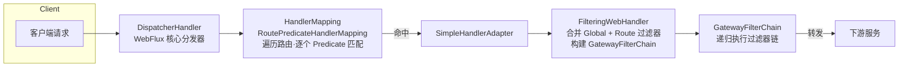

# Spring Cloud Gateway 详解

> 微服务**统一流量入口**（WebFlux + Netty 响应式网关，Spring 官方第二代网关方案）。本文从底层流水线原理出发，逐项拆解路由 / 断言 / 过滤器三大核心、内置断言与过滤器工厂、编程式路由、限流、跨域 / 重试 / 熔断、网关鉴权（Spring Security Reactive + JWT + TokenRelay）、WebSocket 路由、动态路由刷新等，并配套完整可照抄配置。
> 前置：微服务架构([00-微服务总览](../00-微服务总览.md))、响应式基础([14-Spring WebFlux响应式编程实践](../../框架/springboot/14-Spring WebFlux响应式编程实践.md))、Spring Security 基础([00-安全框架选型总览·Spring Security & Apache Shiro](../../框架/安全/00-安全框架选型总览·Spring Security & Apache Shiro.md))、Nacos 配置中心([00-中间件总览](../../中间件/00-中间件总览.md))。

## 📋 总纲

1. 网关定位与选型
2. 三大核心：路由 Route / 断言 Predicate / 过滤器 Filter
3. 请求处理流水线（底层原理）
4. 内置断言工厂逐个详解
5. 内置过滤器工厂逐个详解（含 Shortcut 配置写法）
6. 自定义过滤器：GlobalFilter / GatewayFilter / 顺序与短路
7. 编程式路由：RouteLocator DSL
8. 限流：RequestRateLimiter（Redis 令牌桶）
9. 跨域 / 重试 / 熔断
10. 网关统一鉴权：Spring Security Reactive + JWT + TokenRelay
11. WebSocket 路由
12. 动态路由与配置中心刷新（Nacos）
13. 配置实战：Nacos 服务发现 + 路由
14. 生产最佳实践
15. 常用配置项速查表
16. 面试高频 Q&A
17. 参考

---

## 1. 网关定位与选型

**定义**：微服务架构中的统一流量入口，承担路由转发、统一鉴权、限流、跨域、日志、重试等横切逻辑，使下游服务专注业务实现。

**引入原因**：
- 客户端若直连多个微服务，会造成端口暴露、鉴权分散、无法统一管控。
- 统一入口可一次配置实现认证 / 限流 / 路由 / 日志，全局生效。
- **Zuul 1.x 已停更**（Servlet 阻塞模型）；Spring Cloud Gateway 基于 **WebFlux + Netty + Reactor**，非阻塞、高吞吐，为官方推荐方案。

```
客户端 → Spring Cloud Gateway（Netty / WebFlux）
              ├─ 路由匹配（Predicate）
              ├─ 过滤器链（GlobalFilter + GatewayFilter）
              ├─ 限流（RequestRateLimiter + Redis）
              ├─ 统一鉴权（Spring Security Reactive / JWT / TokenRelay）
              └→ 转发至 lb://service-micro
```

> **要点**：Gateway 是 WebFlux（响应式）应用，**不依赖 MVC / Servlet** 容器；集成 Spring Security 时须使用 **Reactive** 配置（`@EnableWebFluxSecurity`），而非 MVC 的 `WebSecurityConfigurerAdapter`。

---

## 2. 三大核心概念

```
Route = id + uri（目标） + Predicate 集合（匹配条件） + Filter 集合（处理逻辑）
路由匹配：请求满足全部 Predicate → 路由命中 → 按过滤器链处理 → 转发至 uri
```

| 概念 | 英文 | 作用 |
|---|---|---|
| **路由** | Route | 一条转发规则：id + 目标 uri + 断言 + 过滤器 |
| **断言** | Predicate | 匹配条件（路径 / Header / Query / 时间 / Cookie 等），满足才走该路由 |
| **过滤器** | Filter | 请求 / 响应处理（改头 / 重写路径 / 限流 / 鉴权等） |

**最小配置示例**：

```yaml
spring:
  cloud:
    gateway:
      routes:
        - id: order-service          # 路由 id，唯一
          uri: lb://order-service    # 目标：服务发现前缀 lb:// + 服务名，或完整 http 地址
          predicates:                # 断言（匹配条件），多个为逻辑 and
            - Path=/api/order/**
            - Method=GET,POST
          filters:                   # 过滤器（处理逻辑）
            - StripPrefix=2          # 去前 2 段前缀：/api/order/xxx → /xxx
            - AddRequestHeader=X-Request-ID, abc-123
```

> **路由优先级**：按路由在列表中定义顺序匹配，**先命中先执行**；`order` 字段可显式指定，数值越小优先。应避免多条路由路径前缀重叠造成的误匹配。

---

## 3. 请求处理流水线（底层原理）

Gateway 建在 WebFlux 之上，一次请求经历的完整链路：



各环节职责：

| 组件 | 类 | 职责 |
|---|---|---|
| 分发器 | `DispatcherHandler`（WebFlux 核心） | 接收请求，按序尝试各 `HandlerMapping` 定位处理器 |
| 路由映射 | `RoutePredicateHandlerMapping` | 继承 `AbstractHandlerMapping`；遍历路由列表，用谓词逐一匹配，**首个命中即返回对应处理器** |
| 处理器适配 | `SimpleHandlerAdapter` | 调用 `FilteringWebHandler#handle` 适配处理器 |
| 过滤器链 | `FilteringWebHandler` | 从 `exchange` 取当前 Route，合并全部 `globalFilters` 与 route 的 `gatewayFilters`，构建 `GatewayFilterChain` 递归执行 |

```java
// FilteringWebHandler#handle 核心逻辑（示意）
public Mono<Void> handle(ServerWebExchange exchange) {
    Route route = exchange.getRequiredAttribute(GATEWAY_ROUTE_ATTR);
    List<GatewayFilter> combined = new ArrayList<>(this.globalFilters);   // 全局过滤器
    combined.addAll(route.getFilters());                                   // 路由级过滤器
    return new DefaultGatewayFilterChain(combined)                         // 构建链, 递归执行
               .filter(exchange).switchIfEmpty(handleEx(exchange));
}
```

> **同名区分**：`org.springframework.cloud.gateway.handler.FilteringWebHandler` 与 `org.springframework.web.server.handler.FilteringWebHandler` 同名同接口（`WebHandler`）但功能不同，前者属于 Gateway 过滤器链，后者是 Spring Web 服务端过滤器，易混淆。
>
> **匹配机制**：`RoutePredicateHandlerMapping` 基于 `Flux.filter().next()` 响应式流，按序对路由应用断言，**命中即停**——因此**精确路径路由应放在通配路由之前**，否则宽泛路由会抢先拦截请求。

---

## 4. 内置断言工厂逐个详解

断言工厂实现 `RoutePredicateFactory`，用于创建 `Predicate<ServerWebExchange>`。多个断言以逻辑 **and** 组合，全部满足才命中。以下逐个给出配置与匹配说明（配置在 `predicates` 列表中）。

### 4.1 Path — 路径匹配

```yaml
predicates:
  - Path=/api/order/**,/api/user/*
```
- `*` 匹配一段路径；`**` 匹配多层路径。
- 逗号分隔多个路径，满足任一即命中（多路径为 **or**，与不同谓词之间的 and 不同）。

### 4.2 Method — 请求方法

```yaml
predicates:
  - Method=GET,POST,PUT
```
命中条件：请求方法属于列表之一（`GET`/`POST`/`PUT`/`DELETE`/`PATCH`/`HEAD`/`OPTIONS`）。

### 4.3 Header — 请求头

```yaml
predicates:
  - Header=X-Token, ^\d{6}$
```
格式：`Header=请求头名, 值(支持正则)`。请求头 `X-Token` 存在且值匹配 `^\d{6}$` 时才命中。

### 4.4 Query — 查询参数

```yaml
predicates:
  - Query=page, ^\d+$        # 参数名 + 可选正则
  - Query=<param>            # 只要求参数存在
```
命中条件：请求含指定查询参数，且（若给正则）值匹配。

### 4.5 Cookie — Cookie 匹配

```yaml
predicates:
  - Cookie=sessionId, ^abc[0-9]+$
```
命中条件：请求带指定 Cookie 名，且值匹配正则。

### 4.6 Host — Host 域名

```yaml
predicates:
  - Host=**.example.com, api.other.com
```
`**` 为多级通配；多个 Host 逗号分隔（or）。常用于按域名分流。

### 4.7 Before / After / Between — 时间窗口

```yaml
predicates:
  - Before=2026-12-31T23:59:59.000+08:00[Asia/Shanghai]   # 在此时间前命中
  - After=2026-01-01T00:00:00Z                            # 在此时间后命中
  - Between=2026-01-01T00:00:00Z, 2026-12-31T23:59:59Z    # 在此区间内命中
```
时间格式采用 Java `ZonedDateTime`，可带 `[时区]` 后缀（如 `[Asia/Shanghai]`）或偏移量 `+08:00`。常用于灰度 / 上线时间窗。

### 4.8 RemoteAddr — 客户端 IP 段

```yaml
predicates:
  - RemoteAddr=192.168.0.0/16, 10.0.0.0/8
```
基于来源 IP 的 CIDR 网段匹配，逗号分隔多网段。**注意**：在反向代理（Nginx）之后，需正确传递 `X-Forwarded-For` 否则取到的可能是代理 IP。

### 4.9 Weight — 加权路由

```yaml
spring:
  cloud:
    gateway:
      routes:
        - id: order-v1
          uri: lb://order-service
          predicates:
            - Weight=group1, 8
          filters: [ SetStatus=200 ]
        - id: order-v2
          uri: lb://order-service
          predicates:
            - Weight=group1, 2
```
同一 `group`（此处 `group1`）下按权重比例分发流量，`8:2` 即 80% / 20%。用于**灰度发布 / 金丝雀**。权重总和非 100 也可以，按相对比例计算。

### 4.10 其它（低频）

| 断言 | 配置格式 | 说明 |
|---|---|---|
| `CloudFoundry` | `CloudFoundry=rc` | Cloud Foundry 路由匹配 |
| `ReadBody` | `ReadBody=...,...,...` | 读取请求体内容匹配（需配合其他处理） |

---

## 5. 内置过滤器工厂逐个详解

筛选器工厂实现 `GatewayFilterFactory`，用于创建 `GatewayFilter`（仅作用于绑定它的路由）。配置有 **Shortcut 短路径** 与 **name+args 完整写法** 两种等价形式。本节按功能分组，并给出必需及可选参数。

### 5.1 配置两种写法（Shortcut vs 完整）

```yaml
filters:
  - AddRequestHeader=X-Id, 123            # Shortcut 短路径（'逗号'分隔参数）
```
等价于：
```yaml
filters:
  - name: AddRequestHeader
    args:
      name: X-Id
      value: "123"
```
> **适用性**：多数工厂支持 Shortcut；部分支持 spEL 或需要复杂参数（如 `RewritePath` 的正则以命名组方式）时用完整写法更清晰。参数可引用配置属性 `${...}` 占位。

### 5.2 路径类

| 过滤器 | 参数 | 作用/示例 |
|---|---|---|
| `StripPrefix` | `parts` | 去除路径指定前缀段数。`StripPrefix=2`：`/api/order/1` → `/order/1` |
| `PrefixPath` | `prefix` | 路径加前缀。`PrefixPath=/api`：`/user` → `/api/user` |
| `RewritePath` | `regexp`, `replacement` | 正则重写路径。`RewritePath=/api/(?<seg>.*), /$\{seg}`：`/api/user` → `/user`。命名组保留段。 |
| `RedirectTo` | `status`, `url` | 重定向。`RedirectTo=302, https://new.example.com` |

`RewritePath` yaml 中用命名组的写法须转义 `$\{seg}`：
```yaml
filters:
  - RewritePath=/api/v1/(?<segment>.*), /$\{segment}
```

### 5.3 请求头 / 响应头类

| 过滤器 | 参数 | 作用 |
|---|---|---|
| `AddRequestHeader` | `name`, `value` | 新增请求头 |
| `AddResponseHeader` | `name`, `value` | 新增响应头（可做跨域） |
| `RemoveRequestHeader` | `name` | 移除请求头（敏感头不下发） |
| `RemoveResponseHeader` | `name` | 移除响应头（后端暴露的头可在此清理） |
| `SetRequestHeader` | `name`, `value` | 覆盖请求头值 |
| `SetResponseHeader` | `name`, `value` | 覆盖响应头值 |
| `DedupeResponseHeader` | `name`, `strategy` | 去重响应头。`strategy` 可为 `RETAIN_FIRST` / `RETAIN_LAST` / `RETAIN_UNIQUE`（逗号拼接时保留首个/末个/唯一） |
| `PreserveHostHeader` | — | 转发时保留原始 `Host` 头（否则可能用目标地址覆盖） |

### 5.4 请求体 / 参数类

| 过滤器 | 参数 | 作用 |
|---|---|---|
| `AddRequestParameter` | `name`, `value` | 新增查询参数 |
| `ModifyRequestBody` | 需代码实现 `RewriteFunction` | 以函数式方式改写请求体（如加字段） |
| `ModifyResponseBody` | 需代码实现 | 改写响应体（如统一脱敏 / 结构） |

`ModifyRequestBody` 示例（DSL / 代码中注册 `Rewriter`）：
```java
ModifyRequestBodyGatewayFilterFactory.Config cfg =
    new ModifyRequestBodyGatewayFilterFactory.Config()
        .setRewriteFunction(String.class, String.class, (ex, body) ->
            Mono.just(body.toUpperCase())); // 处理前转换（示意）
```

### 5.5 路由与错误类

| 过滤器 | 参数 | 作用 |
|---|---|---|
| `Retry` | `retries`、`statuses`、`methods`、`backoff` 等 | 失败重试（见 §9.2） |
| `CircuitBreaker` | `name`、`fallbackUri` | 熔断降级（配合 Resilience4j，见 §9.3） |
| `SetStatus` | `status` | 设置响应状态码（熔断降级常配 `503`） |
| `SetPath` | `template` | 用 Spring 模板表达式重写路径（`SetPath=/{segment}`） |
| `SetResponseStatus` | `status` | 同 SetStatus（别名） |
| `RequestRateLimiter` | 见 §8 | 限流 |

#### 5.5 关联核心过滤器（按需展开）

- `LoadBalancerClientFilter`（全局）：将 `uri: lb://service` 解析为具体实例地址，通过 `ReactiveLoadBalancer` 实现负载均衡。
- `NettyRoutingFilter`（全局）：负责将请求通过 Netty 转发至目标地址，`WebsocketRoutingFilter` 处理 `ws://`/`wss://`。
- `RouteToRequestUrlFilter`（全局）：把 Route 的 uri 写入 `GATEWAY_REQUEST_URL_ATTR`，供后续转发过滤器读取。

> 内置全局过滤器（Global Filter）对**所有路由**生效，负责转发、负载均衡、路由到 URL 改写、Websocket 处理等通用能力；开发自定义时通常关注顺序在其中的位置。

---

## 6. 自定义过滤器：GlobalFilter / GatewayFilter / 顺序与短路

### 6.1 两类过滤器

| 类型 | 生效范围 | 实现接口 | 典型用途 |
|---|---|---|---|
| **GatewayFilter** | 仅绑定指定路由 | `GatewayFilter` / `GatewayFilterFactory` | 某条路由的专属处理 |
| **GlobalFilter** | 所有路由 | `GlobalFilter` + `Ordered`（或 `@Order`） | 全局鉴权、日志、熔断、限流 |

**GlobalFilter 最小实现**：

```java
@Component
public class AuthGlobalFilter implements GlobalFilter, Ordered {
    @Override
    public Mono<Void> filter(ServerWebExchange exchange, GatewayFilterChain chain) {
        ServerHttpRequest request = exchange.getRequest();
        // 前置逻辑：解析/校验 token、写审计日志、修改请求头
        ServerHttpRequest mutated = request.mutate()
            .header("X-User-Id", "123")   // 注入透传信息
            .build();
        return chain.filter(exchange.mutate().request(mutated).build());
        // 响应侧可在 .then(Mono.fromRunnable(() -> {...})) 后处理
    }

    @Override
    public int getOrder() { return -100; }   // order 越小越先执行
}
```

### 6.2 过滤器链顺序规则

- 请求到达后，`FilteringWebHandler` 将 **GlobalFilter 列表** 与路由 **GatewayFilter 列表**合并成一个链表，再统一排序执行。
- **排序依据 `order`**：
  - **DefaultFilter 内置**（如负载均衡、路由转发）自带固定 order（通常取 `-100`/`0` 级序）。
  - 自定义 GlobalFilter：实现 `Ordered` 或 `@Order` 则用其值；否则无 order（默认 `0`）。
  - 路由 GatewayFilter：实现顺序接口则用其值；**否则从 1 开始按在路由中定义的先后顺序**递增。
- **同级 order 的执行次序**：`DefaultFilter`（内置默认）→ `GatewayFilter`（路由级）→ `GlobalFilter`（全局）。
- **执行约定**：order 越小越先执行；`getOrder()` 返回负数可置于默认过滤器之前（如鉴权过滤器用 `-100`，比转发的 `0` 级更早运行）。

```java
// 基于 GateFilterChain 的递归：filter() 前置 → chain.filter() 转发 → 返程后置
public Mono<Void> filter(ServerWebExchange exchange, GatewayFilterChain chain) {
    // PRE：转发前（修改请求、鉴权、判断是否放行）
    return chain.filter(exchange).then(
        Mono.fromRunnable(() -> { /* POST：响应返程后处理 */ }));
}
```

### 6.3 短路（放行 / 拦截）

- 过滤器可在 PRE 阶段**中断链路**：调用 `chain.filter` 以外返回，或直接返回 `Mono.empty()` 即不再向下游转发；配合 `exchange.getResponse().setStatusCode(...)` 返回如 `401`/`429`。
- 认证失败典型写法：

```java
if (!valid(token)) {
    exchange.getResponse().setStatusCode(HttpStatus.UNAUTHORIZED);
    return exchange.getResponse().setComplete();   // 终止链路, 不再转发
}
return chain.filter(exchange);                     // 校验通过, 继续链
```

---

## 7. 编程式路由：RouteLocator DSL

除 YAML 外，可用 `RouteLocatorBuilder` 的 fluent API 在 Java 中声明路由，适用于动态 / 复杂路由或避免大段 yaml。

```java
@Configuration
public class RouteConfig {
    @Bean
    public RouteLocator customRouteLocator(RouteLocatorBuilder builder) {
        return builder.routes()
            .route("user_route", r -> r
                .path("/api/user/**")
                .filters(f -> f.stripPrefix(2).addRequestHeader("X-From", "gateway"))
                .uri("lb://user-service"))
            .route("ws_route", r -> r
                .path("/ws/**")
                .uri("lb:ws://chat-service"))
            .build();
    }
}
```

> DSL 与 yaml 等价，均产出 `RouteLocator`；多个 `RouteLocator` Bean 会被合并。适合：路由由代码逻辑生 / 参数化 / 需要动态调整的场景。

---

## 8. 限流：RequestRateLimiter（Redis 令牌桶）

网关联口层限流使用 `RequestRateLimiter`，默认底层为基于 Redis 的**令牌桶** `RedisRateLimiter`：

```
请求 → 路由命中 → RequestRateLimiter → KeyResolver 提取限流 key
                                    → RedisRateLimiter 判断令牌(补充/容量)
                                    超限 → 返回 429 Too Many Requests
```

**配置**：

```yaml
spring:
  cloud:
    gateway:
      routes:
        - id: order
          uri: lb://order-service
          predicates: [ Path=/api/order/** ]
          filters:
            - name: RequestRateLimiter
              args:
                key-resolver: "#{@userKeyResolver}"            # 限流维度 bean 引用
                redis-rate-limiter.replenishRate: 10            # 每秒补充令牌数(平均 QPS)
                redis-rate-limiter.burstCapacity: 20            # 桶容量(允许突发最大)
```

**KeyResolver（限流维度：用户 / IP / 接口）**：

```java
@Bean
public KeyResolver userKeyResolver() {
    return exchange -> Mono.just(
        exchange.getRequest().getHeaders().getFirst("X-User-Id")   // 按用户
    );
}
```

- **维度由 KeyResolver 决定**：按用户 / IP（`getRemoteAddress()`）/ 接口（URI）分别建桶。需 Redis 依赖：
  ```xml
  <dependency>org.springframework.boot:spring-boot-starter-data-redis-reactive</dependency>
  ```
- 超限默认返回 **429**。与治理域 [01-Sentinel流量控制详解](../治理/01-Sentinel流量控制详解.md) 协同：网关挡入口，服务内限流兜底。

---

## 9. 跨域 / 重试 / 熔断

```yaml
spring:
  cloud:
    gateway:
      globalcors:
        cors-configurations:
          '[/**]':
            allowedOrigins: "https://front.example.com"   # 限定来源, 一般不用 *
            allowedMethods: "*"
            allowedHeaders: "*"
      routes:
        - id: retry-route
          uri: lb://backend
          predicates: [ Path=/api/** ]
          filters:
            - name: Retry
              args:
                retries: 3                       # 最多重试 3 次
                statuses: BAD_GATEWAY, SERVICE_UNAVAILABLE   # 500/502/503 重试
                methods: GET                     # 默认只重试幂等方法(GET)
                backoff:
                  firstBackoff: 10ms
                  maxBackoff: 1s
                  factor: 2                      # 退避指数
            - name: CircuitBreaker
              args:
                name: cb
                fallbackUri: forward:/fallback   # 熔断后降级地址
```

| 机制 | 说明 | 注意 |
|---|---|---|
| **CORS** | 网关统一配置跨域，避免各服务各自配置 | 来源尽量限定具体域名；`*` 与携带凭证叠加不安全 |
| **Retry** | 对可重试状态码（502/503）退避重试 | 默认仅重试幂等方法（GET）；POST 需谨慎避免重复提交 |
| **CircuitBreaker** | 配合 Resilience4j 做服务级熔断 + fallback | `fallbackUri: forward:/fallback` 指向本地兜底接口 |

---

## 10. 网关统一鉴权：Spring Security Reactive + JWT + TokenRelay

### 10.1 两种实现方式

| 方式 | 方案 | 适用 |
|---|---|---|
| **A：Spring Security(Reactive) + Resource Server** | `@EnableWebFluxSecurity` + `oauth2ResourceServer.jwt()` 统一校验 JWT + 路由级鉴权 | 标准、支持 scope/authority 体系，生产推荐 |
| **B：自定义 GlobalFilter + JwtDecoder** | 手写过滤器校验 JWT、解析 claims、塞身份头 | 轻量、灵活、依赖少 |

两者本质均为**网关统一认证**（入口验 token、放行 + 透传身份），生产常用 A 或 A-B 混合。

### 10.2 职责分工：网关"能否进入"，服务内"能否操作"

| 层 | 职责 | 技术 |
|---|---|---|
| **网关** | Token/JWT 是否有效、是否放行进入系统、限流、路由 | Gateway + Security(Reactive) |
| **下游服务** | 登录用户是否有权执行某操作（角色 / 权限） | 服务内 Security（`@PreAuthorize` 方法级） |

```
客户端 → [网关: 验JWT → 透传 X-User-Id / X-User-Roles 头] → 下游服务
                                                        ↓ 服务内再校验方法级权限
```
- 网关统一认证可消除各服务重复实现，收敛服务边界安全。
- 网关把解析出的用户信息写入头（`X-User-Id`、`X-User-Roles`）透传下游，下游直接读取或再解析。
- **服务内最终授权兜底**：敏感操作仍由服务内 `@PreAuthorize("hasRole('ADMIN')")` 决定（网关只做入口级）。

### 10.3 集成代码（方式 A：Resource Server）

依赖：
```xml
<dependency>org.springframework.cloud:spring-cloud-starter-gateway</dependency>
<dependency>org.springframework.boot:spring-boot-starter-oauth2-resource-server</dependency>
<dependency>com.nimbusds:nimbus-jose-jwt</dependency>
```
配置（JWT 公钥源，用于验签）：
```yaml
spring:
  security:
    oauth2:
      resourceserver:
        jwt:
          jwk-set-uri: http://auth-server/.well-known/jwks.json
```
Reactive 安全配置（放行白名单，其余需认证）：
```java
@Configuration
@EnableWebFluxSecurity
public class GatewaySecurityConfig {
    @Bean
    public SecurityWebFilterChain gatewaySecurity(ServerHttpSecurity http) {
        http
            .csrf(c -> c.disable())
            .authorizeExchange(auth -> auth
                .pathMatchers("/auth/**", "/actuator/**").permitAll()   // 白名单
                .anyExchange().authenticated())                          // 其余需登录
            .oauth2ResourceServer(o -> o.jwt());                        // JWT 校验
        return http.build();
    }
}
```
透传用户信息到下游：
```java
@Component
public class UserContextFilter implements GlobalFilter, Ordered {
    @Override
    public Mono<Void> filter(ServerWebExchange ex, GatewayFilterChain chain) {
        String uid = ex.getPrincipal()
            .cast(Authentication.class)
            .blockOptional().map(Authentication::getName).orElse("");
        ServerHttpRequest r = ex.getRequest().mutate()
            .header("X-User-Id", uid).build();
        return chain.filter(ex.mutate().request(r).build());
    }
    @Override
    public int getOrder() { return -100; }
}
```

> **要点**：Gateway 是 WebFlux，安全配置使用 `@EnableWebFluxSecurity` + `SecurityWebFilterChain`；`oauth2ResourceServer` 自动做 JWT 校验，`authenticated()` 做入口鉴权。

### 10.4 TokenRelay — 下载下传递 OAuth2 token

`TokenRelay` 让网关作为 OAuth2 客户端把**当前已认证用户的 Access Token 原样透传**给受保护的下游资源服务（例如下游也是 Resource Server）：

```yaml
spring:
  cloud:
    gateway:
      routes:
        - id: order
          uri: lb://order-service
          predicates: [ Path=/api/order/** ]
          filters:
            - TokenRelay        # 可选参数: TokenRelay=clientRegistrationId
```
启用前提：网关配置了 `spring.security.oauth2.client.registration.*`（ClientRegistration），且通过 `oauth2Login` / resource server 完成认证并持有 token。`TokenRelay` 从 `SecurityContext` 取出 token 写入转发请求。

> **对比**：`TokenRelay` 透传**原始 OAuth2 token**；自定义 GlobalFilter + `X-User-Id` 透传的是**解析后的用户身份标识**。前者适配标准 OAuth2 下游，后者适用于自定义透传字段。

---

## 11. WebSocket 路由

WebSocket 请求由 `WebsocketRoutingFilter` 处理，根据 `exchange` 中 `GATEWAY_REQUEST_URL_ATTR` 的 scheme 是否为 `ws://`/`wss://` 决定是否代理。

```yaml
spring:
  cloud:
    gateway:
      routes:
        - id: websocket_route
          uri: ws://localhost:8080          # ws/wss 前缀
          predicates: [ Path=/ws/** ]
        - id: websocket_lb
          uri: lb:ws://chat-service        # lb 前缀 + ws，经服务发现负载均衡
          predicates: [ Path=/ws/** ]
```
- 需负载均衡用 `lb:ws://` 前缀。
- 若使用 **SockJS**（普通 HTTP 作后备），须同时配置 HTTP 路由与 WebSocket 路由。

---

## 12. 动态路由与配置中心刷新（Nacos）

### 12.1 定位器（RouteDefinitionLocator）

路由来源由多个 `RouteDefinitionLocator` 提供：

| 定位器 | 来源 |
|---|---|
| `PropertiesRouteDefinitionLocator` | 配置文件（yaml/properties）静态路由 |
| `DiscoveryClientRouteDefinitionLocator` | 注册中心（Nacos/Eureka）自动发现路由 |
| `RouteDefinitionRepository` | 内存 / 配置中心 / MySQL / Redis 等动态源 |

### 12.2 动态路由实现（Nacos）

配置中心驱动动态路由有两种常用方式：

**方式一：Nacos 托管路由配置（yaml 配在 Nacos，`RefreshRoutesEvent` 刷新）**

路由配置存入 Nacos 数据中心，网关引入 Nacos Config 依赖并在 `bootstrap.yml` 声明配置源。配置变更自动触发 Context Refresh 后，监听刷新事件重载路由：

```java
@Component
public class GatewayRoutesRefresher implements ApplicationListener<RefreshScopeRefreshedEvent> {
    @Autowired
    private RouteDefinitionWriter routeDefinitionWriter;
    @Autowired
    private ApplicationEventPublisher publisher;

    @EventListener(RefreshRoutesEvent.class)
    public void onRefresh() {
        // 重新从 RouteDefinitionRepository 加载路由并发布刷新事件
        publisher.publishEvent(new RefreshRoutesEvent(this));
    }
}
```

**方式二：自定义 `RouteDefinitionRepository`**（从 Nacos JSON / MySQL 读取并监听变更）

实现 `RouteDefinitionRepository`（继承 `RouteDefinitionLocator` + `RouteDefinitionWriter`），利用 Nacos Config `Listener` 监听配置变更，变更后发布 `RefreshRoutesEvent`。

```java
@Component
public class NacosRouteDefinitionRepository implements RouteDefinitionRepository {
    // getRouteDefinitions(): 从数据源取路由列表
    // save(route) / delete(routeId): 增删路由
    // 监听 config 变化 → RouteDefinitionWriter 更新 → 发布 RefreshRoutesEvent
}
```

```java
// 手动触发全量刷新
applicationEventPublisher.publishEvent(new RefreshRoutesEvent(this));
```

> **注意**：动态路由频繁变更会触发路由表重建，高频率刷新可能带来 CPU 占用；生产按变更频率合理节流 / 预热。

---

## 13. 配置实战：Nacos 服务发现 + 路由

依赖：
```xml
<dependency>org.springframework.cloud:spring-cloud-starter-gateway</dependency>
<dependency>com.alibaba.cloud:spring-cloud-starter-alibaba-nacos-discovery</dependency>
```
配置：
```yaml
server:
  port: 8080
spring:
  application:
    name: gateway
  cloud:
    nacos:
      discovery:
        server-addr: 127.0.0.1:8848
    gateway:
      discovery:
        locator:
          enabled: true        # 为已注册服务自动生成路由（可选）
      routes:
        - id: user-service
          uri: lb://user-service
          predicates: [ Path=/api/user/** ]
          filters: [ StripPrefix=2 ]
        - id: order-service
          uri: lb://order-service
          predicates: [ Path=/api/order/** ]
          filters: [ StripPrefix=2 ]
```
链路：
```
Gateway 启动 → 注册到 Nacos → 客户端请求 http://网关:8080/api/user/xx
→ 路由匹配 → lb://user-service 负载均衡 → 转发到实例
```
> **要点**：`lb://服务名` 走服务发现负载均衡；`discovery.locator.enabled=true` 自动把注册服务映射为路由（路径默认 `/服务名/**`），适合非敏感场景，注意与显式路由的前缀冲突。

---

## 14. 生产最佳实践

### 14.1 原则清单

- **统一鉴权放网关**：Reactive Security/JWT 一次配置，下游免重复认证；透传身份头。
- **网关限流挡入口**：RequestRateLimiter（Redis）按用户 / IP / 接口，超限 429；服务内 Sentinel 兜底。
- **CORS 网关统一配**：避免各服务各配不同策略。
- **重试 / 熔断**：Retry（可重试状态）+ CircuitBreaker（fallback）提升可用性。
- **白名单**：`/auth`、`/actuator` 等 permitAll，其余 authenticated。
- **路由简洁**：避免前缀重复，用 `order` 显式排优先级；精确路径在前、通配在后。
- **监控**：配 Actuator/Metric，观察限流 429 数、熔断事件、路由命中。

### 14.2 网关 vs Nginx 边界

```
客户端 → [Nginx(服务端入口/LB) → Spring Cloud Gateway(应用网关) → 微服务]
            ↑7层LB/静态/SSL            ↑业务路由/鉴权/限流/转发
```

| 维度 | Nginx | Spring Cloud Gateway |
|---|---|---|
| 定位 | 服务端入口 / 反向代理 | 应用 / 业务网关 |
| 主要能力 | 静态资源、7 层负载均衡、SSL、反向代理 | 业务路由、统一鉴权、限流、重试、熔断 |
| 关注点 | 网络 / 流量分发 | 业务 / 微服务协作 |
| 运维 | 运维主导 | 开发主导 |
| QoS 控制 | 基本 | 强（令牌桶 / Resilience4j / Sentinel） |
| 动态路由 / 服务发现 | 配置为主 | 支持（Nacos/CI） |

**结论**：Nginx 管"流量进不进、分给谁"（LB/静态/SSL），Gateway 管"业务请求怎么处理、鉴权限流、转发到哪个服务"。大流量通常 Nginx 前置 + Gateway 后置双网关；简单场景 Nginx 可直接到服务。

### 14.3 高可用 / 横向扩展

- **网关无状态** → 可**多实例横向扩展** + 前置负载均衡（Nginx / 云 LB），提升吞吐与可用。
- **多实例**：实例注册 Nacos，LB 分发；无本地 session（限流 / 熔断状态存 Redis）。
- **依赖外部状态**：限流状态（Redis）、路由/规则配置（Nacos）、熔断状态（Redis 可选）；**无状态化**才能水平扩。
- **健康检查**：接 Actuator `/actuator/health`，LB 自动摘除故障实例；下线先摘流量再停。

```
Client → LB(Nginx/SLB) → Gateway实例1/2/3(注册Nacos, 共享Redis) → 微服务
```

### 14.4 背压（Backpressure）

背压 = 协调上下游速度不匹配——消费者处理慢时反馈生产者"慢点发"，防内存溢出 / 崩溃，是响应式核心机制。

```
生产者(快) ──request(n)──> 消费者(慢)
          <── 背压信号 ──
request(n): 消费者按自身处理能力请求数据量 → 生产者只发 n 个
```

| 机制 | 维度 | 区别 |
|---|---|---|
| 背压 | 流式数据量订阅 | 响应式 `request(n)`，消费者主动控制拉取速率 |
| 限流 | 请求速率 | 限 QPS，超限拒 / 队列 |
| 熔断 | 下游故障 | 持续故障切断 |

> 背压是消费者保护自己（慢点接）；限流是生产者保护自己（少放行）。Gateway 基于 WebFlux，接收 / 转发天然具备背压协调能力。

```java
Flux<Item> stream = source.onBackpressureDrop();      // 超出能力直接丢弃(配套告警)
// 或 onBackpressureBuffer(capacity) / onBackpressureError
```

### 14.5 优雅停机 / 服务下线

**为何不能裸 kill**：`kill -9` 强杀 → ①在途任务中断 ②未从注册中心下线，consumer / 网关仍调用 → `Connection refused`。

**优雅下线三步**（发布 / 扩容时用户无感知）：
```
① 摘流量：先从 LB/注册中心把实例摘除或标记下线，不再收新请求
② 处理在途：kill -15 / 触发优雅停机，处理完 in-flight 请求再退出
③ 关闭资源：释放连接池/线程池/后台任务，再真正退出
```

**Boot 优雅停机配置**：
```yaml
server:
  shutdown: graceful                  # Boot 2.3+ 支持
spring:
  lifecycle:
    timeout-per-shutdown-phase: 30s   # 最多等 30s 处理在途请求
```
**配合注册中心 / K8s**：发布前先 `POST /actuator/shutdown`（或 kill -15）+ 注册中心 `deregister`；K8s 配 `preStop` hook + 就绪探针。

---

## 15. 常用配置项速查表

| 配置路径 | 说明 | 默认值/示例 |
|---|---|---|
| `spring.cloud.gateway.routes[].id` | 路由 id | 唯一 |
| `...routes[].uri` | 目标地址 | `lb://svc` / `http://host` / `ws://host` |
| `...routes[].order` | 路由优先级 | 数值小优先 |
| `...routes[].predicates[]` | 断言 | `Path=/api/**` |
| `...routes[].filters[]` | 过滤器 | Shortcut 或 name+args |
| `spring.cloud.gateway.discovery.locator.enabled` | 自动发现路由 | `false` |
| `...discovery.locator.lower-case-service-id` | 服务名下划转小写 | `false` |
| `spring.cloud.gateway.globalcors.cors-configurations` | 全局 CORS | 路径 → 配置 |
| `spring.cloud.gateway.httpclient.connect-timeout` | 转发连接超时(ms) | `45` |
| `spring.cloud.gateway.httpclient.response-timeout` | 转发响应超时 | — |
| `spring.cloud.gateway.filter.request-rate-limiter.*` | 限流参数 | replenish/burst |
| `server.shutdown` | 优雅停机 | `immediate`/`graceful` |
| `management.endpoints.web.exposure.include` | Actuator 暴露 | `gateway`, `health` |
| `spring.cloud.gateway.routes[].predicates` 支持 Actuator | `actuator/gateway/routes` | 查看生效路由 |

> 生产可用 Actuator 端点观测：`/actuator/gateway/routes`（生效路由）、`/actuator/gateway/globalfilters`（全局过滤器顺序）。

---

## 16. 面试高频 Q&A

- **Spring Cloud Gateway 与 Zuul 的区别？** Gateway 基于 WebFlux/Netty 响应式非阻塞、性能高、官方推荐；Zuul 1 阻塞 Servlet 已过时。
- **三大核心？** Route（转发规则）、Predicate（匹配条件）、Filter（处理逻辑）；请求满足 Predicate 命中 Route，按 Filter 链转发。
- **GatewayFilter vs GlobalFilter？** 路由级 vs 全局；合并成链后按 `Ordered` 排序执行。
- **过滤器顺序规则？** order 小优先；同级 DefaultFilter → GatewayFilter → GlobalFilter；未指定 order 的路由过滤器从 1 开始按定义序。
- **RequestRateLimiter 如何限流？** Redis 令牌桶 + KeyResolver 选定 用户/IP/接口 维度。
- **网关如何统一鉴权？** Reactive Security（`oauth2ResourceServer.jwt()`）或自定义 GlobalFilter 校验 JWT + 透传身份头；必要时 TokenRelay 透传原始 token。
- **网关与 Spring Security 的关系？** 网关（Reactive）做入口统一认证，服务内（MVC）做方法级授权，分层互补。
- **网关 vs Nginx？** Nginx 服务端入口 / LB（流量分发 / 静态 / SSL），Gateway 应用网关（业务路由 / 鉴权 / 限流）；可 Nginx + Gateway 双网关叠加。
- **网关如何保证高可用？** 无状态 + 多实例 + 前置 LB + 外部存储（Redis / Nacos） + 健康检查。
- **Gateway 为何是 WebFlux？** 底层 Netty + Reactor 响应式，独立于 MVC 容器，天然支持背压与高并发连接。
- **路径匹配注意？** 精确路径路由放在通配前，避免长前缀被宽泛前缀抢占；用 `order` 控制。
- **WebSocket 如何走网关？** `uri: ws://` 或 `lb:ws://`，由 WebsocketRoutingFilter 代理。

---

## 17. 参考

- [Spring Cloud Gateway 官方文档](https://docs.spring.io/spring-cloud-gateway/reference/)
- [Route Predicate Factories（官方）](https://docs.spring.io/spring-cloud-gateway/reference/spring-cloud-gateway-server-webflux/request-predicates-factories.html)
- [Fluent Java Routes API（官方）](https://docs.spring.io/spring-cloud-gateway/reference/spring-cloud-gateway/fluent-java-routes-api.html)
- [TokenRelay Filter（官方）](https://docs.spring.io/spring-cloud-gateway/reference/spring-cloud-gateway-server-webflux/gatewayfilter-factories/tokenrelay-factory.html)
- [GatewayFilter Factories（官方）](https://docs.spring.io/spring-cloud-gateway/reference/spring-cloud-gateway-server-webflux/gatewayfilter-factories/)
- [Spring Cloud Gateway 源码解析（芋道源码）](https://www.iocoder.cn/Spring-Cloud-Gateway/)
- 查证 2026-08
- 关联：[00-微服务总览](../00-微服务总览.md)、[01-Sentinel流量控制详解](../治理/01-Sentinel流量控制详解.md)（限流兜底）、[00-安全框架选型总览·Spring Security & Apache Shiro](../../框架/安全/00-安全框架选型总览·Spring Security & Apache Shiro.md)、[00-中间件总览](../../中间件/00-中间件总览.md)（Nacos）
