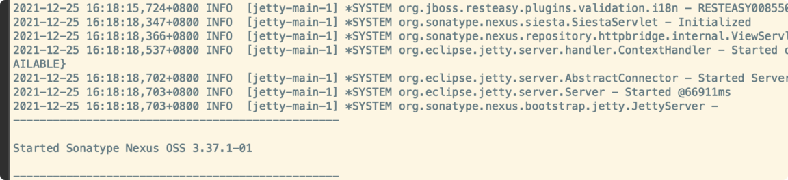
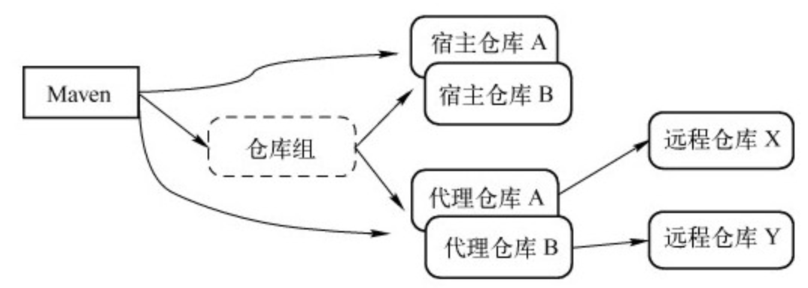
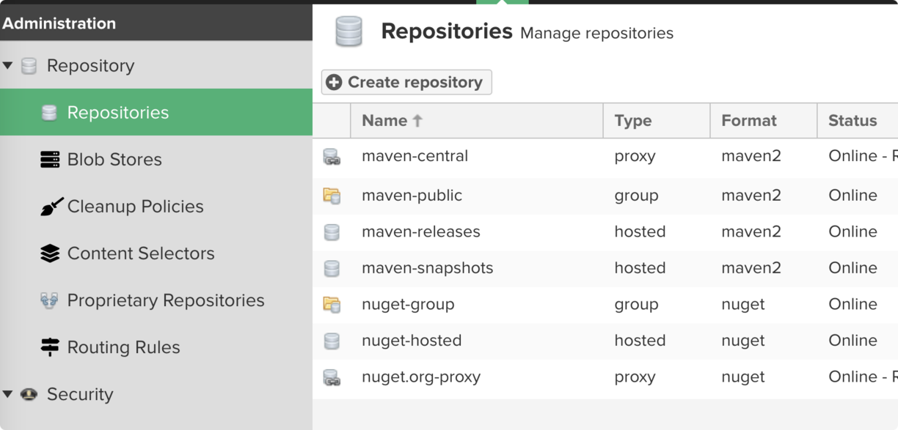
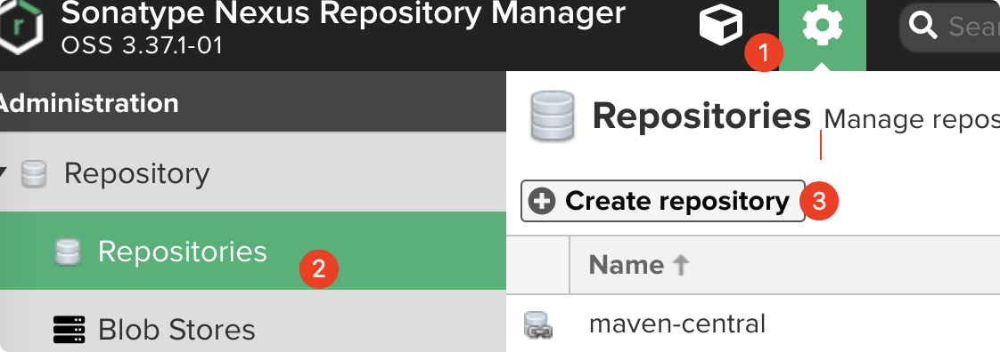
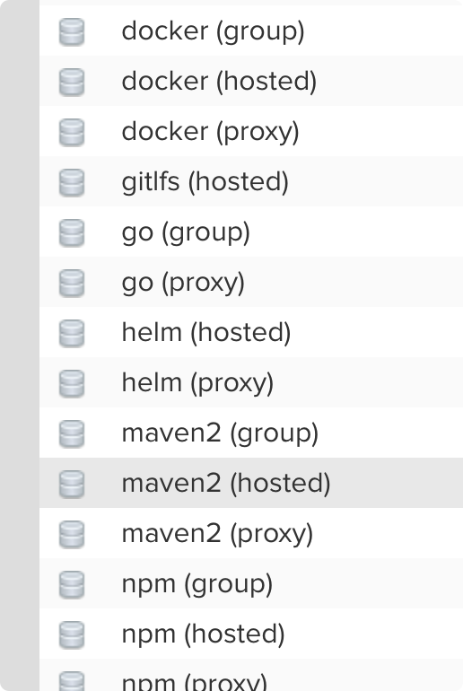
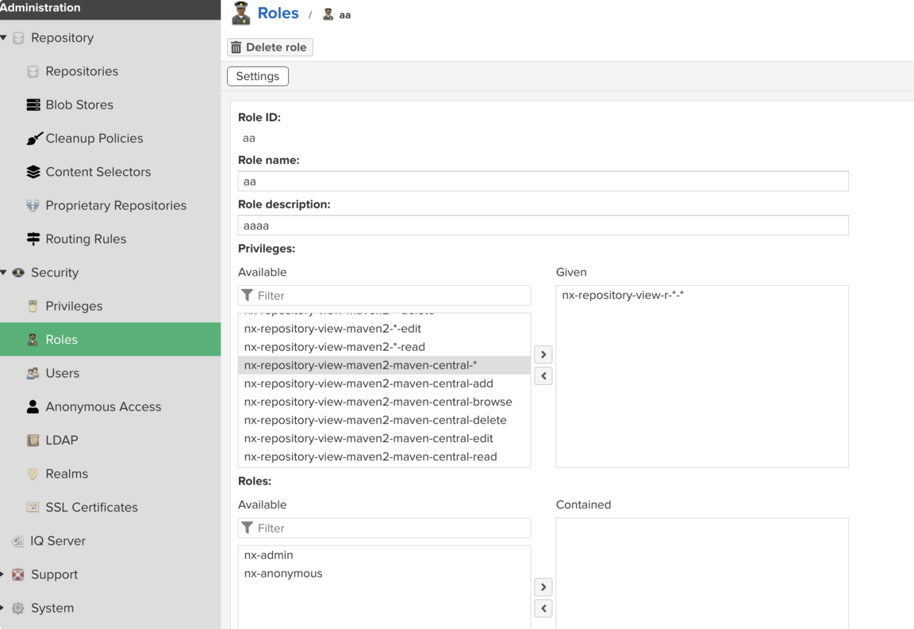
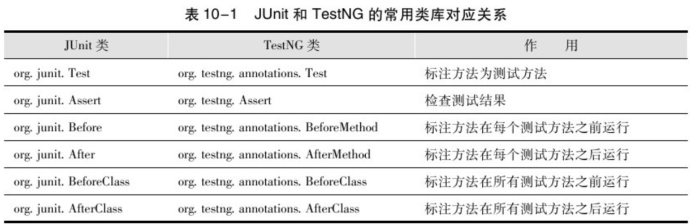

# Maven 私服与测试

> 上一篇：[02-生命周期与插件](02-生命周期与插件.md)
> 下一篇：[04-版本与灵活构建](04-版本与灵活构建.md)

---

有三种专门的Maven仓库管理软件可以用来帮助大家建立私服：
- Apache基金会的Archiva
- JFrog的Artifactory
- Sonatype的Nexus
其中，Archiva是开源的，而Artifactory和Nexus的核心也是开源的，所以可自由选择。
Nexus开源版本的特性：
- 较小的内存占用（最少仅为28MB）
- 基于ExtJS的友好界面基于
- Restlet的完全REST API
- 支持代理仓库、宿主仓库和仓库组
- 基于文件系统，不需要数据库
- 支持仓库索引和搜索
- 支持从界面上传Maven构件
- 细粒度的安全控制
> Nexus专业版本是需要付费购买的，除了开源版本的所有特性之外，它主要包含一些企业安全控制、发布流程控制等需要的特性

## 5.1 安装
Nexus是典型的Java Web应用，它有两种安装包，
- 一种是包含Jetty容器的Bundle包
- 另一种是不包含Web容器的war包
Nexus的Bundle自带了Jetty容器，因此用户不需要额外的Web容器就能直接启动Nexus
1. 下载，见上面网址
1. 解压
  1. nexus-3.37.1-01  这种目录下是运行组件，比如启动脚本，依赖 jar 等
  1. sonatype-work/：该目录包含Nexus生成的配置文件、日志文件、仓库文件等
1. 启动服务

1. 访问服务，默认端口:8081

## 5.2 登录
默认超管账号为 admin，密码在服务器文件中：
进入之后会提示修改密码。

## 5.3 仓库与仓库组
仓库类型：
- group（仓库组）
- hosted（宿主）
- proxy（代理）
- virtual（虚拟）


### 5.3.1 内置仓库

- maven-central
代理Maven中央仓库
  - 策略为Release
- maven-releases
策略为Release的宿主类型仓库，用来部署组织内部的发布版本构件
- maven-sbapshots
策略为Snapshot的宿主类型仓库，用来部署组织内部的快照版本构件
- 3rd party
这是一个策略为Release的宿主类型仓库，用来部署无法从公共仓库获得的第三方发布版本构件
- Google Code
这是一个策略为Release的代理仓库，用来代理Google Code Maven仓库的发布版本构件
- ......

### 5.3.2 创建Nexus宿主仓库



### 5.3.3 配置使用
在 POM 中
```xml
<repositories>
    <repository>
        <id>test</id>
        <url>http://xxxx:8081/repository/test/</url>
    </repository>
    <repository>
        <id>public</id>
        <url>http://xxxx:8081/repository/maven-public/</url>
    </repository>
</repositories>
```
当然上面的配置是在一个项目上，如果想在本机上配置，那就在 settings.xml 中配置
但是 setting.xml 不支持直接配置repositories元素
```xml
<?xml version="1.0" encoding="utf-8"?>

<settings>
  <profiles>
    <profile>
      <id>nexus</id>
      <repositories>
        <repository>
          <id>nexus</id>
          <name>Nexus</name>
          <url>http://localhost:8081/nexus/content/groups/public/</url>
          <releases>
            <enabled>true</enabled>
          </releases>
          <snapshots>
            <enabled>true</enabled>
          </snapshots>
        </repository>
      </repositories>
      <pluginRepositories>
        <pluginRepository>
          <id>nexus</id>
          <name>Nexus</name>
          <url>http://localhost:8081/nexus/content/groups/public/</url>
          <releases>
            <enabled>true</enabled>
          </releases>
          <snapshots>
            <enabled>true</enabled>
          </snapshots>
        </pluginRepository>
      </pluginRepositories>
    </profile>
  </profiles>
  <activeProfiles>
    <activeProfile>nexus</activeProfile>
  </activeProfiles>
</settings>
```
> 该配置中使用了一个id为nexus的profile，这个profile包含了相关的仓库配置，同时配置中又使用activeProfile元素将nexus这个profile激活，这样当执行Maven构建的时候，激活的profile会将仓库配置应用到项目中去
当然也可以使用镜像的方式进行配置
略

### 5.3.4 部署构建到私服
1. 和上面2.3 大项介绍的一致
1. 哎 setting.xml 中配置认证信息。
> 也可以在页面进行手动部署上传，比如某些具有版权的 jar 包就可以这样部署到私服。

## 5.4 权限配置
Nexus是基于权限（Privilege）做访问控制的，服务器的每一个资源都有相应的权限来控制，
因此用户执行特定的操作时就必须拥有必要的权限。管理员必须以角色（Role）的方式将权限赋予Nexus用户
用户可以被赋予一个或者多个角色，
角色可以包含一个或者多个权限，
角色还可以包含一个或者多个其他角色。
默认：
- admin：该用户拥有对Nexus服务的完全控制
- anonymous：该用户对应了所有未登录的匿名用户，它们可以浏览仓库并进行搜索

## 5.5 为项目分配独立的仓库
在组织内部，如果所有项目都部署快照及发布版构件至同样的仓库，就会存在潜在的冲突及安全问题，我们不想让项目A的部署影响到项目B，反之亦然
1. 创建两个宿主仓库（这里也可以多建立一个组，将两个包起来）
  一个快照，一个发布
1. 明确仓库的增删改等权限
1. 创建适合上面权限的角色，并在页面选择响应权限

1. 角色创建完成之后，根据需要将其分配给项目的团队成员

---

跳过测试（不推荐）
```bash
mvn package-DskipTests
```
或配置
```xml
<plugin>
  <groupId>org.apache.maven.plugins</groupId>
  <artifactId>maven-surefire-plugin</artifactId>
  <version>2.5</version>
  <configuration>
    <skipTests>true</skipTests>
  </configuration>
</plugin>
```
跳过测试代码的编译
```bash
mvn package -Dmaven.test.skip=true
```

## 6.1 maven-surefire-plugin
Maven本身并不是一个单元测试框架，
Java世界中主流的单元测试框架为
- JUnit(http://www.junit.org/)
- TestNG(http://testng.org/)
Maven所做的只是在构建执行到特定生命周期阶段的时候，通过插件来执行JUnit或者TestNG的测试用例.
maven-surefire-plugin，可以称之为测试运行器（Test Runner），它能很好地兼容JUnit 3、JUnit 4以及TestNG
默认运行
- *
- *
- **/*TestCase.java

### 6.1.1 运行指定测试
maven-surefire-plugin提供了一个test参数让Maven用户能够在命令行指定要运行的测试用例
```bash
# 单个
mvn test -Dtest=RandomGeneratorTest
# 通配符
mvn test -Dtest=Random*Test
# 多个
mvn test-Dtest=RandomGeneratorTest,AccountCaptchaServiceTest
```

### 6.1.2 包含和排除测试用例
除了上面说的默认执行的那些测试用例模式；还支持自定义。
maven-surefire-plugin还是允许用户通过额外的配置来自定义包含一些其他测试类，或者排除一些符合默认命名模式的测试类
```xml
<plugin>
  <groupId>org.apache.maven.plugins</groupId>
  <artifactId>maven-surefire-plugin</artifactId>
  <version>2.5</version>
  <configuration>
    <includes>
      <include>**/*Tests.java</include>
    </includes>
    <excludes>
      <exclude>**/*ServiceTest.java</exclude>
      <exclude>**/TempDaoTest.java</exclude>
    </excludes>
  </configuration>
</plugin>
```

## 6.2 测试报告
除了命令行输出，Maven用户可以使用maven-surefire-plugin等插件以文件的形式生成更丰富的测试报告。

### 6.2.1 基本的测试报告
默认情况下，maven-surefire-plugin会在项目的target/surefire-reports目录下生成两种格式的错误报告
- txt
- xml
主要是一些工具可以直接解析

### 6.2.2 测试覆盖率报告
测试覆盖率是衡量项目代码质量的一个重要的参考指标。
Cobertura是一个优秀的开源测试覆盖率统计工具（详见http://cobertura.sourceforge.net/）
Maven通过cobertura-maven-plugin与之集成，用户可以使用简单的命令为Maven项目生成测试覆盖率报告
```bash
mvn cobertura:cobertura
```
打开项目目录target/site/cobertura/下的index.html文件，即可看见报告结果
单击具体的类，还能看到精确到行的覆盖率报告

## 6.3 TestNG配置
具体该库的测试用法，见官方文档。
首先需要删除POM中的JUnit依赖，加入TestNG依赖
```xml
<dependency>
  <groupId>org.testng</groupId>
  <artifactId>testng</artifactId>
  <version>5.9</version>
  <scope>test</scope>
  <!--TestNG使用classifier jdk15和jdk14为不同的Java平台提供支持-->
  <classifier>jdk15</classifier>
</dependency>
```

TestNG允许用户使用一个名为testng.xml的文件来配置想要运行的测试集合
```xml
<?xml version="1.0" encoding="UTF-8"?>
<suite name="Suite1" verbose="1">
    <test name="Regression1">
        <classes>
            <classname="com.juvenxu.mvnbook.account.captcha.RandomGeneratorTest"/>
        </classes>
    </test>
</suite>
```
在POM 中指定引入
```xml
<plugin>
  <groupId>org.apache.maven.plugins</groupId>
  <artifactId>maven-surefire-plugin</artifactId>
  <version>2.5</version>
  <configuration>
    <suiteXmlFiles>
      <suiteXmlFile>testng.xml</suiteXmlFile>
    </suiteXmlFiles>
  </configuration>
</plugin>
```
