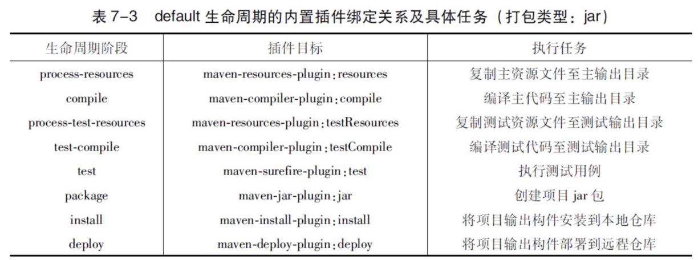

# Maven 学习笔记（总览）

> 版本基线：Maven 3.9.x 为主线（本机实测：Maven 3.9.16 + JDK 17）
> 受众：Java 后端开发，已掌握 Maven 基本使用（坐标、依赖声明、常用命令），想系统补齐**不常用的进阶知识点**（依赖调解/生命周期细节/私服/版本管理）。
> 关联笔记：[00-构建工具总览（Maven vs Gradle 选型对比）](../00-构建工具总览（Maven%20vs%20Gradle%20选型对比）.md)、[Gradle 学习笔记（总览）](../Gradle/Gradle%20学习笔记（总览）.md)

## 📋 总纲

- 1. 依赖配置
- 2. 仓库
- 3. 生命周期和插件
- 4. 聚合继承
- 5. 搭建 Nexus 私服
- 6. 使用 Maven 进行测试
- 7. 版本管理
- 8. 灵活的构建
- 9. Maven Archetype

## 学习目标

学完本篇你能：

1. 说清 Maven 依赖范围 6 种（compile/test/provided/runtime/system/import）与三种 classpath 的关系
2. 理解依赖调解两条原则（路径最近者优先、第一声明者优先）并能预判冲突结果
3. 讲清三套生命周期（clean/default/site）与插件绑定机制
4. 配置 Nexus 私服：仓库/仓库组/权限/部署构建
5. 用 maven-surefire-plugin 控制测试运行（指定测试、包含排除）
6. 掌握 Maven 版本号约定、主干/标签/分支策略与 GPG 签名
7. 用属性/Profile 实现环境适配的灵活构建

## 前置知识

- [00-构建工具总览（Maven vs Gradle 选型对比）](../00-构建工具总览（Maven%20vs%20Gradle%20选型对比）.md)——构建工具定位与选型
- [Gradle 学习笔记（总览）](../Gradle/Gradle%20学习笔记（总览）.md)——对照理解两种构建模型的差异
- 需掌握：Maven 坐标（groupId:artifactId:version）、常用命令（mvn compile/test/package）、本地仓库 ~/.m2 基本概念

---

> 原文说明：本文档源自 wolai 个人笔记迁移（原「项目构建工具」页面），内容为 Maven 使用中**不常用的知识点记录**（常用部分已忽略），适合作为 Maven 进阶查漏补缺的参考。

---

本文档主要是对自己不常用的记录下来而已，一些常用的已忽略。
# 1. 依赖配置
根元素project下的dependencies可以包含一个或者多个dependency元素，以声明一个或者多个项目依赖
坐标
- groupId
- artifactId
- version
其他
- type：
  依赖的类型，对应于项目坐标定义的packaging。大部分情况下，该元素不必声明，其默认值为jar。
- scope
  依赖的范围
- optional
  标记依赖是否可选
- exclusions
  用来排除传递性依赖
## 1.1 依赖范围
Maven在编译项目主代码的时候需要使用一套classpath
Maven在编译和执行测试的时候会使用另外一套classpath
实际运行Maven项目的时候，又会使用一套classpath
依赖范围就是用来控制依赖与这三种classpath（编译classpath、测试classpath、运行classpath）的关系
- compile：编译依赖范围。
如果没有指定，就会默认使用该依赖范围
使用此依赖范围的Maven依赖，对于编译、测试、运行三种classpath都有效
- test：测试依赖范围
在编译主代码或者运行项目的使用时将无法使用此类依赖。
典型的例子是JUnit，它只有在编译测试代码及运行测试的时候才需要
- provided：已提供依赖范围
使用此依赖范围的Maven依赖，对于编译和测试class-path有效，但在运行时无效
典型的例子是servlet-api，编译和测试项目的时候需要该依赖，但在运行项目的时候，由于容器已经提供，就不需要Maven重复地引入一遍。
- runtime：运行时依赖范围
使用此依赖范围的Maven依赖，对于测试和运行class-path有效，但在编译主代码时无效
典型的例子是JDBC驱动实现，项目主代码的编译只需要JDK提供的JDBC接口，只有在执行测试或者运行项目的时候才需要实现上述接口的具体JDBC驱动。
- system：系统依赖范围
该依赖与三种classpath的关系，和provided依赖范围完全一致
但是，使用system范围的依赖时必须通过systemPath元素显式地指定依赖文件的路径
  - 由于此类依赖不是通过Maven仓库解析的，而且往往与本机系统绑定，可能造成构建的不可移植，因此应该谨慎使用。
```xml
<dependency>
  <groupId>javax.sql</groupId>
  <artifactId>jdbc-stdext</artifactId>
  <version>2.0</version>
  <scope>system</scope>
  <systemPath>${java.home}/lib/rt.jar</systemPath>
</dependency>
```
- import（Maven 2.0.9及以上）：导入依赖范围
该依赖范围不会对三种classpath产生实际的影响
  - 该范围的依赖只在dependencyManagement元素下才有效果，
使用该范围的依赖通常指向一个POM，
作用是将目标POM中的dependencyManagement配置导入并合并到当前POM的dependencyManagement元素中
## 1.2 依赖调解
Maven依赖调解（Dependency Mediation）的第一原则是：路径最近者优先
A->B->C->X（1.0）、A->D->X（2.0）===> 最终选择 X(2.0)
Maven定义了依赖调解的第二原则：第一声明者优先
## 1.3 依赖优化
列出所有会被打包或解析的依赖
```bash
mvn dependency:list

mvn dependency:tree

分析

mvn dependency:analyze
```
结果中：
- Used undeclared dependencies
项目中使用到的，但是没有显式声明的依赖
这部分可能是传递性依赖进来的，这里提示的意思是当升级等操作会导致这部分在不经意间也会升级，不易察觉，有潜在风险而已。
- Unused declared dependencies
意指项目中未使用的，但显式声明的依赖
这部分不能直接删除，也可能是传递性进来的功能，但并没有在项目中直接使用。
这部分需要自己一个一个细心人工排查看是否需要删除或改变范围等
# 2. 仓库
## 2.1 配置远程仓库
这里演示的是，POM中配置，不是setting中配置镜像
在Pom.xml中配置如下
```xml
<repositories>
  <repository>
    <id>jboss</id>
    <name>JBoss Repository</name>
    <url>http://repository.jboss.com/maven2/</url>
    <releases>
      <!--表示开启JBoss仓库的发布版本下载支持-->
      <enabled>true</enabled>
      <!--
      updatePolicy用来配置Maven从远程仓库检查更新的频率，
      默认的值是daily，表示Maven每天检查一次。
      其他可用的值包括：
        never—从不检查更新；
        always—每次构建都检查更新；
        interval:X—每隔X分钟检查一次更新（X为任意整数）
      -->
      <updatePolicy>daily</updatePolicy>
      <checksumPolicy>ignore</checksumPolicy>
    </releases>
    <snapshots>
      <!--关闭JBoss仓库的快照版本的下载支持-->
      <enabled>false</enabled>
    </snapshots>
    <!--layout元素值default表示仓库的布局是Maven 2及Maven 3的默认布局，而不是Maven 1的布局-->
    <layout>default</layout>
  </repository>
</repositories>
```
任何一个仓库声明的id必须是唯一的，尤其需要注意的是，Maven自带的中央仓库使用的id为central，如果其他的仓库声明也使用该id，就会覆盖中央仓库的配置
> 元素checksumPolicy用来配置Maven检查检验和文件的策略。当构件被部署到Maven仓库中时，会同时部署对应的校验和文件。在下载构件的时候，Maven会验证校验和文件，如果校验和验证失败，怎么办？当checksumPolicy的值为默认的warn时，Maven会在执行构建时输出警告信息，其他可用的值包括：fail—Maven遇到校验和错误就让构建失败；ignore—使Maven完全忽略校验和错误。
## 2.2 远程仓库的认证
认证信息必须配置在settings.xml文件中
```xml
<settings>
  <servers>
    <server>
    <id>my-proj</id>
    <username>repo-user</username>
    <password>repo-pwd</password>
    </server>
  </servers>
</settings>
```
> [!note]
> 这里的关键是id元素，settings.xml中server元素的id必须与POM中需要认证的repository元素的id完全一致。换句话说，正是这个id将认证信息与仓库配置联系在了一起
## 2.3 部署到远程仓库
私服的一大作用是部署第三方构件，包括组织内部生成的构件以及一些无法从外部仓库直接获取的构件。无论是日常开发中生成的构件，还是正式版本发布的构件，都需要部署到仓库中，供其他团队成员使用
1. 首先，需要编辑项目的pom.xml文件。配置distributionManagement元素
```xml
<project>
  <distributionManagement>
    <!--发布版本构件的仓库-->
    <repository>
      <!--仓库唯一标识-->
      <id>proj-releases</id>
      <!--易读标识-->
      <name>Proj Release Repository</name>
      <!--具体地址-->
      <url>http://192.168.1.100/content/repositories/proj-releases</url>
    </repository>
    <!--快照版本的仓库-->
    <snapshotRepository>
      <id>proj-snapshots</id>
      <name>Proj Snapshot Repository</name>
      <url>http://192.168.1.100/content/repositories/proj-snapshots</url>
    </snapshotRepository>
  </distributionManagement>
</project>
```
1. 配置正确后，发布
```bash
mvn clean deploy
```
## 2.4 快照版本
防止版本号滥用引入的大量修改或其他问题，引入快照版本
- 将模块设置为快照版本，打包发布私服的时候，Maven会自动为构件打上时间戳
比如2.1-20091214.221414-13就表示2009年12月14日22点14分14秒的第13次快照
- 使用模块的代码将依赖修改为依赖快照版本
比如：
- Maven会自动从仓库中检查该版本快照的最新包
  - 默认每天检查一次更新
  - 由仓库配置的updatePolicy控制
  - 具体参见上面 2.1
  - 使用命令强制更新
```bash
mvn clean install  -U
```
- 项目稳定后，两个项目版本地方都修改为稳定版本号即可
> 项目不应该依赖于任何组织外部的快照版本依赖，由于快照版本的不稳定性，这样的依赖会造成潜在的危险
## 2.5 从仓库解析依赖的机制
1. 范围为 system 的，直接本地文件系统
1. 依据坐标路径，在本地仓库寻找
1. 如果版本是显著的发布版本，比如：2.1；那么遍历所有仓库去下载
1. 依赖的版本是
  1. 则基于更新策略读取所有远程仓库的元数据
  1. 将其与本地仓库的对应元数据合并后，计算出RELEASE或者LATEST真实的值
  1. 基于这个真实的值检查本地和远程仓库
1. 依赖的版本是
  1. 基于更新策略读取所有远程仓库的元数据
  1. 将其与本地仓库的对应元数据合并后，得到最新快照版本的值
  1. 将其与本地仓库的对应元数据合并后，得到最新快照版本的值
1. 如果最后解析得到的构件版本是时间戳格式的快照，如1.4.1-20091104.121450-121
  1. 复制其时间戳格式的文件至非时间戳格式，如SNAPSHOT，并使用该非时间戳格式的构件
> [!note]
> 当依赖的版本不明晰的时候，如RELEASE、LATEST和SNAPSHOT
> Maven就需要基于更新远程仓库的更新策略来检查更新
> Maven 3不再支持在
如果在构建中发现元数据出现错误，当然这里说的肯定是私服内部元数据文件内容异常了，可以手动或工具进行修复。
## 2.6 镜像
中央仓库中国区镜像
```xml
<mirror>
    <id>maven.net.cn</id>
    <name>oneof the central mirrors in china</name>
    <!--http://repo1.maven.org/maven2/-->
    <url>http://maven.net.cn/content/groups/public/</url>
    <mirrorOf>central</mirrorOf>
</mirror>
```
配置所有拉取都经过私服：
```xml
<mirrors>
  <mirror>
    <!--认证的时候，要配置一样的-->
    <id>internal-repository</id>
    <name>Internal Repository Manager</name>
    <url>http://192.168.1.100/maven2/</url>
    <!--所有Maven仓库的镜像，任何对于远程仓库的请求都会被转至此-->
    <mirrorOf>*</mirrorOf>
   </mirror>
</mirrors>
```
Maven还支持更高级的镜像配置:
- <mirrorOf>*</mirrorOf>
- <mirrorOf>external：*</mirrorOf>
- <mirrorOf>repo1，repo2</mirrorOf>
- <mirrorOf>*，！repo1</mirrorOf>
## 2.7 仓库搜索服务
- Sonatype Nexus
- Jarvana
- MVNbrowser
- MVNrepository
# 3. 声明周期和插件
采用类似模板方法模式来完成生命周期工作；具体每个周期节点的内部实现是由各个插件完成。
例如，针对编译的插件有maven-compiler-plugin，针对测试的插件有maven-surefire-plugin等
Maven定义的生命周期和插件机制一方面保证了所有Maven项目有一致的构建标准，另一方面又通过默认插件简化和稳定了实际项目的构建。此外，该机制还提供了足够的扩展空间，用户可以通过配置现有插件或者自行编写插件来自定义构建行为
## 3.1 三套生命周期
分别为clean、default和site。
- clean生命周期的目的是清理项目
- default生命周期的目的是构建项目
- site生命周期的目的是建立项目站点
> 每个生命周期包含一些阶段（phase），这些阶段是有顺序的，并且后面的阶段依赖于前面的阶段，用户和Maven最直接的交互方式就是调用这些生命周期阶段
较之于生命周期阶段的前后依赖关系，三套生命周期本身是相互独立的
### 3.1.1 clean生命周期
clean生命周期的目的是清理项目，它包含三个阶段：
1. pre-clean执行一些清理前需要完成的工作
1. clean清理上一次构建生成的文件
1. post-clean执行一些清理后需要完成的工作
### 3.1.2 default生命周期
default生命周期定义了真正构建时所需要执行的所有步骤，它是所有生命周期中最核心的部分，其包含的阶段如下：
- validate
- initialize
- generate-sources
- process-sources
处理项目主资源文件。
一般来说，是对src/main/resources目录的内容进行变量替换等工作后，复制到项目输出的主classpath目录中
- generate-resources
- process-resources
- compile
编译项目的主源码
一般来说，是编译src/main/java目录下的Java文件至项目输出的主classpath目录中
- process-classes
- generate-test-sources
- process-test-sources
处理项目测试资源文件。
一般来说，是对src/test/resources目录的内容进行变量替换等工作后，复制到项目输出的测试classpath目录中
- generate-test-resources
- process-test-resources
- test-compile
编译项目的测试代码
一般来说，是编译src/test/java目录下的Java文件至项目输出的测试classpath目录中
- process-test-classes
- test
使用单元测试框架运行测试，测试代码不会被打包或部署
- prepare-package
- package
接受编译好的代码，打包成可发布的格式，如JAR
- pre-integration-test
- integration-test
- post-integration-test
- verify
- install
将包安装到Maven本地仓库，供本地其他Maven项目使用。
- deploy
将最终的包复制到远程仓库，供其他开发人员和Maven项目使用
### 3.1.3 site生命周期
site生命周期的目的是建立和发布项目站点，Maven能够基于POM所包含的信息，自动生成一个友好的站点，方便团队交流和发布项目信息
- pre-site执行一些在生成项目站点之前需要完成的工作
- site生成项目站点文档
- post-site执行一些在生成项目站点之后需要完成的工作
- site-deploy将生成的项目站点发布到服务器上
## 3.2 插件目标
为了代码复用等；每个插件有多个目标，每个目标对应一个功能。
比如：maven-dependency-plugin
dependency:analyze、dependency:tree和dependency:list。
这是一种通用的写法，冒号前面是插件前缀，冒号后面是该插件的目标
## 3.3 绑定
### 3.3.1 内置绑定
针对一些主要的生命周期阶段，与插件目标内置绑定；减少开发人员工作

注意，表中只列出了拥有插件绑定关系的阶段，default生命周期还有很多其他阶段，默认它们没有绑定任何插件，因此也没有任何实际行为。
### 3.3.2 自定义绑定
自己选择将某个插件目标绑定到生命周期的某个阶段上，这种自定义绑定方式能让Maven项目在构建过程中执行更多更富特色的任务。
> 一个常见的例子是创建项目的源码jar包，内置的插件绑定关系中并没有涉及这一任务，
> 因此需要用户自行配置。maven-source-plugin可以帮助我们完成该任务，
> 它的jar-no-fork目标能够将项目的主代码打包成jar文件，
> 可以将其绑定到default生命周期的verify阶段上，
> 在执行完集成测试后和安装构件之前创建源码jar包
```xml
<build>
  <plugins>
    <plugin>
      <groupId>org.apache.maven.plugins</groupId>
      <artifactId>maven-source-plugin</artifactId>
      <version>2.1.1</version>
      <executions>
        <execution>
          <id>attach-sources</id>
          <phase>verify</phase>
          <goals>
            <goal>jar-no-fork</goal>
          </goals>
        </execution>
      </executions>
    </plugin>
  </plugins>
</build>
```
> executions下每个execution子元素可以用来配置执行一个任务。该例中配置了一个id为attach-sources的任务，通过phrase配置，将其绑定到verify生命周期阶段上，再通过goals配置指定要执行的插件目标
当多个插件目标绑定到同一个阶段的时候，这些插件声明的先后顺序决定了目标的执行顺序
## 3.4 插件配置
- 命令行配置
  很多插件目标的参数都支持从命令行配置，
用户可以在Maven命令中使用-D参数，并伴随一个参数键=参数值的形式，来配置插件目标的参数
```bash
mvn install -Dmaven.test.skip=true
```
- POM 中插件全局配置
  有些参数不会更改，那就不需要在命令行中配置
  例如，通常会需要配置maven-compiler-plugin告诉它：
编译Java 1.5版本的源文件，生成与JVM 1.5兼容的字节码文件
```xml
<build>
  <plugins>
    <plugin>
      <groupId>org.apache.maven.plugins</groupId>
      <artifactId>maven-compiler-plugin</artifactId>
      <version>2.1</version>
      <configuration>
        <source>1.5</source>
        <target>1.5</target>
      </configuration>
    </plugin>
  </plugins>
</build>
```
  - 在POM中配置插件的时候，如果该插件是Maven的官方插件（即如果其groupId为org.apache.maven.plugins），就可以省略groupId配置
    - 不推荐使用，省略一行没啥必要
- POM 中配置任务
略
## 3.5 插件信息获取
插件众多，功能众多；使用正确的插件并进行正确的配置，其实并不是一件容易的事
- 在线插件信息
基本上所有主要的Maven插件都来自
  - Apache
可靠性更高
    - http://maven.apache.org/plugins/index.html
    - http://repo1.maven.org/maven2/org/apache/maven/plugins/
  - Codehaus
有问题需研究源码
    - http://mojo.codehaus.org/plugins.html
- 使用maven-help-plugin描述插件
```
mvn help:describe -Dplugin=org.apache.maven.plugins:maven-compiler-plugin:2.1
```
  - 在描述插件的时候，还可以省去版本信息，让Maven自动获取最新版本来进行表述
```
mvn help:describe -Dplugin=org.apache.maven.plugins:maven-compiler-plugin
```
  - 进一步简化，可以使用插件目标前缀替换坐标
```
mvn help:describe -Dplugin=compiler
```
  - 如果想仅仅描述某个插件目标的信息，可以加上goal参数：
```
mvn help:describe -Dplugin=compiler -Dgoal=compile
```
  - 如果想让maven-help-plugin输出更详细的信息，可以加上detail参数
```
mvn help:describe -Dplugin=compiler -Ddetail
```
## 3.6 插件仓库
Maven会区别对待依赖的远程仓库与插件的远程仓库
当Maven需要的依赖在本地仓库不存在时，它会去所配置的远程仓库查找，可是当Maven需要的插件在本地仓库不存在时，它就不会去这些远程仓库查找
- Maven内置的插件仓库配置
```xml
<pluginRepositories>
  <pluginRepository>
    <id>central</id>
    <name>Maven Plugin Repository</name>
    <url>http://repo1.maven.org/maven2</url>
    <layout>default</layout>
    <snapshots>
      <enabled>false</enabled>
    </snapshots>
    <releases>
      <updatePolicy>never</updatePolicy>
    </releases>
  </pluginRepository>
</pluginRepositories>
```
- 很少需要自定义插件仓库，如果需要参考上面配置即可
## 3.7 插件解析
在用户没有提供插件版本的情况下，Maven会自动解析插件版本
首先，Maven在超级POM中为所有核心插件设定了版本，超级POM是所有Maven项目的父POM，所有项目都继承这个超级POM的配置，因此，即使用户不加任何配置，Maven使用核心插件的时候，它们的版本就已经确定了
如果用户使用某个插件时没有设定版本，而这个插件又不属于核心插件的范畴，Maven就会去检查所有仓库中可用的版本，然后做出选择；元数据在
### 3.7.1 插件前缀
mvn命令行支持使用插件前缀来简化插件的调用
插件前缀与groupId:artifactId是一一对应的，这种匹配关系存储在仓库元数据中
这里的仓库元数据为
Maven在解析插件仓库元数据的时候，会默认使用
也可以配置，让maven检查其他的 groupId 上插件仓库元数据
```xml
<settings>
  <pluginGroups>
    <pluginGroup>com.your.plugins</pluginGroup>
  </pluginGroups>
</settings>
```
> 当Maven解析到dependency:tree这样的命令后，它首先基于默认的groupId归并所有插件仓库的元数据org/apache/maven/plugins/maven-metadata.xml；其次检查归并后的元数据，找到对应的artifactId为maven-dependency-plugin；然后结合当前元数据的groupIdorg.apache.maven.plugins；最后使用第7.8.3节描述的方法解析得到version，这时就得到了完整的插件坐标。如果org/apache/maven/plugins/maven-metadata.xml没有记录该插件前缀，则接着检查其他groupId下的元数据，如org/codehaus/mojo/maven-metadata.xml，以及用户自定义的插件组。如果所有元数据中都不包含该前缀，则报错。
# 4. 聚合继承
## 4.1 聚合
多个子项目一起构建发布的时候，最好有一个聚合项目
POM.xml
```xml
<packaging>pom</packaging>

<modules>
  <module>account-email</module>
  <module>account-persist</module>
</modules>
```
对于聚合模块来说，其打包方式packaging的值必须为pom，否则就无法构建
modules，这是实现聚合的最核心的配置。
用户可以通过在一个打包方式为pom的Maven项目中声明任意数量的module元素来实现模块的聚合
聚合模块与其他模块的目录结构并非一定要是父子关系
## 4.2 继承
每个子项目模块在一起，出现大量重复依赖。不如利用继承来处理。
- 修改子模块的 Pom
```xml
<parent>
    <!--定义父坐标-->
    <artifactId>aaa</artifactId>
    <groupId>com.lub.atom</groupId>
    <version>0.0.1-SNAPSHOT</version>
    <!--定义父项目的 POM 位置【可选选项】-->
    <relativePath>../management/pom.xml</relativePath>
</parent>
```
> [!note]
> 当项目构建时，Maven会首先根据relativePath检查父POM，
> 如果找不到，再从本地仓库查找。
> relativePath的默认值是../pom.xml，也就是说，Maven默认父POM在上一层目录下
- 修改子模块 Pom
可选的操作
  - 移除子模块的
  - 如果确实父子定义不一样，那就需要显式定义，这一步就不要操作了
### 4.2.1 可继承的 POM 元素
- groupId：项目组ID，项目坐标的核心元素。
- version：项目版本，项目坐标的核心元素。
- description：项目的描述信息。
- organization：项目的组织信息。
- inceptionYear：项目的创始年份。
- url：项目的URL地址。
- developers：项目的开发者信息。
- contributors：项目的贡献者信息。
- distributionManagement：项目的部署配置。
- issueManagement：项目的缺陷跟踪系统信息。
- ciManagement：项目的持续集成系统信息。
- scm：项目的版本控制系统信息。
- mailingLists：项目的邮件列表信息。
- properties：自定义的Maven属性。
- dependencies：项目的依赖配置。
- dependencyManagement：项目的依赖管理配置。
- repositories：项目的仓库配置。
- build：包括项目的源码目录配置、输出目录配置、插件配置、插件管理配置等。
- reporting：包括项目的报告输出目录配置、报告插件配置等。
### 4.2.2 依赖管理-插件管理
可以保证所有子项目都使用的依赖，可以直接使用dependencies。
无法保证所有子项目都使用，使用下面管理起来：
Maven提供的dependencyManagement元素既能让子模块继承到父模块的依赖配置，又能保证子模块依赖使用的灵活性
在dependencyManagement元素下的依赖声明不会引入实际的依赖，不过它能够约束dependencies下的依赖使用
如果子模块不声明依赖的使用，即使该依赖已经在父POM的dependencyManagement中声明了，也不会产生任何实际的效果
> [!note]
> 父POM中使用dependencyManagement声明依赖能够统一项目范围中依赖的版本，
> 当依赖版本在父POM中声明之后，子模块在使用依赖的时候就无须声明版本，
> 也就不会发生多个子模块使用依赖版本不一致的情况。这可以帮助降低依赖冲突的几率
> [!note]
> 依赖范围的 import 介绍见上面
> import范围依赖由于其特殊性，一般都是指向打包类型为pom的模块
> 如果有多个项目，它们使用的依赖版本都是一致的，则就可以定义一个使用dependencyManagement专门管理依赖的POM，然后在各个项目中导入这些依赖管理配置。
插件管理相同：
> 当项目中的多个模块有同样的插件配置时，应当将配置移到父POM的pluginManagement元素中。即使各个模块对于同一插件的具体配置不尽相同，也应当使用父POM的pluginManagement元素统一声明插件的版本。甚至可以要求将所有用到的插件的版本在父POM的pluginManagement元素中声明，子模块使用插件时不配置版本信息，这么做可以统一项目的插件版本，避免潜在的插件不一致或者不稳定问题，也更易于维护
## 4.3 构建顺序
反应堆（Reactor）是指所有模块组成的一个构建结构。对于单模块的项目，反应堆就是该模块本身，但对于多模块项目来说，反应堆就包含了各模块之间继承与依赖的关系，从而能够自动计算出合理的模块构建顺序。
> [!note]
> Maven按序读取POM，如果该POM没有依赖模块，那么就构建该模块，否则就先构建其依赖模块，如果该依赖还依赖于其他模块，则进一步先构建依赖的依赖
模块间的依赖关系会将反应堆构成一个有向非循环图（Directed Acyclic Graph,DAG），各个模块是该图的节点，依赖关系构成了有向边。这个图不允许出现循环，因此，当出现模块A依赖于B，而B又依赖于A的情况时，Maven就会报错。
# 5. 搭建 Nexus 私服
有三种专门的Maven仓库管理软件可以用来帮助大家建立私服：
- Apache基金会的Archiva
- JFrog的Artifactory
- Sonatype的Nexus
其中，Archiva是开源的，而Artifactory和Nexus的核心也是开源的，所以可自由选择。
Nexus开源版本的特性：
- 较小的内存占用（最少仅为28MB）
- 基于ExtJS的友好界面基于
- Restlet的完全REST API
- 支持代理仓库、宿主仓库和仓库组
- 基于文件系统，不需要数据库
- 支持仓库索引和搜索
- 支持从界面上传Maven构件
- 细粒度的安全控制
> Nexus专业版本是需要付费购买的，除了开源版本的所有特性之外，它主要包含一些企业安全控制、发布流程控制等需要的特性
## 5.1 安装
Nexus是典型的Java Web应用，它有两种安装包，
- 一种是包含Jetty容器的Bundle包
- 另一种是不包含Web容器的war包
Nexus的Bundle自带了Jetty容器，因此用户不需要额外的Web容器就能直接启动Nexus
1. 下载，见上面网址
1. 解压
  1. nexus-3.37.1-01  这种目录下是运行组件，比如启动脚本，依赖 jar 等
  1. sonatype-work/：该目录包含Nexus生成的配置文件、日志文件、仓库文件等
1. 启动服务

1. 访问服务，默认端口:8081
## 5.2 登录
默认超管账号为 admin，密码在服务器文件中：
进入之后会提示修改密码。
## 5.3 仓库与仓库组
仓库类型：
- group（仓库组）
- hosted（宿主）
- proxy（代理）
- virtual（虚拟）

### 5.3.1 内置仓库

- maven-central
代理Maven中央仓库
  - 策略为Release
- maven-releases
策略为Release的宿主类型仓库，用来部署组织内部的发布版本构件
- maven-sbapshots
策略为Snapshot的宿主类型仓库，用来部署组织内部的快照版本构件
- 3rd party
这是一个策略为Release的宿主类型仓库，用来部署无法从公共仓库获得的第三方发布版本构件
- Google Code
这是一个策略为Release的代理仓库，用来代理Google Code Maven仓库的发布版本构件
- ......
### 5.3.2 创建Nexus宿主仓库


### 5.3.3 配置使用
在 POM 中
```xml
<repositories>
    <repository>
        <id>test</id>
        <url>http://xxxx:8081/repository/test/</url>
    </repository>
    <repository>
        <id>public</id>
        <url>http://xxxx:8081/repository/maven-public/</url>
    </repository>
</repositories>
```
当然上面的配置是在一个项目上，如果想在本机上配置，那就在 settings.xml 中配置
但是 setting.xml 不支持直接配置repositories元素
```xml
<?xml version="1.0" encoding="utf-8"?>

<settings>
  <profiles>
    <profile>
      <id>nexus</id>
      <repositories>
        <repository>
          <id>nexus</id>
          <name>Nexus</name>
          <url>http://localhost:8081/nexus/content/groups/public/</url>
          <releases>
            <enabled>true</enabled>
          </releases>
          <snapshots>
            <enabled>true</enabled>
          </snapshots>
        </repository>
      </repositories>
      <pluginRepositories>
        <pluginRepository>
          <id>nexus</id>
          <name>Nexus</name>
          <url>http://localhost:8081/nexus/content/groups/public/</url>
          <releases>
            <enabled>true</enabled>
          </releases>
          <snapshots>
            <enabled>true</enabled>
          </snapshots>
        </pluginRepository>
      </pluginRepositories>
    </profile>
  </profiles>
  <activeProfiles>
    <activeProfile>nexus</activeProfile>
  </activeProfiles>
</settings>
```
> 该配置中使用了一个id为nexus的profile，这个profile包含了相关的仓库配置，同时配置中又使用activeProfile元素将nexus这个profile激活，这样当执行Maven构建的时候，激活的profile会将仓库配置应用到项目中去
当然也可以使用镜像的方式进行配置
略
### 5.3.4 部署构建到私服
1. 和上面2.3 大项介绍的一致
1. 哎 setting.xml 中配置认证信息。
> 也可以在页面进行手动部署上传，比如某些具有版权的 jar 包就可以这样部署到私服。
## 5.4 权限配置
Nexus是基于权限（Privilege）做访问控制的，服务器的每一个资源都有相应的权限来控制，
因此用户执行特定的操作时就必须拥有必要的权限。管理员必须以角色（Role）的方式将权限赋予Nexus用户
用户可以被赋予一个或者多个角色，
角色可以包含一个或者多个权限，
角色还可以包含一个或者多个其他角色。
默认：
- admin：该用户拥有对Nexus服务的完全控制
- anonymous：该用户对应了所有未登录的匿名用户，它们可以浏览仓库并进行搜索
## 5.5 为项目分配独立的仓库
在组织内部，如果所有项目都部署快照及发布版构件至同样的仓库，就会存在潜在的冲突及安全问题，我们不想让项目A的部署影响到项目B，反之亦然
1. 创建两个宿主仓库（这里也可以多建立一个组，将两个包起来）
  一个快照，一个发布
1. 明确仓库的增删改等权限
1. 创建适合上面权限的角色，并在页面选择响应权限

1. 角色创建完成之后，根据需要将其分配给项目的团队成员
# 6. 使用 Maven 进行测试
跳过测试（不推荐）
```bash
mvn package-DskipTests
```
或配置
```xml
<plugin>
  <groupId>org.apache.maven.plugins</groupId>
  <artifactId>maven-surefire-plugin</artifactId>
  <version>2.5</version>
  <configuration>
    <skipTests>true</skipTests>
  </configuration>
</plugin>
```
跳过测试代码的编译
```bash
mvn package -Dmaven.test.skip=true
```
## 6.1 maven-surefire-plugin
Maven本身并不是一个单元测试框架，
Java世界中主流的单元测试框架为
- JUnit(http://www.junit.org/)
- TestNG(http://testng.org/)
Maven所做的只是在构建执行到特定生命周期阶段的时候，通过插件来执行JUnit或者TestNG的测试用例.
maven-surefire-plugin，可以称之为测试运行器（Test Runner），它能很好地兼容JUnit 3、JUnit 4以及TestNG
默认运行
- *
- *
- **/*TestCase.java
### 6.1.1 运行指定测试
maven-surefire-plugin提供了一个test参数让Maven用户能够在命令行指定要运行的测试用例
```bash
# 单个
mvn test -Dtest=RandomGeneratorTest
# 通配符
mvn test -Dtest=Random*Test
# 多个
mvn test-Dtest=RandomGeneratorTest,AccountCaptchaServiceTest
```
### 6.1.2 包含和排除测试用例
除了上面说的默认执行的那些测试用例模式；还支持自定义。
maven-surefire-plugin还是允许用户通过额外的配置来自定义包含一些其他测试类，或者排除一些符合默认命名模式的测试类
```xml
<plugin>
  <groupId>org.apache.maven.plugins</groupId>
  <artifactId>maven-surefire-plugin</artifactId>
  <version>2.5</version>
  <configuration>
    <includes>
      <include>**/*Tests.java</include>
    </includes>
    <excludes>
      <exclude>**/*ServiceTest.java</exclude>
      <exclude>**/TempDaoTest.java</exclude>
    </excludes>
  </configuration>
</plugin>
```
## 6.2 测试报告
除了命令行输出，Maven用户可以使用maven-surefire-plugin等插件以文件的形式生成更丰富的测试报告。
### 6.2.1 基本的测试报告
默认情况下，maven-surefire-plugin会在项目的target/surefire-reports目录下生成两种格式的错误报告
- txt
- xml
主要是一些工具可以直接解析
### 6.2.2 测试覆盖率报告
测试覆盖率是衡量项目代码质量的一个重要的参考指标。
Cobertura是一个优秀的开源测试覆盖率统计工具（详见http://cobertura.sourceforge.net/）
Maven通过cobertura-maven-plugin与之集成，用户可以使用简单的命令为Maven项目生成测试覆盖率报告
```bash
mvn cobertura:cobertura
```
打开项目目录target/site/cobertura/下的index.html文件，即可看见报告结果
单击具体的类，还能看到精确到行的覆盖率报告
## 6.3 TestNG配置
具体该库的测试用法，见官方文档。
首先需要删除POM中的JUnit依赖，加入TestNG依赖
```xml
<dependency>
  <groupId>org.testng</groupId>
  <artifactId>testng</artifactId>
  <version>5.9</version>
  <scope>test</scope>
  <!--TestNG使用classifier jdk15和jdk14为不同的Java平台提供支持-->
  <classifier>jdk15</classifier>
</dependency>
```

TestNG允许用户使用一个名为testng.xml的文件来配置想要运行的测试集合
```xml
<?xml version="1.0" encoding="UTF-8"?>
<suite name="Suite1" verbose="1">
    <test name="Regression1">
        <classes>
            <classname="com.juvenxu.mvnbook.account.captcha.RandomGeneratorTest"/>
        </classes>
    </test>
</suite>
```
在POM 中指定引入
```xml
<plugin>
  <groupId>org.apache.maven.plugins</groupId>
  <artifactId>maven-surefire-plugin</artifactId>
  <version>2.5</version>
  <configuration>
    <suiteXmlFiles>
      <suiteXmlFile>testng.xml</suiteXmlFile>
    </suiteXmlFiles>
  </configuration>
</plugin>
```
# 7. 版本管理
一个健康的项目通常有一个长期、合理的版本演变过程
- 版本管理
是指项目整体版本的演变过程管理，如从1.0-SNAPSHOT到1.0，再到1.1-SNAPSHOT。
- 版本控制
是指借助版本控制工具（如Subversion）追踪代码的每一个变更
1. 将项目的快照版本更新至发布版本之后，
1. 应当再执行一次Maven构建，以确保项目状态是健康的。
1. 然后将这一变更提交到版本控制系统的主干中。
1. 接着再为当前主干的状态打上标签
## 7.1 Maven的版本号定义约定
Maven的版本号定义约定是这样的：
```
<主版本>.<次版本>.<增量版本>-<里程碑版本>
```
- 主版本：表示了项目的重大架构变更
- 次版本：表示较大范围的功能增加和变化，及Bug修复
- 增量版本：一般表示重大Bug的修复
- 里程碑版本：顾名思义，这往往指某一个版本的里程碑
> [!note]
> 不是每个版本号都必须拥有这四个部分。
> 一般来说，主版本和次版本都会声明，但增量版本和里程碑就不一定了
## 7.2 主干、标签与分支
- 主干：项目开发代码的主体，是从项目开始直到当前都处于活动的状态
从这里可以获得项目最新的源代码以及几乎所有的变更历史
- 分支：从主干的某个点分离出来的代码拷贝
通常可以在不影响主干的前提下在这里进行重大Bug的修复，
或者做一些实验性质的开发。

如果分支达到了预期的目的，通常发生在这里的变更会被合并（merge）到主干中
- 标签：用来标识主干或者分支的某个点的状态，以代表项目的某个稳定状态，
这通常就是版本发布时的状态
## 7.3 自动化版本发布
Maven Release Plugin提供了版本发布流程一些必要操作。
Maven Release Plugin主要有三个目标，它们分别为：
- release:prepare　准备版本发布
依次执行下列操作：
  1. 检查项目是否有未提交的代码
  1. 检查项目是否有快照版本依赖
  1. 根据用户的输入将快照版本升级为发布版
  1. 将POM中的SCM信息更新为标签地址
  1. 基于修改后的POM执行Maven构建
  1. 提交POM变更
  1. 基于用户输入为代码打标签
  1. 将代码从发布版升级为新的快照版
  1. 提交POM变更
- release:rollback　回退release:prepare所执行的操作
将POM回退至release:prepare之前的状态，并提交。
需要注意的是，该步骤不会删除release:prepare生成的标签，因此用户需要手动删除。
- release:perform　执行版本发布
签出release:prepare生成的标签中的源代码，
并在此基础上执行mvn deploy命令打包并部署构件至仓库。
### 7.3.1 相关配置
> 要为项目发布版本，首先需要为其添加正确的版本控制系统信息，
> 这是因为Maven Release Plugin需要知道版本控制系统的主干、标签等地址信息后才能执行相关的操作
```xml
<project>
  <scm>
    <connection>scm:svn:http://192.168.1.103/app/trunk</connection>
    <developerConnection>scm:svn:https://192.168.1.103/app/trunk</developerConnection>
    <url>http://192.168.1.103/account/trunk</url>
  </scm>
</project>
```
- connection元素表示一个只读的scm地址，
- developerConnection元素表示可写的scm地址，
- url则表示可以在浏览器中访问的scm地址
为了能让Maven识别，
connection和developerConnection必须以scm开头，
冒号之后的部分表示版本控制工具类型，比如这里是 svn
还要配置 tag 信息
```xml
<plugin>
  <groupId>org.apache.maven.plugins</groupId>
  <artifactId>maven-release-plugin</artifactId>
  <version>2.0</version>
  <configuration>
    <tagBase>https://192.168.1.103/app/tags/</tagBase>
  </configuration>
</plugin>
```
在执行release:prepare之前还有两个注意点:
- 系统必须要提供版本控制命令行工具
- POM必须配置了可用的部署仓库
执行：
```bash
mvn release:prepare
```
之后会提示明确或输入版本信息。
如果版本信息和 tag 等信息正确，就直接 enter；否则输入相关自己的信息再确认。
maven-release-plugin就会自动为所有子模块使用与父模块一致的发布版本和新的SNAPSHOT版本
```bash
mvn release:prepare -DautoVersionSubmodules=true
```
## 7.4 GPG签名
当从中央仓库下载第三方构件的时候，可能会想要验证这些文件的合法性
同样地，当发布项目给客户使用的时候，客户也会想要验证这些文件是否是由项目组发布的，且没有被恶意篡改过
PGP（Pretty Good Privacy）就是这样一个用来帮助提高安全性的技术
GnuPG（简称GPG，来自http://www.gnupg.org/）是PGP标准的一个免费实现，无论是类UNIX平台还是Windows平台，都可以使用它。GPG能够帮助我们为文件生成签名、管理密钥以及验证签名等
# 8. 灵活的构建
Maven为了支持构建的灵活性，内置了三大特性，即:
- 属性
- Profile
- 资源过滤
## 8.1 属性
通过<properties>元素用户可以自定义一个或多个Maven属性，
然后在POM的其他地方使用${属性名称}的方式引用该属性，
这种做法的最大意义在于消除重复
maven 属性分类：
- 内置属性：
主要有两个常用内置属性
  - ${version}
  - ${basedir}
- POM属性：
用户可以使用该类属性引用POM文件中对应元素的值。
例如${project.artifactId}就对应了<project><artifactId>元素的值
常用的POM属性包括:
  - ${project.build.sourceDirectory}
  - ${project.build.testSourceDirectory}
  - ${project.build.directory}
  - ${project.outputDirectory}
  - ${project.testOutputDirectory}
  - ${project.groupId}
  - ${project.artifactId}
  - ${project.version}
  - ${project.build.finalName}
- 自定义属性：
用户可以在POM的<properties>元素下自定义Maven属性
- Settings属性：
与POM属性同理，用户使用以
- Java系统属性：
所有Java系统属性都可以使用Maven属性引用，
例如
- 环境变量属性：
所有环境变量都可以使用以
## 8.2 资源过滤与环境适配
为了应对环境的变化，首先需要使用Maven属性将这些将会发生变化的部分提取出来
比如：在别的配置文件(src/main/resources/下)中定义了如下：
```.properties
database.jdbc.driverClass=${db.driver}
database.jdbc.connectionURL=${db.url}
database.jdbc.username=${db.username}
database.jdbc.password=${db.password}
```
在 POM 中，使用一个额外的profile将自定义属性包裹
```xml
<profiles>
  <profile>
    <id>dev</id>
    <properties>
      <db.driver>com.mysql.jdbc.Driver</db.driver>
      <db.url>jdbc:mysql://192.168.1.100：3306/test</db.url>
      <db.username>dev</db.username>
      <db.password>dev-pwd</db.password>
    </properties>
  </profile>
</profiles>
```
到这里还不能将两个关联起来，需要maven-resources-plugin
> 它默认的行为只是将项目主资源文件复制到主代码编译输出目录中，
> 将测试资源文件复制到测试代码编译输出目录中。
>
> 不过只要通过一些简单的POM配置，该插件就能够解析资源文件中的Maven属性，即开启资源过滤
Maven默认的主资源目录和测试资源目录的定义是在超级POM中。
要为资源目录开启过滤，只要在此基础上添加一行filtering配置即可
```xml
<resources>
  <resource>
    <directory>${project.basedir}/src/main/resources</directory>
    <filtering>true</filtering>
  </resource>
<resources>
```
最后，只需要在命令行激活profile,Maven就能够在构建项目的时候使用profile中属性值替换数据库配置文件中的属性引用
```bash
mvn clean install -Pdev
# mvn的-P参数表示在命令行激活一个profile。这里激活了id为dev的profile
```
## 8.3 Maven Profile
为了能让构建在各个环境下方便地移植，Maven引入了profile的概念
profile能够在构建的时候修改POM的一个子集，或者添加额外的配置元素。
用户可以使用很多方式激活profile，以实现构建在不同环境下的移植
### 8.3.1 激活
1. 命令行激活
```
mvn clean install -Pdev-x,dev-y
```
1. settings文件显式激活
如果希望某个profile默认一直处于激活状态，
就可以配置settings.xml文件的active-Profiles元素，
表示其配置的profile对于所有项目都处于激活状态
```xml
<activeProfiles>
  <activeProfile>dev-x</activeProfile>
</activeProfiles>
```
1. 系统属性激活
用户可以配置当某系统属性存在的时候，自动激活profile
```xml
<profiles>
  <profile>
    <activation>
      <property>
        <!--只有 name，没有 value的时候，表示存在即可-->
        <name>test</name>
        <!--当存在 name 和 value 的时候，表示存在键值对匹配情况时才激活-->
        <value>x</value>
      </property>
    </activation>
  </profile>
</profiles>
```
1. 操作系统环境激活
  Profile还可以自动根据操作系统环境激活，
如果构建在不同的操作系统有差异，用户完全可以将这些差异写进profile，
然后配置它们自动基于操作系统环境激活
```xml
<profiles>
  <profile>
    <activation>
      <os>
        <name>Windows XP</name>
        <family>Windows</family>
        <arch>x86</arch>
        <version>5.1.2600</version>
      </os>
    </activation>
  </profile>
</profiles>
```
  - family的值包括Windows、UNIX和Mac等
  - name: os.name
  - arch:
  - version: os.version
1. 文件存在与否激活
```xml
<profiles>
  <profile>
    <activation>
      <file>
        <missing>x.properties</missing>
        <exists>y.properties</exists>
      </file>
    </activation>
  </profile>
</profiles>
```
<profiles><profile></profile>
</profiles>
1. 默认激活
  用户可以在定义profile的时候指定其默认激活
```xml
<profiles>
  <profile>
    <id>dev</id>
    <activation>
      <activeByDefault>true</activateByDefault>
    </activation>
    <properties>
      <db.driver>com.mysql.jdbc.Driver</db.driver>
      <db.url>jdbc:mysql://192.168.1.100：3306/test</db.url>
      <db.username>dev</db.username>
      <db.password>dev-pwd</db.password>
    </properties>
  </profile>
</profiles>
```
> [!note]
> maven-help-plugin提供了一个目标帮助用户了解当前激活的profile
## 8.4 POM中的profile可使用的元素
```xml
<?xml version="1.0" encoding="utf-8"?>

<project>
  <!--依赖仓库-->
  <repositories></repositories>
  <!--插件仓库-->
  <pluginRepositories></pluginRepositories>
  <!--部署仓库-->
  <distributionManagement></distributionManagement>
  <!--依赖-->
  <dependencies></dependencies>
  <!--依赖-->
  <dependencyManagement></dependencyManagement>
  <!--聚合-->
  <modules></modules>
  <!--Maven属性-->
  <properties></properties>
  <!--项目报告配置-->
  <reporting></reporting>
  <build>
    <!--插件配置-->
    <plugins></plugins>
    <!--默认的一些目标绑定-->
    <defaultGoal></defaultGoal>
    <!--资源目录配置-->
    <resources></resources>
    <testResources></testResources>
    <!--项目构件的默认名称-->
    <finalName></finalName>
  </build>
</project>
```
# 9. Maven Archetype
可以将Archetype理解成Maven项目的模板，例如maven-archetype-quickstart就是最简单的Maven项目模板
Archetype并不是Maven的核心特性，它也是通过插件来实现的，这一插件就是maven-archetype-plugin xx