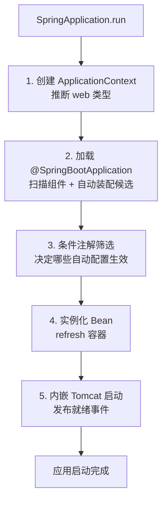
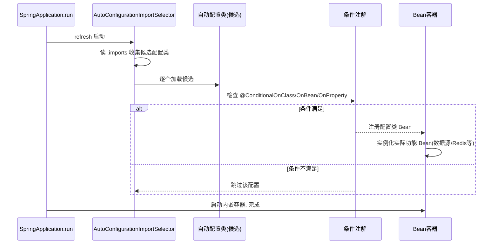

# SpringBoot启动原理与自动装配详解

> 版本基线：Spring Boot 2.x/3.x（3.x 为主，明确标注 2.x 差异）
> 受众：Java 后端开发。假设已懂 Spring 核心（IoC/@Configuration/@Import）。本篇是 SpringBoot 域最核心的篇目，讲清"@SpringBootApplication 到底做了什么、自动装配如何按需生效"。
> 前置知识：[01-Spring核心·IoC与Bean生命周期详解](../spring/01-Spring核心·IoC与Bean生命周期详解.md)（容器/BeanPostProcessor）、[Java注解机制详解](../../JDK基础库/核心机制/Java注解机制详解.md)（@Import/ImportSelector）
> 关联笔记：[02-SpringBoot配置体系与外部化配置详解](02-SpringBoot配置体系与外部化配置详解.md)（配置）、[04-SpringBoot模块化详解](04-SpringBoot模块化详解.md)（Boot4 演进）、orm 域 [07-Spring Boot集成与配置详解](../数据访问层/07-Spring Boot集成与配置详解.md)

## 📋 总纲

1. 从 main() 说起：SpringApplication.run 做了什么
2. @SpringBootApplication 组合注解逐层拆
3. @EnableAutoConfiguration 与自动装配原理 ★
4. 候选配置加载：AutoConfiguration.imports vs spring.factories
5. 条件注解族逐个拆 @ConditionalOnXxx
6. 自动装配执行顺序（Mermaid 时序图）
7. 自定义 Starter 原理 + 示例
8. 常见坑

## 1. 学习目标

1. 画出 @SpringBootApplication 三层组合注解结构
2. 讲清自动装配"候选列表 → 条件筛选 → 生效"三步机制
3. 区分 AutoConfiguration.imports（Boot3）与 spring.factories（Boot2）
4. 逐个讲 @ConditionalOnClass/OnMissingBean/OnProperty/OnBean
5. 手写一个自定义 Starter
6. 说清 @ConditionalOnMissingBean 如何让用户覆盖默认配置

## 2. 前置知识

- [01-Spring核心·IoC与Bean生命周期详解](../spring/01-Spring核心·IoC与Bean生命周期详解.md)：@Configuration/@ComponentScan/@Bean
- [Java注解机制详解](../../JDK基础库/核心机制/Java注解机制详解.md)：@Import 导入配置类、ImportSelector 动态选择
- [07-Spring核心·AOP详解](../spring/07-Spring核心·AOP详解.md)：BeanPostProcessor（自动装配后置）

## 3. 核心知识点

### 3.1 从 main() 说起

```java
@SpringBootApplication
public class AppApplication {
    public static void main(String[] args) {
        SpringApplication.run(AppApplication.class, args);   // 入口
    }
}
```

`SpringApplication.run` 核心流程：



### 3.2 @SpringBootApplication 组合注解 ★

`@SpringBootApplication` = 三个注解的组合：

```java
@SpringBootApplication  ≡
    @SpringBootConfiguration      // 本质是 @Configuration，标记配置类
  + @EnableAutoConfiguration      // 自动装配总开关（灵魂）
  + @ComponentScan                // 扫描主类所在包及子包
```

| 组成 | 作用 | 说明 |
| --- | --- | --- |
| @SpringBootConfiguration | = @Configuration | 标记为配置类 |
| @EnableAutoConfiguration | 开启自动装配 | 通过 @Import 导入选择器 |
| @ComponentScan | 组件扫描 | 默认扫主类所在包及子包 |

> **坑**：若手动拆开三个注解（不用组合注解），@ComponentScan 若不写 basePackages 默认扫"当前注解所在类"的包——放错位置会导致扫不到 Bean。用 @SpringBootApplication 最稳。

### 3.3 @EnableAutoConfiguration 与自动装配原理 ★

`@EnableAutoConfiguration` 内部：`@Import(AutoConfigurationImportSelector.class)`。

**AutoConfigurationImportSelector** 是核心——它动态选择要导入哪些自动配置类：

```
@EnableAutoConfiguration
  └─ @Import(AutoConfigurationImportSelector)
       └─ ImportSelector.selectImports()
            ├─ ① 从 classpath 收集候选配置类列表（见 3.4）
            └─ ② 对每个候选，按条件注解筛选（见 3.5）
                 → 只有条件满足的才被注册为 Bean
```

**关键认知**：自动配置不是"魔法"，而是 Spring 扩展点（@Import + ImportSelector + 条件注解）的综合运用。`AutoConfigurationImportSelector` 实现 `ImportSelector`，在容器启动时返回"要导入的配置类数组"。

### 3.4 候选配置加载：.imports vs spring.factories

Boot 扫描 jar 里的候选自动配置类列表文件：

| 版本 | 文件路径 | 说明 |
| --- | --- | --- |
| Boot 3.x | `META-INF/spring/org.springframework.boot.autoconfigure.AutoConfiguration.imports` | 每行一个自动配置类全限定名 |
| Boot 2.7 起 | 支持上述 .imports 文件 | 过渡 |
| Boot 2.x 早期 | `META-INF/spring.factories` | key=`EnableAutoConfiguration` 的列表 |

`.imports` 文件内容示例（spring-boot-autoconfigure 自带）：

```
org.springframework.boot.autoconfigure.web.servlet.WebMvcAutoConfiguration
org.springframework.boot.autoconfigure.jdbc.DataSourceAutoConfiguration
org.springframework.boot.autoconfigure.data.redis.RedisAutoConfiguration
...
```

> **注意**：加载的是**所有候选**，不是全部生效——必须经条件注解筛选（3.5）。Boot 2.7 引入 .imports 是为解决 spring.factories 文件混杂、影响启动性能的问题。

### 3.5 条件注解族 @ConditionalOnXxx ★

每个自动配置类上都标条件注解，满足条件才生效。底层基于 Spring 的 `@Conditional` + `Condition` 接口。

| 注解 | 条件 | 典型用途 | 示例 |
| --- | --- | --- | --- |
| @ConditionalOnClass | classpath 存在某类 | 有 jar 才配 | `@ConditionalOnClass(RedisTemplate.class)` |
| @ConditionalOnMissingClass | classpath 不存在某类 | 反条件 | 排除某些依赖 |
| @ConditionalOnBean | 容器已有某 Bean | 有才配 | 依赖已配的数据源 |
| @ConditionalOnMissingBean | 容器无某 Bean | **用户覆盖默认** | `@ConditionalOnMissingBean(UserService.class)` |
| @ConditionalOnProperty | 配置属性匹配 | 按开关 | `@ConditionalOnProperty(prefix="app.cache", name="enabled", havingValue="true")` |
| @ConditionalOnExpression | SpEL 表达式 | 组合条件 | `@ConditionalOnExpression("${app.x:true} && ...")` |
| @ConditionalOnWebApplication | 是 Web 应用 | Web 才配 | Web 自动配置 |
| @ConditionalOnJava | Java 版本 | 版本限制 | Java 17 才配 |

**为什么能覆盖默认配置（面试必考）**：

```java
@Bean
@ConditionalOnMissingBean
public DataSource dataSource() { return new HikariDataSource(); }
```

当用户**自定义**了 DataSource Bean 时，容器已有该 Bean → `@ConditionalOnMissingBean` 条件不满足 → 默认数据源不注册。**这就是用户配置优先于默认自动配置的机制**。

> **执行顺序关键**：自动配置类默认在用户 Bean 之后处理（`@AutoConfigureAfter`/Order），保证用户自定义优先。所以 @ConditionalOnMissingBean 能正确判断"用户是否已定义"。

### 3.6 自动装配执行顺序（Mermaid）



### 3.7 自定义 Starter 原理 + 示例

Starter = 依赖聚合（pom）+ 自动配置类（含 .imports 注册）。

**步骤**：
1. 写自动配置类（标 @Configuration + 条件注解）
2. 在 `META-INF/spring/...AutoConfiguration.imports` 注册该配置类
3. 提供 starter pom 依赖聚合

```java
// ① 自动配置类
@Configuration
@ConditionalOnClass(MyClient.class)
@EnableConfigurationProperties(MyProperties.class)
public class MyAutoConfiguration {
    @Bean
    @ConditionalOnMissingBean
    public MyClient myClient(MyProperties props) {
        return new MyClient(props.getUrl());
    }
}

// ② 属性绑定类
@ConfigurationProperties(prefix = "app.my")
public class MyProperties { private String url; /* getter/setter */ }

// ③ resources/META-INF/spring/org.springframework.boot.autoconfigure.AutoConfiguration.imports
// com.example.MyAutoConfiguration
```

> 建议按官方命名规范：自动配置类后缀 `AutoConfiguration`，并排在前（模块化后见 [04-SpringBoot模块化详解](04-SpringBoot模块化详解.md)）。完整实战（双模块拆分/元数据/测试/示例）见 [05-SpringBoot自定义Starter详解](05-SpringBoot自定义Starter详解.md)。

### 3.8 常见坑

- **自动配置不生效**：候选配置类没在 .imports/spring.factories 注册，或条件注解不满足（缺 jar/属性）
- **用户配置被默认覆盖**：自定义 Bean 时没利用 @ConditionalOnMissingBean 的机制，或自动配置顺序在用户 Bean 之前
- **扫不到 Bean**：@SpringBootApplication 放在非顶层包，@ComponentScan 只扫它所在包及子包
- **条件注解误判**：@ConditionalOnClass 判断的是"类是否存在"，依赖被 optional/排除时易失效
- **Boot2 与 Boot3 文件路径混淆**：.imports 与 spring.factories 路径不同

## 4. 最佳实践

- 主类放包顶层（@SpringBootApplication 扫全包）
- 自定义自动配置类命名 `XxxAutoConfiguration`，注册进 .imports
- 用 @ConditionalOnMissingBean 提供"可被用户覆盖"的默认 Bean
- 条件注解用 @ConditionalOnClass（判依赖）+ @ConditionalOnMissingBean（判用户自定义）组合
- 属性用 @ConfigurationProperties 绑定（见 [02-SpringBoot配置体系与外部化配置详解](02-SpringBoot配置体系与外部化配置详解.md)）

## 5. 常见踩坑

- **@ConditionalOnClass 引用了不存在的类导致启动失败**：name 属性用字符串全限定名，避免编译期依赖不存在类
- **@ConditionalOnMissingBean 误匹配**：只匹配指定类型，注意泛型/接口边界
- **自定义 Starter 版本冲突**：starter 传递依赖与主项目冲突，用版本仲裁或排除
- **自动配置顺序错乱**：依赖其他自动配置的 Bean 时，用 @AutoConfigureBefore/After 声明顺序

## 6. 小结

- @SpringBootApplication = @SpringBootConfiguration + @EnableAutoConfiguration + @ComponentScan。
- @EnableAutoConfiguration 通过 @Import(AutoConfigurationImportSelector) 动态导入候选配置。
- 候选配置从 .imports（Boot3）/ spring.factories（Boot2）加载，经条件注解筛选后生效。
- @ConditionalOnMissingBean 是用户覆盖默认配置的关键机制。
- 自定义 Starter = 自动配置类 + .imports 注册 + starter pom 聚合。

## 7. 关联笔记

- 上一篇：[00-SpringBoot体系总览](00-SpringBoot体系总览.md)
- 下一篇：[02-SpringBoot配置体系与外部化配置详解](02-SpringBoot配置体系与外部化配置详解.md)
- [04-SpringBoot模块化详解](04-SpringBoot模块化详解.md)：Boot4 自动装配打包方式改变
- [01-Spring核心·IoC与Bean生命周期详解](../spring/01-Spring核心·IoC与Bean生命周期详解.md)：容器基础
- [Java注解机制详解](../../JDK基础库/核心机制/Java注解机制详解.md)：@Import/ImportSelector 机制
- orm 域 [07-Spring Boot集成与配置详解](../数据访问层/07-Spring Boot集成与配置详解.md)：具体集成自动配置示例

## 8. 参考资料

- [Spring Boot 官方：Developing Auto-configuration](https://docs.spring.io/spring-boot/reference/features/developing-auto-configuration.html)，查询日期 2026-08-11
- [Spring Boot 官方：Auto-configuration Condition 包](https://docs.spring.io/spring-boot/3.3/api/java/org/springframework/boot/autoconfigure/condition/package-summary.html)，查询日期 2026-08-11
- [JavaGuide：SpringBoot 自动装配原理详解](https://javaguide.cn/system-design/framework/spring/spring-boot-auto-assembly-principles.html)，查询日期 2026-08-11
