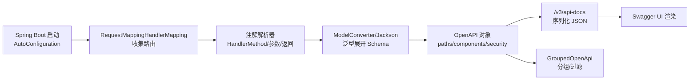

# SpringDoc与OpenAPI集成详解

> 版本基线：SpringDoc 2.x（`springdoc-openapi-starter-webmvc-ui`，支持 Spring Boot 3.x / 2.6+，包名 jakarta）。SpringDoc 1.x 对应 Boot 2.6 之前（javax）。
> 受众：Java 后端开发，需要把 SpringMVC Controller 自动转成 OpenAPI 文档并暴露 Swagger UI。假设已懂 SpringBoot 自动装配（[01-SpringBoot启动原理与自动装配详解](01-SpringBoot启动原理与自动装配详解.md)）与 SpringMVC 执行流程（[03-SpringMVC执行流程详解](../spring/03-SpringMVC执行流程详解.md)）。
> 关联笔记：[17-SpringDoc与OpenAPI集成实践](17-SpringDoc与OpenAPI集成实践.md)（可运行示例）、[18-Knife4j增强与网关聚合详解](18-Knife4j增强与网关聚合详解.md)（增强 UI）、**01-OpenAPI规范详解**（见知识库）（规范本身）、[01-Spring Security核心架构详解](../安全/01-Spring Security核心架构详解.md)（安全集成）。

## 📋 总纲

1. SpringDoc 与 SpringFox 的定位（为什么需要它）
2. 原理：Controller → OpenAPI 模型 的生成链路
3. 自动装配与运行时生成机制
4. `/v3/api-docs` 端点原理
5. 性能影响与优化 ★
6. 安全性：接口信息泄漏与生产关闭 ★
7. 注解详解表格（@OpenAPIDefinition/@Tag/...）
8. GroupedOpenApi 分组与 JWT 全局认证
9. Springfox → SpringDoc 迁移对照表
10. 对比：原型与相关组件
11. 最佳实践
12. 常见踩坑
13. 小结

## 学习目标

学完本篇你能：

1. 说清 SpringDoc 如何把一个 Controller 变成一份 OpenAPI 文档
2. 讲清文档的生成时机与缓存机制，以及性能优化手段
3. 说出生产环境如何安全地关闭并防止接口信息泄漏
4. 熟练使用 @OpenAPIDefinition/@Tag/@Operation/@Schema 等注解
5. 用 GroupedOpenApi 按模块分组、配 JWT 全局认证
6. 完成 Springfox → SpringDoc 的迁移对照

## 前置知识

- [01-SpringBoot启动原理与自动装配详解](01-SpringBoot启动原理与自动装配详解.md)：自动装配、条件注解（SpringDoc 靠 AutoConfiguration 生效）
- [03-SpringMVC执行流程详解](../spring/03-SpringMVC执行流程详解.md)：HandlerMapping/HandlerMethod、注解请求映射
- **01-OpenAPI规范详解**（见知识库）：OpenAPI 文档结构（paths/components/securitySchemes）
- **01-JWT详解**（见知识库） 与 [01-Spring Security核心架构详解](../安全/01-Spring Security核心架构详解.md)：JWT 认证在文档里的表达

---

## 1. SpringDoc 的定位

**问题背景**：老牌 `SpringFox` 只支持 Spring Boot 2.x（Spring 5 / javax），2020 年官方停更（archived），无法支撑 Spring Boot 3（Jakarta 命名空间 `jakarta.*`）。SpringDoc 接过主角，用浏览器打开 `/swagger-ui` 可交互文档，本地 dev 目录暴露 `/v3/api-docs` 自动变成 Swagger UI。

**一句话**：SpringDoc = Spring Boot 生态里把 Controller **自动分析**成 OpenAPI 3.x 文档的对齐方案的当代事实标准（用于 Spring Boot 3 / 2.6+）。

**和 OpenAPI、Swagger UI 的关系**：
- OpenAPI：规范（语言无关）
- SpringDoc：Java 侧的"生成器"，运行时把 Controller 扫描成 OpenAPI 对象，并通过开源 springdoc-openapi-starter-webmvc-ui 内嵌 Swagger UI
- 产物：`/v3/api-docs`（OpenAPI JSON）、`/swagger-ui`（可交互界面）

---

## 2. 原理：Controller → OpenAPI 模型

### 2.1 总体生成链路

```
Spring Boot 启动 (AutoConfiguration 生效)
  → 收集: 所有标注了 @RestController / @Controller 并带 @RequestMapping 的 HandlerMethod
  → 解析: 逐个 method 解析注解(@Operation/@Parameter/@ApiResponse/@Schema)
  → 依赖: 反射+Jackson 分析参数类型 / 返回类型 / 泛型 → 生成 OpenAPI Schema 模型
  → 组装: 填入 OpenAPI 对象(paths/components/securitySchemes)
  → 对外: /v3/api-docs 序列化输出 JSON; swagger-ui 拉取并渲染
```

### 2.2 关键步骤拆解

**(1) 扫描控制器**：基于 Spring MVC 自身的 `RequestMappingHandlerMapping`，拿到所有注册的路由（方法+参数元数据），而不是自己再解析一遍注解——天然与真实路由一致。

**(2) 注解解析器链**：`MethodParameterAnnotationExtractor`/各类 `OpenApiCustomiser`/`ModelConverter` 把 SpringMVC 注解（`@GetMapping` 等）与 SpringDoc 注解（`@Operation` 等）翻译成 OpenAPI 对象。`springdoc-openapi` 里内置了若干 `OpenApiCustomizer`（如对全局 args/返回值做处理）。

**(3) 模型解析（关键难点）**：用 Jackson `JavaType`/反射读方法的**返回类型与请求体类型**，递归生成 JSON Schema（对象→properties/数组→items/泛型→展开）。这一步是"Controller 签名"与"OpenAPI schema"的桥梁。泛型（如 `Result<T>`）会通过 Jackson 反序列化上下文被展开成真实类型。

**(4) 自动装配**：spring.factories 或 `META-INF/spring/xxxAutoConfiguration.imports` 里注册 `OpenApiAutoConfiguration`/`SpringDocWebMvcConfiguration` 等，按条件注解（`@ConditionalOnClass` 等）在依赖了 starter 时生效。

**Mermaid：组件协作**



---

## 3. 自动装配与运行时生成机制

### 3.1 自动装配入口

依赖 `springdoc-openapi-starter-webmvc-ui` 后，Spring Boot 通过 `SpringDocWebMvcAutoConfiguration`（`META-INF/spring/org.springframework.boot.autoconfigure.AutoConfiguration.imports`）装载，条件注解包括：

| 条件 | 说明 |
|---|---|
| `@ConditionalOnWebApplication(type = SERVLET)` | 仅 Servlet（MVC）生效 |
| `@ConditionalOnClass({WebMvcConfigurer.class, ...})` | 存在 SpringMVC |
| `@ConditionalOnProperty("springdoc.api-docs.enabled")` | 默认开启，`false` 关掉 api-docs |

### 3.2 运行时"惰性"生成（重点）

- **默认：文档在首次访问 `/v3/api-docs` 时才构建（懒加载）**，不是启动时生成——得益于 `OpenApiResource` 在首次请求时扫描并构建、结果按需更新。
- SpringDoc 提供了**缓存**维度：`springdoc.cache.disabled=true`（默认为禁用缓存/否）等。要控制"每次刷新还是构建一次"。
- 因此性能问题往往出在"首次访问"的耗时（要扫描所有 Controller 并解析泛型），而不是启动常驻开销。

> 版本演进：SpringDoc 既有懒构建，也允许通过配置提前预生成（配合缓存），但**默认行为是首次访问才构建**。这是生产优化里"冷启动 / 接口分类不卡顿"的入手点。

### 3.3 完整启用/关闭控制

| 配置 | 作用 |
|---|---|
| `springdoc.api-docs.enabled=false` | 关闭 `/v3/api-docs`（默认 true） |
| `springdoc.swagger-ui.enabled=false` | 关闭 Swagger UI（默认 true） |
| `springdoc.annotations.enabled` | 是否扫描注解生成（调错时注意） |
| `spring.admin.enabled` | 配合 Actuator 的另说，生产全关见 §5 |

---

## 4. `/v3/api-docs` 端点原理

- 默认端点：`/v3/api-docs`，返回整个服务的 OpenAPI JSON。
- 存在专门的 `OpenApiResource`（Bean），是一个 `@RestController` 或路由，内部：
  1. 拿到计算出的 `OpenAPI` 对象（见 §2 生成链路）
  2. 用 Jackson `ObjectMapper` 序列化为 JSON
  3. 按 `Accept` 头可返回 `application/json` / `application/yaml`（`/v3/api-docs.yaml`）
- 分组时端点：`/v3/api-docs/{group}`（如 `/v3/api-docs/user`），见 §8 GroupedOpenApi。
- Swagger UI 前端从该 JSON 拉取渲染（`/swagger-ui/index.html`）。

---

## 5. 性能影响与优化 ★（用户重点）

### 5.1 文档生成时机：首次访问才构建 vs 启动构建

| 时机 | 默认？ | 说明 |
|---|---|---|
| 首次访问再构建（懒） | ✅ 默认 | 启动快，但第一个访问 `/api-docs` 的请求较慢（要扫描解析全部 Controller） |
| 启动时预生成 + 缓存 | 可选 | 启动稍慢，访问稳定；要配置缓存 + 主动预热 |

优化建议：**生产前内测时预热一次**，避免生产首个请求打脸；或接受冷启动成本。

### 5.2 是否缓存

| 配置 | 效果 |
|---|---|
| `springdoc.cache.disabled=true` | 关闭缓存（每次请求都重新构建，慢，一般不给用户并发 |
| `springdoc.cache.disabled=false` | 启用缓存（默认值，文档仅首次构建后复用） |

生产对公共访问建议 **保持缓存开启**（默认），不要把文档当动态接口每次重建。

### 5.3 扫描路径收窄（重点，省大工程）

默认 SpringDoc 扫描全部 `@RestController`；项目很大/Ui 信息不全时用包过滤：

```yaml
springdoc:
  packages-to-scan: com.example.web   # 只扫这个包，别把 service 级都纳入
```

`springdoc.paths-to-match` 可只暴露匹配路径的接口，进一步收口。

### 5.4 跳过哪些类 / 关闭无关解析

| 配置 / 手段 | 作用 |
|---|---|
| `@Hidden` 注解 | 不把某个 Controller/方法纳入文档（最常用） |
| `springdoc.api-docs.enabled=false` | 全局关 api-docs |
| `springdoc.model-and-view-allowed=true/false` | 是否允许 model/view（默认仅处理带类型的方法；会解析 controller 返回值） |
| `springdoc.ignore-missing-response` 等 | 调整响应推断，减少误解析 |

`@Hidden` 与 `springdoc` 提供的 `OpenApiCustomizer`（自己过滤掉某些 path）都可减少暴露面。

### 5.5 文档体积控制

- 大量 `$ref` 复用（components.schemas）减小冗余，SpringDoc 会自动抽 `$ref`，避免每个 operation 内联完整 schema。
- 只对需要的 Controller 暴露。
- 避免把整个 `Result<T>`/大 Entity 全都无条件暴露，用 `@Schema(hidden=true)` 或不引用。

> 思路总结：**先包过滤（packages-to-scan）→ 再注解隐藏（@Hidden）→ 配合缓存与预热**。

---

## 6. 安全性：接口信息泄漏与生产关闭 ★（用户重点）

### 6.1 为什么是风险

`/v3/api-docs` 与 `/swagger-ui` 默认**无需认证**即可访问。生产环境若保留，等于向外部**泄露全部接口路径、参数、schema、内部字段名**，属于典型的"信息泄漏"——和 Actuator 暴露内部指标同类的生产红线（参见 [11-SpringBoot Actuator监控详解](11-SpringBoot Actuator监控详解.md)）。攻击者可据此精准构造攻击、摸清内部结构。

### 6.2 生产安全清单

| 手段 | 说明 | 适用 |
|---|---|---|
| 直接关闭（最彻底） | 生产 profile 里 `springdoc.api-docs.enabled=false` + `springdoc.swagger-ui.enabled=false` | 不需要在线文档时 |
| 环境隔离 | 用 `profile` 只在 dev/test 开启，生产关闭 | 多数团队 |
| 鉴权保护 | 不关，但对 `/swagger-ui/**`、`/v3/api-docs/**` 加 Spring Security 白名单之外的登录认证 | 需要生产也看文档时 |
| 网关层拦截 | 在网关/反向代理拦截 `/api-docs`、`/swagger-ui` 路径，或只允许内网/白名单 IP | 配合 Nginx/网关 |
| Knife4j | 生产 `knife4j.gateway.enabled=false`、`knife4j.production=true`（见 [18-Knife4j增强与网关聚合详解](18-Knife4j增强与网关聚合详解.md)） | 网关聚合时 |

### 6.3 结合 Spring Security 做鉴权

若生产中仍需文档，可让文档路径**走认证**（不是开白名单）：

```java
@Configuration
@EnableWebSecurity
class SecurityConfig {
  SecurityFilterChain filterChain(HttpSecurity http) {
    // 关键：swagger/api-docs 不在 permitAll 白名单，而是要求认证
    http.authorizeHttpRequests(a -> a
        .requestMatchers("/v3/api-docs/**", "/swagger-ui/**", "/swagger-ui.html")
        .authenticated()                 // 未登录不可见文档
        .anyRequest().permitAll());
    return http.build();
  }
}
```

> 反向常见坑：很多教程把 `/v3/api-docs/**`、`/swagger-ui/**` 放 `permitAll()` 白名单——那是"为了能看见文档"做的，却在生产把内部结构也全公开了。**开发/测试可走白名单，生产要么关、要么加认证**。

### 6.4 springdoc.swagger-ui.security

springdoc-ui 里的"鉴权按钮"是给用户在 UI 里填 Token 调试用的（对应 OpenAPI securityScheme），它**不是文档接口的访问控制**——别混淆：它解决"带 Token 调接口"，不解决"谁能打开文档页面"。

### 6.5 防信息泄漏补充

- 别在生产暴露内部字段名：用 `@Schema(description=..., accessMode=READ_ONLY)` 或 `hidden` 收敛敏感字段（密码/内部环境变量/内网地址）。
- 别在 `info/description` 里写内网 IP、密钥、内部错误堆栈示例。
- 生产建议**直接关**（多数场景），需要在线文档再加认证。

---

## 7. 注解详解表格

| 注解 | 位置 | 作用 | 说明/边界 |
|---|---|---|---|
| `@OpenAPIDefinition(info=@Info(...), servers=..., security=...)` | 配置类方法/类 | 定义文档顶层 info/security 等 | 全局元信息、全局 security |
| `@Info(title=, version=, description=)` | 用在 @OpenAPIDefinition 内部 | 文档 title/version | — |
| `@Tag(name=, description=)` | 类/方法 | 分组标签 | Controller/方法归属分组 |
| `@Operation(summary=, description=, operationId=, tags=)` | 方法 | method 级说明 | tags 覆盖类级标签 |
| `@Parameter(description=, required=, schema=@Schema(...), in=...)` | 方法参数 | 单独参数的说明 | 也可用在方法级声明非参数 |
| `@ApiResponse(responseCode="404", description=..., content=@Content(...))` | 方法 | 特定状态码响应 | 配合 `responses` |
| `@ApiResponses({@ApiResponse...})` | 方法 | 多个 @ApiResponse 聚合 | — |
| `@Schema(description=, example=, required=, hidden=)` | 字段/参数/类 | 模型字段说明/示例/隐藏 | `hidden=true` 不进文档 |
| `@Hidden` | 类/方法 | 整体隐藏 | 不进文档 |
| `@SecurityRequirement(name="bearerAuth")` | 方法/类 | 声明需要某个 securityScheme | 与 securitySchemes 配对 |
| `@SecurityScheme(name=, type=HTTP, scheme="bearer", bearerFormat="JWT")` | 配置类 | 定义认证方案进入 components.securitySchemes | 全局可配 JWT |

> 换包注意：SpringDoc 注解包是 **`io.swagger.v3.oas.annotations.*`**（也就是 OpenAPI 3 官方注解，springdoc 直接复用），不是 springdoc 自己新造一套。Springfox 的注解是 **`io.swagger.annotations.*`**（Swagger2）。

---

## 8. GroupedOpenApi 分组与 JWT 全局认证

### 8.1 按模块分组

```java
@Bean
GroupedOpenApi userApi() {
  return GroupedOpenApi.builder()
      .group("user")                       // 分组名 → /v3/api-docs/user
      .pathsToMatch("/api/user/**")        // 只收该路径的接口
      .packagesToScan("com.example.web.user")
      .build();
}
```

- 每个 `GroupedOpenApi` 生成独立分组（独立 `/v3/api-docs/{group}` 端点），文档 UI 可切换。
- 对应 SpringFox 里一个 `Docket`。

### 8.2 JWT 全局认证配置

```java
@Configuration
@OpenAPIDefinition(
    info = @Info(title="商城 API", version="v1"),
    security = @SecurityRequirement(name = "bearerAuth"))
@SecurityScheme(
    name = "bearerAuth",
    type = SecuritySchemeType.HTTP,
    scheme = "bearer",
    bearerFormat = "JWT")
public class OpenApiConfig {
  // 全局声明：所有接口默认带 JWT
}
```

- `@SecurityScheme` 生成 `components.securitySchemes.bearerAuth`；`@OpenAPIDefinition.security` 让所有 operation 默认要求它。
- 单个接口想"不需要认证"用 `@Operation(security = @SecurityRequirement(name = ""))` 覆盖（空串表示无需）。
- 这个 JWT 表达只是"文档声明"，真正鉴权仍由 Spring Security 过滤器执行——文档只是让 UI 能带 Token 调试。

---

## 9. Springfox → SpringDoc 迁移对照表

| 维度 | SpringFox (3.x) | SpringDoc (2.x) |
|---|---|---|
| 状态 | 2020 停更（archived） | 活跃维护 |
| Spring Boot 支持 | 仅 Boot 2.x（Spring 5 / javax），不支持 Boot 3 | Boot 2.6+ 与 Boot 3.x（jakarta） |
| 命名空间 | javax（Boot<2.6） | jakarta（Boot 3.x） |
| 注解包 | `io.swagger.annotations.*` | `io.swagger.v3.oas.annotations.*` |
| 核心配置类 | `Docket` | `GroupedOpenApi` / `OpenAPI`（@Bean） |
| 生成 API | `/v2/api-docs`（Swagger2） | `/v3/api-docs`（OpenAPI 3.x） |
| 注解示例 | `@Api`, `@ApiOperation`, `@ApiParam`, `@ApiModelProperty` | `@Tag`, `@Operation`, `@Parameter`, `@Schema` |

常见字段对照（迁移时直接搜替换）：

| SpringFox | SpringDoc |
|---|---|
| `@Api(tags="x")` | `@Tag(name="x")` |
| `@ApiOperation(value="...")` | `@Operation(summary="...")` |
| `@ApiParam(value="...")` | `@Parameter(description="...")` |
| `@ApiModelProperty(value="...")` | `@Schema(description="...")` |
| `@ApiResponse(code=200, message="...")` | `@ApiResponse(responseCode="200", description="...")` |
| `Docket.select().apis(...)` | `GroupedOpenApi.builder()` + `pathsToMatch/packagesToScan` |

**为什么 SpringFox 停更**：原作者维护乏力 + 规范从 Swagger2 演进到 OpenAPI3 改动大；Spring Boot 2.6 起将其标记不推荐并因 Spring MVC 变更导致兼容性崩坏；Spring Boot 3 全面切 jakarta 后，基于 javax 的 SpringFox 无法再用，SpringDoc 成为事实标准。

---

## 10. 对比：与相关组件

| 组件 | 类型 | 与 SpringDoc 关系 |
|---|---|---|
| SpringDoc | MVC 生态 OpenAPI 生成器 | 主角 |
| Knife4j 4.x | 增强 UI | 底层用的就是 SpringDoc + Swagger UI 的界面增强（见 [18-Knife4j增强与网关聚合详解](18-Knife4j增强与网关聚合详解.md)） |
| spring-doc-openapi-starter-webflux | WebFlux 版 | 响应式栈用 WebFlux starter，见 [13-Spring WebFlux响应式编程详解](13-Spring WebFlux响应式编程详解.md) |

> 有 springdoc-webmvc / webflux 两种 starter 之分，别混用。

---

## 11. 最佳实践

- **生产关闭文档**：profile 隔离，生产 `springdoc.api-docs.enabled=false` + `springdoc.swagger-ui.enabled=false`；确需保留则加 Security 认证。
- **按包收窄**：`packages-to-scan` / `paths-to-match`，投影出真正要公开的接口。
- **schema 复用**：让大的返回类型 `$ref` 进 components，体积更小、UI 更清晰（SpringDoc 默认会抽）。
- **敏感字段收敛**：用 `@Schema(hidden=true)` 或不放内部字段。
- **用上分组 + JWT**：GroupedOpenApi 按模块分，`@SecurityScheme` 声明全局认证，UI 可调试。
- **版本一致**：Boot 3 务必用 SpringDoc 2.x；别退回 SpringFox。

---

## 12. 常见踩坑

- 文档工作依赖启动顺序/被 Security 拦截：生产把文档路径放进 permissAll 白名单但外部也透明 → 见 §6，别生产开白名单。
- `springdoc.api-docs.enabled=false` 但仍能访问 UI：忘了同时关 `springdoc.swagger-ui.enabled`。
- SpringFox 没升级就切 Boot 3：`javax.*` 报错、UI 空白——迁移到 SpringDoc 2.x。
- 注解用成 `io.swagger.annotations.*`（SpringFox 的）在 SpringDoc 上不生效：用 `io.swagger.v3.oas.annotations.*`。
- 第一次访问 `/v3/api-docs` 很慢：正常（惰性构建），配合缓存/预热。

---

## 13. 小结

- SpringDoc 通过自动装配扫描 Controller，用注解解析 + Jackson 泛型展开生成 OpenAPI 模型，经 `/v3/api-docs` 序列化、Swagger UI 渲染。
- 文档默认**首次访问才构建**，可用缓存与包过滤做性能优化。
- **生产安全是硬红线**：关 api-docs/swagger-ui，或加认证；不要在生产开白名单泄露结构。
- 注解包是 `io.swagger.v3.oas.annotations.*`；分组用 GroupedOpenApi，全局认证用 @SecurityScheme。
- SpringFox）2020 停更、不支持 Boot 3；jakarta 命名空间决定 Boot 3 必须 SpringDoc 2.x。

下一篇：[17-SpringDoc与OpenAPI集成实践](17-SpringDoc与OpenAPI集成实践.md)（可运行 SpringBoot3 完整示例）。
