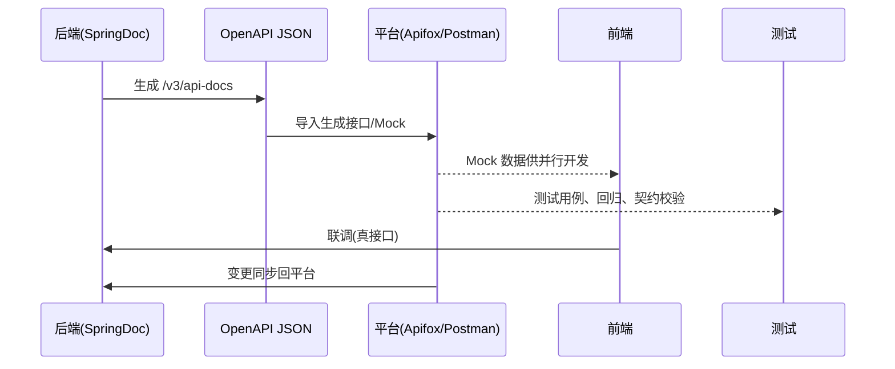

# 协作平台Apifox与Postman详解

> 版本基线：2026-08 现状整理。横向对比主流 API 协作平台 Apifox / Postman / YApi，讲清它们与 OpenAPI 规范的导入导出、Mock、自动化测试与前后端协作工作流。
> 受众：后端/前端/测试开发，需要为团队选一套 API 协作平台，或把服务端 springdoc 生成的 OpenAPI 文档导入平台做协作。默认懂 OpenAPI（**01-OpenAPI规范详解**（见知识库））与 springdoc（[16-SpringDoc与OpenAPI集成详解](16-SpringDoc与OpenAPI集成详解.md)）。
> 关联笔记：**00-接口文档与API规范总览**（见知识库） §4 工具矩阵、[16-SpringDoc与OpenAPI集成详解](16-SpringDoc与OpenAPI集成详解.md)（服务端出规范）、[17-SpringDoc与OpenAPI集成实践](17-SpringDoc与OpenAPI集成实践.md)。

## 📋 总纲

1. 什么是 API 协作平台
2. 平台对比矩阵：Apifox / Postman / YApi
3. OpenAPI 规范导入导出
4. Mock 服务
5. 自动化测试
6. 前后端协作工作流
7. 安全与私有化对比
8. 小结

## 学习目标

学完本篇你能：

1. 说清 API 协作平台（Apifox/Postman/YApi）的定位与差异
2. 把 springdoc 生成的 OpenAPI 导入 Apifox/Postman
3. 用平台做 Mock 让前端并行开发
4. 用平台做接口自动化测试
5. 画出前后端协作的推荐工作流
6. 从安全/私有化角度为团队选型

## 前置知识

- **01-OpenAPI规范详解**（见知识库）：OpenAPI 是可被导入导出的描述规范
- [16-SpringDoc与OpenAPI集成详解](16-SpringDoc与OpenAPI集成详解.md)：服务端如何产出 OpenAPI（作为导入源）

---

## 1. 什么是 API 协作平台

**定义**：把 **文档、调试、Mock、测试、协作** 集成到一处，让前后端/测试/产品基于"同一份接口定义"工作的工具。

**和纯文档工具/规范的差别**：
- OpenAPI = 描述语言（机器可读，不分人机工具）
- Swagger UI / Knife4j = 服务端渲染的可读文档 + 调试（通常跟着服务跑）
- Apifox / Postman / YApi = **独立协作平台**，能导入 OpenAPI，去前后端集中共享、Mock、跑测试、做评审

一句话：**Apifox/Postman/YApi 是"接口的代码仓库 + 协作台"**——文档改版留痕、多人共享、Mock 供前端、测试脚本跑回归。

---

## 2. 平台对比矩阵

| 维度 | Apifox | Postman | YApi |
|---|---|---|---|
| 出身/定位 | 国内主流、一体化 | 国际化老牌、API 全生命周期 | 百度开源、免费私有化 |
| 文档+调试 | ✅ 一体化 | ✅ | ✅ |
| Mock | ✅ 内置、随定义自动出 | ✅ Mock Server | ✅ 前端 Mock |
| 自动化测试 | ✅ 内置 | ✅ Functional/Postman 集合测试、Newman CI | ⚠️ 相对基础 |
| 团队协同 | 国内团队、实时同步 | 团队工作区 + 云同步 | 自部署、成员协作 |
| 安装/部署 | SaaS（国内）/桌面端 | SaaS / 桌面端 | 自部署免费 |
| 国内访问/中文 | 优（国内服务器） | 亚（国际网络） | 优（自部署） |
| 私有化 | 有企业版 | Enterprise 私有 | 开源免费自建 |
| 规范支持 | OpenAPI 导入导出、**强制遵循 OneAPI/OpenAPI** | OpenAPI 导入导出、集合转 OpenAPI | Swagger/OpenAPI JSON 导入 |
| 收费 | 基础免费、进阶付费 | 基础免费、付费额度 | 免费 |

**选型一句话**：团队在国内 / 图一体化开箱即用 → Apifox；国际化 / 已有庞大 Postman 生态 → Postman；要完全免费自建 / 开源可控 → YApi。

---

## 3. OpenAPI 规范导入导出

**为什么能互通**：三者都支持 OpenAPI（Swagger）——这是它们共同的"方言"。

| 能力 | Apifox | Postman | YApi |
|---|---|---|---|
| 导入 OpenAPI 3.x | ✅ | ✅ | ✅ |
| 导入 Swagger2 | ✅ | ⚠️ 部分 | ✅ |
| 导出 OpenAPI | ✅ | ✅（集合→OpenAPI） | ✅ |

**典型流程（服务端→平台）**：
1. springdoc 生成 `/v3/api-docs`（见 [16-SpringDoc与OpenAPI集成详解](16-SpringDoc与OpenAPI集成详解.md)）
2. 导出该 OpenAPI JSON / 或服务端给 URL
3. 在 Apifox/Postman 里"导入 OpenAPI / URL"
4. 平台自动生成接口列表、schema、示例、Mock

```
SpringDoc(/v3/api-docs) → OpenAPI JSON → Apifox/Postman 导入
                                     ↘ Mock 数据 → 前端并行开发
```

> 实践要点：导入后平台可能弹"规范不符/缺字段"校验——Apifox 尤其强调**强制遵循 OpenAPI**，导入即校验结构与必填项，倒逼服务端文档规范（这正是它"规范优先"的卖点）。

---

## 4. Mock 服务

**Mock 价值**：后端未就绪/联调前，前端据 Mock 即可开发，缩短等待。

| 平台 | Mock 方式 |
|---|---|
| Apifox | 内建 Mock 规则，按 schema 自动生成字段值，可设自定义规则；Mock 接口可直接在前后端用 |
| Postman | Mock Server（基于集合 + 示例响应） |
| YApi | 前端 Mock + Mockjs 规则，可在浏览器直接 mock 请求 |

**Apifox Mock 关键点（重规范）**：Mock 数据**自动对齐 OpenAPI schema**——字段类型、必填、format（uuid/date）、枚举都按 schema 生成，比手工 mock 更可靠。也因为此，Apifox 强调"接口定义先行"。

---

## 5. 自动化测试

| 平台 | 能力 |
|---|---|
| Apifox | 内置断言/脚本，接口测试用例 + 回归测试，报告可视 |
| Postman | 集合（Collection）+ 脚本断言 + Runner 批量 + Newman 进 CI，生态成熟 |
| YApi | 基础接口测试，强大在 Mock，自动化偏弱 |

工作流：把接口集合同步、写断言（状态码/字段）、跑批量回归、接 CI（Postman↔Newman 或 Apifox↔Jenkins 集成）。schema 做**契约测试**参考 **01-OpenAPI规范详解**（见知识库） §7。

---

## 6. 前后端协作工作流（推荐）



1. 后端先用 springdoc 出 OpenAPI
2. 导入平台 → 自动出文档 + Mock
3. 前端基于 Mock 并行开发
4. 测试在平台写断言、跑回归、做契约校验
5. 后端联调完成后，真实数据替换 Mock；文档变更再同步回平台（平台为共享单一真相）

> 关键：**平台是"共享的接口真相"**，服务端生成 + 平台协作双线并行，避免文档/代码/测试各写一份。

---

## 7. 安全与私有化对比

| 维度 | Apifox | Postman | YApi |
|---|---|---|---|
| 数据主权 | 云端（国内）/ 企业私有 | 云 / 企业私有 | **完全自己持有（自部署）** |
| 私有化难度 | 企业版支持 | Enterprise 支持 | 简单（开源自建） |
| 数据上传 | 涉及接口/示例上传云，需评估合规 | 涉及云同步 | 无上传，全部自管 |
| 适用 | 国内团队省心、合规可控选企业版 | 跨国/合规要求高可评估 | 严格数据合规 / 不想上云 |

**安全提示**：把生产接口定义/Mock/测试传第三方平台 = 内部接口结构外泄的隐患，与 [16-SpringDoc与OpenAPI集成详解](16-SpringDoc与OpenAPI集成详解.md) §6 同类风险。敏感项目用自部署 YApi，或 Apifox/Postman 私有化，避免敏感契约上传公有云。

---

## 8. 小结

- API 协作平台 = 文档+调试+Mock+测试+协作一体化；Apifox（国内一体化/强制 OpenAPI）/ Postman（国际化）/ YApi（开源免费自建）。
- 三者都以 OpenAPI 为互通方言，服务端 springdoc 导出的 `/v3/api-docs` 可直接导入。
- Mock 自动对齐 schema → 前端并行开发；自动化测试 + CI 做回归/契约校验。
- 推荐工作流：后端出 OpenAPI → 平台导入 → Mock/测试/协作 → 前后端联调。
- 安全：敏感项目选私有化/自建，避免接口结构上传公有云。

**关联**：规范总览 **00-接口文档与API规范总览**（见知识库）；springboot 目录总览 [00-SpringBoot体系总览](00-SpringBoot体系总览.md)。
