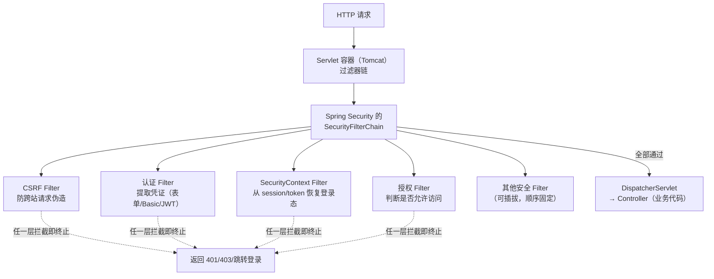
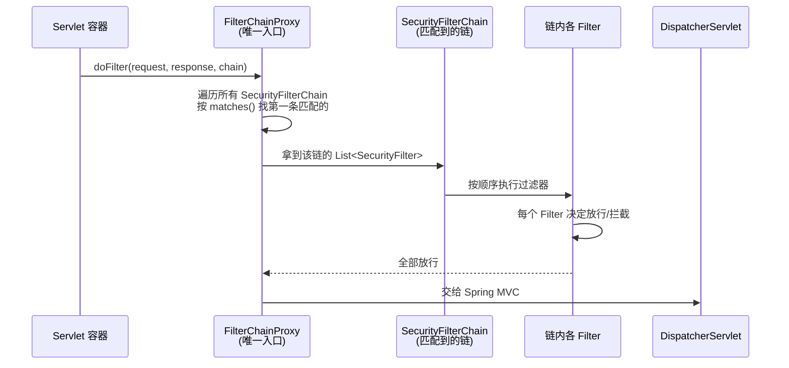

# Spring Security核心架构详解

> 本文是 Spring Security 系列第 1 篇，围绕**它到底怎么工作**展开：SecurityFilterChain、Filter 链、Lambda DSL 配置、架构演进（5→6→7）。
> 前置知识：[00-安全框架选型总览·Spring Security & Apache Shiro](00-安全框架选型总览·Spring Security & Apache Shiro.md)
> 关联笔记：[02-Spring Security认证机制详解](02-Spring Security认证机制详解.md)、[03-Spring Security授权与安全防护详解](03-Spring Security授权与安全防护详解.md)

## 版本基线

本文基于 **Spring Security 6.x / 7.x**（Spring Boot 3.x 默认 6.x，Spring Boot 4.x 默认 7.x）。
若用旧版 Spring Security 5，部分配置（如 lambda DSL）语义相同，但 **WebSecurityConfigurerAdapter 已废弃**。

**7.0 关键变化（2025-11-17 GA，查证于 2026-08）**：
- **硬移除 `.and()` 链式风格**——旧式 `http.xxx().and().yyy()` 无运行时回退，必须改为 Lambda DSL
- `SimpleGrantedAuthority` 构造参数 `role` → `authority` 改名
- `GrantedAuthority.getAuthority()` 标 JSpecify `@Nullable`
- 7.1 新增 `InetAddressMatcher` 等

## 受众声明

面向已掌握 **Servlet Filter**、**Spring Boot 自动配置** 的 Java 后端开发者。假设已懂：Filter 链式调用、@Configuration + @Bean、HTTP 请求生命周期。以下术语必须讲清：FilterChain、SecurityContext、认证过滤器、授权（授权需要先讲清"它跟认证的区别"）。

## 学习目标

学完本文你能：
1. 说清 Spring Security 的**核心架构**：一个 HTTP 请求进来后经过哪些组件
2. 理解 **SecurityFilterChain** 如何取代旧的 WebSecurityConfigurerAdapter，并能用 Lambda DSL 配置
3. 明白 Filter 链的**顺序**、每个核心 Filter 的职责（认证/授权/CSRF 等）
4. 说清架构演进 5→6→7 的**关键变化**（为什么换 Lambda DSL、默认行为变化）
5. 能自己配置一个最小可用的 SecurityFilterChain，并解释每个配置项的作用
6. 理解**多链机制**：一个应用为什么可以有多条 SecurityFilterChain、如何匹配

## 前置知识

- [00-安全框架选型总览·Spring Security & Apache Shiro](00-安全框架选型总览·Spring Security & Apache Shiro.md)——选型认知
- 需掌握 **Servlet Filter 机制**（过滤器链、doFilter 调用链）
- 需掌握 Spring Boot 自动配置 + @Configuration/@Bean

---

## 📋 总纲

1. 是什么：Spring Security 架构核心
2. 核心 API 逐个解释
3. 请求如何穿过 Filter 链（源码级）
4. 核心 Filter 顺序与职责
5. 多 FilterChain 与 order 机制
6. Lambda DSL 配置实战
7. 架构演进：5 → 6 → 7
8. 最佳实践
9. 常见踩坑
10. 小结
11. 下一篇

---

## 1. 是什么：Spring Security 架构核心

**一句话记忆**：Spring Security 的核心是一个**Servlet Filter 链**，请求进来逐层过滤，每层做一件安全事（认证、授权、CSRF 防护……），任何一层拦截都能终止请求。

**为什么用 Filter 而不是拦截器/切面**：
- Servlet Filter 是 Servlet 规范原生机制，**在 DispatcherServlet 之前执行**——请求还没进 Spring MVC 就被安全处理
- Filter 是**容器级**的，对请求生命周期覆盖最全（连静态资源、错误页都能覆盖）
- 拦截器（Interceptor）和 AOP 都依赖 Spring 容器，此时请求可能已经进入了业务层——太晚了



> 此图说明：安全过滤发生在 Spring MVC 之前。请求先经过容器过滤器链，其中 SecurityFilterChain 是一串安全 Filter；任何一层认为不安全就终止请求；全部通过才进入业务层。

### 1.1 核心组件表

| 组件 | 职责 | 记忆锚点 |
|---|---|---|
| **SecurityFilterChain** | 一条安全过滤链，匹配某类 URL，返回匹配的 Filter 集合 | "安检通道" |
| **SecurityFilter** | 链中的每个过滤器，各司其职（认证/授权/CSRF…） | "安检员" |
| **SecurityContextHolder** | 存放当前线程的安全上下文（Authentication） | "当前乘客的通行证夹" |
| **SecurityContext** | 安全上下文对象，持有 Authentication | "通行证" |
| **Authentication** | 认证信息（是否登录、是谁、有什么权限） | "通行证内容" |
| **AuthenticationManager** | 认证总入口（验证凭证 → 返回 Authentication） | "验证处" |
| **AuthorizationManager** | 授权总入口（判断当前访问是否允许） | "门禁系统" |

> 💡 **记忆锚点**：整个 Spring Security = **"过滤器链上挂安全能力"**。它不拦截业务，而是在业务前**插入一道安全过滤**。

---

## 2. 核心 API 逐个解释

### 2.1 SecurityFilterChain 接口

**是什么**：定义一条安全过滤链的抽象。一个应用可以有**多条**链，每条匹配不同的 URL 模式。

**源码（Spring Security 6.x）**：

```java
public interface SecurityFilterChain {

    // 判断这条链是否匹配当前请求（按 URL/路径/请求方式等）
    boolean matches(HttpServletRequest request);

    // 返回这条链上的所有过滤器（按顺序执行）
    List<SecurityFilter> getFilters();

    // 7.x 新增：判断是否还允许其他链继续匹配（默认 true）
    default boolean isAllowRequestMatcher() { return true; }
}
```

| 方法 | 说明 | 边界行为 |
|---|---|---|
| `matches(request)` | 判断该链是否匹配当前请求 | 按 requestMatchers 匹配；**第一条匹配的链生效** |
| `getFilters()` | 返回匹配链上的所有过滤器 | 顺序就是执行顺序，不可变 |
| `isAllowRequestMatcher()` | 是否允许后续链继续匹配（7.x） | 默认 true；设为 false 则匹配后不再尝试其他链 |

**配置一个链（Lambda DSL 风格，官方推荐）**：

```java
@Configuration
@EnableWebSecurity
public class SecurityConfig {

    @Bean
    SecurityFilterChain filterChain(HttpSecurity http) throws Exception {
        http
            .csrf(csrf -> csrf.disable())                    // 1. 关闭 CSRF（无状态 API 场景）
            .authorizeHttpRequests(auth -> auth
                .requestMatchers("/public/**").permitAll()   // 2. 公开路径放行
                .requestMatchers("/admin/**").hasRole("ADMIN") // 3. 需要 ADMIN 角色
                .anyRequest().authenticated()                // 4. 其余需登录
            )
            .formLogin(Customizer.withDefaults())            // 5. 表单登录
            .httpBasic(Customizer.withDefaults());           // 6. HTTP Basic
        return http.build();                                 // 7. 构建链
    }
}
```

**逐行语义**：
- `@EnableWebSecurity`：开启 Web 安全支持，注册 SecurityFilterChain Bean
- `http.authorizeHttpRequests(...)`：配置 **授权规则**（谁可以访问哪些 URL）
- `http.csrf(...)`：配置 CSRF 防护
- `http.build()`：构建不可变的 SecurityFilterChain 实例

> ⚠️ **边界行为**：一个应用可以有**多条** SecurityFilterChain，按 `matches()` 匹配，**第一条匹配的生效**。适合"`/api/**` 无状态 JWT + `/web/**` 表单登录"这种混合场景（详见 §5）。

### 2.2 SecurityContextHolder 与 SecurityContext

**是什么**：`SecurityContextHolder` 是安全上下文的**静态存储**，默认基于 `ThreadLocal`——每个线程持有自己的 `SecurityContext`。

**为什么用 ThreadLocal**：一次 HTTP 请求在 Tomcat 中由一个线程处理，认证信息只需在线程内可见；ThreadLocal 让**业务代码任意深度都能拿到当前登录用户**，无需层层传参。

```java
// 业务代码里随时随地拿当前用户（核心 API）
Authentication auth = SecurityContextHolder.getContext().getAuthentication();

String username = auth.getName();                    // 用户名
Object principal = auth.getPrincipal();              // UserDetails 或 User
Collection<? extends GrantedAuthority> authorities = auth.getAuthorities(); // 权限
boolean isAuthed = auth.isAuthenticated();           // 是否已认证
```

| 方法 | 说明 | 易错点 |
|---|---|---|
| `getContext()` | 获取当前线程的安全上下文 | 可能为 null（未认证请求） |
| `getContext().setAuthentication(auth)` | 设置认证信息（JWT Filter 里常用） | 认证成功后要清空凭证 |
| `getContextHolderStrategy()` | 获取存储策略（7.x 可配置） | 默认 ThreadLocal |

**存储策略（7.x 可配置）**：

| 策略 | 说明 | 适用场景 |
|---|---|---|
| `MODE_THREADLOCAL` | 默认，每个线程独立上下文 | 绝大多数应用 |
| `MODE_INHERITABLETHREADLOCAL` | 子线程继承父线程上下文 | 异步线程需要登录态 |
| `MODE_GLOBAL` | 全局单例上下文 | 极少用，多线程会互相覆盖 |

> 💡 **异步坑**：`@Async` 新线程**不继承** ThreadLocal 上下文——异步方法里 `SecurityContextHolder.getContext()` 是空的。解决方案：`SecurityContextDelegatingExecutor` 包装线程池，或把必要信息（userId）作为参数传递。

### 2.3 Authentication 接口

**是什么**：表达"认证状态"的对象，贯穿整个安全流程。

```java
public interface Authentication extends Principal, Serializable {
    Collection<? extends GrantedAuthority> getAuthorities();  // 权限集合
    Object getCredentials();                                   // 凭证（密码/token）
    Object getDetails();                                       // 请求细节（IP、sessionId）
    Object getPrincipal();                                     // 身份主体（通常是 UserDetails）
    boolean isAuthenticated();                                 // 是否已认证
    void setAuthenticated(boolean isAuthenticated);
    default String getName() { ... }                           // Principal 名称
}
```

| 方法 | 说明 | 边界行为 |
|---|---|---|
| `getAuthorities()` | 权限集合（ROLE_ADMIN 等） | 认证后才有值 |
| `getCredentials()` | 凭证（密码/token） | **认证成功后通常被 `eraseCredentials()` 清空** |
| `getPrincipal()` | 身份主体 | 通常是 UserDetails 实现 |
| `isAuthenticated()` | 是否已认证 | 未认证的 Authentication 是"待验证状态" |

---

## 3. 请求如何穿过 Filter 链（源码级）

### 3.1 FilterChainProxy：真正的大门

**是什么**：Spring Security 注册到 Servlet 容器的**唯一入口 Filter** 是 `FilterChainProxy`（`springSecurityFilterChain` Bean）。它内部持有**多条 SecurityFilterChain**，是"门面"。

**为什么需要它**：
- 容器只认一个 Filter 名（`springSecurityFilterChain`），但安全功能需要几十个 Filter
- FilterChainProxy 充当**调度器**：按 URL 匹配到正确的 SecurityFilterChain，再按链内顺序执行 Filter



> 此图说明：FilterChainProxy 是唯一入口，它先匹配链，再驱动链内 Filter 顺序执行，全部放行后才到 DispatcherServlet。

### 3.2 虚拟过滤器链 VirtualFilterChain

**是什么**：Spring Security 用 `VirtualFilterChain`（内部类）在**内存里模拟 Servlet 的过滤器链调用**，不依赖容器。

**源码（简化）**：

```java
// FilterChainProxy 内部
private static final class VirtualFilterChain implements FilterChain {
    private final List<Filter> remainingFilters;  // 剩余过滤器
    private int currentPosition = 0;              // 当前位置

    @Override
    public void doFilter(ServletRequest request, ServletResponse response) {
        if (currentPosition == remainingFilters.size()) {
            // 所有安全 Filter 已执行完，交给原始容器链（最终到 DispatcherServlet）
            originalChain.doFilter(request, response);
        } else {
            currentPosition++;
            Filter nextFilter = remainingFilters.get(currentPosition - 1);
            nextFilter.doFilter(request, response, this);  // 递归调用下一个
        }
    }
}
```

**关键点**：
- `currentPosition` 递增，保证每个 Filter **只执行一次**
- 最后一个 Filter 执行完，把请求交回**原始容器链** → DispatcherServlet
- 任何 Filter **不调用** `chain.doFilter()` 就返回 → 请求在此终止（拦截成功）

### 3.3 一个 Filter 的典型写法

```java
public class MySecurityFilter extends OncePerRequestFilter {

    @Override
    protected void doFilterInternal(HttpServletRequest request,
                                    HttpServletResponse response,
                                    FilterChain chain) throws ServletException, IOException {
        // 前置逻辑（放行前做）
        if (shouldBlock(request)) {
            response.sendError(403);
            return;                    // 不调用 chain.doFilter = 拦截
        }
        chain.doFilter(request, response);   // 放行
        // 后置逻辑（响应返回后做，较少用）
    }
}
```

> 💡 **为什么继承 OncePerRequestFilter**：Servlet 规范里 Filter 可能被容器调用多次（如 forward/include），`OncePerRequestFilter` 保证一个请求只执行一次，避免重复认证。

---

## 4. 核心 Filter 顺序与职责

Spring Security 的 SecurityFilterChain 有一组**预置过滤器**，顺序固定。理解它们的顺序，才能理解"为什么认证在授权之前"。

**官方顺序（Spring Security 6.x，从文档/源码 Order 常量）**：

| 顺序 | 过滤器 | 职责 | 常配配置 |
|---|---|---|---|
| 1 | `DisableEncodeUrlFilter` | 禁用 URL 重写（防 session ID 泄露到 URL） | 默认 |
| 2 | `WebAsyncManagerIntegrationFilter` | 把 SecurityContext 桥接到 WebAsyncManager | 默认 |
| 3 | `SecurityContextHolderFilter` | 从 session/token **恢复** Authentication 到当前线程 | 默认 |
| 4 | `HeaderWriterFilter` | 写安全响应头（X-Frame-Options 等） | 默认 |
| 5 | `CsrfFilter` | 校验 CSRF Token，防跨站请求伪造 | `csrf()` |
| 6 | `LogoutFilter` | 处理登出 | `logout()` |
| 7 | `UsernamePasswordAuthenticationFilter` | 表单登录：提取用户名密码 → 认证 | `formLogin()` |
| 8 | `DefaultLoginPageGeneratingFilter` | 生成默认登录页 | formLogin 默认 |
| 9 | `BasicAuthenticationFilter` | HTTP Basic 认证 | `httpBasic()` |
| 10 | `RequestCacheAwareFilter` | 恢复被中断请求（登录后跳回原页） | 默认 |
| 11 | `SecurityContextHolderAwareRequestFilter` | 包装 request，提供 isUserInRole 等 | 默认 |
| 12 | `AnonymousAuthenticationFilter` | 未登录给一个匿名 Authentication | 默认 |
| 13 | `SessionManagementFilter` | 会话管理（防固定攻击、并发控制） | `sessionManagement()` |
| 14 | `ExceptionTranslationFilter` | 捕获认证/授权异常，转换响应（跳登录/403） | 默认 |
| 15 | `AuthorizationFilter` | 授权：判断当前请求是否允许 | `authorizeHttpRequests()` |
| 16 | `FilterSecurityInterceptor` | （6.0 之前）旧版最后的安全拦截器 | 已并入 AuthorizationFilter |

> 💡 **记忆锚点**：**"先认证后授权"**——过滤链里认证过滤器（7-12）在授权过滤器（15）之前。请求先确认"你是谁"，再判断"你能访问吗"。

> ⚠️ **易错点**：**异常转换器**（ExceptionTranslationFilter，14）在授权过滤器（15）**之前**——因为它要捕获授权过滤器抛出的异常并转换成跳转/401/403。所以顺序是"授权过滤器抛异常 → 被前面的异常转换器接住"。

### 4.1 匿名过滤器：未登录≠没有身份

**是什么**：`AnonymousAuthenticationFilter` 给未登录请求一个**匿名 Authentication**（principal = "anonymousUser"，权限 = ROLE_ANONYMOUS）。

**为什么重要**：
- 授权规则可以区分"未登录"和"已登录"（`isAnonymous()` / `isAuthenticated()`）
- 避免处处判空（Authentication 永远存在）

| 场景 | isAnonymous() | isAuthenticated() |
|---|---|---|
| 未登录请求 | true | false |
| 已登录请求 | false | true |
| rememberMe 恢复 | false | false（isRemembered() 为 true） |

---

## 5. 多 FilterChain 与 order 机制

**是什么**：一个应用可以注册**多条** SecurityFilterChain Bean，每条匹配不同 URL 模式，实现"混合安全策略"。

**典型场景**：`/api/**` 用无状态 JWT（关 CSRF、无 session）+ `/web/**` 用表单登录（开 CSRF、有 session）。

```java
@Configuration
@EnableWebSecurity
public class MultiChainConfig {

    // 链 1：/api/** 无状态 JWT（必须 @Order 或靠匹配顺序）
    @Bean
    @Order(1)   // 数字小的优先匹配
    SecurityFilterChain apiChain(HttpSecurity http) throws Exception {
        http
            .securityMatcher("/api/**")                  // 只匹配 /api/**
            .csrf(csrf -> csrf.disable())
            .sessionManagement(sm -> sm.sessionCreationPolicy(SessionCreationPolicy.STATELESS))
            .authorizeHttpRequests(auth -> auth.anyRequest().authenticated());
        return http.build();
    }

    // 链 2：/web/** 表单登录（兜底链，无 securityMatcher = 匹配所有）
    @Bean
    SecurityFilterChain webChain(HttpSecurity http) throws Exception {
        http
            .securityMatcher("/web/**")
            .formLogin(Customizer.withDefaults())
            .authorizeHttpRequests(auth -> auth.anyRequest().authenticated());
        return http.build();
    }
}
```

**匹配规则**：
1. FilterChainProxy 按 Bean 顺序（@Order 或声明顺序）遍历所有链
2. **第一条 `matches()` 返回 true 的链生效**，后面的链不再尝试
3. 兜底链：不写 securityMatcher 的链匹配所有请求，放**最后**

| 场景 | 做法 |
|---|---|
| 只有一条链 | 不写 @Order，一个 SecurityFilterChain Bean 即可 |
| 多条链分区 | 每条写 `securityMatcher(...)` + `@Order(n)` |
| 兜底链 | 最后一条不写 securityMatcher |

> ⚠️ **易错点**：链的顺序错了会导致"请求进了错误的链"。规则：**具体匹配在前，兜底在后**；`@Order` 数字小优先。

---

## 6. Lambda DSL 配置实战

### 6.1 Lambda DSL vs 旧链式配置

| 版本 | 配置风格 | 说明 |
|---|---|---|
| Spring Security 5.2+ | **Lambda DSL**（官方推荐） | `http.authorizeHttpRequests(auth -> auth...` |
| 旧版（5.x 早期） | 链式 and() | `http.authorizeRequests().antMatchers(...).permitAll().and()...` |
| 更旧（5.x 之前） | WebSecurityConfigurerAdapter 继承 | 已废弃 |

**为什么推荐 Lambda DSL**（官方明确）：
- 更简洁、更易读（少很多 `.and()`）
- 每个配置项独立 lambda，**顺序更清晰**
- 避免链式配置里 `and()` 容易放错位置的问题
- **7.0 起 `.and()` 链式被硬移除**——必须用 Lambda DSL

```java
// ❌ 旧链式（7.0 起直接编译错误）
http.authorizeRequests().antMatchers("/admin/**").hasRole("ADMIN").and().formLogin().and().csrf().disable();

// ✅ Lambda DSL（清晰，7.x 唯一方式）
http
    .authorizeHttpRequests(auth -> auth.requestMatchers("/admin/**").hasRole("ADMIN"))
    .formLogin(Customizer.withDefaults())
    .csrf(csrf -> csrf.disable());
```

### 6.2 完整可运行的最小配置（Spring Boot 3.x / Security 6.x）

```java
// 依赖：spring-boot-starter-security（Spring Boot 3.x 自动带 Security 6.x）
@Configuration
@EnableWebSecurity
public class MinimalSecurityConfig {

    @Bean
    SecurityFilterChain filterChain(HttpSecurity http) throws Exception {
        http
            .authorizeHttpRequests(auth -> auth
                .requestMatchers("/", "/home", "/public/**").permitAll()
                .requestMatchers("/admin/**").hasRole("ADMIN")
                .anyRequest().authenticated()
            )
            .formLogin(form -> form
                .loginPage("/login")
                .defaultSuccessUrl("/home")
                .failureUrl("/login?error"))
            .logout(logout -> logout.logoutSuccessUrl("/home"));
        return http.build();
    }

    // 内存用户（演示用；生产用 UserDetailsService 从数据库加载）
    @Bean
    UserDetailsService userDetailsService() {
        UserDetails admin = User.withUsername("admin")
            .password("{noop}admin123")   // {noop} = 明文，仅演示！生产用 BCrypt
            .roles("ADMIN")
            .build();
        return new InMemoryUserDetailsManager(admin);
    }
}
```

> ⚠️ **未实测标注**：上述配置为基于官方文档的标准写法（✅ 语法符合 Security 6.x），本机未起 Spring Boot 项目实测——演示配置，生产请配 BCrypt 密码编码器（见系列第 2 篇）。

### 6.3 配置项速查表

| 配置方法 | 作用 | 常用子项 |
|---|---|---|
| `authorizeHttpRequests` | URL 授权规则 | permitAll/authenticated/hasRole/hasAuthority |
| `csrf` | CSRF 防护 | disable() 或自定义 TokenRepository |
| `formLogin` | 表单登录 | loginPage/defaultSuccessUrl/failureUrl |
| `httpBasic` | HTTP Basic 认证 | realmName |
| `logout` | 登出 | logoutUrl/logoutSuccessUrl/deleteCookies |
| `sessionManagement` | 会话管理 | sessionCreationPolicy/maximumSessions |
| `rememberMe` | 记住我 | key/tokenValiditySeconds |
| `securityMatcher` | 本链匹配的 URL | 多链场景必用 |
| `exceptionHandling` | 异常处理 | authenticationEntryPoint/accessDeniedHandler |
| `oauth2Login` / `oauth2ResourceServer` | OAuth2 登录 / 资源服务器 | 见系列第 2 篇 JWT |

---

## 7. 架构演进：5 → 6 → 7

这是面试常考、也是理解"为什么现在这么写"的关键。

| 变化点 | Spring Security 5 | Spring Security 6 | Spring Security 7 |
|---|---|---|---|
| **配置方式** | WebSecurityConfigurerAdapter 继承 | SecurityFilterChain @Bean | 同 6，Lambda DSL |
| **授权配置** | antMatchers() | **requestMatchers()** | requestMatchers() |
| **链式 API** | and() 链式 | 推荐 Lambda | **硬移除 and()** |
| **默认 CSRF** | 同 | 保留（表单/API 默认开启） | 同 |
| **密码编码** | 默认 Plain（旧） | **DelegatingPasswordEncoder（BCrypt 默认）** | 同 |
| **OAuth2** | 基础 | 完善 OAuth2/OIDC | 更完善（授权服务器简化配置） |
| **废弃项** | WebSecurityConfigurerAdapter | 移除 antMatchers | SimpleGrantedAuthority 参数改名 |

> 🔍 **关键变化**（迁移重点）：
> - **antMatchers → requestMatchers**：Spring Security 6 起 `antMatchers()` 移除，改用 `requestMatchers()`（基于 MvcRequestMatcher/AntPathRequestMatcher）
> - **WebSecurityConfigurerAdapter 废弃**：改用 `@Bean SecurityFilterChain` + Lambda DSL
> - **默认密码编码**：5.0 起默认 DelegatingPasswordEncoder，不再明文存储
> - **7.0 硬移除 and()**：旧链式配置直接编译失败，必须迁移到 Lambda DSL

---

## 8. 最佳实践

1. **永远用 Lambda DSL**：7.0 起唯一选择，5.2+/6.x 也推荐
2. **明确放行顺序**：最具体的规则放最前，`anyRequest()` 放最后兜底
3. **无状态 API 关闭 CSRF + session**：JWT 场景 `csrf.disable()` + `STATELESS`
4. **多链分区**：API 与页面混合时按 `securityMatcher` 分区，@Order 显式排序
5. **生产密码用 BCrypt**：绝不用 `{noop}` 明文（仅演示）
6. **敏感操作校验 isAuthenticated 而非 isAnonymous**：匿名也有 Authentication 对象

---

## 9. 常见踩坑

- **未定义 SecurityFilterChain Bean** → Spring Boot 会给一个"全部需要认证 + 生成随机密码"的默认安全配置，导致所有接口 401。**加一个自定义 SecurityFilterChain 即可解决**。
- **antMatchers 报错** → Spring Security 6 已移除 antMatchers，改用 `requestMatchers()`。
- **继承 WebSecurityConfigurerAdapter 报错** → 该方法已废弃，改用 `@Bean SecurityFilterChain`。
- **`.and()` 链式编译错误（7.0）** → 硬移除，改为 Lambda DSL。
- **多条 FilterChain 顺序错乱** → 第一条匹配的生效，注意配置 `order()` 或用更具体的 requestMatchers 区分。
- **CSRF 误伤无状态 API** → 无状态 JWT 场景应显式 `csrf.disable()`，否则 POST/PUT 会被 403。
- **异步线程拿不到登录用户** → ThreadLocal 不跨线程，用 SecurityContextDelegatingExecutor 或传参。

---

## 10. 面试追问 Q&A

### 10.1 Spring Security 为什么用 Filter 而不是 Spring MVC 拦截器？

因为 Filter 在 Servlet 容器层、**DispatcherServlet 之前**执行——请求还没进 Spring MVC 就能被拦截，覆盖静态资源/错误页等全场景。拦截器和 AOP 依赖 Spring 容器，此时请求可能已进入业务层，为时已晚。

### 10.2 FilterChainProxy 的作用是什么？

它是注册到容器的**唯一入口 Filter**，内部持有多条 SecurityFilterChain。请求进来先按 matches() 找到第一条匹配的链，再用 VirtualFilterChain 按顺序驱动链内 Filter；全部放行后才交给 DispatcherServlet。

### 10.3 SecurityContextHolder 为什么用 ThreadLocal？有什么坑？

ThreadLocal 让认证信息在线程内全局可见，业务代码任意深度都能拿当前用户，无需传参。坑：异步线程（@Async、线程池）不继承 ThreadLocal，新线程里 SecurityContext 为空——需用 SecurityContextDelegatingExecutor 包装或显式传参。

### 10.4 为什么异常转换器在授权过滤器之前？

ExceptionTranslationFilter 要捕获授权过滤器（AuthorizationFilter）抛出的 AccessDeniedException，转换成 401/403 或跳转登录页。所以它必须在授权过滤器之前——授权抛异常时被"前面的"异常转换器接住。如果顺序反了，异常会一路冒到容器层，变成 500 而非优雅的 401/403。

---

## 11. 小结

- Spring Security 的本质是一条 **SecurityFilterChain（Servlet 过滤器链）**，逐层过滤做安全事。
- 入口是 **FilterChainProxy**（唯一容器 Filter），内部按 matches() 匹配多条链，VirtualFilterChain 驱动链内 Filter。
- 配置核心是 **Lambda DSL**：`authorizeHttpRequests`（授权）+ `csrf`/`formLogin` 等，`build()` 构建链。
- 架构演进 **5→6→7**：antMatchers→requestMatchers、WebSecurityConfigurerAdapter→@Bean FilterChain、默认 DelegatingPasswordEncoder、**7.0 硬移除 and()**。
- Filter 链 **"先认证后授权"**，异常转换器在授权之前接异常。
- 多链场景：**第一条匹配生效**，用于混合认证（API JWT + 页面表单）。

## 下一篇

[02-Spring Security认证机制详解](02-Spring Security认证机制详解.md)——深入认证：AuthenticationManager、UserDetailsService、PasswordEncoder、JWT。
