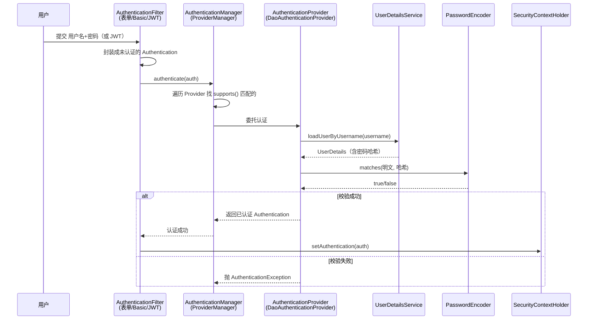

# Spring Security认证机制详解

> 本文是 Spring Security 系列第 2 篇，深入**认证（Authentication）**：AuthenticationManager、AuthenticationProvider、UserDetailsService、PasswordEncoder、JWT 无状态认证。
> 前置知识：[01-Spring Security核心架构详解](01-Spring Security核心架构详解.md)
> 关联笔记：[03-Spring Security授权与安全防护详解](03-Spring Security授权与安全防护详解.md)、**01-JWT详解**（见知识库）（JWT 协议原理）、**04-Session与Token机制详解**（见知识库）（会话基础）

## 版本基线

基于 **Spring Security 6.x / 7.x**（Spring Boot 3.x 默认 6.x）。JWT 认证用 `spring-security-oauth2-resource-server` 或自定义 BearerTokenAuthenticationFilter。

## 受众声明

面向已掌握 [01-Spring Security核心架构详解](01-Spring Security核心架构详解.md)（Filter 链）的读者。假设已懂：@Bean、依赖注入、HTTP 请求。以下术语必须讲清：Authentication（认证对象）、Principal（身份）、Credentials（凭证）、ProviderManager、DAO 认证。

## 学习目标

学完本文你能：
1. 说清 Spring Security **认证的完整链路**：凭证 → AuthenticationManager → Provider → UserDetailsService → 认证对象
2. 区分 **AuthenticationManager / AuthenticationProvider / UserDetailsService** 三者职责
3. 掌握 **PasswordEncoder** 的正确用法（为什么用 DelegatingPasswordEncoder、BCrypt）
4. 实现一个 **JWT 无状态认证**（前后端分离场景）
5. 说出常见的**认证安全坑**（明文密码、固定会话、令牌泄露）
6. 读懂 ProviderManager 源码，理解多 Provider 的调度逻辑

## 前置知识

- [01-Spring Security核心架构详解](01-Spring Security核心架构详解.md)——Filter 链、SecurityFilterChain
- 需掌握 Servlet session / Cookie 基本概念
- 需掌握 Spring Bean 注入

---

## 📋 总纲

1. 是什么：认证的核心对象与流程
2. 认证链路源码级走读
3. 核心 API 逐个解释
4. PasswordEncoder 密码加密（重点）
5. 表单登录与 HTTP Basic
6. JWT 无状态认证（前后端分离，重点实战）
7. 最佳实践
8. 常见踩坑
9. 面试追问 Q&A
10. 小结
11. 下一篇

---

## 1. 是什么：认证的核心对象与流程

**一句话记忆**：认证 = "验证凭证 → 确认身份 → 生成认证对象放进安全上下文"。Spring Security 用 **Authentication** 对象表达"登录态"。

**为什么需要这一整套对象**：认证不是"查一下密码对不对"这么简单——它涉及**凭证来源**（表单/Header/Basic）、**用户来源**（DB/LDAP/内存）、**密码算法**（BCrypt/Argon2）三个可变维度。Spring Security 把每个维度抽象成独立对象，可以任意组合。

### 1.1 认证总流程



> 此图说明：认证是一条**委托链**——Filter 只负责提取凭证，真正干活的是 Manager → Provider → UserDetailsService + PasswordEncoder 四层分工。

---

## 2. 认证链路源码级走读

### 2.1 ProviderManager：认证总调度（源码走读）

**是什么**：`AuthenticationManager` 的默认实现。维护一个 `List<AuthenticationProvider>`，**逐个尝试**直到某个 Provider 能处理。

**源码（Spring Security 6.x，关键部分）**：

```java
public class ProviderManager implements AuthenticationManager {

    private List<AuthenticationProvider> providers;   // 多个 Provider，按顺序尝试
    private AuthenticationManager parent;              // 父 Manager（兜底）

    public Authentication authenticate(Authentication authentication) {
        Class<? extends Authentication> toTest = authentication.getClass();
        Authentication result = null;
        Authentication parentResult = null;
        Exception lastException = null;

        // 遍历所有 Provider
        for (AuthenticationProvider provider : getProviders()) {
            // 关键：只有 supports() 匹配的 Provider 才会被调用
            if (!provider.supports(toTest)) {
                continue;
            }
            try {
                result = provider.authenticate(authentication);
                if (result != null) {
                    copyDetails(authentication, result);   // 复制请求细节
                    break;                                  // 成功即停止
                }
            } catch (AuthenticationException ex) {
                lastException = ex;   // 记录异常，继续尝试下一个
            }
        }

        // 所有 Provider 都失败 → 尝试 parent
        if (result == null && parent != null) {
            parentResult = parent.authenticate(authentication);
            result = parentResult;
        }

        if (result != null) { ... return result; }

        // 全部失败：抛出最后一个异常（或 ProviderNotFoundException）
        if (lastException == null) {
            lastException = new ProviderNotFoundException(...);
        }
        throw lastException;
    }
}
```

**逐段语义**：
- `provider.supports(toTest)`：**类型过滤**——每个 Provider 声明自己处理哪种 Authentication（如 DaoAuthenticationProvider 处理 UsernamePasswordAuthenticationToken）
- 成功（result != null）即 `break`：**第一个成功的 Provider 决定结果**
- 失败（抛异常）不中断：**记录异常继续尝试下一个**
- 全部失败 → 抛最后一个异常，或抛 `ProviderNotFoundException`（没有任何 Provider 支持）

> 💡 **记忆锚点**：ProviderManager 是"面试官逐个问"——先看谁擅长这类题（supports），会做的就做，做错记下来换下一个；全都不行才抛异常。

### 2.2 DaoAuthenticationProvider：具体认证逻辑

**是什么**：最常用的 Provider，基于 `UserDetailsService` 从数据库加载用户并校验密码。

**认证时做了什么（源码语义）**：

```java
public class DaoAuthenticationProvider extends AbstractUserDetailsAuthenticationProvider {

    private UserDetailsService userDetailsService;   // 数据源
    private PasswordEncoder passwordEncoder;          // 密码编码器（BCrypt）

    @Override
    protected UserDetails retrieveUser(String username, UsernamePasswordAuthenticationToken auth) {
        // 1. 调用 UserDetailsService 加载用户
        UserDetails loadedUser = this.userDetailsService.loadUserByUsername(username);
        return loadedUser;
    }

    @Override
    protected void additionalAuthenticationChecks(UserDetails userDetails,
            UsernamePasswordAuthenticationToken authentication) {
        // 2. 用 PasswordEncoder 校验密码（关键！）
        String presentedPassword = authentication.getCredentials().toString();
        if (!this.passwordEncoder.matches(presentedPassword, userDetails.getPassword())) {
            throw new BadCredentialsException("Bad credentials");
        }
    }
}
```

**关键点**：
- **密码比较发生在 Provider，不在 UserDetailsService**——UserDetailsService 只负责"取用户"，密码校验统一走 PasswordEncoder
- `matches(明文, 哈希)` 是**恒时比较**（防时序攻击）
- 用户不存在（loadUserByUsername 抛 UsernameNotFoundException）→ 包装成 BadCredentialsException（**不暴露"用户不存在"**，防用户名枚举）

---

## 3. 核心 API 逐个解释

### 3.1 Authentication 接口

表达"认证状态"，核心方法：

| 方法 | 说明 |
|---|---|
| `getName()` | 返回 Principal 名称（如用户名） |
| `getCredentials()` | 返回凭证（密码/token），认证后通常清空 |
| `getAuthorities()` | 返回权限集合（GrantedAuthority） |
| `isAuthenticated()` | 是否已认证 |
| `getPrincipal()` | 返回身份主体（通常是 UserDetails） |

> ⚠️ **边界行为**：**认证成功后**，Credentials（密码）会被 `eraseCredentials()` 清空，防止泄露。所以认证后别想再从 Authentication 拿密码。

### 3.2 AuthenticationManager

**认证总入口**，核心方法 `Authentication authenticate(Authentication authentication)`：
- 输入未认证的 Authentication → 返回已认证的 Authentication
- 认证失败抛 `AuthenticationException`
- 默认实现是 **ProviderManager**，它维护一个 `List<AuthenticationProvider>`，**逐个尝试**，直到某个 Provider 能处理

### 3.3 AuthenticationProvider

**具体认证逻辑**，接口方法：

| 方法 | 说明 |
|---|---|
| `Authentication authenticate(Authentication a)` | 具体认证（校验凭证） |
| `boolean supports(Class<?> authentication)` | 该 Provider 是否能处理这种 Authentication 类型 |

**常用实现**：`DaoAuthenticationProvider`（基于 UserDetailsService 从数据库取用户校验）。

| Provider | 处理类型 | 用途 |
|---|---|---|
| DaoAuthenticationProvider | UsernamePasswordAuthenticationToken | 表单/用户名密码 |
| JwtAuthenticationProvider | JwtAuthenticationToken | JWT 资源服务器 |
| OAuth2LoginAuthenticationProvider | OAuth2LoginAuthenticationToken | OAuth2 登录 |
| AnonymousAuthenticationProvider | AnonymousAuthenticationToken | 匿名用户 |
| RememberMeAuthenticationProvider | RememberMeAuthenticationToken | 记住我 |

### 3.4 UserDetailsService

**去哪加载用户**，接口方法：

```java
UserDetails loadUserByUsername(String username) throws UsernameNotFoundException;
```

**自定义实现**（从数据库查用户）：

```java
@Service
public class UserDetailsServiceImpl implements UserDetailsService {
    private final UserRepository userRepository;
    // 构造器注入...

    @Override
    public UserDetails loadUserByUsername(String username) throws UsernameNotFoundException {
        User user = userRepository.findByUsername(username)
            .orElseThrow(() -> new UsernameNotFoundException("用户不存在"));
        return org.springframework.security.core.userdetails.User
            .withUsername(user.getUsername())
            .password(user.getPassword())        // 注意：存的是哈希值，不是明文
            .roles(user.getRole())               // 角色列表
            .build();
    }
}
```

> 💡 **关键点**：**UserDetailsService 返回的 UserDetails 里的 password 是"数据库里存的哈希值"**，真正的密码校验由 DaoAuthenticationProvider + PasswordEncoder 完成，不是在这里比明文。

### 3.5 UserDetails 接口

**是什么**：用户详情的抽象，UserDetailsService 返回它，Security 内部到处用它表达"当前用户"。

```java
public interface UserDetails extends Serializable {
    Collection<? extends GrantedAuthority> getAuthorities();  // 权限
    String getPassword();    // 密码哈希
    String getUsername();    // 用户名
    boolean isAccountNonExpired();     // 账户未过期
    boolean isAccountNonLocked();      // 未锁定
    boolean isCredentialsNonExpired(); // 凭证未过期
    boolean isEnabled();               // 启用
}
```

**四个布尔方法的意义**：每个对应一种账户状态，返回 false 时认证抛对应异常：

| 方法 | false 时抛的异常 | 业务含义 |
|---|---|---|
| isAccountNonExpired | AccountExpiredException | 账户过期 |
| isAccountNonLocked | LockedException | 账户锁定 |
| isCredentialsNonExpired | CredentialsExpiredException | 密码过期 |
| isEnabled | DisabledException | 账户禁用 |

---

## 4. PasswordEncoder 密码加密（重点）

**为什么必须用哈希而不是明文**：数据库泄露时明文直接暴露；哈希后即使泄露，也难以逆向。

### 4.1 DelegatingPasswordEncoder（默认）

Spring Security 默认用 **DelegatingPasswordEncoder**（默认算法 **BCrypt**），存储格式带前缀标识算法：

```
{bcrypt}$2a$10$dXJ3SW6G7P50lGmMkkmwe.20cQQubK3.HZWzG3YB1tlRy.fqvM/BG
└─算法 └─────── 哈希值（BCrypt，自动带盐）──────────────
```

**DelegatingPasswordEncoder 支持多种算法**（从官方文档确认）：

| 前缀 | 算法 | 说明 |
|---|---|---|
| `{bcrypt}` | BCryptPasswordEncoder | **默认**，强度高、自动加盐 |
| `{pbkdf2}` | Pbkdf2PasswordEncoder | 抗暴力破解 |
| `{scrypt}` | SCryptPasswordEncoder | 内存/CPU 消耗型，抗 ASIC |
| `{argon2}` | Argon2PasswordEncoder | 现代首选，抗 GPU/ASIC |
| `{noop}` | NoOpPasswordEncoder | 明文，**仅测试**，绝不用生产 |
| `{sha256}` | StandardPasswordEncoder | 旧版，不安全 |

**为什么用前缀**：**密码升级**——旧密码是 `{sha256}` 存的，新登录时 DelegatingPasswordEncoder 能自动识别旧算法校验；校验通过后可以顺手升级成 `{bcrypt}`（编码器提供 `upgradeEncoding()` 判断）。

**正确使用**：

```java
@Bean
PasswordEncoder passwordEncoder() {
    return new BCryptPasswordEncoder();  // 简单方式，或
    // return PasswordEncoderFactories.createDelegatingPasswordEncoder(); // Delegating 默认
}

// 注册用户时（加密存储）
String hash = passwordEncoder.encode(rawPassword);  // 存 hash 到数据库

// 登录时（DaoAuthenticationProvider 自动调用）
passwordEncoder.matches(rawPassword, storedHash);   // 返回 boolean
```

> 🔍 **为什么用 BCrypt/Argon2 而不是 MD5/SHA-256**：MD5/SHA 是**快速哈希**，专为速度设计，暴力破解快；BCrypt/Argon2 是**慢哈希**（故意计算慢，且有内置盐），抗暴力破解。**密码哈希永远选慢哈希算法**。

### 4.2 哈希算法对比表

| 算法 | 速度 | 盐 | 抗 GPU/ASIC | 现状 |
|---|---|---|---|---|
| MD5 | 极快 | 需自己加 | ❌ | 不安全，禁用于密码 |
| SHA-256 | 快 | 需自己加 | ❌ | 不安全，禁用于密码 |
| BCrypt | 慢（~100ms） | 内置 | 中 | **默认推荐** |
| SCrypt | 慢 | 内置 | 较强（内存占用） | 推荐 |
| PBKDF2 | 慢 | 内置 | 中 | 推荐（FIPS 合规） |
| Argon2id | 慢 | 内置 | 强 | **现代首选** |

> ⚠️ **版本依赖**：BCrypt 的 `$2a$` 前缀是旧版，`$2b$` 修正了长度 bug；`BCryptPasswordEncoder` 默认 strength=10（约 100ms/次），可调（8-12）。数值随版本变化，以实际测试为准。

---

## 5. 表单登录与 HTTP Basic

### 5.1 表单登录（前后端不分离）

```java
http
    .formLogin(form -> form
        .loginPage("/login")              // 自定义登录页
        .defaultSuccessUrl("/home")       // 登录成功跳转
        .failureUrl("/login?error"))      // 失败跳转
    .httpBasic(Customizer.withDefaults()); // 可选 HTTP Basic
```

- 表单登录提交 `username` + `password` 到 `/login`
- 底层由 **UsernamePasswordAuthenticationFilter** 处理
- 适合**服务端渲染页面**的传统 Web 应用

**UsernamePasswordAuthenticationFilter 做了什么**（源码语义）：

```java
// 1. 从请求里提取用户名密码
String username = obtainUsername(request);   // request.getParameter("username")
String password = obtainPassword(request);

// 2. 封装成未认证的 Authentication
UsernamePasswordAuthenticationToken authRequest =
    new UsernamePasswordAuthenticationToken(username, password);

// 3. 交给 AuthenticationManager
Authentication authResult = getAuthenticationManager().authenticate(authRequest);

// 4. 成功 → SecurityContextHolder 存起来 → 跳转
SecurityContextHolder.getContext().setAuthentication(authResult);
```

### 5.2 HTTP Basic（简单/工具类）

- 请求头带 `Authorization: Basic base64(用户名:密码)`
- 由 **BasicAuthenticationFilter** 处理
- 适合简单内部工具，**不安全**（明文传输，需配 HTTPS）

---

## 6. JWT 无状态认证（前后端分离，重点实战）

**为什么 JWT**：前后端分离/移动端，服务端不存 session，客户端带 token（无状态），适合分布式/微服务。

> 📌 **JWT 协议原理**（三段结构、HS256/RS256、失效控制、refresh token）见 **01-JWT详解**（见知识库）——本篇只讲 **Spring Security 怎么集成**，协议细节不重复。

### 6.1 JWT 结构速览

```text
Header.Payload.Signature
   │      │       └── 签名（防篡改）
   │      └── 载荷（用户ID、角色、过期时间 exp）
   └── 头部（算法 HS256/RS256）
```

- **Header**：`{"alg":"HS256","typ":"JWT"}`（声明签名算法）
- **Payload**：`{"sub":"1","name":"admin","roles":["ADMIN"],"exp":...}`（claims，**Base64 编码非加密，别放敏感信息**）
- **Signature**：`HMACSHA256(base64(header)+"."+base64(payload), secret)`（防篡改）

**选型一句话**：HS256（对称，单体用）、RS256（非对称，微服务/公钥分发，生产推荐）——详解见 **01-JWT详解**（见知识库） §3。

> ⚠️ **必须设 exp**：token 无过期 = 永久有效。JWT 无法主动失效，靠短过期 + refresh token 缓解（见 **01-JWT详解**（见知识库） §5-6）。

### 6.2 完整实战：登录签发 + 校验（Spring Boot 3.x + Security 6.x + jjwt）

**依赖（pom.xml）**：

```xml
<dependency>
    <groupId>org.springframework.boot</groupId>
    <artifactId>spring-boot-starter-security</artifactId>
</dependency>
<dependency>
    <groupId>io.jsonwebtoken</groupId>
    <artifactId>jjwt-api</artifactId>
    <version>0.12.6</version>
</dependency>
<dependency>
    <groupId>io.jsonwebtoken</groupId>
    <artifactId>jjwt-impl</artifactId>
    <version>0.12.6</version>
    <scope>runtime</scope>
</dependency>
<dependency>
    <groupId>io.jsonwebtoken</groupId>
    <artifactId>jjwt-jackson</artifactId>
    <version>0.12.6</version>
    <scope>runtime</scope>
</dependency>
```

**① JwtService（签发 + 解析）**：

```java
@Service
public class JwtService {
    // 生产：从环境变量/配置中心读取，绝不硬编码
    @Value("${jwt.secret}")
    private String secret;
    @Value("${jwt.expiration}")
    private long expiration;   // 如 3600_000（1小时）

    private SecretKey key() {
        return Keys.hmacShaKeyFor(secret.getBytes(StandardCharsets.UTF_8));
    }

    // 签发 token：用户名 + 角色 放入 claims
    public String generateToken(UserDetails user) {
        return Jwts.builder()
            .subject(user.getUsername())
            .claim("roles", user.getAuthorities().stream()
                .map(GrantedAuthority::getAuthority).toList())
            .issuedAt(new Date())
            .expiration(new Date(System.currentTimeMillis() + expiration))
            .signWith(key())
            .compact();
    }

    // 解析 token：验签 + 取用户名
    public String extractUsername(String token) {
        return Jwts.parser().verifyWith(key()).build()
            .parseSignedClaims(token).getPayload().getSubject();
    }

    public boolean isValid(String token, UserDetails user) {
        String username = extractUsername(token);
        Date exp = Jwts.parser().verifyWith(key()).build()
            .parseSignedClaims(token).getPayload().getExpiration();
        return username.equals(user.getUsername()) && exp.after(new Date());
    }
}
```

**② 登录接口（签发 token）**：

```java
@RestController
public class AuthController {
    private final AuthenticationManager authManager;
    private final UserDetailsService userDetailsService;
    private final JwtService jwtService;

    @PostMapping("/login")
    public Map<String, String> login(@RequestBody LoginRequest req) {
        // 1. 认证（失败抛 BadCredentialsException → 401）
        Authentication auth = authManager.authenticate(
            new UsernamePasswordAuthenticationToken(req.username(), req.password()));
        // 2. 签发 token
        UserDetails user = userDetailsService.loadUserByUsername(req.username());
        String token = jwtService.generateToken(user);
        return Map.of("token", token);
    }
}
```

**③ JWT 过滤器（每请求校验）**：

```java
@Component
public class JwtAuthFilter extends OncePerRequestFilter {

    private final JwtService jwtService;
    private final UserDetailsService userDetailsService;

    @Override
    protected void doFilterInternal(HttpServletRequest request,
            HttpServletResponse response, FilterChain chain)
            throws ServletException, IOException {

        String header = request.getHeader("Authorization");
        if (header != null && header.startsWith("Bearer ")) {
            String token = header.substring(7);
            try {
                String username = jwtService.extractUsername(token);
                // 安全上下文为空才加载（避免重复查库）
                if (username != null && SecurityContextHolder.getContext().getAuthentication() == null) {
                    UserDetails user = userDetailsService.loadUserByUsername(username);
                    if (jwtService.isValid(token, user)) {
                        var auth = new UsernamePasswordAuthenticationToken(
                            user, null, user.getAuthorities());
                        SecurityContextHolder.getContext().setAuthentication(auth);
                    }
                }
            } catch (Exception ignored) {
                // token 无效：保持未认证，后续授权过滤器会拒绝
            }
        }
        chain.doFilter(request, response);
    }
}
```

**④ 安全配置（关 CSRF + 无状态 + 注册过滤器）**：

```java
@Configuration
@EnableWebSecurity
public class SecurityConfig {

    @Bean
    SecurityFilterChain filterChain(HttpSecurity http, JwtAuthFilter jwtAuthFilter) throws Exception {
        http
            .csrf(csrf -> csrf.disable())                    // 无状态 API 关闭 CSRF
            .sessionManagement(sm -> sm.sessionCreationPolicy(SessionCreationPolicy.STATELESS))
            .authorizeHttpRequests(auth -> auth
                .requestMatchers("/login", "/public/**").permitAll()
                .anyRequest().authenticated())
            // JWT 过滤器必须在用户名密码过滤器之前
            .addFilterBefore(jwtAuthFilter, UsernamePasswordAuthenticationFilter.class);
        return http.build();
    }
}
```

> ⚠️ **未实测标注**：上述 JWT 完整示例基于官方文档与 jjwt 0.12.x API 编写（✅ 结构正确），本机未起 Spring Boot 工程实测运行——生产使用前请验证 jjwt 版本 API（0.12.x 起 signWith 签名方式有变化）。

### 6.3 方式二：resource-server（官方推荐，零自定义 Filter）

```java
@Bean
SecurityFilterChain filterChain(HttpSecurity http) throws Exception {
    http
        .csrf(csrf -> csrf.disable())
        .sessionManagement(sm -> sm.sessionCreationPolicy(SessionCreationPolicy.STATELESS))
        .oauth2ResourceServer(oauth -> oauth
            .jwt(jwt -> jwt.jwtAuthenticationConverter(myConverter()))); // JWT → Authentication
    return http.build();
}
```

**对比两种方式**：

| 维度 | 自定义 Filter（方式一） | resource-server（方式二） |
|---|---|---|
| 依赖 | 无额外依赖 | spring-boot-starter-oauth2-resource-server |
| 灵活度 | 完全可控 | 官方封装 |
| 代码量 | 多（Filter + Service + Config） | 少（Config 即可） |
| 密钥管理 | 自己管 | 支持 JWK Set（远端公钥） |
| 推荐 | 学习/特殊需求 | **生产推荐** |

### 6.4 JWT 无状态认证的固有短板与对策

> 📌 协议层短板详解见 **01-JWT详解**（见知识库） §5-6（无法主动失效、黑名单/版本号、refresh token）。此处仅留集成要点：

| 短板 | 说明 | 集成对策 |
|---|---|---|
| **无法主动失效** | 签发后到期前一直有效 | 短过期（15-60min）+ refresh token |
| **泄露风险** | token 被窃取即身份被冒用 | HTTPS + 存储于内存/HttpOnly Cookie |
| **无法踢人** | 服务端无状态，无法强制下线 | 黑名单/版本号（引入状态） |
| **载荷膨胀** | 塞太多 claims 会增大请求体积 | 只放必要信息（id/角色/过期） |

---

## 7. 最佳实践

1. **密码必用慢哈希**：BCrypt（默认）或 Argon2，绝不用 MD5/SHA/明文
2. **JWT 密钥安全**：环境变量/配置中心管理，不用硬编码；**HS256 至少 256-bit 密钥**
3. **JWT 短过期 + refresh token**：access 15-60min，refresh 7-30 天
4. **生产用 RS256**：微服务场景公钥分发更安全
5. **认证错误统一提示**：用户不存在/密码错误返回相同信息，防用户名枚举
6. **无状态 API 配置完整**：csrf.disable() + STATELESS + addFilterBefore 顺序
7. **异步线程安全上下文**：需要登录态时用 SecurityContextDelegatingExecutor

---

## 8. 常见踩坑

- **密码明文存储** → 必须用 BCrypt/Argon2 慢哈希，绝不用 MD5/SHA/明文。
- **NoOpPasswordEncoder 用到生产** → 那是明文编码器，仅测试用，生产 100% 泄露风险。
- **认证后从 Authentication 拿密码** → 认证成功后密码已被 eraseCredentials 清空。
- **UserDetailsService 返回密码用了明文比较** → 应返回数据库哈希，比较交给 PasswordEncoder。
- **无状态 API 忘了关 CSRF/session** → POST 403 或 302 跳登录页。
- **JWT 密钥硬编码** → 泄露后任意伪造 token，必须用安全随机密钥 + 环境变量/配置中心管理。
- **token 不过期** → 必须设 exp，否则永久有效。
- **多个 Provider 配置错** → 记得 supports() 类型匹配，否则 Provider 永远不生效（不报错但认证失败）。

---

## 9. 面试追问 Q&A

### 9.1 AuthenticationManager、AuthenticationProvider、UserDetailsService 三者的区别？

AuthenticationManager 是认证总入口（默认 ProviderManager），负责调度；AuthenticationProvider 是具体认证逻辑（supports 类型匹配 + 校验凭证）；UserDetailsService 只负责"从哪加载用户"。三者分层：调度 → 逻辑 → 数据源。

### 9.2 为什么 ProviderManager 遍历 Provider 失败后要抛最后一个异常？

因为只有最后一个异常最接近真实失败原因（前面的可能是不匹配类型的误伤）。同时把所有失败统一成 AuthenticationException 家族，调用方（过滤器）只需捕获一个类型。

### 9.3 为什么认证失败不暴露"用户不存在"？

防用户名枚举攻击——如果"用户不存在"和"密码错误"返回不同提示，攻击者可以批量探测哪些用户名已注册。统一返回"用户名或密码错误"。

### 9.4 BCrypt 和 Argon2 怎么选？

BCrypt 是默认、兼容性最好；Argon2id 是现代化首选（抗 GPU/ASIC 更强，内存硬）。FIPS 合规场景选 PBKDF2。都没有 MD5/SHA 快——慢正是密码哈希的目的。

### 9.5 JWT 无状态认证如何实现"踢人下线"？

无状态本身做不到，需要引入状态：黑名单（Redis 存被踢 token 直到过期）、版本号（每次登录递增，校验时比对）、或缩短过期时间。这是无状态与可撤销的固有矛盾。

---

## 10. 小结

- 认证链路：**AuthenticationFilter → AuthenticationManager → AuthenticationProvider → UserDetailsService + PasswordEncoder**。
- **AuthenticationManager** 是总调度（ProviderManager），**Provider** 是具体认证，**UserDetailsService** 取用户，**PasswordEncoder** 校验密码。
- ProviderManager 源码：supports() 类型过滤 → 逐个尝试 → 成功即停 → 全败抛异常（或走 parent）。
- 密码加密用 **DelegatingPasswordEncoder（BCrypt 默认）**，密码哈希永远选**慢哈希**。
- JWT 无状态认证：关闭 CSRF + STATELESS session，JWT Filter 在授权前恢复登录态。
- 安全底线：密码慢哈希、JWT 短过期 + 安全密钥、无状态 API 正确配置。

## 下一篇

[03-Spring Security授权与安全防护详解](03-Spring Security授权与安全防护详解.md)——授权（URL/方法级）、CSRF/XSS/会话固定防护。
