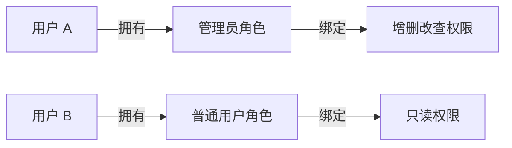
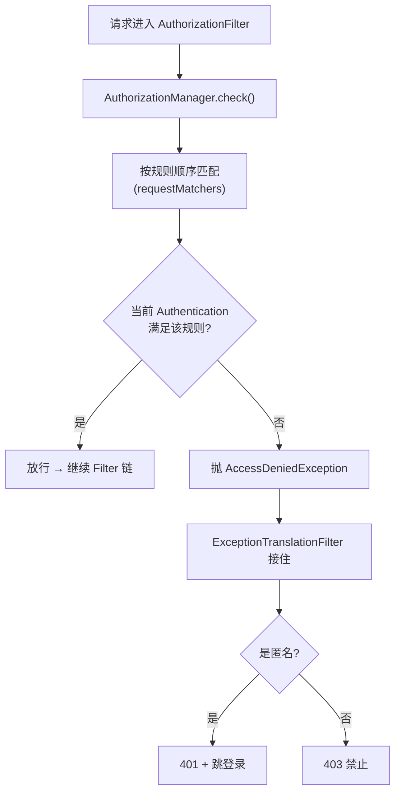
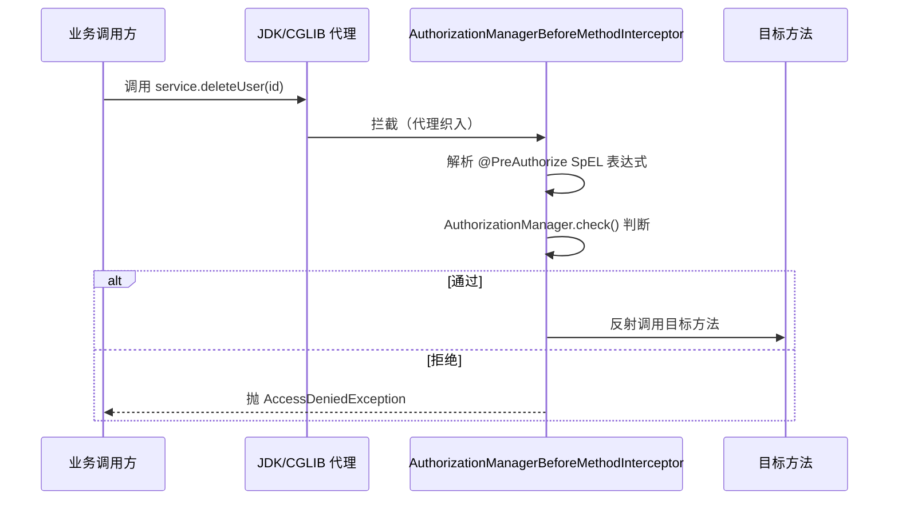
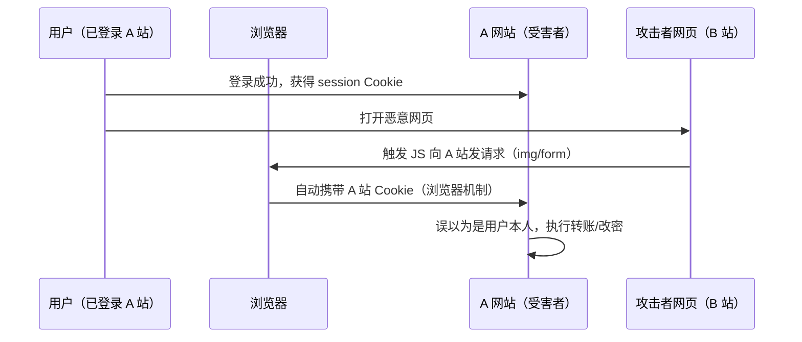
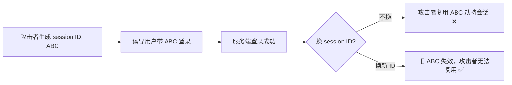

# Spring Security授权与安全防护详解

> 本文是 Spring Security 系列第 3 篇，深入**授权（Authorization）与安全防护**：URL 授权、方法级授权（注解）、CSRF/XSS/会话固定攻击防护、安全响应头。
> 前置知识：[01-Spring Security核心架构详解](01-Spring Security核心架构详解.md)、[02-Spring Security认证机制详解](02-Spring Security认证机制详解.md)
> 关联笔记：[04-Apache Shiro核心架构详解](04-Apache Shiro核心架构详解.md)（对比）、[07-Spring Security与Shiro对比选型详解](07-Spring Security与Shiro对比选型详解.md)

## 版本基线

基于 **Spring Security 6.x / 7.x**。方法级授权注解：`@PreAuthorize`/`@PostAuthorize`（需 `@EnableMethodSecurity`）。6.0 起 URL 授权用 `AuthorizationFilter`（取代 FilterSecurityInterceptor）。

## 受众声明

面向已掌握认证机制（[02-Spring Security认证机制详解](02-Spring Security认证机制详解.md)）的读者。假设已懂：Authentication、GrantedAuthority、Spring AOP。以下术语必须讲清：授权 vs 认证的区别、RBAC、方法级安全、CSRF 攻击原理。

## 学习目标

学完本文你能：
1. 说清**授权与认证的区别**，理解 Spring Security 授权模型（RBAC）
2. 配置 **URL 级授权**（requestMatchers）与 **方法级授权**（@PreAuthorize）
3. 理解 **CSRF 攻击原理**，正确决定何时启用/关闭 CSRF 防护
4. 说清 **XSS / 会话固定攻击**的防护手段
5. 说出常见授权配置**安全坑**（放行过宽、角色判断错误）
6. 读懂 AuthorizationFilter 源码，理解 URL 授权如何执行

## 前置知识

- [01-Spring Security核心架构详解](01-Spring Security核心架构详解.md)——Filter 链、SecurityFilterChain
- [02-Spring Security认证机制详解](02-Spring Security认证机制详解.md)——认证、Authentication、GrantedAuthority
- 需掌握 HTTP 方法、URL、Cookie/Session 概念

---

## 📋 总纲

1. 是什么：授权 vs 认证
2. 授权模型：GrantedAuthority 与角色
3. URL 级授权（AuthorizationFilter 源码级）
4. 方法级授权（注解 + AOP 原理）
5. CSRF 攻击与防护（重点）
6. 其他安全防护（XSS/会话固定/安全头）
7. 最佳实践
8. 常见踩坑
9. 面试追问 Q&A
10. 小结
11. 下一篇

---

## 1. 是什么：授权 vs 认证

**一句话记忆**：**认证 = 你是谁，授权 = 你能干什么**。先认证后授权——过滤链里认证过滤器在授权过滤器之前。

| 概念 | 回答 | 对应对象 |
|---|---|---|
| **认证 Authentication** | 你是谁 | Authentication（登录态） |
| **授权 Authorization** | 你能干什么 | GrantedAuthority / 角色 |
| **RBAC** | 角色-权限-用户模型 | 角色绑定权限，用户绑定角色 |

**RBAC 模型**：



> 此图说明：RBAC 三层模型——用户拥有角色，角色绑定权限。授权判断的是"当前 Authentication 的权限是否满足访问要求"。

> 💡 **记忆锚点**：**认证做一次（登录），授权每次请求都要判断**。授权判断的是"当前这个 Authentication 的权限是否满足访问要求"。

---

## 2. 授权模型：GrantedAuthority 与角色

认证后的 Authentication 里有一组 **GrantedAuthority**（权限/角色），授权就是检查这些权限。

| 对象 | 说明 | 示例 |
|---|---|---|
| `GrantedAuthority` | 一个权限/角色字符串 | `ROLE_ADMIN`、`ROLE_USER` |
| `SimpleGrantedAuthority` | 最简单的实现 | `new SimpleGrantedAuthority("ROLE_ADMIN")` |
| `ROLE_` 前缀 | 角色约定，`hasRole()` 自动加前缀 | `hasRole("ADMIN")` = 检查 `ROLE_ADMIN` |

> ⚠️ **易错点**：**`hasRole("ADMIN")` 自动加 `ROLE_` 前缀，`hasAuthority("ROLE_ADMIN")` 不加**。所以：
> - `hasRole("ADMIN")` 检查的是 `ROLE_ADMIN`
> - `hasAuthority("ADMIN")` 检查的是 `ADMIN`（无前缀）
> 混用容易判断失败。

**角色 vs 权限（细粒度）**：

| 维度 | 角色 Role | 权限 Authority |
|---|---|---|
| 粒度 | 粗（一组权限的集合） | 细（单个操作） |
| 示例 | ROLE_ADMIN | user:delete、order:create |
| 判断方法 | hasRole/hasAnyRole | hasAuthority/hasAnyAuthority |
| 变化频率 | 低 | 高 |

> 💡 **最佳实践**：数据库存权限（细粒度），角色作为权限的集合。配置里用 `hasRole` 做粗控，`hasAuthority` 做细控。

---

## 3. URL 级授权

在 `SecurityFilterChain` 里配置（第 1 篇见过），现在详细展开：

```java
@Bean
SecurityFilterChain filterChain(HttpSecurity http) throws Exception {
    http
        .authorizeHttpRequests(auth -> auth
            .requestMatchers("/", "/home", "/public/**").permitAll()   // 完全公开
            .requestMatchers("/admin/**").hasRole("ADMIN")             // 需 ADMIN 角色
            .requestMatchers("/user/**").hasAnyRole("USER", "ADMIN")   // 需任一角色
            .requestMatchers(HttpMethod.POST, "/api/**").authenticated() // POST 需登录
            .anyRequest().authenticated()                              // 其余需登录
        );
    return http.build();
}
```

**授权表达式（方法）表**：

| 方法 | 说明 |
|---|---|
| `permitAll()` | 完全放行（无需认证） |
| `authenticated()` | 需登录 |
| `hasRole("ADMIN")` | 需 ROLE_ADMIN |
| `hasAnyRole("A","B")` | 需任一角色 |
| `hasAuthority("perm")` | 需指定权限（不加 ROLE_ 前缀） |
| `hasIpAddress("192.168.1.1")` | 需指定 IP |

> ⚠️ **易错点**：**requestMatchers 顺序很重要**——**第一条匹配的规则生效**，后面的规则不会覆盖前面的。所以最具体的放最前，`anyRequest()` 放最后兜底。

### 3.1 AuthorizationFilter 源码级（URL 授权如何执行）

**是什么**：6.0 起 URL 授权的执行者是 `AuthorizationFilter`（取代旧 `FilterSecurityInterceptor`）。

**源码（Spring Security 6.x，关键部分）**：

```java
public class AuthorizationFilter extends GenericFilterBean {

    private final AuthorizationManager<HttpServletRequest> authorizationManager;

    @Override
    public void doFilter(ServletRequest servletRequest, ServletResponse servletResponse,
                         FilterChain chain) throws IOException, ServletException {
        HttpServletRequest request = (HttpServletRequest) servletRequest;

        // 调用 AuthorizationManager 判断是否允许
        AuthorizationDecision decision = this.authorizationManager.check(this::getAuthentication, request);

        if (decision == null || !decision.isGranted()) {
            // 被拒绝：先看是否匿名（匿名 → 401 引导登录；已登录 → 403）
            if (this.authorizationManager instanceof AuthorizationManager<HttpServletRequest> manager
                    && decision != null && !decision.isGranted()) {
                throw new AccessDeniedException("Access Denied");
            }
            throw new AccessDeniedException("Access Denied");
        }
        // 放行
        chain.doFilter(servletRequest, servletResponse);
    }

    private Authentication getAuthentication() {
        return SecurityContextHolder.getContext().getAuthentication();
    }
}
```

**关键点**：
- 核心是 `AuthorizationManager.check()`——一个函数式接口，输入当前 Authentication，输出 `AuthorizationDecision`（允许/拒绝）
- 拒绝时抛 `AccessDeniedException` → 被前面的 `ExceptionTranslationFilter` 接住 → 转 401（匿名）或 403（已登录）
- **授权决策是"每个请求独立判断"**——不缓存，规则变了立刻生效

### 3.2 授权决策链



> 此图说明：URL 授权是"规则匹配 + 权限判断"，拒绝后由异常转换器按登录状态决定返回 401 还是 403。

---

## 4. 方法级授权（注解）

URL 授权控制"哪些 URL 能访问"，方法级授权控制"方法能不能调"（更细粒度，可到 Service 层）。

### 4.1 启用方法级安全

```java
@Configuration
@EnableMethodSecurity   // 开启 @PreAuthorize 等注解
public class MethodSecurityConfig {}
```

### 4.2 常用注解

| 注解 | 说明 | 示例 |
|---|---|---|
| `@PreAuthorize` | 调用方法**前**检查权限 | `@PreAuthorize("hasRole('ADMIN')")` |
| `@PostAuthorize` | 方法返回**后**检查（可看返回值） | `@PostAuthorize("returnObject.owner == authentication.name")` |
| `@Secured` | 简单角色检查 | `@Secured("ROLE_ADMIN")` |
| `@PreFilter` | 过滤方法参数集合 | `@PreFilter("filterObject.owner == authentication.name")` |
| `@PostFilter` | 过滤返回集合 | `@PostFilter("filterObject.visible == true")` |

```java
@PreAuthorize("hasRole('ADMIN')")
public void deleteUser(Long id) { ... }

// 用 SpEL 表达式做更复杂判断
@PreAuthorize("hasRole('ADMIN') or #userId == authentication.principal.id")
public void updateUser(@Param("userId") Long userId) { ... }
```

**SpEL 可访问对象**：

| 对象 | 说明 | 示例 |
|---|---|---|
| `authentication` | 当前认证对象 | `authentication.name` |
| `#参数名` | 方法参数 | `#userId` |
| `returnObject` | 返回值（Post 系列） | `returnObject.owner` |
| `filterObject` | 集合元素（Filter 系列） | `filterObject.visible` |
| `hasRole()/hasAuthority()` | 判断方法 | `hasRole('ADMIN')` |

> 💡 **关键点**：方法级授权基于 **Spring AOP**，在方法调用前/后织入安全检查。`@PreAuthorize` 用 **SpEL 表达式**，可访问 `authentication`、`#参数名`、`returnObject`。

### 4.3 @PreAuthorize 的 AOP 原理（源码级）

**是什么**：方法级安全通过 AOP 代理实现。`@EnableMethodSecurity` 注册一个 `AuthorizationManagerBeforeMethodInterceptor`（拦截器），Spring 为带注解的 Bean 创建代理，方法调用时先经过拦截器。



> 此图说明：@PreAuthorize 不是魔法——是 AOP 代理在方法调用前插入安全检查。**调用方持有的是代理对象**，不是原始 Bean。

**为什么必须是代理调用才生效**：

```java
@Service
public class OrderService {

    @PreAuthorize("hasRole('ADMIN')")
    public void adminOp() { ... }

    public void outer() {
        this.adminOp();   // ❌ 内部调用不走代理，注解不生效！
    }
}
```

> ⚠️ **易错点**：
> - **必须在配置类加 `@EnableMethodSecurity`**，否则注解不生效（这是最常见坑）。
> - **内部调用 `this.xxx()` 不走代理**，@PreAuthorize 失效——需要注入自身代理或拆分 Bean。
> - `@PreAuthorize` 的 SpEL 里字符串要用**单引号** `'ROLE_ADMIN'`。
> - 方法级授权是**方法调用时**生效，跟 URL 授权是**两层**，都要配好。

---

## 5. CSRF 攻击与防护（重点）

### 5.1 CSRF 是什么

**CSRF（跨站请求伪造）**：攻击者诱导已登录用户，向目标网站发起恶意请求。

**原理**：



> 此图说明：CSRF 的核心是**浏览器自动携带 Cookie**——攻击者不需要知道 Cookie 内容，只要诱导浏览器发请求即可。

### 5.2 防护原理

**CSRF Token**：服务端在表单/响应里埋一个随机 Token，请求时必须带上；攻击者网页无法得知这个 Token，伪造请求失败。

```java
// Spring Security 默认开启 CSRF 防护（页面表单场景）
http.csrf(csrf -> csrf.disable());  // 无状态 API 才关闭
```

**Token 校验流程（CsrfFilter 源码语义）**：

```java
public class CsrfFilter extends OncePerRequestFilter {

    @Override
    protected void doFilterInternal(...) {
        // 1. 从请求里取 token（默认参数名 _csrf）
        CsrfToken csrfToken = this.tokenRepository.loadToken(request);
        String actualToken = request.getHeader("X-CSRF-TOKEN");
        if (actualToken == null) {
            actualToken = request.getParameter("_csrf");
        }
        // 2. 比较（恒时比较防时序攻击）
        if (!equalsConstantTime(csrfToken.getToken(), actualToken)) {
            // 3. 不匹配 → 403
            this.accessDeniedHandler.handle(request, response,
                new AccessDeniedException("Invalid CSRF token"));
            return;
        }
        // 4. 匹配 → 放行
        chain.doFilter(request, response);
    }
}
```

### 5.3 何时关闭

| 场景 | CSRF | 原因 |
|---|---|---|
| **服务端渲染页面 + session** | **开启**（默认） | 需要防护表单伪造 |
| **无状态 JWT API** | **关闭** `csrf.disable()` | 认证靠 token 不是 session，无 CSRF 风险且不影响 POST |
| **移动端** | 关闭 | 同无状态 API |

> 💡 **关键判断**：**CSRF 风险只存在于"靠 Cookie/session 认证"的场景**。无状态 JWT（token 放请求头）不受 CSRF 影响，所以无状态 API 可安全关闭 CSRF。

**为什么 JWT 场景没 CSRF 风险**：CSRF 利用的是"浏览器自动带 Cookie"；JWT 放在 `Authorization: Bearer` 请求头里，**浏览器不会自动携带**（攻击者网页不知道 token），伪造请求没有凭证。

---

## 6. 其他安全防护

### 6.1 XSS（跨站脚本攻击）

- **原理**：攻击者把恶意脚本注入页面，窃取用户数据/会话。
- **防护**：
  - 输出转义（前端模板自动转义）
  - 设置 `Content-Security-Policy` 响应头
  - 输入校验（白名单）

| 防护手段 | 层级 | 说明 |
|---|---|---|
| 输出转义 | 前端 | 模板引擎默认转义（React/Vue/Thymeleaf） |
| CSP 头 | HTTP 头 | 限制脚本来源 |
| 输入校验 | 后端 | 白名单校验（OWASP ESAPI） |
| HttpOnly Cookie | Cookie | 防 JS 读取 session（防会话窃取） |

### 6.2 会话固定攻击（Session Fixation）

- **原理**：攻击者先获得一个 session ID，诱导用户用它登录，攻击者复用该 session。
- **防护**：**登录成功后更换 session ID**。
- Spring Security 默认在登录时 `changeSessionId()`（迁移会话，防固定攻击）。



> 此图说明：会话固定防护的核心动作是登录成功后**换一个新的 session ID**，让攻击者手里的旧 ID 作废。

### 6.3 安全响应头

Spring Security 默认给响应加一组安全头：

| 响应头 | 作用 |
|---|---|
| `X-Content-Type-Options: nosniff` | 防 MIME 嗅探 |
| `Cache-Control: no-cache` | 防敏感页面缓存 |
| `Strict-Transport-Security` | 强制 HTTPS（HSTS） |
| `Content-Security-Policy` | 防 XSS |
| `X-Frame-Options` | 防点击劫持 |
| `X-XSS-Protection` | 浏览器 XSS 过滤器（旧） |

```java
// 自定义/补充安全头
http.headers(headers -> headers
    .contentSecurityPolicy(csp -> csp
        .policyDirectives("default-src 'self'; img-src 'self' data:;"))
    .frameOptions(frame -> frame.deny()));
```

---

## 7. 最佳实践

1. **最小权限原则**：`anyRequest().authenticated()` 兜底，显式放行才 permitAll
2. **规则顺序**：具体在前、`anyRequest()` 最后
3. **两层授权都配**：URL 级（粗）+ 方法级（细），叠加生效
4. **角色权限分离**：DB 存细粒度权限，角色是权限集合
5. **CSRF 判断**：session 场景开启、无状态 API 关闭
6. **方法级安全注意代理**：避免内部调用 this.xxx() 绕过注解
7. **安全头保留默认 + 按需补充 CSP**

---

## 8. 常见踩坑

- **URL 授权放行过宽**（如 `/**` permitAll）→ 敏感接口裸奔，应用最小权限原则。
- **requestMatchers 顺序错误** → 第一条匹配生效，具体规则放前面，`anyRequest()` 兜底。
- **hasRole/hasAuthority 前缀混淆** → `hasRole("ADMIN")` 查 ROLE_ADMIN，`hasAuthority("ADMIN")` 查 ADMIN。
- **忘了 @EnableMethodSecurity** → @PreAuthorize 不生效，方法无保护。
- **内部调用 this.xxx() 绕过注解** → AOP 代理不生效，需注入代理或拆分 Bean。
- **无状态 API 忘了关 CSRF/session** → POST 403 / 302 跳登录。
- **CSRF 在 session 场景被关闭** → 页面表单被伪造攻击风险。
- **方法级与 URL 级只配一层** → 两层是叠加的，都要按需配置。

---

## 9. 面试追问 Q&A

### 9.1 授权和认证有什么区别？执行顺序？

认证回答"你是谁"（验证凭证，登录时做一次），授权回答"你能干什么"（判断权限，每个请求都做）。执行顺序：先认证后授权——Filter 链里认证过滤器在授权过滤器之前，因为授权需要已认证的 Authentication 才能判断权限。

### 9.2 @PreAuthorize 为什么对内部调用不生效？

@PreAuthorize 通过 AOP 代理实现——调用方持有的是代理对象，方法调用先经过拦截器检查。但 `this.xxx()` 内部调用是原始对象直接调用，不走代理，注解被绕过。解决：注入自身代理、拆分 Bean、或用 AspectJ 织入（编译期/加载期）。

### 9.3 为什么无状态 JWT API 可以关闭 CSRF？

CSRF 利用的是浏览器自动携带 Cookie 的机制。JWT 放在 Authorization 请求头里，浏览器不会自动携带，攻击者网页无法伪造带 token 的请求，所以无状态 JWT 场景没有 CSRF 风险，可安全关闭。

### 9.4 hasRole 和 hasAuthority 有什么区别？

hasRole 会自动加 ROLE_ 前缀（hasRole("ADMIN") 检查 ROLE_ADMIN），hasAuthority 不加。功能上等价，hasRole 是角色约定的语法糖。角色是粗粒度权限集合，权限是细粒度单个操作，两者配合使用。

### 9.5 会话固定攻击怎么防？

登录成功后更换 session ID（changeSessionId）。攻击者先拿一个 session ID 诱导用户登录，如果服务端不换 ID，攻击者就能复用该 session 劫持会话。Spring Security 默认开启防护。

---

## 10. 小结

- **授权 ≠ 认证**：认证"你是谁"，授权"你能干什么"；先认证后授权。
- 授权模型：**RBAC**（用户-角色-权限），用 **GrantedAuthority** 表达。
- **URL 授权**（requestMatchers，AuthorizationFilter 执行）+ **方法级授权**（@PreAuthorize，AOP 代理）两层，方法级需 @EnableMethodSecurity。
- **CSRF**：session 场景开启、无状态 API 关闭；**XSS**：转义 + CSP；**会话固定**：登录后换 session ID。
- 安全底线：最小权限、正确配置 CSRF、方法级 URL 级都配好。

## 下一篇

[04-Apache Shiro核心架构详解](04-Apache Shiro核心架构详解.md)——切换到 Shiro，看另一个轻量安全框架怎么设计。
