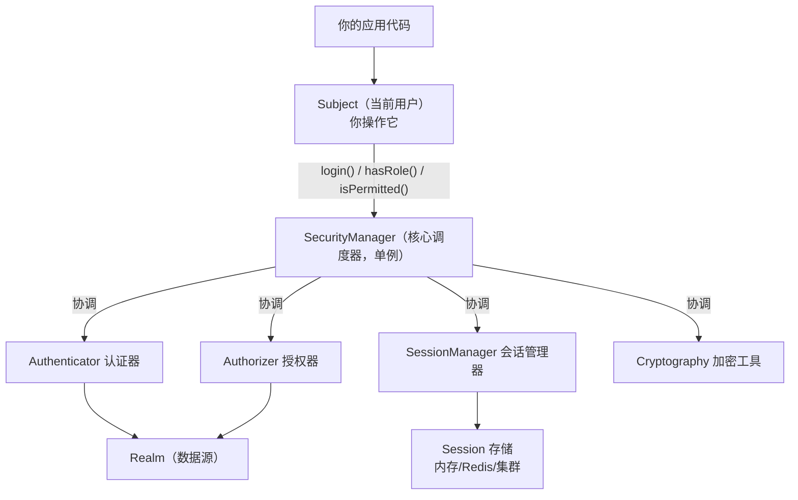
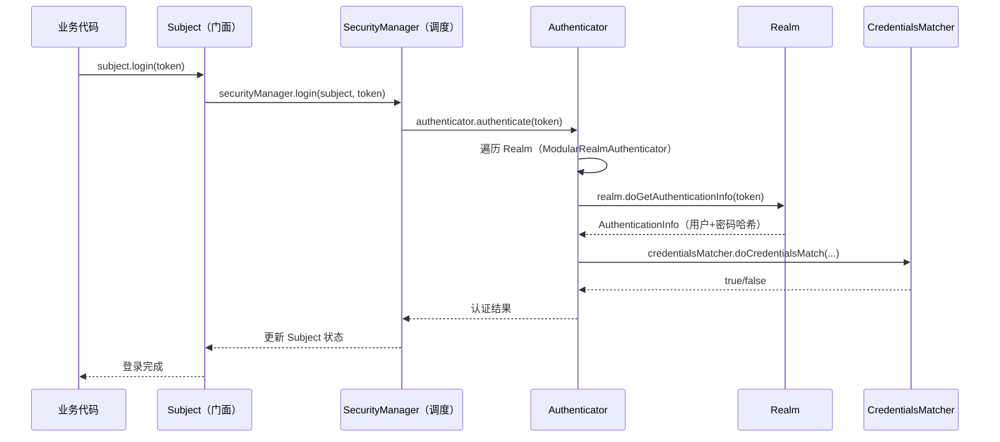
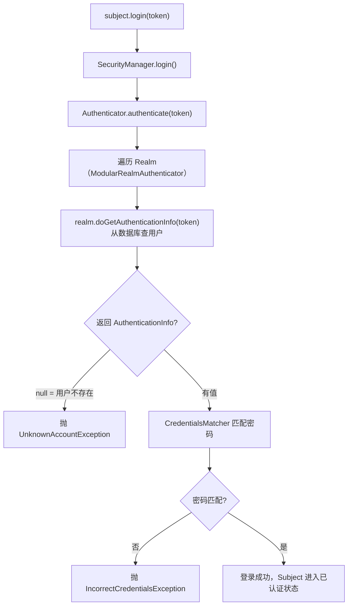
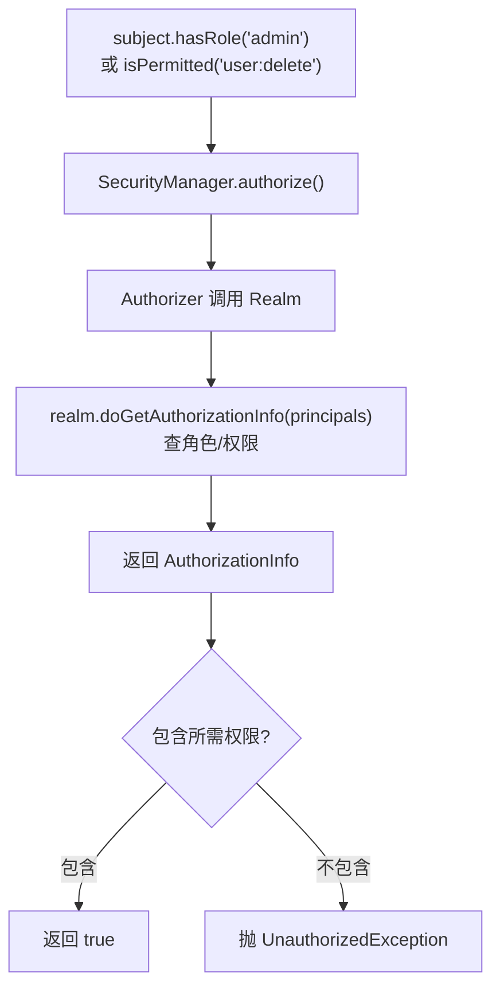

# Apache Shiro核心架构详解

> 本文是 Apache Shiro 系列第 1 篇，围绕**它到底怎么设计**展开：Subject、SecurityManager、Realm 三核心，认证/授权/会话/加密四能力，与 Spring Security 的架构对照。
> 前置知识：[00-安全框架选型总览·Spring Security & Apache Shiro](00-安全框架选型总览·Spring Security & Apache Shiro.md)
> 关联笔记：[05-Apache Shiro认证与授权详解](05-Apache Shiro认证与授权详解.md)、[06-Apache Shiro会话管理与实战详解](06-Apache Shiro会话管理与实战详解.md)、[03-Spring Security授权与安全防护详解](03-Spring Security授权与安全防护详解.md)

## 版本基线

基于 **Apache Shiro 1.x / 3.0**。Shiro 3.0.0（2026-06）发布，要求 **Java 17+**，有官方 `shiro-spring-boot-web-starter:3.0.0`。注意 2.0-alpha~2.2.0 及 3.0.0-alpha-1 的 shiro-jakarta-ee 模块存在 **CVE-2026-48589**。核心架构（Subject/SecurityManager/Realm）在 1.x 与 3.x 一致。

## 受众声明

面向已掌握认证/授权概念（对照 [01-Spring Security核心架构详解](01-Spring Security核心架构详解.md)）的读者。假设已懂：什么是认证、什么是授权、Session 概念。以下术语必须讲清：Subject、SecurityManager、Realm、Shiro 的"四能力"。

## 学习目标

学完本文你能：
1. 说清 Shiro **三核心组件**（Subject/SecurityManager/Realm）各自职责与关系
2. 理解 Shiro 的**四大能力**（认证/授权/会话/加密）如何被三核心承载
3. 画出 Shiro 的**整体架构**与认证/授权流程
4. 理解 **Subject 委托链**：你调 Subject 的方法，实际是谁在干活
5. 与 Spring Security 架构做**对照**（核心对象、认证入口）
6. 说出 Shiro 相比 Spring Security 的**架构优势**（轻量、不依赖容器）

## 前置知识

- [00-安全框架选型总览·Spring Security & Apache Shiro](00-安全框架选型总览·Spring Security & Apache Shiro.md)——选型认知
- [03-Spring Security授权与安全防护详解](03-Spring Security授权与安全防护详解.md)——认证/授权概念（可对照）
- 需掌握基本认证/授权概念

---

## 📋 总纲

1. 是什么：Shiro 三核心组件
2. 三核心逐个详解
3. Subject 委托链（源码级）
4. SecurityManager 源码结构
5. Shiro 认证与授权流程
6. 四大能力总览
7. 与 Spring Security 架构对照
8. 最佳实践
9. 常见踩坑
10. 面试追问 Q&A
11. 小结
12. 下一篇

---

## 1. 是什么：Shiro 三核心组件

**一句话记忆**：Shiro 用**三个对象**承载所有安全能力——**Subject**（当前用户/操作者）、**SecurityManager**（总调度）、**Realm**（数据源/去哪查用户权限）。

### 1.1 整体架构



> 此图说明：你（代码）只跟 Subject 打交道，Subject 把活交给 SecurityManager，SecurityManager 再协调四大子组件，数据统一从 Realm 拿。

### 1.2 三核心组件表

| 组件 | 职责 | 类比 |
|---|---|---|
| **Subject** | 当前与系统交互的实体（用户/服务/设备），**你编程时操作的对象** | "前台接待你这个人" |
| **SecurityManager** | Shiro 核心调度器，管理所有安全操作，**单例** | "后台总指挥" |
| **Realm** | 连接安全数据源（数据库/LDAP），提供用户与权限 | "查证身份和权限的档案室" |

> 💡 **记忆锚点**：**Subject 是"门面"，SecurityManager 是"大脑"，Realm 是"档案库"**。你（代码）只跟 Subject 打交道，Subject 把活交给 SecurityManager，SecurityManager 再从 Realm 拿数据。

---

## 2. 三核心逐个详解

### 2.1 Subject（主体）

**定义**：当前与系统交互的实体，代表"正在操作的用户/进程/设备"。

```java
// 获取当前 Subject（核心 API）
Subject currentUser = SecurityUtils.getSubject();

// 认证
currentUser.login(new UsernamePasswordToken("admin", "123456"));
currentUser.isAuthenticated();       // 是否已登录
currentUser.logout();                // 登出

// 授权
currentUser.hasRole("admin");        // 是否有某角色
currentUser.isPermitted("user:delete"); // 是否有某权限
```

| 方法 | 说明 |
|---|---|
| `login(AuthenticationToken)` | 登录（认证） |
| `isAuthenticated()` | 是否已认证 |
| `logout()` | 登出（清理会话） |
| `getPrincipal()` | 获取身份主体（如用户名） |
| `hasRole(String)` / `hasAllRoles` | 角色判断 |
| `isPermitted(String)` / `isPermittedAll` | 权限判断 |
| `getSession()` | 获取 Shiro Session |
| `runAs(PrincipalCollection)` | 临时身份切换（模拟用户） |

> 💡 **关键点**：**Shiro 的核心 API 都从 Subject 开始**。跟 Spring Security 不同（操作 SecurityContextHolder），Shiro 让你直接操作 Subject，API 更直观。

### 2.2 SecurityManager（安全管理器）

**定义**：Shiro 的核心调度器，管理认证、授权、会话、缓存等所有安全操作。**单例**，应用只配一个。

```java
DefaultSecurityManager securityManager = new DefaultSecurityManager();
securityManager.setRealm(myRealm);     // 设置 Realm
SecurityUtils.setSecurityManager(securityManager); // 全局挂载
```

**内部职责**（SecurityManager 是"总入口"，协调各子组件）：

| SecurityManager 子接口 | 职责 |
|---|---|
| **Authenticator** | 认证（登录验证） |
| **Authorizer** | 授权（角色/权限判断） |
| **SessionManager** | 会话管理 |
| **CacheManager** | 缓存（权限缓存） |
| **Cryptography** | 加密工具 |

> 🔍 **架构对照**：Shiro 的 **SecurityManager ≈ Spring Security 的 AuthenticationManager + AuthorizationManager**（一个对象包揽认证和授权调度）。这也是 Shiro"概念少"的原因。

### 2.3 Realm（领域）

**定义**：连接安全数据源（数据库/LDAP/内存）的**桥**，负责提供"用户信息 + 权限信息"。**必须至少配置一个**。

```java
public class MyRealm extends AuthorizingRealm {

    // 认证：根据 token 查用户
    @Override
    protected AuthenticationInfo doGetAuthenticationInfo(AuthenticationToken token) {
        String username = (String) token.getPrincipal();
        User user = userDao.findByUsername(username);
        if (user == null) return null;
        return new SimpleAuthenticationInfo(user.getUsername(), user.getPassword(), getName());
    }

    // 授权：查用户的角色/权限
    @Override
    protected AuthorizationInfo doGetAuthorizationInfo(PrincipalCollection principals) {
        String username = (String) principals.getPrimaryPrincipal();
        SimpleAuthorizationInfo info = new SimpleAuthorizationInfo();
        info.addRole("admin");
        info.addStringPermission("user:delete");
        return info;
    }
}
```

| Realm 方法 | 时机 | 职责 |
|---|---|---|
| `doGetAuthenticationInfo` | **认证时** | 根据身份查用户，返回认证信息（含密码哈希） |
| `doGetAuthorizationInfo` | **授权时** | 查用户的角色/权限 |
| `supports(AuthenticationToken)` | 认证前 | 判断本 Realm 是否处理该 token 类型 |
| `getName()` | 初始化 | Realm 唯一标识 |

> ⚠️ **易错点**：认证和授权是**两个方法、两个时机**。认证只验证"你是谁"（查密码），授权才查"你能干什么"（角色权限）。别混在一起。

**内置 Realm 实现**：

| Realm | 数据源 | 适用 |
|---|---|---|
| IniRealm | .ini 配置文件 | 学习/测试 |
| PropertiesRealm | .properties | 简单用户表 |
| JdbcRealm | JDBC 数据库 | 简单 SQL 场景 |
| AuthorizingRealm（自定义基类） | 自定义 | **生产标准做法** |
| 第三方（LDAP/ActiveDirectory） | LDAP | 企业目录 |

---

## 3. Subject 委托链（源码级）

**是什么**：Subject 是**门面（Facade）**——你调 `subject.login()` 时，真正干活的是 SecurityManager。理解这条委托链，就理解了 Shiro 的设计。



> 此图说明：Subject 的所有操作都委托给 SecurityManager。SecurityManager 再委托给 Authenticator/Authorizer，最后数据从 Realm 取、凭证匹配交给 CredentialsMatcher。

**委托链要点**：
- Subject 接口的实现是 `DelegatingSubject`——名字就说明一切：**委托**给 SecurityManager
- 你拿到的 subject 是"当前线程"的绑定对象，底层通过 `ThreadContext` 关联到 SecurityManager
- `SecurityUtils.getSubject()` 从 ThreadContext 取当前 Subject（Web 场景绑定到当前请求）

---

## 4. SecurityManager 源码结构

**是什么**：`SecurityManager` 是顶级接口，`DefaultSecurityManager`/`DefaultWebSecurityManager` 是主要实现。

**接口继承树（源码）**：

```java
public interface SecurityManager extends Authenticator, Authorizer, SessionManager {
    // 三合一：SecurityManager 同时是 Authenticator + Authorizer + SessionManager
    Subject login(Subject subject, AuthenticationToken authenticationToken);
    void logout(Subject subject);
    Subject createSubject(SubjectContext context);
}
```

**实现类**：

| 实现类 | 场景 | 说明 |
|---|---|---|
| `DefaultSecurityManager` | 非 Web（桌面/服务） | 基础实现 |
| `DefaultWebSecurityManager` | Web 应用 | Web 场景标准选择（Spring Boot 集成用它） |

**DefaultWebSecurityManager 装配（源码语义）**：

```java
public class DefaultWebSecurityManager extends DefaultSecurityManager {

    // 认证：ModularRealmAuthenticator（多 Realm 调度器）
    private Authenticator authenticator = new ModularRealmAuthenticator();

    // 授权：ModularRealmAuthorizer
    private Authorizer authorizer = new ModularRealmAuthorizer();

    // 会话：DefaultWebSessionManager（Web 会话）
    private SessionManager sessionManager = new DefaultWebSessionManager();

    // 记住我：CookieRememberMeManager
    private RememberMeManager rememberMeManager = new CookieRememberMeManager();
}
```

**ModularRealmAuthenticator 的职责**：管理多个 Realm 的认证调度——支持**单 Realm**（直接用）和**多 Realm**（逐个尝试，全部失败才失败）。

| 调度策略 | 说明 | 适用 |
|---|---|---|
| 单 Realm | 只有一个 Realm，直接认证 | 大多数应用 |
| 多 Realm 逐个尝试 | 按顺序尝试，任一成功即成功 | 多数据源（DB + LDAP） |
| AuthenticationStrategy | 定义多 Realm 结果聚合规则 | 高级场景 |

**AuthenticationStrategy 三种策略**：

| 策略 | 行为 |
|---|---|
| AtLeastOneSuccessfulStrategy（默认） | 至少一个 Realm 成功即成功 |
| FirstSuccessfulStrategy | 只认第一个成功的 |
| AllSuccessfulStrategy | 所有 Realm 都成功才算成功 |

---

## 5. Shiro 认证与授权流程

### 5.1 认证流程



> 此图说明：认证 = 查用户（Realm）→ 匹配密码（CredentialsMatcher）→ 成功标记 Subject。注意"返回 null 表示用户不存在"是 Shiro 的约定。

### 5.2 授权流程



> 此图说明：授权 = 查权限（Realm.doGetAuthorizationInfo）→ 判断是否包含。认证和授权是两条独立链路，分别触发 Realm 的不同方法。

> 💡 **记忆锚点**：**认证查 Realm 的 `doGetAuthenticationInfo`，授权查 Realm 的 `doGetAuthorizationInfo`**——两个方法对应两个流程，都通过 SecurityManager 转发到 Realm。

---

## 6. 四大能力总览

| 能力 | 承载组件 | 一句话说明 |
|---|---|---|
| **认证 Authentication** | Authenticator + Realm | 你是谁（验证凭证） |
| **授权 Authorization** | Authorizer + Realm | 你能干什么（角色/权限） |
| **会话 Session** | SessionManager | 保持状态（不依赖 Servlet 容器） |
| **加密 Cryptography** | 内置 Hash 工具 | 密码哈希/加盐 |

**为什么说 Shiro"四合一"**：Spring Security 只做认证+授权（会话用容器 session，加密要自己配 BCrypt）；Shiro 把这四样全打包成内置能力，尤其**会话不依赖容器**是最大特色。

---

## 7. 与 Spring Security 架构对照

| 维度 | Apache Shiro | Spring Security |
|---|---|---|
| **核心对象** | Subject | SecurityContextHolder / Authentication |
| **认证入口** | Subject.login() | AuthenticationManager.authenticate() |
| **调度器** | SecurityManager（一个管全部） | AuthenticationManager + AuthorizationManager（分职） |
| **数据源** | Realm（自定义） | UserDetailsService（自定义） |
| **凭证匹配** | CredentialsMatcher | PasswordEncoder |
| **会话** | 自有 SessionManager（不依赖容器） | 基于 Servlet Session / Token |
| **配置方式** | 编程式（SecurityManager + Realm） | Lambda DSL（SecurityFilterChain） |
| **概念数量** | 少（三核心） | 多（Filter/Provider/Manager 分层） |
| **依赖容器** | 不依赖（可脱离 Web 用） | 依赖 Servlet/Web |
| **安全防护** | 无内置 CSRF/安全头 | 内置 CSRF/XSS/安全头 |

> 🔍 **关键差异**：**Shiro 概念更少、不依赖容器**（SessionManager 甚至可脱离 Web 用），上手平缓；**Spring Security 概念分层更细、安全防护更全面**，但学习曲线陡。Shiro 的"简单"是用"功能深度"换来的——复杂场景（OAuth2/SSO）Shiro 远不如 Spring Security。

---

## 8. 最佳实践

1. **自定义 Realm 继承 AuthorizingRealm**：认证/授权两方法分开实现
2. **生产用 DefaultWebSecurityManager**：Web 场景标准选择
3. **单 Realm 优先**：多 Realm 增加复杂度，确有需要再用（DB + LDAP）
4. **Realm 数据源分层**：DAO 层查用户，Realm 只做数据装配
5. **凭证匹配交给 CredentialsMatcher**：别在 Realm 里手写密码比较
6. **会话存储按部署选**：单机内存、集群 Redis（见系列第 3 篇）

---

## 9. 常见踩坑

- **没配 Realm 或配错** → SecurityManager 无数据源，认证/授权全失败。
- **认证和授权逻辑写在一个方法** → 两方法是独立时机，分开实现。
- **Subject 在无会话环境获取** → 需正确配置 SessionManager / ThreadContext。
- **以为 Shiro 只用于 Web** → 它可独立用于任何 Java 应用（桌面/服务端）。
- **多 Realm 调度策略没理解** → 默认 AtLeastOneSuccessful，多 Realm 时任一成功即成功。
- **Shiro 3.0 的 jakarta-ee 模块漏洞** → 2.0-alpha~2.2.0 及 3.0.0-alpha-1 存在 CVE-2026-48589，注意版本。

---

## 10. 面试追问 Q&A

### 10.1 Shiro 的 Subject 是门面模式吗？为什么这么设计？

是。Subject 是门面（Facade），业务代码只跟它交互，实际逻辑全部委托给 SecurityManager。好处：API 简单统一（login/logout/hasRole/isPermitted 都从 Subject 开始），内部实现可替换（换 SecurityManager 实现不影响业务代码）。

### 10.2 Shiro 和 Spring Security 的"数据源"抽象有什么区别？

Shiro 用 Realm（两个方法：doGetAuthenticationInfo 查用户、doGetAuthorizationInfo 查权限），Spring Security 用 UserDetailsService（一个方法 loadUserByUsername 查用户）。Shiro 把认证和授权数据源分开，Spring Security 用一个接口 + Provider 组合。

### 10.3 SecurityManager 为什么同时实现 Authenticator、Authorizer、SessionManager 三个接口？

为了"一个对象管全部"——减少概念数量、API 统一。Shiro 的设计哲学是简单：SecurityManager 三合一，你只记住一个核心对象。代价是功能深度有限（复杂场景不如 Spring Security 的细粒度分层）。

### 10.4 多 Realm 时认证怎么调度？默认策略是什么？

ModularRealmAuthenticator 按顺序遍历 Realm，逐个调用 doGetAuthenticationInfo。默认策略 AtLeastOneSuccessfulStrategy：任一 Realm 认证成功即成功。其他策略：FirstSuccessful（只认第一个）、AllSuccessful（全部成功）。

### 10.5 Shiro 为什么可以脱离 Web 容器？

因为它的会话管理（SessionManager/SessionDAO）是自研的，不依赖 Servlet HttpSession。DefaultSecurityManager（非 Web 版）在桌面/独立服务里也能管理会话。这是 Spring Security 做不到的（它基于 Servlet）。

---

## 11. 小结

- Shiro **三核心**：**Subject**（当前用户，编程入口）、**SecurityManager**（总调度，单例）、**Realm**（数据源，查用户/权限）。
- **四大能力**：认证、授权、会话、加密，都由 SecurityManager 协调、Realm 提供数据。
- Subject 是门面，所有操作委托给 SecurityManager（DelegatingSubject）。
- 认证走 Realm 的 **doGetAuthenticationInfo**，授权走 **doGetAuthorizationInfo**。
- 相比 Spring Security：**概念少、不依赖容器、上手平缓**；但复杂安全场景（OAuth2/SSO）能力弱。

## 下一篇

[05-Apache Shiro认证与授权详解](05-Apache Shiro认证与授权详解.md)——深入认证流程、Realm 实现、授权注解、加密。
