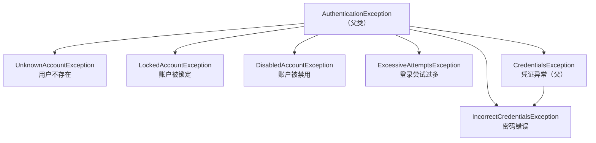

# Apache Shiro认证与授权详解

> 本文是 Apache Shiro 系列第 2 篇，深入**认证与授权实战**：认证流程与 Token、Realm 完整实现、凭证匹配、授权注解（@RequiresRoles/@RequiresPermissions）、加密（Hash 工具）。
> 前置知识：[04-Apache Shiro核心架构详解](04-Apache Shiro核心架构详解.md)
> 关联笔记：[02-Spring Security认证机制详解](02-Spring Security认证机制详解.md)（对照）、[06-Apache Shiro会话管理与实战详解](06-Apache Shiro会话管理与实战详解.md)、**05-密码哈希与加密基础**（见知识库）（密码哈希原理）

## 版本基线

基于 **Apache Shiro 1.x / 3.0**。认证/授权核心 API 在 1.x 与 3.x 基本一致。授权注解需开启注解支持（Spring 集成时自动）。

## 受众声明

面向已掌握 Shiro 三核心（[04-Apache Shiro核心架构详解](04-Apache Shiro核心架构详解.md)）的读者。假设已懂：Subject、SecurityManager、Realm 概念。以下术语必须讲清：AuthenticationToken、AuthenticationInfo、AuthorizationInfo、凭证匹配、授权注解。

## 学习目标

学完本文你能：
1. 完整实现一个 **Realm**（认证 + 授权两个方法）
2. 用 **Subject.login()** 完成认证，理解认证 Token 与流程
3. 用 **@RequiresRoles / @RequiresPermissions** 做注解式授权
4. 理解 **CredentialsMatcher** 密码匹配机制（含加盐哈希）
5. 理解 Shiro **权限通配符**匹配算法（user:*、*:delete）
6. 用 Shiro **Hash 工具**做密码加密（MD5/SHA/加盐）
7. 说清认证/授权的**异常处理**（UnknownAccountException / IncorrectCredentialsException 等）

## 前置知识

- [04-Apache Shiro核心架构详解](04-Apache Shiro核心架构详解.md)——Subject/SecurityManager/Realm
- [03-Spring Security授权与安全防护详解](03-Spring Security授权与安全防护详解.md)——认证/授权概念（可对照）
- 需掌握 Spring Bean、Java 集合

---

## 📋 总纲

1. 认证详解
2. 授权详解
3. 完整 Realm 实现（认证 + 授权）
4. CredentialsMatcher 凭证匹配机制（重点）
5. 权限通配符匹配算法（重点）
6. 注解式授权
7. 加密（Cryptography）
8. 最佳实践
9. 常见踩坑
10. 面试追问 Q&A
11. 小结
12. 下一篇

---

## 1. 认证详解

### 1.1 认证核心对象

| 对象 | 说明 |
|---|---|
| **AuthenticationToken** | 认证凭证（用户名 + 密码等），实现类 `UsernamePasswordToken` |
| **AuthenticationInfo** | Realm 返回的认证信息（用户名 + 密码哈希 + 盐），实现类 `SimpleAuthenticationInfo` |
| **AuthenticationException** | 认证失败异常（父类，下有细分异常） |

### 1.2 认证流程与代码

```java
// 1. 创建 Token（用户提交的凭证）
UsernamePasswordToken token = new UsernamePasswordToken(username, password);
token.setRememberMe(true);   // 记住我（可选）

// 2. 获取 Subject 并登录
Subject subject = SecurityUtils.getSubject();
try {
    subject.login(token);                    // 认证入口
    // 登录成功
} catch (UnknownAccountException e) {
    // 用户不存在
} catch (IncorrectCredentialsException e) {
    // 密码错误
} catch (AuthenticationException e) {
    // 其他认证失败
}

// 3. 登出
subject.logout();
```

**流程回顾**：`login(token)` → SecurityManager → Authenticator → **Realm.doGetAuthenticationInfo(token)** 返回 AuthenticationInfo → **凭证匹配**（密码比较）→ 成功则 Subject 标记已认证。

### 1.3 认证异常（区分失败原因）

**异常继承体系**：



| 异常 | 含义 |
|---|---|
| `UnknownAccountException` | 用户不存在 |
| `IncorrectCredentialsException` | 密码错误 |
| `LockedAccountException` | 账户被锁定 |
| `DisabledAccountException` | 账户被禁用 |
| `ExcessiveAttemptsException` | 登录尝试过多 |
| `AuthenticationException` | 认证失败的父异常 |

> ⚠️ **易错点**：**密码错误与用户不存在的异常应尽量统一处理**（返回相同提示），防止攻击者通过不同报错**探测用户名是否存在**。

---

## 2. 授权详解

### 2.1 授权核心对象

| 对象 | 说明 |
|---|---|
| **AuthorizationInfo** | Realm 返回的角色/权限信息，实现类 `SimpleAuthorizationInfo` |
| **PrincipalCollection** | 已认证的身份集合（可能多个 Realm 有多个身份） |
| **UnauthorizedException** | 授权失败异常 |

### 2.2 授权判断方式

| 方式 | API / 注解 | 说明 |
|---|---|---|
| **角色判断** | `subject.hasRole("admin")` / `@RequiresRoles("admin")` | 是否有某角色 |
| **权限判断** | `subject.isPermitted("user:delete")` / `@RequiresPermissions("user:delete")` | 是否有某权限 |
| **权限通配符** | `user:delete`、`user:*`、`*:delete` | Shiro 权限字符串支持通配符 |

### 2.3 权限字符串（Shiro 特色）

Shiro 权限用 `资源:操作` 格式，支持通配符：

| 权限字符串 | 含义 |
|---|---|
| `user:delete` | 用户的删除权限 |
| `user:create` | 用户的创建权限 |
| `user:*` | 用户的所有操作 |
| `user:delete:001` | 具体某条资源的删除权限 |
| `*:delete` | 所有资源的删除权限 |
| `user:delete:*` | 用户资源删除所有实例 |

> 💡 **记忆锚点**：Shiro 权限字符串 = **`资源:操作:实例`**，冒号分隔，`*` 通配。比单纯角色更细粒度。

**三段式结构**：

| 段 | 含义 | 示例 |
|---|---|---|
| 资源（resource） | 操作对象 | user、order、report |
| 操作（action） | 动作 | create、read、update、delete |
| 实例（instance） | 具体对象（可选） | 001、002 |

---

## 3. 完整 Realm 实现（认证 + 授权）

```java
@Component
public class MyRealm extends AuthorizingRealm {

    @Autowired
    private UserDao userDao;

    // ===== 认证：验证"你是谁" =====
    @Override
    protected AuthenticationInfo doGetAuthenticationInfo(AuthenticationToken token) {
        String username = (String) token.getPrincipal();   // 取出用户名
        User user = userDao.findByUsername(username);      // 从数据库查用户
        if (user == null) {
            return null;                                   // 返回 null → UnknownAccountException
        }
        // 返回：身份(username) + 密码哈希(数据库存的值) + 盐 + Realm 名
        return new SimpleAuthenticationInfo(
            user.getUsername(),
            user.getPassword(),
            ByteSource.Util.bytes(user.getSalt()),  // 若有盐
            getName());
    }

    // ===== 授权：查"你能干什么" =====
    @Override
    protected AuthorizationInfo doGetAuthorizationInfo(PrincipalCollection principals) {
        String username = (String) principals.getPrimaryPrincipal();
        // 从数据库查角色/权限（示例硬编码）
        SimpleAuthorizationInfo info = new SimpleAuthorizationInfo();
        info.addRole("admin");                              // 添加角色
        info.addStringPermission("user:delete");            // 添加权限
        return info;
    }
}
```

> ⚠️ **易错点**：
> - **doGetAuthenticationInfo 返回 null 表示用户不存在**（触发 UnknownAccountException），不是抛异常。
> - 认证返回的 password 是**数据库里的哈希值 + 盐**，明文比较交给 Shiro 的凭证匹配器（CredentialsMatcher）。
> - 授权方法里的 `getPrimaryPrincipal()` 拿到的是认证时存入的身份（这里存的是 username）。

---

## 4. CredentialsMatcher 凭证匹配机制（重点）

### 4.1 是什么

**CredentialsMatcher（凭证匹配器）** 负责"密码比对"——认证时 Authenticator 拿到 Realm 返回的 AuthenticationInfo（含密码哈希）后，调用它比对用户提交的明文与存储的哈希。

```java
public interface CredentialsMatcher {
    // credentials：用户提交的明文；info：Realm 返回的认证信息（含存储哈希）
    boolean doCredentialsMatch(AuthenticationToken token, AuthenticationInfo info);
}
```

### 4.2 内置实现

| 实现 | 说明 | 适用 |
|---|---|---|
| `SimpleCredentialsMatcher` | 直接比较（equals） | 无哈希场景 |
| `HashedCredentialsMatcher` | **哈希比较**（MD5/SHA256/BCrypt 等） | **生产标准** |
| `SaltedAuthenticationInfo` 支持 | 带盐哈希比较 | 加盐密码 |

### 4.3 加盐哈希匹配（源码语义）

```java
// 认证流程中，HashedCredentialsMatcher 内部大致逻辑：
public boolean doCredentialsMatch(AuthenticationToken token, AuthenticationInfo info) {
    // 1. 取用户提交的明文
    Object submitted = token.getCredentials();            // "123456"
    // 2. 取存储的哈希
    Object stored = info.getCredentials();                // "8f14e45fceea167a5a36dedd4bea2543"
    // 3. 若 info 是 SaltedAuthenticationInfo，取出盐
    if (info instanceof SaltedAuthenticationInfo) {
        ByteSource salt = ((SaltedAuthenticationInfo) info).getCredentialsSalt();
        // 4. 对明文做同样的哈希 + 盐
        submitted = hash(submitted, salt);                // MD5("123456" + salt)
    }
    // 5. 恒时比较
    return equals(submitted, stored);
}
```

**关键点**：匹配时**必须用相同的算法、盐、迭代次数**对明文重新哈希，再与存储值比较——所以注册时怎么哈希，认证时就要怎么匹配。

### 4.4 配置（Spring 集成）

```java
@Bean
public MyRealm myRealm() {
    MyRealm realm = new MyRealm();
    // 配置哈希匹配器：MD5 + 1024 次迭代（与注册时一致）
    HashedCredentialsMatcher matcher = new HashedCredentialsMatcher();
    matcher.setHashAlgorithmName("MD5");
    matcher.setHashIterations(1024);
    realm.setCredentialsMatcher(matcher);
    return realm;
}
```

> ⚠️ **易错点**：算法/盐/迭代次数与注册时**不一致**会导致认证永远失败——这是加盐哈希最常见的坑。

---

## 5. 权限通配符匹配算法（重点）

### 5.1 匹配规则（WildcardPermission 源码语义）

Shiro 的权限匹配由 `WildcardPermission` 实现。核心规则：

1. 权限字符串按 `:` 拆成**部分（parts）**，每部分按 `,` 拆成**子部分（subparts）**
2. `*` 通配**当前部分的所有可能值**
3. 用户权限（存储的）与所需权限（判断的）**逐部分匹配**
4. **所需权限部分数 > 用户权限部分数** → 不匹配（用户权限是"更宽"的授权）

```java
// 关键规则：用户权限 parts 数 >= 所需权限 parts 数才可能匹配
// 例子：
// 用户有 user:*      → 可判断 user:delete / user:create（2 部分 vs 2 部分）✓
// 用户有 user:*      → 可判断 user:delete:001？ 需 3 部分，用户只有 2 部分 → ✗
// 用户有 *:delete    → 可判断 user:delete（2 部分）✓
// 用户有 user:delete → 可判断 user:delete:001？ 需 3 部分，用户 2 部分 → ✗
```

### 5.2 匹配组合表（穷举）

设用户权限 U，所需权限 R：

| U（用户权限） | R（所需权限） | 匹配? | 原因 |
|---|---|---|---|
| user:delete | user:delete | ✅ | 完全一致 |
| user:* | user:delete | ✅ | * 通配 delete |
| *:delete | user:delete | ✅ | * 通配 user |
| * | user:delete | ✅ | * 通配全部 |
| user:delete | user:create | ❌ | delete ≠ create |
| user:delete | user:delete:001 | ❌ | U 部分数(2) < R 部分数(3) |
| user:* | user:delete:001 | ❌ | 同上，U 2 部分 < R 3 部分 |
| user:delete:* | user:delete:001 | ✅ | 3 部分 = 3 部分，* 通配 001 |
| user:delete,create | user:delete | ✅ | 逗号是"或"关系 |

> 💡 **记忆锚点**：**用户权限是"授权上限"**——判断时逐部分比，用户权限的 part 数必须 ≥ 所需权限的 part 数，且每个 part 要么相等要么是 `*`。想授予"某资源所有操作"用 `user:*`；想细化到实例必须给满三段（`user:delete:*`）。

### 5.3 与 Spring Security 权限对比

| 维度 | Shiro 权限字符串 | Spring Security GrantedAuthority |
|---|---|---|
| 格式 | `资源:操作:实例` + `*` 通配 | 任意字符串（无内置通配） |
| 通配符 | 内置（* 按部分通配） | 无（需自己实现或自定义校验） |
| 粒度 | 三段式（可到实例级） | 靠命名约定（如 user:delete） |
| 判断 | WildcardPermission 匹配 | hasAuthority 精确匹配 |

---

## 6. 注解式授权

在 Spring 集成时，Shiro 提供注解授权，直接标注在 Controller/Service 方法上：

```java
// 需要角色
@RequiresRoles("admin")
public void deleteUser() { ... }

// 需要权限
@RequiresPermissions("user:delete")
public void deleteUser() { ... }

// 登录即可
@RequiresAuthentication
public void viewProfile() { ... }

// 游客（未登录）可访问
@RequiresGuest
public void publicPage() { ... }
```

| 注解 | 说明 |
|---|---|
| `@RequiresRoles("admin")` | 需指定角色 |
| `@RequiresPermissions("user:delete")` | 需指定权限 |
| `@RequiresAuthentication` | 需已登录（本次会话真实登录） |
| `@RequiresUser` | 需已登录或被记住 |
| `@RequiresGuest` | 需未登录（游客） |

> 💡 **关键点**：注解式授权需在 Spring 集成中开启（Shiro 的 AOP 拦截，`shiro-spring-boot-web-starter` 自动配置）。与 Spring Security 的 @PreAuthorize 类似，但**不依赖 SpEL**，更简单直观。

**@RequiresPermissions 多权限逻辑**：

```java
// 逻辑值（默认 AND：所有权限都要有）
@RequiresPermissions(value = {"user:delete", "user:create"}, logical = Logical.AND)
// OR 逻辑：任一权限即可
@RequiresPermissions(value = {"user:delete", "user:create"}, logical = Logical.OR)
```

---

## 7. 加密（Cryptography）

> 📌 **密码哈希原理**（为什么慢哈希、加盐防彩虹表、BCrypt 结构）见 **05-密码哈希与加密基础**（见知识库）——本篇只讲 **Shiro 的 Hash 工具怎么用**。

Shiro 提供简单易用的哈希工具（密码加密）：

```java
// 简单哈希
String hash = new Md5Hash("password").toHex();          // MD5
String hash2 = new Sha256Hash("password").toHex();      // SHA-256

// 加盐哈希（推荐，防彩虹表）
String salt = RandomStringUtils.random(8);
String hash3 = new Md5Hash("password", salt).toHex();   // 加盐

// 统一 Hash 工具（SimpleHash）
SimpleHash hash4 = new SimpleHash("MD5", "password", salt, 1024); // 算法+盐+迭代次数
```

**推荐做法（注册 + 认证一致）**：

```java
// 注册：随机盐 + 哈希 + 迭代
String salt = RandomStringUtils.randomAlphanumeric(16);
String hashed = new SimpleHash("SHA-256", rawPassword, salt, 1024).toHex();
// 存 user.password = hashed, user.salt = salt

// 认证：Realm 返回带盐的 AuthenticationInfo（见 §3），HashedCredentialsMatcher 自动重算比对
```

> ⚠️ **易错点**：
> - **MD5/SHA 是快速哈希，不适合直接存密码**（易被暴力破解）。Shiro 支持 BCrypt（`BCryptPasswordService`，shiro-crypto-hash 模块），**现代应用应优先 BCrypt/Argon2**（原理见 **05-密码哈希与加密基础**（见知识库） §3）。
> - **加盐**能防彩虹表，但**盐要随机且每个用户不同**。
> - 哈希的**算法、盐、迭代次数要在认证时一致**，否则比对失败。

---

## 8. 最佳实践

1. **密码哈希用慢哈希**：Shiro 内置 BCryptPasswordService，或集成 Spring Security 的 BCrypt（shiro-spring-boot 生态常见做法）
2. **盐随机且每用户独立**：固定盐形同虚设
3. **Realm 只做数据装配**：查询逻辑放 DAO/Service，Realm 保持薄
4. **统一认证失败提示**：防用户名枚举
5. **权限字符串用三段式**：`资源:操作:实例`，方便通配扩展
6. **注解 + 编程式结合**：Controller 用注解，Service 内复杂逻辑用 isPermitted 编程判断

---

## 9. 常见踩坑

- **密码明文存储/比较** → 必须哈希 + 加盐，比较交给 CredentialsMatcher。
- **返回 null 与抛异常混淆** → Realm 返回 null 表示用户不存在（UnknownAccountException），不是抛异常。
- **用户不存在/密码错误报错不一致** → 应统一提示，防用户名探测。
- **认证与授权方法写混** → 认证 doGetAuthenticationInfo（查密码），授权 doGetAuthorizationInfo（查权限），独立实现。
- **权限字符串格式错误** → 用 `资源:操作` 格式 + 通配符，别乱写。
- **MD5 存密码** → 现代应用用 BCrypt/Argon2，别用快速哈希直接存。
- **盐/算法/迭代次数不一致** → 注册与认证必须一致，否则永远认证失败。

---

## 10. 面试追问 Q&A

### 10.1 Realm 返回 null 和抛异常的区别？

返回 null 表示"用户不存在"，Shiro 转成 UnknownAccountException；抛异常是主动报告异常状态（如数据库错误）。惯例：用户查不到返回 null，让 Shiro 统一映射到 UnknownAccountException，业务代码不用关心细节。

### 10.2 Shiro 权限通配符 `user:*` 能判断 `user:delete:001` 吗？

不能。匹配规则是用户权限的 part 数必须 ≥ 所需权限的 part 数：`user:*` 只有 2 部分，`user:delete:001` 有 3 部分，直接不匹配。想授权到实例级必须写满三段（如 `user:delete:*` 或 `user:*:*`）。

### 10.3 HashedCredentialsMatcher 是怎么校验加盐密码的？

用户提交明文 → 从 AuthenticationInfo 取存储哈希和盐 → 用配置的算法（MD5/SHA256 等）+ 盐 + 迭代次数对明文重新哈希 → 与存储值恒时比较。关键：算法/盐/迭代必须与注册时一致。

### 10.4 @RequiresAuthentication 和 @RequiresUser 的区别？

@RequiresAuthentication 要求"本次会话真实登录"（输过密码）；@RequiresUser 是"登录或被记住"都行（rememberMe 恢复也算）。敏感操作用前者，普通操作可用后者。

### 10.5 Shiro 的权限模型和 Spring Security 的有什么本质区别？

Shiro 有内置的通配符匹配引擎（资源:操作:实例 + *），Spring Security 的 GrantedAuthority 是纯字符串（无内置通配）。Shiro 开箱即用更细粒度；Spring Security 需要自己约定或自定义校验逻辑，但更灵活。

---

## 11. 小结

- 认证：**login(token) → SecurityManager → Realm.doGetAuthenticationInfo → CredentialsMatcher 凭证匹配**；失败有细分异常。
- 授权：**Realm.doGetAuthorizationInfo 返回角色/权限**，用 hasRole/isPermitted 或注解判断。
- 权限字符串 `资源:操作:实例` 支持通配符，比角色更细粒度。
- 凭证匹配：HashedCredentialsMatcher + 盐 + 迭代次数，注册认证必须一致。
- 注解授权：@RequiresRoles / @RequiresPermissions 简单直观。
- 加密：加盐哈希，现代应用优先 BCrypt/Argon2。

## 下一篇

[06-Apache Shiro会话管理与实战详解](06-Apache Shiro会话管理与实战详解.md)——SessionManager、rememberMe、Spring Boot 整合实战。
