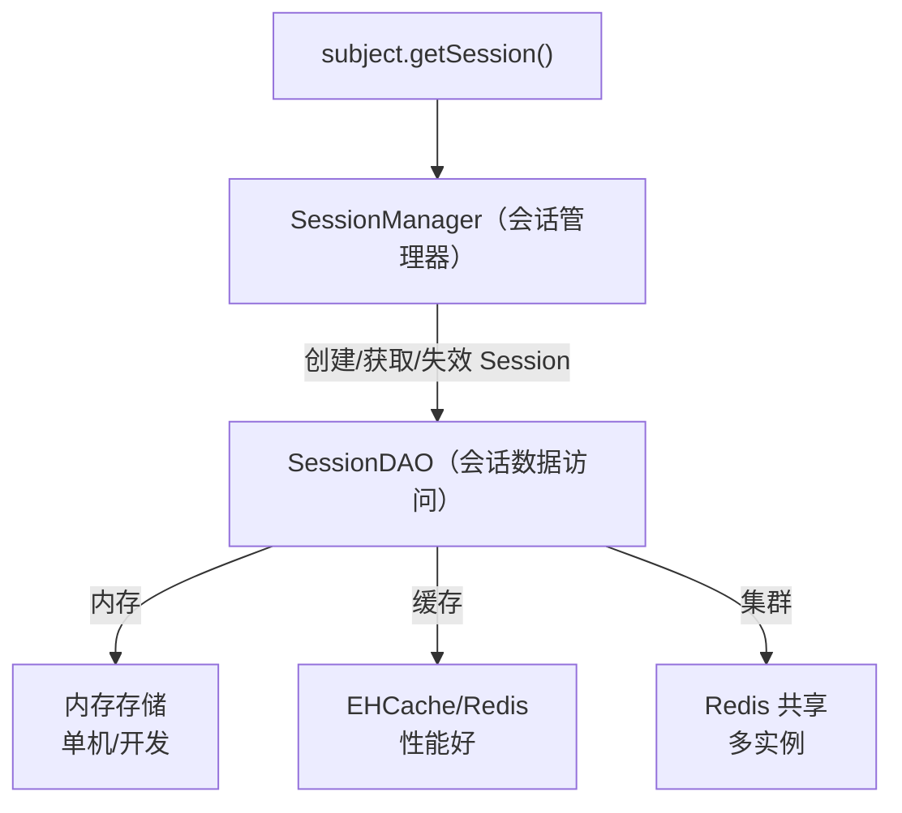
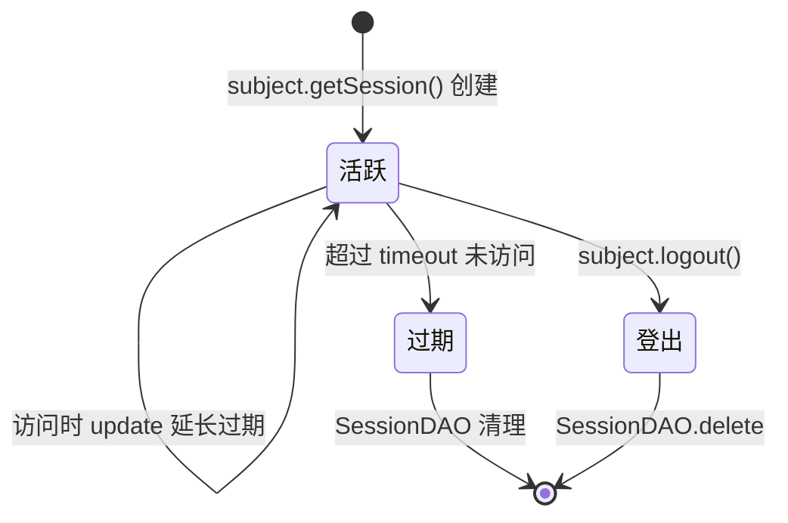
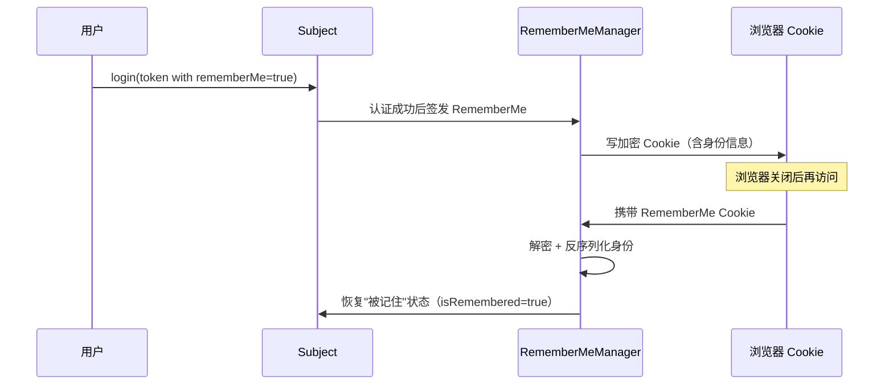
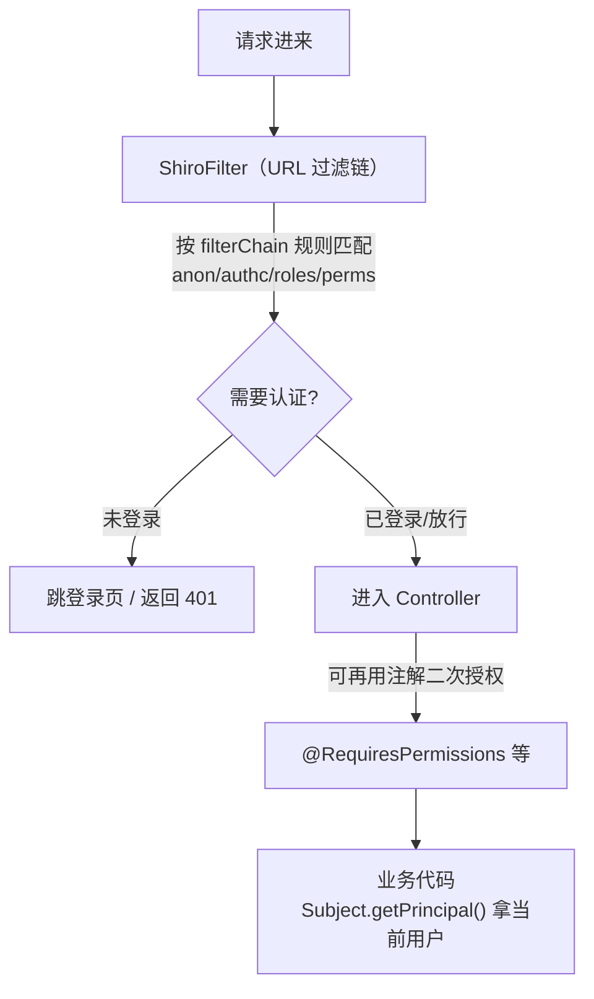

# Apache Shiro会话管理与实战详解

> 本文是 Apache Shiro 系列第 3 篇，深入**会话管理与 Spring Boot 整合实战**：SessionManager、会话存储（内存/缓存/集群）、rememberMe、Spring Boot 配置、完整的认证授权落地。
> 前置知识：[04-Apache Shiro核心架构详解](04-Apache Shiro核心架构详解.md)、[05-Apache Shiro认证与授权详解](05-Apache Shiro认证与授权详解.md)
> 关联笔记：[07-Spring Security与Shiro对比选型详解](07-Spring Security与Shiro对比选型详解.md)

## 版本基线

基于 **Apache Shiro 1.x / 3.0**。Spring Boot 整合用官方 `shiro-spring-boot-web-starter`（3.0.0）。注意 2.0-alpha~2.2.0 及 3.0.0-alpha-1 的 shiro-jakarta-ee 模块存在 **CVE-2026-48589**，生产选稳定版本。

## 受众声明

面向已掌握 Shiro 三核心与认证授权（[04-Apache Shiro核心架构详解](04-Apache Shiro核心架构详解.md)、[05-Apache Shiro认证与授权详解](05-Apache Shiro认证与授权详解.md)）的读者。假设已懂：Spring Boot 自动配置、@Configuration/@Bean、HTTP session/Cookie。以下术语必须讲清：SessionManager、SessionDAO、rememberMe、Shiro 的 Spring Boot starter 配置。

## 学习目标

学完本文你能：
1. 说清 Shiro **SessionManager** 与 **SessionDAO** 的职责与存储方式
2. 理解 **rememberMe（记住我）** 的原理与配置
3. 用官方 **shiro-spring-boot-web-starter** 整合 Spring Boot
4. 配置 URL 过滤规则（anon/authc/permissions）
5. 说出会话/集成的**常见坑**（会话失效、集群共享、rememberMe 安全）

## 前置知识

- [04-Apache Shiro核心架构详解](04-Apache Shiro核心架构详解.md)——Subject/SecurityManager/Realm
- [05-Apache Shiro认证与授权详解](05-Apache Shiro认证与授权详解.md)——认证授权、Realm、注解
- 需掌握 Spring Boot、HTTP session/Cookie

---

## 📋 总纲

1. 是什么：Shiro 的会话管理
2. SessionManager 与 SessionDAO（源码级）
3. Session 存储方式
4. rememberMe（记住我）
5. Spring Boot 整合实战（完整落地）
6. 完整流程串起来
7. 最佳实践
8. 常见踩坑
9. 面试追问 Q&A
10. 小结
11. 下一篇

---

## 1. 是什么：Shiro 的会话管理

**一句话记忆**：Shiro **自带一套不依赖 Servlet 容器的会话机制**（SessionManager + SessionDAO），这是它区别于 Spring Security 的一大特色——**脱离 Web 也能管理会话**。

### 1.1 会话管理架构



> 此图说明：SessionManager 管生命周期（创建/获取/过期），SessionDAO 管存储（存哪里）。默认内存，集群要配 Redis 共享。

### 1.2 核心组件表

| 组件 | 职责 | 类比 |
|---|---|---|
| **SessionManager** | 管理 Session 生命周期（创建/获取/过期） | "会话管理员" |
| **Session** | 会话对象，存用户状态数据 | "储物柜" |
| **SessionDAO** | 会话的持久化/存储（内存/缓存/集群） | "储物柜管理员" |
| **SecurityManager 内嵌 SessionManager** | SecurityManager 协调会话 | 总调度的一部分 |

> 💡 **记忆锚点**：**SessionManager 管"生命周期"，SessionDAO 管"存哪里"**。默认存内存，集群要配 Redis 共享。

---

## 2. SessionManager 与 SessionDAO（源码级）

### 2.1 SessionManager 接口（源码语义）

```java
public interface SessionManager {
    // 创建新会话（可带上下文：host、登录态等）
    Session start(SessionContext context);
    // 根据 sessionId 获取会话（不存在返回 null）
    Session getSession(SessionKey key);
    // 验证会话是否有效（未过期）
    void validate(Session session);
}
```

**内置实现**：

| 实现 | 场景 |
|---|---|
| `DefaultSessionManager` | 非 Web（桌面/独立服务） |
| `DefaultWebSessionManager` | **Web 应用（标准选择）** |
| `ServletContainerSessionManager` | 复用 Servlet 容器 HttpSession |

**Web 版 vs 非 Web 版区别**：DefaultWebSessionManager 把 sessionId 放 Cookie（默认 JSESSIONID 同名但由 Shiro 管理）；非 Web 版自己持有 Session 对象。

### 2.2 SessionDAO 接口（源码语义）

```java
public interface SessionDAO {
    Serializable create(Session session);      // 创建会话 → 返回 sessionId
    Session readSession(Serializable sessionId); // 读会话
    void update(Session session);              // 更新（改属性/延长过期）
    void delete(Session session);              // 删除会话
    Collection<Session> getActiveSessions();   // 所有活跃会话（统计/踢人用）
}
```

**内置实现**：

| 实现 | 存储 | 适用 |
|---|---|---|
| `MemorySessionDAO`（默认） | 内存 Map | 单机/开发测试 |
| `EnterpriseCacheSessionDAO` | EHCache 等缓存 | 单机缓存，性能好 |
| 自定义（继承 AbstractSessionDAO） | Redis 等 | **集群/分布式** |

### 2.3 会话生命周期



> 此图说明：会话三态流转——活跃（访问续期）→ 过期（超时）→ 清理；登出主动删除。默认 timeout 30 分钟（可配 globalSessionTimeout）。

---

## 3. Session 存储方式

| 存储方式 | 配置 | 适用场景 |
|---|---|---|
| **内存**（默认） | 无需配置 | 单机、开发测试 |
| **EHCache** | SessionDAO + EHCache | 单机缓存，性能好 |
| **Redis** | SessionDAO + Redis | **集群/分布式**，多实例共享会话 |

**Redis 共享会话（集群关键，完整可运行配置）**：

```java
@Configuration
public class ShiroSessionConfig {

    // 1. SessionDAO：Redis 实现（集群共享的核心）
    @Bean
    public SessionDAO sessionDAO(RedisConnectionFactory factory) {
        RedisSessionDAO dao = new RedisSessionDAO();
        dao.setRedisTemplate(new StringRedisTemplate(factory));
        dao.setKeyPrefix("shiro:session:");       // 键前缀，便于管理
        return dao;
    }

    // 2. SessionManager：把 SessionDAO 挂上去
    @Bean
    public DefaultWebSessionManager sessionManager(SessionDAO dao) {
        DefaultWebSessionManager sm = new DefaultWebSessionManager();
        sm.setSessionDAO(dao);
        sm.setGlobalSessionTimeout(30 * 60 * 1000L);  // 30 分钟过期
        sm.setSessionIdCookieEnabled(true);
        sm.setSessionIdUrlRewritingEnabled(false);    // 禁止 URL 重写（防 sessionId 泄露）
        return sm;
    }
}
```

> ⚠️ **易错点**：**集群部署必须共享会话存储**（Redis），否则用户登录态在 A 实例，请求打到 B 实例就失效。

**RedisSessionDAO 原理**：sessionId 作为 Redis key，Session 序列化后作为 value（默认 JDK 序列化；生产建议换 JSON/Kryo 序列化器）。设置过期时间 ≈ 会话超时。

---

## 4. rememberMe（记住我）

### 4.1 原理

登录时选"记住我"，服务端签发一个**加密的 RememberMe Cookie**，下次访问自动恢复登录态（无需重新输密码）。

```java
// 登录时设置
UsernamePasswordToken token = new UsernamePasswordToken(username, password);
token.setRememberMe(true);   // 启用记住我
subject.login(token);
```

**工作流程**：



> 此图说明：rememberMe = 加密 Cookie 持久化身份。注意恢复的是"被记住"状态，不是"本次登录"状态。

### 4.2 区别 authenticated vs remembered

| 状态 | 说明 |
|---|---|
| `subject.isAuthenticated()` | **本次会话真正登录**（输过密码） |
| `subject.isRemembered()` | 通过 **rememberMe Cookie** 恢复（没输密码） |
| `@RequiresUser` | 登录或被记住（只要不是纯游客） |
| `@RequiresAuthentication` | **必须**本次真正登录（不是记住的） |

> ⚠️ **易错点（重要）**：
> - **敏感操作不要只靠 rememberMe**——rememberMe 只是 Cookie 恢复身份，不代表本次验证了密码。
> - **敏感接口用 @RequiresAuthentication**（要求本次登录），普通接口可用 @RequiresUser。
> - rememberMe Cookie 要**加密**（配 rememberMeManager + 密钥），防止被篡改伪造。

### 4.3 rememberMe 安全（经典漏洞，面试高频）★

rememberMe 的**加密 Cookie + Java 反序列化**机制历史上出过多个著名 RCE 漏洞，面试必考：

| 漏洞 | CVE | 原理 | 影响 |
|---|---|---|---|
| **Shiro-550** | CVE-2016-4437 | rememberMe Cookie 用**硬编码默认密钥**（`kPH+bIxk5D2deZiIxcaaaA==`）AES 加密 → 攻击者用公开密钥构造恶意序列化对象 → 服务端反序列化执行 | **远程代码执行 RCE**，影响 1.x 全版本（未改密钥） |
| **Shiro-721** | CVE-2019-12422 | Padding Oracle 攻击：不依赖默认密钥，**逐字节爆破** rememberMe 密文构造恶意对象 | 影响 ≤1.4.2 |
| **认证绕过** | CVE-2020-11989 / 1957 | Shiro 的路径匹配（AntPathMatcher）与 Spring 的路径解析不一致（如 `;`、`/../`），导致**未授权访问绕过** | 影响 1.5.x 早期版本 |

**防护要点**：
1. **必须自定义 cipherKey**（`rm.setCipherKey(...)`）——默认密钥公开，等于没加密
2. **升级到修复版本**：Shiro-550 影响所有未改密钥的 1.x；2.0+/3.0 已修复
3. **升级依赖注意反序列化链**：老版本自带 Commons-Collections 等危险库
4. 路径绕过类：注意 Shiro 过滤器链与框架路由的**匹配一致性**（Shiro 与 Spring 都要用同样的匹配规则）

```java
@Bean
public RememberMeManager rememberMeManager() {
    CookieRememberMeManager rm = new CookieRememberMeManager();
    // 必须自定义！默认密钥 kPH+bIxk5D2deZiIxcaaaA== 公开，可被构造恶意 Cookie
    rm.setCipherKey(Hex.decode("你的随机32字节hex密钥"));
    return rm;
}
```

> ⚠️ **注意**：Shiro-550 的根本原因是**默认密钥公开**——不是 rememberMe 机制本身不安全，而是"用默认密钥 = 没加密"。自定义密钥 + 升级版本即可防护。

---

## 5. Spring Boot 整合实战（完整落地）

### 5.1 依赖（pom.xml）

```xml
<dependency>
    <groupId>org.apache.shiro</groupId>
    <artifactId>shiro-spring-boot-web-starter</artifactId>
    <version>3.0.0</version>  <!-- 或 1.13.x 稳定版 -->
</dependency>
```

### 5.2 Realm + SecurityManager 配置

```java
@Configuration
public class ShiroConfig {

    @Bean
    public MyRealm myRealm() {
        return new MyRealm();
    }

    @Bean
    public DefaultWebSecurityManager securityManager(MyRealm realm) {
        DefaultWebSecurityManager sm = new DefaultWebSecurityManager();
        sm.setRealm(realm);
        sm.setRememberMeManager(rememberMeManager());
        sm.setSessionManager(sessionManager());   // 会话管理（可选，默认内存）
        return sm;
    }

    @Bean
    public RememberMeManager rememberMeManager() {
        CookieRememberMeManager rm = new CookieRememberMeManager();
        rm.setCipherKey(Hex.decode("0123456789abcdef0123456789abcdef")); // 务必自定义
        return rm;
    }

    @Bean
    public DefaultWebSessionManager sessionManager() {
        DefaultWebSessionManager sm = new DefaultWebSessionManager();
        sm.setGlobalSessionTimeout(30 * 60 * 1000L);
        sm.setSessionIdUrlRewritingEnabled(false);   // 防 URL 泄露 sessionId
        return sm;
    }
}
```

### 5.3 URL 过滤规则（ShiroFilterFactoryBean）

Shiro 用**过滤器链**做 URL 访问控制（类似 Spring Security 的 requestMatchers）：

```java
@Bean
public ShiroFilterFactoryBean shiroFilter(DefaultWebSecurityManager securityManager) {
    ShiroFilterFactoryBean factory = new ShiroFilterFactoryBean();
    factory.setSecurityManager(securityManager);

    // 登录页
    factory.setLoginUrl("/login");
    factory.setUnauthorizedUrl("/403");

    // URL 过滤规则（key=URL模式，value=过滤器名）
    Map<String, String> filterChain = new LinkedHashMap<>();
    filterChain.put("/login", "anon");          // 登录页放行
    filterChain.put("/css/**", "anon");         // 静态资源放行
    filterChain.put("/admin/**", "roles[admin]"); // 需要 admin 角色
    filterChain.put("/user/**", "perms[user:delete]"); // 需要权限
    filterChain.put("/**", "authc");            // 其余需登录
    factory.setFilterChainDefinitionMap(filterChain);

    return factory;
}
```

**常用 Shiro 过滤器名**：

| 过滤器 | 作用 |
|---|---|
| `anon` | 匿名放行 |
| `authc` | 需认证（登录） |
| `authcBasic` | HTTP Basic 认证 |
| `user` | 登录或被记住（@RequiresUser） |
| `roles[admin]` | 需 admin 角色 |
| `perms[user:delete]` | 需指定权限 |
| `logout` | 登出 |

> 💡 **记忆锚点**：Shiro URL 过滤规则 = **`URL模式 → 过滤器名`**，`/**` 兜底 `authc`（需登录）。与 Spring Security 的 requestMatchers 思路类似，但用字符串配置。

**过滤器链顺序坑（同 Spring Security）**：`/**` 必须放最后兜底，具体规则放前面——Shiro 按 map 顺序匹配，**第一条命中的规则生效**。

### 5.4 登录/登出 Controller

```java
@RestController
public class AuthController {

    @PostMapping("/login")
    public Map<String, Object> login(@RequestBody LoginRequest req) {
        Subject subject = SecurityUtils.getSubject();
        UsernamePasswordToken token =
            new UsernamePasswordToken(req.username(), req.password(), req.rememberMe());
        try {
            subject.login(token);
            return Map.of("success", true, "user", subject.getPrincipal());
        } catch (UnknownAccountException e) {
            return Map.of("success", false, "msg", "用户不存在");
        } catch (IncorrectCredentialsException e) {
            return Map.of("success", false, "msg", "密码错误");
        } catch (AuthenticationException e) {
            return Map.of("success", false, "msg", "认证失败");
        }
    }

    @GetMapping("/logout")
    public Map<String, Object> logout() {
        SecurityUtils.getSubject().logout();   // 清理会话 + rememberMe Cookie
        return Map.of("success", true);
    }
}
```

---

## 6. 完整流程串起来



> 此图说明：两层防护——URL 过滤链（ShiroFilter）先拦一道，注解授权（@RequiresPermissions）再拦一道，都要按需配置。

> 🔍 **两层防护**：Shiro 的 **URL 过滤链**（ShiroFilter）+ **注解授权**（@RequiresPermissions）是两层，都要按需配置（与 Spring Security 的 URL+方法级两层思路一致）。

---

## 7. 最佳实践

1. **集群必须 Redis 共享会话**：SessionDAO 用 RedisSessionDAO，多实例登录态一致
2. **rememberMe 密钥自定义**：默认密钥公开，可被伪造，必须改
3. **敏感操作要求真实登录**：@RequiresAuthentication，别只靠 rememberMe
4. **关闭 URL 重写**：`setSessionIdUrlRewritingEnabled(false)`，防 sessionId 泄露到 URL
5. **过滤器链顺序**：具体规则在前，`/**` 兜底
6. **会话超时合理设置**：安全敏感应用调短（15-30 分钟）
7. **生产会话序列化器**：默认 JDK 序列化有安全风险（反序列化漏洞），建议 JSON/Kryo

---

## 8. 常见踩坑

- **集群没共享会话** → 登录态在多实例间失效，必须配 Redis SessionDAO。
- **rememberMe 密钥默认/硬编码** → Cookie 可被伪造，必须自定义加密密钥。
- **敏感操作用 isRemembered 误判** → 敏感接口用 @RequiresAuthentication（本次登录），别只靠 rememberMe。
- **URL 过滤规则顺序错误** → 类似 Spring Security，`/**` 放最后兜底，具体规则放前面。
- **sessionId 出现在 URL** → 开了 URL 重写，改 `setSessionIdUrlRewritingEnabled(false)`。
- **Spring Boot 3.5 与 Shiro 版本不兼容** → 见 apache/shiro issue #2119，生产确认兼容版本。
- **Shiro 3.0-alpha jakarta 漏洞** → CVE-2026-48589，用稳定版。

---

## 9. 面试追问 Q&A

### 9.1 SessionManager 和 SessionDAO 各管什么？

SessionManager 管会话生命周期（创建/获取/过期/验证），SessionDAO 管存储（create/read/update/delete）。类比：Manager 是"管理员"，DAO 是"仓库"。要换存储（内存→Redis）只换 SessionDAO，Manager 不用动。

### 9.2 集群部署时 Shiro 会话怎么共享？

配置 RedisSessionDAO：sessionId 做 key，Session 序列化后存 Redis，多实例共享同一存储。这样用户在 A 实例登录，请求打到 B 实例也能从 Redis 读到会话。关键是 SessionDAO 换成 Redis 实现 + 设置键前缀。

### 9.3 rememberMe 和 session 有什么区别？安全上要注意什么？

session 在服务端，关闭浏览器即失效（Cookie 是 sessionId）；rememberMe 是把身份加密后存客户端 Cookie，可跨会话恢复。安全上：rememberMe 不代表"本次验证过密码"，敏感操作要用 @RequiresAuthentication；Cookie 必须加密（自定义密钥）。

### 9.4 Shiro 的 URL 过滤规则和 Spring Security 的 requestMatchers 有什么区别？

形式不同：Shiro 用字符串 map（`URL模式 → 过滤器名`，如 `roles[admin]`），Spring Security 用编程式（`.requestMatchers("/admin/**").hasRole("ADMIN")`）。都是"具体规则在前、兜底在后"的顺序匹配。

### 9.5 isAuthenticated 和 isRemembered 有什么区别？什么时候用哪个？

isAuthenticated = 本次会话真正输过密码登录；isRemembered = 通过 rememberMe Cookie 恢复（没输密码）。判断敏感操作权限用 isAuthenticated（或 @RequiresAuthentication），普通展示用 isRemembered 也可以接受。

---

## 10. 小结

- **SessionManager 管生命周期，SessionDAO 管存储**；集群用 Redis 共享会话。
- **rememberMe** = 加密 Cookie 恢复身份；敏感操作用 @RequiresAuthentication 而非只靠 rememberMe。
- Spring Boot 整合：**shiro-spring-boot-web-starter** + Realm + SecurityManager + ShiroFilter（URL 过滤规则）。
- URL 过滤规则：`URL模式 → 过滤器名`（anon/authc/roles/perms），`/**` 兜底 authc。
- 两层防护：URL 过滤链 + 注解授权，都要配好。

## 下一篇

[07-Spring Security与Shiro对比选型详解](07-Spring Security与Shiro对比选型详解.md)——全维度对比 + 选型决策树。
