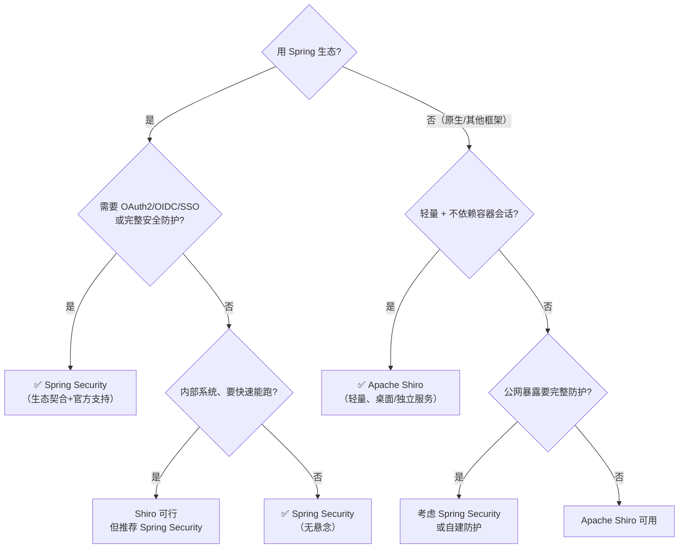
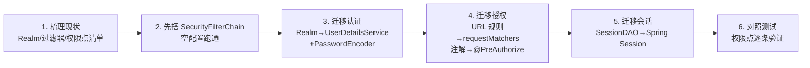

# Spring Security与Apache Shiro对比选型详解

> 本文是「Java 安全框架」系列收尾篇，做 **Spring Security & Apache Shiro 的全维度深度对比**，并给出**选型决策树**，帮你快速判断项目该用哪个。
> 前置知识：[01-Spring Security核心架构详解](01-Spring Security核心架构详解.md)、[04-Apache Shiro核心架构详解](04-Apache Shiro核心架构详解.md) 及系列各篇
> 关联笔记：[00-安全框架选型总览·Spring Security & Apache Shiro](00-安全框架选型总览·Spring Security & Apache Shiro.md)

## 版本基线

对比基于 **Spring Security 6.x/7.x** 与 **Apache Shiro 1.x/3.0**（2026-08 查证）。版本更新详见 [00-安全框架选型总览·Spring Security & Apache Shiro](00-安全框架选型总览·Spring Security & Apache Shiro.md)。

## 受众声明

面向已读完两个框架系列笔记、要**做技术选型**的读者。假设已懂：两框架核心架构、认证/授权/会话概念。以下术语必须讲清：生态契合、OAuth2/OIDC、无状态认证、安全防护完备性。

## 学习目标

学完本文你能：
1. 从 **6 大维度**（生态/安全能力/易用/会话/扩展/社区）对比两个框架
2. 依据**选型决策树**判断项目该用哪个
3. 说出两个框架的**最佳适用场景**与**互相转换的迁移成本**
4. 通过**典型场景案例**（电商/管理后台/微服务）理解选型逻辑
5. 给出新项目（Spring Boot）的**推荐结论**

## 前置知识

- [00-安全框架选型总览·Spring Security & Apache Shiro](00-安全框架选型总览·Spring Security & Apache Shiro.md)——总体选型
- [01-Spring Security核心架构详解](01-Spring Security核心架构详解.md)、[04-Apache Shiro核心架构详解](04-Apache Shiro核心架构详解.md)——架构基础

---

## 📋 总纲

1. 六维全维度对比
2. 选型决策树
3. 典型场景案例分析（电商/管理后台/微服务/桌面）
4. 最佳适用场景汇总
5. 迁移成本（相互切换）
6. 你的场景推荐（结论）
7. 面试追问 Q&A
8. 小结
9. 系列回顾

---

## 1. 六维全维度对比

### 1.1 生态与集成

| 维度 | Spring Security | Apache Shiro |
|---|---|---|
| **Spring 生态** | **原生一体**（官方 starter） | 外来者（靠第三方 starter） |
| **OAuth2/OIDC** | 官方第一方支持 | 较弱，靠第三方 |
| **SAML/SSO** | 官方支持 | 较弱 |
| **LDAP** | 官方支持 | 有但弱 |
| **微服务/网关安全** | 生态完善 | 需自行集成 |

> 🔍 **结论**：**生态是 Spring Security 的最大护城河**——OAuth2/OIDC/SSO 这些现代企业安全需求，Spring Security 官方原生支持，Shiro 几乎没有。

### 1.2 安全防护能力

| 能力 | Spring Security | Apache Shiro |
|---|---|---|
| **CSRF 防护** | 内置（默认开启） | 无内置（靠 Web 框架） |
| **XSS/CSP 安全头** | 内置安全响应头 | 无内置 |
| **会话固定防护** | 内置（登录换 session） | 弱 |
| **密码编码** | DelegatingPasswordEncoder（BCrypt 默认） | Hash 工具（需自己配 BCrypt） |
| **OAuth2/OIDC** | 完善 | 无 |
| **安全防护完备性** | **高** | 低 |

> ⚠️ **关键差距**：**Spring Security 把"安全防护"（CSRF/XSS/安全头/会话固定）做成了默认能力**，Shiro 更偏"认证授权"，防护性安全功能需要自己补。若应用暴露在公网、要完整防护，Spring Security 明显更稳。

### 1.3 易用性与上手

| 维度 | Spring Security | Apache Shiro |
|---|---|---|
| **概念数量** | 多（Filter/Provider/Manager 分层） | 少（三核心） |
| **学习曲线** | 陡峭 | 平缓 |
| **API 直观度** | 相对复杂 | **直观**（Subject.login()） |
| **最小可用** | 配置较多 | 几分钟能跑 |
| **文档友好度** | 官方文档全但复杂 | 简洁易懂 |

> 🔍 **结论**：**Shiro 更好上手**（概念少、API 直观），适合快速落地、Java 新手团队；Spring Security 初学陡峭，但掌握后能力全面。

### 1.4 会话与无状态

| 维度 | Spring Security | Apache Shiro |
|---|---|---|
| **会话机制** | 基于 Servlet Session / Token | **自有 SessionManager（不依赖容器）** |
| **脱离 Web 容器** | 依赖 Servlet | **可脱离**（桌面/服务端） |
| **JWT 无状态** | 官方支持（resource-server） | 需第三方 |
| **集群会话共享** | 靠 Spring Session/Redis | 靠 SessionDAO/Redis |

> 🔍 **结论**：**Shiro 的最大特色是"会话不依赖容器"**——非 Web 场景（桌面应用、独立服务）也能管理会话。但 Web/JWT 场景两者都能做，Spring Security 的 JWT 支持更官方完善。

### 1.5 社区与维护

| 维度 | Spring Security | Apache Shiro |
|---|---|---|
| **社区活跃度** | 极高 | 中低 |
| **安全更新** | 及时 | 较慢 |
| **版本迭代** | 6→7 快速演进 | 3.0（2026-06）才较新 |
| **学习资料** | 海量 | 相对少 |
| **风险** | 低 | 有 CVE 需注意 |

> ⚠️ **关键风险**：**Shiro 社区活跃度与安全更新速度不如 Spring Security**，且存在 CVE-2026-48589（jakarta-ee 模块）。企业级安全需求下，这是重要权衡点。

### 1.6 性能与体量

| 维度 | Spring Security | Apache Shiro |
|---|---|---|
| **依赖体量** | 较大（Spring 全家桶） | **轻量** |
| **性能** | 良好（Filter 链） | 良好 |
| **内存占用** | 较高 | 较低 |

> 🔍 **结论**：Shiro **更轻量**，适合资源受限或非 Spring 环境；Spring Security 因绑定 Spring 生态而体量较大，但对 Spring 项目几乎无额外负担。

---

## 2. 选型决策树

从**你的项目情况**出发，按下面的判断流选择：

**决策树要点**：
1. **第一步看生态**：用 Spring → 首选 Spring Security；不用 Spring → 可选 Shiro
2. **第二步看需求**：需要 OAuth2/SSO/完整防护 → Spring Security 无悬念
3. **特殊场景**：非 Web 会话、轻量、非 Spring → Shiro 更合适

---

## 3. 典型场景案例分析

### 3.1 案例一：电商平台（微服务 + 公网暴露）

**场景**：用户中心、订单、支付多服务，网关统一鉴权，需要 OAuth2 第三方登录（微信/支付宝），公网暴露。

**推荐：Spring Security**

| 需求 | 为什么 Spring Security |
|---|---|
| 微服务网关鉴权 | 生态完善（OAuth2 Resource Server + JWT） |
| 第三方登录 | 官方 OAuth2/OIDC 客户端支持 |
| 公网暴露 | 内置 CSRF/XSS/安全头完整防护 |
| 支付安全 | 方法级 @PreAuthorize 细粒度控制 |

**Shiro 的劣势**：OAuth2 无官方支持（要自己对接第三方库）、无内置安全防护，公网场景要补一大堆。

### 3.2 案例二：企业内部管理系统（内网 + Spring Boot）

**场景**：公司内部 OA/后台管理系统，Spring Boot 单体，内网部署，无第三方登录需求。

**推荐：Spring Security（或 Shiro 都行）**

| 方案 | 优点 | 缺点 |
|---|---|---|
| Spring Security | 与 Spring Boot 一体、表单登录开箱即用 | 配置略多 |
| Shiro | 上手快、URL 过滤直观 | 内网场景防护需求低，够用 |

> 💡 内网管理系统两者都能胜任。团队熟悉哪个用哪个；新团队从零学 → Spring Security 更有长期价值（技能通用）。

### 3.3 案例三：桌面工具 / 独立服务（非 Web）

**场景**：本地桌面应用、CLI 工具、无 Servlet 容器的服务端程序，需要登录 + 会话。

**推荐：Apache Shiro**

**为什么**：Shiro 的 SessionManager **不依赖 Servlet 容器**，桌面/独立服务里直接可用；Spring Security 强依赖 Servlet/Web 环境，非 Web 场景很难用。

### 3.4 案例四：非 Spring 的轻量 Web 应用（Spring MVC/原生 Servlet）

**场景**：用原生 Servlet、JSP 或非 Spring 框架的小型 Web 应用，只要基础登录。

**推荐：Apache Shiro**

**为什么**：不引入 Spring 全家桶，轻量集成；URL 过滤规则（anon/authc）配置简单。

---

## 4. 最佳适用场景汇总

| 场景 | 最佳选择 | 一句话理由 |
|---|---|---|
| Spring Boot 新项目 | **Spring Security** | 原生 starter + 完整防护 + OAuth2 生态 |
| 微服务/Spring Cloud | **Spring Security** | 网关/OAuth2 生态完善 |
| 需要 OAuth2/OIDC/SSO | **Spring Security** | 官方第一方支持 |
| 公网暴露、要完整防护 | **Spring Security** | CSRF/XSS/安全头内置 |
| 非 Spring 轻量应用 | Apache Shiro | 轻量、不依赖 Spring |
| 桌面/独立服务会话 | Apache Shiro | 会话不依赖容器 |
| 快速 Demo/学习 | Apache Shiro | 上手最快 |
| 老项目维护 | 维持原框架 | 迁移成本 > 收益 |

---

## 5. 迁移成本（相互切换）

| 迁移方向 | 难度 | 主要改动 |
|---|---|---|
| **Shiro → Spring Security** | 高 | 认证体系、过滤器、配置、注解全换，业务代码侵入大 |
| **Spring Security → Shiro** | 中 | 核心认证/授权逻辑需重写，但若只用基础认证相对可控 |
| **换框架的共性成本** | 高 | 安全配置、Realm/UserDetailsService、会话管理、测试用例全要重写 |

**迁移路线图（Shiro → Spring Security 为例）**：

> ⚠️ **结论**：安全框架是**侵入性很强的基础设施**，一旦选错，迁移成本很高。**新项目务必想清楚再选**——Spring 项目默认 Spring Security，别贪 Shiro 的简单而埋下生态/防护隐患。

---

## 6. 你的场景推荐（结论）

**robin 同志是 Java 后端 + Spring 生态**，我的明确推荐：

- **新项目（Spring Boot）**：**Spring Security**。理由：生态契合（原生 starter）、安全防护完备（CSRF/XSS/安全头）、OAuth2/JWT 官方支持、社区活跃更新及时。这是**行业事实标准**。
- **Shiro**：作为**对比/认知**理解即可，或用于**非 Spring 的轻量独立应用**。在 Spring 项目里选 Shiro 属于"能跑但不优"，长期看生态和安全更新是隐患。

> 💡 **记忆锚点**：**"Spring 项目 = Spring Security，非 Spring 轻量 = Shiro"**。除非有强理由（非 Spring、桌面会话、团队熟练），否则 Spring 项目无脑选 Spring Security 不会错。

---

## 7. 面试追问 Q&A

### 7.1 为什么 Spring 项目推荐 Spring Security 而不是 Shiro？

因为 Spring Security 是 Spring 生态的原生安全模块：官方 starter、自动配置、OAuth2/OIDC/SSO 官方支持、CSRF/XSS/安全头内置、社区活跃更新及时。Shiro 在 Spring 里是"外来者"，生态和防护能力不足，长期看有隐患。

### 7.2 Shiro 相比 Spring Security 的核心优势？

轻量 + 易用 + 会话不依赖容器。概念少（三核心）、API 直观（Subject.login()）、上手快，且 SessionManager 可脱离 Web 容器用于桌面/独立服务。

### 7.3 什么场景必须选 Spring Security？

需要 OAuth2/OIDC/SSO、需要完整安全防护（公网暴露）、或大规模 Spring Boot/微服务项目。这些场景 Shiro 能力不足。

### 7.4 什么场景选 Shiro 更合理？

非 Spring 的轻量应用、桌面/独立服务的会话管理、快速 Demo/原型、老项目已深度使用 Shiro 且无迁移动力。这些场景 Shiro 的轻量优势能发挥，Spring Security 反而重。

### 7.5 两个框架能混用吗？

技术上可以（Shiro 做认证授权 + Spring Security 做防护），但**不推荐**——两套过滤器链、两套注解体系、两套配置，复杂度翻倍且职责重叠。选一个为主，另一个只做补充（如 Shiro 应用里用 Spring Security 的 BCrypt 编码器）。

---

## 8. 小结

- **六维对比**：生态（SS 完胜）、防护（SS 完胜）、易用（Shiro 胜）、会话（Shiro 可脱离容器）、社区（SS 完胜）、体量（Shiro 轻）。
- **选型决策树**：先用 Spring → 首选 SS；不用 Spring 或要轻量/桌面会话 → Shiro。
- **典型场景**：电商/微服务/公网 → SS；内网管理后台 → 两者皆可；桌面/独立服务 → Shiro。
- **你的场景**：Java 后端 + Spring → **Spring Security**，Shiro 作为认知补充。
- 安全框架侵入性强、迁移成本高，**新项目选型要想清楚**。

## 系列回顾

- [00-安全框架选型总览·Spring Security & Apache Shiro](00-安全框架选型总览·Spring Security & Apache Shiro.md)
- [01-Spring Security核心架构详解](01-Spring Security核心架构详解.md) → [02-Spring Security认证机制详解](02-Spring Security认证机制详解.md) → [03-Spring Security授权与安全防护详解](03-Spring Security授权与安全防护详解.md)
- [04-Apache Shiro核心架构详解](04-Apache Shiro核心架构详解.md) → [05-Apache Shiro认证与授权详解](05-Apache Shiro认证与授权详解.md) → [06-Apache Shiro会话管理与实战详解](06-Apache Shiro会话管理与实战详解.md)
