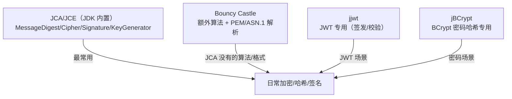

# 密码学库实战详解

> 本文是 Java「安全」域第 8 篇，**密码学库实战**：JCA/JCE 体系、Bouncy Castle、jjwt、jbcrypt——在 Java 里怎么正确调用密码学能力。**用法层**，原理见 **05-密码哈希与加密基础**（见知识库）、**06-对称加密与AES模式详解**（见知识库）、**07-非对称加密·密钥交换与数字签名详解**（见知识库）。
> 前置知识：**05-密码哈希与加密基础**（见知识库）（四大类密码学工具）
> 关联笔记：[00-安全框架选型总览·Spring Security & Apache Shiro](00-安全框架选型总览·Spring Security & Apache Shiro.md)（框架篇）、**06-对称加密与AES模式详解**（见知识库）（AES-GCM 原理）

## 版本基线

基于 **JDK 17/21 内置 JCA/JCE** + **Bouncy Castle Java 1.85**（2026-05 发布，查证于 2026-08）+ **jjwt 0.12.x** + **jBCrypt 0.4**。API 以各库官方文档为准。

## 受众声明

面向已了解密码学四大类概念（哈希/对称/非对称/签名）的 Java 开发者。假设已懂：**05-密码哈希与加密基础**（见知识库） 的选型、Spring/Shiro 的密码处理。以下术语必须讲清：JCA/JCE、Provider、Engine 类、Bouncy Castle。

## 学习目标

学完本文你能：
1. 说清 **JCA/JCE 体系**（Provider 架构、Engine 类、为什么"算法字符串"）
2. 用 JCA 正确写 **AES-GCM / RSA / 签名 / 哈希** 代码
3. 说清 **Bouncy Castle** 是什么、什么时候需要它（PEM/ASN.1/额外算法）
4. 用 **jjwt** 签发/校验 JWT
5. 用 **jBCrypt** 做密码哈希
6. 说出密码学库的**常见坑**（Provider 缺失、算法字符串错、密钥长度）

## 前置知识

- **05-密码哈希与加密基础**（见知识库）——四大类工具与选型
- **06-对称加密与AES模式详解**（见知识库）——GCM/IV 细节
- 需掌握 Maven 依赖引入

---

## 📋 总纲

1. 是什么：Java 密码学库全景
2. JCA/JCE 体系（Provider 架构）
3. 哈希与密码哈希实战
4. 对称加密实战（AES-GCM）
5. 非对称加密与签名实战（RSA/ECDSA）
6. Bouncy Castle（何时需要）
7. jjwt（JWT 签发/校验）
8. jBCrypt（密码哈希）
9. 库选型对照表
10. 常见坑
11. 面试追问 Q&A
12. 小结
13. 下一篇

---

## 1. 是什么：Java 密码学库全景

**一句话记忆**：Java 密码学 = **JCA/JCE（JDK 内置）+ Bouncy Castle（补充）+ 专用库（jjwt/jbcrypt）**——四层各司其职。



> 此图说明：JDK 内置 JCA 覆盖大部分需求；BC 补算法和格式；jjwt/jbcrypt 是单一用途专用库，避免重复造轮子。

| 库 | 定位 | 什么时候用 |
|---|---|---|
| **JCA/JCE**（JDK 内置） | 通用密码学（哈希/对称/非对称/签名） | 绝大多数场景，首选 |
| **Bouncy Castle** | JCA 的补充 Provider + PEM/ASN.1 | 需要 JCA 没有的算法/格式（如 Ed25519、PEM 解析） |
| **jjwt** | JWT 签发/校验 | 前后端分离 JWT 场景 |
| **jBCrypt** | BCrypt 密码哈希 | 存密码（或用 Spring Security 的 BCryptPasswordEncoder） |

---

## 2. JCA/JCE 体系（Provider 架构）

### 2.1 核心概念

**JCA（Java Cryptography Architecture）** = 框架；**JCE（Java Cryptography Extension）** = 加密部分。核心设计是 **Provider 架构**：JDK 只定义**接口（Engine 类）**，具体算法由 **Provider**（SunJCE、BouncyCastle 等）实现。

```java
// 拿到算法实例（不关心是谁实现的——Provider 架构）
MessageDigest md = MessageDigest.getInstance("SHA-256");
Cipher cipher = Cipher.getInstance("AES/GCM/NoPadding");
Signature sig = Signature.getInstance("SHA256withRSA");
```

**Engine 类一览**：

| Engine 类 | 用途 | 典型算法字符串 |
|---|---|---|
| `MessageDigest` | 哈希 | "SHA-256"、"SHA3-256" |
| `Cipher` | 加解密 | "AES/GCM/NoPadding"、"RSA/ECB/PKCS1Padding" |
| `Signature` | 签名/验签 | "SHA256withRSA"、"SHA256withECDSA" |
| `KeyGenerator` | 对称密钥生成 | "AES" |
| `KeyPairGenerator` | 非对称密钥对生成 | "RSA"、"EC" |
| `SecretKeyFactory` | 密钥转换 | "PBKDF2WithHmacSHA256" |
| `Mac` | HMAC | "HmacSHA256" |

> 💡 **记忆锚点**：**JCA 用"算法字符串"选实现**——`getInstance("AES/GCM/NoPadding")` 的字符串就是"引擎 + 模式 + 填充"三段式。记不住字符串 = 写不对加密代码。

### 2.2 为什么是字符串而不是类

**Provider 架构**允许第三方实现同一算法（Bouncy Castle 注册后 `getInstance` 可用它的实现）——**代码与实现解耦**，换 Provider 不用改业务代码。

```java
// 注册 Bouncy Castle 后，JCA 就能用它实现更多算法
Security.addProvider(new BouncyCastleProvider());
// 之后 getInstance("Ed25519") 等 JDK 没有的算法就可用了
```

> ⚠️ **易错点**：`getInstance("AES")` 只拿默认模式（ECB！）；**必须写全三段 `AES/GCM/NoPadding`**，否则默认 ECB 不安全（见 **06-对称加密与AES模式详解**（见知识库））。

---

## 3. 哈希与密码哈希实战

### 3.1 SHA-256（完整性校验）

```java
import java.nio.charset.StandardCharsets;
import java.security.MessageDigest;
import java.util.HexFormat;

public class HashDemo {
    public static String sha256(String input) throws Exception {
        MessageDigest md = MessageDigest.getInstance("SHA-256");
        byte[] digest = md.digest(input.getBytes(StandardCharsets.UTF_8));
        return HexFormat.of().formatHex(digest);   // JDK 17+ HexFormat；旧版用 BigInteger
    }

    public static void main(String[] args) throws Exception {
        System.out.println(sha256("hello"));  // 2cf24dba...（固定值，可验证）
    }
}
```

### 3.2 PBKDF2（慢哈希之一，FIPS 合规）

```java
import javax.crypto.SecretKeyFactory;
import javax.crypto.spec.PBEKeySpec;
import java.security.SecureRandom;
import java.util.HexFormat;

public class Pbkdf2Demo {
    public static void main(String[] args) throws Exception {
        String password = "secret123";
        byte[] salt = new byte[16];
        new SecureRandom().nextBytes(salt);            // 随机盐
		// 密码 + 随机盐，迭代 10 万次，派生 256 位密钥
        PBEKeySpec spec = new PBEKeySpec(password.toCharArray(), salt, 100_000, 256);
        SecretKeyFactory f = SecretKeyFactory.getInstance("PBKDF2WithHmacSHA256");
        byte[] hash = f.generateSecret(spec).getEncoded();

        System.out.println("盐: " + HexFormat.of().formatHex(salt));
        System.out.println("哈希: " + HexFormat.of().formatHex(hash));
        // 认证时用相同 salt+迭代重算比对（恒时比较）
    }
}
```

> 💡 **要点**：PBKDF2 是 JDK 内置慢哈希（FIPS 合规场景用）；BCrypt 更常用（Spring 默认），但 JDK 无内置 BCrypt——用 jBCrypt 或 Spring Security（见 §8）。

---

## 4. 对称加密实战（AES-GCM）

```java
import javax.crypto.Cipher;
import javax.crypto.KeyGenerator;
import javax.crypto.SecretKey;
import javax.crypto.spec.GCMParameterSpec;
import java.security.SecureRandom;
import java.util.Base64;

public class AesGcmDemo {

    public static String encrypt(String plaintext, SecretKey key) throws Exception {
        byte[] iv = new byte[12];
        new SecureRandom().nextBytes(iv);                        // GCM 推荐 12 字节随机 IV

        Cipher cipher = Cipher.getInstance("AES/GCM/NoPadding"); // 三段式算法字符串！
        cipher.init(Cipher.ENCRYPT_MODE, key, new GCMParameterSpec(128, iv));
        byte[] encrypted = cipher.doFinal(plaintext.getBytes(java.nio.charset.StandardCharsets.UTF_8));

        byte[] combined = new byte[iv.length + encrypted.length]; // IV || 密文
        System.arraycopy(iv, 0, combined, 0, iv.length);
        System.arraycopy(encrypted, 0, combined, iv.length, encrypted.length);
        return Base64.getEncoder().encodeToString(combined);
    }

    public static String decrypt(String base64, SecretKey key) throws Exception {
        byte[] combined = Base64.getDecoder().decode(base64);
        byte[] iv = new byte[12];
        System.arraycopy(combined, 0, iv, 0, 12);
        byte[] encrypted = new byte[combined.length - 12];
        System.arraycopy(combined, 12, encrypted, 0, encrypted.length);

        Cipher cipher = Cipher.getInstance("AES/GCM/NoPadding");
        cipher.init(Cipher.DECRYPT_MODE, key, new GCMParameterSpec(128, iv));
        return new String(cipher.doFinal(encrypted), java.nio.charset.StandardCharsets.UTF_8);
        // 篡改 → 抛 AEADBadTagException
    }

    public static void main(String[] args) throws Exception {
        KeyGenerator kg = KeyGenerator.getInstance("AES");
        kg.init(256);
        SecretKey key = kg.generateKey();
        String enc = encrypt("Hello Java 密码学", key);
        System.out.println("密文: " + enc);
        System.out.println("明文: " + decrypt(enc, key));
    }
}
```

**要点**：算法字符串必须写 `AES/GCM/NoPadding`（不能只写 "AES" 否则默认 ECB）；IV 随机 12 字节；解密自动验 Tag。

---

## 5. 非对称加密与签名实战（RSA/ECDSA）

> 🔗 **进阶实操**：动态生成密钥对、轮换、混合加密、接口防爆破 → 见扩展篇 [08-扩展·动态生成密钥对与轮换详解](08-扩展·动态生成密钥对与轮换详解.md)。

### 5.1 RSA 密钥对生成 + 加密

```java
import javax.crypto.Cipher;
import java.security.*;

public class RsaDemo {
    public static void main(String[] args) throws Exception {
        // 1. 生成密钥对（生产：2048+）
        KeyPairGenerator kpg = KeyPairGenerator.getInstance("RSA");
        kpg.initialize(2048);
        KeyPair kp = kpg.generateKeyPair();

        // 2. 公钥加密（保密）
        Cipher enc = Cipher.getInstance("RSA/ECB/OAEPWithSHA-256AndMGF1Padding");
        enc.init(Cipher.ENCRYPT_MODE, kp.getPublic());
        byte[] secret = enc.doFinal("sensitive".getBytes());

        // 3. 私钥解密
        Cipher dec = Cipher.getInstance("RSA/ECB/OAEPWithSHA-256AndMGF1Padding");
        dec.init(Cipher.DECRYPT_MODE, kp.getPrivate());
        System.out.println(new String(dec.doFinal(secret)));
    }
}
```

> ⚠️ **易错点**：RSA 加密必须用 **OAEP 填充**（`OAEPWithSHA-256AndMGF1Padding`），**不要用 PKCS1Padding 加密**（有 Bleichenbacher 攻击史）——PKCS1 只用于签名场景。

### 5.2 ECDSA 签名

```java
import java.security.*;

public class EcdsaDemo {
    public static void main(String[] args) throws Exception {
        // 1. ECC 密钥对（256 bit ≈ RSA 3072）
        KeyPairGenerator kpg = KeyPairGenerator.getInstance("EC");
        kpg.initialize(new ECGenParameterSpec("secp256r1"));  // P-256
        KeyPair kp = kpg.generateKeyPair();

        byte[] message = "payload".getBytes();

        // 2. 私钥签名
        Signature sig = Signature.getInstance("SHA256withECDSA");
        sig.initSign(kp.getPrivate());
        sig.update(message);
        byte[] signature = sig.sign();

        // 3. 公钥验签
        Signature verify = Signature.getInstance("SHA256withECDSA");
        verify.initVerify(kp.getPublic());
        verify.update(message);
        System.out.println("验签: " + verify.verify(signature));
    }
}
```

> 💡 **现代推荐**：JWT 用 ES256（ECDSA）替代 RS256；Ed25519 更现代（需 Bouncy Castle 或 JDK 15+ 部分支持）。

---

## 6. Bouncy Castle（何时需要）

**是什么**：第三方密码学 Provider，**注册进 JCA 后提供 JDK 没有的算法和格式解析**。

**什么时候必须用**：

| 场景 | 为什么需要 BC |
|---|---|
| **PEM/ASN.1 解析** | JCA 不直接支持读 PEM 证书/密钥文件 |
| **Ed25519 等新算法** | JDK 部分版本无内置 |
| **SM2/SM3/SM4（国密）** | JDK 无，BC 有国密实现 |
| **更多曲线/模式** | JDK 只带常用集 |

**依赖（pom.xml）**：

```xml
<dependency>
    <groupId>org.bouncycastle</groupId>
    <artifactId>bcprov-jdk18on</artifactId>
    <version>1.85</version>
</dependency>
```

**用法**：

```java
import org.bouncycastle.jce.provider.BouncyCastleProvider;
import java.security.Security;

// 1. 注册 Provider（一次即可）
Security.addProvider(new BouncyCastleProvider());

// 2. 之后 JCA 就能用 BC 提供的算法
MessageDigest md = MessageDigest.getInstance("SM3", "BC");   // 指定 BC 实现
// 或显式指定 Provider 名
```

> ⚠️ **易错点**：注册 BC 后**默认 Provider 顺序**可能影响现有 `getInstance("AES")` 的实现选择——注册后建议验证关键算法仍走预期 Provider（`getInstance("AES").getProvider()`）。

---

## 7. jjwt（JWT 签发/校验）

**是什么**：最主流的 JWT 库（Java）。0.12.x 起 API 有大变化。

**依赖（pom.xml）**：

```xml
<dependency>
    <groupId>io.jsonwebtoken</groupId>
    <artifactId>jjwt-api</artifactId>
    <version>0.12.6</version>
</dependency>
<dependency>
    <groupId>io.jsonwebtoken</groupId>
    <artifactId>jjwt-impl</artifactId>
    <version>0.12.6</version>
    <scope>runtime</scope>
</dependency>
<dependency>
    <groupId>io.jsonwebtoken</groupId>
    <artifactId>jjwt-jackson</artifactId>
    <version>0.12.6</version>
    <scope>runtime</scope>
</dependency>
```

**签发 + 校验**：

```java
import io.jsonwebtoken.Claims;
import io.jsonwebtoken.Jwts;
import io.jsonwebtoken.security.Keys;
import javax.crypto.SecretKey;
import java.nio.charset.StandardCharsets;
import java.util.Date;
import java.util.List;

public class JwtDemo {
    static final String SECRET = "your-256-bit-secret-your-256-bit-secret!!"; // ≥32字节
    static SecretKey key() { return Keys.hmacShaKeyFor(SECRET.getBytes(StandardCharsets.UTF_8)); }

    // 签发（HS256）
    static String generate(String username, List<String> roles) {
        return Jwts.builder()
            .subject(username)
            .claim("roles", roles)
            .issuedAt(new Date())
            .expiration(new Date(System.currentTimeMillis() + 3600_000))  // 1小时
            .signWith(key())          // 0.12.x：不传算法，从 key 推断
            .compact();
    }

    // 校验（失败抛 JwtException）
    static Claims parse(String jwt) {
        return Jwts.parser()
            .verifyWith(key())
            .build()
            .parseSignedClaims(jwt)   // 0.12.x：parseSignedClaims
            .getPayload();            // 0.12.x：getPayload（旧版 getBody）
    }

    public static void main(String[] args) {
        String jwt = generate("admin", List.of("ROLE_ADMIN"));
        System.out.println("JWT: " + jwt);
        Claims claims = parse(jwt);
        System.out.println("sub: " + claims.getSubject() + ", roles: " + claims.get("roles"));
    }
}
```

> ⚠️ **版本依赖**：jjwt 0.12.x API 变化大——`signWith(key)` 不再传算法、`parserBuilder()` → `parser()`、`getBody()` → `getPayload()`、`parseClaimsJws()` → `parseSignedClaims()`。旧教程代码编译不过。

---

## 8. jBCrypt（密码哈希）

**是什么**：BCrypt 专用库（Spring Security 的 BCryptPasswordEncoder 底层就是它）。

**依赖（pom.xml）**：

```xml
<dependency>
    <groupId>org.mindrot</groupId>
    <artifactId>jbcrypt</artifactId>
    <version>0.4</version>
</dependency>
```

**用法**：

```java
import org.mindrot.jbcrypt.BCrypt;

public class BCryptDemo {
    public static void main(String[] args) {
        String password = "secret123";

        // 哈希（盐自动生成、内嵌结果里）
        String hash = BCrypt.hashpw(password, BCrypt.gensalt(10));  // cost=10
        System.out.println("哈希: " + hash);  // $2a$10$...

        // 校验（自动从 hash 提取盐）
        boolean ok = BCrypt.checkpw(password, hash);
        System.out.println("校验: " + ok);    // true
        System.out.println("错误密码: " + BCrypt.checkpw("wrong", hash)); // false
    }
}
```

> 💡 **注意**：Spring Boot 项目直接用 `BCryptPasswordEncoder`（Spring Security 内置，原理同 jBCrypt）即可，不必额外引 jBCrypt。纯 JDK/非 Spring 项目才单独用 jBCrypt。

---

## 9. 库选型对照表

| 需求 | 首选 | 备选/说明 |
|---|---|---|
| SHA-256 哈希 | JCA `MessageDigest` | JDK 内置 |
| 密码哈希 BCrypt | Spring Security `BCryptPasswordEncoder` | 非 Spring 用 jBCrypt |
| 密码哈希 PBKDF2 | JCA `SecretKeyFactory` | FIPS 合规 |
| AES-GCM 加密 | JCA `Cipher` | JDK 内置 |
| RSA/ECDSA 签名 | JCA `Signature` | JDK 内置 |
| JWT 签发/校验 | **jjwt** | 主流 |
| PEM 证书/密钥解析 | **Bouncy Castle** | JCA 不支持 PEM |
| 国密 SM2/3/4 | **Bouncy Castle** | JDK 无 |
| Ed25519 | Bouncy Castle | JDK 15+ 部分支持 |

---

## 10. 常见坑

| 坑 | 后果 | 防护 |
|---|---|---|
| **`getInstance("AES")` 默认 ECB** | 模式泄露 | 写全 `AES/GCM/NoPadding` |
| **RSA 用 PKCS1 加密** | Bleichenbacher 攻击 | 加密用 OAEP；PKCS1 只用于签名 |
| **RSA 密钥 < 2048** | 可破解 | ≥2048（推荐 3072+） |
| **jjwt 旧版 API 代码** | 编译不过/行为错 | 用 0.12.x 新 API |
| **忘记注册 Bouncy Castle** | getInstance 抛 NoSuchAlgorithmException | `Security.addProvider(...)` |
| **密钥硬编码** | 泄露即全灭 | KMS/环境变量 |
| **PBKDF2 迭代太少** | 暴力破解 | ≥100_000（OWASP 建议） |
| **IV 重用** | 密钥流重用可破 | 每次随机 |

---

## 11. 面试追问 Q&A

### 11.1 JCA 的 Provider 架构是什么？好处？

JCA 定义接口（Engine 类：Cipher/Signature/MessageDigest），具体算法由 Provider（SunJCE/BouncyCastle）实现，用算法字符串选实现。好处：代码与实现解耦——换 Provider（如加 BC）不用改业务代码，`getInstance("AES")` 自动用新实现。

### 11.2 什么时候需要 Bouncy Castle？

JDK 内置 JCA 覆盖常用算法（SHA/AES/RSA/ECDSA），但**不支持 PEM/ASN.1 格式解析、部分新算法（Ed25519）、国密（SM2/3/4）**——这些场景需要注册 Bouncy Castle。一般项目优先 JCA，缺什么再补 BC。

### 11.3 为什么 `getInstance("AES")` 不安全？

不指定模式时默认 **ECB**——相同明文块得相同密文块，泄露结构模式。必须写全三段式 `AES/GCM/NoPadding`。同理 RSA 要写 `RSA/ECB/OAEP...`（OAEP 填充防 Bleichenbacher）。

### 11.4 jjwt 0.12 和旧版 API 有什么变化？

`signWith(key)` 不再传算法（从 key 推断）、`parserBuilder()` → `parser()`、`getBody()` → `getPayload()`、`parseClaimsJws()` → `parseSignedClaims()`。0.12 是模块化（api/impl/jackson 三依赖）后的新 API。

### 11.5 Spring Security 和 jBCrypt 的关系？

Spring Security 的 `BCryptPasswordEncoder` 内部就是 BCrypt 算法（与 jBCrypt 同源），Spring 项目直接用 PasswordEncoder 即可；jBCrypt 是给非 Spring/纯 JDK 项目用的独立库。两者生成的 `$2a$` 哈希可互认。

---

## 12. 小结

- Java 密码学四层：**JCA/JCE（内置通用）+ Bouncy Castle（补算法/格式）+ jjwt（JWT）+ jBCrypt（BCrypt）**。
- JCA 用**算法字符串**选实现，AES 必须写全 `AES/GCM/NoPadding`。
- RSA 加密用 **OAEP**、签名用 PKCS1/PSS；ECC 现代推荐。
- **Bouncy Castle** 用于 PEM 解析/国密/新算法。
- **jjwt 0.12.x** 新 API 变化大，注意版本。

## 下一篇

[00-安全框架选型总览·Spring Security & Apache Shiro](00-安全框架选型总览·Spring Security & Apache Shiro.md)——回到框架篇总览。
