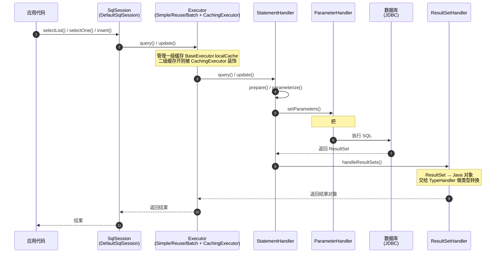

# MyBatis核心机制详解

> 适用版本：MyBatis 3.5.x、JDK 8+ 为主线
> 最后更新：2026-08-08
> 主题范围：MyBatis 定位、整体执行流程（四大核心组件逐个源码级）、`#{}` vs `${}`、Executor 三类型
> 关联笔记：[00-ORM全家桶总览与选型](00-ORM全家桶总览与选型.md)（定位与对比）、[02-MyBatis缓存与Mapper代理详解](02-MyBatis缓存与Mapper代理详解.md)（缓存/代理）、[03-MyBatis动态SQL与结果映射详解](03-MyBatis动态SQL与结果映射详解.md)、[04-MyBatis插件、分页与流式查询详解](04-MyBatis插件、分页与流式查询详解.md)

## 📋 总纲

- ① 定位：半自动 SQL Mapper，SQL 开发者写、映射框架做
- ② 启动期：SqlSessionFactoryBuilder → Configuration → SqlSessionFactory（全局唯一重量级）
- ③ 运行期链路：SqlSession → Executor → StatementHandler → ParameterHandler / ResultSetHandler，四大组件职责逐个拆
- ④ `#{}` 预编译防注入 vs `${}` 拼接有风险（最高频安全考点）
- ⑤ Executor 三类型：Simple（默认）/ Reuse / Batch，源码与适用场景

## 一、MyBatis 定位回顾

**MyBatis** 是**半自动持久层框架（SQL Mapper）**：它帮你完成「**SQL 执行 + 结果集到对象映射**」，但 **SQL 需要开发者自己写**（XML 或注解）。与全自动 ORM（Hibernate/JPA）不同，后者自动生成 SQL、开发者面向对象操作。

核心价值三条：
- ① **SQL 完全可控**：复杂查询、慢 SQL 优化直接改 SQL
- ② **结果映射灵活**：resultMap 支持任意列名 → 属性名映射、嵌套对象
- ③ **动态 SQL 强大**：if/foreach/where 按条件拼 SQL，不写字符串拼接

对应面试题：*「MyBatis 是什么？和 Hibernate/JPA 有什么区别？」* → 完整对比见 [00-ORM全家桶总览与选型](00-ORM全家桶总览与选型.md)。

## 二、整体执行流程（两大阶段）

MyBatis 运行分**启动期**（构建配置）和**运行期**（执行 SQL）两个阶段。

### 2.1 启动期：构建 SqlSessionFactory

```mermaid
flowchart TD
    A["mybatis-config.xml + Mapper XML<br/><small>输入流 Inputstream</small>"] -->|XMLConfigBuilder.parse()| B["Configuration<br/><small>全局唯一配置，解析所有 XML/注解</small>"]
    B -->|build(configuration)| C["SqlSessionFactory<br/><small>DefaultSqlSessionFactory<br/>重量级、全局单例</small>"]
    C -->|openSession()| D["SqlSession<br/><small>轻量、非线程安全、用完即关</small>"]
    style C fill:#e8f5e9
```

★ 关键点：`SqlSessionFactoryBuilder`（生命周期最短，用完即弃）→ `SqlSessionFactory`（**全局唯一、线程安全、重量级**，应用启动时构建一次）→ 由它创建 `SqlSession`。

```java
// 典型构建（应用启动时执行一次）
String resource = "mybatis-config.xml";
InputStream inputStream = Resources.getResourceAsStream(resource);
SqlSessionFactory factory = new SqlSessionFactoryBuilder().build(inputStream); // 用完即弃
```

**易错点**：SqlSessionFactory 必须单例复用（重量级，内部持有全部 MappedStatement/缓存配置）；SqlSessionFactoryBuilder 不要存起来。

### 2.2 运行期：一次查询的完整链路



### 2.3 四大核心组件逐个拆

| 组件 | 接口/实现 | 职责 | 备注 |
| --- | --- | --- | --- |
| SqlSession | `DefaultSqlSession` | 一次数据库会话入口，执行 SQL 的门面 | 轻量、非线程安全，用完 close |
| Executor | `BaseExecutor`(抽象) + `SimpleExecutor`/`ReuseExecutor`/`BatchExecutor`；可选 `CachingExecutor` 装饰 | 调度语句执行、管理一级缓存 | 二级缓存开启时被 CachingExecutor 包装 |
| StatementHandler | `PreparedStatementHandler`(默认) / `SimpleStatementHandler` / `CallableStatementHandler` | 创建并执行 JDBC Statement | 插件主要拦截点 |
| ParameterHandler | `DefaultParameterHandler` | 把方法入参绑定到 SQL 占位符 | `#{}` 在这里处理 |
| ResultSetHandler | `DefaultResultSetHandler` | 结果集 → 对象（含 resultMap 嵌套映射） | TypeHandler 负责类型转换 |

**代码说明**：理解这条链的价值在于——**缓存、插件（拦截器）都在这条链上做文章**。一级缓存在 `BaseExecutor` 内部（localCache）；二级缓存是装饰 `Executor` 的 `CachingExecutor`；插件（PageHelper 等）拦截的是 `StatementHandler` 等方法。面试问「MyBatis 如何扩展？」答案就是在这条链的某个节点插入拦截器。

### 2.4 TypeHandler（类型处理器）

**TypeHandler** 是 MyBatis 的**类型转换桥**——负责 Java 类型 ↔ JDBC 类型（数据库列）双向转换：

```
参数绑定：Java 对象 → setParameter 写入 PreparedStatement（ParameterHandler 调 TypeHandler.setParameter）
结果映射：ResultSet 列 → Java 对象（ResultSetHandler 调 TypeHandler.getResult）
```

内置处理器覆盖常用类型（String/Integer/Long/Date/BigDecimal/枚举等），按 JavaType+JdbcType 自动匹配。**自定义场景**：

| 场景 | 例子 |
| --- | --- |
| 数据库 JSON 字段 | MySQL `JSON` 列 ↔ Java `Map`/对象（如 JSONB 配置） |
| 特殊编码/加密 | 字段存储时加密、读取时解密 |
| 枚举映射 | 枚举 ↔ int/varchar 自定义规则 |

```java
// 自定义 TypeHandler：List<Integer> ↔ MySQL JSON 字符串
@MappedTypes(List.class)
@MappedJdbcTypes(JdbcType.VARCHAR)
public class IntListTypeHandler extends BaseTypeHandler<List<Integer>> {

    @Override
    public void setNonNullParameter(PreparedStatement ps, int i,
            List<Integer> parameter, JdbcType jdbcType) throws SQLException {
        ps.setString(i, parameter.toString());   // [1,2,3] 存成 "[1, 2, 3]"
    }

    // 三个 getNullableResult 重载都要实现，缺一个会在某些调用路径报错
    @Override
    public List<Integer> getNullableResult(ResultSet rs, String columnName) throws SQLException {
        return parse(rs.getString(columnName));     // 按列名取（常用）
    }
    @Override
    public List<Integer> getNullableResult(ResultSet rs, int columnIndex) throws SQLException {
        return parse(rs.getString(columnIndex));    // 按下标取
    }
    @Override
    public List<Integer> getNullableResult(CallableStatement cs, int columnIndex) throws SQLException {
        return parse(cs.getString(columnIndex));    // 存储过程出参取
    }

    private List<Integer> parse(String s) {
        if (s == null || s.isEmpty()) return null;
        // "[1, 2, 3]" → [1,2,3]，去掉括号后按逗号切分
        return Arrays.stream(s.replaceAll("[\\[\\] ]", "").split(","))
                .filter(x -> !x.isEmpty())
                .map(Integer::parseInt)
                .collect(Collectors.toList());
    }
}

// 使用：resultMap 里指定，或字段级注解
// <result column="tags" property="tags" typeHandler="com.x.IntListTypeHandler"/>
```

**代码说明**：自定义 TypeHandler 继承 `BaseTypeHandler`，实现 `setNonNullParameter`（写库）+ 三个 `getNullableResult` 重载（读库）。配置方式：XML resultMap 的 typeHandler 属性、注解 `@MappedTypes/@MappedJdbcTypes`、或注册到 mybatis-config 的 `<typeHandlers>`。**易错点**：重载方法签名（ResultSet/CallableStatement、列名/下标）都要实现，否则某些调用路径报错。

## 三、`#{}` vs `${}`（最高频安全考点）

### 3.1 核心区别

| 维度 | `#{}` | `${}` |
| --- | --- | --- |
| 处理方式 | 预编译占位符 `?`，参数走 PreparedStatement | 直接字符串拼接进 SQL |
| SQL 注入 | **安全**（参数值不会参与 SQL 解析） | **有风险**（值直接拼进 SQL） |
| 使用场景 | 绝大多数参数值 | 动态表名/列名/排序字段等结构位置 |
| 性能 | 同 SQL 可复用预编译 Statement | 每变一次值重新编译 |
| 类型处理 | 走 TypeHandler 类型转换 | 原样字符串替换（注意引号问题） |

```xml
<!-- #{}: 安全，推荐默认 -->
<select id="findByName" resultType="User">
  SELECT * FROM users WHERE name = #{name}
</select>

<!-- ${}: 拼接，仅限可信值 -->
<select id="orderBy" resultType="User">
  SELECT * FROM users ORDER BY ${column}  <!-- 必须白名单校验！ -->
</select>
```

### 3.2 注入原理演示

用户输入 `' OR '1'='1`，两种写法的差别：

```sql
-- ${} 直接拼接 → 注入成功，返回全表！
SELECT * FROM users WHERE name = '' OR '1'='1'

-- #{} 预编译 → 值被当字符串参数，注入无效
SELECT * FROM users WHERE name = ?   -- 参数: "' OR '1'='1"（原样字符串）
```

### 3.3 `${}` 正确打开方式

★ 只在**结构位置**使用（不能放占位符的地方），且必须**白名单校验**：

```java
// 错误：直接拼用户输入
// ORDER BY ${sortField}   ← 用户传 "id; DROP TABLE users" 就炸

// 正确：白名单校验
private static final Set<String> SAFE_SORT = Set.of("create_time", "id", "amount");
String column = SAFE_SORT.contains(input) ? input : "id";
// 再拼 ${column}
```

**追问**：*为什么排序字段不能用 `#{}`？* —— `#{}` 会生成 `ORDER BY ?`，数据库不允许对排序字段用绑定参数（会报语法错误或按常量排）。所以排序字段这类结构位置只能用 `${}` + 白名单。

## 四、Executor 三类型

### 4.1 类型总览

| Executor | 特点 | 适用场景 | 对应面试点 |
| --- | --- | --- | --- |
| Simple（默认） | 每次执行都创建新 Statement，不复用 | 一般场景 | 默认，最简单 |
| Reuse | 同 SQL 复用 Statement（Map 缓存 Statement 对象） | 相同 SQL 高频执行 | 省去重复 prepare |
| Batch | 批量执行：预编译一次执行多次，攒批提交 | 批量插入/更新 | 性能最高，但有坑 |

源码入口（`Configuration.newExecutor`，3.5.x）：

```java
public Executor newExecutor(Transaction transaction, ExecutorType executorType) {
    executorType = executorType == null ? defaultExecutorType : executorType;
    executorType = executorType == null ? ExecutorType.SIMPLE : executorType;
    Executor executor;
    if (ExecutorType.BATCH == executorType) {
      executor = new BatchExecutor(this, transaction);
    } else if (ExecutorType.REUSE == executorType) {
      executor = new ReuseExecutor(this, transaction);
    } else {
      executor = new SimpleExecutor(this, transaction);
    }
    // 二级缓存开关开启时，用 CachingExecutor 装饰（装饰器模式）
    if (cacheEnabled) {
      executor = new CachingExecutor(executor);
    }
    // 插件责任链包装（拦截器）
    executor = (Executor) interceptorChain.pluginAll(executor);
    return executor;
}
```

**代码说明**：这行源码串起了三个考点——① Executor 类型的选择；② 二级缓存的装饰器实现（CachingExecutor 包一层）；③ 插件的责任链包装（interceptorChain.pluginAll 在每个核心对象上包代理）。**创建 Executor 的顺序**：先选类型 → 再装饰二级缓存 → 再包插件。

### 4.2 Batch 执行器详解（重点）

```java
// 批量插入：攒批 → commit 统一 flush
SqlSession batchSession = factory.openSession(ExecutorType.BATCH);
try {
    UserMapper mapper = batchSession.getMapper(UserMapper.class);
    for (User u : users) {
        mapper.insert(u);        // 只攒批不执行（JDBC addBatch）
    }
    batchSession.commit();       // flush：executeBatch 一次执行
} finally {
    batchSession.close();
}
```

★ Batch 模式原理：底层走 JDBC `PreparedStatement.addBatch()` + `executeBatch()`，**预编译一次、批量发送**，比循环单条插入快几个数量级（省网络往返 + 省 prepare 开销）。

**批量插入能返回主键吗？**（JavaGuide 高频）

```java
// ❌ Batch 模式：主键回填不了，返回值是固定 -2，无法拿到每条自增 id
batchSession 下 insert(user) → 主键不回填

// ✅ 正确姿势：循环单条 insert + useGeneratedKeys 逐个回填（拿主键必然牺牲批量性能）
// Mapper XML
<insert id="insert" useGeneratedKeys="true" keyProperty="id">
  INSERT INTO user (name) VALUES (#{name})
</insert>
// Java：循环调用单条 insert，id 回填到 entity
for (User u : list) {
    userMapper.insert(u);   // 每插一条，u.getId() 就有值
}
```

**代码说明**：**「批量插入」和「拿回主键」在 JDBC 层面是冲突的**——`executeBatch()` 批量执行不逐条返回自增 key，`useGeneratedKeys` 只对单条 insert 生效。所以：批量导入（不要主键）用 Batch Executor 或 MP `saveBatch`；业务需要主键（如插完要关联子表）只能循环单插 + `useGeneratedKeys=true`。这是「批量插入能返回主键列表吗？」的完整答案。

**Batch 的坑**（面试加分点）：
- ① `insert/update` 返回的受影响行数不可靠（固定返回 `BATCH_UPDATE_RETURN_VALUE = -2`），不能依赖返回值判断成功
- ② 查询类操作（select）会**打断攒批**，强制 flush 之前累积的语句
- ③ 攒批的语句执行时机不可控，**SQL 报错定位难**（全批一起执行）
- ④ 批量过大要分批（如每 500 条 commit 一次），避免单条 SQL 过大

**追问**：*Spring 中怎么用 Batch？* —— 用 `SqlSessionTemplate` 时默认 Simple；可用 `SqlSessionFactory.openSession(ExecutorType.BATCH)` 手动拿批量会话，或用 MyBatis-Plus 的 `saveBatch`（内部按批次循环）。注意**事务边界**：Batch 会话要在 commit 后立即 close，避免连接被长期占用。

## 五、版本差异（3.x 演进）

| 版本 | 变化 | 面试点 |
| --- | --- | --- |
| 3.4+ | `@Mapper` 注解、注解方式替代 XML（有限） | 注解 vs XML 取舍 |
| 3.5+ | 流式查询 `Cursor<T>`、Optional 返回、`@MapperScan` 完善 | 百万数据不 OOM（详见 [04-MyBatis插件、分页与流式查询详解](04-MyBatis插件、分页与流式查询详解.md)） |
| 3.5.x 最新 | 基于 Java 8 时间 API、ResultHandler 增强 | 一般不问 |
| MyBatis-Spring 2.x | 与 Spring 5/6 集成，SqlSessionTemplate 线程安全 | Spring 集成（详见 [02-MyBatis缓存与Mapper代理详解](02-MyBatis缓存与Mapper代理详解.md)） |

**代码说明**：注解方式（`@Select`/`@Insert`）适合**简单 SQL**；XML 适合**动态 SQL/复杂映射**。生产惯例：简单单表用注解，复杂查询用 XML，二者可混用（同名 id 会冲突，别重复定义）。

## 六、面试问答与场景题

### Q1: MyBatis 的整体执行流程？

**答案**：启动期 `SqlSessionFactoryBuilder` 解析配置构建全局唯一的 `SqlSessionFactory`；运行期 `SqlSession` 作为门面，把调用委托给 `Executor`，`Executor` 调度 `StatementHandler` 操作 JDBC，`ParameterHandler` 绑定参数、`ResultSetHandler` 映射结果集。缓存（一级在 Executor 内、二级装饰 Executor）和插件（责任链包装四大对象）都挂在这条链上。

### Q2: `#{}` 和 `${}` 有什么区别？

**答案**：`#{}` 是预编译占位符，值走 PreparedStatement 参数绑定，**防 SQL 注入**；`${}` 是字符串直接拼接进 SQL，**有注入风险**。参数值用 `#{}`；动态表名/排序字段等结构位置只能用 `${}`，且必须白名单校验。

### Q3: Executor 有哪几种？

**答案**：三种：Simple（默认，每次新建 Statement）、Reuse（复用同 SQL 的 Statement）、Batch（攒批批量执行）。批量插入用 Batch 性能最高，但返回值不可靠、查询会打断攒批。

### 场景题：慢 SQL 监控怎么做？

拦截 `StatementHandler.prepare`（或 Executor.query），`BoundSql.getSql()` 拿真实 SQL，`proceed()` 前后计时。完整实现见 [04-MyBatis插件、分页与流式查询详解](04-MyBatis插件、分页与流式查询详解.md)。

## 参考资料

- [MyBatis 官方文档：Mapper XML / 动态 SQL / Java API](https://mybatis.org/mybatis-3/)，查询日期：2026-08-08
- [聊聊 MyBatis 缓存机制（美团技术团队）](https://tech.meituan.com/2018/01/19/mybatis-cache.html)，查询日期：2026-08-08
- 参考素材：《MyBatis核心机制.md》二、三、四章
