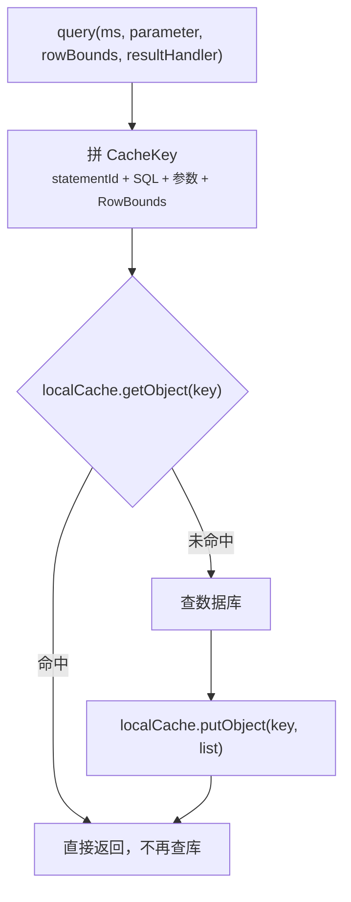
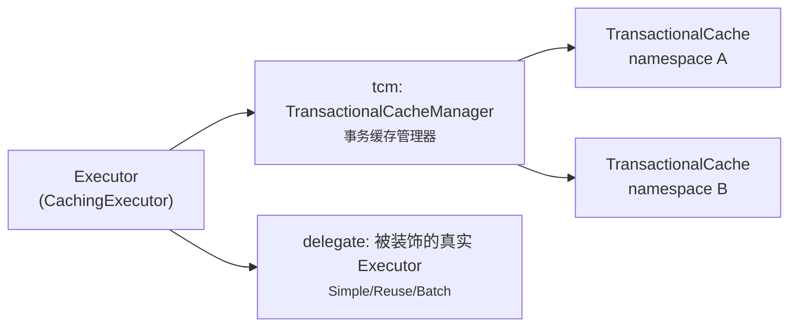
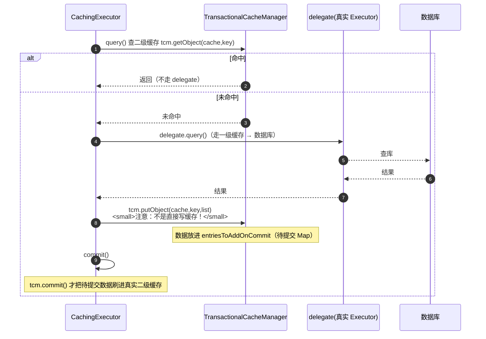
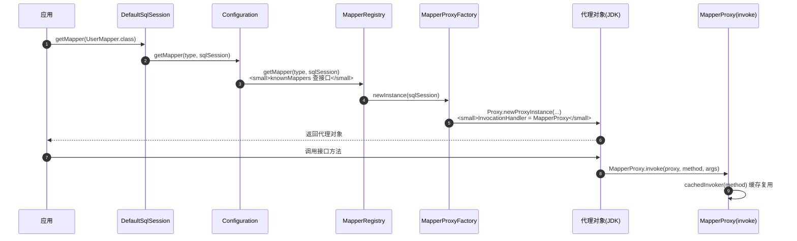

# MyBatis缓存与Mapper代理详解

> 适用版本：MyBatis 3.5.x、MyBatis-Spring 2.x、JDK 8+ 为主线
> 最后更新：2026-08-08
> 主题范围：一级缓存（源码级）、二级缓存（源码级+为什么不推荐）、Spring 集成后一级缓存「几乎失效」的真相、Mapper 动态代理（MapperProxy 源码）、方法重载不支持的原因
> 关联笔记：[01-MyBatis核心机制详解](01-MyBatis核心机制详解.md)（执行链路/Executor）、[00-ORM全家桶总览与选型](00-ORM全家桶总览与选型.md)

## 📋 总纲

- ① 缓存体系全景：一级（SqlSession 级）/ 二级（namespace 级）两级结构
- ② 一级缓存源码：BaseExecutor.localCache → PerpetualCache（HashMap），失效条件逐个拆
- ③ 二级缓存源码：CachingExecutor 装饰器 + TransactionalCache 事务缓存，commit 才生效
- ④ 生产为什么关二级缓存：脏数据场景拆解
- ⑤ Spring 集成后一级缓存「几乎失效」：SqlSessionTemplate 每次新建 SqlSession 的真相
- ⑥ Mapper 代理：MapperProxy → MapperMethod → MappedStatement 绑定链路，方法重载为什么不支持

## 一、缓存体系全景

| 缓存 | 作用域 | 默认 | 存储位置 | 失效条件 |
| --- | --- | --- | --- | --- |
| 一级缓存 | 单个 SqlSession 内 | **开启**（localCacheScope=SESSION） | `BaseExecutor.localCache`（PerpetualCache=HashMap） | 同会话内增删改、手动 clearCache、commit/close |
| 二级缓存 | namespace（Mapper）级，跨 SqlSession | **关闭** | `CachingExecutor` 内 tcm → namespace 对应 Cache | 该 namespace 的增删改（flushCache）、手动清空 |

执行顺序（二级缓存开启时）：**二级缓存 → 一级缓存 → 数据库**。

## 二、一级缓存（源码级）

### 2.1 结构

```
SqlSession ──持有──► Executor（BaseExecutor）
                        ├─ localCache: PerpetualCache  ← 一级缓存本体
                        │     └─ 内部就是 HashMap<Object, Object>
                        └─ deferredLoads: ConcurrentLinkedQueue  ← 懒加载关联队列
```

**代码说明**：一级缓存不是一个独立组件，而是 `BaseExecutor` 的成员变量 `localCache`，类型 `PerpetualCache`——它对 Cache 接口的最基本实现，**内部就是 HashMap**，无容量限制、无过期策略。

### 2.2 查询流程（BaseExecutor.query）



★ 缓存 key 的构成（`CacheKey`）：statementId + SQL + 参数值 + RowBounds offset/limit。**参数不同、SQL 不同、分页不同 → key 不同 → 不命中**。

**一级缓存命中的 5 个完整条件**（面试加分）：

| 条件 | 说明 |
| --- | --- |
| ① 相同 SqlSession | 会话级缓存，跨会话必然不命中 |
| ② 相同 namespace | 同一个 Mapper |
| ③ 相同 statement | 同一个 Mapper 的同一个方法（id 相同） |
| ④ 相同 SQL + 参数 | CacheKey 完全一致 |
| ⑤ 中间无 clearCache/CUD | 任何增删改或 clearCache 都会清缓存 |

**代码说明**：5 个条件任一不满足都不命中。尤其第 ⑤ 条——同会话内先查了再 update，缓存就清了，第二次查还是查库。这也是「为什么同会话内两条相同 SQL，第二次没命中缓存」的排查思路。

### 2.3 失效条件逐个拆

| 场景 | 是否失效 | 原因（源码） |
| --- | --- | --- |
| 同会话内执行 update/insert/delete | ✅ 失效 | `BaseExecutor.update()` 里 `clearLocalCache()`（除 select 外都清） |
| 手动调用 `sqlSession.clearCache()` | ✅ 失效 | 直接 clearLocalCache |
| `commit()` / `close()` / `rollback()` | ✅ 失效 | commit/rollback 会 clearLocalCache；close 释放 |
| 查询条件/参数不同 | ✅ 不命中 | CacheKey 不同 |
| 另一个 SqlSession 修改数据 | ❌ **不失效（脏读！）** | 一级缓存只在本 SqlSession 内可见，跨会话无法感知 |

**易错点**：一级缓存是**会话私有**的——sqlSession1 查了数据，sqlSession2 改了同一行，sqlSession1 再查**还是旧数据**（脏读）。这正是「一级缓存只在数据库会话内部共享」的实验结论（美团博客实验3）。**生产上长生命周期 SqlSession 是坑**：一次会话内数据被别处改了，这边一直读缓存旧值。

### 2.4 localCacheScope=STATEMENT

```xml
<settings>
  <setting name="localCacheScope" value="STATEMENT"/>
</settings>
```

**代码说明**：STATEMENT 级别 = 缓存只对**当前这一个 Statement** 有效，执行完即清。适用于**每次查询都要最新数据**的场景，代价是放弃会话内缓存。默认 SESSION。

## 三、二级缓存（源码级）

### 3.1 结构：装饰器模式



★ 开启方式（XML）：`<cache/>` 标签放 Mapper XML 里，或注解 `@CacheNamespace`。默认实现 `PerpetualCache`（本地 HashMap），可配 `LRU`/`FIFO`/`Soft`/`Weak` 等 eviction 策略和 `flushInterval`/`size`。

### 3.2 查询流程：二级缓存 → 一级缓存 → 数据库



★ **关键源码点**：`tcm.putObject` 并不是直接写缓存，而是把数据放进 `entriesToAddOnCommit`（**待提交 Map**）。真正写入二级缓存的时机是 **`commit()`**：

```java
// CachingExecutor.commit
public void commit(boolean required) throws SQLException {
    delegate.commit(required);
    tcm.commit();   // 把 entriesToAddOnCommit 刷进真实缓存
}
```

**代码说明**：这就是面试题「*二级缓存为什么 commit 之后才生效？*」的答案——`TransactionalCache` 把写操作延迟到事务提交，保证**未提交事务的数据不进缓存**（避免读到未提交数据）。所以：
- 不开事务/不 commit → 查询结果**永远不进二级缓存**（实验1：命中率 0）
- 提交后 → 数据进缓存，跨 SqlSession 命中（实验2：命中率 0.5）

### 3.3 失效条件

- ① 该 namespace 内执行增删改 → `flushCacheIfRequired(ms)` 清空该 namespace 的缓存
- ② `<cache flushInterval="60000"/>` 定时过期
- ③ 手动 `evictCache` / 配置 eviction 策略（LRU 等）

## 四、为什么生产不建议开二级缓存（重点）

### 4.1 脏数据场景拆解

★ 场景一：**多表查询**。查询 A 表 join B 表的 SQL 缓存在 **A 的 namespace** 下；但更新 B 表时只清 **B 的 namespace** 缓存 → A 的缓存没清 → **读到旧数据**。

★ 场景二：**分布式多实例**。默认 Cache 实现是**本机内存**（PerpetualCache），实例1 更新了数据，实例2 的二级缓存还是旧的 → **必然脏读**。

★ 场景三：**共享表/第三方表**。多个 namespace 操作同一张表，各自缓存互不清 → 脏数据。

### 4.2 官方/社区结论

> MyBatis 二级缓存**使用条件苛刻**（单机、单 namespace 独占表、无并发写），实际生产**多建议关闭**，用 Redis 等外部缓存替代。美团技术团队原文结论：「MyBatis 缓存特性在生产环境中进行关闭，单纯作为一个 ORM 框架使用可能更为合适」。

```xml
<!-- 全局关闭二级缓存（默认就是关的；明确关闭更稳妥） -->
<settings>
  <setting name="cacheEnabled" value="false"/>
</settings>
```

**追问**：*那想用缓存怎么办？* —— 业务缓存走 **Redis/Caffeine**（应用层控制失效），MyBatis 只负责 ORM。一级缓存默认开可保留（会话短、天然隔离），但要注意跨会话脏读。

## 五、Spring 集成后一级缓存「几乎失效」的真相

### 5.1 现象

Spring 项目里，同一个 Service 方法内连续查两次相同数据，**第二次还是查库**？—— 因为 Spring 集成的 SqlSession 是**每次操作新建**的。

### 5.2 原理

| 组件 | 行为 |
| --- | --- |
| 原生 MyBatis | 一个 SqlSession 用到底，一级缓存同会话生效 |
| MyBatis-Spring 的 `SqlSessionTemplate` | 每个 Mapper 方法调用时**从 SqlSessionUtils 获取新 SqlSession**（或复用已绑定事务的），用后即 close |
| 无事务 | 每次方法调用 = 新 SqlSession = **新一级缓存**，查询间不共享 |
| 有事务（@Transactional） | 整个事务内**绑定同一个 SqlSession**，一级缓存才真正生效 |

**代码说明**：MyBatis-Spring 里 `SqlSessionTemplate` 是**线程安全**的（对比原生 SqlSession 非线程安全），它按「**每操作一连接**」或「**每事务一连接**」获取 SqlSession。所以：
- **无事务**：一级缓存基本失效（每次查都是新会话）——但这反而**避免了脏读**
- **有事务**：事务内一级缓存生效（同一 SqlSession 复用）

### 5.3 面试回答模板

*「为什么说 Spring 集成后 MyBatis 一级缓存几乎失效？」* → 因为 MyBatis-Spring 的 SqlSessionTemplate 默认**每次数据库操作新建并关闭 SqlSession**，一级缓存是 SqlSession 级的，会话一关缓存就没了；只有开启 @Transactional 时整个事务绑定同一 SqlSession，一级缓存才发挥作用。所以 Spring 项目里一级缓存「不可依赖」，命中完全看事务边界。

## 六、Mapper 动态代理（源码级）

### 6.1 完整链路



**代码说明**：Mapper 接口没有实现类却能用，是因为 MyBatis 启动时把每个 Mapper 接口注册到 `MapperRegistry`（`knownMappers` Map），运行时用 **JDK 动态代理**（`Proxy.newProxyInstance`）为接口生成代理对象，调用处理器是 `MapperProxy`。

### 6.2 MapperProxy.invoke（3.5.x）

```java
public Object invoke(Object proxy, Method method, Object[] args) throws Throwable {
  try {
    if (Object.class.equals(method.getDeclaringClass())) {
      // Object 的方法（toString/hashCode/equals）直接调用本身，不走 SQL
      return method.invoke(this, args);
    } else {
      // 业务方法 → 从 methodCache 取缓存的 MapperMethodInvoker 并调用
      return cachedInvoker(method).invoke(proxy, method, args, sqlSession);
    }
  } catch (Throwable t) {
    throw ExceptionUtil.unwrapThrowable(t);
  }
}
```

★ 每个接口方法对应一个 `MapperMethodInvoker`（内部持有 `MapperMethod`），**第一次调用时创建并缓存**（methodCache），后续复用——方法调用的解析只做一次。

### 6.3 MapperMethod：方法 → SQL 的绑定

```
MapperMethod 初始化（构造时解析一次）
  ├─ SqlCommand：从 method.getName() 到 MappedStatement 的映射
  │    └─ 规则：configuration.getMappedStatement(接口全限定名.方法名)
  │             → 找到 XML 里对应 id（如 com.x.UserMapper.selectById）
  └─ MethodSignature：入参/返回类型解析（是否 @Param、返回 List/Optional/Cursor...）
```

执行时（`execute()` 方法）：
- 返回 List → `sqlSession.selectList`
- 返回单个对象 → `selectOne`
- 返回 int → `update/insert/delete`
- 返回 Cursor → `selectCursor`
- 返回 Optional → selectOne 包装

### 6.4 方法重载为什么不支持（面试点）

**答案**：Mapper 接口方法到 SQL 的绑定依据是**方法名**（`接口全限定名.方法名` 作为 MappedStatement 的 id）。**重载方法同名 → id 冲突**，MyBatis 无法区分该用哪个 SQL，启动时就会报错（`MapperStatement already contains value` 或绑定异常）。所以：

```java
// ❌ 不支持：同名重载
List<User> findByName(String name);
List<User> findByName(String name, int limit);

// ✅ 正确：方法名唯一（或 @Param + XML 里区分，但方法名仍要不同）
List<User> findByName(String name);
List<User> findByNameWithLimit(@Param("name") String name, @Param("limit") int limit);
```

**代码说明**：绑定规则 = **方法全限定名 ↔ XML id 一一对应**（也可以 `@Select` 注解，id 同样是全限定方法名）。这是「Mapper 接口方法重载为什么不支持」的完整答案：绑定粒度是方法名，重载会让绑定歧义。

### 6.5 Mapper 绑定方式对比

| 方式 | 用法 | 适用 |
| --- | --- | --- |
| XML namespace + id | `namespace="com.x.UserMapper"` + `<select id="selectById">` | 复杂 SQL/动态 SQL |
| 注解 | `@Select("SELECT ...")` | 简单 SQL |
| 接口默认方法（default） | 接口里写 default 方法 | 纯 Java 逻辑（不走 SQL） |
| Spring `@MapperScan`/`@Mapper` | 注册扫描 | Spring 集成标配 |

**易错点**：namespace 必须等于接口全限定名，id 必须等于方法名，否则启动报 `BindingException: Invalid bound statement`。

## 七、面试问答与场景题

### Q1: Mapper 接口没有实现类，为什么能调用？

**答案**：MyBatis 用 JDK 动态代理为 Mapper 接口生成代理对象（MapperProxy 实现 InvocationHandler）。调用方法时 `MapperProxy.invoke` 根据方法全限定名找到对应 MappedStatement，交给 SqlSession 执行。接口方法 → MapperMethod → MappedStatement（SQL）三层绑定。

### Q2: 一级缓存和二级缓存有什么区别？

**答案**：一级缓存是 SqlSession 级的（BaseExecutor 内 HashMap），默认开，同会话相同查询直接命中，增删改/commit/close 失效；二级缓存是 namespace 级跨 SqlSession 的，默认关，需 CachingExecutor + TransactionalCache，commit 后才写入缓存。生产多关二级缓存用 Redis 替代（脏数据风险）。

### Q3: 二级缓存在分布式下脏读怎么根治？

**答案**：根治不是调配置而是**换实现**——默认缓存是本机内存，多实例必然不一致；要么用集中式缓存实现 Cache 接口（开发成本高），要么直接关二级缓存、业务缓存走 Redis（推荐，成本更低更安全）。

### 场景题：排查「事务内第一次查询慢、第二次快」

事务内同一 SqlSession → 一级缓存命中，正常现象；要验证可用 `sqlSession.clearCache()` 或拆两个事务对比。注意 Spring 无事务场景一级缓存不生效，别拿「缓存了」当结论。

## 参考资料

- [聊聊 MyBatis 缓存机制（美团技术团队，源码级）](https://tech.meituan.com/2018/01/19/mybatis-cache.html)，查询日期：2026-08-08
- [MyBatis 官方文档：缓存配置](https://mybatis.org/mybatis-3/sqlmap-xml.html#cache)，查询日期：2026-08-08
- [从源码的角度弄懂 MyBatis 动态代理开发原理](https://www.cnblogs.com/bigcoder84/p/18147377)，查询日期：2026-08-08
- 参考素材：《MyBatis核心机制.md》二、五、八、十章
