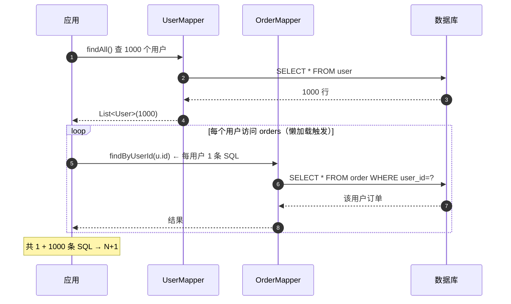

# MyBatis动态SQL与结果映射详解

> 适用版本：MyBatis 3.5.x、JDK 8+ 为主线
> 最后更新：2026-08-08
> 主题范围：动态 SQL 全标签（if/choose/where/set/foreach/trim/bind）逐个拆、resultMap vs resultType、association/collection 嵌套映射、N+1 问题、延迟加载（懒加载）
> 关联笔记：[01-MyBatis核心机制详解](01-MyBatis核心机制详解.md)、[02-MyBatis缓存与Mapper代理详解](02-MyBatis缓存与Mapper代理详解.md)、[04-MyBatis插件、分页与流式查询详解](04-MyBatis插件、分页与流式查询详解.md)

## 📋 总纲

- ① 动态 SQL 本质：OGNL 表达式驱动的 SQL 片段拼装，9 个标签逐个拆
- ② 常见坑：`<if>` 判空、`<where>`/`<set>` 前缀问题、`<foreach>` 大 IN 分批
- ③ resultMap vs resultType 选择
- ④ association（一对一）/ collection（一对多）嵌套映射两种实现
- ⑤ N+1 问题：嵌套查询是怎么产生的、怎么解决
- ⑥ 延迟加载原理与 Spring 下的坑

## 一、动态 SQL 本质

**动态 SQL** = 用 OGNL 表达式按参数条件**拼 SQL 片段**。MyBatis 解析 XML 时把动态标签编译成 SQL 节点树，执行时根据参数求值决定最终 SQL。解决的是「手写字符串拼接 SQL」的痛点（可读性差、易注入、易错）。

**OGNL 表达式**：`<if test="name != null">` 里的 `name != null` 就是 OGNL，直接访问方法参数（单参数时是参数对象本身，多参数时是 ParamMap）。

## 二、动态 SQL 标签逐个拆

### 2.1 标签总览

| 标签 | 作用 | 典型场景 |
| --- | --- | --- |
| `<if>` | 条件成立才拼 SQL 片段 | 可选查询条件 |
| `<choose>/<when>/<otherwise>` | switch-case 多选一 | 优先级互斥条件 |
| `<where>` | 自动加 WHERE 并去除首个 AND/OR | 多条件 and 拼接 |
| `<set>` | 自动加 SET 并去除末尾逗号 | 动态更新字段 |
| `<trim>` | 通用前后缀修剪（where/set 的底层实现） | 自定义修剪 |
| `<foreach>` | 循环拼 SQL（IN 列表/批量 insert） | IN 查询、批量插入 |
| `<bind>` | 变量绑定/字符串处理 | like 拼接、复用表达式 |
| `<sql>/<include>` | SQL 片段抽取复用 | 公共列、公共 where |

### 2.2 if（最常用）

```xml
<select id="findByCondition" resultType="User">
  SELECT * FROM user
  WHERE 1=1
  <if test="name != null and name != ''">
    AND name = #{name}
  </if>
  <if test="status != null">
    AND status = #{status}
  </if>
</select>
```

★ 坑一：**判空要完整**——`test="name != null"` 只判 null 不够，空串 `""` 也会通过，建议 `name != null and name != ''`。
★ 坑二：**WHERE 1=1 是妥协写法**——性能无损但 SQL 不优雅，更优解用 `<where>`。

### 2.3 where / set（自动修剪）

```xml
<!-- where: 自动加 WHERE，并去掉第一个 AND/OR -->
<select id="findByCondition" resultType="User">
  SELECT * FROM user
  <where>
    <if test="name != null">AND name = #{name}</if>
    <if test="status != null">AND status = #{status}</if>
  </where>
</select>
<!-- 条件全空 → 无 WHERE；有 AND 开头 → 自动去掉 -->

<!-- set: 自动加 SET，去掉末尾逗号 -->
<update id="updateSelective">
  UPDATE user
  <set>
    <if test="name != null">name = #{name},</if>
    <if test="status != null">status = #{status},</if>
  </set>
  WHERE id = #{id}
</update>
```

**代码说明**：`<where>` 等价于 `<trim prefix="WHERE" prefixOverrides="AND |OR ">`；`<set>` 等价于 `<trim prefix="SET" suffixOverrides=",">`。**set 的坑**：如果所有 if 都不成立，SQL 变成 `UPDATE user SET WHERE id=?` → 语法错误，业务上要保证至少一个字段。

### 2.4 choose/when/otherwise（多选一）

```xml
<select id="findByPriority" resultType="User">
  SELECT * FROM user
  <where>
    <choose>
      <when test="name != null">AND name = #{name}</when>
      <when test="email != null">AND email = #{email}</when>
      <otherwise>AND status = 1</otherwise>  <!-- 兜底 -->
    </choose>
  </where>
</select>
```

**代码说明**：类似 Java switch——**从上到下第一个成立的 when 生效**，都不成立走 otherwise。与多个 `<if>` 的区别：if 是「可多选叠加」，choose 是「互斥单选」。

### 2.5 foreach（IN 列表 / 批量插入）

```xml
<!-- IN 查询 -->
<select id="findByIds" resultType="User">
  SELECT * FROM user
  WHERE id IN
  <foreach collection="ids" item="id" open="(" separator="," close=")">
    #{id}
  </foreach>
</select>

<!-- 批量插入 -->
<insert id="batchInsert">
  INSERT INTO user (name, status)
  VALUES
  <foreach collection="list" item="u" separator=",">
    (#{u.name}, #{u.status})
  </foreach>
</insert>
```

| 属性 | 说明 |
| --- | --- |
| collection | 入参集合名：List 传 `list`，数组传 `array`，@Param 指定名则用指定名 |
| item | 循环变量名 |
| open/close | 前缀/后缀（`(` / `)`） |
| separator | 元素分隔符（`,`） |

★ **大 IN 分批问题（面试点）**：`<foreach>` 拼 IN 列表，**列表很大时不建议直接拼**，原因：
- ① 单个 SQL 过长，超过数据库 `max_allowed_packet`（MySQL 默认 4MB~64MB）报错
- ② 占位符数量爆炸（`#{}` 每个值一个 `?`），PreparedStatement 有 **最大占位符限制**（Oracle 1000，MySQL 依赖配置）
- ③ 执行计划缓存失效（SQL 文本变化 → 无法复用预编译）

**分批方案**：按 **500~1000 个 id 一批**循环查，结果合并；或用临时表 join。代码示例：

```java
// 分批查询，每批 500
List<User> result = new ArrayList<>();
for (int i = 0; i < ids.size(); i += 500) {
    List<Integer> batch = ids.subList(i, Math.min(i + 500, ids.size()));
    result.addAll(mapper.findByIds(batch));   // 每批一个 IN (500)
}
```

### 2.6 bind / sql / include

**模糊查询 like 的三种写法**（高频面试点）：

```xml
<!-- 写法① bind（推荐，防注入、跨库友好） -->
<select id="findByName" resultType="User">
  <bind name="pattern" value="'%' + name + '%'"/>
  SELECT * FROM user WHERE name LIKE #{pattern}
</select>

<!-- 写法② 拼接参数（✅ 安全，用 #{} 拼在两侧） -->
<select id="findByName2" resultType="User">
  SELECT * FROM user WHERE name LIKE CONCAT('%', #{name}, '%')
</select>

<!-- 写法③ ${} 拼接（❌ 有注入风险，用户输入直接拼进 SQL） -->
<select id="findByName3" resultType="User">
  SELECT * FROM user WHERE name LIKE '%${name}%'   <!-- 不推荐！ -->
</select>
```

**代码说明**：写法① `bind` 在 SQL 外拼好 `%` 再用 `#{}` 传值，值走预编译**防注入**；写法② `CONCAT` 把 `%` 留在 SQL 里、值走 `#{}`，同样安全但 MySQL 专用；写法③ `${}` 把用户输入直接拼进 LIKE，**能被 `%` 和引号注入**（如输入 `%' OR '1'='1` 全表匹配），生产禁用。面试答「like 怎么写」说清三种及安全性即可。

```xml
<!-- bind: 也常用于跨数据库方言适配（value 里写数据库函数） -->
<select id="findAll" resultType="User">
  SELECT <include refid="userColumns"/> FROM user
</select>
```

```xml
<!-- sql/include: 公共列复用 -->
<sql id="userColumns">id, name, status, create_time</sql>
```

**代码说明**：`<bind>` 也常用于**跨数据库方言适配**（value 里写数据库函数）。`<sql>` 里可传参数：`<include refid="cols"><property name="t" value="u"/></include>`，内部 `${t}.id` 引用。

## 三、resultMap vs resultType

### 3.1 对比

| 维度 | resultType | resultMap |
| --- | --- | --- |
| 映射方式 | 列名 = 属性名（自动映射，下划线转驼峰需配置 mapUnderscoreToCamelCase） | 手动指定 column ↔ property |
| 适用 | 简单一一对应 | 列名不同、嵌套对象、关联映射 |
| 灵活性 | 低 | 高（association/collection/typeHandler/discriminator） |
| 性能 | 快（无额外解析） | 略慢（嵌套映射开销） |

```xml
<!-- 列名与属性名不一致 -->
<resultMap id="userMap" type="User">
  <id property="id" column="user_id"/>
  <result property="name" column="user_name"/>
</resultMap>
```

**易错点**：`mapUnderscoreToCamelCase=true` 后，`user_name` 列 → `userName` 属性自动映射，**但嵌套 resultMap 里的手动映射优先级更高**。

### 3.2 association / collection（重点）

```xml
<!-- association: 一对一（user → 一个 dept） -->
<resultMap id="userWithDept" type="User">
  <id property="id" column="id"/>
  <result property="name" column="name"/>
  <association property="dept" javaType="Dept">
    <id property="id" column="dept_id"/>
    <result property="name" column="dept_name"/>
  </association>
</resultMap>

<!-- collection: 一对多（user → 多个 order） -->
<resultMap id="userWithOrders" type="User">
  <id property="id" column="id"/>
  <result property="name" column="name"/>
  <collection property="orders" ofType="Order">
    <id property="id" column="order_id"/>
    <result property="amount" column="amount"/>
  </collection>
</resultMap>
```

★ 两种嵌套实现方式（面试核心）：

| 方式 | 写法 | 原理 | 问题 |
| --- | --- | --- | --- |
| **嵌套结果**（Nested Results） | association/collection 直接内嵌 result 子元素 | 一条 JOIN SQL 查出来，ResultSetHandler 按行拆分组装 | SQL 复杂、列多；一对多会**结果行重复**（需 id 去重） |
| **嵌套查询**（Nested Select） | association/collection 用 `select` 属性指向另一条查询 | 主查询 N 条 → 每条再发一条查询 | **N+1 问题** |

```xml
<!-- 嵌套查询写法（小心 N+1！） -->
<resultMap id="userWithOrdersLazy" type="User">
  <id property="id" column="id"/>
  <collection property="orders" column="id"
              select="com.x.OrderMapper.findByUserId"   <!-- 每行再查一次 -->
              fetchType="lazy"/>
</resultMap>
```

### 3.3 discriminator（鉴别器，面试低频但要知道）

**discriminator** 按某列的值**动态选择不同的 resultMap**——主要用于**继承关系映射**（同表不同类型不同字段集）：

```xml
<resultMap id="vehicleMap" type="Vehicle">
  <id property="id" column="id"/>
  <result property="name" column="name"/>
  <discriminator javaType="int" column="vehicle_type">
    <case value="1" resultMap="carMap"/>      <!-- 类型 1 用汽车映射 -->
    <case value="2" resultMap="truckMap"/>    <!-- 类型 2 用卡车映射 -->
  </discriminator>
</resultMap>
```

**代码说明**：类似 Java 的 switch——按 `vehicle_type` 列值路由到对应 resultMap。面试答「resultMap 高级特性」时可提 discriminator（继承映射）+ TypeHandler（类型转换）+ constructor（构造注入）作为加分项。

## 四、N+1 问题（重点）

### 4.1 什么是 N+1

**嵌套查询**导致：查 1 条主记录 → 关联子查询 N 次 → 共 **1+N 条 SQL**。数据量大时**数据库往返爆炸**（1000 个用户 → 1001 条 SQL）。



```java
// 典型 N+1：查出 1000 个用户，访问 orders 时逐个查订单
List<User> users = userMapper.findAll();          // 1 条 SQL
for (User u : users) {
    u.getOrders();   // 每个用户 1 条 SQL → 1000 条！懒加载触发时更隐蔽
}
```

### 4.2 怎么解决

| 方案 | 做法 | 适用 |
| --- | --- | --- |
| ① 嵌套结果（JOIN 一条查） | 用 `<collection>` 内嵌结果，一条 JOIN 搞定 | 数据量适中、列可控 |
| ② 手动批量查询 | 先查主表 → 收集 id 集合 → `IN` 批量查子表 → 内存组装 | 大列表、两表 |
| ③ 分页/按需加载 | 只查需要的关联（DTO 投影） | 列表页 |
| ④ 二级缓存兜底（慎用） | 子查询结果缓存 | 低频变更数据 |

```java
// 方案②：批量查询替代 N+1（推荐）
List<User> users = userMapper.findAll();                    // 1 条
List<Long> ids = users.stream().map(User::getId).toList();
List<Order> orders = orderMapper.findByUserIds(ids);        // 1 条 IN 查询
Map<Long, List<Order>> byUser = orders.stream()
        .collect(Collectors.groupingBy(Order::getUserId));  // 内存组装
```

**代码说明**：面试答「N+1 怎么解决」说清两点：**产生原因**（嵌套查询 select 属性，一条主查 N 条子查）和**解决手段**（改嵌套结果 JOIN、改 IN 批量查、DTO 投影）。MyBatis 里 `<collection select>` 是元凶，能用嵌套结果就别用嵌套查询。

## 五、延迟加载（懒加载）

### 5.1 机制

**懒加载** = 嵌套查询**不立即执行**，首次访问关联属性时才发查询。核心实现：
- ① 结果对象返回的是 **Javassist/CGLIB 代理对象**（enhanced lazy loading）
- ② 代理拦截 getter（如 `getOrders()`），首次访问触发 `Executor` 查询并填充
- ③ 配置开关：`lazyLoadingEnabled=true`（默认 false）+ `aggressiveLazyLoading`（3.5.x 起默认 false，即按需加载）

```xml
<settings>
  <setting name="lazyLoadingEnabled" value="true"/>
  <!-- aggressiveLazyLoading 默认 false：只加载被访问的属性；true：访问任一属性加载全部 -->
</settings>
```

### 5.2 坑

★ 坑一：**Spring 下懒加载与 SqlSession 关闭冲突**——代理触发查询需要活着的 SqlSession/连接，Service 方法返回后 SqlSession 已关（无事务时）→ 访问关联属性报 `TooManyResultsException` 或类似异常（对比 JPA 的 LazyInitializationException，详见 [06-JPA与Spring Data JPA详解](06-JPA与Spring Data JPA详解.md)）。
★ 坑二：懒加载的查询本质还是**嵌套查询**——列表场景=N+1，**别为懒加载牺牲性能**。
★ 坑三：代理对象**跨层传递**（Service 返回给 Controller/序列化）容易踩坑，建议在 Service 内把关联数据取完再返回 DTO。

**生产建议**：能用 JOIN 嵌套结果就别开懒加载；确实需要按需加载时，保证**在事务内**访问完关联属性再返回。

## 六、面试问答与场景题

### Q1: resultMap 和 resultType 有什么区别？

**答案**：resultType 是简单自动映射（列名=属性名），适合简单查询；resultMap 是手动映射，支持列名不一致、association/collection 嵌套、TypeHandler，适合复杂映射。复杂查询必须 resultMap。

### Q2: 动态 SQL 的 where 和 set 解决了什么问题？

**答案**：where 自动处理 WHERE 前缀和首个 AND/OR，set 自动处理 SET 和末尾逗号——避免手写字符串拼接的边界错误（空条件/多逗号）。

### Q3: foreach 拼大 IN 为什么不建议？怎么分批？

**答案**：单条 SQL 超长（超 max_allowed_packet）、占位符数量限制（Oracle 1000）、预编译失效。按 500~1000 一批循环查再合并。

### 场景题：一对一/一对多映射，查出来数据错乱（重复行）？

**答案**：一对多嵌套结果会因 JOIN 产生重复行，`<id>` 元素必须正确配置——MyBatis 靠 `<id>` 判断对象是否已存在来去重合并。id 配错 → 每个订单都包一个 User 或对象错乱。修复：确保 `<id>` 唯一且正确。

### 追问：懒加载实现原理？

**答案**：返回对象是 Javassist/CGLIB 动态代理，getter 被拦截后首次触发关联查询填充。需要 lazyLoadingEnabled 开启；Spring 下注意 SqlSession 生命周期（事务内取完）。

## 参考资料

- [MyBatis 官方文档：动态 SQL](https://mybatis.org/mybatis-3/dynamic-sql.html)，查询日期：2026-08-08
- [MyBatis 官方文档：Result Maps](https://mybatis.org/mybatis-3/sqlmap-xml.html#Result_Maps)，查询日期：2026-08-08
- 参考素材：《MyBatis核心机制.md》五、七、十章
