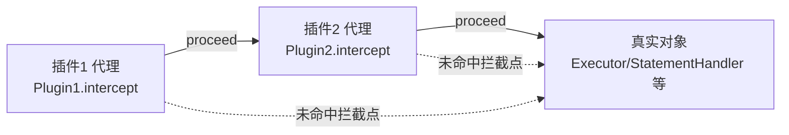
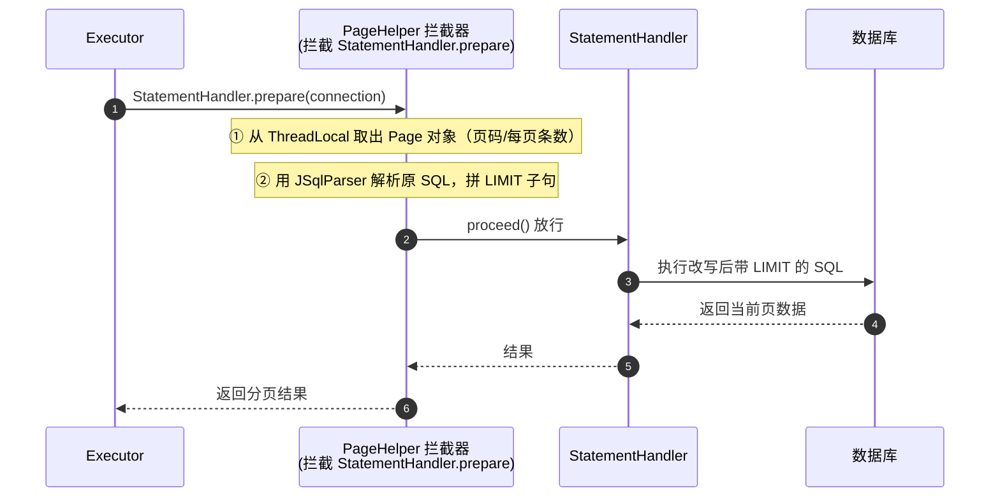

# MyBatis插件、分页与流式查询详解

> 适用版本：MyBatis 3.5.x、PageHelper 5.x/6.x、JDK 8+ 为主线
> 最后更新：2026-08-08
> 主题范围：插件（拦截器）机制源码级（四大对象、责任链、Plugin.wrap）、PageHelper 物理分页原理（拦截点、count 生成、与逻辑分页对比）、慢 SQL 监控插件实战、Cursor 流式查询
> 关联笔记：[01-MyBatis核心机制详解](01-MyBatis核心机制详解.md)（执行链路）、[03-MyBatis动态SQL与结果映射详解](03-MyBatis动态SQL与结果映射详解.md)

## 📋 总纲

- ① 插件机制：拦截四大核心对象的方法，动态代理责任链实现
- ② 源码：Plugin.wrap 包装逻辑、@Intercepts/@Signature 解析
- ③ PageHelper 分页原理：拦截哪个方法、LIMIT 怎么加、count 怎么生成
- ④ 逻辑分页 vs 物理分页：RowBounds 为什么是坑
- ⑤ 慢 SQL 监控插件实战（完整代码）
- ⑥ Cursor 流式查询：百万数据不 OOM

## 一、插件（拦截器）机制

### 1.1 能拦截什么

MyBatis 允许拦截**四大核心对象**的方法，实现分页、SQL 改写、审计、监控等增强：

| 可拦截对象 | 可拦截方法 | 典型用途 |
| --- | --- | --- |
| Executor | update / query / flushStatements / commit / rollback / getTransaction / close / isClosed | 缓存控制、慢 SQL 监控 |
| ParameterHandler | getParameterObject / setParameters | 参数加密、参数改写 |
| ResultSetHandler | handleResultSets / handleOutputParameters | 结果脱敏、结果改写 |
| StatementHandler | prepare / parameterize / batch / update / query | 分页插件（PageHelper）、SQL 改写 |

★ 拦截点本质：MyBatis 启动时 `Configuration.newExecutor` / `newParameterHandler` / `newResultSetHandler` / `newStatementHandler` 四个工厂方法创建对象后，都会过 `interceptorChain.pluginAll(obj)`——**每个插件尝试包装目标对象**。

### 1.2 实现方式（源码级）

```java
// 自定义插件三要素：@Intercepts + @Signature + Interceptor 接口
@Intercepts(@Signature(
    type = Executor.class,
    method = "query",
    args = {MappedStatement.class, Object.class, RowBounds.class, ResultHandler.class}))
public class SlowSqlPlugin implements Interceptor {

    @Override
    public Object intercept(Invocation invocation) throws Throwable {
        long start = System.currentTimeMillis();
        Object result = invocation.proceed();   // 放行，执行真实方法
        long cost = System.currentTimeMillis() - start;
        if (cost > 1000) {
            // 记录慢 SQL
        }
        return result;   // 必须返回，否则结果丢失
    }

    @Override
    public Object plugin(Object target) {
        return Plugin.wrap(target, this);   // 生成代理（标准写法）
    }

    @Override
    public void setProperties(Properties properties) { /* 配置注入 */ }
}
```

★ **signature 必须精确匹配**：`type` + `method` + `args`（参数类型数组）三要素缺一不可，否则拦截不到。比如 Executor.query 有 4 参和 6 参两个重载，要分别声明。

### 1.3 责任链与 Plugin.wrap 原理

```
pluginAll(target)：
  对每个插件调用 plugin(target)
  → Plugin.wrap(target, this)：
      ① 解析 @Signature 判断 target 是否实现被拦截接口
      ② 命中 → 返回 JDK 动态代理（InvocationHandler = Plugin 自身）
      ③ 未命中 → 原样返回 target
多个插件 = 一层包一层（责任链）：Plugin1(Plugin2(target))
调用时：Plugin1.intercept → proceed → Plugin2.intercept → proceed → 真实方法
```



**代码说明**：MyBatis 插件本质是**动态代理 + 责任链**。`Plugin.wrap` 用 JDK 代理包装目标对象，`invoke` 里检查当前方法是否在签名集合中，命中就调 `intercept`，否则直接 `method.invoke`。

### 1.4 插件机制 vs Spring AOP

| 维度 | MyBatis 插件 | Spring AOP |
| --- | --- | --- |
| 拦截对象 | MyBatis 四大核心对象 | 任意 Spring Bean |
| 实现 | JDK 动态代理（Plugin.wrap） | JDK 动态代理/CGLIB |
| 粒度 | 方法签名精确匹配 | 切点表达式 |
| 典型用途 | 分页/审计/脱敏 | 事务/日志/权限 |

## 二、逻辑分页 vs 物理分页

### 2.1 概念

| 类型 | 实现 | 特点 | 问题 |
| --- | --- | --- | --- |
| 逻辑分页 | `RowBounds`：查出全部数据，内存里截取 offset/limit | 实现简单（框架内置） | **大表 OOM**，白查全量 |
| 物理分页 | SQL 加 `LIMIT ? OFFSET ?`，数据库层面分页 | 只查一页 | 需 SQL 改写（PageHelper/手写） |

```java
// 逻辑分页（RowBounds）——大表禁忌！
List<User> page = mapper.findUsers(new RowBounds(0, 10));  // 实际查出全表再截 10 条
```

**代码说明**：RowBounds 由 `BaseExecutor` 在内存中 `skipRows` + `limitRows`，**先查全量再截取**——十万行数据翻第 1000 页，每次查全表。面试题「逻辑分页和物理分页区别」必答：**逻辑分页内存截取、物理分页 SQL 截取**；生产必须物理分页。

### 2.2 物理分页方案

- ① 手写：`LIMIT #{offset}, #{size}`（简单场景够用，注意 count 也要手写）
- ② PageHelper（MyBatis 生态独立插件）
- ③ MyBatis-Plus 内置分页插件（[05-MyBatis Plus核心机制详解](05-MyBatis Plus核心机制详解.md)）

## 三、PageHelper 物理分页原理（重点）

### 3.1 拦截点

PageHelper 拦截 **`StatementHandler.prepare(Connection, Integer)`**——即参考文档说的「PageHelper 的物理分页是在这个拦截点改写 SQL」。



### 3.2 使用方式与 ThreadLocal

```java
PageHelper.startPage(1, 10);              // ★ 必须紧跟查询，PageHelper 用 ThreadLocal 存分页参数
List<User> users = userMapper.findAll();  // 此查询被改写为 LIMIT 10
PageInfo<User> info = new PageInfo<>(users);  // 含 total/pages 等
```

★ **使用规则（高频坑）**：`startPage` 只对**紧接着的下一条查询**生效（ThreadLocal 中取一次即清）。两个坑：
- ① startPage 后**没紧跟查询**（中间有别的逻辑/查询）→ 分页参数错位
- ② 查询方法内部**又调了别的 Mapper 查询** → 分页可能作用到错误语句
- ③ **多数据源/多线程**下 ThreadLocal 要小心传递

### 3.3 count 查询如何自动生成

```
PageHelper 自动执行 count 查询（count(0) 优化）：
  原始：SELECT * FROM user WHERE status = 1
  count：SELECT count(0) FROM user WHERE status = 1
  → 用 JSqlParser 解析后生成，支持移除 ORDER BY（count 不需要排序）
  总记录数存进 Page 对象 → PageInfo.total
```

★ 自动 count 的性能问题：复杂 SQL（多表 join、group by）的 count 改写可能低效。PageHelper 支持：
- ① `PageHelper.startPage(pageNum, pageSize, false)` —— **第三参 false 跳过 count**（只要数据不要总数）
- ② 手写 count 查询（`countSuffix` 配置，如 `_count` 后缀方法）

### 3.4 PageHelper 6.x 注意事项

- ① 与 Spring Boot 3 兼容需用 **pagehelper-spring-boot-starter 2.x**
- ② 多个拦截器并存时注意**拦截顺序**（与自定义插件冲突时，PageHelper 尽量放前面，或合并到一个 Interceptor 里）
- ③ 分页参数校验：pageNum<=0 或 pageSize 超大要处理（防超大数据量分页拖垮库）

## 四、慢 SQL 监控插件实战

```java
@Intercepts({@Signature(
    type = StatementHandler.class,
    method = "prepare",
    args = {Connection.class, Integer.class})})
public class SlowSqlMonitor implements Interceptor {

    @Override
    public Object intercept(Invocation invocation) throws Throwable {
        // 1. 拿真实 SQL（#{} 已替换后的语句）
        StatementHandler handler = (StatementHandler) invocation.getTarget();
        BoundSql boundSql = handler.getBoundSql();
        String sql = boundSql.getSql();
        // 2. 参数（通过 ParameterHandler 反射拿，示例略）
        long start = System.currentTimeMillis();
        Object result = invocation.proceed();   // 放行执行 prepare
        long cost = System.currentTimeMillis() - start;
        if (cost > 500) {
            log.warn("slow SQL [{}ms]: {}", cost, sql);
        }
        return result;
    }

    @Override
    public Object plugin(Object target) {
        return Plugin.wrap(target, this);
    }
}
```

**代码说明**：这就是 PageHelper 注入 LIMIT 的**同一个拦截点**（StatementHandler.prepare）。`invocation.getTarget()` 拿 StatementHandler，`getBoundSql().getSql()` 拿最终 SQL。生产注意：**插件越多代理层越深**（每个插件包一层代理），拦截点冲突要克制插件数量——这也是参考文档强调的「插件过多影响性能」。

## 五、Cursor 流式查询（百万数据不 OOM）

### 5.1 是什么

MyBatis 3.4.5+ 支持 `Cursor<T>` 返回类型——**流式读取**：只持有一个 JDBC ResultSet 游标，**逐条拉取**，不一次性把结果集加载进内存。配合 `fetchSize` 控制每次从数据库拉多少。

```java
// Mapper 接口
Cursor<User> scanAll();

// 使用：try-with-resources 逐条消费
try (Cursor<User> cursor = userMapper.scanAll()) {
    cursor.forEach(user -> {
        // 逐条处理（如导出、写文件、发消息），内存恒定
    });
}
```

### 5.2 关键点与坑

★ 关键点一：**必须在一个打开的 SqlSession 内消费**（游标依赖会话/连接）。MyBatis 默认 `selectCursor` 用**同一条连接**，消费完才 close；Spring 下要保证在事务内或用 SqlSession 手动管理。
★ 关键点二：**fetchSize**——MySQL 需配 `fetchSize=Integer.MIN_VALUE` 才真正流式（否则驱动仍会全量拉取）；Oracle 用默认即可。`<select fetchSize="-2147483648">` 或 JDBC URL 参数。
★ 关键点三：**游标期间不能执行其他 SQL**（同连接占用），否则报「Connection is busy」。
★ 关键点四：处理中抛异常要**关游标**（try-with-resources 或 finally close），否则连接泄漏。

### 5.3 与分页/批量对比

| 方案 | 内存 | 适用 |
| --- | --- | --- |
| 普通 selectList | 全量加载，OOM 风险 | 小数据 |
| 分页循环（LIMIT） | 每页固定 | 数据量大但**需要跳页** |
| Cursor 流式 | 恒定（游标） | **顺序全量处理**（导出/迁移/批量归档） |
| ExecutorType.BATCH | 攒批 | 批量写 |

**代码说明**：Cursor 适合「**一次性顺序处理全量数据**」（导出、清洗、迁移）；要跳页/随机访问用分页。面试题「MyBatis 3.5 的 Cursor 处理百万数据如何避免 OOM」答案 = **流式游标逐条消费 + fetchSize 控制拉取批次 + 会话内使用 + 及时关闭**。

## 六、面试问答与场景题

### Q1: MyBatis 插件能拦截哪些对象和方法？

**答案**：四大核心对象——Executor（query/update/commit）、ParameterHandler（setParameters）、ResultSetHandler（handleResultSets）、StatementHandler（prepare/query/update）。用 @Intercepts + @Signature 精确匹配，Plugin.wrap 生成 JDK 代理，多插件形成责任链。

### Q2: PageHelper 物理分页怎么实现的？

**答案**：拦截 StatementHandler.prepare，从 ThreadLocal 取分页参数，用 JSqlParser 解析原 SQL 追加 LIMIT；同时自动生成 count 查询（可跳过 count：startPage 第三参 false）。startPage 必须紧跟查询。

### Q3: 逻辑分页和物理分页的区别？

**答案**：逻辑分页（RowBounds）查全量内存截取，大表 OOM；物理分页 SQL 层 LIMIT，只查一页。生产用物理分页。

### 场景题：设计一个慢 SQL 监控插件？

**答案**：拦截 StatementHandler.prepare，getTarget 拿 handler，BoundSql.getSql() 取真实 SQL，proceed 前后计时，超阈值记录 SQL+耗时+调用栈。注意与其他插件拦截点冲突、代理层数。

### 追问：Cursor 和 fetchSize 的关系？

**答案**：Cursor 是流式游标 API；fetchSize 控制 JDBC 每次从 DB 拉取行数，MySQL 需设 Integer.MIN_VALUE 才真流式。二者配合实现百万行内存恒定处理。

## 参考资料

- [MyBatis 官方文档：Plugins](https://mybatis.org/mybatis-3/configuration.html#plugins)，查询日期：2026-08-08
- [PageHelper 官方文档](https://github.com/pagehelper/Mybatis-PageHelper)，查询日期：2026-08-08
- [MyBatis 官方文档：Cursor / Java API](https://mybatis.org/mybatis-3/java-api.html)，查询日期：2026-08-08
- 参考素材：《MyBatis核心机制.md》六、八、十章
