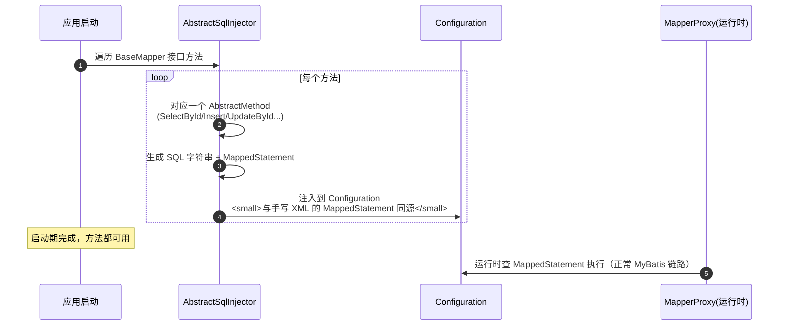

# MyBatis Plus核心机制详解

> 适用版本：MyBatis-Plus 3.5.x、MyBatis 3.5.x、JDK 8+ 为主线（官方文档 2026-08 查询）
> 最后更新：2026-08-08
> 主题范围：MP 定位与不侵入原理、BaseMapper/IService/IRepository、条件构造器 Wrapper 全体系、分页插件、主键策略（雪花）、逻辑删除、乐观锁、自动填充、SQL 注入器原理、代码生成器、实战坑
> 关联笔记：[00-ORM全家桶总览与选型](00-ORM全家桶总览与选型.md)（定位对比）、[01-MyBatis核心机制详解](01-MyBatis核心机制详解.md)（MyBatis 基础）、[04-MyBatis插件、分页与流式查询详解](04-MyBatis插件、分页与流式查询详解.md)（插件机制）、[07-Spring Boot集成与配置详解](07-Spring Boot集成与配置详解.md)（MP 全局配置）

## 📋 总纲

- ① 定位：MyBatis 增强工具，「只做增强不做改变」，单表 CRUD 零 SQL
- ② 架构：BaseMapper（物理层）→ IService/IRepository（逻辑层）
- ③ 核心机制：SQL 注入器在启动时给 BaseMapper 生成全部单表 CRUD SQL
- ④ 条件构造器 Wrapper：QueryWrapper / LambdaQueryWrapper 全方法
- ⑤ 内置能力：分页插件、主键策略、逻辑删除、乐观锁、自动填充
- ⑥ 实战坑：多表复杂查询、分页 count、逻辑删除与唯一索引、Lambda 序列化

## 一、定位与核心思想

**MyBatis-Plus（MP）** = MyBatis 的**增强工具**，官方口号「**只做增强不做改变**」：
- ① **不侵入**：引入后原有 MyBatis 代码全部照常运行
- ② **单表 CRUD 零 SQL**：继承 BaseMapper 就有 insert/select/update/delete 全家桶
- ③ **复杂查询仍走 MyBatis**：多表 join、复杂 SQL 继续手写 XML/注解
- ④ 内置常用能力：分页、逻辑删除、乐观锁、自动填充、代码生成器

```xml
<!-- 依赖（Spring Boot 3 用 mybatis-plus-spring-boot3-starter） -->
<dependency>
    <groupId>com.baomidou</groupId>
    <artifactId>mybatis-plus-spring-boot3-starter</artifactId>
    <version>3.5.x</version>
</dependency>
```

**代码说明**：MP 不是替代 MyBatis，而是**站在 MyBatis 肩上**——它用 MyBatis 的插件机制和 SqlSession 体系，把「单表 CRUD 的样板 SQL」自动化。这也是它能成为国内主流的原因：**单表开发效率向 JPA 看齐，复杂查询可控性保留 MyBatis**。

## 二、分层架构与两个核心接口

官方推荐分层（v3.5.9+ 语义重构）：

```
Controller（表现层）→ Service（业务逻辑层）→ Repository（逻辑数据访问层）→ Mapper（物理数据访问层）
```

### 2.1 BaseMapper（物理层，Mapper 接口继承）

```java
@Mapper
public interface UserMapper extends BaseMapper<User> {
    // 零 SQL：selectById / selectList / insert / updateById / deleteById 全有了
    // 复杂查询：继续手写 XML 或 @Select
    List<User> selectUserWithOrders(@Param("id") Long id);
}
```

BaseMapper 提供的能力（部分）：

| 方法 | SQL | 说明 |
| --- | --- | --- |
| insert(entity) | INSERT INTO user (...) VALUES (...)` | 主键按策略生成 |
| deleteById(id) | DELETE WHERE id=? | 逻辑删除开启时变 UPDATE |
| delete(Wrapper) | DELETE WHERE 条件 | 条件构造器 |
| updateById(entity) | UPDATE SET 非空字段 WHERE id=? | 默认只更新非 null 字段 |
| update(entity, Wrapper) | UPDATE SET ... WHERE 条件 | 实体 + 条件 |
| selectById(id) | SELECT * WHERE id=? | |
| selectList(Wrapper) | SELECT * WHERE 条件 | 空 Wrapper 查全表 |
| selectPage(page, Wrapper) | SELECT ... LIMIT（需分页插件） | 物理分页 |
| selectCount(Wrapper) | SELECT count(*) | |

★ **updateById 的坑**：默认**只更新非 null 字段**（字段策略 NOT_NULL）——想更新 null 要用 `UpdateWrapper.set("col", null)` 或注解 `@TableField(updateStrategy = FieldStrategy.ALWAYS)`。

### 2.2 IService / IRepository（逻辑层，Service 继承）

```java
public interface UserService extends IService<User> {
    // 业务方法
}

@Service
public class UserServiceImpl extends ServiceImpl<UserMapper, User> implements UserService {
    // 免写基础 CRUD：save/saveBatch/removeById/getById/list/page...
}
```

IService 方法命名规范（官方约定，避免与 Mapper 混淆）：

| 前缀 | 含义 | 示例 |
| --- | --- | --- |
| get | 查单行 | getById / getOne |
| list | 查集合 | list / listByIds / list(Wrapper) |
| save | 插入 | save / saveBatch / saveOrUpdate |
| update | 更新 | updateById / updateBatchById |
| remove | 删除 | removeById / remove(Wrapper) |
| page | 分页 | page(Page, Wrapper) |
| count | 计数 | count(Wrapper) |

★ v3.5.9+ 新增 `IRepository<T>`：与 IService 用法一致，语义更清晰（Repository 逻辑层 vs Mapper 物理层），配合 `CrudRepository<Mapper, T>` 基类使用。新项目建议直接 IRepository。

```java
// IRepository 用法（3.5.9+ 推荐）
public class UserRepository extends CrudRepository<UserMapper, User> implements IRepository<User> {
}
```

### 2.3 saveBatch 批量插入原理

```java
userService.saveBatch(userList, 1000);   // 每批 1000 条
// SQL: INSERT INTO user (name, ...) VALUES ('a',...),('b',...),...  ← 多值插入
```

**代码说明**：saveBatch 内部按 batchSize 切分，用 **VALUES 多值插入**（一条 SQL 插多行），性能远好于循环单插。batchSize 默认 1000，过大会超 `max_allowed_packet`。

## 三、条件构造器 Wrapper（核心）

### 3.1 体系

```
AbstractWrapper（抽象基类，定义全部条件方法）
 ├─ AbstractLambdaWrapper（lambda 支持）
 │   ├─ LambdaQueryWrapper<T>
 │   └─ LambdaUpdateWrapper<T>
 ├─ QueryWrapper<T>
 └─ UpdateWrapper<T>
```

| 类 | 字段引用方式 | 适用 |
| --- | --- | --- |
| QueryWrapper | 字符串列名 `"name"` | 简单场景，注意**列名硬编码** |
| LambdaQueryWrapper | 方法引用 `User::getName` | **推荐**：类型安全、重构友好 |
| UpdateWrapper | set 方法直接设置字段 | 动态更新（含 set null） |
| LambdaUpdateWrapper | lambda 版 UpdateWrapper | 推荐 |

### 3.2 常用方法逐个拆

| 方法 | SQL 效果 | 说明 |
| --- | --- | --- |
| eq(col, val) | `col = val` | 相等 |
| ne(col, val) | `col <> val` | 不等 |
| gt / ge / lt / le | `>` / `>=` / `<` / `<=` | 比较 |
| between(col, v1, v2) | `col BETWEEN v1 AND v2` | 区间 |
| like(col, val) | `col LIKE '%val%'` | 模糊 |
| likeLeft / likeRight | `LIKE '%val'` / `LIKE 'val%'` | 前缀/后缀模糊 |
| in(col, 集合) | `col IN (...)` | 列表 |
| isNull / isNotNull | `col IS NULL` / `IS NOT NULL` | 空判断 |
| orderByDesc / orderByAsc | `ORDER BY col DESC/ASC` | 排序 |
| groupBy(col) | `GROUP BY col` | 分组 |
| having(...) | `HAVING ...` | 分组过滤 |
| last("LIMIT 10") | 拼接 SQL 尾部 | ⚠️ 有注入风险，仅限可信值 |
| apply("date_format(...)") | 拼接 SQL 片段 | ⚠️ 同上，慎用 |
| allEq(Map) | 多字段相等 | 支持 null2IsNull 参数 |
| and(consumer) / or(consumer) | 括号分组 `(a AND b) OR c` | 复杂逻辑 |
| select(...) | 指定查询列 | 投影 |

★ **每个方法都有 `condition` 重载**：`eq(condition, col, val)` —— condition 为 false 时不拼接。这是写动态条件最优雅的方式，避免到处 if：

```java
// 推荐写法：condition 参数化
LambdaQueryWrapper<User> qw = new LambdaQueryWrapper<>();
qw.eq(StringUtils.hasText(name), User::getName, name)   // name 为空就不拼条件
  .ge(age != null, User::getAge, age)
  .orderByDesc(User::getCreateTime);
```

### 3.3 示例：LambdaQueryWrapper 查询

```java
// 查询：name='张三' 且 age>=18，按 create_time 倒序
LambdaQueryWrapper<User> qw = new LambdaQueryWrapper<User>()
        .eq(User::getName, "张三")
        .ge(User::getAge, 18)
        .orderByDesc(User::getCreateTime);
List<User> users = userMapper.selectList(qw);

// 分页查询（需分页插件）
Page<User> page = userMapper.selectPage(new Page<>(1, 10), qw);
long total = page.getTotal();      // 总数（自动 count）
List<User> records = page.getRecords();  // 当前页数据
```

**代码说明**：Lambda 方式用**方法引用**引用实体属性，编译期就能发现字段改名/拼写错误（对比 QueryWrapper 字符串列名运行期才炸），是生产首选。

### 3.4 自定义 SQL 里用 Wrapper（重点技巧）

```java
// Mapper 方法：接收 Wrapper
@Select("SELECT * FROM user ${ew.customSqlSegment}")
List<User> selectByWrapper(@Param(Constants.WRAPPER) Wrapper<User> wrapper);
```

```xml
<select id="selectByWrapper" resultType="User">
  SELECT * FROM user ${ew.customSqlSegment}
</select>
```

**代码说明**：`${ew.customSqlSegment}` 是 MP 预留的 Wrapper 注入点，展开成 WHERE 条件片段。这是**手写 SQL + Wrapper 条件**的组合姿势——复杂 SQL 里复用 Wrapper 的查询条件能力。注意 `customSqlSegment` 是 `${}` 拼接，**Wrapper 内部参数仍是 `#{}` 预编译**（条件值安全），但别把不可信字符串拼进 wrapper 的 apply/last。

## 四、分页插件（PaginationInnerInterceptor）

### 4.1 配置（必须显式注册）

```java
@Configuration
@MapperScan("com.example.mapper")
public class MybatisPlusConfig {

    @Bean
    public MybatisPlusInterceptor mybatisPlusInterceptor() {
        MybatisPlusInterceptor interceptor = new MybatisPlusInterceptor();
        // 多插件时，分页放最后
        interceptor.addInnerInterceptor(new PaginationInnerInterceptor(DbType.MYSQL));
        return interceptor;
    }
}
```

★ 坑：不注册分页插件时，`selectPage` 只是**内存分页**（全量查出再截），必须注册才物理分页。多数据源/数据库类型记得配 DbType。

### 4.2 原理

```
MybatisPlusInterceptor 是 MyBatis 插件（拦截 Executor.query）
  → 内部按顺序执行 InnerInterceptor 链
  → PaginationInnerInterceptor：
      ① 拿到 Page 参数 → 生成 count SQL（自动）
      ② 用 JSqlParser 解析原 SQL → 追加 LIMIT
      ③ 执行 count + 数据查询，回填 Page.total / Page.records
```

**Page 类关键属性**：

| 属性 | 默认 | 说明 |
| --- | --- | --- |
| size | 10 | 每页条数 |
| current | 1 | 当前页 |
| optimizeCountSql | true | 自动优化 count SQL（去掉 order by 等） |
| optimizeJoinOfCountSql | true | count 时移除不参与 where 的 left join |
| searchCount | true | 是否执行 count（false 则只查数据） |
| maxLimit | null | 单页条数上限（防止超大数据量） |
| countId | null | 自定义 count 查询的 statementId |

### 4.3 count 优化与坑

- ① **left join 优化**：count 生成时，**不参与 where 条件的 left join 表会被移除**——建议所有带 left join 的 SQL 都给表和字段加**别名**，避免优化器误判
- ② 复杂 SQL（group by / distinct / union）的 count 可能不准确或低效 → 用 `page.setSearchCount(false)` 跳过，或 `countId` 指定手写 count
- ③ **`page.setMaxLimit(100L)`** 防「分页参数恶意传超大值」拖垮数据库

## 五、主键策略

### 5.1 IdType 枚举

| IdType | 说明 | 适用 |
| --- | --- | --- |
| ASSIGN_ID（默认） | **雪花算法**生成 19 位 Long，全局唯一、趋势递增 | 分布式默认推荐 |
| ASSIGN_UUID | UUID（去中划线） | 字符串主键 |
| AUTO | 数据库自增 | 单库、传统 |
| INPUT | 手动输入 | 业务主键 |
| NONE | 不设置 | 跟随全局配置 |

```java
public class User {
    @TableId(type = IdType.AUTO)   // 切换为数据库自增
    private Long id;
    // 默认不写注解 = ASSIGN_ID（雪花）
}
```

**代码说明**：MP 默认 `ASSIGN_ID` 用**雪花算法**（Sequence 类实现，64 位：时间戳 + 机器号 + 序列号）。面试点：雪花 ID **全局唯一、趋势递增、无序不可推测**；对比数据库自增的**分布式不可用**、UUID 的**无序索引性能差**（B+ 树随机插入）。

### 5.2 自定义 ID 生成器

```java
@Component
public class CustomIdGenerator implements IdentifierGenerator {
    @Override
    public Number nextId(Object entity) {
        return /* 自定义生成逻辑 */;
    }
}
```

## 六、逻辑删除

### 6.1 原理

**逻辑删除** = 删除操作转 UPDATE 标记，保留数据历史：

```
删除：UPDATE user SET deleted=1 WHERE id=? AND deleted=0
查找：SELECT * FROM user WHERE ... AND deleted=0（自动追加过滤）
更新：自动防更新已删除记录
```

### 6.2 配置

```yaml
# 方式一：全局配置（推荐）
mybatis-plus:
  global-config:
    db-config:
      logic-delete-field: deleted      # 逻辑删除字段（实体属性名）
      logic-delete-value: 1            # 已删除值，默认 1
      logic-not-delete-value: 0        # 未删除值，默认 0
```

```java
// 方式二：实体注解
@TableLogic
private Integer deleted;
// @TableLogic(value = "0", delval = "1") 可自定义值
```

### 6.3 坑（面试/实战重点）

- ① **唯一索引冲突**：逻辑删除的行还在表里，`(phone, deleted)` 组合索引才允许重复注册——只对 phone 建唯一索引会**插入失败**
- ② **多表 join 默认不过滤**：手写 SQL 里 `JOIN user` 不会自动加 `deleted=0`，需自己带条件（MP 只增强 BaseMapper 方法）
- ③ 逻辑删除字段类型：推荐 Integer/Boolean/LocalDateTime（datetime 未删值可用 null）；bigint 可配 `UNIX_TIMESTAMP()` 作为删除值，支持多次删除
- ④ **deleteById 带填充**：v3.5.0 起 `deleteById` 支持自动填充（旧 LogicDeleteByIdWithFill 已废弃）

## 七、乐观锁

### 7.1 原理

MP 乐观锁 = **版本号机制**（无阻塞并发控制）：

```
UPDATE user SET name=?, version=version+1
WHERE id=? AND version=旧版本
影响行数=0 → 说明版本被改过 → 更新失败（并发冲突）
```

### 7.2 使用三步

```java
// ① 实体加版本字段
@Version
private Integer version;

// ② 注册插件
interceptor.addInnerInterceptor(new OptimisticLockerInnerInterceptor());

// ③ updateById(entity) 自动带 version 条件
boolean ok = userService.updateById(user);   // 内部拼 version 条件
```

★ **适用前提**：必须先 `selectById` 拿到带 version 的实体 → 改字段 → updateById，才会带版本条件。**直接 new 实体（version=null）不生效**。
★ 注意：乐观锁只对 **updateById / update(entity, wrapper)** 生效；自定义 SQL 更新不生效。

## 八、自动填充

### 8.1 场景

`create_time` / `update_time` / `create_by` / `update_by` 等字段**插入/更新时自动赋值**，不用每处手动 set。

### 8.2 实现

```java
// ① 实体字段注解
@TableField(fill = FieldFill.INSERT)         // 插入时填充
private LocalDateTime createTime;
@TableField(fill = FieldFill.INSERT_UPDATE)  // 插入+更新时填充
private LocalDateTime updateTime;

// ② 实现 MetaObjectHandler
@Component
public class MyMetaObjectHandler implements MetaObjectHandler {
    @Override
    public void insertFill(MetaObject metaObject) {
        this.strictInsertFill(metaObject, "createTime", LocalDateTime.class, LocalDateTime.now());
        this.strictInsertFill(metaObject, "updateTime", LocalDateTime.class, LocalDateTime.now());
    }
    @Override
    public void updateFill(MetaObject metaObject) {
        this.strictUpdateFill(metaObject, "updateTime", LocalDateTime.class, LocalDateTime.now());
    }
}
```

**代码说明**：`strictInsertFill`（严格填充）只在字段值为 null 时填充，避免覆盖业务手动赋的值。fill 时机：**insert 和 update 的 SQL 生成阶段**（通过 MP 的 SQL 注入方法内嵌填充逻辑），不走 MyBatis 插件。

## 九、SQL 注入器原理（核心机制）

### 9.1 BaseMapper 的方法哪来的



**代码说明**：MP 的 BaseMapper 零 SQL 本质 = **启动期程序化生成 MappedStatement**。普通 MyBatis 的 MappedStatement 来自 XML/注解解析，MP 的来自 SQL 注入器代码生成——**殊途同归，都注册进 Configuration**。这就是「MP 不侵入」的底层保障。

### 9.2 自定义 SQL 注入器（扩展 BaseMapper）

```java
// ① 自定义方法类（核心：injectMappedStatement 里手写 SQL + 注册）
public class SelectDistinctName extends AbstractMethod {
    @Override
    public MappedStatement injectMappedStatement(Class<?> mapperClass,
            Class<?> modelClass, TableInfo tableInfo) {
        // 1. 拼 SQL 字符串（SQL 方法名常量，如 selectDistinctName）
        String sql = "<script>"
            + "SELECT DISTINCT ${ew.sqlSegment} FROM " + tableInfo.getTableName()
            + "</script>";
        // 2. 用 SqlSource 包装 SQL 字符串
        SqlSource sqlSource = languageDriver.createSqlSource(configuration, sql, modelClass);
        // 3. 返回 MappedStatement（statement 名 = mapperClass 全限定名.selectDistinctName）
        return addSelectMappedStatementForTable(mapperClass,
                "selectDistinctName", sqlSource, modelClass, tableInfo);
    }
}

// ② 注入器装配（继承 DefaultSqlInjector，追加自定义方法）
public class MySqlInjector extends DefaultSqlInjector {
    @Override
    public List<AbstractMethod> getMethodList(Class<?> mapperClass, TableInfo tableInfo) {
        List<AbstractMethod> list = super.getMethodList(mapperClass, tableInfo);
        list.add(new SelectDistinctName());   // 追加自定义方法
        return list;
    }
}

// ③ 全局配置注入器 + Mapper 接口声明方法
// 配置：mybatis-plus.global-config.sql-injector 指向 MySqlInjector
// Mapper 接口里声明：List<String> selectDistinctName(Wrapper<T> queryWrapper);
```

**代码说明**：这是 MP 的**高级扩展点**——团队级统一方法（如批量软删、自定义分页方法）可以注入到所有 BaseMapper。面试提到「MP 怎么做到单表零 SQL」答 SQL 注入器 + AbstractMethod 即可。

## 十、代码生成器

```java
// 官方推荐：FastAutoGenerator（3.5.1+）
FastAutoGenerator.create("jdbc:mysql://localhost:3306/db", "user", "pass")
        .globalConfig(builder -> builder.author("robin").outputDir("/tmp/gen"))
        .packageConfig(builder -> builder.parent("com.example"))
        .strategyConfig(builder -> builder.addInclude("user", "order"))
        .execute();
```

**代码说明**：生成 Entity/Mapper/Service/Controller 全套，省去建表后的样板代码。注意：**生成代码别直接覆盖业务改动**（生成到独立目录再拷贝），且生成器产物要过 code review。

## 十一、实战坑汇总

- ① **updateById 不更新 null 字段**——要置 null 用 UpdateWrapper.set
- ② **分页插件必须注册**——不注册 selectPage 是内存分页
- ③ **startPage 是 PageHelper 的，MP 用 Page 参数**——别混用
- ④ **逻辑删除 + 唯一索引**冲突——组合索引解决
- ⑤ **多表 join 手写 SQL 记得带 deleted=0**——MP 不会自动加
- ⑥ Lambda 序列化问题：LambdaQueryWrapper 在**跨 JVM 传递/序列化**（如 Dubbo）时列名解析可能失败（需 SerializedLambda 支持），一般仅在**本地方法内使用**最稳
- ⑦ **Wrapper 的 last/apply 慎用**——拼接片段有注入风险（虽然条件值走 #{}，但片段本身是拼接）
- ⑧ 复杂报表/大 join 别硬用 Wrapper——**手写 XML 更清晰可控**
- ⑨ 乐观锁版本字段要给默认值（0），且**只对 updateById/update(entity, wrapper) 生效**
- ⑩ saveBatch 批次别太大（默认 1000），超过 max_allowed_packet 报错

## 十二、面试问答与场景题

### Q1: MyBatis-Plus 和 MyBatis 什么关系？为什么说不侵入？

**答案**：MP 是 MyBatis 的增强工具，复用 MyBatis 的 SqlSession/插件/映射体系，只增加 BaseMapper/IService 等增强 API，不改变 MyBatis 原有行为。单表 CRUD 由 SQL 注入器在启动时生成 MappedStatement，复杂查询仍走原生 MyBatis XML/注解，所以原有代码不受影响。

### Q2: Wrapper 的 QueryWrapper 和 LambdaQueryWrapper 区别？

**答案**：QueryWrapper 用字符串列名（硬编码、改字段名不报错但运行期炸）；LambdaQueryWrapper 用方法引用（编译期检查、重构友好）。生产推荐 Lambda。

### Q3: MP 分页插件怎么实现物理分页？

**答案**：MybatisPlusInterceptor 拦截 Executor.query，PaginationInnerInterceptor 用 JSqlParser 解析 SQL 生成 count 查询 + 追加 LIMIT，回填 Page.total/records。需显式注册插件，多数据源配 DbType。

### Q4: 主键策略默认是什么？为什么？

**答案**：默认 ASSIGN_ID 雪花算法生成 19 位 Long——分布式全局唯一、趋势递增（索引友好）、无序不可推测；对比数据库自增分布式不可用，UUID 无序伤索引。

### Q5: 逻辑删除和乐观锁怎么实现的？

**答案**：逻辑删除把 delete 改 UPDATE 标记 deleted=1，查询自动追加 deleted=0；乐观锁用 @Version + OptimisticLockerInnerInterceptor，updateById 自动拼 version 条件，影响行数为 0 即冲突。

### 场景题：单表 CRUD 项目选 MP 还是 JPA？

**答案**：国内团队/复杂查询多 → MP（SQL 可控 + 单表自动化）；DDD/跨库/Spring 官方生态 → JPA。MP 保留了 MyBatis 生态（PageHelper 等可替换为内置插件），团队迁移成本低。详细对比见 [00-ORM全家桶总览与选型](00-ORM全家桶总览与选型.md)。

## 参考资料

- [MyBatis-Plus 官方文档：条件构造器](https://baomidou.com/guides/wrapper/)，查询日期：2026-08-08
- [MyBatis-Plus 官方文档：持久层接口 IService/IRepository](https://baomidou.com/guides/data-interface/)，查询日期：2026-08-08
- [MyBatis-Plus 官方文档：分页插件](https://baomidou.com/plugins/pagination/)，查询日期：2026-08-08
- [MyBatis-Plus 官方文档：逻辑删除](https://baomidou.com/guides/logic-delete/)，查询日期：2026-08-08
- [MyBatis-Plus 官方文档：乐观锁 / 自动填充 / SQL 注入器 / ID 生成器](https://baomidou.com/)，查询日期：2026-08-08
