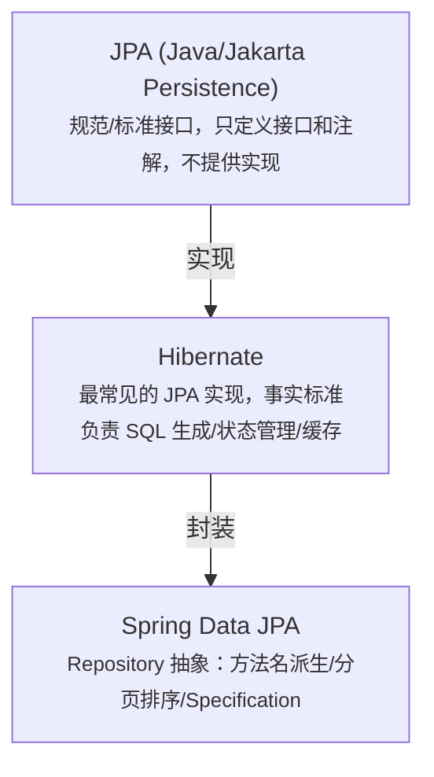
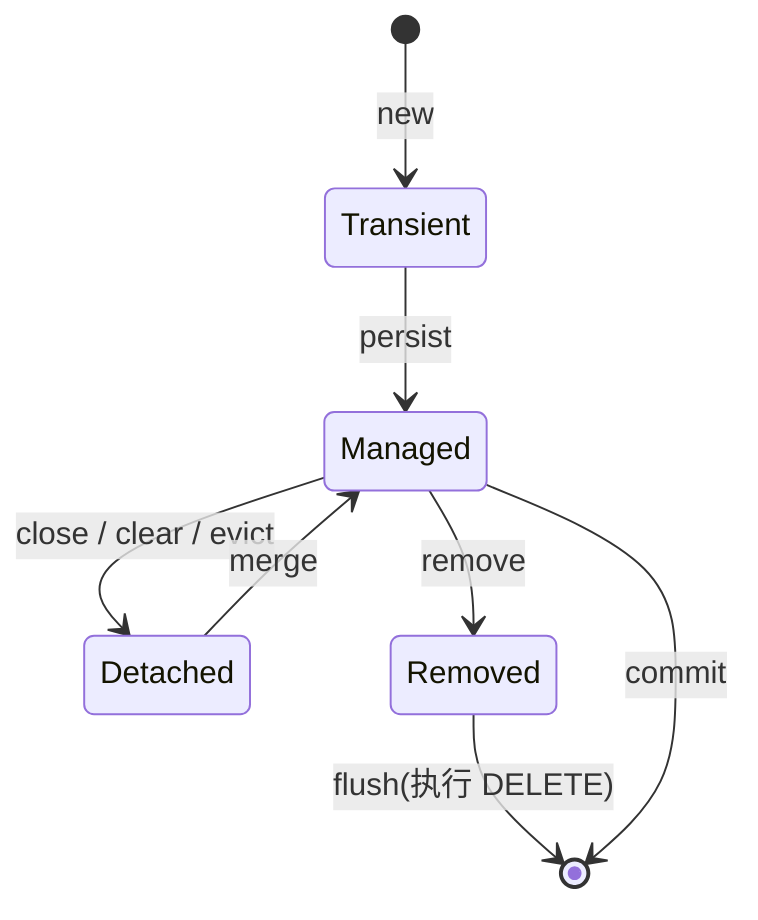
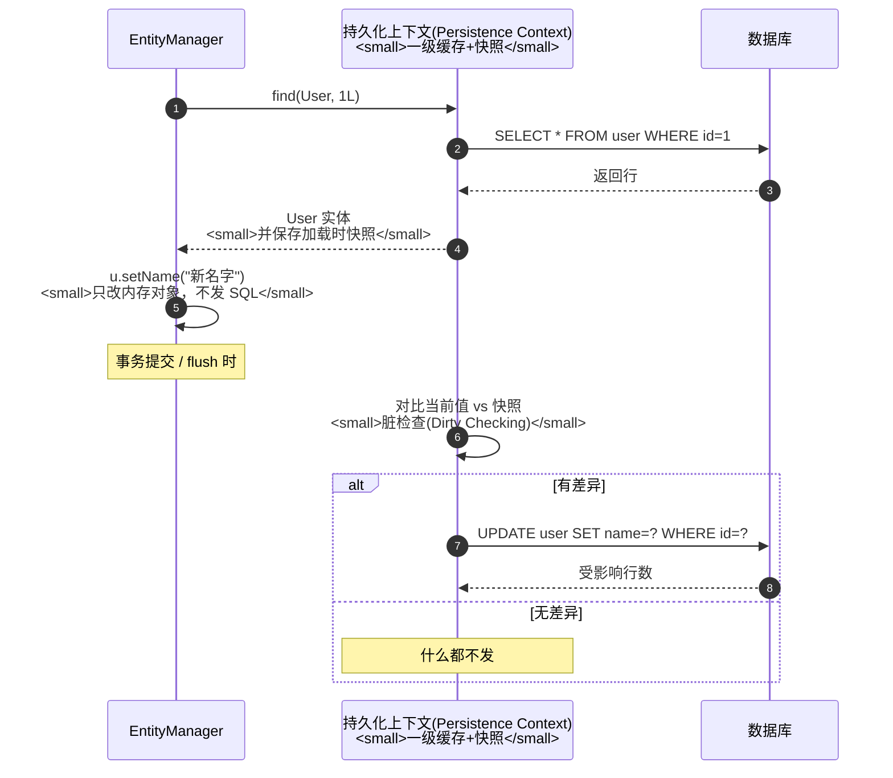

# JPA与Spring Data JPA详解

> 适用版本：JPA 3.x（Jakarta Persistence）、Hibernate 6.x、Spring Data JPA 3.x、Spring Boot 3、JDK 17 为主线
> 最后更新：2026-08-08
> 主题范围：JPA 规范 vs Hibernate vs Spring Data JPA 三层关系、实体映射、实体生命周期四态与持久化上下文、脏检查、JPQL/Criteria/方法名派生查询、事务、N+1 问题、懒加载与 LazyInitializationException、一二级缓存、批量性能坑
> 关联笔记：[00-ORM全家桶总览与选型](00-ORM全家桶总览与选型.md)（与 MyBatis 对比选型）、[05-MyBatis Plus核心机制详解](05-MyBatis Plus核心机制详解.md)（对照阅读）、[08-Spring Data JPA实战进阶](08-Spring Data JPA实战进阶.md)（实战应用）

## 📋 总纲

- ① 三层关系：JPA 是规范、Hibernate 是实现、Spring Data JPA 是 Repository 封装
- ② 实体映射：主键策略、字段映射、关联映射、级联
- ③ 核心机制：实体四态 + 持久化上下文 + 脏检查（自动 UPDATE 的秘密）
- ④ 查询方式：JPQL / Criteria / 方法名派生 / @Query / EntityGraph
- ⑤ 经典坑：N+1、LazyInitializationException、open-in-view、批量插入慢
- ⑥ 缓存体系：一级（PersistenceContext）/ 二级（Hibernate 可选）

## 一、三层关系（先搞清楚概念）



**代码说明**：面试题「JPA 和 Hibernate 什么关系」答案 = **JPA 是规范，Hibernate 是规范的最流行实现**；「Spring Data JPA 是什么」= **Spring 生态对 JPA 的 Repository 层封装**。三段式：规范（JPA）→ 实现（Hibernate）→ 封装（Spring Data JPA）。

## 二、实体映射

### 2.1 基础映射注解

| 注解 | 作用 |
| --- | --- |
| `@Entity` | 标记实体类（必须有 `@Id`） |
| `@Table(name="user")` | 指定表名（默认类名） |
| `@Id` | 主键 |
| `@GeneratedValue(strategy=...)` | 主键生成策略 |
| `@Column(name, nullable, length, unique)` | 字段映射与约束 |
| `@Transient` | 不映射（Java 内部字段） |
| `@Enumerated` / `@Lob` / `@Temporal` | 特殊类型 |
| `@Version` | 乐观锁版本字段 |

### 2.2 主键策略（@GeneratedValue）

| GenerationType | 说明 | 适用 |
| --- | --- | --- |
| IDENTITY | 数据库自增（MySQL AUTO_INCREMENT） | 单库，插入后立即需要 id |
| SEQUENCE | 数据库序列（Oracle/PostgreSQL），Hibernate 会优化为批量取号 | 序列库 |
| TABLE | 用一张表模拟序列（性能差，已过时） | 兼容性 |
| AUTO（默认） | 由 Hibernate 按方言自动选（MySQL→IDENTITY） | 默认 |

★ **坑**：IDENTITY 策略下 `persist` 会**立即执行 INSERT**（为了拿自增 id）；SEQUENCE 可以延迟到 flush。批量插入时 IDENTITY 无法用 JDBC 批处理优化（每条都要先插拿 id）——这是 JPA 批量插入慢的根源之一。

### 2.3 关联映射（重点）

| 注解 | 关系 | 默认 fetch |
| --- | --- | --- |
| `@ManyToOne` | 多对一（order → user） | **EAGER（立即加载）** |
| `@OneToMany` | 一对多（user → orders） | LAZY（懒加载） |
| `@OneToOne` | 一对一 | EAGER |
| `@ManyToMany` | 多对多（生成中间表） | LAZY |

```java
@Entity
public class Order {
    @Id
    private Long id;

    // 多对一：默认 EAGER！多个 Order 查 User 会 join 或 N+1
    @ManyToOne(fetch = FetchType.LAZY)   // 一般建议改成 LAZY 防 N+1
    @JoinColumn(name = "user_id")
    private User user;
}

@Entity
public class User {
    @Id
    private Long id;

    // 一对多：默认 LAZY
    @OneToMany(mappedBy = "user", cascade = CascadeType.ALL, orphanRemoval = true)
    private List<Order> orders = new ArrayList<>();
}
```

**代码说明**：**默认 fetch 策略是个大坑**——`@ManyToOne` 默认 EAGER，查 100 个订单会连带加载 100 个用户（N+1 或笛卡尔 join）。生产建议：**集合和单对象关联全部显式 LAZY**，按需用 JOIN FETCH/EntityGraph 加载。`mappedBy` 表示**关系由对方维护**（Order.user 是外键持有方），User.orders 只是镜像集合。

### 2.4 级联（cascade）与孤儿删除

| 级联类型 | 效果 |
| --- | --- |
| CascadeType.PERSIST | 持久化父时连带 persist 子 |
| CascadeType.MERGE | merge 时连带 |
| CascadeType.REMOVE | 删父连带删子（先删子后删父） |
| CascadeType.ALL | 全部 |
| orphanRemoval=true | 子从集合移除 → 自动 DELETE（孤儿删除，1.3+） |

**易错点**：
- ① `orphanRemoval` 与 `cascade=REMOVE` 不同：orphan 是「从集合里拿掉就删」，REMOVE 是「父删除时连带删」
- ② 级联 REMOVE 在**集合很大**时逐条 DELETE 很慢（Hibernate 逐个删，不批量）
- ③ 双向关联要**两端都维护**（addOrder 辅助方法里 user.orders.add + order.setUser），否则出现「内存与 DB 不一致」

### 2.5 锁机制（乐观锁 vs 悲观锁）

JPA 提供两种并发控制，面试高频：

| 类型 | 注解/API | 原理 | 适用 |
| --- | --- | --- | --- |
| 乐观锁 | `@Version` 字段（推荐，无锁） | 更新时校验版本号，冲突抛 OptimisticLockException | 冲突少、读多写少 |
| 悲观锁 | `@Lock(LockModeType.PESSIMISTIC_WRITE)` | SELECT ... FOR UPDATE 行锁，其他事务阻塞等待 | 冲突多、必须串行 |

```java
// 悲观锁：查询即加行锁
public interface OrderRepository extends JpaRepository<Order, Long> {
    @Lock(LockModeType.PESSIMISTIC_WRITE)
    @Query("select o from Order o where o.id = :id")
    Optional<Order> findByIdForUpdate(@Param("id") Long id);
    // 生成: SELECT ... FOR UPDATE
}

// 乐观锁：实体加版本字段，update 自动带 version 条件
@Entity
public class Order {
    @Version
    private Long version;
}
```

**代码说明**：乐观锁 = **不锁库、提交时校验**（类似 MP 的 @Version，见 [05-MyBatis Plus核心机制详解](05-MyBatis Plus核心机制详解.md) 第七节，两者思想完全一致）；悲观锁 = **查询时 FOR UPDATE 真锁行**。**坑**：悲观锁要**在事务内**使用（锁随事务提交/回滚释放），且注意锁等待超时（`javax.persistence.lock.timeout` 提示）。`@Version` 字段不能手动赋值，Hibernate 维护。

### 2.6 实体监听器（生命周期回调）

| 注解 | 时机 | 典型用途 |
| --- | --- | --- |
| `@PrePersist` | persist 前 | 填充 createTime/createBy（对应 MP 自动填充） |
| `@PostPersist` | persist 后 | 记录新 id |
| `@PreUpdate` | UPDATE 前 | 填充 updateTime |
| `@PreRemove` | DELETE 前 | 审计/软删标记 |
| `@PostLoad` | 加载后 | 字段加工（如解密） |

```java
@Entity
public class User {
    @PrePersist
    void onCreate() { this.createTime = LocalDateTime.now(); }
    @PreUpdate
    void onUpdate() { this.updateTime = LocalDateTime.now(); }
}
```

**代码说明**：实体监听器是 JPA 内置的**自动填充**方案（对比 MyBatis-Plus 的 MetaObjectHandler 自动填充，见 [05-MyBatis Plus核心机制详解](05-MyBatis Plus核心机制详解.md) 第八节）——`@PrePersist/@PreUpdate` 正是 createTime/updateTime 的标准做法。

## 三、核心机制：实体生命周期与持久化上下文

### 3.1 实体四态（面试核心）

| 状态 | 含义 | 是否在持久化上下文 | 变更是否入库 |
| --- | --- | --- | --- |
| **Transient（瞬时）** | `new` 出来没管过 | 否 | 否 |
| **Managed（托管）** | persist/find/merge 后 | 是 | **是**（flush 时脏检查） |
| **Detached（游离）** | 曾托管，上下文关闭/clear/evict 后 | 否 | 否 |
| **Removed（删除）** | remove() 后 | 是（标记删除） | flush 时执行 DELETE |

状态迁移：



```java
// 示例：四态流转
User user = new User();                    // ① Transient（瞬时）
em.persist(user);                          // ② Managed（托管）
em.detach(user);                           // ③ Detached（游离）——改了不生效！
user.setName("x");                         //    不触发 UPDATE（无人管理）
em.merge(user);                            // ④ 重新 Managed
em.remove(user);                           // ⑤ Removed（标记删除）
em.flush();                                //    DELETE 执行
```

**代码说明**：**Detached 是最大的坑**——对象从 Service 返回后如果 EntityManager/事务已关，再改它的字段**不会更新数据库**（没人做脏检查）。这解释了 Spring MVC 常见的「页面改了对象提交不生效」问题：需要 `merge`（或重新 find 后手动 set）才更新。`persist` vs `merge` 区别：persist 只用于新实体插入；merge 用于**游离实体合并**（有 id 则 update，无 id 则 insert，但 merge 会返回**新的托管副本**，原对象仍是游离的——记得用返回值）。

### 3.2 持久化上下文（Persistence Context）

> JPA 规范定义：持久化上下文是实体实例的集合，其中**任何持久化实体标识对应唯一实体实例**，实体实例及其生命周期在该上下文中被管理。

**本质** = 一级缓存（Map<实体类型+id, 实体>）+ 状态跟踪器。特性：
- ① **同一事务内同一 id 只加载一次**（重复 find 返回同一实例，不发 SQL）
- ② **唯一性**：同 id 不出现两个不同实例（保证一致性）
- ③ 生命周期 = 事务边界（Spring 中一个 @Transactional 一个持久化上下文，默认 closed 策略）

### 3.3 脏检查（Dirty Checking）



**代码说明**：这就是 JPA「不用调 update 方法，改字段就自动更新」的秘密——**flush 时脏检查 + 快照对比**。注意：
- ① **快照对比有开销**：实体字段多、量大时 flush 的对比成本不可忽略（Hibernate 对每个托管实体逐字段比）
- ② **flush 时机**：事务提交前、查询前（默认 FlushModeType.AUTO，查询前 flush 保证一致性）、显式 em.flush()
- ③ 改 Detached 对象**不会**触发脏检查（见 3.1）

## 四、查询方式全景

### 4.1 四种查询手段

| 方式 | 写法 | 适用 |
| --- | --- | --- |
| 方法名派生查询 | `findByNameAndAgeGreaterThan(...)` | 简单条件（Spring Data JPA） |
| JPQL | `@Query("select u from User u where u.name = :name")` | 面向对象查询（表无关） |
| Criteria API | `criteriaBuilder.equal(root.get("name"), name)` | 动态条件（类型安全，啰嗦） |
| 原生 SQL | `@Query(value="...", nativeQuery=true)` | 复杂 SQL/性能要求 |

```java
// ① 方法名派生查询（Spring Data JPA 特色）
public interface UserRepository extends JpaRepository<User, Long> {
    List<User> findByName(String name);                                  // WHERE name=?
    List<User> findByNameAndAgeGreaterThan(String name, int age);        // AND + >
    List<User> findByStatusOrderByCreateTimeDesc(Integer status);        // 排序
    long countByStatus(Integer status);                                  // count
    boolean existsByPhone(String phone);                                 // exists
    Page<User> findByNameContaining(String keyword, Pageable pageable);  // 分页
}

// ② JPQL（面向实体属性，不是表列名）
@Query("select u from User u where u.name = :name and u.status = :status")
List<User> findByCondition(@Param("name") String name, @Param("status") Integer status);

// ③ 原生 SQL（直接用表名和列名）
@Query(value = "SELECT * FROM user WHERE status = ?1", nativeQuery = true)
List<User> findByStatusNative(Integer status);
```

**代码说明**：方法名派生查询规则 = `findBy` + 属性路径 + `And/Or` + 操作符（`GreaterThan`/`Containing`/`In`/`IsNull`...）。**方法名就是查询契约**，太长会难维护——复杂查询建议 @Query。JPQL 用**实体名和属性名**（`User.name`），原生 SQL 用**表名和列名**（`user.name`），别混。

### 4.2 分页排序（Pageable）

```java
Page<User> page = userRepository.findAll(
        PageRequest.of(0, 10, Sort.by(Sort.Direction.DESC, "createTime")));
List<User> records = page.getContent();  // 当前页
long total = page.getTotalElements();    // 总数
int pages = page.getTotalPages();        // 总页数
```

★ Spring Data JPA 分页 = **物理分页**（Hibernate 生成方言 LIMIT），与 MyBatis 的 RowBounds 内存截取完全不同。`PageRequest.of(page, size, sort)` 是标准用法。

### 4.3 Specification（动态查询，JPA 版「Wrapper」）

```java
// 动态条件组合（对比 MyBatis-Plus 的 LambdaQueryWrapper）
public class UserSpecs {
    public static Specification<User> byNameAndAge(String name, Integer age) {
        return (root, query, cb) -> {
            List<Predicate> ps = new ArrayList<>();
            if (name != null) ps.add(cb.equal(root.get("name"), name));
            if (age != null) ps.add(cb.greaterThan(root.get("age"), age));
            return cb.and(ps.toArray(new Predicate[0]));
        };
    }
}
// 使用：userRepository.findAll(UserSpecs.byNameAndAge("张三", 18), pageable);
```

**代码说明**：Specification 相当于 **JPA 世界的条件构造器**（动态 where）。对比 MP 的 LambdaQueryWrapper：MP 是链式更简洁，Specification 是类型安全的回调——面试对比 MyBatis-Plus 与 JPA 动态查询时可提这个对应关系。

## 五、N+1 问题与解决方案（重点）

### 5.1 产生原因

**懒加载集合/关联 + 循环访问** → 1 条主查询 + N 条关联查询：

```java
// N+1：查 100 个用户，每个用户访问 orders 触发 1 条查询
@Transactional(readOnly = true)
public List<UserDTO> getAllUsers() {
    List<User> users = userRepository.findAll();      // 1 条
    return users.stream().map(u -> new UserDTO(
            u.getId(), u.getName(),
            u.getOrders().size()   // 每个用户触发 1 条 → 100 条！
    )).toList();
}
```

### 5.2 解决方案（按推荐度）

| 方案 | 写法 | 优点 | 缺点 |
| --- | --- | --- | --- |
| ① JOIN FETCH | `@Query("select u from User u join fetch u.orders")` | 一条 SQL 全取 | 集合 fetch 会笛卡尔积（分页会 warn） |
| ② @EntityGraph | `@EntityGraph(attributePaths="orders")` 注解方法 | 声明式、简洁 | 灵活性有限 |
| ③ DTO 投影 | `select new UserDTO(u.id, u.name, size(u.orders))` JPQL 投影 | 精准取列 | 类需全限定名 |
| ④ 批量抓取 | `@BatchSize(size=50)` 或 `hibernate.default_batch_fetch_size` | 少次 IN 查询 | Hibernate 特性 |
| ⑤ 二级缓存 | 低频关联数据缓存 | 省 SQL | 一致性风险 |

```java
// ① JOIN FETCH：一条 SQL
@Query("select u from User u join fetch u.orders where u.status = :status")
List<User> findByStatusWithOrders(@Param("status") Integer status);

// ② EntityGraph：不用写 JPQL
@EntityGraph(attributePaths = {"orders"})
@Query("select u from User u where u.status = :status")
List<User> findByStatusWithOrders(@Param("status") Integer status);

// ④ 批量抓取：N+1 → 1 + N/50 条 IN 查询
@Entity
@BatchSize(size = 50)
public class User { ... }
// 或 application.yml: spring.jpa.properties.hibernate.default_batch_fetch_size: 50
```

**代码说明**：面试答 N+1 解决四板斧：**JOIN FETCH**（一条 SQL）、**@EntityGraph**（声明式）、**DTO 投影**（只取要的）、**批量抓取**（IN 批次）。注意：**join fetch 集合 + 分页同时用会出问题**（内存分页警告，因为集合 fetch 破坏了 LIMIT 语义）——集合分页要么 fetch join 一对一的关联，要么用 `@BatchSize` + 普通查询。

## 六、懒加载与 LazyInitializationException

### 6.1 懒加载原理

JPA 懒加载 = Hibernate 返回**代理对象**（CGLIB/字节码增强），访问属性时才发查询。集合（orders）默认 LAZY，代理是 `PersistentBag` 等。

### 6.2 LazyInitializationException（经典异常）

**触发**：实体已 Detached（事务/Session 关闭）后再访问懒加载属性：

```
org.hibernate.LazyInitializationException: failed to lazily initialize a collection
```

**根因**：懒加载需要**活着的持久化上下文**（Session）发 SQL；事务结束后 Session 关闭，实体游离，再碰懒属性就炸。

### 6.3 解决方案

| 方案 | 做法 | 评价 |
| --- | --- | --- |
| ① 事务内取完 | Service 层 @Transactional 内访问完关联属性再返回 DTO | **推荐**（标准做法） |
| ② JOIN FETCH/EntityGraph | 查询时就加载好 | 推荐 |
| ③ DTO 投影 | 只取需要的字段 | 推荐 |
| ④ open-in-view | `spring.jpa.open-in-view=true`（**Spring Boot 默认开启！**） | ⚠️ 见下方警告 |
| ⑤ Hibernate.initialize(u.getOrders()) | 手动初始化 | 简单但会 N+1 |

### 6.4 open-in-view 的罪与罚（重点）

★ **Spring Boot 默认 `spring.jpa.open-in-view: true`**——OSIV（Open Session In View）模式：**请求线程持有一个 Hibernate Session，覆盖整个 HTTP 请求**（直到视图渲染完）。

**优点**：Controller/视图层还能懒加载，不会 LazyInitializationException。
**坑**（面试常考「为什么建议关掉」）：
- ① **数据库连接被 HTTP 请求全程占用**（即使只查了一条数据，连接持有到响应完成）——高并发下**连接池被打爆**
- ② 请求内任何位置都可能触发 SQL（Controller 里碰一下集合就发查询）——**性能不可控**，N+1 藏得很深
- ③ 长事务隐患：Session 跨 Service/Controller，事务边界模糊

```yaml
spring:
  jpa:
    open-in-view: false   # 生产建议关掉，强制在 Service 事务内取数据
```

**代码说明**：生产最佳实践 = `open-in-view: false` + **所有懒加载在 Service 事务内完成** + 返回 DTO（不返回实体）。面试题「open-in-view 有什么问题」答案：**连接占用 + 隐式查询 + 事务模糊**。

## 七、JPA 缓存

### 7.1 一级缓存 = 持久化上下文

- 作用域：**EntityManager/事务**内
- 行为：同 id 重复 find 不查库；脏检查基于它
- 生命周期 = 事务生命周期

### 7.2 二级缓存（Hibernate 可选）

- 作用域：**SessionFactory 级**，跨事务/跨请求共享
- 默认：**关闭**（JPA 规范不强制）；需 `@Cacheable` + 配置（EHCache/Redis）
- 适用：**低频变更、只读为主**的实体（字典表、配置表）
- 坑：与 MyBatis 二级缓存类似的**多实例一致性**问题；update 时 Hibernate 会失效对应缓存（比 MyBatis 智能，因为是它自己生成 SQL），但**原生 SQL/别的系统改表**仍可能脏读

**对比**：JPA 一级缓存 ≈ MyBatis 一级缓存（都是会话/上下文级）；JPA 二级缓存比 MyBatis 二级缓存「安全一点」（Hibernate 能感知自己发的 UPDATE 自动清缓存），但**分布式下同样建议外部缓存**。

## 八、批量操作性能（对比 MyBatis 的优势点）

### 8.1 JPA 批量插入为什么慢

- ① IDENTITY 主键：persist 立即 INSERT（拿自增 id），**无法攒批**
- ② 每行一个 INSERT + 逐条 flush（默认）——循环 insert 慢
- ③ 级联集合逐条 DELETE/INSERT

### 8.2 优化方案

```java
// ① 批量 flush + clear（释放一级缓存，防内存堆积）
@Transactional
public void batchInsert(List<User> users) {
    for (int i = 0; i < users.size(); i++) {
        em.persist(users.get(i));
        if (i % 100 == 0) {       // 每 100 条
            em.flush();           // 刷 SQL
            em.clear();           // 清持久化上下文（否则实体堆积撑爆内存）
        }
    }
}

// ② JDBC 批处理配置
spring.jpa.properties.hibernate.jdbc.batch_size: 100
spring.jpa.properties.hibernate.order_inserts: true   # 同类型 insert 排序合并
```

**代码说明**：批量插入要点 = **batch_size 配置 + 定期 flush/clear**。`order_inserts=true` 让 Hibernate 把同类 INSERT 排序后合并成 JDBC 批。对比：MyBatis 用 ExecutorType.BATCH 或 MP saveBatch（多值插入）更简单——这也是**批量写场景 JPA 不如 MyBatis 系**的论点，面试对比可提。

## 九、面试问答与场景题

### Q1: JPA、Hibernate、Spring Data JPA 什么关系？

**答案**：JPA 是 Jakarta 的持久化规范（接口+注解），Hibernate 是它最流行的实现，Spring Data JPA 是 Spring 对 JPA Repository 层的封装（方法名派生查询/分页/Specification）。规范 → 实现 → 封装三层。

### Q2: 实体生命周期有哪几个状态？

**答案**：四态：Transient（new 出未托管）、Managed（persist/find 后，脏检查自动 UPDATE）、Detached（上下文关闭后，改动不入库，需 merge 重新托管）、Removed（remove 标记，flush 执行 DELETE）。

### Q3: 什么是脏检查？有什么用？

**答案**：持久化上下文在实体加载时保存快照，flush/提交时对比当前值与快照，有差异自动生成 UPDATE。所以「改字段不用调 update」；代价是快照对比开销。

### Q4: N+1 问题怎么解决？

**答案**：懒加载集合循环访问导致 1+N 条 SQL。解决：JOIN FETCH、@EntityGraph、DTO 投影、@BatchSize 批量抓取。注意集合 fetch join 与分页冲突。

### Q5: LazyInitializationException 怎么处理？

**答案**：懒加载需要活着的持久化上下文，事务结束后实体游离再碰懒属性就报错。处理：Service 事务内取完数据、查询时 fetch join/EntityGraph、返回 DTO；生产关 open-in-view 强制规范。

### 场景题：JPA 项目接口变慢，怎么排查？

**答案**：① 开 `spring.jpa.show-sql` 看 SQL 条数 → 数条数判断 N+1；② 看是否有 join fetch 集合+分页导致内存分页；③ 检查 open-in-view 是否导致连接占用；④ 批量写场景查 batch_size 配置；⑤ 必要时改用 DTO 投影减少列。

### 追问：MyBatis 和 JPA 怎么选？（跨篇对比）

**答案**：SQL 可控/复杂查询/性能敏感 → MyBatis 系；对象模型驱动/DDD/跨数据库/规整 CRUD → JPA。JPA 的批量写和复杂 SQL 是短板，MyBatis 的开发效率和状态管理是短板。完整对比见 [00-ORM全家桶总览与选型](00-ORM全家桶总览与选型.md)。

## 参考资料

- [JPA 规范：Entity Operations（生命周期/持久化上下文定义）](https://github.com/eclipse-ee4j/jpa-api/blob/master/spec/src/main/asciidoc/ch03-entity-operations.adoc)，查询日期：2026-08-08
- [Thorben Janssen: Entity Lifecycle Model in JPA & Hibernate](https://thorben-janssen.com/entity-lifecycle-model/)，查询日期：2026-08-08
- [Thorben Janssen: LazyInitializationException](https://thorben-janssen.com/lazyinitializationexception/)，查询日期：2026-08-08
- [Spring Data JPA 官方参考文档](https://docs.spring.io/spring-data/jpa/reference/)，查询日期：2026-08-08
