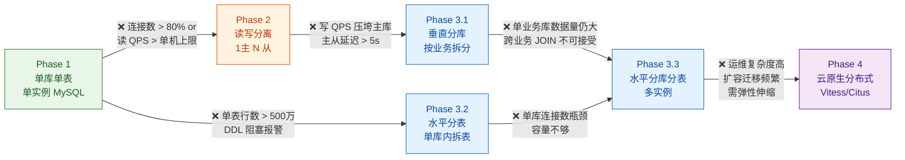

# 分库分表总览与选型

> 适用版本：ShardingSphere 5.5.x、Vitess v20.x、Citus 12.x、MySQL 8.0/8.4、JDK 17+
> 主题范围：分库分表本质与边界、架构演进决策、技术栈选型对比、知识域导航

## 📋 总纲

- ① 分库分表的本质与适用边界——何时该分、何时不该分（含 B+树高度公式算例）
- ② 数据库架构演进全景——单库→读写分离→分库分表→云原生分布式，每步瓶颈诊断+触发判据
- ③ 技术栈选型总表 + 决策树——客户端代理(ShardingSphere-JDBC) vs 服务端代理(Proxy) vs 云原生(Vitess/Citus)，MySQL 主线 + PG 穿插
- ④ 知识域导航——本系列即将覆盖的 7 个子主题
- ⑤ 选型建议——主流推荐 + 各自适用场景

---

## 受众声明

- **面向**：Java 后端开发者（3 年以上经验）及架构师。
- **假设已掌握**：MySQL InnoDB 存储引擎基本工作原理（B+树索引、聚簇索引、页结构）、SQL 基础（CRUD/DDL/DML）、Spring Boot 自动配置与数据源机制。
- **本篇需讲清**：分库分表的基础概念与决策模型，不涉及具体分片算法实现细节（留给 [02-分片键与分片算法详解](02-分片键与分片算法详解.md)）。

## 学习目标

读完本篇，你能：

1. 用 B+树高度公式估算单表数据量瓶颈，判断当前表是否该分
2. 列出数据库架构演进的 4 个阶段及其触发判据（数据量/连接数/写入 QPS 阈值）
3. 区分客户端代理、服务端代理、云原生分布式三种技术路线，说出各自优缺点
4. 为给定业务场景选择合理的分片方案（Hash/Range/List）
5. 掌握 ShardingSphere-JDBC、ShardingSphere-Proxy、Vitess、Citus 四者的定位差异
6. 识别 "不该分" 的典型场景（过度设计、数据量未达阈值、查询模式不匹配）
7. 建立本知识域的整体学习路径，知道自己下一步该读哪篇

## 前置知识

- [00-ORM全家桶总览与选型](../00-ORM全家桶总览与选型.md) —— 理解数据访问层框架选型背景
- [02-CAP与BASE理论详解](../../../../分布式/核心原理/02-CAP与BASE理论详解.md) —— 分库分表后的分布式事务引入 CAP 约束
- 数据库基础：MySQL InnoDB 索引结构（B+树）、主从复制原理

---

## 1. 分库分表的本质与适用边界

### 1.1 本质：垂直拆分 + 水平拆分

分库分表解决的核心矛盾是：**单机数据库的物理资源上限**（CPU/内存/磁盘/IOPS/连接数）与**业务数据增长**之间的冲突。

| 维度 | 分库（垂直/水平） | 分表（水平） |
|------|------------------|-------------|
| 目标 | 分散连接数/IOPS/CPU 压力至多台机器 | 解决单表数据量过大导致的索引深度/写锁/DDL 阻塞 |
| 拆分粒度 | 库级别，跨机器 | 表级别，库内或多库 |
| 主要瓶颈 | 连接数（MySQL 默认 151，调优上限约 2000-3000） | 单表数据量（B+树高度） |
| 典型触发 | 日常连接数 > 80% 上限 | 单表行数 > 500万-1000万（取决于行大小） |

**代码说明**：分库分表是"拆"的过程，拆后必然引入新的问题——跨库 JOIN 不可用、分布式事务、全局主键、跨分片排序/聚合/分页、扩容迁移。这些代价需要在选型前充分评估，见第 3 节技术栈选型。

### 1.2 B+树高度公式：单表数据量瓶颈的定量判断

MySQL InnoDB 的 B+树索引高度决定了查询的**磁盘 IO 次数**——这是单表分区最核心的定量判据。

#### 1.2.1 公式

```
h = 1 + log_ceil(N_page_nonleaf) (N_row / N_page_leaf)
```

其中：
- **h**：B+树高度（根节点算第 1 层）
- **N_page_nonleaf**：非叶子节点每页可存储的索引记录数
- **N_page_leaf**：叶子节点每页可存储的数据行数
- **N_row**：表的总行数

#### 1.2.2 典型算例

**假设条件**：
- InnoDB 页大小 = 16KB（默认，`innodb_page_size=16384`）
- 主键类型 = BIGINT（8 字节）
- 非叶子节点存储：主键(8B) + 页指针(6B) = 14B/条，加上页内开销
- 实际非叶子节点每页可存约 **1170 条**索引记录（16KB × 85% 利用率 ÷ 14B ≈ 994，实际约 1100-1200）
- 叶子节点每页行数取决于行大小。假设平均行大小 = 1KB（含所有字段+元数据），则每页约 **15 行**（16KB × 85% ÷ 1KB ≈ 13-15）
- 利用率系数 0.85 ≈ InnoDB 页填充率（非 100% 满）

**算例 1：500 万行（5M）**

```
h = 1 + log_1170(5,000,000 / 15)
  = 1 + log_1170(333,333)
  = 1 + log_10(333,333) / log_10(1170)
  = 1 + 5.523 / 3.068
  = 1 + 1.80
  ≈ 2.80 → **h = 3**（取整，3 层 B+树）
```

→ 每次索引查询需 **2-3 次磁盘 IO**（根节点常驻内存，只需读 2-3 层）。500 万行对 MySQL 无压力。

**算例 2：5000 万行（50M）**

```
h = 1 + log_1170(50,000,000 / 15)
  = 1 + log_1170(3,333,333)
  = 1 + 6.523 / 3.068
  = 1 + 2.13
  ≈ 3.13 → **h = 4**
```

→ 每次索引查询需 **3-4 次磁盘 IO**。如果数据在内存（InnoDB Buffer Pool 命中），IO 开销可忽略；若内存不足、频繁磁盘读取，4 层 B+树开始出现性能下降。

**算例 3：5 亿行（500M）**

```
h = 1 + log_1170(500,000,000 / 15)
  = 1 + log_1170(33,333,333)
  = 1 + 7.523 / 3.068
  = 1 + 2.45
  ≈ 3.45 → **h = 4**
```

→ 5 亿行仍为 h=4（因为每层非叶子节点可容纳 1170 个分叉，增长是对数级）。但叶子节点数据量巨大，**Buffer Pool 命中率急剧下降**，辅索引的随机 IO 成为瓶颈。

**算例 4：50 亿行（5B）**

```
h = 1 + log_1170(5,000,000,000 / 15)
  = 1 + log_1170(333,333,333)
  = 1 + 8.523 / 3.068
  = 1 + 2.78
  ≈ 3.78 → **h = 4**
```

→ 50 亿行仍仅为 h=4（B+树宽而浅的特性）。但此时**写放大**（页分裂/索引维护）和**内存压力**远大于 IO 次数瓶颈。

**关键结论**：
- B+树高度本身不是限制单表容量的主要瓶颈（50 亿行也能 h=4）
- 真正瓶颈在于：**Buffer Pool 无法容纳热数据**、**写锁冲突**、**DDL 阻塞**、**备份恢复时间**、**运维复杂度**
- 分表阈值：**MySQL 官方建议单表不超过 2000 万行**（经验值，行大小 < 1KB 时），实际生产中 500 万-1000 万行就开始考虑分表，**不是因为 IO 次数，而是因为内存/运维/写入压力**

### 1.3 写锁瓶颈

MySQL InnoDB 行锁机制在单表高并发写入时的表现：

| 场景 | 单表 500 万行 | 单表 5000 万行 | 分 10 表（每表 500 万） |
|-----|:-----------:|:-----------:|:-------------------:|
| 行锁冲突概率 | 低 | 高（同一索引范围聚集） | 分散到各表，降低热行竞争 |
| 间隙锁范围 | 小 | 大（范围查询锁定多行） | 每表数据量小，锁范围缩小 |
| 死锁概率 | 低 | 高（跨行更新并发） | 各表独立，概率降低 |
| 页分裂开销 | 可接受 | 频繁插入导致页分裂，redo log 暴增 | 单表数据量小，页分裂频率下降 |

**代码说明**：写锁瓶颈的核心是**锁粒度×数据密度**。单表数据量越大，二级索引的聚集度越高（相同索引值覆盖更多行），范围查询/更新触发的行锁总量越大。分表后每表数据量减小，同等 SQL 触发的锁行数减少，并发度提升。

### 1.4 连接数瓶颈

MySQL 默认 `max_connections=151`，调优后可达 2000-3000（受内存限制）。

```
连接数需求估算公式：
Conn_needed = 应用实例数 × 每个实例的池大小 × 连接复用率

例：20 个微服务实例 × 每个实例连接池 50（HikariCP 默认 10，但密集型可到 50）
= 1000 个连接。单库 MySQL 调优到 2000 勉强够，但实例扩展到 50 个时 = 2500 超限。
```

**分库效果**：将连接分散到多个数据库实例，每个实例的连接数独立控制。分 4 库后，每个实例只需处理 1/4 的连接。

### 1.5 什么时候不该分（反模式）

分库分表是有代价的架构决策，以下场景应尽量避免：

1. **数据量远未达阈值**（< 500 万行，且年增长 < 100 万行）→ 分表增加不必要的复杂度
2. **查询以全表扫描/聚合分析为主** → 分片后跨分片聚合代价极高（需要中间层做归并）
3. **业务模型频繁跨分片 JOIN** → 分库后跨库 JOIN 不可用，需应用层做多次查询+内存 Join
4. **团队没有分布式中间件运维经验** → 引入 ShardingSphere/Vitess 本身需要维护成本
5. **MySQL 8.0 完全可以满足** → 先用索引优化、读写分离、缓存层（Redis）解决，分库分表是最后手段
6. **需要强事务一致性（ACID）的业务** → 分库分表后跨库事务退化为 BASE（最终一致性），除非使用 XA 或 Seata AT 模式（有性能代价）

**决策原则**：**先优化 SQL、加索引、加缓存、做读写分离。数据量真的到了千万级且仍在快速增长，再考虑分表。连接数真的到了 80% 瓶颈，再考虑分库。**

---

## 2. 数据库架构演进全景

### 2.1 演进阶段流程图



### 2.2 各阶段详解

#### Phase 1：单库单表

**特征**：一个 MySQL 实例，一个数据库，表按业务划分。

**瓶颈诊断**：

| 指标 | 健康阈值 | 告警阈值 | 危险阈值 |
|------|:-------:|:--------:|:--------:|
| 连接数利用率 | < 50% | 80% | > 95% |
| 读 QPS | < 5000 | 10000 | > 20000 |
| 写 QPS | < 1000 | 2000 | > 5000 |
| 单表行数 | < 100万 | 500万 | > 1000万 |
| Buffer Pool 命中率 | > 99% | 95% | < 90% |

**触发判据**：任一指标进入告警阈值，且通过索引优化/缓存/配置调优无法解决 → 进入下一阶段。

#### Phase 2：读写分离（1主N从）

**架构**：主库写，从库读；应用层通过 `AbstractRoutingDataSource` 或 ShardingSphere-JDBC/Proxy 做读写分离。

**配置示例**（ShardingSphere-JDBC 5.5.x YAML）：

```yaml
dataSources:
  write_ds:
    url: jdbc:mysql://192.168.1.10:3306/db?useSSL=false
    username: root
    password: xxx
  read_ds_0:
    url: jdbc:mysql://192.168.1.11:3306/db?useSSL=false
    username: root
    password: xxx
  read_ds_1:
    url: jdbc:mysql://192.168.1.12:3306/db?useSSL=false
    username: root
    password: xxx

rules:
- !READWRITE_SPLITTING
  dataSources:
    readwrite_ds:
      writeDataSourceName: write_ds
      readDataSourceNames:
        - read_ds_0
        - read_ds_1
      loadBalancerName: round_robin
  loadBalancers:
    round_robin:
      type: ROUND_ROBIN
```

**代码说明**：`readwrite_ds` 是逻辑数据源名，应用层透明使用。写操作自动路由到 `write_ds`，读操作轮询分发到 `read_ds_0`/`read_ds_1`。ShardingSphere 通过解析 SQL 语义自动判断读写（`SELECT` 走从库，`INSERT/UPDATE/DELETE` 走主库）。

**瓶颈**：主库写入压力继续增大时，主从延迟成为瓶颈；从库只缓解读压力，写入仍集中。

#### Phase 3：分库分表

**垂直分库**（Phase 3.1）：按业务域拆分到不同数据库实例（如用户库、订单库、商品库）。解决连接数瓶颈和单实例容量，但引入跨库事务问题。

**水平分表**（Phase 3.2）：单库内将大表按分片键拆成多张物理表（如 `order_0` ~ `order_15`）。解决单表数据量过大，但不解决连接数瓶颈。

**水平分库分表**（Phase 3.3）：将数据分散到多个数据库实例的多个表中（如 `ds0.order_0` ~ `ds3.order_15`）。同时解决连接数和数据量瓶颈。

#### Phase 4：云原生分布式数据库

**特征**：基于通用硬件 + 分布式 SQL 引擎，提供弹性伸缩、自动故障转移、透明分片。

**代表**：Vitess（MySQL 兼容）、Citus（PG 扩展）、TiDB（MySQL 兼容，NewSQL）。

---

## 3. 技术栈选型总表与决策树

### 3.1 三大路线对比

| 维度 | 客户端代理（ShardingSphere-JDBC） | 服务端代理（ShardingSphere-Proxy） | 云原生分布式（Vitess/Citus） |
|------|:---:|:---:|:---:|
| **架构定位** | 嵌入应用进程的 JAR 包 | 独立的 MySQL/PG 协议代理层 | 独立的分布式数据库集群 |
| **部署方式** | 引入 Maven/Gradle 依赖 | 独立 Java 进程（可 docker） | 容器化集群（K8s 优先） |
| **SQL 兼容性** | MySQL 子集（非全部） | MySQL 子集（同 JDBC 内核） | Vitess: MySQL 子集；Citus: PG 全兼容 |
| **网络延迟** | 零（本地调用） | +1 跳（应用→Proxy→DB） | +1~2 跳（应用→VTGate→VTTablet→DB） |
| **连接数** | 应用直连 DB，连接数=实例数×池大小 | 应用连 Proxy，Proxy 连 DB，可复用连接 | 同 Proxy，VTGate 统一入口 |
| **分布式事务** | 支持（XA/Local/Seata AT） | 同 JDBC | Vitess: 2PC 有限支持；Citus: PG 分布式事务 |
| **跨分片查询** | 内存归并（GROUP BY/ORDER BY/LIMIT） | 同 JDBC | 下推并行执行 |
| **弹性伸缩** | 手动（需改配置、重分片、迁移数据） | 手动（同 JDBC） | 自动（分片分裂/合并，Vitess Resharding） |
| **运维要求** | 低（只依赖应用部署） | 中（多一个 Proxy 进程） | 高（K8s + etcd + 监控全套） |
| **适用场景** | 单体/微服务 CRUD，Java 生态 | 多语言应用，DBA 希望统一入口 | 大规模弹性伸缩，MySQL/PG 兼容性要求高 |
| **版本（2025 生态）** | ShardingSphere 5.5.x | ShardingSphere 5.5.x | Vitess v20.0+ / Citus 12.1+ |

### 3.2 选型决策树

```mermaid
flowchart TD
    Q1["需要分库分表?"]
    Q2["技术栈是 Java?"]
    Q3["需要弹性伸缩<br/>自动分片迁移?"]
    Q4["数据库是 MySQL?"]
    Q5["DBA 需要统一入口<br/>多语言接入?"]

    Q1 -->|否| END1["先优化索引/缓存/读写分离<br/>不要分"]
    Q1 -->|是| Q2

    Q2 -->|是| Q3
    Q2 -->|否| Q5

    Q3 -->|是| Q4
    Q3 -->|否| OPT1["ShardingSphere-JDBC<br/>嵌入轻量，运维简单"]

    Q4 -->|是| OPT2["Vitess<br/>MySQL 兼容 + 弹性伸缩"]
    Q4 -->|否| OPT3["Citus (PG)<br/>PG 全兼容 + 弹性伸缩"]

    Q5 -->|是| OPT4["ShardingSphere-Proxy<br/>独立代理，多语言支持"]
    Q5 -->|否| OPT5["应用层 Sharding<br/>自己拼 SQL（不推荐）"]

    classDef yes fill:#c8e6c9,stroke:#2e7d32
    classDef no fill:#ffcdd2,stroke:#c62828
    classDef end fill:#e0e0e0,stroke:#616161
    classDef opt fill:#bbdefb,stroke:#1565c0

    class Q1,Q2,Q3,Q4,Q5 yes
    class END1 no
    class OPT1,OPT2,OPT3,OPT4,OPT5 opt
```

### 3.3 各方案详细说明

#### 3.3.1 ShardingSphere-JDBC（客户端代理）

**一句话**：**Java 微服务分库分表首选，零额外延迟，运维极简。**

**适用场景**：
- 纯 Java 技术栈，微服务部署
- 分片规则相对稳定（不频繁变化）
- 团队希望应用层完全控制 SQL 路由
- 连接数受限的场景（直连减少一跳）

**不适用**：
- 非 Java 语言（.NET/Python/Go 等）

**典型配置**（分库分表 YAML）：

```yaml
dataSources:
  ds0:
    url: jdbc:mysql://192.168.1.10:3306/db0?useSSL=false
    username: root
    password: xxx
  ds1:
    url: jdbc:mysql://192.168.1.11:3306/db1?useSSL=false
    username: root
    password: xxx

rules:
- !SHARDING
  tables:
    t_order:
      actualDataNodes: ds${0..1}.t_order${0..15}
      tableStrategy:
        standard:
          shardingColumn: order_id
          shardingAlgorithmName: order_inline
      databaseStrategy:
        standard:
          shardingColumn: user_id
          shardingAlgorithmName: database_inline
  shardingAlgorithms:
    database_inline:
      type: INLINE
      props:
        algorithm-expression: ds${user_id % 2}
    order_inline:
      type: INLINE
      props:
        algorithm-expression: t_order${order_id % 16}
```

**代码说明**：
- `actualDataNodes` 定义了物理表分布：`ds0.t_order_0` ~ `ds0.t_order_15` + `ds1.t_order_0` ~ `ds1.t_order_15`，共 2 库 × 16 表 = 32 张物理表
- `databaseStrategy`：按 `user_id` 取模 2 决定数据进入哪个库（`ds0` 或 `ds1`）
- `tableStrategy`：按 `order_id` 取模 16 决定数据进入哪个表（`t_order_0` ~ `t_order_15`）
- INLINE 算法使用 Groovy 表达式，支持简单运算，不支持 `BETWEEN` 范围查询路由

#### 3.3.2 ShardingSphere-Proxy（服务端代理）

**一句话**：**多语言兼容的透明代理，DBA 友好，但增加一跳网络延迟。**

**适用场景**：
- 多语言技术栈（Java + Python + Go）
- DBA 希望一个统一入口管理所有分片
- 不想修改应用代码（透明接入）

**启动命令**（5.5.x）：

```bash
# 下载:
wget https://archive.apache.org/dist/shardingsphere/5.5.2/apache-shardingsphere-5.5.2-bin.tar.gz
tar -xzf apache-shardingsphere-5.5.2-bin.tar.gz
cd apache-shardingsphere-5.5.2-bin

# 配置: conf/config-sharding.yaml（同 3.3.1 的 YAML 格式）
# 启动:
bin/start.sh
# 默认端口 3307，应用连接 Proxy 如同连接 MySQL
```

#### 3.3.3 Vitess（MySQL 云原生）

**一句话**：**K8s 原生、自动分片迁移、适合超大规模（100+ 节点）的 MySQL 兼容方案。**

**适用场景**：
- 容器化部署（K8s 优先），已有 or 计划上 K8s
- 需要自动分片分裂/合并（Resharding 无需停机）
- 数据量 > 10TB，分片数 > 64
- 需要连接池复用（VTGate 统一管理）

**不适用**：
- 小规模（< 10 节点）— 运维成本过高
- 需要复杂子查询/存储过程 — Vitess SQL 兼容性有限

**核心组件**：
- **VTGate**：无状态 SQL 代理，接收客户端请求，解析 SQL 并路由到对应分片
- **VTTablet**：每个 MySQL 实例对应一个 VTTablet 进程，管理心跳、复制、备份
- **Topology Service**（etcd/zk）：存储分片元数据，驱动 Resharding

#### 3.3.4 Citus（PG 分布式扩展）

**一句话**：**PostgreSQL 的分布式扩展，SQL 兼容性最好（PG 全功能），适合 PG 生态用户。**

**适用场景**：
- 已使用 PostgreSQL 或有 PG 迁移计划
- 需要 PG 高级功能（JSONB/全文/空间/GIS/CTE）在分布式下可用
- 实时分析 + 高并发写入混合场景

**PostgreSQL 对照**：如果你选 PG 而非 MySQL，Citus 是分库分表的天然选择——它作为 PG 扩展（Extension），不需要引入独立中间件，`CREATE TABLE ... DISTRIBUTED BY (column)` 即可定义分片。

---

## 4. 知识域导航

本系列计划覆盖 7 个子主题，建议按以下顺序阅读：

| 序号 | 篇目 | 定位 | 前置依赖 |
|:---:|------|------|---------|
| 00 | [00-分库分表总览与选型](00-分库分表总览与选型.md)（本篇） | 总纲、选型决策、边界判断 | 无 |
| 01 | [01-垂直与水平拆分详解](01-垂直与水平拆分详解.md) | 四象限拆分（垂直分库/分表、水平分库/分表）、MySQL 实测对比 | 本篇 |
| 02 | [02-分片键与分片算法详解](02-分片键与分片算法详解.md) | 分片键选择原则、七大分片算法、一致性哈希迁移量实测 | 01 |
| 03 | [03-中间件架构模式对比详解](03-中间件架构模式对比详解.md) | 客户端代理 vs 服务端代理 vs 云原生，连接数模型算例，Docker 实测 | 00、01 |
| 04 | [04-ShardingSphere-JDBC集成与配置详解](04-ShardingSphere-JDBC集成与配置详解.md) | ShardingSphere-JDBC 5.5.x 完整配置、逻辑表/物理表/绑定表/广播表、结果归并引擎、五步执行流程 | 03 |
| 05 | [05-分布式事务与跨分片查询详解](05-分布式事务与跨分片查询详解.md) | 跨分片 JOIN 5 方案、跨分片分页 4 方案、分布式事务演进（2PC→TCC→Saga→消息） | 01-04 |
| 06 | [06-扩容与数据迁移详解](06-扩容与数据迁移详解.md) | 扩容本质与迁移量差异、三大扩缩容方案（停机/预分片/在线平滑）、数据迁移工具链、平滑迁移完整流程 | 01-05 |
| 07 | 07-大厂分库分表架构案例（待建） | 典型业务场景拆分方案 + 踩坑复盘 | 01-06 |

### 关联引用

以下知识域与本系列紧密相关，请交叉参考：

- 分布式 ID 生成——分库分表后的全局主键（雪花算法/号段模式）详见 [05-分布式ID与幂等设计详解](../../../../分布式/核心原理/05-分布式ID与幂等设计详解.md)
- 一致性哈希——分片算法中的一致性哈希实现（最小化扩容迁移数据量）详见 [01-一致性Hash算法详解](../../../../分布式/核心原理/01-一致性Hash算法详解.md)
- 分布式事务——跨分片写入的分布式事务（Seata AT/XA 模式）详见 [Seata分布式事务框架详解](../../../中间件/分布式协调/分布式事务/Seata分布式事务框架详解.md)
- Python 分布式访问——分库分表后的数据访问层多语言兼容性参考 Python 生态的数据访问层选型（本库暂未收录）（如有）
- 缓存层——分库分表后缓存策略（Redis 分片集群 + 缓存穿透/击穿/雪崩）详见 **00-Redis总览**（见知识库）
- 微服务动态数据源——动态切库/路由属 ShardingSphere 主题，`@RefreshScope` 治不了切库，衔接 [01-Nacos配置·动态热加载详解](../../../中间件/配置中心/Nacos/01-Nacos配置·动态热加载详解.md) §7 埋点

---

## 5. 选型建议

### 5.1 主流推荐

| 应用场景 | 推荐方案 | 理由 |
|---------|---------|------|
| Java 单体/微服务 CRUD，< 64 分片 | **ShardingSphere-JDBC** | 零额外延迟，运维简单，Java 生态深度集成 |
| Java 微服务 + 多语言混合 | **ShardingSphere-JDBC + Proxy 混合** | Java 服务用 JDBC 直连，非 Java 服务通过 Proxy 接入 |
| 大规模（> 100 节点）、K8s 部署、MySQL 主线 | **Vitess** | 自动分片迁移，弹性伸缩，大规模运维标准化 |
| 已有 PG 或希望 PG 全功能分布式 | **Citus** | PG 扩展，SQL 兼容性最好，无额外中间件 |
| 初创团队、数据量 < 500 万 | **都不要分** | 先优化、加索引、加缓存，到了再考虑 |

### 5.2 选型核心原则

1. **复杂度与收益的平衡**：分库分表是最后手段，不是第一选择。数据量没到千万级/连接数没到 80% 就别分。
2. **分片键的选取决定一切**：选错分片键（如按时间分片导致热点）比不分更糟糕。大部分场景 `user_id` 或 `order_id` 取模是最优选择。详见 [02-分片键与分片算法详解](02-分片键与分片算法详解.md)。
3. **预留扩展空间**：初次分片数建议 2 的幂次（16/32/64/128），方便未来扩容时做倍扩容（×2），避免除数变化导致全量数据迁移。
4. **运维能力决定上限**：ShardingSphere-JDBC 运维最简单，Vitess 运维最复杂。选型要考虑团队是否有 K8s 运维能力。
5. **宁可垂直拆分先，再做水平拆分**：先按业务域分库（垂直拆分），必要时再对单表做水平拆分。垂直拆分收益高、代价低，水平拆分代价高、收益需要到一定量级才体现。

---

## 6. 最佳实践

### 6.1 分片数估算

```
分片数 = ceil(预估最大数据量 / 单表目标行数)

例：预估 3 年内数据量 5 亿行，目标单表 500 万行
分片数 = ceil(500,000,000 / 5,000,000) = 100
取 2 的幂次向上取整 → 128 分片
```

### 6.2 ShardingSphere-JDBC 5.x 关键配置项

| 配置项 | 推荐值 | 说明 |
|--------|-------|------|
| `spring.shardingsphere.props.sql-show` | `false`（生产） | 打印 SQL 日志，性能敏感，仅调试开启 |
| `spring.shardingsphere.props.executor-size` | CPU 核心数 × 2 | 并行执行线程数，默认无限，建议限制 |
| `spring.shardingsphere.props.max-connections-size-per-query` | 1 | 每个查询在每个库的最大连接数，建议 1 避免连接池耗尽 |
| `spring.shardingsphere.props.check-table-metadata-enabled` | `true` | 启动时检查表元数据一致性，生产建议开启 |

---

## 7. 常见踩坑

本文涉及的分库分表关键踩坑清单：

| 编号 | 分类 | 现象 | 原因 | 参考 |
|:---:|:---:|------|------|:----:|
| #1.1 | 分片键 | 查询不走分片键，全路由扫描所有分片 | 未配置 Hint 或 TableScan 路由策略 | 踩坑库 [99-分库分表踩坑记录](99-分库分表踩坑记录.md) |
| #1.2 | 分片键 | 跨分片 ORDER BY LIMIT 的结果错误 | 归并策略未正确理解（取 TOP N 改为取每个分片的 TOP N 再归并） | 同上 |
| #1.3 | 连接数 | 应用启动后 DB 连接数暴增 | 每个分片对应一个独立数据源，连接池总数 = 分片数 × 池大小 | 同上 |
| #1.4 | 扩容 | 分片数变更后历史数据无法路由 | 取模分片算法依赖除数为分片数，扩容后除数变化 | 同上 |

> 详见 [99-分库分表踩坑记录](99-分库分表踩坑记录.md)，每个条目提供完整现象→原因→解决方案。

---

## 8. 小结

1. **分库分表的本质**：用拆分换取扩展性，但引入分布式事务/跨分片查询/扩容迁移等新问题。
2. **定量判据**：B+树高度 h≤4 对单表不是瓶颈，真正瓶颈是内存/写锁/连接数/运维。单表 500 万-1000 万行是业界经验阈值。
3. **架构演进 4 步**：单库 → 读写分离 → 分库分表 → 云原生分布式，每步有明确的触发判据。
4. **选型三选一**：Java 生态首选 ShardingSphere-JDBC（嵌入零延迟）；多语言/大规模选 ShardingSphere-Proxy 或 Vitess；PG 生态选 Citus。
5. **不该分就不分**：数据量没到、查询模式不匹配、团队没运维能力，不要为了技术而技术。

---

## 下一篇

[02-分片键与分片算法详解](02-分片键与分片算法详解.md) —— 深入取模/Hash/范围/一致性哈希 4 种分片算法，分片键选择原则，广播表/绑定表设计。

---

## 参考资料

- [Apache ShardingSphere 官方文档](https://shardingsphere.apache.org/document/current/cn/)，查询日期：2026-08-16
- [Vitess 官方文档](https://vitess.io/docs/) 版本 v20.0，查询日期：2026-08-16
- [Citus (PG) 官方文档](https://docs.citusdata.com/) 版本 12.1，查询日期：2026-08-16
- 《高性能 MySQL（第 4 版）》Baron Schwartz 等著——B+树高度公式与算例
- [05-分布式ID与幂等设计详解](../../../../分布式/核心原理/05-分布式ID与幂等设计详解.md)——全局主键生成策略
- [01-一致性Hash算法详解](../../../../分布式/核心原理/01-一致性Hash算法详解.md)——一致性哈希分片算法
- [Seata分布式事务框架详解](../../../中间件/分布式协调/分布式事务/Seata分布式事务框架详解.md)——跨分片分布式事务