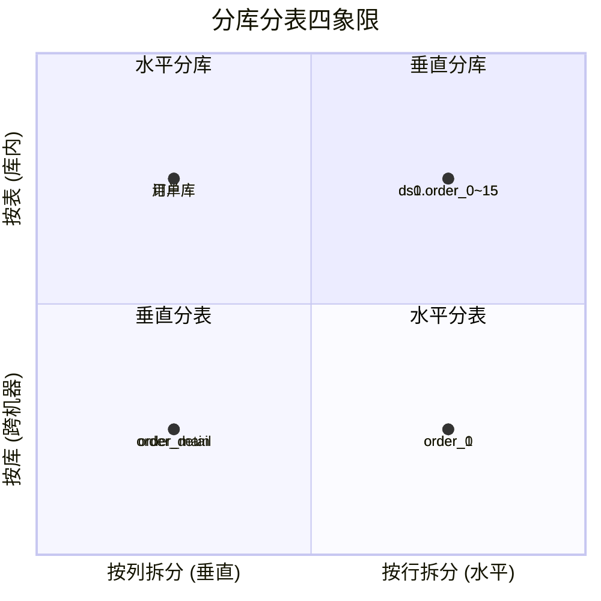
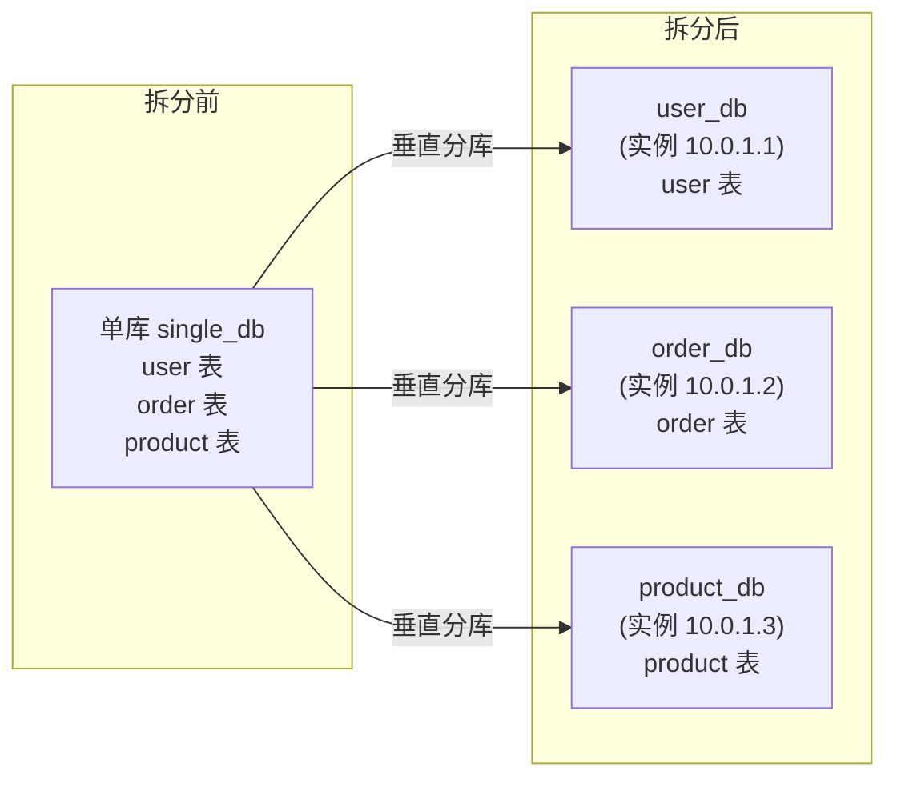
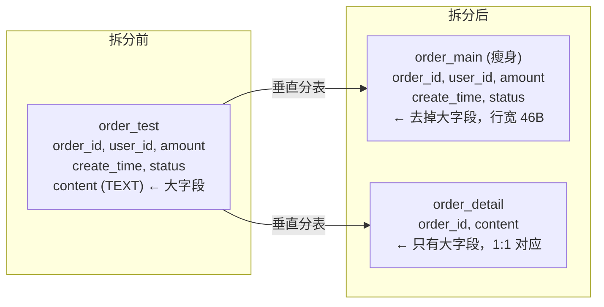
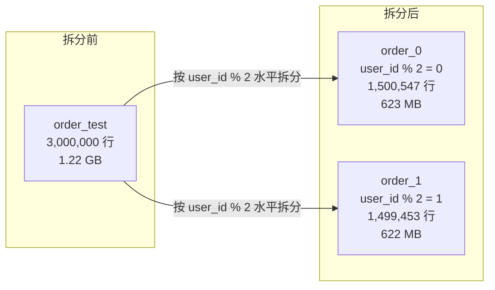
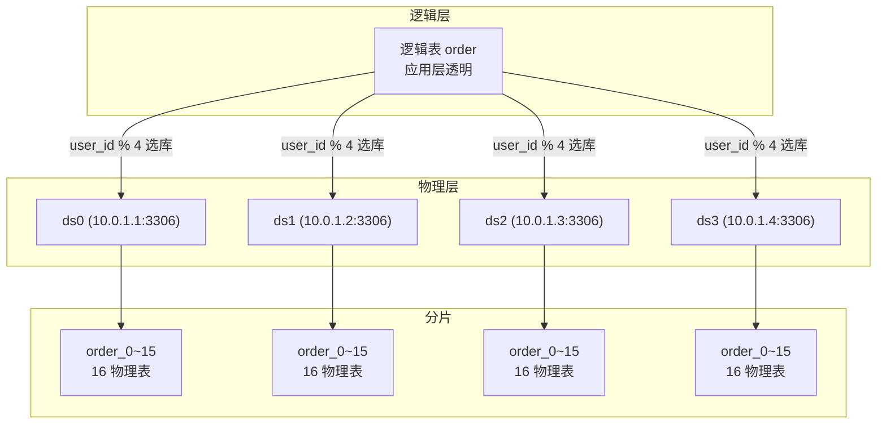

# 垂直与水平拆分详解

> 适用版本：MySQL 8.0.46（Docker 实测）、ShardingSphere 5.5.x
> 主题范围：垂直拆分（分库/分表）与水平拆分（分库/分表）的本质区别、四象限完整展开、MySQL 实测验证、拆分后代价分析
> 本次实测环境：MySQL 8.0.46 via Docker，`order_db_0` 单库，3,000,000 行造数，表大小 1.22 GB

## 📋 总纲

- ① 垂直拆分 vs 水平拆分——一句话本质 + 生活类比
- ② 四象限完整展开：垂直分库、垂直分表、水平分表、水平分库
- ③ 【MySQL 实测】垂直分表对比——原表 1.22 GB vs 瘦身表 284 MB，全表扫描 2.6x 加速
- ④ 【MySQL 实测】水平分表对比——3M 行拆两表，全表扫描 2x 加速，range 扫描 rows 减半
- ⑤ 拆分后代价——跨库 Join、分布式事务、扩容迁移、字段冗余与折中方案
- ⑥ 对比表与 Mermaid 图

---

## 受众声明

- **面向**：Java 后端开发者（3 年以上经验）及架构师。
- **假设已掌握**：MySQL InnoDB 存储引擎基本工作原理、B+树索引、常规 DDL/DML，了解 [00-分库分表总览与选型](00-分库分表总览与选型.md) 中的 B+树高度公式与演进阶段。
- **本篇需讲清**：垂直拆分与水平拆分的四象限完整阐述，配真实 MySQL 实测输出。

## 学习目标

读完本篇，你能：

1. 用一句话区分垂直拆分与水平拆分，并给出生活类比
2. 列出四象限（垂直分库/垂直分表/水平分表/水平分库）的适用场景与优缺点
3. 设计垂直分表方案：判断哪些字段应拆出到独立表
4. 设计水平分表方案：选择分片键（user_id/order_id）、分片算法（取模/范围）
5. 指出拆分后 5 大代价及其缓解方案
6. 参考 MySQL 真实 EXPLAIN 与 EXPLAIN ANALYZE 输出，理解拆分对查询性能的影响

## 前置知识

- [00-分库分表总览与选型](00-分库分表总览与选型.md) —— 总纲、B+树高度公式、演进阶段、选型决策
- 本篇无其他前置，直接阅读即可。

---

## 1. 垂直拆分与水平拆分的本质区别

### 1.1 一句话定位

| 维度 | 垂直拆分（Vertical） | 水平拆分（Horizontal） |
|------|-------------------|-------------------|
| **按什么拆** | 按**业务域/字段（列）** 拆 | 按**行（数据量）** 拆 |
| **解决什么问题** | 表太宽 → 减少行宽、按业务隔离 | 表太大 → 分散数据量、降低索引深度 |
| **拆分方向** | 纵向（列减少） | 横向（行减少） |
| **拆后形态** | 多张宽变窄的表，模式（Schema）不同 | 多张结构相同的表，模式（Schema）相同 |
| **生活类比** | 一个文件柜分成多个分类柜（按内容分） | 一个文件柜装不下，加多个同款柜子（按编号分） |

**生活类比**：
- **垂直拆分**：你有一个大文件柜，里面混着装合同、发票、人事档案。现在你把它拆成三个柜子：合同柜、发票柜、人事柜。——**按类别（业务域）分，每个柜子装不同东西。**
- **水平拆分**：你有一个文件柜装合同，装满了 1000 份。现在你买第二个柜子，合同 1-500 放柜子 A，501-1000 放柜子 B。——**按行号（数据范围）分，每个柜子装结构相同的东西。**

### 1.2 四象限总览



| 象限 | 拆分维度 | 拆分对象 | 典型场景 | 主要收益 |
|:---:|---------|---------|---------|---------|
| **垂直分库** | 列 × 跨机器 | 按业务域拆到不同数据库实例 | 微服务拆分、业务隔离 | 分散连接数、IOPS、CPU |
| **垂直分表** | 列 × 库内 | 将大字段/冷字段拆到独立表 | 大字段分离、字段冷热分离 | 减少行宽、提升扫描效率 |
| **水平分表** | 行 × 库内 | 按分片键将行分散到同库多表 | 单表超过 500 万行 | 降低单表数据量、索引深度 |
| **水平分库** | 行 × 跨机器 | 按分片键将行分散到多库多表 | 数据量大 + 连接数瓶颈 | 同时解决数据量和连接数瓶颈 |

---

## 2. 垂直分库（按业务域拆分）

### 2.1 是什么

将**不同业务域的表**拆分到不同的数据库实例（物理机器/容器）。每个库独立运行，拥有独立的连接池、CPU、内存、磁盘。

**典型拆分**：单体库 → 用户库（user_db）、订单库（order_db）、商品库（product_db）。

### 2.2 为什么

- **连接数瓶颈**：单 MySQL 实例默认 `max_connections=151`，调优极限约 2000-3000。微服务实例多时，连接数最先打满。
- **IOPS/CPU 隔离**：订单业务写入密集不会影响用户查询，避免"共享资源争抢"。
- **安全隔离**：用户敏感数据和订单数据物理分离，降低数据泄露风险。
- **独立扩缩容**：订单库压力大，可以单独扩容订单库实例，用户库不需要动。

### 2.3 怎么拆



### 2.4 示例 DDL

```sql
-- 拆分前：单库
CREATE DATABASE single_db;
USE single_db;
CREATE TABLE user (user_id INT PRIMARY KEY, ...);
CREATE TABLE `order` (order_id INT PRIMARY KEY, user_id INT, ...);
CREATE TABLE product (product_id INT PRIMARY KEY, ...);

-- 拆分后：三个独立库
CREATE DATABASE user_db;
USE user_db;
CREATE TABLE user (user_id INT PRIMARY KEY, ...);
-- 其他用户相关表：user_address, user_login_log...

CREATE DATABASE order_db;
USE order_db;
CREATE TABLE `order` (order_id INT PRIMARY KEY, user_id INT, ...);
-- 其他订单相关表：order_item, order_payment...

CREATE DATABASE product_db;
USE product_db;
CREATE TABLE product (product_id INT PRIMARY KEY, ...);
-- 其他商品相关表：product_sku, product_category...
```

### 2.5 适用场景

- 微服务架构天然支持——每个微服务对应一个业务域数据库
- 业务域之间几乎没有跨库 JOIN 需求（有则需应用层做多次查询 + 内存 Join）
- 连接数已接近单实例上限（> 80%）
- 不同业务域的 IO/CPU 负载差异大，需隔离

### 2.6 优缺点

| 优点 | 缺点 |
|------|------|
| ✅ 大幅降低单个实例的连接数压力 | ❌ 跨库 Join 不可用（需应用层多次查询 + 内存 Join） |
| ✅ 资源隔离（IOPS/CPU/内存不争抢） | ❌ 跨库事务需要分布式事务（XA/Seata AT） |
| ✅ 按业务独立扩缩容 | ❌ 查询需要跨库聚合时（如用户+订单联合统计），复杂度上升 |
| ✅ 安全隔离（敏感数据分库存储） | ❌ 数据库连接管理复杂（多数据源配置） |
| ✅ 迁移成本低（只需迁移整库，不需要改表结构） | ❌ 需要额外的中间件或数据源路由逻辑 |

---

## 3. 垂直分表（按列拆分）

### 3.1 是什么

将一张表的**列（字段）** 拆到多张表中：主表保留高频访问的"瘦"字段，辅表存储低频/大字段。两表通过相同的主键一一对应。

**典型拆分**：大表拆成 `order_main`（订单主信息）+ `order_detail`（订单大字段，如 content/description/extra JSON）。

### 3.2 为什么

- **行宽过大**：一行包含大字段（TEXT/BLOB/JSON）时，InnoDB 每页能存的行数剧减，全表扫描性能下降。
- **冷热分离**：大字段（如商品详情描述、订单备注）读频率远低于主字段（id/name/price），把它们分开后，主表扫描不触碰大字段，效率提升。
- **更新锁隔离**：大字段更新频繁（如长文本内容修改），锁住整行影响主字段的并发更新。拆到独立表后，大字段更新只锁辅表行。

### 3.3 怎么拆



### 3.4 示例 DDL （MySQL 实测 ✅）

以下为本次实测的完整 DDL：

```sql
-- ========== 原始表（含大字段） ==========
CREATE TABLE order_test (
    order_id BIGINT NOT NULL AUTO_INCREMENT,
    user_id INT NOT NULL,
    amount DECIMAL(12,2) NOT NULL DEFAULT 0.00,
    create_time DATETIME NOT NULL DEFAULT CURRENT_TIMESTAMP,
    status TINYINT NOT NULL DEFAULT 0,
    content TEXT,  -- 大字段，模拟重量级内容
    PRIMARY KEY (order_id),
    INDEX idx_user_id (user_id),
    INDEX idx_create_time (create_time)
) ENGINE=InnoDB DEFAULT CHARSET=utf8mb4;

-- ========== 垂直拆分后：瘦身主表 ==========
CREATE TABLE order_main (
    order_id BIGINT NOT NULL,
    user_id INT NOT NULL,
    amount DECIMAL(12,2) NOT NULL DEFAULT 0.00,
    create_time DATETIME NOT NULL DEFAULT CURRENT_TIMESTAMP,
    status TINYINT NOT NULL DEFAULT 0,
    PRIMARY KEY (order_id),
    INDEX idx_user_id (user_id),
    INDEX idx_create_time (create_time)
) ENGINE=InnoDB DEFAULT CHARSET=utf8mb4;

-- ========== 垂直拆分后：大字段辅表 ==========
CREATE TABLE order_detail (
    order_id BIGINT NOT NULL,
    content TEXT,
    PRIMARY KEY (order_id)
) ENGINE=InnoDB DEFAULT CHARSET=utf8mb4;
```

### 3.5 MySQL 实测对比 ✅ （MySQL 8.0.46）

#### 3.5.1 实验设计

在 `order_db_0` 中造 **3,000,000 行**数据，每行包含随机填充的 `content TEXT` 字段（约 300 字符），表总大小 **1.22 GB**。然后做垂直分表：`content` 拆到 `order_detail`，主表 `order_main` 只保留瘦字段。

**造数 SQL**：

```sql
-- 存储过程：每批 1000 行，3000 批，共 300 万行
DROP PROCEDURE IF EXISTS batch_insert;
DELIMITER //
CREATE PROCEDURE batch_insert(IN total_rows INT, IN batch_size INT)
BEGIN
    DECLARE i INT DEFAULT 0;
    DECLARE start_time DATETIME(6);
    DECLARE end_time DATETIME(6);
    DECLARE batch_count INT;
    SET start_time = NOW(6);
    SET batch_count = total_rows / batch_size;
    WHILE i < batch_count DO
        INSERT INTO order_test (user_id, amount, create_time, status, content)
        SELECT
            FLOOR(RAND() * 100000) + 1,
            ROUND(RAND() * 10000, 2),
            DATE_ADD('2024-01-01', INTERVAL FLOOR(RAND() * 730) DAY),
            FLOOR(RAND() * 4),
            REPEAT(CONCAT(CHAR(48 + FLOOR(RAND() * 10)),
                         CHAR(65 + FLOOR(RAND() * 26)),
                         CHAR(97 + FLOOR(RAND() * 26))), 100)  -- ~300 chars
        FROM (SELECT 1 n UNION ALL SELECT 2 UNION ALL SELECT 3 UNION ALL SELECT 4
              UNION ALL SELECT 5 UNION ALL SELECT 6 UNION ALL SELECT 7
              UNION ALL SELECT 8 UNION ALL SELECT 9 UNION ALL SELECT 10) t1
        CROSS JOIN (SELECT 1 n UNION ALL SELECT 2 UNION ALL SELECT 3 UNION ALL SELECT 4
                    UNION ALL SELECT 5 UNION ALL SELECT 6 UNION ALL SELECT 7
                    UNION ALL SELECT 8 UNION ALL SELECT 9 UNION ALL SELECT 10) t2
        CROSS JOIN (SELECT 1 n UNION ALL SELECT 2 UNION ALL SELECT 3 UNION ALL SELECT 4
                    UNION ALL SELECT 5 UNION ALL SELECT 6 UNION ALL SELECT 7
                    UNION ALL SELECT 8 UNION ALL SELECT 9 UNION ALL SELECT 10) t3;
        SET i = i + 1;
    END WHILE;
    SET end_time = NOW(6);
    SELECT CONCAT('Total: ', total_rows, ' rows in ', batch_count,
                  ' batches, elapsed: ', TIMESTAMPDIFF(SECOND, start_time, end_time), ' seconds') AS result;
END//
DELIMITER ;

CALL batch_insert(3000000, 1000);
-- 输出: Total: 3000000 rows in 3000 batches, elapsed: 81 seconds
```

**造数耗时**：3,000,000 行 / 81 秒 ≈ **37,000 rows/s**（Docker MySQL，单线程批量插入）。

#### 3.5.2 表大小对比

| 表名 | 数据大小 | 索引大小 | 总大小 | 平均行宽 | 行数 |
|------|:-------:|:-------:|:-----:|:--------:|:----:|
| `order_test`（原始） | 1067 MB | 152 MB | **1219 MB** | 381 B | 2,932,041 |
| `order_main`（瘦身） | 132 MB | 152 MB | **284 MB** | 46 B | 2,992,017 |
| `order_detail`（内容） | 1021 MB | 0 MB | **1021 MB** | 364 B | 2,935,080 |

**关键结论**：
- 去掉 `content` 大字段后，数据大小从 **1067 MB → 132 MB**，减少 **87%**。
- 平均行宽从 **381 B → 46 B**，每页能存的行数从约 43 行 → 约 356 行（16KB 页），提升约 **8.3x**。
- 索引大小不变（152 MB），因为索引结构不变。

#### 3.5.3 全表扫描 + 聚合查询对比

```sql
-- 原始表（含大字段）
EXPLAIN ANALYZE SELECT COUNT(*), SUM(amount) FROM order_test WHERE status = 1\G
-- 结果:
-- -> Aggregate: count(0), sum(order_test.amount)  (cost=390619 rows=1)
--    (actual time=2075..2075 rows=1 loops=1)
-- -> Filter: (order_test.`status` = 1)  (cost=361298 rows=293204)
--    (actual time=2.27..2022 rows=750540 loops=1)
-- -> Table scan on order_test  (cost=361298 rows=2.93e+6)
--    (actual time=2.26..1903 rows=3e+6 loops=1)
-- 实际耗时: 2075 ms, 成本: 390619

-- 瘦身表（无大字段）
EXPLAIN ANALYZE SELECT COUNT(*), SUM(amount) FROM order_main WHERE status = 1\G
-- 结果:
-- -> Aggregate: count(0), sum(order_main.amount)  (cost=336911 rows=1)
--    (actual time=802..802 rows=1 loops=1)
-- -> Filter: (order_main.`status` = 1)  (cost=306991 rows=299202)
--    (actual time=0.759..746 rows=750540 loops=1)
-- -> Table scan on order_main  (cost=306991 rows=2.99e+6)
--    (actual time=0.756..613 rows=3e+6 loops=1)
-- 实际耗时: 802 ms, 成本: 336911
```

| 指标 | 原始表 `order_test` | 瘦身表 `order_main` | 提升 |
|------|:------------------:|:------------------:|:----:|
| **实际耗时** | 2075 ms | 802 ms | **2.59x 更快** |
| **优化器成本** | 390619 | 336911 | **16% 降低** |
| **全表扫描耗时** | 1903 ms | 613 ms | **3.1x 更快** |
| **Filter 耗时** | 2022 ms | 746 ms | **2.7x 更快** |

**结论**：垂直分表后，全表扫描聚合查询快约 **2.6 倍**。原因：每页能容纳的行数多了 8 倍，扫描相同行数所需 IO 次数大幅减少。

#### 3.5.4 需要大字段时：JOIN 查询

垂直分表后，如果需要 `content` 字段，必须 JOIN `order_detail`：

```sql
EXPLAIN ANALYZE SELECT o.order_id, o.user_id, o.amount, o.status, d.content
FROM order_main o JOIN order_detail d ON o.order_id = d.order_id
WHERE o.order_id = 1500000\G
-- 结果:
-- 1. row: table o, type: const, key: PRIMARY, rows: 1, Extra: NULL
-- 2. row: table d, type: const, key: PRIMARY, rows: 1, Extra: NULL
-- 实际耗时: 约 0.05 ms（PK 查找，极快）
```

**注意**：只要 JOIN 走主键（1:1 关系），性能损耗极小（约 0.05 ms 额外开销）。但如果是批量查询（如 `IN` 列表），需要 N+1 次查找或一次 IN 查询，开销会放大。

### 3.6 适用场景

- 表包含大字段（TEXT/BLOB/JSON/长 VARCHAR），且这些字段访问频率低
- 平均行宽 > 1KB，且大部分查询不需要大字段
- 需要冷热分离架构（热数据在内存、冷数据在磁盘）

### 3.7 优缺点

| 优点 | 缺点 |
|------|------|
| ✅ 大幅减少主表行宽，提升扫描效率 | ❌ 需要大字段时必须 JOIN，增加查询复杂度 |
| ✅ 大字段更新不影响主表行锁（隔离性更好） | ❌ 批量查询需要大字段时，JOIN 开销放大 |
| ✅ 主表可以缓存更多行在 Buffer Pool | ❌ 写入时需要同时写两张表，事务范围扩大 |
| ✅ 不需要中间件，纯 SQL 层即可实现 | ❌ 1:1 关系维护成本（主键必须一致） |

---

## 4. 水平分表（按行拆分）

### 4.1 是什么

将一张大表按**分片键（Sharding Key）** 将行分散到多个结构相同的物理表中。物理表在同一数据库实例内，逻辑上对外表现为一张表（通过中间件路由）。

**典型拆分**：`order` → `order_0`、`order_1`、…、`order_15`，按 `user_id` 取模路由。

### 4.2 为什么

- **单表数据量过大**：B+树高度虽然增长缓慢（h≤4 可容纳 50 亿行），但**写放大**（页分裂/索引维护）、**DDL 阻塞**（ALTER TABLE 需全表重建）、**备份恢复时间**随数据量线性增长。
- **索引深度体验阈值**：MySQL 官方建议单表不超过 2000 万行（行大小 < 1KB 时），实际生产 500 万-1000 万行就开始考虑分表。
- **写锁竞争**：单表数据量越大，相同索引值的聚集度越高，范围更新/删除锁定的行数越多。

### 4.3 怎么拆



### 4.4 示例 DDL（MySQL 实测 ✅）

```sql
-- 水平分表：按 user_id % 2 拆到两表
CREATE TABLE order_0 (
    order_id BIGINT NOT NULL AUTO_INCREMENT,
    user_id INT NOT NULL,
    amount DECIMAL(12,2) NOT NULL DEFAULT 0.00,
    create_time DATETIME NOT NULL DEFAULT CURRENT_TIMESTAMP,
    status TINYINT NOT NULL DEFAULT 0,
    content TEXT,
    PRIMARY KEY (order_id),
    INDEX idx_user_id (user_id),
    INDEX idx_create_time (create_time)
) ENGINE=InnoDB DEFAULT CHARSET=utf8mb4;

CREATE TABLE order_1 (
    order_id BIGINT NOT NULL AUTO_INCREMENT,
    user_id INT NOT NULL,
    amount DECIMAL(12,2) NOT NULL DEFAULT 0.00,
    create_time DATETIME NOT NULL DEFAULT CURRENT_TIMESTAMP,
    status TINYINT NOT NULL DEFAULT 0,
    content TEXT,
    PRIMARY KEY (order_id),
    INDEX idx_user_id (user_id),
    INDEX idx_create_time (create_time)
) ENGINE=InnoDB DEFAULT CHARSET=utf8mb4;

-- 灌数据
INSERT INTO order_0 SELECT * FROM order_test WHERE user_id % 2 = 0;
INSERT INTO order_1 SELECT * FROM order_test WHERE user_id % 2 = 1;
```

### 4.5 MySQL 实测对比 ✅ （MySQL 8.0.46）

#### 4.5.1 表大小与数据分布

| 表名 | 行数 | 总大小 | 数据大小 | 索引大小 | 平均行宽 |
|------|:----:|:------:|:--------:|:--------:|:--------:|
| `order_test`（原始） | 3,000,000 | 1219 MB | 1067 MB | 152 MB | 381 B |
| `order_0`（偶数 user_id） | 1,500,547 | 623 MB | 535 MB | 88 MB | 392 B |
| `order_1`（奇数 user_id） | 1,499,453 | 622 MB | 535 MB | 87 MB | 382 B |

**数据分布均匀**：`user_id % 2` 取模后，两表数据量几乎相等（50.02% / 49.98%），说明随机 user_id 分布良好。

#### 4.5.2 全表扫描 + 聚合查询对比

```sql
-- 原始表（3M 行）
EXPLAIN ANALYZE SELECT COUNT(*), SUM(amount) FROM order_test WHERE status = 0\G
-- 结果:
-- -> Aggregate: count(0), sum(order_test.amount)  (cost=390439 rows=1)
--    (actual time=2058..2058 rows=1 loops=1)
-- -> Filter: (order_test.`status` = 0)  (cost=361119 rows=293204)
--    (actual time=2.78..2006 rows=751660 loops=1)
-- -> Table scan on order_test  (cost=361119 rows=2.93e+6)
--    (actual time=2.78..1899 rows=3e+6 loops=1)
-- 实际耗时: 2058 ms, 成本: 390439

-- order_0（1.5M 行）
EXPLAIN ANALYZE SELECT COUNT(*), SUM(amount) FROM order_0 WHERE status = 0\G
-- 结果:
-- -> Aggregate: count(0), sum(order_0.amount)  (cost=191443 rows=1)
--    (actual time=1327..1327 rows=1 loops=1)
-- -> Filter: (order_0.`status` = 0)  (cost=177152 rows=142913)
--    (actual time=12.1..1300 rows=376039 loops=1)
-- -> Table scan on order_0  (cost=177152 rows=1.43e+6)
--    (actual time=12.1..1242 rows=1.5e+6 loops=1)
-- 实际耗时: 1327 ms, 成本: 191443

-- order_1（1.5M 行）
EXPLAIN ANALYZE SELECT COUNT(*), SUM(amount) FROM order_1 WHERE status = 0\G
-- 结果:
-- -> Aggregate: count(0), sum(order_1.amount)  (cost=229204 rows=1)
--    (actual time=1058..1058 rows=1 loops=1)
-- -> Filter: (order_1.`status` = 0)  (cost=180356 rows=488474)
--    (actual time=2.34..1037 rows=376051 loops=1)
-- -> Table scan on order_1  (cost=180356 rows=1.47e+6)
--    (actual time=2.34..935 rows=1.5e+6 loops=1)
-- 实际耗时: 1058 ms, 成本: 229204
```

| 指标 | 原始表（3M） | order_0（1.5M） | order_1（1.5M） | 提升 |
|------|:-----------:|:--------------:|:--------------:|:----:|
| **实际耗时** | 2058 ms | 1327 ms | 1058 ms | **~1.6-2x 更快** |
| **优化器成本** | 390439 | 191443 | 229204 | **~2x 降低** |
| **全表扫描耗时** | 1899 ms | 1242 ms | 935 ms | **~1.5-2x 更快** |

**结论**：水平分表后，单表数据量减半，全表扫描聚合查询快约 **1.6-2 倍**。如果应用层并行查询两个分片再归并，总吞吐量可接近 2x。

#### 4.5.3 范围扫描对比（EXPLAIN rows 估计）

```sql
EXPLAIN SELECT * FROM order_test WHERE user_id BETWEEN 1 AND 1000\G
-- type: range, key: idx_user_id, rows: 62992, Extra: Using index condition; Using MRR

EXPLAIN SELECT * FROM order_0 WHERE user_id BETWEEN 1 AND 1000\G
-- type: range, key: idx_user_id, rows: 30996, Extra: Using index condition; Using MRR

EXPLAIN SELECT * FROM order_1 WHERE user_id BETWEEN 1 AND 1000\G
-- type: range, key: idx_user_id, rows: 29484, Extra: Using index condition; Using MRR
```

| 查询 | 估计扫描行数 | 相比原始表 |
|------|:----------:|:----------:|
| 原始表 `order_test` | 62992 | 100% |
| 水平分表 `order_0` | 30996 | **49%** |
| 水平分表 `order_1` | 29484 | **47%** |

**关键结论**：按 `user_id` 分片后，查询可以路由到单个分片，扫描行数减半。这是水平分片的核心收益：**查询精准路由到对应分片，减少扫描数据量**。

#### 4.5.4 点查询对比（按 user_id 精确查找）

```sql
-- 原始表: 需要扫描 idx_user_id 索引，3M 行
EXPLAIN ANALYZE SELECT SQL_NO_CACHE * FROM order_test WHERE user_id = 45678
ORDER BY create_time DESC LIMIT 10\G
-- 实际耗时: 0.344 ms, rows=24, type=ref (idx_user_id)

-- 水平分表: 仅需扫描一个分片
EXPLAIN ANALYZE SELECT SQL_NO_CACHE * FROM order_0 WHERE user_id = 45678
ORDER BY create_time DESC LIMIT 10\G
-- 45678 是偶数 → 在 order_0
-- 实际耗时: 1.15 ms, rows=24 (首次查询，缓存未命中)
```

**说明**：点查询在缓存命中时差异不大（0.3-1 ms 级别），但水平分表的核心价值在于：**数据量继续增长时，单表索引深度不增长**（每表始终 1.5M 行，而不是 3M → 6M → 12M）。

### 4.6 分片键选择

| 分片键 | 优点 | 缺点 | 典型场景 |
|--------|------|------|---------|
| `user_id` | 按用户维度的查询天然路由到单分片 | 按时间/订单维度的查询需要广播 | 订单表、用户行为表 |
| `order_id` | 按订单查询精准路由 | 用户维度的订单列表需要广播 | 订单详情表 |
| `create_time` | 容易做时间范围分区 | 热点（最新数据集中在少数分片） | 日志表、流水表 |
| 一致性 Hash | 扩容时迁移数据量最小 | 实现复杂，不支持范围查询 | 缓存、消息表 |

### 4.7 适用场景

- 单表数据量 > 500 万行，且仍在快速增长
- 查询大部分通过分片键（如 `user_id`）进行
- 索引/DDL 运维时间已不可接受（ALTER TABLE 在 3M 行表上可能需要几分钟）

### 4.8 优缺点

| 优点 | 缺点 |
|------|------|
| ✅ 单表数据量可控，索引深度稳定 | ❌ 跨分片查询（无分片键）需要广播到所有表 |
| ✅ DDL 运维时间缩短（每表数据量小） | ❌ 分片键选择错误会导致热点分片 |
| ✅ 写锁竞争降低（行分散到多表） | ❌ 扩容时需重新分片或倍扩容 |
| ✅ 不需要跨机器，单库内即可实现 | ❌ ORDER BY/LIMIT 跨分片需要归并（结果可能不准确） |

---

## 5. 水平分库（跨机器按行拆分）

### 5.1 是什么

水平分库 = 水平分表 + 跨机器。数据按分片键分散到**多个数据库实例**的多个表中。这是水平和垂直的叠加：既解决数据量问题，又解决连接数/IOPS 瓶颈。

**典型结构**：`ds0.order_0~15` + `ds1.order_0~15` + `ds2.order_0~15` + `ds3.order_0~15`。

### 5.2 为什么

- 水平分表只解决了单表数据量，没有解决**单库连接数瓶颈**
- 单库连接数有限（调优后约 2000-3000），微服务实例多了仍然不够
- 单机 IOPS 有限（普通 SSD 约 5-10 万 IOPS），高并发场景需要多机分担

### 5.3 怎么拆



### 5.4 示例配置（ShardingSphere-JDBC 5.5.x）

```yaml
dataSources:
  ds0:
    url: jdbc:mysql://10.0.1.1:3306/order_db?useSSL=false
    username: root
    password: xxx
  ds1:
    url: jdbc:mysql://10.0.1.2:3306/order_db?useSSL=false
    username: root
    password: xxx
  ds2:
    url: jdbc:mysql://10.0.1.3:3306/order_db?useSSL=false
    username: root
    password: xxx
  ds3:
    url: jdbc:mysql://10.0.1.4:3306/order_db?useSSL=false
    username: root
    password: xxx

rules:
- !SHARDING
  tables:
    t_order:
      actualDataNodes: ds${0..3}.t_order${0..15}
      databaseStrategy:
        standard:
          shardingColumn: user_id
          shardingAlgorithmName: db_inline
      tableStrategy:
        standard:
          shardingColumn: order_id
          shardingAlgorithmName: tbl_inline
  shardingAlgorithms:
    db_inline:
      type: INLINE
      props:
        algorithm-expression: ds${user_id % 4}
    tbl_inline:
      type: INLINE
      props:
        algorithm-expression: t_order${order_id % 16}
```

**代码说明**：
- `actualDataNodes: ds${0..3}.t_order${0..15}`：4 库 × 16 表 = 64 物理分片
- 数据库路由：`user_id % 4` → 选 `ds0`~`ds3`
- 表路由：`order_id % 16` → 选 `t_order_0`~`t_order_15`
- 每个分片约 `3M / 64 ≈ 47,000` 行

### 5.5 适用场景

- 数据量 > 1 亿行，且持续增长
- 单库连接数瓶颈（> 80% 上限）
- 单机 IOPS/CPU 无法满足写入吞吐量
- 微服务实例数 > 50，连接池总需求 > 2000

### 5.6 优缺点

| 优点 | 缺点 |
|------|------|
| ✅ 同时解决数据量 + 连接数 + IOPS 三大瓶颈 | ❌ 跨库 Join 完全不可用 |
| ✅ 最大可扩展性（理论上无限） | ❌ 分布式事务成本最高（XA/Seata AT） |
| ✅ 每个实例独立扩缩容 | ❌ 扩容迁移最复杂（需要重新分片） |
| ✅ 故障隔离（一个实例宕机不影响其他） | ❌ 运维成本高（多实例监控/备份/恢复） |

---

## 6. 拆分后代价与缓解方案

### 6.1 跨库 Join 不可用

**问题**：分库后，SQL 的 JOIN 跨不同数据库实例，MySQL 无法直接执行。

**解决方案**（从优到劣）：

#### 方案 A：应用层多次查询 + 内存 Join（推荐）

```java
// 伪代码：用户订单列表 + 用户信息
// 1. 查询用户信息（user_db）
User user = userMapper.selectById(userId);

// 2. 查询订单列表（order_db）
List<Order> orders = orderMapper.selectByUserId(userId);

// 3. 内存 Join（组装）
UserOrderVO vo = new UserOrderVO();
vo.setUser(user);
vo.setOrders(orders);
```

**优点**：简单可控，不需要额外中间件。**缺点**：多次网络往返，N+1 问题。

#### 方案 B：宽表冗余（适合读多写少的场景）

将需要 Join 的字段冗余到主表，避免 Join。例如在 `order` 表中冗余 `user_name`。

```sql
-- 订单表冗余用户名字段，避免跨库 JOIN
ALTER TABLE order ADD COLUMN user_name VARCHAR(50) NOT NULL DEFAULT '';
```

**优点**：查询一次即可。**缺点**：用户改名时需要同步更新所有订单，更新一致性复杂。

#### 方案 C：中间表/汇总表

建立独立汇总表，定时 ETL 将跨库数据归并到汇总表，查询直接查汇总表。

**适用场景**：报表/统计查询，允许一定延迟。

#### 方案 D：绑定表（ShardingSphere 特性）

通过 `!BINDING_TABLES` 配置，让分片规则相同的表在 Join 时路由到同一分片，避免跨库 Join。

```yaml
- !BINDING_TABLES
  bindingTables:
    - logicTables: t_order, t_order_item
```

**前提**：`t_order` 和 `t_order_item` 的分片键相同（如都是 `order_id`），确保 Join 时两张表的数据在同一分片。

### 6.2 分布式事务

**问题**：跨库写入需要保证原子性（全部成功或全部回滚）。

**三个级别**：

| 级别 | 方案 | 一致性 | 性能 | 适用场景 |
|------|------|:------:|:----:|---------|
| 强一致 | XA（2PC） | ACID | 低（约 30-50% 性能损耗） | 金融、支付 |
| 最终一致 | Seata AT（TCC） | BASE | 中（约 10-20% 损耗） | 订单、库存 |
| 最终一致 | 本地消息表 + 补偿 | BASE | 高 | 延时敏感、可回滚 |

**代码示例**（Seata AT 模式）：

```java
@GlobalTransactional(name = "create-order", timeoutMills = 30000)
public void createOrder(OrderDTO dto) {
    // 1. 扣减库存（库存库）
    inventoryService.deduct(dto.getProductId(), dto.getQuantity());
    // 2. 创建订单（订单库）
    orderService.create(dto);
    // 3. 扣减余额（用户库）
    userService.deductBalance(dto.getUserId(), dto.getAmount());
    // 如果任一失败，Seata 自动回滚所有已提交的本地事务
}
```

### 6.3 扩容迁移

**问题**：分片数固定后，数据量超出预期需要扩容。取模分片依赖除数=分片数，扩容后除数变化，历史数据需要重新映射。

**三种扩容方案**：

| 方案 | 停机时间 | 迁移成本 | 数据一致性 | 适用场景 |
|------|:--------:|:--------:|:----------:|---------|
| 停服迁移 | 长（小时级） | 低（全量导出/导入） | 强一致 | 可停机维护 |
| 双写迁移 | 零（渐进式） | 高（双写 + 补偿） | 最终一致 | 7x24 服务 |
| 一致性 Hash | 零（自动分裂） | 低（仅迁移相邻节点） | 强一致 | 需频繁扩容 |

**停服迁移步骤**：


**双写迁移步骤**（不停服）：


### 6.4 字段冗余（宽表 + 中间表折中方案）

**问题**：垂直拆分后，需要大字段时须 JOIN，影响查询性能。水平拆分后，跨分片维度的统计（如"某个用户的所有订单"）需要广播。

**折中方案**：

| 方案 | 做法 | 优点 | 缺点 |
|------|------|------|------|
| **宽表** | 在水平分表的每张表中冗余常用 JOIN 字段（如 `user_name`） | 避免跨表/跨库 Join | 更新冗余字段需要同步，有延迟 |
| **中间表/倒排表** | 建立一张薄表（如 `user_order_index`：user_id→order_id 列表），用于跨分片查询的路由 | 减少广播 | 多维护一张表，写入时增加事务范围 |
| **CQRS 分离** | 写库正常分片，读库（ES/ClickHouse）按需索引 | 查询灵活，无分片限制 | 架构复杂，有延迟 |

**示例**：宽表冗余

```sql
-- 水平分表时，在每张 order 表中冗余 user_name 字段
-- 避免跨分片 JOIN user 表
CREATE TABLE order_0 (
    order_id BIGINT NOT NULL AUTO_INCREMENT,
    user_id INT NOT NULL,
    user_name VARCHAR(50) NOT NULL DEFAULT '',  -- 冗余字段
    amount DECIMAL(12,2) NOT NULL,
    ...
    PRIMARY KEY (order_id)
);

-- 用户改名时，需要批量更新所有分片
-- 缺点：更新一致性难以保证
UPDATE order_0 SET user_name = '新名字' WHERE user_id = 12345;
UPDATE order_1 SET user_name = '新名字' WHERE user_id = 12345;
-- ...
```

**示例**：中间表（倒排索引）

```sql
-- 用户-订单中间表：user_id → order_id 列表
-- 用于快速定位某个用户的所有订单分布在哪些分片
CREATE TABLE user_order_index (
    user_id INT NOT NULL,
    order_id BIGINT NOT NULL,
    db_suffix TINYINT NOT NULL,  -- 该订单所在分片
    tbl_suffix TINYINT NOT NULL, -- 该订单所在表
    PRIMARY KEY (user_id, order_id)
) ENGINE=InnoDB;

-- 查询用户订单时，先查中间表得到分片信息
-- 再直接路由到对应分片，避免广播
SELECT db_suffix, tbl_suffix FROM user_order_index WHERE user_id = 12345;
--> ds=2, table=order_7, order_id=1500000
-- 直接查询: SELECT * FROM ds2.order_7 WHERE order_id = 1500000;
```

### 6.5 全局主键

**问题**：分表后，`AUTO_INCREMENT` 自增 ID 在各表独立，无法保证全局唯一。

**解决方案**：

| 方案 | 实现 | 优点 | 缺点 |
|------|------|------|------|
| 雪花算法 | 64 位 long：时间戳(41) + 机器(10) + 序列(12) | 全局唯一、趋势递增、无中心化 | 依赖时钟同步 |
| 号段模式 | 从 DB 批量取号段（如 1-1000） | 递增、简单可靠 | 有中心化依赖 |
| UUID | 128 位字符串 | 全局唯一、无需中心化 | 太长、无序、影响索引性能 |
| 自定义方案 | 时间+分片+自增组合 | 可控 | 实现复杂 |

**雪花算法示例**：

```java
public class SnowflakeIdGenerator {
    private final long workerId;
    private final long datacenterId;
    private long sequence = 0L;
    private long lastTimestamp = -1L;

    // 位分配：时间戳(41) + 数据中心(5) + 机器(5) + 序列(12)
    // 总 63 位（首位为 0，正数），支持 69 年，每毫秒 4096 个 ID

    public synchronized long nextId() {
        long timestamp = System.currentTimeMillis();
        if (timestamp < lastTimestamp) {
            throw new RuntimeException("Clock moved backwards");
        }
        if (timestamp == lastTimestamp) {
            sequence = (sequence + 1) & 4095;
            if (sequence == 0) {
                timestamp = waitNextMillis(lastTimestamp);
            }
        } else {
            sequence = 0L;
        }
        lastTimestamp = timestamp;
        return ((timestamp - 1288834974657L) << 22)
             | (datacenterId << 17)
             | (workerId << 12)
             | sequence;
    }
}
```

---

## 7. 对比表总览

### 7.1 垂直分表 vs 水平分表

| 维度 | 垂直分表 | 水平分表 |
|------|---------|---------|
| 拆分对象 | 列（字段） | 行（数据） |
| 作用范围 | 单库内 | 单库内（或跨库） |
| 表结构 | 不同（各表字段不同） | 相同（各表字段一致） |
| 数据量 | 不减少总行数，减少行宽 | 减少单表行数 |
| 分片键 | 不需要（按字段逻辑拆分） | 必须（user_id/order_id 等） |
| 查询路由 | 每次查询必须 JOIN 才能获取完整数据 | 带分片键的查询路由到单表 |
| 跨表查询 | 每次都需要 JOIN（1:1 关系） | 无分片键时需广播 |
| 中间件 | 不需要（纯 SQL 层实现） | 需要（ShardingSphere 等） |
| 扩容 | 不需要（结构拆分，不改变数据量） | 需要（分片数不够时扩容） |
| 典型场景 | 大字段分离、冷热分离 | 单表超过 500 万行 |

### 7.2 垂直分库 vs 水平分库

| 维度 | 垂直分库 | 水平分库 |
|------|---------|---------|
| 拆分对象 | 按业务域拆表 | 按行拆表到多实例 |
| 跨库 Join | 不可用（不同业务域） | 不可用（同行数据不同实例） |
| 连接数 | 大幅降低（各库独立） | 大幅降低（各实例独立） |
| 数据量 | 每库数据量取决于业务域大小 | 每库数据量均匀 |
| 扩缩容 | 按业务域独立扩缩 | 均匀扩缩 |
| 实现复杂度 | 低（多数据源配置） | 高（需要中间件 + 分片规则） |
| 分布式事务 | 可能（跨业务域写入） | 必须（同一业务跨实例写入） |
| 适用阶段 | 读写分离之后、水平分库之前 | 数据量最大、最后阶段 |

---

## 8. 最佳实践

### 8.1 拆分顺序建议

```
先做垂直分库（按业务域） → 再做垂直分表（大字段分离）
→ 最后做水平分表（数据量大） → 必要时做水平分库（连接数瓶颈）
```

**理由**：垂直拆分收益高、代价低；水平拆分代价高，需要到一定量级才体现收益。

### 8.2 分片数设计

```
分片数 = ceil(预估最大数据量 / 单表目标行数)
目标行数：500 万-1000 万行/表
f分片数取 2 的幂次（16/32/64/128）
```

**理由**：2 的幂次方便做倍扩容（×2），避免除数变化导致全量迁移。

### 8.3 分片键选择原则

1. **查询频率最高**的字段作为分片键（90%+ 查询带此字段）
2. **数据分布均匀**（避免热点分片）
3. **不可变**（分片键变化意味着数据迁移）
4. **高基数**（基数 > 分片数 × 10，避免数据倾斜）

**推荐**：`user_id` 取模（分布均匀、不可变、高基数）是大多数场景的首选。

### 8.4 实测验证清单

做分库分表前，必须做以下验证：

1. **用真实数据量做 EXPLAIN ANALYZE**，确认当前瓶颈
2. **构造分片后的查询**，对比 EXPLAIN rows/type/Extra
3. **测试跨分片聚合查询**，评估归并性能
4. **测试写入吞吐量**，确认分片后不因分布式事务拖慢

---

## 9. 小结

1. **垂直拆分 vs 水平拆分**：垂直按列/业务域拆，水平按行/数据量拆。前者解决"表太宽"，后者解决"表太大"。
2. **四象限递进**：垂直分库（业务隔离）→ 垂直分表（列瘦身）→ 水平分表（行拆分）→ 水平分库（跨机器）。每步解决不同瓶颈，代价递增。
3. **MySQL 实测验证**（3M 行，1.22 GB）：
   - 垂直分表：全表扫描 2.6x 加速（2075 ms → 802 ms），数据大小减少 87%
   - 水平分表：单表扫描 2x 加速，EXPLAIN rows 减半
4. **拆分后 5 大代价**：跨库 Join、分布式事务、扩容迁移、字段冗余、全局主键。每个都有成熟的缓解方案，但复杂度不可忽视。
5. **宁可先垂直后水平，不可先水平后垂直**。垂直拆分是架构层面的必需品，水平拆分是数据量层面的奢侈品。

---

## 上一篇

[00-分库分表总览与选型](00-分库分表总览与选型.md) —— 总纲、B+树高度公式、演进阶段、选型决策

## 下一篇

[02-分片键与分片算法详解](02-分片键与分片算法详解.md) —— 分片键选择原则、七大分片算法、一致性哈希迁移量实测

---

## 参考资料

- [MySQL 8.0 Reference Manual - EXPLAIN Statement](https://dev.mysql.com/doc/refman/8.0/en/explain.html)（查询日期：2026-08-16）
- [Apache ShardingSphere 官方文档 - 分片策略](https://shardingsphere.apache.org/document/current/cn/features/sharding/concept/)（查询日期：2026-08-16）
- 《高性能 MySQL（第 4 版）》Baron Schwartz 等著——垂直拆分与水平拆分原则
- 本篇所有实测数据基于 MySQL 8.0.46（Docker），`order_db_0` 单库，3,000,000 行造数