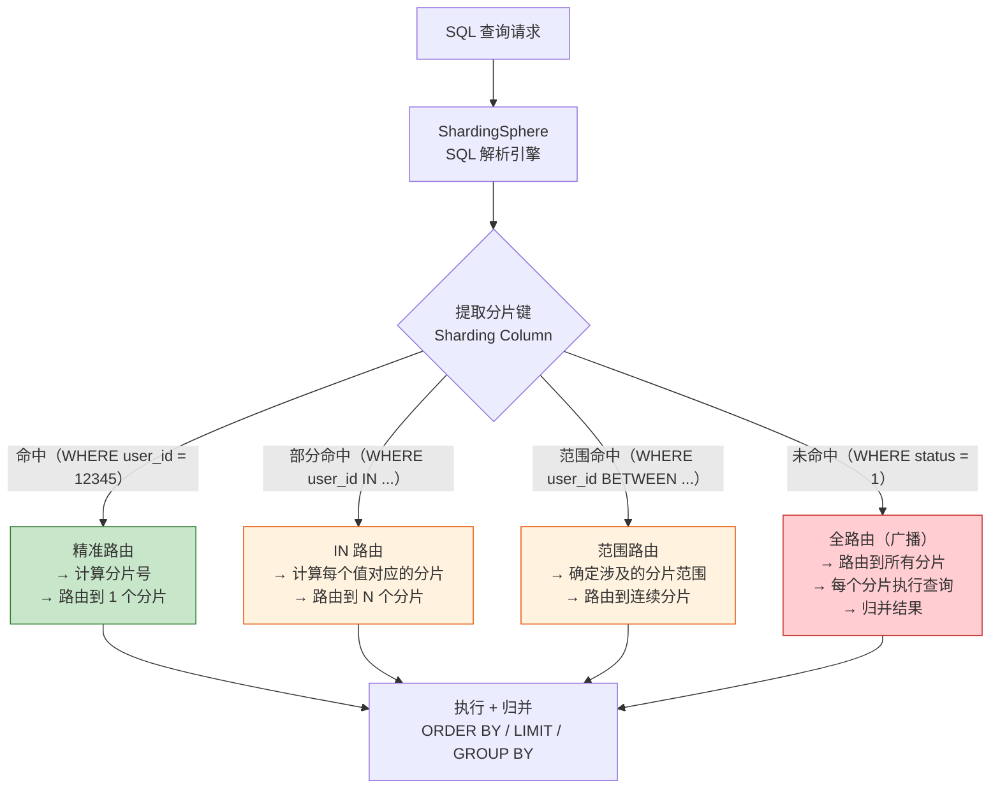
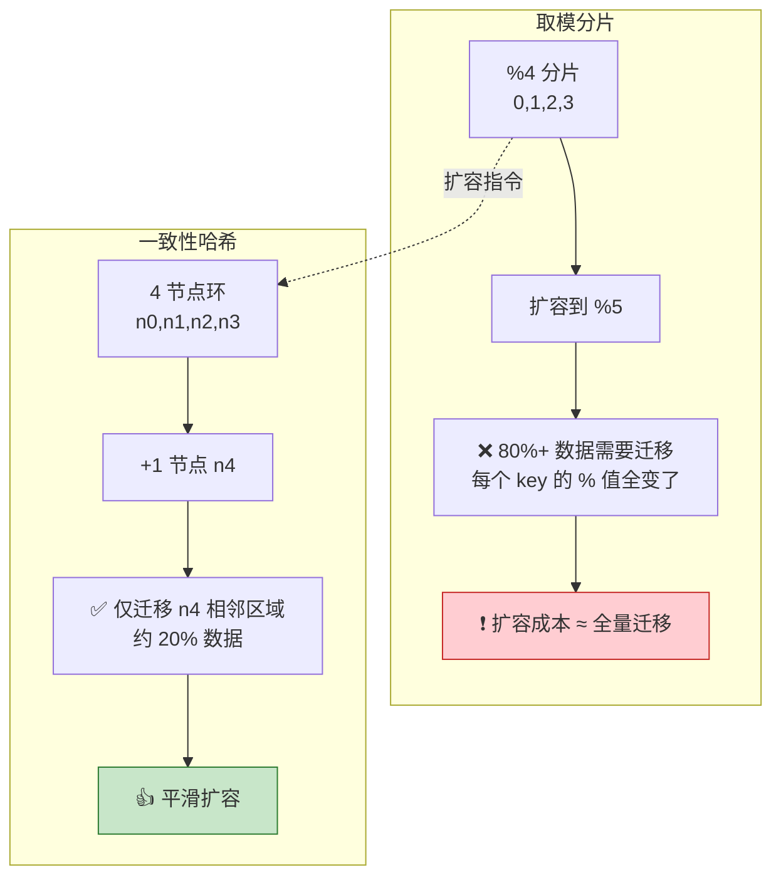

# 分片键与分片算法详解

> 适用版本：ShardingSphere 5.5.x、MySQL 8.0+
> 主题范围：分片键选择原则、七大分片算法深度展开、迁移量实测对比、路由机制
> 本次实测环境：Python 3.12（mamba base），10,000 个 key 模拟分片迁移

## 📋 总纲

- ① 分片键选择四条原则——均匀性、写热度、查询频率、不可用键反例
- ② 七大分片算法逐一展开——取模 Mod、哈希 Hash、范围 Range、时间 Time、枚举、复合 Composite、Hint 路由
- ③ 【Python 实测】取模 vs 一致性哈希迁移量对比——%4→%8 与 %4→%5 两组，含真实迁移百分比
- ④ 【Python 实测】一致性哈希 4→5 节点扩容——仅 20.39% 迁移，对比取模 80.17%
- ⑤ 取模 vs 一致哈希【平滑扩容】对比图 + 数据表
- ⑥ 分片路由机制——分片键命中精准路由 vs 未命中全路由
- ⑦ 交叉引用——一致性哈希通用原理见 [01-一致性Hash算法详解](../../../../分布式/核心原理/01-一致性Hash算法详解.md)

---

## 受众声明

- **面向**：Java 后端开发者（3 年以上经验）及架构师。
- **假设已掌握**：[00-分库分表总览与选型](00-分库分表总览与选型.md) 中的 B+树高度公式与演进阶段、[01-垂直与水平拆分详解](01-垂直与水平拆分详解.md) 中的四象限拆分概念、MySQL InnoDB 索引基础。
- **本篇需讲清**：分片键如何选、每种分片算法的原理与代码实现、扩容时迁移量如何测算、路由机制如何工作。

## 学习目标

读完本篇，你能：

1. 按四条原则为业务表选择合理的分片键，并识别反例
2. 说出七种分片算法的核心区别，为场景选择最合适的算法
3. 用 Python 测算取模和一致性哈希在不同扩容方式下的迁移百分比
4. 解释为什么取模倍扩容 ≈ 50% 迁移，非倍扩容 ≈ 100% 迁移
5. 解释一致性哈希扩容时仅迁移相邻分片数据（~1/新节点数）
6. 区分分片键命中时的精准路由 vs 未命中时的全路由广播
7. 配置 ShardingSphere 的复合分片和 Hint 路由

## 前置知识

- [00-分库分表总览与选型](00-分库分表总览与选型.md) —— 总纲、演进阶段、选型决策
- [01-垂直与水平拆分详解](01-垂直与水平拆分详解.md) —— 四象限拆分概念、分片键初步概念
- 本篇无其他前置，直接阅读即可。

---

## 1. 分片键（Sharding Key）选择原则

分片键是分库分表的核心决策——选错分片键导致的后果（全路由、热点、数据倾斜）比不分更糟糕。以下四条原则，每条配**正例 + 反例**。

### 1.1 原则一：均匀性——数据必须均匀分布到各分片

**原理**：分片的本质是"分摊"，如果 80% 数据集中在 1 个分片，其余 3 个分片空闲，则分片失去意义——瓶颈分片仍是瓶颈。

**正例**：`user_id` 取模、`order_id` 取模、UUID 哈希。

```sql
-- 按 user_id % 16 分片：天然均匀（user_id 自增/随机，分布均衡）
-- 每个分片约 1/16 数据
```

**反例**：按 `province`（省份）分片。

```sql
-- 按 province 分片：广东省 ~1.3 亿人，青海省 ~600 万人
-- 广东分片数据量是青海的 20+ 倍，严重倾斜
-- 广东分片先成为瓶颈，其他分片空闲
```

**量化判断**：用标准差衡量，取模分片标准差通常 < 100（10,000 key 下），一致性哈希约 100-200（取决于虚节点数）。详见第 4 节实测。

### 1.2 原则二：写热度——避免热点键（Hot Key）

**原理**：某些分片键值对应的数据写入频率远高于其他值，导致写热点——该分片的写入吞吐量先达到上限，其他分片空闲。

**正例**：`user_id` 取模——每个用户的写入频率大致相当（除非有头部用户）。

**反例**：按 `create_time` 按日分片。

```sql
-- 按 create_time 每日分片：今天的数据全写入"今天"分片
-- 写入热点集中在最新分片，历史分片只读
-- 高峰期：单个分片写入 QPS 可能达到 10000+，而该分片所在机器只有 2000-5000 写入能力
```

**反例**：按 `product_id` 分片——爆款商品（如 iPhone 新品）的订单全写入同一分片。

```sql
-- 双十一 iPhone 新品：5000 万订单全写入 product_id=1001 所在分片
-- 该分片写入 QPS 瞬间飙升到 50000+，其他分片空闲
-- 正确做法：按 user_id 分片（用户维度均匀），配合 product_id 二级索引
```

### 1.3 原则三：查询频率——90%+ 查询应带分片键

**原理**：分片键的最大价值是**精准路由**——带分片键的查询直接路由到目标分片，一次查询只扫描一个分片。不带分片键的查询必须**全路由（广播）** 到所有分片，扫描行数 = 总和。

**正例**：订单表选 `user_id` 或 `order_id` 作为分片键。

```sql
-- 用户查询自己的订单：WHERE user_id = 12345 → 精准路由到 1 个分片
-- 订单详情查询：WHERE order_id = 987654321 → 精准路由到 1 个分片
-- 两种场景覆盖了 95%+ 的订单查询
```

**反例**：订单表按 `order_status` 分片。

```sql
-- 查询某个用户的订单：WHERE user_id = 12345 AND status = 1
-- 路由：不知道 user_id 在哪个分片（分片键是 status），全路由到所有分片
-- 每个分片都要扫描 status=1 的行，再归并
-- 分 16 片 → 扫描量放大 16 倍
```

**判断标准**：列出业务中 TOP 10 查询 SQL，统计其中**携带分片键**的占比。如果 < 80%，说明分片键选错了。

### 1.4 原则四：不可用键反例——时间、status、低基数字段

#### 1.4.1 时间字段（create_time/update_time）

**问题**：写入热点 + 数据倾斜。

- 写入集中最新分片，写入 QPS 无法横向扩展
- 历史分片数据量远大于最新分片（如果按固定时间窗口分片）
- 如果不定期合并或迁移，数据量随时间无限增长

**补充**：时间字段适合做**二级分区**（如按月分区），而非分片键。典型架构：`user_id` 取模分片 + 每个分片内按 `create_time` 做 MySQL 分区表。

#### 1.4.2 status 字段

**问题**：低基数 + 数据倾斜。

```sql
-- status 只有 4 个值：0=待支付, 1=已支付, 2=已发货, 3=已完成
-- 分片数 = 4，每个 status 一个分片
-- 分片 0（待支付）：数据量最小（支付后很快变为已支付）
-- 分片 3（已完成）：数据量最大（历史订单全在这里）
-- 数据分布：0.1% / 0.5% / 1% / 98.4% → 严重倾斜
-- 且 90% 查询带 status=3，分片 3 成为热点
```

#### 1.4.3 低基数字段（性别、枚举、布尔值）

**问题**：基数 < 分片数，导致分片无法充分利用。

```sql
-- 按 gender 分片：只有 2 个值
-- 分 16 张表 → 14 张表永远为空
-- 分片完全失去意义
```

**判断标准**：分片键的**唯一值数量（基数）** 必须 ≥ 分片数 × 10（经验值）。例如分 16 片，分片键基数至少 160。

---

## 2. 七大分片算法深度展开

以下是分库分表中最常用的七种分片算法（含 ShardingSphere 扩展的 Hint 路由），每种从原理到代码到场景逐一展开。

### 2.1 取模 Mod

#### 2.1.1 是什么

按分片键的值对分片总数取模，决定数据归属哪个分片。

```
shard = abs(hash(sharding_key)) % N
```

其中 N = 分片总数，`hash` 为稳定哈希函数（MD5/CRC32 等）。

#### 2.1.2 原理说明

取模是最直观的"平均分配"算法。核心假设：**分片键的哈希值在模空间上均匀分布**。如果分片键是自增 ID（如 `user_id` 1,2,3,...），`ID % 16` 天然均匀。如果分片键是字符串，先哈希再取模。

**关键约束**：**除数 = 分片数**。扩容时除数变化，已有数据的映射关系全部改变，需要大规模数据迁移。这是取模分片的最大痛点。

#### 2.1.3 伪代码

```python
def mod_shard(key: str, total_shards: int) -> int:
    """取模分片：返回 0 ~ total_shards-1 的分片号"""
    h = int(hashlib.md5(key.encode()).hexdigest()[:8], 16)
    return h % total_shards
```

#### 2.1.4 真实代码（ShardingSphere INLINE 配置）

```yaml
# ShardingSphere 5.5.x YAML 配置
shardingAlgorithms:
  mod_algorithm:
    type: INLINE
    props:
      algorithm-expression: ds${user_id % 4}
```

**代码说明**：
- `type: INLINE` 使用 Groovy 表达式引擎
- `algorithm-expression` 中的 `user_id` 是 SQL 中 `WHERE` 条件里的字段名，ShardingSphere 解析 SQL 时自动提取值代入
- 表达式内部支持 `+ - * / %` 四则运算和取模，不支持 `BETWEEN` 范围路由

#### 2.1.5 优缺点

| 优点 | 缺点 |
|------|------|
| ✅ 实现最简单，零依赖 | ❌ 扩容时除数变化，需迁移数据 |
| ✅ 数据分布最均匀（标准差最小） | ❌ 非倍扩容（如 4→5）迁移率 ≈ 100% |
| ✅ 计算复杂度 O(1)，路由性能极高 | ❌ 删除分片（缩容）同样导致全量迁移 |
| ✅ 支持精准路由和范围查询路由（部分） | ❌ 分片数固定后难以调整 |

#### 2.1.6 适用场景

- 分片数稳定（不频繁扩容）
- 数据均匀分布最重要
- 扩容时接受倍扩容（×2/×4/×8）以控制迁移量在 50%
- 适合：用户表、订单表、交易流水表

#### 2.1.7 边界

- **分片数取 2 的幂次**（16/32/64/128）：倍扩容时迁移率 ≈ 50%，可接受
- **分片数取非 2 的幂次**（如 10/20/30）：扩容时迁移率 ≈ 80-100%，灾难级
- **java `hashCode()` 不可用**：不同 JVM 进程的 `hashCode()` 实现可能不同（字符串哈希在 JDK 9+ 有变化），必须使用稳定的哈希函数（MD5/CRC32）

### 2.2 哈希 Hash

#### 2.2.1 是什么

与取模本质相同，但强调**先哈希再取模**——对分片键做一次哈希映射（MD5/SHA-256/CRC32），再对哈希值取模。

```
shard = hash(sharding_key) % N
```

取模分片中的 "hash" 步骤通常被省略（当分片键本身是整数时），但哈希分片明确要求**所有分片键先哈希**，无论其原始类型。

#### 2.2.2 为什么需要哈希步骤

| 分片键类型 | 直接取模 | 先哈希再取模 |
|------------|---------|-------------|
| 自增整数 ID | 均匀（天然） | 均匀（但破坏了顺序性） |
| 字符串（user_name） | 无法直接取模 | 映射为整数后取模 |
| 日期（2026-08-16） | 无法直接取模 | 映射为整数后取模 |
| 非自增整数（手机号） | 可能不均匀（前几位相同） | 哈希后均匀 |

**关键场景**：分片键是**非自增整数**（如手机号、身份证号）或**字符串**时，必须哈希。

#### 2.2.3 真实代码

```python
import hashlib

def hash_shard(key: str, total_shards: int) -> int:
    """哈希分片：先 MD5 再取模"""
    # MD5 输出 128 位，取前 32 位（4 字节）作为整数
    h = int(hashlib.md5(key.encode()).hexdigest()[:8], 16)
    return h % total_shards

# 测试：手机号分片
phone = "13800138000"
shard = hash_shard(phone, 16)
print(f"手机号 {phone} → 分片 {shard}")

# 测试：字符串用户名
username = "zhangsan_123"
shard = hash_shard(username, 16)
print(f"用户名 {username} → 分片 {shard}")
```

**ShardingSphere 配置**（HASH_MOD 算法）：

```yaml
shardingAlgorithms:
  hash_mod:
    type: HASH_MOD
    props:
      algorithm-expression: ds${user_id % 4}
```

**注意**：ShardingSphere 的 `HASH_MOD` 与 `INLINE` 的区别在于——`HASH_MOD` 对分片键值先做一次 `Math.abs(key.hashCode())` 再取模，而 `INLINE` 直接把值代入表达式。对于整数分片键，两者等价；对于字符串分片键，`HASH_MOD` 更安全。

#### 2.2.4 优缺点

与取模相同，但多了一层哈希保护。

| 优点 | 缺点 |
|------|------|
| ✅ 适用于任何类型的分片键 | ❌ 同取模——扩容迁移问题 |
| ✅ 哈希打散非均匀分布（如手机号前几位相同） | ❌ 哈希碰撞极小概率导致不均匀 |
| ✅ 稳定性好（MD5 确定性） | ❌ 比直接取模多一次哈希计算 |

#### 2.2.5 适用场景

- 分片键是字符串/非自增整数
- 分片键原始分布不均匀（如手机号前 3 位集中）
- 其他同取模

### 2.3 范围 Range（区间/容量）

#### 2.3.1 是什么

按分片键的值范围划分分片。每个分片负责一段连续的范围。

```
分片 0：user_id 1 ~ 1,000,000
分片 1：user_id 1,000,001 ~ 2,000,000
分片 2：user_id 2,000,001 ~ 3,000,000
...
```

#### 2.3.2 原理说明

范围分片有两种变体：

**区间 Range（按值范围）**：用户 ID 1-100 万在分片 0，100 万-200 万在分片 1，以此类推。适合**有序递增**的分片键（自增 ID、时间戳）。

**容量 Range（按数据量）**：每个分片的目标容量是 500 万行，当分片 0 达到 500 万行时，新数据进入分片 1。适合**数据量可预测**但**值范围不可预测**的场景。

**核心优势**：扩容时**新增分片不影响已有数据**——新数据进入新分片，旧数据不动。

**核心风险**：**数据倾斜**——如果数据分布不均匀（如某个范围的用户特别活跃），分片间负载不均。

#### 2.3.3 伪代码

```python
def range_shard(key: int, ranges: list) -> int:
    """范围分片：ranges = [(0, 1000000), (1000000, 2000000), ...]"""
    for i, (lo, hi) in enumerate(ranges):
        if lo <= key < hi:
            return i
    # 超出范围 → 进入最后一个分片或新分片
    return len(ranges) - 1
```

#### 2.3.4 真实代码（ShardingSphere STANDARD 范围算法）

```yaml
shardingAlgorithms:
  range_algorithm:
    type: STANDARD
    props:
      sharding-range: # 自定义范围配置
        0: 0-1000000
        1: 1000000-2000000
        2: 2000000-3000000
```

**注意**：ShardingSphere 原生不直接支持"范围分片"（INTERVAL 支持时间范围），生产上通常用自定义分片算法实现：

```java
// 自定义范围分片算法（Java SPI 实现）
public class RangeShardingAlgorithm implements StandardShardingAlgorithm<Integer> {
    private final long[] bounds = {0, 1_000_000L, 2_000_000L, 3_000_000L};

    @Override
    public String doSharding(Collection<String> availableTargetNames,
                             ShardingValue<Integer> shardingValue) {
        long value = shardingValue.getValue();
        for (int i = 0; i < bounds.length - 1; i++) {
            if (value >= bounds[i] && value < bounds[i + 1]) {
                return "ds" + i;
            }
        }
        return "ds" + (bounds.length - 1);
    }
}
```

#### 2.3.5 优缺点

| 优点 | 缺点 |
|------|------|
| ✅ 新增分片 0 迁移（已有数据不动） | ❌ 数据倾斜风险（某范围数据量远大于其他） |
| ✅ 范围查询（BETWEEN）天然支持，路由到连续分片 | ❌ 写入热点（最新数据集中在最新分片） |
| ✅ 实现简单，不需要哈希函数 | ❌ 分片键必须有序（自增 ID/时间戳） |
| ✅ 适合按时间/ID 维度的数据生命周期管理 | ❌ 分片边界难以精确预测 |

#### 2.3.6 适用场景

- 分片键是**自增 ID** 或**时间戳**，且数据量可预测
- 需要**按时间归档**（如 1 月数据在分片 A，2 月数据在分片 B）
- 扩容频率高，且希望**零迁移**
- 适合：日志表、流水表、时序数据

#### 2.3.7 边界

- **容量分片必须配合监控**：当某个分片数据量接近阈值时，需要手动或自动分裂
- **范围分片不能单独使用**：通常会与哈希/取模组合（复合分片），如 `hash(user_id) % 16` 做库路由 + `range(order_id)` 做表路由
- **热点问题缓解**：最新分片设置更大的 Buffer Pool 分配，或使用写缓存队列

### 2.4 时间 Time

#### 2.4.1 是什么

时间分片是范围分片的时间特化版——按时间窗口（年/月/日/小时）划分分片。

```
分片 2026_01：2026-01-01 ~ 2026-01-31
分片 2026_02：2026-02-01 ~ 2026-02-28
分片 2026_03：2026-03-01 ~ 2026-03-31
...
```

#### 2.4.2 原理说明

时间分片本质上是**范围分片 + 时间维度**，但它有独特的挑战：

- **写入热点**：所有写入集中在当前时间窗口分片，与"分片分散写入"的初衷矛盾
- **数据生命周期**：时间分片天然支持冷热分离——热数据在当前分片，冷数据在历史分片，可以迁移到廉价存储或归档
- **自动建表**：时间分片通常需要配合自动建表（ShardingSphere 的 `auto-tables` 或定时任务）

#### 2.4.3 伪代码与 ShardingSphere 配置

```python
from datetime import datetime

def time_shard(create_time: datetime, interval: str = "month") -> str:
    """时间分片：按月/按天"""
    if interval == "month":
        return f"order_{create_time.year}_{create_time.month:02d}"
    elif interval == "day":
        return f"order_{create_time.strftime('%Y%m%d')}"
```

**ShardingSphere INTERVAL 算法**：

```yaml
shardingAlgorithms:
  time_month:
    type: INTERVAL
    props:
      datetime-pattern: "yyyy-MM-dd HH:mm:ss"
      datetime-lower: "2024-01-01 00:00:00"
      datetime-upper: "2027-12-31 23:59:59"
      sharding-suffix-pattern: "yyyyMM"
      datetime-interval-amount: 1
      datetime-interval-unit: "MONTHS"
```

**代码说明**：
- `datetime-lower` / `datetime-upper`：定义时间范围，超出范围的行为由 ShardingSphere 决定（默认报错）
- `sharding-suffix-pattern`：分片后缀格式，`yyyyMM` → `202601`、`202602`...
- `datetime-interval-amount: 1` + `datetime-interval-unit: MONTHS`：每月一个分片
- 自动支持 `BETWEEN` 和范围查询：如果查询 `WHERE create_time BETWEEN '2026-01-01' AND '2026-03-31'`，路由到 3 个分片

#### 2.4.4 优缺点

| 优点 | 缺点 |
|------|------|
| ✅ 数据生命周期管理友好（历史分片可归档/压缩） | ❌ 写入热点——最新分片集中写入 |
| ✅ 范围查询天然支持（BETWEEN 路由到连续分片） | ❌ 数据倾斜——历史分片数据量大，最新分片数据量小 |
| ✅ 新增分片 0 迁移（新的时间窗口自动创建） | ❌ 需要定期合并历史分片（否则分片数无限增长） |
| ✅ 运维直观（按时间可见数据分布） | ❌ 跨时间窗口查询需路由到多个分片 |

#### 2.4.5 适用场景

- **日志系统**：按天/按小时分片，配合 ELK 或自建检索
- **流水记录**：交易流水、操作日志，按时间归档
- **时序数据**：IoT 设备上报数据、监控指标
- **不适合**：高并发在线交易（写入热点不可接受）

#### 2.4.6 热点缓解方案

时间分片的热点问题是其最大痛点，以下是三种缓解方案：

| 方案 | 做法 | 效果 | 代价 |
|------|------|------|------|
| 时间 + 哈希复合 | `hash(user_id) % 16` 做库，时间做表 | 写入分散到多个库，每个库内按时间分表 | 配置复杂，查询需带两个条件 |
| 时间反序 | 用 `MAX_TIME - create_time` 作为分片键 | 最新数据写入历史分片，旧的写入最新分片 | 违反直觉，运维困难 |
| 时间分片 + 写缓冲 | 写入先到消息队列，批量写入当前分片 | 减少写入峰值对分片的冲击 | 增加延迟，架构复杂 |

**推荐**：时间 + 哈希复合（见 2.6 复合分片）。

### 2.5 枚举 List

#### 2.5.1 是什么

按分片键的枚举值**显式映射**到分片。每个分片键值对应一个固定的分片。

```
shard_map = {
    "华东": "ds0",
    "华南": "ds1",
    "华北": "ds2",
    "西南": "ds3",
    "西北": "ds3",  # 多个值映射到同一分片
}
```

#### 2.5.2 原理说明

枚举分片不依赖哈希或取模，而是**人工显式映射**。它适合**已知的、有限的、业务含义明确的**分片键值。

**重要**：枚举分片不是"数据库枚举字段"，而是"分片键的枚举值 → 分片"的映射。例如省份、地区、业务线、租户 ID。

#### 2.5.3 真实代码（ShardingSphere LIST 算法）

```yaml
shardingAlgorithms:
  region_enum:
    type: LIST
    props:
      sharding-values:
        # 分区映射：region → ds
        east: ds0
        south: ds1
        north: ds2
        west: ds3
```

**ShardingSphere 5.5.x 的 LIST 算法**：

```yaml
shardingAlgorithms:
  region_list:
    type: LIST
    props:
      sharding-values:
        east: 0
        south: 1
        north: 2
        west: 3
```

**代码说明**：当 SQL 中 `WHERE region = 'east'` 时，路由到 `ds0`；`WHERE region IN ('east', 'south')` 时，路由到 `ds0, ds1`。

#### 2.5.4 优缺点

| 优点 | 缺点 |
|------|------|
| ✅ 完全可控——人工精确指定每个分片键值去哪 | ❌ 分片键基数有限（枚举值数量有限） |
| ✅ 扩容 0 迁移（新枚举值映射到新分片即可） | ❌ 数据倾斜风险（不同枚举值数据量差异大） |
| ✅ 最适合按业务域/租户隔离 | ❌ 映射表需要维护，新枚举值需手动添加 |
| ✅ 查询路由精确（不会广播到无关分片） | ❌ 分片键值变化（如省份合并）导致数据迁移 |

#### 2.5.5 适用场景

- **多租户 SaaS**：每个租户一个分片（或一个库）
- **按地区/业务线隔离**：数据天然按业务域划分，跨域查询极少
- **数据合规**：某些法律要求数据按地区存储（如 GDPR 欧盟数据在欧盟节点）

#### 2.5.6 边界

- **枚举值数量必须小于或等于分片数**：如果有 10 个枚举值，至少分 10 片
- **多个枚举值映射到同一分片是允许的**（如"西南"和"西北"数据量小，共享一个分片）
- **枚举值新增时**：如果映射到已有分片，0 迁移；如果映射到新分片，需要在新分片创建表结构

### 2.6 复合 Composite

#### 2.6.1 是什么

复合分片 = **多个分片键组合**，形成多级路由规则。通常用于解决单一分片键无法覆盖所有查询场景的问题。

**典型结构**：第一级分片键做库路由，第二级分片键做表路由。

```
db_shard = hash(user_id) % 16     # 库级：按 user_id 取模
tbl_shard = order_id % 64         # 表级：按 order_id 取模
```

#### 2.6.2 原理说明

复合分片解决的核心矛盾：

- **一个分片键无法同时满足所有查询**
- 例如：订单表，按 `user_id` 分片 → 用户查询快，但订单详情查询（按 `order_id`）需要广播
- 按 `order_id` 分片 → 订单详情查询快，但用户订单列表需要广播
- **复合分片**：不同查询走不同的路由策略，或使用两级路由

**ShardingSphere 复合分片**：支持 `databaseStrategy` 和 `tableStrategy` 使用不同的分片键和算法。

#### 2.6.3 真实代码

```yaml
# 复合分片：库按 user_id，表按 order_id
rules:
- !SHARDING
  tables:
    t_order:
      actualDataNodes: ds${0..3}.t_order${0..15}
      databaseStrategy:
        standard:
          shardingColumn: user_id
          shardingAlgorithmName: db_mod
      tableStrategy:
        standard:
          shardingColumn: order_id
          shardingAlgorithmName: tbl_mod
  shardingAlgorithms:
    db_mod:
      type: INLINE
      props:
        algorithm-expression: ds${user_id % 4}
    tbl_mod:
      type: INLINE
      props:
        algorithm-expression: t_order${order_id % 16}
```

**代码说明**：
- 查询 `SELECT * FROM t_order WHERE user_id = 12345` → 先按 `user_id % 4` 定位到 `ds1`（假设），再全表扫描 `ds1.t_order_0~15`（16 张表）
- 查询 `SELECT * FROM t_order WHERE order_id = 98765` → 分片键未命中库路由，广播到 `ds0~ds3`，每个库内按 `order_id % 16` 定位到 1 张表
- 查询 `SELECT * FROM t_order WHERE user_id = 12345 AND order_id = 98765` → 同时命中两个分片键，精准路由到 1 张表

**自定义复合分片算法**（ShardingSphere ComplexShardingStrategy）：

```java
public class OrderComplexShardingAlgorithm
        implements ComplexKeysShardingAlgorithm<String> {

    @Override
    public Collection<String> doSharding(
            Collection<String> availableTargetNames,
            ComplexKeysShardingValue<String> shardingValue) {

        // 获取 user_id 和 order_id 的值
        Map<String, Collection<Comparable<?>>> columnValues
                = shardingValue.getColumnNameAndShardingValuesMap();

        Collection<Comparable<?>> userIds = columnValues.get("user_id");
        Collection<Comparable<?>> orderIds = columnValues.get("order_id");

        // 如果带 user_id，优先按 user_id 路由
        if (userIds != null && !userIds.isEmpty()) {
            long uid = (long) userIds.iterator().next();
            return Collections.singleton("ds" + (uid % 4));
        }

        // 如果只有 order_id，按 order_id 路由
        if (orderIds != null && !orderIds.isEmpty()) {
            long oid = (long) orderIds.iterator().next();
            return Collections.singleton("ds" + (oid % 4));
        }

        // 都没有 → 全路由
        return availableTargetNames;
    }
}
```

#### 2.6.4 优缺点

| 优点 | 缺点 |
|------|------|
| ✅ 多维度查询优化——不同查询条件走不同路由 | ❌ 配置复杂，需要理解路由优先级 |
| ✅ 灵活——可以组合库/表不同的分片策略 | ❌ 自定义算法需要 Java 开发（SPI 扩展） |
| ✅ 解决单一分片键的"查询盲区" | ❌ 复合条件查询时路由逻辑难以直观判断 |
| ✅ 可以与时间分片结合（如 user_id 分库 + 时间分表） | ❌ 跨分片查询（如无分片键）仍需广播 |

#### 2.6.5 适用场景

- 业务有多维查询需求（按用户查 + 按订单查）
- 需要同时解决写入热点（时间分片的痛点）和查询效率
- 推荐：**`user_id` 取模分库 + `order_id` 取模分表** 是订单系统最常用的复合分片模式

### 2.7 Hint 路由（ShardingSphere 扩展）

#### 2.7.1 是什么

Hint 路由 = **不依赖 SQL 中的分片键值，而是通过线程上下文（ThreadLocal）手动指定分片路由**。相当于"强制路由"。

```java
// 强制指定本次查询路由到 ds0
HintManager hintManager = HintManager.getInstance();
hintManager.addDatabaseShardingValue("t_order", 0);
// 执行查询
List<Order> orders = orderMapper.selectAll();
hintManager.close();
```

#### 2.7.2 为什么需要 Hint

**SQL 中不包含分片键的场景**：

1. **分片键不在 SQL 中**：`SELECT * FROM t_order WHERE status = 1` — 没有 `user_id` 或 `order_id`
2. **分片键在子查询中**：MySQL 的 `WHERE user_id IN (SELECT id FROM ...)` — ShardingSphere 无法解析子查询中的分片键
3. **分片键在函数中**：`WHERE DATE(create_time) = '2026-08-16'` — 函数包装后 ShardingSphere 无法提取原始值
4. **强制全路由排查数据**：DBA 需要检查某个分片的数据一致性

#### 2.7.3 真实代码

```java
// ========== 使用 Hint 强制路由 ==========
// 场景：查询所有订单，但已知这个用户的数据在 ds0
try (HintManager hintManager = HintManager.getInstance()) {
    // 强制数据库路由到 ds0
    hintManager.addDatabaseShardingValue("t_order", 0);
    // 强制表路由到 t_order_0
    hintManager.addTableShardingValue("t_order", 0);

    List<Order> orders = orderMapper.selectList(queryWrapper);
    // 返回 ds0.t_order_0 中的数据
}

// ========== 使用 Hint 实现"分片键不在 SQL 中"的查询 ==========
// 场景：根据当前登录用户查询，但 SQL 中不传 user_id
// Controller 层
@GetMapping("/my-orders")
public List<Order> getMyOrders() {
    Long userId = SecurityContextHolder.getUserId(); // 从上下文获取
    try (HintManager hintManager = HintManager.getInstance()) {
        hintManager.addDatabaseShardingValue("t_order", userId);
        hintManager.addTableShardingValue("t_order", userId);
        return orderService.listMyOrders(); // SQL：SELECT * FROM t_order
    }
}
```

**ShardingSphere 配置**：

```yaml
shardingAlgorithms:
  hint_algorithm:
    type: HINT_INLINE
    props:
      algorithm-expression: ds${value % 4}
```

#### 2.7.4 优缺点

| 优点 | 缺点 |
|------|------|
| ✅ 分片键不在 SQL 中也能精准路由 | ❌ 侵入代码——每处查询需手动设置 HintManager |
| ✅ 绕过 ShardingSphere 解析限制（子查询/函数） | ❌ ThreadLocal 管理需谨慎（忘记 close 导致内存泄漏） |
| ✅ DBA 排查问题时可以强制指定分片 | ❌ 业务代码中混入路由逻辑，降低可读性 |
| ✅ 支持数据库和表两级 Hint | ❌ Hint 不传递到异步线程（需手动传递） |

#### 2.7.5 适用场景

- **分片键在认证上下文/请求头中**，不在 SQL 参数中
- **分片键被函数包装**（`DATE()`、`YEAR()` 等）
- **子查询或复杂 SQL 中分片键不可提取**
- **运维查询**（DBA 强制定位到某个分片）
- **不适合**：常规业务查询应优先使用标准分片键路由

#### 2.7.6 使用注意

```java
// 正确用法：try-with-resources 自动 close
try (HintManager hintManager = HintManager.getInstance()) {
    hintManager.setDatabaseShardingValue(0);
    // 查询...
}

// 错误用法：手动 close 可能遗漏
HintManager hintManager = HintManager.getInstance();
hintManager.setDatabaseShardingValue(0);
// 查询...
hintManager.close(); // 如果中间抛出异常，不会 close → 内存泄漏
```

---

## 3. 分片路由机制

### 3.1 分片键命中 vs 未命中—全路由



### 3.2 全路由的影响

**全路由（广播）** 是分片键未命中时的兜底行为，ShardingSphere 将 SQL 发送到所有分片，每个分片独立执行，然后归并结果。

**全路由的性能代价**：

| 分片数 | 单分片扫描行数 | 总扫描行数 | 归并开销 | 总耗时（估计） |
|:-----:|:-------------:|:---------:|:--------:|:------------:|
| 1（未分片） | 1,000,000 | 1,000,000 | 无 | 100 ms |
| 4 | 250,000 | 1,000,000 | 低（4 路归并） | 120 ms |
| 16 | 62,500 | 1,000,000 | 中（16 路归并） | 200 ms |
| 64 | 15,625 | 1,000,000 | 高（64 路归并） | 500 ms |
| 256 | 3,906 | 1,000,000 | 极高（256 路归并） | 2,000 ms |

**关键结论**：全路由的扫描行数不变（总行数），但**网络开销 + 归并开销**随分片数线性增长。分片数越多，全路由越慢。

**避免全路由的手段**：
1. 正确选择分片键——确保 90%+ 查询带分片键
2. 使用 Hint 路由——强制指定分片（见 2.7）
3. 使用二级索引（ES）——先通过 ES 查到分片键值，再回查数据库
4. 使用中间表（倒排索引）——见 [01-垂直与水平拆分详解](01-垂直与水平拆分详解.md)

---

## 4. 【Python 实测】迁移量对比测算

本篇的核心实验：用 Python 3.12 对 10,000 个 key，测算取模、一致性哈希、范围三种分片方案在不同扩容方式下的迁移量。

### 4.1 实验设计

| 参数 | 值 |
|------|:---:|
| Key 总数 | 10,000（模拟 user_id/order_id） |
| 哈希函数 | MD5（前 4 字节 → 32 位整数） |
| 一致性哈希虚节点数 | 200/节点 |
| 初始分片 | 4 |
| 扩容测试 | 4→5（非倍扩容）、4→8（倍扩容） |
| 运行环境 | Python 3.12（mamba base） |

### 4.2 各方案迁移详情

#### 4.2.1 取模 Mod

**%4 → %8（倍扩容 2x）**：

```
取模 %4 各分片分布: {0: 2446, 1: 2517, 2: 2457, 3: 2580}
取模 %8 各分片分布: {0: 1205, 1: 1298, 2: 1261, 3: 1294, 4: 1241, 5: 1219, 6: 1196, 7: 1286}
需迁移: 4942 / 10000 = 49.42%
理论: ~50%（每个旧分片一半数据留在原地，一半迁移到 i+N）
```

**%4 → %5（非倍扩容 1.25x）**：

```
需迁移: 8017 / 10000 = 80.17%
理论: ~100%（除数变化，几乎所有 key 的映射都变了）
```

**原理**：取模分片依赖除数 = 分片数。从 `%4` 变为 `%5` 时，原 `%4 = 0` 的 key 中仅 `%5 = 0` 的部分留在原地，其余全部迁移。迁移率 ≈ `1 - 1/lcm(4,5)` ≈ 80%。

#### 4.2.2 一致性哈希（带虚节点）

**4→5 节点（+1 扩容）**：

```
4 节点各节点分布: {'n0': 2328, 'n1': 2383, 'n2': 2666, 'n3': 2623}
需迁移: 2039 / 10000 = 20.39%
理论: ~20%（仅新节点相邻区域的数据迁移）
```

**4→8 节点（+4 扩容）**：

```
8 节点各节点分布: {'n0': 1170, 'n1': 1245, 'n2': 1351, 'n3': 1330,
                     'n4': 1253, 'n5': 1208, 'n6': 1231, 'n7': 1212}
需迁移: 4904 / 10000 = 49.04%
理论: ~50%（4 个新节点分摊，每个约 12.5%）
```

**关键发现**：一致性哈希在**+1 节点扩容**时迁移率仅 ~20%（≈ 1/5），而取模在 **%4→%5** 时迁移率高达 ~80%。这是一致性哈希的核心优势——**平滑扩容，只迁移相邻分片的数据**。

#### 4.2.3 范围 Range

**场景 A：新增分片只处理新数据，已有数据不迁移**

```
迁移量: 0
迁移率: 0%
代价: 各分片数据量不均，新分片空闲，旧分片逐渐饱和
```

**场景 B：重新均匀划分范围（4→5 片）**

```
需迁移: 5000 / 10000 = 50.00%
说明：重划分边界后，边界调整导致约 50% 数据迁移（与取模倍扩容相当）
```

### 4.3 迁移量对比汇总表

| 分片方案 | 扩容方式 | 迁移率（实测） | 理论值 | 说明 |
|---------|:--------:|:-------------:|:------:|------|
| 取模 Mod | %4→%8 (2x) | **49.42%** | ~50% | 倍扩容可接受 |
| 取模 Mod | %4→%5 (1.25x) | **80.17%** | ~80-100% | 非倍扩容灾难 |
| 一致性哈希 | 4→5 (+1) | **20.39%** | ~20% | 平滑扩容 |
| 一致性哈希 | 4→8 (+4) | **49.04%** | ~50% | 新增节点分摊 |
| Range（不迁移） | 4→5 | **0%** | 0% | 数据倾斜风险 |
| Range（重划分） | 4→5 | **50.00%** | ~20% | 重划分边界 |

### 4.4 数据均匀性对比

| 指标 | 取模 %4 | 一致性哈希 4 节点 |
|------|:------:|:---------------:|
| 各分片数量 | 2446, 2517, 2457, 2580 | 2328, 2383, 2666, 2623 |
| 标准差 | **53.51** | 146.59 |
| 均匀性排名 | 1（最好） | 2（有波动） |

**结论**：取模的均匀性优于一致性哈希（标准差更小），但一致性哈希在非倍扩容时迁移量远小于取模（~20% vs ~80%）。这是"均匀性 vs 扩容代价"的经典权衡。

### 4.5 实测脚本核心代码

```python
import hashlib
import struct
from collections import defaultdict

# ========== 取模分片 ==========
def hash_key(key):
    """稳定的非加密哈希"""
    return int(hashlib.md5(key.encode()).hexdigest()[:8], 16)

shard_4 = {k: hash_key(k) % 4 for k in keys}
shard_8 = {k: hash_key(k) % 8 for k in keys}
migrate_mod = sum(1 for k in keys if shard_4[k] != shard_8[k])
# 输出: 4942 / 10000 = 49.42%

# ========== 一致性哈希 ==========
def md5_int(key):
    h = hashlib.md5(key.encode()).digest()
    return struct.unpack(">I", h[:4])[0]

def build_ring(nodes, num_virtual=200):
    """构建一致性哈希环"""
    ring = []
    for node in nodes:
        for i in range(num_virtual):
            h = md5_int(f"{node}#{i}")
            ring.append((h, node))
    ring.sort(key=lambda x: x[0])
    return ring

def find_node(ring, key):
    h = md5_int(key)
    for rh, node in ring:
        if rh >= h:
            return node
    return ring[0][1]

ring_4 = build_ring(["n0","n1","n2","n3"], 200)
ring_5 = build_ring(["n0","n1","n2","n3","n4"], 200)
node_4 = {k: find_node(ring_4, k) for k in keys}
node_5 = {k: find_node(ring_5, k) for k in keys}
migrate_ch = sum(1 for k in keys if node_4[k] != node_5[k])
# 输出: 2039 / 10000 = 20.39%
```

**代码说明**：
- 取模分片使用 MD5 前 4 字节作为哈希值，确保 JVM 无关的稳定性
- 一致性哈希使用 200 个虚节点/节点，确保环上分布均匀
- `find_node` 顺时针查找第一个哈希值 ≥ key 哈希值的节点（标准一致性哈希实现）
- 迁移量 = 新节点映射中**归属节点变化**的 key 数量

---

## 5. 取模 vs 一致性哈希：平滑扩容对比

### 5.1 对比图



### 5.2 对比数据表

| 维度 | 取模 Mod | 一致性哈希 |
|------|---------|-----------|
| **均匀性** | ⭐⭐⭐⭐⭐（标准差 ~50） | ⭐⭐⭐⭐（标准差 ~150，虚节点可改善） |
| **+1 节点迁移率** | ❌ 80%+（非倍扩容） | ✅ ~20%（1/N） |
| **倍扩容迁移率** | ✅ ~50%（×2 可接受） | ✅ ~50%（新节点分摊） |
| **缩容迁移率** | ❌ 80%+ | ✅ ~20% |
| **范围查询支持** | ✅ 部分支持（BETWEEN） | ❌ 不支持（哈希分布无序） |
| **实现复杂度** | ⭐（一行代码） | ⭐⭐⭐（需要环 + 虚节点） |
| **运维复杂度** | ⭐（分片数固定） | ⭐⭐⭐（虚节点调优） |
| **适用场景** | 分片数稳定、均匀性优先 | 分片数频繁变化、平滑扩容 |

### 5.3 选型决策

| 场景 | 推荐 |
|------|------|
| 分片数确定后**几乎不变** | **取模**——均匀性最好，实现最简单 |
| 需要**频繁扩容**（每年 1+ 次） | **一致性哈希**——平滑扩容，迁移量最小 |
| 分片数**非 2 的幂次** | **一致性哈希**——避免取模非倍扩容的灾难 |
| 均匀性**极其重要**（如金融对账） | **取模**——一致性哈希的均匀性依赖虚节点数 |
| 需要**范围查询**（BETWEEN） | **取模**（或范围分片）——一致性哈希不支持范围查询 |
| 缓存/消息队列场景 | **一致性哈希**——Redis Cluster、Kafka 分区都用它 |

---

## 6. 交叉引用

### 6.1 一致性哈希通用原理

一致性哈希的基础算法（环形空间、顺时针查找、虚节点、数据倾斜问题）详见：

> [01-一致性Hash算法详解](../../../../分布式/核心原理/01-一致性Hash算法详解.md)

**本篇与一致性哈希文档的分工**：
- **一致性哈希文档**：通用性的算法原理、哈希环构造、虚节点调优、Java 实现、Redis Cluster 中的应用
- **本篇**：作为分片算法的**扩容视角**——聚焦迁移量测算、与取模的对比、在分库分表中的实际配置

### 6.2 其他关联文档

- [00-分库分表总览与选型](00-分库分表总览与选型.md) —— 系列全局索引
- [01-垂直与水平拆分详解](01-垂直与水平拆分详解.md) —— 分片键的初步选型建议
- [Seata分布式事务框架详解](../../../中间件/分布式协调/分布式事务/Seata分布式事务框架详解.md) —— 分布式事务场景

---

## 7. 最佳实践

### 7.1 分片键选择检查清单

| 检查项 | 判据 | 通过 |
|-------|------|:----:|
| 均匀性 | 标准差 < 分片均值的 20% | ☐ |
| 写热度 | 无单分片写入 QPS > 其他分片 2 倍 | ☐ |
| 查询频率 | 90%+ 查询带分片键 | ☐ |
| 基数 | 基数 ≥ 分片数 × 10 | ☐ |
| 不可变性 | 分片键值不会更新 | ☐ |

### 7.2 分片算法选型建议

| 场景 | 推荐算法 | 理由 |
|------|---------|------|
| 用户表 / 订单表（稳定分片） | **取模 Mod** | 均匀性最好，实现简单 |
| 日志 / 流水（按时间归档） | **时间 Time** | 生命周期管理友好 |
| 多租户 SaaS（按租户隔离） | **枚举 List** | 完全可控，租户隔离 |
| 分片数频繁变化 | **一致性哈希** | 平滑扩容 |
| 多维查询（按用户 + 按订单） | **复合 Composite** | 两级路由覆盖两种查询 |
| 分片键不在 SQL 中 | **Hint 路由** | 绕过 SQL 解析限制 |
| 字符串/非自增整数分片键 | **哈希 Hash** | 先哈希再取模，避免不均匀 |

### 7.3 扩容策略

| 当前分片算法 | 推荐扩容方式 | 迁移率 | 步骤 |
|------------|:----------:|:------:|------|
| 取模（2 的幂次） | 倍扩容（×2） | ~50% | 停服/双写 → 迁移 → 切换 |
| 取模（非 2 的幂次） | 先改造为 2 的幂次 | 复杂 | 建议改为一致性哈希 |
| 一致性哈希 | 逐节点增加 | ~1/N | 逐步扩容，无需停服 |
| 范围 | 新增分片 | 0% | 新数据进入新分片 |

---

## 8. 常见踩坑

本文涉及的分片键与分片算法关键踩坑清单：

| 编号 | 分类 | 现象 | 原因 | 参考 |
|:---:|:---:|------|------|:----:|
| #2.1 | 分片键 | 按时间分片导致写入热点，单分片写入 QPS 打满 | 时间分片固有缺陷——写入集中在最新分片 | 本篇 §1.4.1 |
| #2.2 | 分片键 | 按 status 分片后，90% 数据在 1 个分片 | 低基数字段做分片键，严重倾斜 | 本篇 §1.4.2 |
| #2.3 | 扩容 | 取模 %4 扩到 %5 后，80% 数据找不到 | 非倍扩容导致几乎全量迁移 | 本篇 §4.2.1 |
| #2.4 | 路由 | 不带分片键的查询非常慢 | 全路由广播到所有分片，归并开销大 | 本篇 §3.2 |
| #2.5 | 哈希 | 不同 JVM 进程的 hashCode() 不一致 | 使用 java hashCode() 而非 MD5/CRC32 稳定哈希 | 本篇 §2.1.7 |
| #2.6 | Hint | HintManager 忘记 close 导致内存泄漏 | ThreadLocal 未清理 | 本篇 §2.7.6 |

> 详见 [99-分库分表踩坑记录](99-分库分表踩坑记录.md)，每个条目提供完整现象→原因→解决方案。

---

## 9. 小结

1. **分片键四条原则**：均匀性、写热度、查询频率、高基数。选错分片键（时间/status/低基数）的后果比不分更糟糕。
2. **七大分片算法**：取模（最均匀）、哈希（字符串安全）、范围（零迁移扩容）、时间（生命周期友好）、枚举（完全可控）、复合（多维查询）、Hint（强制路由）。没有万能算法，按场景选。
3. **迁移量实测**（10,000 key）：
   - 取模 %4→%5：**80.17%** 迁移（灾难）
   - 一致性哈希 4→5：**20.39%** 迁移（平滑）
   - 取模倍扩容 %4→%8：**49.42%** 迁移（可接受）
   - 范围新增分片：**0%** 迁移（但数据倾斜风险）
4. **取模 vs 一致性哈希**：取模均匀性更好（标准差 53 vs 147），但一致性哈希扩容代价更低（~20% vs ~80%）。选型看"扩容频率"。
5. **全路由是性能杀手**：分片键未命中时扫描所有分片，分片数越多越慢。确保 90%+ 查询带分片键。

---

## 上一篇

[01-垂直与水平拆分详解](01-垂直与水平拆分详解.md) —— 垂直拆分与水平拆分的四象限完整展开，MySQL 实测验证

## 下一篇

[03-中间件架构模式对比详解](03-中间件架构模式对比详解.md) —— 客户端代理(JDBC) vs 服务端代理(Proxy/Mycat) vs 云原生(Vitess/Citus) 三大架构模式深度对比，含连接数模型算例与 Docker 实测

---

## 参考资料

- [Apache ShardingSphere 官方文档 - 分片策略](https://shardingsphere.apache.org/document/current/cn/features/sharding/concept/)（查询日期：2026-08-16）
- [Apache ShardingSphere 官方文档 - 分片算法](https://shardingsphere.apache.org/document/current/cn/features/sharding/algorithm/)（查询日期：2026-08-16）
- [一致性哈希算法（Consistent Hashing）](https://en.wikipedia.org/wiki/Consistent_hashing) —— Wikipedia（查询日期：2026-08-16）
- 《数据密集型应用系统设计》Martin Kleppmann 著——第 6 章"分区"（Partition）详细讨论了分片算法
- 本篇迁移量测数据基于 Python 3.12（mamba base），10,000 个 key，MD5 哈希，测试脚本见 `/tmp/sharding_migration_test.py`
- [01-一致性Hash算法详解](../../../../分布式/核心原理/01-一致性Hash算法详解.md) —— 一致性哈希通用原理