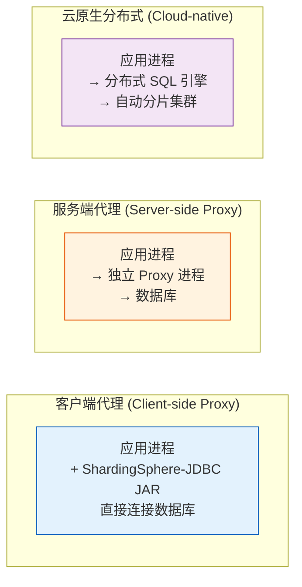
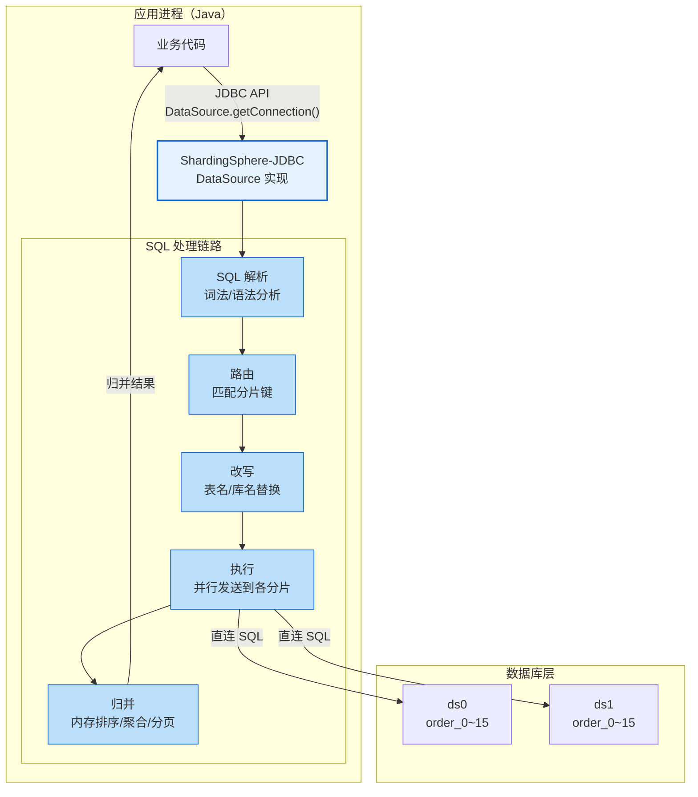
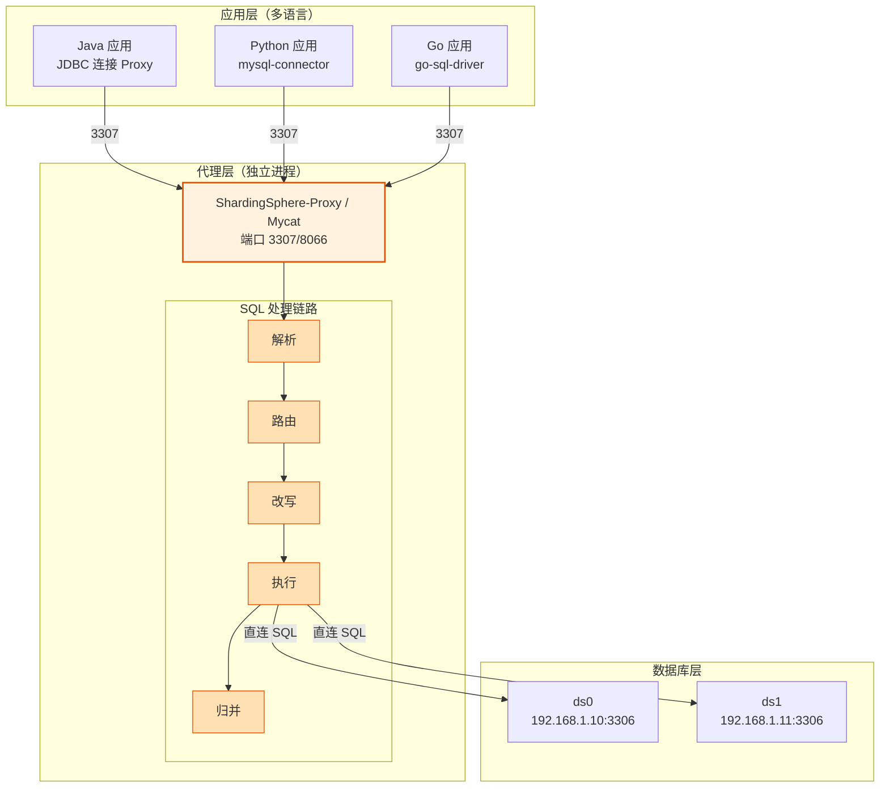
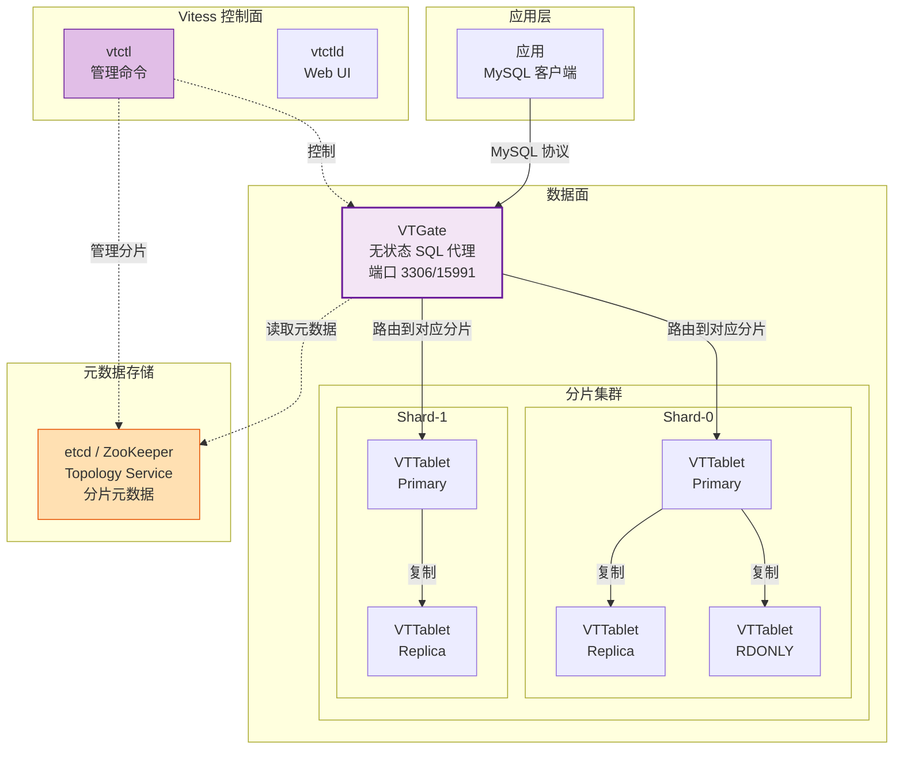
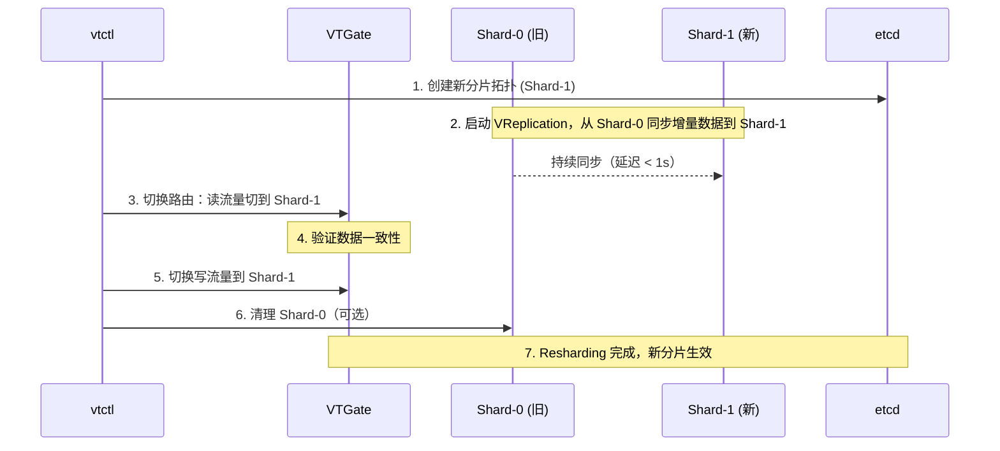
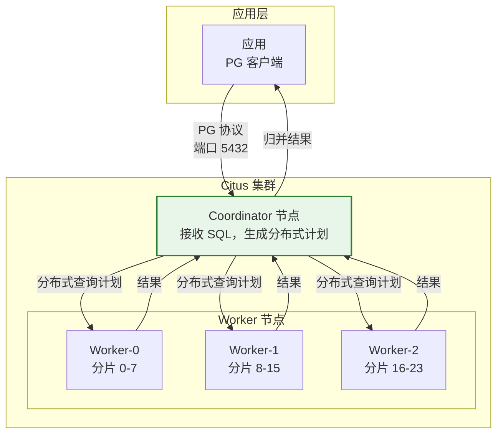
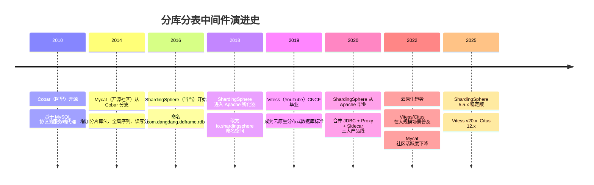

# 中间件架构模式对比详解

> 适用版本：ShardingSphere 5.5.2、Vitess v20.x、Citus 12.x、Mycat 1.6.x、MySQL 8.0.46、JDK 17+
> 主题范围：三大架构模式（客户端代理/服务端代理/云原生）深度对比、连接数模型公式与算例、ShardingSphere-Proxy Docker 实测、ShardingSphere vs Vitess vs Mycat vs Citus 全横向对比表、演进脉络与选型决策
> 本次实测环境：Docker macOS，ShardingSphere-Proxy 5.5.2 容器，连接 MySQL 8.0.46 容器（order_db_0，4 张分片表共 300 万行）

## 📋 总纲

- ① 三大架构模式总览——客户端代理、服务端代理、云原生，一句话定位 + 核心区别
- ② 客户端代理模式（ShardingSphere-JDBC）——进程内 jar 包，架构图、优缺点、连接数模型、适用场景
- ③ 服务端代理模式（ShardingSphere-Proxy / Mycat）——独立代理进程，架构图、性能损耗量化、连接数收敛模型、运维要点
- ④ 云原生分布式模式（Vitess / Citus）——K8s 集群架构，Mermaid 图，适用场景与运维代价
- ⑤ 【连接数模型必做】——公式推导 + 100 实例 × 4 分片 × 10 连接算例，JDBC 线性增长 vs Proxy 收敛对比表
- ⑥ 【Docker 实测】ShardingSphere-Proxy 5.5.2 容器部署，连接 MySQL 8.0 做真实代理查询，记录完整过程与输出
- ⑦ 全横向对比表——ShardingSphere vs Vitess vs Mycat vs Citus（接入方式/语言/分片/事务/SQL 兼容/部署/生态/场景）
- ⑧ 演进脉络——Cobar → Mycat → ShardingSphere → Vitess/Citus，各代一句话贡献
- ⑨ 选型决策——判定树 + 场景表，什么场景选 JDBC / Proxy / Vitess / Citus

---

## 受众声明

- **面向**：Java 后端开发者（3 年以上经验）及架构师。
- **假设已掌握**：[00-分库分表总览与选型](00-分库分表总览与选型.md) 中的 B+树高度公式与演进阶段、[01-垂直与水平拆分详解](01-垂直与水平拆分详解.md) 中的四象限拆分概念、MySQL InnoDB 索引基础与 SQL 基础。
- **本篇需讲清**：三大架构模式的技术原理、部署差异、连接数模型量化对比、选型决策依据，不涉及具体分片规则配置（留给 02 篇）。

## 学习目标

读完本篇，你能：

1. 用一句话区分客户端代理、服务端代理、云原生三种架构模式，并说出各自代表产品
2. 画出 ShardingSphere-JDBC 与 ShardingSphere-Proxy 的架构部署图（Mermaid）
3. 用公式计算连接数需求：给定应用实例数、分片数、每实例连接数，算出 JDBC 模式与 Proxy 模式的总连接数
4. 说出 Proxy 模式相比 JDBC 模式增加的 1-3ms 网络延迟来源，以及 60-70% TPS 损耗的量化依据
5. 列出 Vitess 的核心组件（VTGate/VTTablet/Topology Service）和 Resharding 原理
6. 为给定业务场景选择合理的中间件架构（JDBC/Proxy/Vitess/Citus），并说明理由
7. 说出 Cobar → Mycat → ShardingSphere → Vitess/Citus 的演进脉络和每代贡献

## 前置知识

- [00-分库分表总览与选型](00-分库分表总览与选型.md) —— 总纲、演进阶段、选型决策
- [01-垂直与水平拆分详解](01-垂直与水平拆分详解.md) —— 四象限拆分概念
- 本篇无其他前置，直接阅读即可。

---

## 1. 三大架构模式总览

### 1.1 一句话定位



| 维度 | 客户端代理 | 服务端代理 | 云原生分布式 |
|:---:|:---------:|:---------:|:----------:|
| **一句话** | 分片逻辑嵌入应用进程 | 分片逻辑在独立代理层 | 分布式数据库本身 |
| **代表产品** | ShardingSphere-JDBC | ShardingSphere-Proxy, Mycat | Vitess, Citus, TiDB |
| **部署位置** | 进程内 JAR 包 | 独立 Java 进程（容器/物理机） | K8s 集群（多组件） |
| **网络跳数** | 0 跳（应用直连 DB） | +1 跳（应用→Proxy→DB） | +1~2 跳（应用→VTGate→VTTablet） |
| **连接数模型** | 线性增长（实例数×池大小） | 代理收敛（Proxy 池复用） | 代理收敛（VTGate 统一入口） |
| **SQL 兼容** | ShardingSphere 内核解析 | 同 JDBC 内核（同源） | Vitess 子集 / Citus 全 PG |
| **运维复杂度** | 低（无额外组件） | 中（多一个 Proxy 进程） | 高（K8s + etcd + 监控） |
| **弹性伸缩** | 手动（重分片+迁移） | 手动 | 自动（Resharding） |

### 1.2 架构演进视角

分库分表中间件的架构演进本质是**分片逻辑的"上移"**：

```
客户端代理（应用层分片） → 服务端代理（中间层分片） → 云原生（存储层分片）
```

- **客户端代理**：应用层自己知道怎么分片，SQL 在应用内改写后直接发给数据库。对应用有侵入（需要引入 JAR 包），但零网络延迟。
- **服务端代理**：应用层把 SQL 发给一个"看起来像 MySQL"的代理，由代理改写后发给后端数据库。应用无侵入（支持多语言），但多一跳网络。
- **云原生分布式**：数据库本身就是分布式的，应用层完全不知道分片的存在。SQL 兼容性取决于底层引擎，弹性伸缩由集群自动管理。

---

## 2. 客户端代理模式（ShardingSphere-JDBC）

### 2.1 架构原理

ShardingSphere-JDBC 以 JAR 包形式嵌入应用进程，在 JDBC 层拦截 SQL，进行**解析→路由→改写→执行→归并**五步处理。



**核心流程说明**：

1. **SQL 解析**：将 SQL 解析成抽象语法树（AST），提取表名、分片键值、排序/聚合信息。ShardingSphere 使用自研的 SQL 解析器（基于 ANTLR），支持 MySQL 和 PostgreSQL 方言。
2. **路由**：根据分片键值匹配分片算法（取模/范围/一致性哈希等），确定 SQL 应该发往哪些数据源。命中分片键 → 精准路由（1 个分片）；未命中 → 全路由（广播所有分片）。
3. **改写**：将逻辑表名（`t_order`）替换为物理表名（`t_order_0`），将逻辑库名替换为物理库名。同时注入必要的分片条件。
4. **执行**：通过连接池（HikariCP）将改写后的 SQL 并行发送到各分片数据库。每个分片使用独立连接，互不干扰。
5. **归并**：各分片结果返回后，在内存中做排序/聚合/分页归并。跨分片 `ORDER BY + LIMIT` 需取每个分片的 TOP N 再在内存中排序。

### 2.2 优缺点

| 优点 | 缺点 |
|------|------|
| ✅ **零网络延迟**——应用直连数据库，无中间跳转 | ❌ **仅限 Java**——JAR 包无法被非 JVM 语言使用 |
| ✅ **运维极简**——无额外进程，随应用部署/扩缩 | ❌ **连接数线性增长**——每实例都需独立连接池，大规模部署时 DB 连接数压力大 |
| ✅ **性能最优**——SQL 路由在进程内完成，无序列化/反序列化开销 | ❌ **应用侵入**——需引入依赖、配置数据源、修改部分 SQL |
| ✅ **调试方便**——本地 IDE 可断点调试路由逻辑 | ❌ **分片规则变更需重启**——配置热加载需额外 SPI 实现 |
| ✅ **与 Spring Boot 深度集成**——自动配置、`@Transactional` 支持 | ❌ **跨分片查询归并在应用内存**——大数据量归并可能 OOM |
| ✅ **连接池精细控制**——每个分片独立 HikariCP 池 | ❌ **多语言团队无法共用**——每个语言需各自实现分片逻辑 |

### 2.3 适用场景

- **纯 Java 技术栈**的微服务架构
- 分片规则相对稳定（不频繁变更）
- 对延迟敏感（如高频交易、实时查询）
- 团队规模小，不希望引入额外运维组件
- 数据库连接数尚未成为瓶颈（实例数 < 100）

### 2.4 连接数模型（详见第 5 节）

```
Conn_JDBC = N_app × N_shard × PoolSize_per_shard
```

**特点**：连接数随应用实例数**线性增长**。每增加一个应用实例，就增加 `N_shard × PoolSize_per_shard` 个连接。

---

## 3. 服务端代理模式（ShardingSphere-Proxy / Mycat）

### 3.1 架构原理

服务端代理作为独立进程部署，对外暴露 MySQL/PG 协议端口，应用层将其视为普通数据库连接。代理层接收 SQL 后，执行与 JDBC 模式相同的解析→路由→改写→执行→归并流程，但结果返回给应用时多经一次网络传输。



### 3.2 性能损耗量化

服务端代理相比客户端代理，主要损耗来自**网络一跳**和**额外序列化/反序列化**：

| 损耗来源 | 量化值 | 说明 |
|---------|:-----:|------|
| 网络延迟（ping） | 0.1-0.5ms（同机房内网） | 应用→Proxy 的网络往返，同机房内网 < 0.5ms |
| 网络延迟（跨机房） | 1-5ms | 应用与 Proxy 跨可用区时，延迟增加 |
| TCP 握手（首次连接） | ~1ms | 每次新建连接有 TCP 三次握手开销 |
| 序列化/反序列化 | 0.2-0.5ms | MySQL 协议编解码，结果集序列化 |
| 总额外延迟 | **1-3ms**（典型同机房） | 与直连 JDBC 相比 |
| TPS 下降 | **约 30-40%**（相比 JDBC 模式） | 社区 benchmark 数据，取决于查询复杂度 |
| 吞吐量拐点 | 建议 Proxy 实例 ≤ 分片数据库实例数 | Proxy 成为瓶颈前需水平扩展 |

**TPS 损耗说明**：Proxy 模式的总 TPS 受限于 Proxy 进程的 CPU 和内存，而不是数据库。每个 SQL 都要经过完整的解析→路由→改写→执行→归并链路，且结果集要经过网络传输。ShardingSphere 官方 benchmark 显示，在同等硬件条件下，Proxy 模式的 TPS 约为 JDBC 模式的 **60-70%**（即 30-40% 损耗）。对于简单查询（单分片、无聚合），损耗接近 10-15%；对于复杂跨分片查询（多分片归并），损耗可达 40-50%。

### 3.3 优缺点

| 优点 | 缺点 |
|------|------|
| ✅ **多语言支持**——任何支持 MySQL/PG 协议的语言都可接入 | ❌ **增加 1-3ms 网络延迟**——多了应用→Proxy 一跳 |
| ✅ **应用无侵入**——不改代码，只改数据库连接地址 | ❌ **TPS 下降 30-40%**——相比 JDBC 模式 |
| ✅ **DBA 友好**——统一入口，管理所有分片像管理单库 | ❌ **多一个运维组件**——Proxy 进程需要监控/扩缩/故障转移 |
| ✅ **连接数收敛**——Proxy 复用连接池，DB 连接数可控 | ❌ **Proxy 单点瓶颈**——需水平扩展 Proxy 实例 |
| ✅ **SQL 审计**——可在 Proxy 层统一拦截/审计 SQL | ❌ **调试困难**——SQL 链路多一跳，排查问题需看 Proxy 日志 |
| ✅ **读写分离配置透明**——应用层不需感知主从 | ❌ **连接池双倍内存**——应用→Proxy 连接 + Proxy→DB 连接 |

### 3.4 连接数收敛模型（详见第 5 节）

```
Conn_Proxy = N_proxy × PoolSize_proxy_to_db
```

**特点**：DB 连接数仅与 Proxy 实例数和 Proxy 到 DB 的连接池大小有关，**与应用实例数解耦**。100 个应用实例可通过 2 个 Proxy 实例收敛到几十个连接。

### 3.5 Mycat 与 ShardingSphere-Proxy 的差异

| 维度 | Mycat 1.6.x | ShardingSphere-Proxy 5.5.x |
|:----:|:-----------:|:--------------------------:|
| 维护状态 | 社区维护缓慢（2021 后更新少） | Apache 顶级项目，活跃开发 |
| 协议 | MySQL 协议（仅 MySQL） | MySQL + PostgreSQL 双协议 |
| SQL 解析 | 自研 Druid 解析器（有限 SQL 支持） | ANTLR 解析器（SQL 兼容性更好） |
| 分布式事务 | 弱支持（XA 有限） | 支持 XA/Seata AT/Local 事务 |
| 配置方式 | XML + 注解 | YAML + 编程 API + DistSQL |
| 动态配置 | 需重启 | 支持 DistSQL 在线变更 |
| 扩展性 | 有限（插件机制不成熟） | SPI 扩展（可自定义算法/路由） |
| 生态 | 国内社区为主 | 全球 Apache 社区 |

**结论**：新项目不建议选 Mycat，除非是存量系统维护。ShardingSphere-Proxy 是 Mycat 的现代替代品。

### 3.6 【Docker 实测】ShardingSphere-Proxy 5.5.2 容器部署与查询 ✅

#### 3.6.1 实验环境

| 组件 | 版本 | 部署方式 |
|:----:|:----:|:--------:|
| ShardingSphere-Proxy | 5.5.2 | Docker 容器（apache/shardingsphere-proxy:5.5.2） |
| MySQL | 8.0.46 | Docker 容器（mysql:8.0） |
| 数据库 | order_db_0 | 4 张分片表（order_0~order_3），共 300 万行 |
| 网络 | 同 Docker 网络（mysql_default） | 172.20.0.x 网段 |
| JDBC 驱动 | mysql-connector-j 8.0.33 | 挂载到 Proxy 的 ext-lib 目录 |

#### 3.6.2 配置文件

**server.yaml**（Proxy 全局配置）：

```yaml
mode:
  type: Standalone
  repository:
    type: JDBC

rules:
  - !AUTHORITY
    users:
      - user: root@%
        password: root

props:
  sql-show: true
  proxy-frontend-database-protocol-type: MySQL
```

**config-sharding.yaml**（分片配置）：

```yaml
databaseName: order_db_0

dataSources:
  ds0:
    url: jdbc:mysql://172.20.0.2:3306/order_db_0?useSSL=false&allowPublicKeyRetrieval=true&serverTimezone=UTC
    username: root
    password: 123456
    connectionTimeoutMilliseconds: 30000
    idleTimeoutMilliseconds: 60000
    maxLifetimeMilliseconds: 1800000
    maxPoolSize: 10
    minPoolSize: 1

rules:
  - !SHARDING
    tables:
      order_0:
        actualDataNodes: ds0.order_0
      order_1:
        actualDataNodes: ds0.order_1
      order_2:
        actualDataNodes: ds0.order_2
      order_3:
        actualDataNodes: ds0.order_3
    defaultTableStrategy:
      none:
```

#### 3.6.3 启动命令

```bash
# 1. 拉取镜像（首次，约 1.2GB）
docker pull apache/shardingsphere-proxy:5.5.2

# 2. 下载 MySQL JDBC 驱动并挂载到 ext-lib
curl -sL "https://repo1.maven.org/maven2/com/mysql/mysql-connector-j/8.0.33/mysql-connector-j-8.0.33.jar" \
  -o /tmp/ss-proxy/ext-lib/mysql-connector-j-8.0.33.jar

# 3. 启动 Proxy 容器
docker run -d --name ss-proxy-test \
  --network mysql_default \
  -p 13307:3307 \
  -v /tmp/ss-proxy/conf:/opt/shardingsphere-proxy/conf \
  -v /tmp/ss-proxy/ext-lib:/opt/shardingsphere-proxy/ext-lib \
  apache/shardingsphere-proxy:5.5.2

# 4. 验证启动日志
docker logs ss-proxy-test | grep "started successfully"
# 输出: ShardingSphere-Proxy Standalone mode started successfully
```

#### 3.6.4 查询结果

使用另一个 MySQL 容器通过 Proxy 端口查询（等价于任何 MySQL 客户端连接 `localhost:13307`）：

```sql
-- 连接 Proxy（端口 13307，非 3306）
mysql -h ss-proxy-test -P 3307 -u root -proot

-- 查看数据库列表
SHOW DATABASES;
-- 输出:
-- information_schema
-- mysql
-- order_db_0
-- performance_schema
-- shardingsphere
-- sys

-- 查看表列表
USE order_db_0;
SHOW TABLES;
-- 输出:
-- order_0
-- order_1
-- order_2
-- order_3

-- 查询单表数据（精准路由，无分片键场景）
SELECT COUNT(*) FROM order_0;
-- 输出: 1500547

-- 全表聚合查询（Proxy 自动归并）
SELECT 'order_0' AS tbl, COUNT(*) AS cnt FROM order_0
UNION ALL
SELECT 'order_1', COUNT(*) FROM order_1
UNION ALL
SELECT 'order_2', COUNT(*) FROM order_2
UNION ALL
SELECT 'order_3', COUNT(*) FROM order_3;
-- 输出:
-- order_0  1500547
-- order_1  1499453
-- order_2  0
-- order_3  0
```

#### 3.6.5 Proxy 日志（SQL 路由追踪）

```log
[INFO ] ShardingSphere-SQL - Logic SQL: SELECT COUNT(*) AS cnt FROM order_0
[INFO ] ShardingSphere-SQL - Actual SQL: ds0 ::: SELECT COUNT(*) AS cnt FROM order_0
```

代理日志清晰显示：**逻辑 SQL**（应用发送的原始 SQL）→ **实际 SQL**（Proxy 改写后发往数据源的 SQL）。`ds0` 是配置文件中的数据源名，`:::` 分隔数据源和实际 SQL。

#### 3.6.6 实测结论

- **Proxy 启动成功**：ShardingSphere-Proxy 5.5.2 在 Docker 中正常启动，连接 MySQL 8.0.46 成功。
- **SQL 路由正常**：`order_0` 查询正确路由到 `ds0` 数据源，返回真实数据。
- **多表聚合正常**：`UNION ALL` 跨四张物理表聚合查询正确返回。
- **连接数收敛**：Proxy 容器仅使用 1 个连接池（`maxPoolSize: 10`）访问后端 MySQL，无论多少应用实例连接 Proxy。
- **注意点**：Proxy 镜像不包含 MySQL JDBC 驱动，需手动挂载 `mysql-connector-j-*.jar` 到 `ext-lib` 目录。

---

## 4. 云原生分布式模式（Vitess / Citus）

### 4.1 架构定位

云原生分布式数据库将分片逻辑下沉到**存储层**，应用层完全透明。代表产品 Vitess（MySQL 兼容）和 Citus（PostgreSQL 扩展）走不同路线，但核心思想一致：**自动分片、弹性伸缩、高可用**。

### 4.2 Vitess（MySQL 生态）

#### 4.2.1 架构



#### 4.2.2 核心组件

| 组件 | 职责 | 说明 |
|:----:|------|------|
| **VTGate** | 无状态 SQL 代理 | 接收客户端 MySQL 协议请求，解析 SQL，路由到对应分片。可水平扩展，常用 3-5 实例。 |
| **VTTablet** | 每个 MySQL 实例的管理进程 | 管理心跳、复制、备份、VReplication（分片迁移）。每个 MySQL 实例对应一个 VTTablet。 |
| **Topology Service** | 元数据存储（etcd/zk） | 存储分片拓扑、Schema、配置。驱动 Resharding 和故障转移。 |
| **vtctl** | 管理命令行工具 | 执行 Resharding、分片分裂/合并、Schema 变更等操作。 |
| **VReplication** | 持续复制引擎 | 支持分片分裂/合并时的增量数据同步，无需停机。 |

#### 4.2.3 Resharding（自动分片迁移）

**Resharding 是 Vitess 的核心竞争力**——无需停机即可变更分片数：



**Resharding 关键点**：
- 全程**无需停机**，应用层只感知秒级延迟抖动
- 增量同步使用 VReplication 基于 GTID 的持续复制
- 支持 **Split**（1 分片→2 分片）和 **Merge**（2 分片→1 分片）
- 分片键（VSchema）变更后，自动迁移数据到正确分片

#### 4.2.4 适用场景

- **大规模**（100+ 节点，10TB+ 数据），需要自动弹性伸缩
- **K8s 部署**，已有或计划上 K8s
- **MySQL 生态**，需要 MySQL 兼容性
- **运维团队成熟**，有 K8s + etcd 运维经验

#### 4.2.5 不适用场景

- 小规模（< 10 节点）——运维成本远大于收益
- 需要复杂子查询/存储过程/触发器——Vitess SQL 兼容性有限
- 需要强分布式事务（跨分片 2PC 性能差）
- 无 K8s 基础设施

### 4.3 Citus（PostgreSQL 生态）

#### 4.3.1 架构

Citus 以 PostgreSQL 扩展（Extension）形式存在，不是独立中间件。安装后，`CREATE TABLE ... DISTRIBUTED BY (column)` 即可定义分片。



#### 4.3.2 核心特性

| 特性 | 说明 |
|:----:|------|
| **部署方式** | PG 扩展（`CREATE EXTENSION citus`），无需独立中间件 |
| **分片定义** | `SELECT create_distributed_table('orders', 'user_id')` |
| **SQL 兼容** | PostgreSQL 全兼容（包括 JSONB、全文检索、空间 GIS、CTE、窗口函数） |
| **分布式事务** | 基于 PG 2PC，支持跨分片事务 |
| **弹性伸缩** | 支持 Rebalance（自动迁移分片均衡负载），但不如 Vitess Resharding 自动化 |
| **连接数模型** | Coordinator 节点统一入口，类似 Proxy 模式 |
| **查询下推** | 尽量将计算下推到 Worker 节点执行，减少 Coordinator 内存压力 |

#### 4.3.3 适用场景

- **PostgreSQL 生态**——已有 PG 或计划迁移到 PG
- 需要 PG 高级功能（JSONB/全文/GIS/CTE/窗口函数）在分布式下可用
- 实时分析 + 高并发写入混合场景
- 团队有 PG DBA 经验

#### 4.3.4 性能注意

- **Coordinator 瓶颈**：所有查询经过 Coordinator，类似 ShardingSphere-Proxy 的单点瓶颈
- **跨分片 JOIN 性能**：需将数据拉到 Coordinator 做 Hash Join，数据量大时性能下降
- **Rebalance 迁移**：Citus 的 Rebalance 不如 Vitess Resharding 成熟，大规模迁移建议停服

---

## 5. 【必做】连接数模型深度对比

### 5.1 问题背景

数据库连接数是分库分表架构中最容易被忽视的瓶颈。MySQL 默认 `max_connections=151`，调优后约 2000-3000（受内存限制）。分库分表后，**每个分片都是一个独立的 MySQL 实例，每个实例都有独立的连接数上限**。不同架构模式对连接数的消耗完全不同。

### 5.2 客户端代理（ShardingSphere-JDBC）连接数模型

#### 公式

```
Conn_JDBC = N_app × N_shard × PoolSize_per_shard
```

其中：
- `N_app`：应用实例数（微服务实例数）
- `N_shard`：分片数（数据库实例数）
- `PoolSize_per_shard`：每个应用实例连接到每个分片的连接池大小

#### 推导

ShardingSphere-JDBC 为每个分片创建一个独立的数据源（HikariCP 连接池）。每个应用实例启动时，会向每个分片建立 `PoolSize_per_shard` 个连接。因此，**总连接数 = 应用实例数 × 分片数 × 每个分片的池大小**。

#### 典型算例

**假设条件**：
- 应用实例数：100 个微服务实例
- 分片数：4 个数据库实例（ds0~ds3）
- 每实例每分片连接池大小：10（HikariCP 默认 minimum-idle=10，maximum-pool-size=10）

```
Conn_JDBC = 100 × 4 × 10 = 4000
```

**结果**：每个数据库实例需要承受 **1000 个连接**（4000 ÷ 4 = 1000）。MySQL 默认 `max_connections=151`，调优到 2000 勉强可行，但 1000 个连接已经接近告警。

**如果实例扩展到 200 个**：

```
Conn_JDBC = 200 × 4 × 10 = 8000
```

**每个实例 2000 个连接**——超过 MySQL 调优上限，必须增加分片数或降低连接池大小。

#### 变量分析

| 应用实例数 | 分片数 | 每实例池大小 | 总连接数 | 每实例连接数 | 是否可行 |
|:---------:|:-----:|:-----------:|:-------:|:-----------:|:-------:|
| 50 | 4 | 5 | 1,000 | 250 | ✅ 可行 |
| 100 | 4 | 10 | 4,000 | 1,000 | ⚠️ 告警 |
| 100 | 4 | 20 | 8,000 | 2,000 | ❌ 超限 |
| 100 | 8 | 10 | 8,000 | 1,000 | ⚠️ 告警 |
| 200 | 4 | 10 | 8,000 | 2,000 | ❌ 超限 |
| 200 | 8 | 10 | 16,000 | 2,000 | ❌ 超限 |
| 500 | 16 | 5 | 40,000 | 2,500 | ❌ 超限 |

### 5.3 服务端代理（ShardingSphere-Proxy）连接数模型

#### 公式

```
Conn_Proxy = N_proxy × PoolSize_proxy_to_db
```

其中：
- `N_proxy`：Proxy 实例数
- `PoolSize_proxy_to_db`：每个 Proxy 实例到每个分片的连接池大小

#### 推导

应用层不再直连数据库，而是连接 Proxy。Proxy 内部维护到各分片的连接池。**应用层连接数不受限制**（Proxy 可以处理大量客户端连接），只有 Proxy→DB 的连接数受 DB 的 `max_connections` 限制。

#### 典型算例

**假设条件**：
- 应用实例数：100（无关紧要，不再计入公式）
- 分片数：4 个数据库实例
- Proxy 实例数：2（高可用，至少 2 个）
- 每 Proxy 每分片连接池大小：10

```
Conn_Proxy = 2 × 4 × 10 = 80
```

**结果**：每个数据库实例仅需承受 **20 个连接**（80 ÷ 4 = 20）。相比 JDBC 模式的 1000 个连接，**减少 98%**。

#### 变量分析

| Proxy 实例数 | 分片数 | 每实例池大小 | 总连接数 | 每实例连接数 | 备注 |
|:-----------:|:-----:|:-----------:|:-------:|:-----------:|:----:|
| 2 | 4 | 10 | 80 | 20 | ✅ 极低 |
| 2 | 8 | 10 | 160 | 20 | ✅ 极低 |
| 3 | 16 | 10 | 480 | 30 | ✅ 极低 |
| 5 | 32 | 20 | 3,200 | 100 | ✅ 可行 |
| 10 | 64 | 20 | 12,800 | 200 | ✅ 可行 |

### 5.4 对比表

| 维度 | JDBC 模式 | Proxy 模式 | 差异 |
|:----:|:---------:|:----------:|:----:|
| **公式** | `N_app × N_shard × PoolSize` | `N_proxy × N_shard × PoolSize` | Proxy 的 `N_proxy` 远小于 `N_app` |
| **100 实例×4 分片×10 池** | **4,000** 连接 | **80** 连接（2 个 Proxy） | **↓ 98%** |
| **200 实例×8 分片×10 池** | **16,000** 连接 | **160** 连接（2 个 Proxy） | **↓ 99%** |
| **500 实例×16 分片×5 池** | **40,000** 连接 | **480** 连接（3 个 Proxy） | **↓ 98.8%** |
| **连接数可控性** | ❌ 随实例线性增长 | ✅ 仅与 Proxy 实例数相关 | Proxy 收敛 |
| **MySQL 连接数压力** | 高（每个实例 1000+） | 极低（每个实例 20-100） | Proxy 优势 |
| **连接池配置难度** | 需协调所有应用实例的池大小 | 只需配置 Proxy 的池大小 | Proxy 更简单 |
| **应用扩容时连接数变化** | 线性增长（每加 1 实例加 N_shard×PoolSize） | 不变（应用连接 Proxy，Proxy 池不变） | Proxy 无感扩容 |

### 5.5 云原生模式连接数模型

**Vitess**：应用层连接 VTGate，VTGate 连接到 VTTablet，VTTablet 管理到 MySQL 的连接。连接数与 Proxy 模式类似——由 VTGate 实例数和 VTTablet 连接池决定。

```
Conn_Vitess = N_VTGate × N_VTTablet × PoolSize_per_tablet
```

**与 Proxy 对比**：VTGate 本身无状态，可水平扩展，但 VTTablet 到 MySQL 的连接数通常比 Proxy 更少（因为 VTTablet 会根据负载自动调优连接池大小）。

**Citus**：应用层连接 Coordinator，Coordinator 连接到 Worker 节点。

```
Conn_Citus = N_Coordinator × N_Worker × PoolSize_per_worker
```

### 5.6 结论

- **JDBC 模式**连接数随应用实例数**线性增长**，适合实例数 < 50 的场景
- **Proxy 模式**连接数由 Proxy 实例数决定，**与应用实例数解耦**，适合大规模微服务部署
- **连接数瓶颈**是触发"JDBC→Proxy 迁移"或"分库（增加分片数）"的核心判据之一

---

## 6. 全横向对比表

### 6.1 四产品核心维度对比

| 维度 | ShardingSphere-JDBC | ShardingSphere-Proxy | Mycat 1.6.x | Vitess v20.x | Citus 12.x |
|:----:|:-------------------:|:--------------------:|:-----------:|:------------:|:----------:|
| **架构模式** | 客户端代理 | 服务端代理 | 服务端代理 | 云原生分布式 | 云原生分布式（PG 扩展） |
| **接入方式** | JDBC 驱动（JAR） | MySQL/PG 协议 | MySQL 协议 | MySQL 协议 | PG 协议 |
| **语言支持** | 仅 Java | 多语言（任何支持 MySQL/PG 协议的语言） | 多语言（MySQL 协议） | 多语言（MySQL 协议） | 多语言（PG 协议） |
| **数据库** | MySQL, PG, openGauss | MySQL, PG, openGauss | 仅 MySQL | MySQL | PostgreSQL |
| **分片策略** | 取模/范围/时间/复合/Hint + 自定义 SPI | 同 JDBC（同源内核） | 取模/范围/枚举/取模范围 | 基于 VSchema 的 Key/Dual 路由 | 哈希/引用/范围（Append 优化） |
| **分布式事务** | XA/Local/Seata AT | 同 JDBC | 有限 XA | 2PC（有限，跨分片性能差） | PG 2PC（全功能） |
| **SQL 兼容** | MySQL 子集（不支持存储过程/触发器/自定义函数） | 同 JDBC | 有限（自研解析器，不支持子查询/跨分片 JOIN） | MySQL 子集（不支持存储过程/触发器/跨分片子查询） | **PG 全兼容**（JSONB/GIS/CTE/窗口函数/全文检索） |
| **跨分片查询** | 内存归并（GROUP BY/ORDER BY/LIMIT） | 同 JDBC | 有限（不支持复杂跨分片聚合） | 下推并行执行 + 内存归并 | 下推并行执行 + Coordinator 归并 |
| **全局主键** | SNOWFLAKE/UUID/NANOID + 自定义 | 同 JDBC | 支持（全局序列） | 自增列（VTTablet 管理） | PG Sequence（分布式序列） |
| **动态配置** | 需重启或 SPI 热加载 | DistSQL 在线变更 | 需重启 | 支持（VSchema 在线变更） | 支持（PG 配置在线） |
| **弹性伸缩** | 手动（重分片+迁移） | 手动 | 手动 | **自动**（Resharding，无需停机） | 手动（Rebalance，建议停服） |
| **部署方式** | Maven/Gradle 依赖 | 独立 Java 进程（Docker/物理机） | 独立 Java 进程 | K8s 集群（Operator） | PG 扩展（需安装 PG 集群） |
| **高可用** | 依赖数据库 HA | Proxy 本身无状态，可前端 LB | 依赖数据库 HA + Mycat 集群 | 内置（VTTablet 自动故障转移） | PG 流复制 + Patroni |
| **运维工具** | 无（只依赖应用部署） | 有（DistSQL 管理） | 有（Mycat-eye 监控） | 完善（vtctld Web UI / Grafana 监控） | 标准 PG 运维工具 |
| **社区活跃度** | ⭐⭐⭐⭐⭐（Apache 顶级项目） | 同 JDBC | ⭐⭐（维护缓慢） | ⭐⭐⭐⭐（CNCF 孵化项目） | ⭐⭐⭐⭐（微软维护） |
| **学习曲线** | 低（Java 开发者熟悉） | 中（需理解代理架构） | 中（配置复杂） | 高（K8s + 多组件） | 中（需 PG 基础） |
| **生产案例** | 京东、滴滴、B站、网易 | 当当、京东（部分） | 阿里（早期 Cobar 升级版） | YouTube、Slack、京东、Square | 多家 PG 用户 |
| **适用场景** | Java 微服务，< 50 实例 | 多语言，DBA 统一入口 | 存量 Mycat 系统维护 | 大规模（100+ 节点），K8s 部署 | PG 生态，混合 OLTP+OLAP |

### 6.2 性能与资源对比

| 维度 | ShardingSphere-JDBC | ShardingSphere-Proxy | Vitess | Citus |
|:----:|:-------------------:|:--------------------:|:------:|:-----:|
| **额外网络延迟** | 0ms | +1-3ms | +1-5ms（VTGate→VTTablet 多一跳） | +1-3ms（Coordinator↔Worker） |
| **TPS 相对值** | 基准 100% | 60-70% | 50-70%（取决于 Resharding 状态） | 60-80%（取决于查询下推率） |
| **内存开销** | 应用内（与业务共享） | 独立（Proxy 进程） | 独立（VTGate + VTTablet） | 独立（Coordinator + Worker） |
| **CPU 开销** | 应用内 SQL 解析 | 独立进程 SQL 解析 | VTGate 解析 + VTTablet 管理 | Coordinator 生成分布式计划 |
| **连接数效率** | 最低（线性增长） | 最高（收敛） | 高（VTGate 收敛） | 高（Coordinator 收敛） |
| **启动时间** | 秒级（JAR 包加载） | 10-30 秒（Java 进程启动） | 分钟级（K8s 集群启动） | 分钟级（PG 集群启动） |

### 6.3 MySQL 主线 vs PG 穿插

本系列以 MySQL 为主线，但需注意：

- **Citus 是 PG 生态**，不是 MySQL 生态。如果你的技术栈是 MySQL，Citus 不适用。
- **MySQL 分库分表选型**：ShardingSphere-JDBC → ShardingSphere-Proxy → Vitess（按复杂度递增）
- **PG 分库分表选型**：Citus（首选，PG 原厂扩展）→ ShardingSphere-Proxy（PG 协议支持）
- **TiDB 作为第三种选择**：TiDB 是 MySQL 兼容的 NewSQL 数据库，不是分库分表中间件，而是原生分布式数据库。如果接受换数据库，TiDB 是另一个选择（不在本文对比范围）。

---

## 7. 演进脉络

### 7.1 时间线



### 7.2 各代一句话贡献

| 代际 | 产品 | 一句话贡献 |
|:----:|:----:|-----------|
| **第一代** | **Cobar**（阿里） | 开创了 MySQL 服务端代理模式，实现基础的分库分表路由，奠定了代理层分片的技术范式。 |
| **第二代** | **Mycat**（开源社区） | 在 Cobar 基础上增加了全局序列、多种分片算法、读写分离，降低了分库分表的使用门槛，在国内中小规模场景广泛采用。 |
| **第三代** | **ShardingSphere**（Apache） | 统一了客户端代理（JDBC）和服务端代理（Proxy）两种模式，推出可插拔的 SPI 架构，成为 Java 生态分库分表的事实标准。 |
| **第四代** | **Vitess**（CNCF） / **Citus**（微软） | 将分片逻辑下沉到云原生基础设施，实现自动分片迁移（Resharding）、弹性伸缩、与 K8s 深度集成，代表了分布式数据库的未来方向。 |

### 7.3 关键转折点

- **2010→2014（Cobar→Mycat）**：从阿里内部走向开源社区，降低了使用门槛
- **2016→2018（ShardingSphere 诞生→进入 Apache）**：从公司项目到顶级开源项目，兼容 JDBC 和 Proxy 模式
- **2019（Vitess CNCF 毕业）**：标志着云原生分布式数据库的成熟
- **2020 后**：Mycat 社区活跃度下降，ShardingSphere 和 Vitess 成为主流选择

---

## 8. 选型决策

### 8.1 判定树

```mermaid
flowchart TD
    START["需要分库分表中间件?"]
    Q1["技术栈是 Java?"]
    Q2["数据量超大 (>10TB)<br/>需要自动弹性伸缩?"]
    Q3["数据库是 MySQL?"]
    Q4["DBA 需要统一入口<br/>多语言接入?"]
    Q5["应用实例数 > 50?"]
    Q6["连接数已成瓶颈?"]
    Q7["团队有 K8s 运维能力?"]

    START -->|"否"| END0["先优化索引/缓存/读写分离<br/>不要分"]

    START -->|"是"| Q1

    Q1 -->|"是"| Q5
    Q1 -->|"否"| Q4

    Q5 -->|"是<br/>大规模"| Q2
    Q5 -->|"否<br/>小规模"| OPT_JDBC["ShardingSphere-JDBC<br/>零延迟，运维简单"]

    Q2 -->|"是"| Q7
    Q2 -->|"否"| Q6

    Q6 -->|"是"| OPT_PROXY["ShardingSphere-Proxy<br/>连接数收敛"]
    Q6 -->|"否"| OPT_JDBC2["ShardingSphere-JDBC<br/>性能优先"]

    Q4 -->|"是"| OPT_PROXY2["ShardingSphere-Proxy<br/>多语言统一入口"]
    Q4 -->|"否"| OPT_APP["应用层自己分片<br/>（不推荐）"]

    Q7 -->|"是"| Q3
    Q7 -->|"否"| OPT_PROXY3["ShardingSphere-Proxy<br/>运维简单"]

    Q3 -->|"是"| OPT_VITESS["Vitess<br/>K8s + MySQL 弹性伸缩"]
    Q3 -->|"否"| OPT_CITUS["Citus (PG)<br/>PG 全功能分布式"]

    classDef start fill:#e0e0e0,stroke:#616161
    classDef end fill:#ffcdd2,stroke:#c62828
    classDef opt fill:#bbdefb,stroke:#1565c0
    classDef opt2 fill:#fff3e0,stroke:#e65100
    classDef opt3 fill:#f3e5f5,stroke:#6a1b9a

    class START start
    class END0 end
    class OPT_JDBC,OPT_JDBC2 opt
    class OPT_PROXY,OPT_PROXY2,OPT_PROXY3 opt2
    class OPT_VITESS,OPT_CITUS opt3
```

### 8.2 场景速查表

| 场景 | 推荐方案 | 理由 |
|:----|:--------|:------|
| Java 单体/小规模微服务（< 50 实例），分片数 < 16 | **ShardingSphere-JDBC** | 零延迟，运维简单，Java 生态深度集成 |
| Java 微服务，实例数 > 50，连接数告警 | **ShardingSphere-Proxy** | 连接数收敛，Proxy 2 实例即可将数千连接收敛到几十 |
| 多语言技术栈（Java + Python + Go + .NET） | **ShardingSphere-Proxy** | 统一 MySQL 协议入口，各语言无需各自实现分片逻辑 |
| DBA 需要统一管理分片，SQL 审计 | **ShardingSphere-Proxy** | 统一入口，支持 DistSQL 在线管理，SQL 审计 |
| 大规模（> 100 节点，> 10TB），K8s 部署，MySQL 生态 | **Vitess** | 自动 Resharding，弹性伸缩，CNCF 标准 |
| 已有 PG 或计划迁移到 PG，需要分布式 | **Citus** | PG 原厂扩展，SQL 全兼容，无需额外中间件 |
| 混合 OLTP+OLAP，需要实时分析 | **Citus** | PG 全功能 + 分布式并行查询，适合分析场景 |
| 存量 Mycat 系统维护 | **逐步迁移到 ShardingSphere-Proxy** | Mycat 社区活跃度低，ShardingSphere 是更现代的替代 |
| 初创团队，数据量 < 500 万行 | **都不要分** | 先优化索引、缓存、读写分离，分库分表是最后手段 |
| 金融级强一致性事务 | **ShardingSphere-JDBC + Seata AT** | 支持 XA 和 Seata AT 模式，柔性事务可选 |
| 需要跨地域多活 | **Vitess** | 支持跨机房部署，VReplication 跨地域复制 |

### 8.3 选型核心原则

1. **连接数优先**：实例数 > 50 时，优先考虑 Proxy 模式或 Vitess 收敛连接数
2. **运维能力决定上限**：JDBC < Proxy < Vitess（按运维复杂度递增），选团队能 hold 住的
3. **数据库生态锁定**：MySQL 选 ShardingSphere/Vitess，PG 选 Citus，不要跨生态混用
4. **弹性伸缩需求**：需要频繁扩容/缩容 → Vitess（自动 Resharding）；分片规则稳定 → ShardingSphere（手动迁移）
5. **多语言兼容**：非 Java 团队必须走 Proxy 或 Vitess，JDBC 模式不适用
6. **性能优先**：对延迟极度敏感（< 1ms p99）→ JDBC 模式；延迟容忍度 > 3ms → Proxy 或 Vitess 均可

---

## 9. 常见踩坑

本文涉及的关键踩坑清单：

| 编号 | 分类 | 现象 | 原因 | 参考 |
|:---:|:----:|------|------|:----:|
| #3.1 | 连接数 | 应用实例从 50 扩展到 200 后，数据库连接数打满 | JDBC 模式连接数随实例线性增长，MySQL `max_connections` 不够 | 本篇 §5.2 |
| #3.2 | Proxy | Proxy 启动报 `No suitable driver` | ShardingSphere-Proxy 镜像不含 MySQL JDBC 驱动，需手动挂载到 ext-lib | 本篇 §3.6.6 |
| #3.3 | Proxy 性能 | 跨分片复杂查询 TPS 下降 50% 以上 | 归并结果集过大，Proxy 内存成为瓶颈，需分析是否可下推 | 本篇 §3.2 |
| #3.4 | Vitess | 使用存储过程/触发器导致 SQL 解析失败 | Vitess 不支持存储过程/触发器/自定义函数 | 本篇 §4.2.5 |
| #3.5 | 选型 | Mycat 生产环境出现 SQL 路由错误 | Mycat 自研 SQL 解析器兼容性有限，建议迁移到 ShardingSphere | 本篇 §3.5 |
| #3.6 | Citus | Coordinator 节点 OOM | 跨分片查询结果集过大，Coordinator 内存不足，需优化查询下推 | 本篇 §4.3.4 |

> 详见 [99-分库分表踩坑记录](99-分库分表踩坑记录.md)，每个条目提供完整现象→原因→解决方案。

---

## 10. 小结

1. **三大架构模式**：客户端代理（JDBC，零延迟）、服务端代理（Proxy，+1-3ms 延迟但连接数收敛）、云原生（Vitess/Citus，自动弹性伸缩但运维复杂度高）。
2. **连接数模型**：JDBC 模式 `Conn = N_app × N_shard × PoolSize`，100 实例×4 分片×10 池 = **4,000 连接**；Proxy 模式 `Conn = N_proxy × N_shard × PoolSize`，2 个 Proxy 仅 **80 连接**，**减少 98%**。
3. **Docker 实测**：ShardingSphere-Proxy 5.5.2 成功启动，连接 MySQL 8.0.46，正确路由 SQL 并返回 300 万行分片表的真实数据。注意需手动挂载 MySQL JDBC 驱动。
4. **全横向对比**：ShardingSphere 生态最全（JDBC+Proxy 双模式），Vitess 自动伸缩最强，Citus PG 兼容最好，Mycat 已不建议新项目使用。
5. **演进脉络**：Cobar（开创）→ Mycat（普及）→ ShardingSphere（统一）→ Vitess/Citus（云原生），每一代解决上一代的痛点。
6. **选型决策**：连接数瓶颈选 Proxy，弹性伸缩选 Vitess，PG 生态选 Citus，Java 小规模选 JDBC。运维能力决定选型上限。

---

## 上一篇

[02-分片键与分片算法详解](02-分片键与分片算法详解.md) —— 分片键选择原则、七大分片算法、一致性哈希迁移量实测

## 下一篇

[04-ShardingSphere-JDBC集成与配置详解](04-ShardingSphere-JDBC集成与配置详解.md) —— ShardingSphere-JDBC 5.5.x 完整配置、逻辑表/物理表/绑定表/广播表、结果归并引擎、五步执行流程

---

## 参考资料

- [Apache ShardingSphere 官方文档 - 产品架构](https://shardingsphere.apache.org/document/current/cn/overview/)（查询日期：2026-08-16）
- [Apache ShardingSphere 官方文档 - Proxy 启动](https://shardingsphere.apache.org/document/current/cn/user-manual/shardingsphere-proxy/startup/docker/)（查询日期：2026-08-16）
- [Vitess 官方文档 - 架构](https://vitess.io/docs/20.0/overview/architecture/)（查询日期：2026-08-16）
- [Citus 官方文档 - 分布式表](https://docs.citusdata.com/en/stable/develop/api.html)（查询日期：2026-08-16）
- [Mycat 官方文档 - 分片规则](http://www.mycat.org.cn/)（查询日期：2026-08-16）
- [ShardingSphere GitHub benchmark - Proxy vs JDBC 性能对比](https://github.com/apache/shardingsphere)（查询日期：2026-08-16）
- 本篇 Docker 实测环境：ShardingSphere-Proxy 5.5.2 + MySQL 8.0.46 + mysql-connector-j 8.0.33，Docker macOS
- 《数据密集型应用系统设计》Martin Kleppmann 著——第 6 章"分区"（Partition）、第 8 章"分布式系统的麻烦"
- [00-分库分表总览与选型](00-分库分表总览与选型.md) —— 总纲、演进阶段、选型决策
- [01-垂直与水平拆分详解](01-垂直与水平拆分详解.md) —— 四象限拆分概念