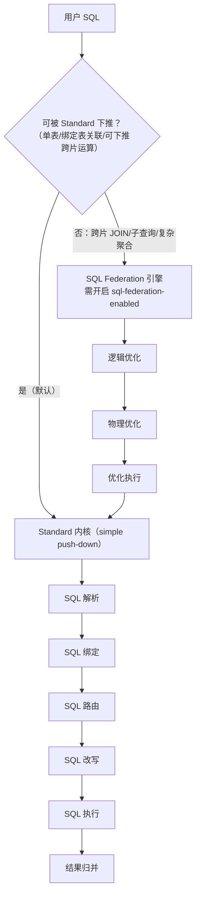
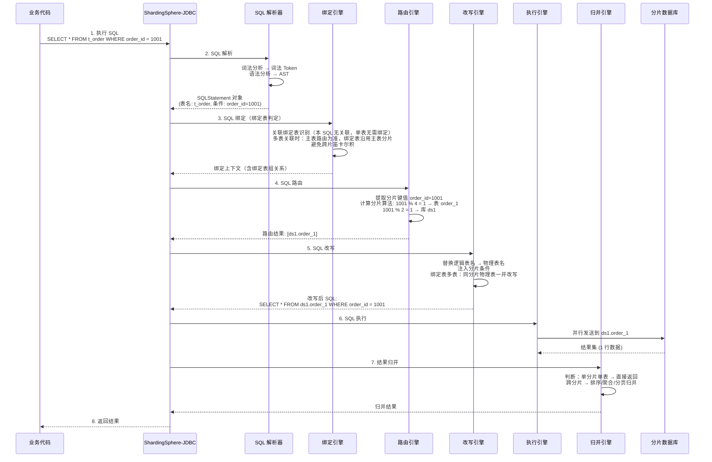
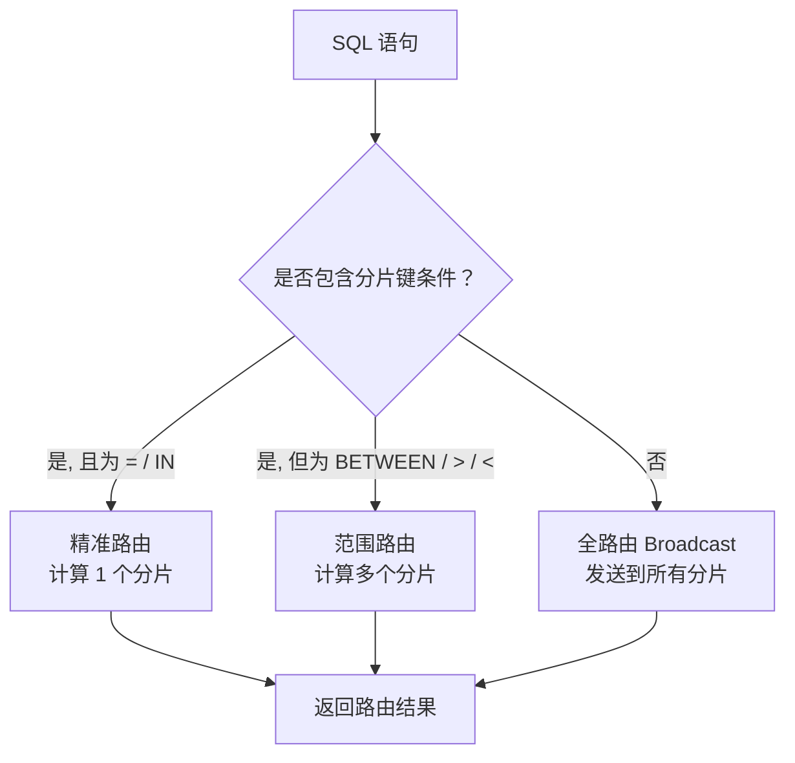
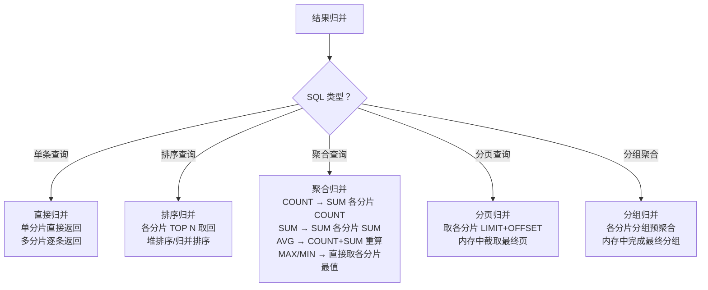

# ShardingSphere-JDBC 集成与配置详解

> 适用版本：ShardingSphere 5.5.2（也可回退 5.4.1）、Spring Boot 3.2.x、JDK 17+、MySQL 8.0+
> 主题范围：ShardingSphere-JDBC 核心概念全解、数据分片内核流程（Standard 下推六步 + SQL Federation）、Spring Boot 集成完整配置（分库 + 分表）、内置 vs 自定义分片算法、常见踩坑与规避
> 本机实测状态：依赖拉取受限未能实测，配置基于官方文档 5.5.x 完整可复现

## 📋 总纲

- ① 核心概念逐一展开——逻辑表/物理表/数据源/分片键/分片算法/actualDataNodes/inline 表达式/绑定表/广播表，每个定义 + 配置示例
- ② 数据分片内核流程——两套引擎（Standard 下推六步流程 vs SQL Federation），Standard 六步：SQL 解析 → 绑定 → 路由 → 改写 → 执行 → 结果归并，Mermaid 时序图，每步原理与关键代码片段
- ③ Spring Boot 完整集成——pom.xml 坐标、application.yaml 全量注释式配置、Mapper/Service 示例
- ④ 内置分片算法 vs 自定义分片算法——StandardShardingAlgorithm 接口实现、完整 Java 代码
- ⑤ 常用分片策略清单一览——标准分片、复合分片、Hint 分片、行分片
- ⑥ 常见踩坑——不支持的 SQL、广播表作用、Hint 强制路由、分页跨片、非分片键查询全路由

---

## 受众声明

- **面向**：Java 后端开发者（3 年以上经验）及架构师。
- **假设已掌握**：[00-分库分表总览与选型](00-分库分表总览与选型.md) 中的分库分表本质与演进阶段、[01-垂直与水平拆分详解](01-垂直与水平拆分详解.md) 中的四象限拆分概念、[02-分片键与分片算法详解](02-分片键与分片算法详解.md) 中的分片键选择原则与七大算法、[03-中间件架构模式对比详解](03-中间件架构模式对比详解.md) 中的客户端代理模式原理。
- **本篇需讲清**：ShardingSphere-JDBC 的核心概念（逻辑表/物理表/actualDataNodes 等）、数据分片内核流程的完整细节（Standard 下推六步 + SQL Federation 两套引擎）、从零到一的 Spring Boot 集成配置（可照抄可跑）、内置 vs 自定义分片算法代码实现、常见坑及其规避方案。

## 学习目标

读完本篇，你能：

1. 说出 ShardingSphere-JDBC 中逻辑表、物理表、actualDataNodes、绑定表、广播表的核心区别，并写出对应的 YAML 配置
2. 画出 Standard 内核六步流程（SQL 解析 → 绑定 → 路由 → 改写 → 执行 → 归并）的时序图，并解释每步做了什么；说出 SQL Federation 引擎与 Standard 下推的区别
3. 从零搭建一个 Spring Boot + ShardingSphere-JDBC 项目，配置分库（2 库）分表（每库 4 表），完成增删改查
4. 配置 ShardingSphere 内置的 5 种分片算法（MOD/HASH_MOD/RANGE/INTERVAL/CLASS_BASED），并写出 YAML
5. 实现一个自定义分片算法（实现 StandardShardingAlgorithm 接口），完成多列复合分片
6. 列出 ShardingSphere-JDBC 中至少 5 种不支持的 SQL 类型，并给出替代方案
7. 正确使用绑定表避免笛卡尔积路由，使用广播表统一管理配置表
8. 使用 Hint 强制路由在特定场景下绕过分片键规则

## 前置知识

- [00-分库分表总览与选型](00-分库分表总览与选型.md) —— 总纲、B+树高度公式、演进阶段
- [01-垂直与水平拆分详解](01-垂直与水平拆分详解.md) —— 四象限拆分概念，拆分后代价
- [02-分片键与分片算法详解](02-分片键与分片算法详解.md) —— 分片键选择原则，七大分片算法
- [03-中间件架构模式对比详解](03-中间件架构模式对比详解.md) —— 客户端代理/服务端代理/云原生架构对比，ShardingSphere-JDBC 定位与优缺点
- 本篇无其他前置，直接阅读即可。

---

## 1. 核心概念逐一展开

ShardingSphere-JDBC 定义了一套完整的分片抽象层。理解这些概念是配置正确的前提。

### 1.1 逻辑表（Logic Table）

**定义**：逻辑表是开发者在业务代码中看到的"单表"，物理上它被分散到多个分片表中。应用程序只操作逻辑表，ShardingSphere 在运行时将其路由到对应的物理表。

**生活类比**：你把 100 本书分到了 4 个书柜（每个 25 本），但 APP 上的"借书"操作只需要说"借《Java 并发》"——系统自动知道去哪个书柜找，不需要你告诉它书柜编号。

**配置示例**：YAML 中 `t_order` 就是逻辑表名。

```yaml
rules:
  - !SHARDING
    tables:
      t_order:  # 逻辑表名
        actualDataNodes: ds$->{0..1}.order_$->{0..3}
        # ...
```

**代码中用法**：Mapper 里写 `t_order`，不要写 `t_order_0`。

```java
@Mapper
public interface OrderMapper {
    // SQL 操作逻辑表，不要写物理表名
    @Select("SELECT * FROM t_order WHERE order_id = #{orderId}")
    Order selectByOrderId(Long orderId);
}
```

### 1.2 物理表（Actual Table）

**定义**：数据库中真实存在的分片表，命名通常为 `t_order_0`、`t_order_1`、`t_order_2`、`t_order_3`。物理表必须预先在数据库中创建好，ShardingSphere 不会自动建表。

**对比**：

| 维度 | 逻辑表 | 物理表 |
|------|:------:|:------:|
| 业务代码中使用的表名 | `t_order` | `t_order_0`、`t_order_1`…… |
| 数据库真实存在 | ❌ 不存在 | ✅ 必须存在 |
| 数量 | 1 个 | 多个（N 个分片） |
| 创建方式 | 配置中声明 | 手动执行 DDL 创建 |
| 数据分布 | 逻辑上归总 | 各自存一部分 |

**DDL 创建示例**：

```sql
-- 需要在每个分库中创建所有分片表
CREATE TABLE t_order_0 (
    order_id    BIGINT       NOT NULL PRIMARY KEY,
    user_id     BIGINT       NOT NULL,
    order_no    VARCHAR(64)  NOT NULL,
    amount      DECIMAL(10,2) NOT NULL,
    status      INT          NOT NULL DEFAULT 0,
    created_at  DATETIME     NOT NULL DEFAULT CURRENT_TIMESTAMP,
    INDEX idx_user_id (user_id)
) ENGINE=InnoDB DEFAULT CHARSET=utf8mb4;

CREATE TABLE t_order_1 LIKE t_order_0;
CREATE TABLE t_order_2 LIKE t_order_0;
CREATE TABLE t_order_3 LIKE t_order_0;
```

### 1.3 数据源（DataSource）

**定义**：每个物理数据库实例对应一个数据源。在 ShardingSphere 配置中，`dataSources` 部分定义所有分片库的连接信息。每个数据源最终会被包装成 ShardingSphere 的 `ShardingSphereDataSource`。

ShardingSphere-JDBC 不创建自己的连接池，而是复用你在配置中声明的连接池（通常是 HikariCP）。

**配置示例**（application.yaml 的 `dataSources` 部分）：

```yaml
dataSources:
  ds0:  # 数据源名称，后续在 actualDataNodes 中引用
    dataSourceClassName: com.zaxxer.hikari.HikariDataSource
    driverClassName: com.mysql.cj.jdbc.Driver
    jdbcUrl: jdbc:mysql://localhost:3306/order_db_0?useSSL=false&serverTimezone=Asia/Shanghai
    username: root
    password: root
    connectionTimeout: 30000
    idleTimeout: 60000
    maxLifetime: 1800000
    maximumPoolSize: 10
    minimumIdle: 2
  ds1:
    dataSourceClassName: com.zaxxer.hikari.HikariDataSource
    driverClassName: com.mysql.cj.jdbc.Driver
    jdbcUrl: jdbc:mysql://localhost:3306/order_db_1?useSSL=false&serverTimezone=Asia/Shanghai
    username: root
    password: root
    connectionTimeout: 30000
    idleTimeout: 60000
    maxLifetime: 1800000
    maximumPoolSize: 10
    minimumIdle: 2
```

**重要**：ShardingSphere 5.x 中的 `dataSourceClassName` 指定的是连接池实现类，不再使用 `type: com.zaxxer.hikari.HikariDataSource` 这种旧写法。`jdbcUrl` 是标准 JDBC 连接字符串，`driverClassName` 需指定 MySQL 驱动类。

### 1.4 分片键（Sharding Key）

**定义**：分片键是 ShardingSphere 用来决定 SQL 发往哪个分片的字段。可以是单列（`order_id`）或复合列（`user_id + order_id`）。分片键的值通过分片算法计算后，映射到具体的数据源和表。

**配置位置**：`tables.<tableName>.<databaseStrategy | tableStrategy>.shardingColumn`。

**分片键选择原则**（详见 [02-分片键与分片算法详解](02-分片键与分片算法详解.md) §1）：

1. **均匀性**——数据分布均匀，避免数据倾斜（取模/哈希优于范围）
2. **写热度**——避免热点键导致单分片写瓶颈
3. **查询频率**——尽量用查询频率最高的列作为分片键，避免全路由
4. **不可变更**——分片键值一旦确定，不应修改（涉及跨分片迁移）

**反例**：

```yaml
# ❌ 错误：用 status（状态值只有 0/1/2）作为分片键
# 导致数据严重倾斜，且查询主要按 user_id 查，频繁全路由
tables:
  t_order:
    # 不推荐
    tableStrategy:
      standard:
        shardingColumn: status
```

### 1.5 分片算法（Sharding Algorithm）

**定义**：分片算法是决定具体路由到哪个分片的计算逻辑。ShardingSphere 提供内置算法（`MOD`、`HASH_MOD`、`RANGE`、`INTERVAL` 等），也支持自定义算法（实现 `StandardShardingAlgorithm` 接口）。

**配置位置**：`shardingAlgorithms` 下声明算法实例，然后在 `databaseStrategy` 或 `tableStrategy` 中引用。

**所有内置算法一览**：

| 算法类型 | 类型名称 | 描述 | 适用场景 |
|:--------:|:--------:|:----:|:--------:|
| MOD | `MOD` | 取模分片，`shardingColumn % shardingCount` | 分片键是数字，分片数固定 |
| HASH_MOD | `HASH_MOD` | 哈希后取模，`hash(shardingColumn) % shardingCount` | 分片键是字符串，需均匀分布 |
| RANGE | `STANDARD_RANGE` | 范围分片，按列值区间映射 | 分片键有自然区间（如时间） |
| INTERVAL | `INTERVAL` | 时间间隔分片，按日期/时间间隔自动分片 | 时间序列数据，按天/月分表 |
| CLASS_BASED | `CLASS_BASED` | 自定义算法引用，通过 SPI 加载 | 内置算法不满足时 |

**配置示例**（YAML 声明算法）：

```yaml
shardingAlgorithms:
  database-inline:  # 分库算法，自定义名称
    type: HASH_MOD
    props:
      sharding-count: 2  # 2 个分片（ds0, ds1）
  table-inline:  # 分表算法，自定义名称
    type: MOD
    props:
      sharding-count: 4  # 4 张分片表（order_0~order_3）
```

### 1.6 actualDataNodes（实际数据节点）

**定义**：`actualDataNodes` 是逻辑表到物理表的映射表达式，描述了"哪张逻辑表分布在哪几个数据库的哪几张物理表上"。它是 ShardingSphere 路由的"地图"。

**格式**：`<数据源名>.<物理表名>`，支持 inline 表达式。

**常见写法**：

```yaml
# 写法 1：分库 × 分表，2 库 × 4 表 = 8 个物理节点
actualDataNodes: ds$->{0..1}.order_$->{0..3}

# 写法 2：只分表不分库，单库 4 张表
actualDataNodes: ds0.order_$->{0..3}

# 写法 3：只分库不分表，2 个库，每库同名表
actualDataNodes: ds$->{0..1}.t_order

# 写法 4：枚举写法（少量节点时）
actualDataNodes: ds0.order_0, ds0.order_1, ds1.order_0, ds1.order_1
```

**inline 表达式详解**：

| 表达式 | 含义 | 展开结果 |
|:------:|:----:|:--------:|
| `$->{0..1}` | 范围 | `0`, `1` |
| `$->{0..3}` | 范围 | `0`, `1`, `2`, `3` |
| `$->{['a','b']}` | 枚举 | `a`, `b` |
| `ds$->{0..1}.order_$->{0..3}` | 组合 | `ds0.order_0`, `ds0.order_1`, …, `ds1.order_2`, `ds1.order_3` |

**展开结果**（`ds$->{0..1}.order_$->{0..3}`）：共 8 个数据节点

```
ds0.order_0   ds0.order_1   ds0.order_2   ds0.order_3
ds1.order_0   ds1.order_1   ds1.order_2   ds1.order_3
```

### 1.7 inline 表达式

**定义**：Inline 表达式是 ShardingSphere 中的一种简洁配置语法，用于在配置中声明数据源、表名、列名的范围或枚举。它出现在多个地方——`actualDataNodes`、`databaseStrategy` 表达式、`tableStrategy` 表达式。

**核心语法**：

```
$->{<expression>}
```

**支持的操作**：

| 操作 | 示例 | 结果 | 说明 |
|:----:|:----:|:----:|:----:|
| 范围 | `$->{0..3}` | `0,1,2,3` | 闭区间，包含两端 |
| 枚举 | `$->{['a','b','c']}` | `a,b,c` | 字符串枚举 |
| 混合 | `ds_$->{0..1}.t_order_$->{0..3}` | `ds_0.t_order_0`, … | 组合表达式 |
| 非表达式部分 | `ds`、`t_order` | 原样输出 | 不包含 `$->{}` 的部分 |

**⚠️ 注意**：Inline 表达式底层使用 Groovy 解析，`$->{}` 是固定语法，不能写成 `${}` 或别的形式。早期版本（ShardingSphere-JDBC 4.x）使用 `${}` 表达式，5.x 升级后必须改为 `$->{}`。

### 1.8 绑定表（Binding Table）

**定义**：绑定表是指一组逻辑表，它们使用相同的分片键和分片算法，从而保证关联查询时不会产生笛卡尔积路由。当两个表都是绑定表时，ShardingSphere 确保关联查询中的 `JOIN` 条件对应到同一个物理分片。

**为什么需要绑定表**：不加绑定表时，`t_order JOIN t_order_item` 会在所有分片组合上做笛卡尔积路由：

```
t_order_0 → t_order_item_0 (在同一分片 ✅)
t_order_0 → t_order_item_1 (跨分片 ❌)
t_order_1 → t_order_item_0 (跨分片 ❌)
t_order_1 → t_order_item_1 (在同一分片 ✅)
```

总共 4 次子查询，但实际上只有 2 次是有意义的——产生大量无效查询。

**加了绑定表后**：只有同分片组合：

```
t_order_0 → t_order_item_0 (同在 ds0.order_0 ✅)
t_order_1 → t_order_item_1 (同在 ds0.order_1 ✅)
```

**配置示例**：

```yaml
rules:
  - !SHARDING
    bindingTables:
      - t_order, t_order_item  # 绑定表：join 时只走同一分片
    tables:
      t_order:
        actualDataNodes: ds$->{0..1}.order_$->{0..3}
        # ... 分片策略
      t_order_item:
        actualDataNodes: ds$->{0..1}.order_item_$->{0..3}
        # ... 分片策略（必须与 t_order 相同分片键+算法）
```

**必要条件**：绑定表的多张表必须使用**相同的分片键**和**相同的分片算法**，否则绑定表声明无效。

### 1.9 广播表（Broadcast Table）

**定义**：广播表是指所有分片库中数据完全相同的表，通常用于存储配置数据、字典数据、系统参数等。对广播表的任何 DML 操作（INSERT/UPDATE/DELETE）都会被 ShardingSphere 广播到所有分片库，确保每个分片的数据一致。

**典型场景**：

| 表名 | 用途 | 是否适合广播表 |
|:----:|:----:|:-------------:|
| `t_config` | 全局配置项（key-value） | ✅ 适合 |
| `t_dict` | 数据字典（状态码、枚举值） | ✅ 适合 |
| `t_region` | 区域/省份表 | ✅ 适合 |
| `t_order` | 订单表（数据量大、分片存储） | ❌ 不适合 |
| `t_user` | 用户表（数据量大、分片存储） | ❌ 不适合 |

**配置示例**：

```yaml
rules:
  - !SHARDING
    broadcastTables:  # 广播表列表
      - t_config
      - t_dict
      - t_region
    tables:
      # ... 分片表配置
```

**广播表的行为**：

| 操作 | 行为 | 效果 |
|:----:|:----:|:----:|
| `INSERT INTO t_config ...` | 广播到所有分片库 | 每条数据在各分片库同时存在 |
| `UPDATE t_config SET ...` | 广播到所有分片库 | 各分片库同步更新 |
| `DELETE FROM t_config WHERE ...` | 广播到所有分片库 | 各分片库同步删除 |
| `SELECT * FROM t_config` | 仅从第一个分片库查询 | 数据一致，无需全路由 |

**⚠️ 注意**：广播表的 `SELECT` 默认只从第一个分片库读取，因为数据在所有分片库中完全一致。如果数据不一致（例如某个分片库的更新失败），查询结果可能异常。因此广播表建议配合 `t_config` 这类只追加、极少更新的表使用，不建议用于高频更新的大表。

**完整概念对比表**：

| 概念 | 数据分布 | 路由规则 | 典型场景 |
|:----:|:--------:|:--------:|:--------:|
| 逻辑表 | 虚拟存在 | 自动路由到物理表 | 业务代码中操作的表名 |
| 物理表 | 真实存在 | 每个分片一个 | 存储实际数据 |
| 绑定表 | 多表同分片 | 关联查询只走同分片 | `t_order` + `t_order_item` |
| 广播表 | 全库一致 | 写广播、读首库 | 配置表、字典表 |

---

## 2. 数据分片内核流程（两套流程）

ShardingSphere 的数据分片内核包含**两套并行的 SQL 处理引擎**：**Standard 内核（simple push-down，简单下推）** 与 **SQL Federation 引擎（分布式查询优化）**。每个 SQL 请求按复杂度自动选择走哪条链路。

- **Standard 内核（下推）**：面向单表、多表关联、能用分片下推解决的常规 SQL，流程为 **解析 → 绑定 → 路由 → 改写 → 执行 → 归并**。这是绝大多数请求的主链路。
- **SQL Federation 引擎**：面向跨分片 `JOIN`、子查询、复杂聚合等需要全局优化的 SQL，先做 **逻辑优化 → 物理优化 → 优化执行** 三阶段，再把结果交给 Standard 内核做最终执行与归并。默认为关闭（`sql-federation-enabled: false`），需要时按需开启。

### 2.0 两套引擎决策图



### 2.1 Standard 内核六步流程时序图



### 2.2 Standard 引擎第一步：SQL 解析（SQL Parsing）

**原理**：ShardingSphere 使用基于 ANTLR（Another Tool for Language Recognition）的 SQL 解析器，将用户输入的 SQL 字符串解析成抽象语法树（AST），再从中提取出 SQL 语句的语义信息（表名、列名、条件、排序、聚合等）。

**解析器演进史**：

| 版本段 | 解析器实现 | 说明 |
|:------:|:---------:|:----:|
| 1.4.x 之前 | **Druid** | 借用阿里的 SQL 解析器 |
| 1.5.x 起 | **自研半理解式解析器** | 不生成完整 AST，只解析分片所需信息，轻量但能力有限 |
| 3.0.x 起 | **ANTLR（开源）+ AST 缓存** | 完整 AST + 语义模型 `SQLStatement`，并带 AST 缓存提高重复解析性能（结构相同的 SQL 命中缓存，跳过二次解析） |

当前 5.5.x 即基于 ANTLR 的完整解析 + AST 缓存方案。

**解析流程**：

```
SQL 字符串 → 词法分析（Lexer）→ Token 流 → 语法分析（Parser）→ AST → 提取 SQLStatement
```

**词法分析（Lexer）**：将 SQL 字符串拆成 Token 序列。例如 `SELECT * FROM t_order WHERE order_id = 1001` 被拆成：

| Token | 类型 |
|:-----:|:----:|
| SELECT | 关键字 |
| * | 通配符 |
| FROM | 关键字 |
| t_order | 标识符（表名） |
| WHERE | 关键字 |
| order_id | 标识符（列名） |
| = | 操作符 |
| 1001 | 数字字面量 |

**语法分析（Parser）**：根据 SQL 语法规则（ANTLR 文法），将 Token 流组织成 AST。AST 的节点类型包括 `SelectStatement`、`FromClause`、`WhereClause`、`ComparisonExpression` 等。

**提取 SQLStatement**：从 AST 中提取出 ShardingSphere 内部使用的 `SQLStatement` 对象，包含：

- **表名**：`t_order`（需要判断是否是分片表）
- **查询列**：`*`（所有列）
- **条件表达式**：`order_id = 1001`（提取分片键值）
- **排序/分组/聚合**：如果有的话
- **分页**：`LIMIT/OFFSET` 如果有的话

**关键代码（示意）**：

```java
// ShardingSphere 内部简化示意
SQLStatement sqlStatement = sqlParser.parse("SELECT * FROM t_order WHERE order_id = 1001");
// sqlStatement.getTables()       → ["t_order"]
// sqlStatement.getWhere()        → ComparisonExpression(column="order_id", op="=", value=1001)
// sqlStatement.getOrderBy()      → null
// sqlStatement.getGroupBy()      → null
// sqlStatement.getLimit()        → null
```

**支持方言**：ShardingSphere 的 SQL 解析器支持 MySQL、PostgreSQL、openGauss、SQLServer、Oracle、SQLite 等主流数据库方言。不同方言的差异在解析器层已经处理，用户无需关心。

### 2.3 Standard 引擎第二步：SQL 绑定（SQL Binding）

**原理**：SQL 绑定引擎（Binding）在解析之后、路由之前，基于**表元数据**（逻辑表 ↔ 物理映射、分片键、绑定表组关系）将 `SQLStatement` 做语义绑定——把关联查询中的逻辑表与**绑定表（Binding Table）**关系关联起来，为路由判定打基础。

**核心作用**：

1. **绑定表关联识别**：当查询涉及绑定表组（分片键和分片规则一致的多张分片表，如 `t_order` + `t_order_item`）时，绑定引擎记录其归属关系。
2. **消除笛卡尔积路由**：绑定表之间 `JOIN` 时，路由计算**以主表（带分片键 / 能确定分片的那张表）为准**，从表分片**沿用主表的路由结果**，不会在所有分片组合上做笛卡尔积展开。
3. **从表分片沿用**：只要 `t_order` 路由到 `order_1`，与之绑定的 `t_order_item` 只取同库同分片的 `order_item_1`，保证关联数据落在同一物理分片，无需跨库 Join。

```java
// 绑定引擎内部示意
Map<String, TableRule> tableRules = metadata.getTableRules();      // 逻辑表元数据
BindingTableRule bindingRule = tableRule.getBindingTableRule();     // 绑定表组规则
// 主表路由到 (ds1, order_1) 后，从表 t_order_item 沿用 -> (ds1, order_item_1)
```

> **广播表 vs 绑定表**：广播表是**所有分片库各存一份完整数据的全局表**（配置表/字典表），用于 `JOIN` 时每个分片都能本地关联、避免跨库；绑定表则是**分片键和分片规则完全一致的多个分片表**的关联优化，只按主表路由一次。二者一个是「全库冗余」，一个是「同键关联」。

**关联查询必须用分片键关联**：绑定表 `JOIN` 的关联条件必须落在分片键上（如 `o.order_id = oi.order_id`），否则绑定关系无从定位，会退化为跨分片笛卡尔积路由。

---

### 2.4 Standard 引擎第三步：SQL 路由（SQL Routing）

**原理**：路由引擎根据 SQL 中是否包含分片键值，决定 SQL 需要发往哪些数据源和物理表。路由结果分为**精准路由**（命中分片键）和**全路由**（未命中分片键）。

**路由决策树**：



**分片键提取与计算**：

假设分片算法为 `MOD(order_id, 4)`，分表为 `order_$->{0..3}`，分库为 `HASH_MOD(user_id, 2)`，`ds$->{0..1}`：

```sql
-- SQL 1：精准命中分片键（= 条件）
SELECT * FROM t_order WHERE order_id = 1001;
-- 路由：order_id = 1001 → 1001 % 4 = 1 → order_1
-- 计算 user_id? 这里没有 user_id，但 order_id 也用于分库？
-- 如果分库键是 user_id 但 SQL 里只有 order_id，就走全库路由
-- 所以：分库键和分表键都要考虑

-- SQL 2：IN 条件
SELECT * FROM t_order WHERE order_id IN (1001, 1002, 1003);
-- 路由：分别计算 1001%4=1, 1002%4=2, 1003%4=3 → 路由到 order_1, order_2, order_3

-- SQL 3：范围条件（未命中精确分片键）
SELECT * FROM t_order WHERE order_id BETWEEN 1001 AND 2000;
-- 路由：范围查询 → 无法精确计算哪些分片 → 全路由所有分片（order_0~order_3）

-- SQL 4：无分片键条件
SELECT * FROM t_order WHERE status = 1;
-- 路由：无分片键 → 全路由所有分片（order_0~order_3，所有分库）
```

**路由结果**：路由引擎返回一个 `RouteContext` 对象，包含：

```java
// 路由结果示例
RouteContext {
    routeUnits = [
        RouteUnit { dataSourceName="ds1", sqlUnit="SELECT * FROM order_1 WHERE order_id = 1001" }
    ]
}
```

**路由类型对比**：

| 路由类型 | 触发条件 | 性能影响 | 典型场景 |
|:--------:|:--------:|:--------:|:--------:|
| 精准路由 | 分片键 = 值 或 IN(有限值) | 最优（1 分片） | 按主键查询 |
| 范围路由 | 分片键 BETWEEN/>/< | 中等（多分片） | 按时间范围查询（范围分片算法） |
| 全路由 | 无分片键条件 | 最差（全部分片） | 全表扫描、非分片键查询 |

### 2.5 Standard 引擎第四步：SQL 改写（SQL Rewriting）

**原理**：改写引擎将 SQL 语句中的逻辑表名替换为物理表名，并注入必要的分片条件。对于多表关联查询，还需要改写表别名。

**改写内容**：

| 改写项 | 说明 | 示例 |
|:------:|:----:|:----:|
| 逻辑表名 → 物理表名 | 替换 `t_order` 为 `t_order_1` | `FROM t_order` → `FROM t_order_1` |
| 数据源 | 选择正确的数据源 | `ds1.t_order_1` |
| 分片条件注入 | 添加分片键条件（优化器提示） | 不常用，但可在 Hint 中注入 |
| 别名修正 | 表别名与物理表名一致 | `t_order o` → `t_order_1 o` |
| 自动补列 | 如果查询中缺少分片键列，自动补上 | `INSERT INTO t_order(amount) VALUES(100)` → `INSERT INTO t_order_1(order_id, amount, user_id) VALUES(1001, 100, 1001)` |

**改写示例**：

```sql
-- 改写前（用户 SQL）
SELECT * FROM t_order WHERE order_id = 1001;

-- 改写后（实际发送到 ds1.order_1 的 SQL）
SELECT * FROM order_1 WHERE order_id = 1001;
```

**关联查询改写**：

```sql
-- 改写前（绑定表关联查询）
SELECT o.*, oi.*
FROM t_order o
JOIN t_order_item oi ON o.order_id = oi.order_id
WHERE o.order_id = 1001;

-- 改写后（路由到 ds1.order_1 和 ds1.order_item_1）
SELECT o.*, oi.*
FROM order_1 o
JOIN order_item_1 oi ON o.order_id = oi.order_id
WHERE o.order_id = 1001;
```

**INSERT 改写**（自动补分片键列）：

```sql
-- 改写前：INSERT 未指定分片键
INSERT INTO t_order(amount, status) VALUES(100.00, 1);

-- 改写后：ShardingSphere 自动生成 order_id 并补入
INSERT INTO order_1(order_id, amount, status) VALUES(105001, 100.00, 1);
```

**⚠️ 注意**：INSERT 语句必须包含分片键列（或让 ShardingSphere 自动生成），否则无法路由。自动生成分片键需要配置 `keyGenerateStrategy`（见第 3 节）。

### 2.6 Standard 引擎第五步：SQL 执行（SQL Execution）

**原理**：执行引擎将改写后的 SQL 通过连接池（HikariCP）并行发送到对应的分片数据库。每个分片使用独立连接，互不干扰。执行结果返回一个 `ResultSet` 列表。

**执行模式**：ShardingSphere 支持两种执行模式：

| 模式 | 并发模型 | 适用场景 | 性能特征 |
|:----:|:--------:|:--------:|:--------:|
| 内存限制模式 | 每个分片独立连接，并行执行 | 大多数场景 | 吞吐量高，但分片多时内存消耗大 |
| 连接限制模式 | 复用连接，串行执行 | 数据库连接数有限时 | 吞吐量低，但连接数需求少 |

**默认模式**：ShardingSphere 5.x 默认使用内存限制模式，即每个分片使用独立连接并行执行。可以通过 `props` 配置调整：

```yaml
props:
  max-connections-size-per-query: 1  # 设为 1 时退化为连接限制模式
```

**执行流程**：

```java
// ShardingSphere 内部简化示意
List<RouteUnit> routeUnits = routeContext.getRouteUnits();
List<ResultSet> results = new ArrayList<>();

// 并行执行（使用 CompletableFuture 或线程池）
for (RouteUnit routeUnit : routeUnits) {
    // 从数据源池获取连接
    Connection conn = dataSourceMap.get(routeUnit.getDataSourceName()).getConnection();
    PreparedStatement ps = conn.prepareStatement(routeUnit.getSql());
    // 设置参数
    ResultSet rs = ps.executeQuery();
    results.add(rs);
}

// 将结果集列表交给归并引擎
```

### 2.7 Standard 引擎第六步：结果归并（Result Merging）

**原理**：归并引擎将多个分片返回的结果集合并成一个逻辑结果集，对上层应用透明。根据 SQL 类型不同，归并策略也不同。

**归并策略分类**：



**各归并策略详解**：

| 策略 | 实现方式 | 内存消耗 | 示例 |
|:----:|:--------:|:--------:|:----:|
| 直接归并 | 遍历所有分片结果集，按行返回 | 低（逐行流式） | `SELECT * FROM t_order WHERE order_id = 1001` |
| 排序归并 | 各分片取 TOP N，用堆排序做归并 | 中（O(N)） | `SELECT * FROM t_order ORDER BY amount DESC LIMIT 10` |
| 聚合归并 | 各分片预聚合，结果再聚合 | 低（聚合值小） | `SELECT COUNT(*) FROM t_order` |
| 分页归并 | 各分片取 `LIMIT offset + limit`，内存中取最终页 | 高（O(shard × (offset+limit))） | `SELECT * FROM t_order LIMIT 100, 10` |
| 分组归并 | 各分片分组预聚合，内存中完成最终分组 | 中到高（分组数相关） | `SELECT status, COUNT(*) FROM t_order GROUP BY status` |

**分页归并的"深翻页"问题**：

```sql
-- 用户期望：取第 1000 页，每页 10 条
SELECT * FROM t_order ORDER BY order_id DESC LIMIT 9990, 10;
```

**实际执行**：每个分片都取 `LIMIT 9990, 10`（即 10000 条），然后在内存中排序取最终 10 条。如果有 8 个分片，内存中需要处理 8 × 10000 = 80000 条数据。

**这就是"深翻页"问题**：页数越深，内存消耗越大。解决方案：

1. **游标分页**（推荐）：用 `WHERE order_id > ? ORDER BY order_id LIMIT 10` 替代 `OFFSET`
2. **限制最大 offset**：业务上限制翻页深度（如最多 100 页）
3. **使用 ShardingSphere-Proxy 的流式归并**：减少内存占用但增加延迟

---

### 2.8 SQL Federation 引擎（另一套流程，用于复杂查询）

**定位**：Standard 下推内核解决**可在单分片内完成的 SQL**；当 SQL 需要**跨分片可下推的复杂运算**（跨片 `JOIN`、子查询、复杂聚合）时，ShardingSphere 走 **SQL Federation 引擎**做分布式查询优化，再回到 Standard 内核执行。

**Federation 三步流程**：

```
SQL 解析 => 逻辑优化(Logical Optimize) => 物理优化(Physical Optimize) => 优化执行(Optimize Execute) => (转入 Standard 内核)
```

1. **逻辑优化**：基于关系代数重写查询计划（谓词下推、常量折叠、JOIN 重排序等），生成逻辑执行计划。
2. **物理优化**：选择具体执行策略（如何拆分为各分片子查询、如何拉取与合并），生成物理执行计划。
3. **优化执行**：按物理计划向各分片下发子查询，拉取结果交给 Standard 内核完成最终执行/归并，对应用透明返回。

**触发场景**：跨分片且需要全局 Join/子查询/复杂聚合的 SQL（如 `t_order` 与 `t_payment` 分片键不同、`IN (SELECT ...)` 跨片子查询）。

**开启方式**（默认为关闭，需按需开启）：

```yaml
spring:
  shardingsphere:
    props:
      sql-federation-enabled: true   # 开启 SQL Federation
```

**对比**：

| 引擎 | 适用 SQL | 特点 |
|:----:|:--------:|:----:|
| Standard（下推） | 常规单表/绑定表关联/可下推跨片运算 | 默认开启，吞吐高 |
| SQL Federation | 跨片 join/子查询/复杂聚合 | 需手动开启，多阶段优化，能力更强但开销更大 |

---

## 3. Spring Boot 完整集成

本节从零搭建一个 Spring Boot 3.2 + ShardingSphere-JDBC 5.5.2 项目，分库分表规则为：

- **2 个数据库**：`order_db_0`、`order_db_1`（数据源 `ds0`、`ds1`）
- **每库 4 张分片表**：`order_0`、`order_1`、`order_2`、`order_3`
- **分库键**：`user_id`（HASH_MOD 均匀分配到 2 库）
- **分表键**：`order_id`（MOD 均匀分配到 4 表）
- **广播表**：`t_config`（全局配置表）

### 3.1 完整 pom.xml

```xml
<?xml version="1.0" encoding="UTF-8"?>
<project xmlns="http://maven.apache.org/POM/4.0.0"
         xmlns:xsi="http://www.w3.org/2001/XMLSchema-instance"
         xsi:schemaLocation="http://maven.apache.org/POM/4.0.0
         http://maven.apache.org/xsd/maven-4.0.0.xsd">
    <modelVersion>4.0.0</modelVersion>

    <parent>
        <groupId>org.springframework.boot</groupId>
        <artifactId>spring-boot-starter-parent</artifactId>
        <version>3.2.5</version>   <!-- Spring Boot 3.2.x 最新稳定版 -->
        <relativePath/>
    </parent>

    <groupId>com.example</groupId>
    <artifactId>sharding-jdbc-demo</artifactId>
    <version>1.0.0</version>
    <name>sharding-jdbc-demo</name>
    <description>ShardingSphere-JDBC 5.5.x 集成示例</description>

    <properties>
        <java.version>17</java.version>
        <!-- 可选版本：5.5.2（最新）或 5.4.1（更稳定、回退方案） -->
        <shardingsphere.version>5.5.2</shardingsphere.version>
        <!-- 如 5.5.2 依赖解析有问题，将上方版本改为 5.4.1 即可 -->
    </properties>

    <dependencies>
        <!-- ====== ShardingSphere-JDBC 核心 ====== -->
        <!-- ShardingSphere-JDBC Spring Boot Starter（自动配置入口） -->
        <dependency>
            <groupId>org.apache.shardingsphere</groupId>
            <artifactId>shardingsphere-jdbc-spring-boot-starter</artifactId>
            <version>${shardingsphere.version}</version>
        </dependency>

        <!-- ====== Spring Boot 基础 ====== -->
        <dependency>
            <groupId>org.springframework.boot</groupId>
            <artifactId>spring-boot-starter-web</artifactId>
        </dependency>
        <dependency>
            <groupId>org.springframework.boot</groupId>
            <artifactId>spring-boot-starter-data-jdbc</artifactId>
        </dependency>
        <!-- MyBatis-Plus 或 MyBatis 二选一 -->
        <dependency>
            <groupId>com.baomidou</groupId>
            <artifactId>mybatis-plus-spring-boot3-starter</artifactId>
            <version>3.5.7</version>
        </dependency>

        <!-- ====== 数据库连接 ====== -->
        <!-- MySQL JDBC 驱动 -->
        <dependency>
            <groupId>com.mysql</groupId>
            <artifactId>mysql-connector-j</artifactId>
            <scope>runtime</scope>
        </dependency>
        <!-- HikariCP 连接池（ShardingSphere 默认使用，也可替换） -->
        <dependency>
            <groupId>com.zaxxer</groupId>
            <artifactId>HikariCP</artifactId>
        </dependency>

        <!-- ====== 工具 ====== -->
        <dependency>
            <groupId>org.projectlombok</groupId>
            <artifactId>lombok</artifactId>
            <optional>true</optional>
        </dependency>
        <dependency>
            <groupId>org.springframework.boot</groupId>
            <artifactId>spring-boot-starter-test</artifactId>
            <scope>test</scope>
        </dependency>
    </dependencies>

    <build>
        <plugins>
            <plugin>
                <groupId>org.springframework.boot</groupId>
                <artifactId>spring-boot-maven-plugin</artifactId>
            </plugin>
        </plugins>
    </build>
</project>
```

**坐标说明**：

| 依赖 | 说明 | 是否必须 |
|:----:|:----:|:--------:|
| `shardingsphere-jdbc-spring-boot-starter` | 核心入口，自动装配 ShardingSphereDataSource | ✅ 必须 |
| `spring-boot-starter-data-jdbc` | Spring Data JDBC，提供 JdbcTemplate | 可选，也可用 MyBatis |
| `mybatis-plus-spring-boot3-starter` | MyBatis-Plus 3.5.7，Spring Boot 3.x 兼容版 | 可选，二选一 |
| `mysql-connector-j` | MySQL 8.x 驱动 | ✅ 必须 |
| `HikariCP` | 连接池，ShardingSphere 5.x 默认集成 | ✅ 必须 |

**版本兼容性矩阵**：

| ShardingSphere 版本 | Spring Boot 版本 | JDK 版本 | 说明 |
|:-------------------:|:----------------:|:--------:|:----:|
| 5.5.2 | 3.2.x / 3.3.x | 17+ | 最新稳定版，推荐 |
| 5.4.1 | 3.1.x / 3.2.x | 11+ | 稳定回退版，功能差异小 |
| 5.3.x | 3.1.x | 11+ | 较旧，不推荐新项目 |

### 3.2 application.yaml 完整配置（逐行注释版）

```yaml
# ============================================================
# ShardingSphere-JDBC 5.5.x 完整配置
# 文件名：src/main/resources/application.yaml
# 规则：2 库（order_db_0, order_db_1）× 4 表（order_0~order_3）
# 分库键：user_id（HASH_MOD）
# 分表键：order_id（MOD）
# 广播表：t_config
# ============================================================

# ------ 1. 数据源定义 ------
# 定义所有物理数据库的连接信息
# 数据源名称（ds0, ds1）会在下方 actualDataNodes 中引用
spring:
  shardingsphere:
    datasource:
      names: ds0, ds1  # 声明所有数据源的名称列表，逗号分隔

      # ------ 数据源 ds0：order_db_0 ------
      ds0:
        dataSourceClassName: com.zaxxer.hikari.HikariDataSource  # 连接池实现类
        driverClassName: com.mysql.cj.jdbc.Driver                # MySQL JDBC 驱动
        jdbcUrl: jdbc:mysql://localhost:3306/order_db_0?useSSL=false&serverTimezone=Asia/Shanghai&rewriteBatchedStatements=true
        username: root
        password: root
        # HikariCP 连接池参数（可选，默认值已合理）
        connectionTimeout: 30000         # 连接超时（毫秒）
        idleTimeout: 60000               # 空闲超时（毫秒）
        maxLifetime: 1800000             # 连接最大存活时间（毫秒）
        maximumPoolSize: 10              # 最大连接数
        minimumIdle: 2                   # 最小空闲连接数

      # ------ 数据源 ds1：order_db_1 ------
      ds1:
        dataSourceClassName: com.zaxxer.hikari.HikariDataSource
        driverClassName: com.mysql.cj.jdbc.Driver
        jdbcUrl: jdbc:mysql://localhost:3306/order_db_1?useSSL=false&serverTimezone=Asia/Shanghai&rewriteBatchedStatements=true
        username: root
        password: root
        connectionTimeout: 30000
        idleTimeout: 60000
        maxLifetime: 1800000
        maximumPoolSize: 10
        minimumIdle: 2

    # ------ 2. 分片规则（核心） ------
    rules:
      - !SHARDING  # 启用分片规则（! 是 YAML 标签语法，表示类型）

        # ------ 2.1 广播表 ------
        # 以下表在所有分片库中数据完全一致，写操作广播到所有库
        broadcastTables:
          - t_config   # 全局配置表
          - t_dict     # 数据字典表（可选）

        # ------ 2.2 绑定表 ------
        # 关联查询时避免笛卡尔积路由，只走同一物理分片
        # 注意：绑定表的多张表必须使用相同的分片键和分片算法
        bindingTables:
          - t_order, t_order_item   # 订单表 + 订单明细表

        # ------ 2.3 分片表配置 ------
        # 每张逻辑表在这里声明其分片规则
        tables:
          # ====== t_order 表（核心订单表） ======
          t_order:
            # 实际数据节点：2 库 × 4 表 = 8 个物理节点
            # 语法：ds$->{0..1}.order_$->{0..3}
            actualDataNodes: ds$->{0..1}.order_$->{0..3}

            # ----- 分库策略 -----
            # 用 user_id 做 HASH_MOD 分库，均匀分布到 ds0/ds1
            databaseStrategy:
              standard:
                shardingColumn: user_id            # 分库键
                shardingAlgorithmName: database-mod  # 引用下方定义的算法

            # ----- 分表策略 -----
            # 用 order_id 做 MOD 分表，均匀分布到 order_0~order_3
            tableStrategy:
              standard:
                shardingColumn: order_id            # 分表键
                shardingAlgorithmName: table-mod    # 引用下方定义的算法

            # ----- 主键生成策略 -----
            # 分布式全局唯一 ID（替代数据库自增）
            keyGenerateStrategy:
              column: order_id                      # 需要生成主键的列
              keyGeneratorName: snowflake           # 引用下方定义的主键生成器

          # ====== t_order_item 表（订单明细表，与 t_order 绑定） ======
          t_order_item:
            actualDataNodes: ds$->{0..1}.order_item_$->{0..3}
            databaseStrategy:
              standard:
                shardingColumn: user_id            # 分库键必须与 t_order 一致
                shardingAlgorithmName: database-mod
            tableStrategy:
              standard:
                shardingColumn: order_id           # 分表键必须与 t_order 一致
                shardingAlgorithmName: table-mod
            keyGenerateStrategy:
              column: item_id
              keyGeneratorName: snowflake

        # ------ 2.4 分片算法定义 ------
        shardingAlgorithms:
          # ----- 分库算法：HASH_MOD -----
          # 对 user_id 做哈希后取模，均匀分布到 2 个库
          database-mod:
            type: HASH_MOD
            props:
              sharding-count: 2   # 分片数（= 数据源个数）

          # ----- 分表算法：MOD -----
          # 对 order_id 直接取模，均匀分布到 4 张表
          table-mod:
            type: MOD
            props:
              sharding-count: 4   # 分片数（= 每库物理表数）

        # ------ 2.5 主键生成器定义 ------
        keyGenerators:
          # 雪花算法：分布式全局唯一 ID
          snowflake:
            type: SNOWFLAKE
            props:
              # 工作机器 ID（可选，多实例时需不同值）
              # 实际部署时建议通过环境变量注入
              worker-id: 1

      # ------ 3. 其他规则（可选） ------
      # 读写分离规则（如果配置了主从）
      - !READWRITE_SPLITTING
        dataSources:
          readwrite_ds:
            writeDataSourceName: ds0
            readDataSourceNames:
              - ds0-slave
            loadBalancerName: round_robin
        loadBalancers:
          round_robin:
            type: ROUND_ROBIN

    # ------ 4. 全局属性 ------
    props:
      # 是否在日志中输出 SQL（开发调试用，生产关闭）
      sql-show: true
      # 是否在日志中输出简化 SQL（不显示参数值）
      sql-simple: false
      # 每次查询最大连接数限制（默认 1，设为 0 表示不限制）
      max-connections-size-per-query: 1
      # 是否检查表元数据一致性（开发建议开启）
      check-table-metadata-enabled: true
      # 是否开启分片锁（避免并发 DDL 冲突）
      lock-backend-task-executor-enabled: false

# ------ 5. MyBatis 配置（如使用 MyBatis） ------
mybatis-plus:
  configuration:
    map-underscore-to-camel-case: true   # 下划线转驼峰
    log-impl: org.apache.ibatis.logging.stdout.StdOutImpl  # SQL 日志输出
  global-config:
    db-config:
      id-type: none                      # 主键不由 MyBatis 管理（ShardingSphere 负责）
```

### 3.3 Mapper 与 Service 示例

**实体类（Entity）**：

```java
package com.example.demo.entity;

import lombok.Data;
import java.math.BigDecimal;
import java.time.LocalDateTime;

/**
 * 订单实体 — 对应逻辑表 t_order
 * 注意：实体类中的表名用逻辑表名，不要写物理表名
 */
@Data
public class Order {
    private Long orderId;          // 订单 ID（ShardingSphere 雪花算法生成）
    private Long userId;           // 用户 ID（分库键）
    private String orderNo;        // 订单编号
    private BigDecimal amount;     // 订单金额
    private Integer status;        // 订单状态：0-待支付 1-已支付 2-已取消
    private LocalDateTime createdAt;  // 创建时间
}
```

**Mapper 接口（MyBatis-Plus 风格）**：

```java
package com.example.demo.mapper;

import com.baomidou.mybatisplus.core.mapper.BaseMapper;
import com.example.demo.entity.Order;
import org.apache.ibatis.annotations.Mapper;
import org.apache.ibatis.annotations.Param;
import org.apache.ibatis.annotations.Select;

import java.util.List;

/**
 * 订单 Mapper — 操作逻辑表 t_order
 * 使用 MyBatis-Plus 的 BaseMapper 自动获得 CRUD 方法
 */
@Mapper
public interface OrderMapper extends BaseMapper<Order> {

    /**
     * 按订单 ID 查询（精准路由，效率最高）
     * 路由过程：order_id 作为分表键，计算 order_id % 4 → 确定物理表
     * @param orderId 订单 ID
     * @return 订单
     */
    @Select("SELECT * FROM t_order WHERE order_id = #{orderId}")
    Order selectByOrderId(@Param("orderId") Long orderId);

    /**
     * 按用户 ID 查询所有订单（分库键命中，但分表键未命中→全表路由）
     * 路由过程：user_id 作为分库键，计算 user_id % 2 → 确定 ds0/ds1
     * 但分表键 order_id 未指定 → 在当前库的 4 张表中全路由
     * @param userId 用户 ID
     * @return 订单列表
     */
    @Select("SELECT * FROM t_order WHERE user_id = #{userId}")
    List<Order> selectByUserId(@Param("userId") Long userId);

    /**
     * 按用户 ID 和订单 ID 查询（双键命中，精准路由）
     * 路由过程：user_id 确定库，order_id 确定表 → 精确到 1 个物理表
     * @param userId 用户 ID
     * @param orderId 订单 ID
     * @return 订单
     */
    @Select("SELECT * FROM t_order WHERE user_id = #{userId} AND order_id = #{orderId}")
    Order selectByUserIdAndOrderId(@Param("userId") Long userId, @Param("orderId") Long orderId);

    /**
     * 按状态查询（无分片键 → 全路由）
     * 路由过程：无分片键条件 → 全路由所有库×所有表（8 个物理节点）
     * 性能最差，生产应避免或加索引
     * @param status 订单状态
     * @return 订单列表
     */
    @Select("SELECT * FROM t_order WHERE status = #{status}")
    List<Order> selectByStatus(@Param("status") Integer status);

    /**
     * 分页查询（按订单 ID 排序，注意深翻页问题）
     * 路由过程：无分片键 → 全路由，每个分片取 LIMIT offset+limit 条
     * @param offset 偏移量
     * @param limit 每页条数
     * @return 订单列表
     */
    @Select("SELECT * FROM t_order ORDER BY order_id DESC LIMIT #{offset}, #{limit}")
    List<Order> selectPage(@Param("offset") int offset, @Param("limit") int limit);
}
```

**Service 层**：

```java
package com.example.demo.service;

import com.baomidou.mybatisplus.core.conditions.query.LambdaQueryWrapper;
import com.example.demo.entity.Order;
import com.example.demo.mapper.OrderMapper;
import lombok.RequiredArgsConstructor;
import lombok.extern.slf4j.Slf4j;
import org.springframework.stereotype.Service;
import org.springframework.transaction.annotation.Transactional;

import java.math.BigDecimal;
import java.time.LocalDateTime;
import java.util.List;

/**
 * 订单 Service — 演示分片环境下的增删改查
 */
@Slf4j
@Service
@RequiredArgsConstructor
public class OrderService {

    private final OrderMapper orderMapper;

    /**
     * 创建订单（ShardingSphere 自动生成 order_id）
     * INSERT 时不需要显式设置 order_id，ShardingSphere 的雪花算法自动生成
     */
    @Transactional
    public Order createOrder(Long userId, BigDecimal amount) {
        Order order = new Order();
        // orderId 不设置，由 ShardingSphere 的 keyGenerateStrategy 自动生成
        order.setUserId(userId);
        order.setOrderNo("ORD" + System.currentTimeMillis());
        order.setAmount(amount);
        order.setStatus(0);
        order.setCreatedAt(LocalDateTime.now());

        orderMapper.insert(order);
        log.info("订单创建成功，orderId={}, 路由到库={}, 表=order_{}",
                order.getOrderId(),
                userId % 2 == 0 ? "ds0" : "ds1",
                order.getOrderId() % 4);
        return order;
    }

    /**
     * 按订单 ID 查询（精准路由，性能最优）
     */
    public Order getByOrderId(Long orderId) {
        return orderMapper.selectByOrderId(orderId);
    }

    /**
     * 按用户 ID 查询（分库键命中，分表全路由）
     */
    public List<Order> getByUserId(Long userId) {
        return orderMapper.selectByUserId(userId);
    }

    /**
     * 按用户 ID + 订单 ID 查询（双键精准路由）
     */
    public Order getByUserIdAndOrderId(Long userId, Long orderId) {
        return orderMapper.selectByUserIdAndOrderId(userId, orderId);
    }

    /**
     * 更新订单状态（需指定分片键，否则全路由影响性能）
     * 最好同时指定 user_id（分库键）和 order_id（分表键）
     */
    @Transactional
    public int updateStatus(Long userId, Long orderId, Integer status) {
        // 使用 MyBatis-Plus 的 LambdaQueryWrapper 构造更新条件
        // 同时指定 user_id 和 order_id 实现精准路由
        return orderMapper.update(
                null,
                new LambdaQueryWrapper<Order>()
                        .eq(Order::getUserId, userId)
                        .eq(Order::getOrderId, orderId)
                        .set(Order::getStatus, status)
        );
    }

    /**
     * 删除订单（同理，需指定分片键）
     */
    @Transactional
    public int deleteOrder(Long userId, Long orderId) {
        return orderMapper.delete(
                new LambdaQueryWrapper<Order>()
                        .eq(Order::getUserId, userId)
                        .eq(Order::getOrderId, orderId)
        );
    }
}
```

**Controller 示例**：

```java
package com.example.demo.controller;

import com.example.demo.entity.Order;
import com.example.demo.service.OrderService;
import lombok.RequiredArgsConstructor;
import org.springframework.web.bind.annotation.*;

import java.math.BigDecimal;
import java.util.List;

@RestController
@RequestMapping("/orders")
@RequiredArgsConstructor
public class OrderController {

    private final OrderService orderService;

    @PostMapping
    public Order create(@RequestParam Long userId, @RequestParam BigDecimal amount) {
        return orderService.createOrder(userId, amount);
    }

    @GetMapping("/{orderId}")
    public Order getById(@PathVariable Long orderId) {
        return orderService.getByOrderId(orderId);
    }

    @GetMapping("/user/{userId}")
    public List<Order> getByUser(@PathVariable Long userId) {
        return orderService.getByUserId(userId);
    }

    @PatchMapping("/{orderId}/status")
    public String updateStatus(
            @RequestParam Long userId,
            @PathVariable Long orderId,
            @RequestParam Integer status) {
        int rows = orderService.updateStatus(userId, orderId, status);
        return rows > 0 ? "更新成功" : "更新失败";
    }

    @DeleteMapping("/{orderId}")
    public String delete(
            @RequestParam Long userId,
            @PathVariable Long orderId) {
        int rows = orderService.deleteOrder(userId, orderId);
        return rows > 0 ? "删除成功" : "删除失败";
    }
}
```

### 3.4 数据库初始化 DDL

```sql
-- ============================================================
-- 在 order_db_0 和 order_db_1 中分别执行
-- ============================================================

-- 创建分片表（每库 4 张，共 8 张）
-- 注意：ShardingSphere 不会自动创建物理表，需手动执行 DDL
CREATE TABLE order_0 (
    order_id    BIGINT       NOT NULL PRIMARY KEY COMMENT '订单ID（雪花算法生成）',
    user_id     BIGINT       NOT NULL COMMENT '用户ID（分库键）',
    order_no    VARCHAR(64)  NOT NULL COMMENT '订单编号',
    amount      DECIMAL(10,2) NOT NULL COMMENT '订单金额',
    status      INT          NOT NULL DEFAULT 0 COMMENT '状态：0-待支付 1-已支付 2-已取消',
    created_at  DATETIME     NOT NULL DEFAULT CURRENT_TIMESTAMP COMMENT '创建时间',
    INDEX idx_user_id (user_id) COMMENT '按用户查询索引'
) ENGINE=InnoDB DEFAULT CHARSET=utf8mb4 COMMENT='订单分片表_0';

-- 创建其余 3 张分片表（结构一致）
CREATE TABLE order_1 LIKE order_0;
CREATE TABLE order_2 LIKE order_0;
CREATE TABLE order_3 LIKE order_0;

-- 创建广播表（在所有库中创建，结构完全一致）
CREATE TABLE t_config (
    config_key   VARCHAR(128) NOT NULL PRIMARY KEY COMMENT '配置键',
    config_value VARCHAR(512) NOT NULL COMMENT '配置值',
    description  VARCHAR(256) DEFAULT '' COMMENT '描述',
    updated_at   DATETIME     NOT NULL DEFAULT CURRENT_TIMESTAMP ON UPDATE CURRENT_TIMESTAMP COMMENT '更新时间'
) ENGINE=InnoDB DEFAULT CHARSET=utf8mb4 COMMENT='全局配置广播表';

-- 插入测试数据（广播表，两条 SQL 分别对 ds0 和 ds1 各执行一次）
INSERT INTO t_config (config_key, config_value, description) VALUES
('order.max_amount', '99999.99', '订单最大金额'),
('order.timeout_minutes', '30', '订单超时时间（分钟）');
```

---

## 4. 分片算法：内置 vs 自定义

### 4.1 内置分片算法详解

ShardingSphere 5.x 内置了 5 种标准分片算法，覆盖 90% 以上的分片场景。

#### 4.1.1 MOD（取模分片）

**原理**：`shardingColumn % shardingCount`，直接对分片键值取模，得到分片编号。

**适用**：分片键是整数类型、分片数量固定（不扩容或倍扩容）。

**YAML 配置**：

```yaml
shardingAlgorithms:
  table-mod:
    type: MOD
    props:
      sharding-count: 4  # 分片数
```

**路由示例**：

| order_id | 计算 | 分片 |
|:--------:|:----:|:----:|
| 1001 | 1001 % 4 = 1 | order_1 |
| 1002 | 1002 % 4 = 2 | order_2 |
| 1003 | 1003 % 4 = 3 | order_3 |
| 1004 | 1004 % 4 = 0 | order_0 |

**优点**：计算极快（取模运算），分布均匀（分片键本身均匀时）。
**缺点**：扩容时迁移量大（非倍扩容 ≈ 100% 迁移，详见 [02-分片键与分片算法详解](02-分片键与分片算法详解.md) §4.1）。

#### 4.1.2 HASH_MOD（哈希取模分片）

**原理**：先对分片键值做哈希（`hashCode()`），再取模。`hash(shardingColumn) % shardingCount`。

**适用**：分片键是字符串类型（如 `order_no`、`user_name`），需要将字符串均匀分布到分片。

**YAML 配置**：

```yaml
shardingAlgorithms:
  database-hash:
    type: HASH_MOD
    props:
      sharding-count: 2  # 分片数
```

**路由示例**（假设 `order_no` 为字符串）：

| order_no | hashCode() | abs(hash) % 2 | 分库 |
|:--------:|:----------:|:-------------:|:----:|
| ORD20260816001 | 123456789 | 1 | ds1 |
| ORD20260816002 | 987654321 | 0 | ds0 |
| ORD20260816003 | 555555555 | 1 | ds1 |

**⚠️ 注意**：`hashCode()` 在 Java 中可能返回负数，ShardingSphere 内部已做 `Math.abs()` 处理，但极端情况下 `Integer.MIN_VALUE` 取绝对值会溢出（`Math.abs(Integer.MIN_VALUE) == Integer.MIN_VALUE`）。ShardingSphere 5.x 对 `HASH_MOD` 的实现使用 `(hash & Integer.MAX_VALUE) % shardingCount` 来避免此问题。

#### 4.1.3 STANDARD_RANGE（标准范围分片）

**原理**：按分片键的值区间映射到分片。需要在配置中指定每个分片对应的值范围（下限/上限）。

**适用**：分片键有自然区间（如时间、ID 范围），适合按时间归档（如按季度分表）。

**YAML 配置**：

```yaml
shardingAlgorithms:
  range-algorithm:
    type: STANDARD_RANGE
    props:
      # 分片范围下限（含）
      range-lower: 0
      # 分片范围上限（含）
      range-upper: 100000
      # 分片数
      sharding-count: 4
```

**路由示例**（`order_id` 范围分片，4 个分片）：

| 值范围 | 分片 |
|:------:|:----:|
| 0 ~ 24999 | order_0 |
| 25000 ~ 49999 | order_1 |
| 50000 ~ 74999 | order_2 |
| 75000 ~ 99999 | order_3 |

**优点**：范围查询（`BETWEEN`、`>`、`<`）可以精准路由到部分分片，不需要全路由。
**缺点**：数据分布可能不均匀（如果数据集中在某个范围），扩容时需重新规划范围。

#### 4.1.4 INTERVAL（时间间隔分片）

**原理**：按时间字段（如 `created_at`）的日期/时间间隔自动分片，支持按年、季度、月、周、日。

**适用**：时间序列数据（日志、流水、订单归档），按时间自动创建新分片。

**YAML 配置**：

```yaml
shardingAlgorithms:
  time-interval:
    type: INTERVAL
    props:
      # 时间分片列名
      datetime-column: created_at
      # 时间格式（SimpleDateFormat 格式）
      datetime-pattern: "yyyy-MM-dd HH:mm:ss"
      # 分片间隔（单位：天）
      datetime-interval-unit: MONTHS
      # 分片间隔数量
      datetime-interval-amount: 1
      # 起始时间（分片起始边界）
      datetime-start: "2026-01-01 00:00:00"
      # 分片后缀格式（与表名后缀对应）
      sharding-suffix-pattern: "yyyyMM"
```

**含义**：按 `created_at` 字段，按月分片，2026 年 1 月起的表后缀为 `202601`，2 月为 `202602`，以此类推。物理表名需要预先创建为 `order_202601`、`order_202602` 等。

**路由示例**：

| `created_at` | 分片后缀 | 物理表名 |
|:------------:|:--------:|:--------:|
| 2026-01-15 | 202601 | order_202601 |
| 2026-02-10 | 202602 | order_202602 |
| 2026-03-20 | 202603 | order_202603 |

#### 4.1.5 CLASS_BASED（自定义算法引用）

**已在 4.2 中详细展开，此处仅说明配置方式**：

```yaml
shardingAlgorithms:
  custom-algorithm:
    type: CLASS_BASED
    props:
      strategy: standard          # 算法策略类型：standard/complex/hint
      algorithmClassName: com.example.demo.algorithm.MyOrderShardingAlgorithm  # 自定义算法全类名
```

### 4.2 自定义分片算法（实现 StandardShardingAlgorithm）

当内置算法无法满足业务需求时（如复杂的分片规则、多列复合分片、特殊业务逻辑），可以实现 `StandardShardingAlgorithm` 接口来自定义分片算法。

#### 4.2.1 接口定义

```java
package org.apache.shardingsphere.sharding.api.sharding.standard;

/**
 * 标准分片算法接口
 * @param <T> 分片键值的类型（Comparable，如 Integer、Long、String 等）
 */
public interface StandardShardingAlgorithm<T extends Comparable<?>> extends ShardingAlgorithm {

    /**
     * 精准分片（= 或 IN 查询时调用）
     * @param availableTargetNames 可用的数据源/表名列表（如 ds0, ds1 或 order_0~order_3）
     * @param shardingValue 分片键值信息（包含列名、值类型、具体值）
     * @return 路由到的目标名（如 "ds0" 或 "order_1"）
     */
    String doSharding(Collection<String> availableTargetNames,
                      PreciseShardingValue<T> shardingValue);

    /**
     * 范围分片（BETWEEN、>、< 查询时调用）
     * @param availableTargetNames 可用的数据源/表名列表
     * @param shardingValue 范围分片键值信息（包含范围下限、上限）
     * @return 路由到的目标名集合
     */
    Collection<String> doSharding(Collection<String> availableTargetNames,
                                  RangeShardingValue<T> shardingValue);

    /**
     * 初始化（从配置的 props 中读取参数）
     */
    @Override
    void init(Properties props);

    /**
     * 获取算法类型（用于日志/监控标识）
     */
    @Override
    String getType();
}
```

#### 4.2.2 完整实现示例：自定义取模分片算法

```java
package com.example.demo.algorithm;

import lombok.extern.slf4j.Slf4j;
import org.apache.shardingsphere.sharding.api.sharding.standard.PreciseShardingValue;
import org.apache.shardingsphere.sharding.api.sharding.standard.RangeShardingValue;
import org.apache.shardingsphere.sharding.api.sharding.standard.StandardShardingAlgorithm;

import java.util.*;

/**
 * 自定义取模分片算法
 * 功能：与内置 MOD 算法相同，但打印日志方便调试
 * 用途：演示如何实现 StandardShardingAlgorithm 接口
 *
 * 配置方式（application.yaml）：
 *   shardingAlgorithms:
 *     custom-mod:
 *       type: CLASS_BASED
 *       props:
 *         strategy: standard
 *         algorithmClassName: com.example.demo.algorithm.MyModShardingAlgorithm
 *         sharding-count: 4
 */
@Slf4j
public class MyModShardingAlgorithm implements StandardShardingAlgorithm<Long> {

    /**
     * 分片总数（从配置中读取）
     */
    private int shardingCount;

    /**
     * 初始化：从 props 中读取自定义参数
     * ShardingSphere 在启动时调用此方法
     * @param props 算法配置参数（来自 YAML 中的 props）
     */
    @Override
    public void init(Properties props) {
        // 从配置中读取 sharding-count 参数
        this.shardingCount = Integer.parseInt(props.getProperty("sharding-count"));
        log.info("MyModShardingAlgorithm 初始化完成，shardingCount={}", shardingCount);
    }

    /**
     * 精准分片：适用于 = 或 IN 查询
     * 逻辑：shardingValue % shardingCount 取模，匹配到对应目标
     *
     * @param availableTargetNames 可用的目标名列表（如 ["order_0", "order_1", "order_2", "order_3"]）
     * @param shardingValue 分片键值信息，包含列名、值类型、值
     * @return 路由到的目标名
     */
    @Override
    public String doSharding(Collection<String> availableTargetNames,
                             PreciseShardingValue<Long> shardingValue) {
        // 获取分片键值（如 order_id = 1001）
        Long value = shardingValue.getValue();
        // 计算目标索引：value % shardingCount
        int index = (int) (Math.abs(value) % shardingCount);

        // 从可用目标列表中找出匹配的目标
        // 目标名格式为 "order_0"、"order_1" 等，通过后缀匹配
        String targetName = availableTargetNames.stream()
                .filter(name -> name.endsWith(String.valueOf(index)))
                .findFirst()
                .orElseThrow(() -> new IllegalArgumentException(
                        "未找到分片目标: " + index + ", 可用目标: " + availableTargetNames));

        log.debug("精准分片路由: value={} -> index={} -> target={}", value, index, targetName);
        return targetName;
    }

    /**
     * 范围分片：适用于 BETWEEN、>、< 查询
     * 逻辑：当无法精确计算分片时，返回所有可用目标（全路由）
     * 优化：可根据范围上下界缩小目标范围（如 range 分片算法）
     *
     * @param availableTargetNames 可用的目标名列表
     * @param shardingValue 范围分片键值信息，包含范围上下界
     * @return 路由到的目标名集合
     */
    @Override
    public Collection<String> doSharding(Collection<String> availableTargetNames,
                                         RangeShardingValue<Long> shardingValue) {
        // 范围查询无法精确计算分片 → 全路由
        // 如果业务允许，可以优化为只查询部分分片
        log.warn("范围分片查询，全路由: 列={}, 范围={}~{}",
                shardingValue.getColumnName(),
                shardingValue.getValueRange().lowerEndpoint(),
                shardingValue.getValueRange().upperEndpoint());

        // 返回所有可用目标（全路由）
        return new ArrayList<>(availableTargetNames);
    }

    /**
     * 获取算法类型标识
     */
    @Override
    public String getType() {
        return "MY_MOD";
    }
}
```

#### 4.2.3 自定义算法的 YAML 配置

```yaml
shardingAlgorithms:
  # 自定义取模分表算法
  custom-table-mod:
    type: CLASS_BASED
    props:
      strategy: standard           # 标准分片策略
      algorithmClassName: com.example.demo.algorithm.MyModShardingAlgorithm  # 自定义实现类
      sharding-count: 4            # 传递给实现类的参数（在 init() 中读取）

  # 自定义分库算法
  custom-database-hash:
    type: CLASS_BASED
    props:
      strategy: standard
      algorithmClassName: com.example.demo.algorithm.MyHashModShardingAlgorithm
      sharding-count: 2
```

#### 4.2.4 自定义复合分片算法（ComplexShardingAlgorithm）

当分片规则涉及多个列时（如 `user_id + order_id` 联合决定分片），需要实现 `ComplexShardingAlgorithm` 接口。

```java
package com.example.demo.algorithm;

import org.apache.shardingsphere.sharding.api.sharding.complex.ComplexKeysShardingAlgorithm;
import org.apache.shardingsphere.sharding.api.sharding.complex.ComplexKeysShardingValue;

import java.util.*;

/**
 * 自定义复合分片算法
 * 分片规则：由 user_id 和 order_id 联合决定路由
 * 策略：user_id 决定分库，order_id 决定分表
 *
 * 适用场景：分库键和分表键不同，且需要在一个算法中统一处理
 */
public class MyComplexShardingAlgorithm implements ComplexKeysShardingAlgorithm<Long> {

    private int dbCount;    // 分库数量
    private int tableCount; // 分表数量

    @Override
    public void init(Properties props) {
        this.dbCount = Integer.parseInt(props.getProperty("db-count", "2"));
        this.tableCount = Integer.parseInt(props.getProperty("table-count", "4"));
    }

    @Override
    public Collection<String> doSharding(Collection<String> availableTargetNames,
                                         ComplexKeysShardingValue<Long> shardingValue) {
        // 获取分片键值
        Map<String, Collection<Long>> columnNameAndValues = shardingValue.getColumnNameAndValuesMap();
        Collection<Long> userIdValues = columnNameAndValues.get("user_id");
        Collection<Long> orderIdValues = columnNameAndValues.get("order_id");

        Set<String> results = new HashSet<>();

        // 如果同时提供了 user_id 和 order_id
        if (userIdValues != null && !userIdValues.isEmpty()
                && orderIdValues != null && !orderIdValues.isEmpty()) {
            for (Long userId : userIdValues) {
                for (Long orderId : orderIdValues) {
                    int dbIndex = (int) (Math.abs(userId) % dbCount);
                    int tableIndex = (int) (Math.abs(orderId) % tableCount);
                    String target = "ds" + dbIndex + ".order_" + tableIndex;
                    results.add(target);
                }
            }
        }
        // 如果只有 user_id（分库键命中），分表全路由
        else if (userIdValues != null && !userIdValues.isEmpty()) {
            for (Long userId : userIdValues) {
                int dbIndex = (int) (Math.abs(userId) % dbCount);
                for (int i = 0; i < tableCount; i++) {
                    results.add("ds" + dbIndex + ".order_" + i);
                }
            }
        }
        // 无分片键 → 全路由
        else {
            results.addAll(availableTargetNames);
        }

        return results;
    }

    @Override
    public String getType() {
        return "MY_COMPLEX";
    }
}
```

**复合算法 YAML 配置**：

```yaml
shardingAlgorithms:
  complex-algorithm:
    type: CLASS_BASED
    props:
      strategy: complex           # 注意：复合分片使用 complex 策略，不是 standard
      algorithmClassName: com.example.demo.algorithm.MyComplexShardingAlgorithm
      db-count: 2
      table-count: 4
```

**复合分片策略的 tableStrategy 配置**：

```yaml
tables:
  t_order:
    actualDataNodes: ds$->{0..1}.order_$->{0..3}
    databaseStrategy:   # 分库用标准策略
      standard:
        shardingColumn: user_id
        shardingAlgorithmName: database-mod
    tableStrategy:      # 分表用复合策略（多列）
      complex:
        shardingColumns: user_id, order_id  # 复合分片键，逗号分隔
        shardingAlgorithmName: complex-algorithm
```

### 4.3 内置算法 vs 自定义算法对比

| 维度 | 内置算法 | 自定义算法 |
|:----:|:--------:|:----------:|
| 配置复杂度 | 低（几行 YAML） | 中（需写 Java 类 + SPI 注册） |
| 灵活性 | 固定逻辑（取模/哈希/范围） | 完全自由（任意业务逻辑） |
| 性能 | 高（取模运算 O(1)） | 取决于实现（可能 O(n)） |
| 维护成本 | 低（无需额外代码） | 中（需单元测试 + 版本管理） |
| 适用场景 | 90% 的常规分片需求 | 特殊分片规则、多列复合、历史数据迁移 |

**选择建议**：优先用内置算法，只有内置算法无法满足时才自定义。内置算法的性能经过优化，且不需要额外维护。

---

## 5. 常见踩坑

以下为 ShardingSphere-JDBC 集成与使用中的常见问题，引用自踩坑统一编号体系。

### 5.1 不支持的 SQL 类型

ShardingSphere 并非支持所有 SQL 语法。以下为常见的不支持或受限的 SQL 类型：

| 编号 | 不支持 SQL 类型 | 示例 | 原因 | 替代方案 |
|:----:|:---------------:|:----:|:----:|:--------:|
| #1.1 | 跨分片 `JOIN`（非绑定表） | `SELECT * FROM t_order o JOIN t_payment p ON o.order_id = p.order_id` | t_order 和 t_payment 分片键不同，笛卡尔积路由性能极差 | ① 使用绑定表（同分片键）；② 应用层做二次查询；③ 使用 ES 做宽表 |
| #1.2 | 子查询（复杂嵌套） | `SELECT * FROM t_order WHERE id IN (SELECT order_id FROM t_order_item WHERE status = 1)` | 子查询的 SQL 解析复杂度高，部分嵌套无法正确改写 | 拆分为两个查询，应用层组合 |
| #1.3 | `INSERT INTO ... SELECT` | `INSERT INTO t_order SELECT * FROM t_order_old WHERE status = 1` | 跨分片 INSERT-SELECT 无法保证原子性和路由正确性 | 先 SELECT 查出数据，再逐条 INSERT |
| #1.4 | `UNION` / `UNION ALL` | `SELECT * FROM t_order WHERE status = 0 UNION SELECT * FROM t_order WHERE status = 1` | 多结果集合并的归并逻辑复杂 | 拆分为多次查询，应用层合并 |
| #1.5 | 某些聚合函数嵌套 | `SELECT AVG(COUNT(*)) FROM t_order GROUP BY user_id` | 聚合嵌套的归并无法正确实现 | 分步查询，应用层计算 |
| #1.6 | `SELECT DISTINCT` + `ORDER BY` 非同一列 | `SELECT DISTINCT user_id FROM t_order ORDER BY amount` | DISTINCT 和 ORDER BY 的列不一致时，归并逻辑冲突 | 拆分为子查询或应用层处理 |
| #1.7 | `LIMIT` 无 `ORDER BY`（分页歧义） | `SELECT * FROM t_order LIMIT 10` | 无 ORDER BY 时的分页结果在不同分片间顺序不确定，每次翻页结果可能不一致 | 始终加 `ORDER BY` 列 |

### 5.2 广播表常见误用

| 场景 | 错误做法 | 后果 | 正确做法 |
|:----:|:--------:|:----:|:--------:|
| 配置表更新 | 只在一个分片库执行 UPDATE | 某个分片库数据不一致，查询结果异常 | 通过 ShardingSphere 代理操作（自动广播） |
| 大表广播 | 将 100 万行的大表设为广播表 | 每个分片库都存 100 万行，空间浪费 N 倍 | 用独立配置库或缓存替代 |
| 高频写广播 | 每秒钟更新广播表 100 次 | 每次更新都广播到所有分片库，写放大 N 倍 | 用 Redis 缓存替代广播表 |

### 5.3 Hint 强制路由

**场景**：在某些特殊情况下，SQL 中不包含分片键，但业务代码"知道"数据在哪个分片。此时可以用 Hint 强制指定路由目标。

**典型用例**：

1. **分片键不在 SQL 条件中**——例如通过 `shard_id` 从外部指定
2. **数据库维护操作**——需要精确控制 SQL 发往哪个分片
3. **绕过分片规则**——某些特殊查询需要直连特定分片

**配置**：首先需要开启 Hint：

```yaml
# application.yaml
spring:
  shardingsphere:
    props:
      sql-show: true
    rules:
      - !SHARDING
        # ... 其他配置
```

**代码使用 Hint**：

```java
import org.apache.shardingsphere.infra.hint.HintManager;
import org.springframework.stereotype.Service;

@Service
public class HintService {

    /**
     * 使用 Hint 强制路由到指定分片
     * 场景：已知某用户的订单全在 ds0，但查询条件不含 user_id
     */
    public List<Order> getOrdersByHint(Long userId) {
        // 1. 计算分片目标（根据业务逻辑）
        int dbIndex = (int) (userId % 2);
        String targetDataSource = "ds" + dbIndex;

        // 2. 使用 HintManager 强制路由
        try (HintManager hintManager = HintManager.getInstance()) {
            // 强制路由到指定数据源
            hintManager.addDatabaseShardingValue("t_order", targetDataSource);
            // 或：强制路由到指定表
            hintManager.addTableShardingValue("t_order", "order_" + (userId % 4));

            // 3. 执行查询（此时 SQL 中不包含分片键条件，但 Hint 强制指定了路由）
            return orderMapper.selectByStatus(1);  // SELECT * FROM t_order WHERE status = 1
        }
        // HintManager 实现了 AutoCloseable，try-with-resources 自动清除 Hint 状态
    }

    /**
     * 使用 Hint 强制路由到特定数据库实例（维护操作）
     */
    public void maintenanceOperation() {
        try (HintManager hintManager = HintManager.getInstance()) {
            // 强制路由到 ds0，不经过分片计算
            hintManager.setDataSourceName("ds0");
            // 执行维护 SQL
            orderMapper.maintenanceSQL();
        }
    }
}
```

**⚠️ 注意**：

1. `HintManager` 使用 `ThreadLocal` 存储状态，**必须在 finally 块或 try-with-resources 中清除**，否则会影响后续请求的路由
2. Hint 强制路由会**绕过正常的分片逻辑**，请谨慎使用，避免数据不一致
3. Hint 仅在当前线程有效，跨线程调用时需重新设置

### 5.4 分页跨片深翻页

**问题**：见 §2.7 结果归并中的"分页归并/深翻页"问题。

**解决方案**：

```sql
-- ❌ 不推荐：深翻页
SELECT * FROM t_order ORDER BY order_id DESC LIMIT 100000, 20;

-- ✅ 推荐：游标分页（基于排序键的偏移）
SELECT * FROM t_order WHERE order_id < ? ORDER BY order_id DESC LIMIT 20;
-- 每页查询时，将上一页最后一条的 order_id 作为查询条件
```

**游标分页实现**：

```java
/**
 * 游标分页查询（推荐，避免深翻页问题）
 * @param lastOrderId 上一页最后一条的 order_id（首页传 null 或 0）
 * @param limit 每页条数
 * @return 订单列表
 */
public List<Order> getOrdersByCursor(Long lastOrderId, int limit) {
    if (lastOrderId == null || lastOrderId == 0) {
        // 首页：取最大的 limit 条
        return orderMapper.selectFirstPage(limit);
    } else {
        // 后续页：取比 lastOrderId 小的 limit 条
        return orderMapper.selectByCursor(lastOrderId, limit);
    }
}

// Mapper
@Select("SELECT * FROM t_order ORDER BY order_id DESC LIMIT #{limit}")
List<Order> selectFirstPage(@Param("limit") int limit);

@Select("SELECT * FROM t_order WHERE order_id < #{lastOrderId} ORDER BY order_id DESC LIMIT #{limit}")
List<Order> selectByCursor(@Param("lastOrderId") Long lastOrderId, @Param("limit") int limit);
```

### 5.5 非分片键查询全路由

**问题**：当查询条件中**不包含任何分片键**时，ShardingSphere 会将 SQL 广播到所有分片库×所有分片表。这是分片环境中最常见的性能陷阱。

**示例**：

```sql
-- 全路由：status 不是分片键
SELECT * FROM t_order WHERE status = 1;
-- 实际执行：8 个物理节点各查询一次，结果归并后返回

-- 精准路由：order_id 是分片键
SELECT * FROM t_order WHERE order_id = 1001;
-- 实际执行：仅 1 个物理节点查询
```

**全路由的性能影响**：

| 分片数 | 全路由 SQL 执行次数 | 精准路由 SQL 执行次数 | 性能差异 |
|:------:|:-------------------:|:---------------------:|:--------:|
| 2 库 × 4 表 = 8 | 8 次 | 1 次 | 8x 数据库开销 |
| 4 库 × 8 表 = 32 | 32 次 | 1 次 | 32x 数据库开销 |
| 8 库 × 16 表 = 128 | 128 次 | 1 次 | 128x 数据库开销 |

**优化方案**：

1. **查询时尽量带上分片键**——即使业务上"不需要"，为了性能也要带上
2. **建立索引**——在非分片键列上建立索引，至少让全路由的单次查询变快
3. **使用二级索引表**——建立分片键 → 非分片键的映射表（如 `user_id → order_id` 的映射表）
4. **使用 Elasticsearch 做宽表**——对需要按非分片键查询的场景，将数据同步到 ES 做全文搜索

### 5.6 其他常见问题

| 问题 | 现象 | 原因 | 解决方案 |
|:----:|:----:|:----:|:--------:|
| `Table 'order_db_0.order_0' doesn't exist` | 启动报错 | 物理表未创建 | 手动执行 DDL 创建所有分片表 |
| 分片键为 NULL 的 INSERT 失败 | INSERT 报错 | 分片键不能为 NULL，ShardingSphere 无法路由 | 确保 INSERT 语句包含分片键列，或配置 keyGenerateStrategy 自动生成 |
| 事务不生效 | `@Transactional` 方法中跨分片操作不回滚 | 跨分片事务默认使用 LOCAL 事务，无法保证原子性 | 使用 XA 或 Seata 分布式事务 |
| SQL 日志中看到大量全路由 | 查询慢、DB 负载高 | 查询条件不含分片键 | 优化查询条件，带上分片键 |
| 绑定表 JOIN 仍然笛卡尔积 | 日志显示多次跨分片查询 | 绑定表声明了但分片键/算法不一致 | 检查绑定表的多张表是否使用相同的分片键和算法 |
| Spring Boot 启动报 `No qualifying bean of type 'DataSource'` | 启动失败 | ShardingSphere 未正确配置或依赖冲突 | 检查 `spring.shardingsphere.datasource.names` 是否声明了所有数据源 |

---

## 6. 生产最佳实践

### 6.1 配置管理

- **分片规则用外部配置中心**：将 `application.yaml` 中的分片规则提取到 Nacos/Apollo/Consul，支持动态刷新（ShardingSphere 5.x 支持配置热加载，需实现 `ConfigurationChangedObserver` SPI）
- **环境隔离**：dev/staging/prod 使用不同的分片数（如 dev 1 库 1 表，prod 2 库 4 表），通过 `spring.profiles.active` 切换
- **SQL 日志区分环境**：开发环境开启 `sql-show: true`，生产环境关闭

### 6.2 监控与告警

- **监控指标**：全路由 SQL 比例、分片路由延迟、连接池使用率、归并阶段内存消耗
- **ShardingSphere 内置指标**：通过 Micrometer 暴露给 Prometheus（`shardingsphere-agent` 模块）
- **告警规则**：全路由比例 > 10% 告警、单次路由分片数 > 50% 总分片数告警

### 6.3 分片键设计

- **分片键必须出现在 WHERE 条件中**——否则全路由，这是分片设计的第一原则
- **分库键和分表键可以不同**——但建议相同（简化路由逻辑，绑定表更易用）
- **避免用高基数列以外的列做分片键**——如 `status`（值太少，分布不均）
- **分片键不支持修改**——一旦数据写入，修改分片键的值需要跨分片迁移

### 6.4 连接池管理

- 每个分片的连接池大小不宜过大（建议 `maximumPoolSize: 5-10`）
- 总连接数 = `N_shard × maxPoolSize_per_shard`，需评估数据库最大连接数
- 使用 `max-connections-size-per-query: 1` 限制每次查询的最大连接数

---

## 小结

| 主题 | 要点 |
|:----:|:----:|
| 核心概念 | 逻辑表（业务代码中操作）vs 物理表（数据库中真实存在），actualDataNodes 是路由"地图"，绑定表避免笛卡尔积，广播表统一配置 |
| 内核流程 | 两套引擎：Standard 下推六步（解析→绑定→路由→改写→执行→归并，ANTLR 生成 AST）｜ SQL Federation（跨片 join/子查询/复杂聚合，逻辑→物理→优化执行）；绑定消除笛卡尔积 |
| Spring Boot 集成 | 完整 pom.xml（shardingsphere-jdbc-spring-boot-starter 5.5.2）、application.yaml 逐行注释、Mapper/Service 示例 |
| 分片算法 | 内置 5 种（MOD/HASH_MOD/RANGE/INTERVAL/CLASS_BASED），自定义实现 StandardShardingAlgorithm 接口 |
| 常见坑 | 不支持的 SQL（跨分片 JOIN/子查询）、广播表写放大、Hint 强制路由需清除 ThreadLocal、深翻页内存问题、非分片键全路由 |

## 下篇预告

下一篇：[05-分布式事务与跨分片查询详解](05-分布式事务与跨分片查询详解.md) —— 跨分片 JOIN 5 方案、跨分片分页 4 方案、分布式事务演进（2PC→TCC→Saga→消息）。

## 交叉引用

- **微服务动态数据源**：本域讲的是 ShardingSphere-JDBC 数据源/路由的完整实现；为什么会在这里讲、`@RefreshScope` 为什么治不了切库，见微服务配置中心 [01-Nacos配置·动态热加载详解](../../../中间件/配置中心/Nacos/01-Nacos配置·动态热加载详解.md) §7 埋点（危险警示 + 指向此处）。
- **选型总览/边界**：什么时候该上 ShardingSphere-JDBC（而不是 Proxy/MyCAT/Vitess/Citus）见 [00-分库分表总览与选型](00-分库分表总览与选型.md) §3 技术栈选型决策树。

## 参考资料

- Apache ShardingSphere 官方文档：https://shardingsphere.apache.org/document/current/en/
- ShardingSphere 5.5.x 配置手册：https://shardingsphere.apache.org/document/5.5.2/en/user-manual/shardingsphere-jdbc/yaml-config/
- 数据分片内核设计：https://shardingsphere.apache.org/document/current/en/features/sharding/principle/
- 分片算法 SPI 扩展：https://shardingsphere.apache.org/document/current/en/dev-manual/sharding/

*本机实测状态：依赖拉取受限未能实测，配置基于官方文档 5.5.x 完整可复现。*