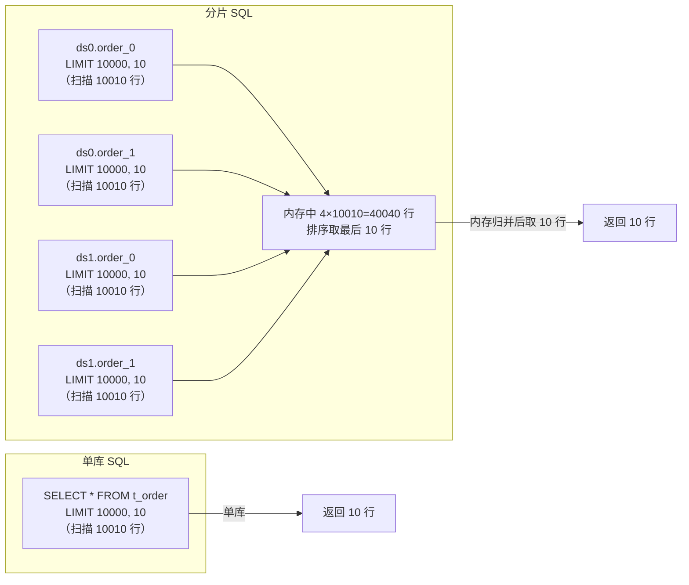
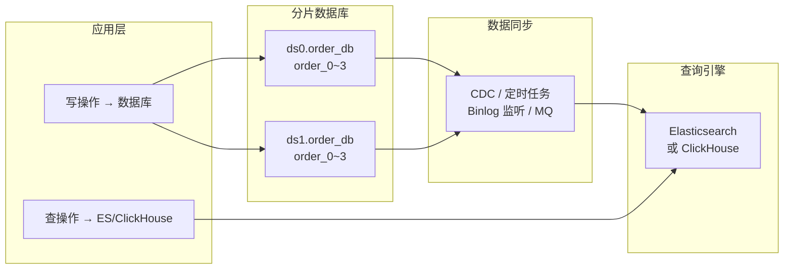
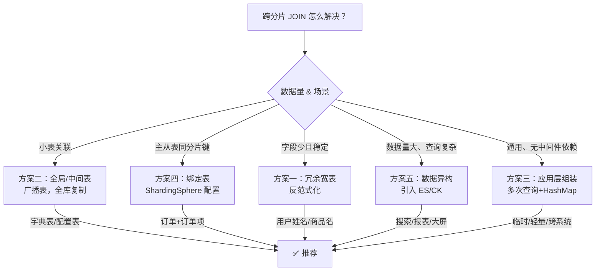
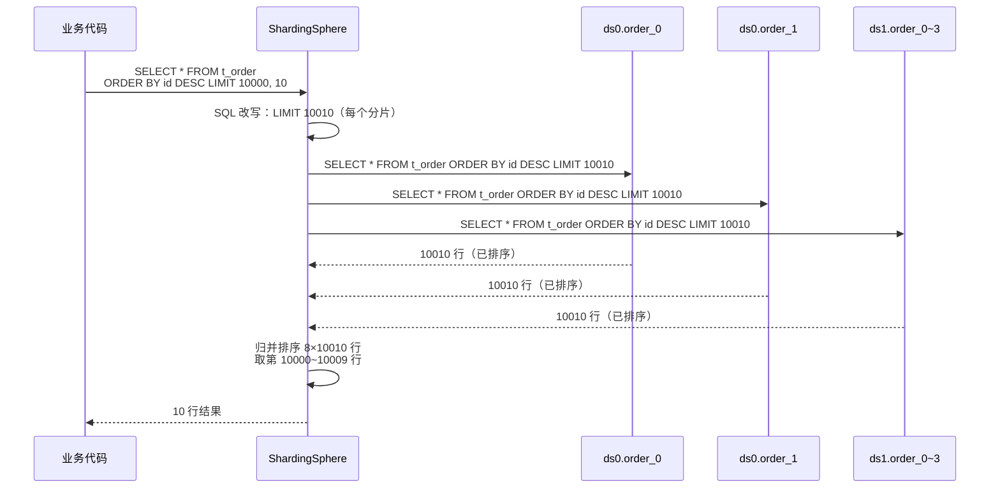
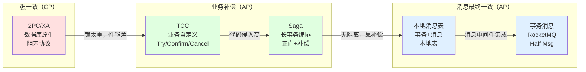
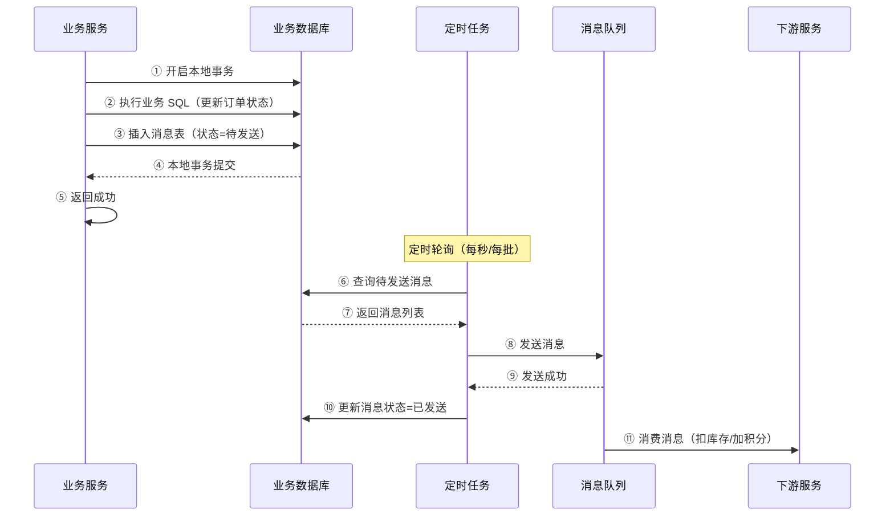
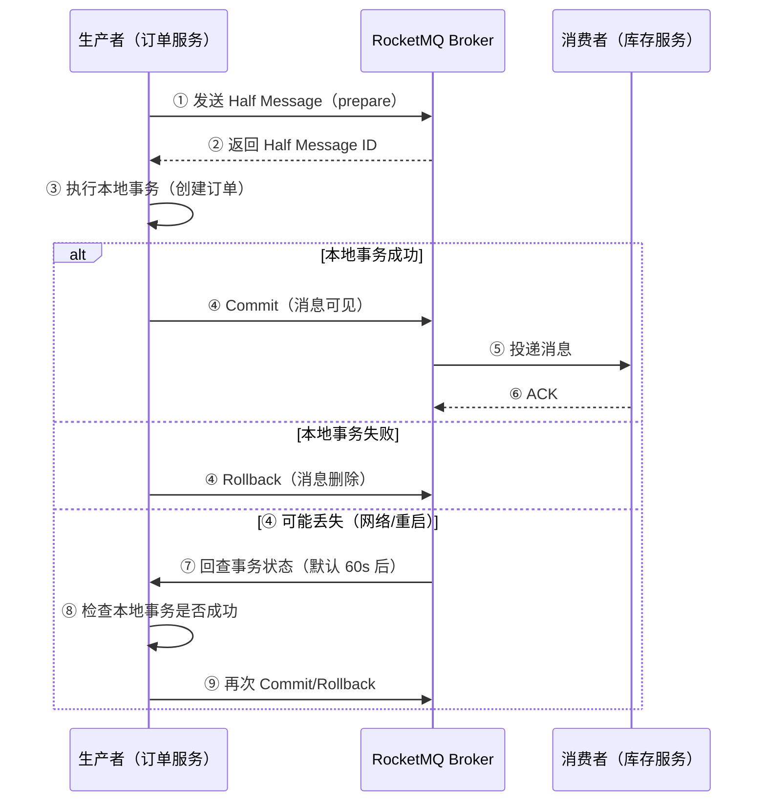
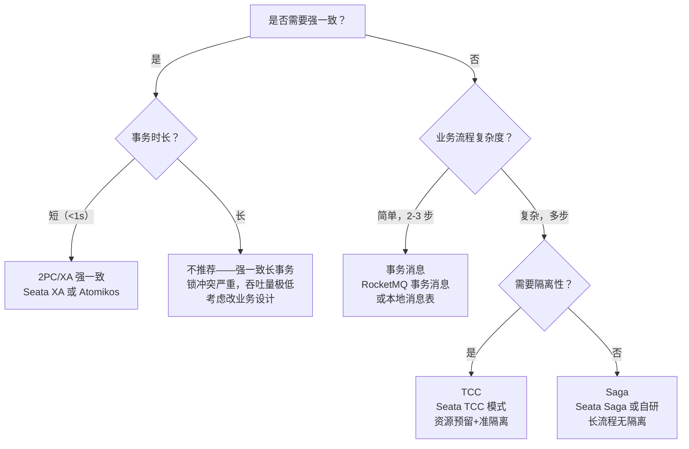

# 分布式事务与跨分片查询详解

> 适用版本：ShardingSphere 5.5.x、Seata 2.6、MySQL 8.0.46、JDK 17+
> 主题范围：分库分表后两大核心难题——跨分片查询（Join/分页/聚合/排序）与分布式事务（2PC→TCC→Saga→消息最终一致），各方案原理、代码与配置、对比与选型
> 本机实测说明：MySQL 8.0.46 via Docker，有 `order_db` 分片环境但限于分片表未实际部署，SQL 示例基于逻辑推导可复现

## 📋 总纲

- ① 跨分片查询的核心痛点——为什么跨片 Join 不可用、跨片分页/聚合/排序的复杂度来源
- ② 跨分片 JOIN 五大方案逐一展开——冗余宽表、全局/中间表、应用层多次查询+内存组装、广播表+绑定表、数据异构+离线同步，每个配原理+代码/配置+优缺点+适用场景
- ③ 跨分片分页 5 方案——全局查询、并行 merge（ShardingSphere 默认）、游标 keyset 分页（推荐，多列游标 OR 展开）、二次查询法、禁止深翻页，对比表+示例 SQL
- ④ 分布式事务演进——2PC/XA 强一致 → TCC → Saga → 本地消息表 → 事务消息（最终一致），逐方案原理+对比+优缺+适用，Mermaid 演进图
- ⑤ 强一致 vs 最终一致选型总表——场景化决策指南
- ⑥ 踩坑清单——跨分片查询与分布式事务常见生产问题

---

## 受众声明

- **面向**：Java 后端开发者（3 年以上经验）及架构师。
- **假设已掌握**：[00-分库分表总览与选型](00-分库分表总览与选型.md) 中的分库分表本质与演进阶段、[01-垂直与水平拆分详解](01-垂直与水平拆分详解.md) 中的四象限拆分概念、[02-分片键与分片算法详解](02-分片键与分片算法详解.md) 中的分片路由机制、[04-ShardingSphere-JDBC集成与配置详解](04-ShardingSphere-JDBC集成与配置详解.md) 中的逻辑表/物理表/绑定表/广播表概念与结果归并引擎。
- **本篇需讲清**：跨分片查询的 5 种 Join 方案 + 4 种分页方案 + 分布式事务各方案演进，每个方案配原理、代码/配置、对比表、适用场景。不重复 Seata 框架实现细节（已有专项笔记），不做 CAP/BASE 理论全展开（已有专项笔记）。

## 学习目标

读完本篇，你能：

1. 说出分库分表后跨分片 Join 不可用的根本原因（数据分散、路由限制）
2. 列出跨分片 Join 的 5 种解决方案，并说出每种方案的核心原理、优缺点和适用场景
3. 配置 ShardingSphere 的绑定表（binding-tables）和广播表（broadcast-tables），并用配置避免 Join 笛卡尔积路由
4. 写出应用层内存组装 Join 的 Java 代码示例（两次查询 + HashMap 合并）
5. 说出跨分片分页的 5 种方案（含游标 keyset 多列游标 OR 展开、二次查询法），解释为什么深翻页会导致 OOM，并给出游标分页的 SQL 示例
6. 画出分布式事务方案的演进路线图（2PC → TCC → Saga → 本地消息表 → 事务消息）
7. 对比强一致方案（2PC/XA）与最终一致方案（TCC/Saga/消息）的选型依据，并给出不同场景的推荐
8. 理解 Seata AT 模式在分库分表场景下的作用（跨库事务协调），并知道如何交叉引用 [Seata分布式事务框架详解](../../../中间件/分布式协调/分布式事务/Seata分布式事务框架详解.md)

## 前置知识

- [00-分库分表总览与选型](00-分库分表总览与选型.md) —— 总纲、B+树高度公式、演进阶段、选型决策
- [01-垂直与水平拆分详解](01-垂直与水平拆分详解.md) —— 四象限拆分概念，拆分后代价
- [02-分片键与分片算法详解](02-分片键与分片算法详解.md) —— 分片路由机制、分片键选择
- [04-ShardingSphere-JDBC集成与配置详解](04-ShardingSphere-JDBC集成与配置详解.md) —— 逻辑表/物理表、绑定表/广播表、结果归并引擎（排序归并/分页归并）、Standard 六步流程（解析→绑定→路由→改写→执行→归并）与 SQL Federation
- [05-分布式ID与幂等设计详解](../../../../分布式/核心原理/05-分布式ID与幂等设计详解.md) —— 分布式 ID 生成（幂等设计的 ID 基础）
- [Seata分布式事务框架详解](../../../中间件/分布式协调/分布式事务/Seata分布式事务框架详解.md) —— Seata 框架四种模式实现细节（本文只做方案原理层展开，不重复框架实现）

---

## 1. 跨分片查询的核心痛点

### 1.1 为什么跨分片 Join 不可用

分库分表之前，所有数据在同一个数据库实例中，JOIN 操作依赖数据库引擎的**本地索引 + 内存排序**，可以在同一事务内完成数据关联。

分库分表之后，数据被分散到多个物理库/物理表中，产生以下问题：

**① 数据不在同一实例，无法直接跨库 Join**

MySQL 的 JOIN 操作是**数据库引擎内部行为**，它只能访问当前连接指向的数据库实例。如果 `t_order` 在 `ds0`，`t_user` 在 `ds1`，一条 SQL 无法同时操作两个实例——数据库引擎没有跨实例的 JOIN 能力。

```sql
-- ❌ 跨库 Join：t_order 在 ds0，t_user 在 ds1，MySQL 无法执行
SELECT * FROM ds0.t_order o JOIN ds1.t_user u ON o.user_id = u.id;
```

**② 即使在同一实例，跨分片 Join 也会产生笛卡尔积路由**

假设 `t_order` 和 `t_order_item` 各自分片（各 4 表），但未配置绑定表。ShardingSphere 在执行 JOIN 时，会对所有分片组合进行路由：

```
t_order_0 → t_order_item_0 (同分片 ✅)
t_order_0 → t_order_item_1 (跨分片 ❌ — 数据不可能在同一行)
t_order_0 → t_order_item_2 (跨分片 ❌)
t_order_0 → t_order_item_3 (跨分片 ❌)
t_order_1 → t_order_item_0 (跨分片 ❌)
...
```

总共 4 × 4 = 16 次子查询，但实际只有 4 次是同分片有效查询，12 次是无效的。数据量越大，笛卡尔积倍数越高——**N 个分片 × M 个分片 = N×M 次查询**。

**③ 分片键不在 Join 条件中，无法定位分片**

```sql
-- user_id 是分片键，但 Join 条件用的是 order_id，无法路由
SELECT * FROM t_order o JOIN t_user u ON o.user_id = u.id
WHERE u.name = '张三';
```

如果 `t_user` 按 `id` 分片，但 `name` 上没有分片键，这会导致全路由——所有分片都执行一遍查询。全路由的代价是：**N 个分片 × 全表扫描**。

### 1.2 跨分片分页/排序/聚合的复杂度来源

**分页（OFFSET/LIMIT）**：在单库中，`LIMIT 10000, 10` 只需要扫描 10010 行。在分片环境中，每个分片都需要取 `LIMIT 10000, 10`，然后在内存中排序后取最终页。如果有 8 个分片，内存中需要处理 8 × 10010 = 80080 行——**页越深，内存消耗线性增长 × 分片数**。

**排序（ORDER BY）**：单库中排序是数据库引擎的内部操作（归并排序、索引有序扫描）。分片后，每个分片排序后取 TOP N，然后在内存中做**归并排序**——如果排序字段没有索引，每个分片都要做全表扫描文件排序（filesort），代价放大。

**聚合（COUNT/SUM/AVG/MIN/MAX）**：单库中聚合是数据库引擎内部计算。分片后，聚合函数需要**两阶段计算**：
- `COUNT(*)` → 各分片 COUNT → 求和
- `SUM(amount)` → 各分片 SUM → 求和
- `AVG(amount)` → 各分片 SUM(amount) + COUNT(amount) → 重算
- `MAX(amount)` → 各分片 MAX → 取最大值
- `MIN(amount)` → 各分片 MIN → 取最小值

聚合归并本身不复杂，但若聚合 + 分组同时出现，内存消耗会随分组数增长。



---

## 2. 跨分片 JOIN 五大方案

### 2.1 方案一：冗余宽表（反范式设计）

**原理**：将 JOIN 查询中需要的关联字段冗余到主表中，避免跨表 JOIN。这是反范式化（Denormalization）思路——**用存储空间换查询性能**。

**生活类比**：你有一个"订单表"和一个"用户表"。每次查订单都要 JOIN 用户表拿用户姓名。现在你把用户姓名直接存到订单表里——查订单时一张表就够了，不需要 Join。

**示例**：

```sql
-- ❌ 分库分表前：需要 JOIN
SELECT o.order_id, o.amount, u.name, u.phone
FROM t_order o JOIN t_user u ON o.user_id = u.id
WHERE o.order_id = 1001;

-- ✅ 反范式冗余后：单表查询，无需 JOIN
-- 在 t_order 表中冗余 user_name, user_phone 字段
SELECT order_id, amount, user_name, user_phone
FROM t_order
WHERE order_id = 1001;
```

**t_order 表结构（冗余后）**：

```sql
CREATE TABLE t_order (
    order_id     BIGINT PRIMARY KEY,
    user_id      BIGINT    NOT NULL COMMENT '分片键',
    amount       DECIMAL(10,2) NOT NULL,
    status       TINYINT   NOT NULL DEFAULT 0,
    -- 冗余字段（从用户表冗余过来）
    user_name    VARCHAR(50)  COMMENT '冗余：用户姓名',
    user_phone   VARCHAR(20)  COMMENT '冗余：用户手机号',
    -- 时间字段
    created_at   DATETIME  NOT NULL DEFAULT CURRENT_TIMESTAMP,
    INDEX idx_user_id (user_id)
) ENGINE=InnoDB DEFAULT CHARSET=utf8mb4;
```

**冗余字段一致性维护**：

| 维护方式 | 原理 | 一致性 | 复杂度 |
|:--------:|:----:|:------:|:------:|
| 同步写入 | 写订单时同时写冗余字段，业务层保证 | 强一致 | 低（同事务） |
| 异步更新 | 用户信息变更后，发 MQ 消息更新订单表冗余字段 | 最终一致 | 中 |
| 定时批量同步 | 定时任务扫描不一致数据批量更新 | 最终一致，有延迟 | 中 |
| 缓存回填 | 查询时缓存未命中则从用户表查，回填到缓存 | 最终一致 | 高 |

**优点**：
- 查询性能最高（单表查询，无 Join 开销）
- 中间件无关（无论是否用 ShardingSphere，冗余字段都有效）
- 分片键不变，路由不受影响

**缺点**：
- 存储冗余（冗余字段占用额外空间，宽表行宽增加）
- 一致性问题（用户姓名变更后，历史订单的冗余字段不会自动更新）
- 冗余字段越多，表越宽，B+树叶子节点单页存储行数减少，全表扫描性能下降
- 冗余字段变更需要同时更新多张表，增加业务复杂度

**适用场景**：
- 高频查询、低频更新的关联字段（如用户姓名、商品名称——这些字段几乎不变）
- 查询性能要求极高，不能接受 Join 延迟
- 冗余字段数量少（≤3-5 个），且字段值稳定

**不适用场景**：
- 关联字段频繁变更（如用户手机号、地址）
- 需要冗余大量字段（超过 10 个），导致表过宽
- 关联表数据量巨大但关联字段选择性低

---

### 2.2 方案二：全局/中间表（字典表/粒度关系表）

**原理**：将小表（字典表、配置表、类型表、区域表）在所有分片库中**完整复制一份**，每个分片库都有一份完整数据。这样 JOIN 时，因为字典表在每个分片库都存在，可以在本地完成关联。

**生活类比**：每个办公室都贴一份"部门编码对照表"——你在哪个办公室查，都能查到"部门编码 01 = 技术部"，不需要跨办公室去问。

**DDL 示例——全局字典表**：

```sql
-- 在所有分片库中创建，数据完全一致
CREATE TABLE t_dict (
    dict_id   INT PRIMARY KEY,
    dict_type VARCHAR(32)  NOT NULL COMMENT '字典类型',
    dict_code VARCHAR(32)  NOT NULL COMMENT '字典编码',
    dict_name VARCHAR(128) NOT NULL COMMENT '字典值',
    sort_order INT DEFAULT 0,
    UNIQUE KEY uk_type_code (dict_type, dict_code)
) ENGINE=InnoDB DEFAULT CHARSET=utf8mb4 COMMENT='全局字典表';

-- 插入数据（每个分片库都执行一次）
INSERT INTO t_dict VALUES
(1, 'order_status', '0', '待支付', 1),
(2, 'order_status', '1', '已支付', 2),
(3, 'order_status', '2', '已发货', 3),
(4, 'order_status', '3', '已完成', 4),
(5, 'order_status', '4', '已取消', 5);

-- 查询时，每个分片可以本地 JOIN 字典表
SELECT o.order_id, o.amount, d.dict_name AS status_name
FROM t_order o
LEFT JOIN t_dict d ON d.dict_type = 'order_status' AND o.status = d.dict_code
WHERE o.user_id = 1001;
```

**ShardingSphere 广播表配置**：中间表对应 ShardingSphere 的广播表（broadcast-tables）——自动将 DML 广播到所有分片库。

```yaml
rules:
  - !SHARDING
    broadcastTables:
      - t_dict         # 字典表（全局）
      - t_region       # 区域表（全局）
      - t_config       # 配置表（全局）
    tables:
      t_order:
        actualDataNodes: ds$->{0..1}.order_$->{0..3}
        # ... 分片策略
```

**粒度关系表（中间表特例）**：对于多对多关系，如果关联的双方都是大表且各自分片，可以用一张"关系中间表"来收敛查询。

```sql
-- 用户-角色关系表（按 user_id 分片，和用户表同分片键）
CREATE TABLE t_user_role (
    id        BIGINT PRIMARY KEY,
    user_id   BIGINT NOT NULL COMMENT '分片键（与 t_user 一致）',
    role_id   INT    NOT NULL COMMENT '角色 ID',
    UNIQUE KEY uk_user_role (user_id, role_id)
) ENGINE=InnoDB DEFAULT CHARSET=utf8mb4 COMMENT='用户角色关系中间表';
```

**优点**：
- 小表全量复制，每个分片都能本地 Join，性能好
- 广播表由 ShardingSphere 自动维护写一致性（写操作广播到所有分片）
- 字典表数据量通常很小（几百到几千行），存储成本可忽略

**缺点**：
- 只适合小表（数据量 < 万级），大表不适合全量复制
- 广播表写操作的延迟 = 最慢的分片写入时间（如果某个分片写入慢，整体延迟被拖长）
- 写操作频繁的表不适合做广播表（每次写都要打所有分片）
- 数据一致性要求高时，广播表部分失败需要处理（分布式事务问题）

**适用场景**：
- 数据字典（状态码、类型枚举、分类）
- 配置表（系统参数、全局开关）
- 区域/省份表（相对稳定，数据量小）
- 权限表（角色、权限点）

---

### 2.3 方案三：应用层多次查询 + 内存组装

**原理**：不在 SQL 层面执行 JOIN，而是拆成**多次单表查询**，在应用层（Java 内存中）用 HashMap 等数据结构完成数据组装。这是最通用的方案——不依赖任何中间件，适用于任何分片环境。

**示例场景**：查询订单列表，同时显示每个订单的用户姓名。

**代码实现**：

```java
@Service
public class OrderService {
    @Autowired
    private OrderMapper orderMapper;
    @Autowired
    private UserMapper userMapper;

    /**
     * 跨分片查询订单列表 + 用户信息（应用层内存组装）
     * 不依赖任何 JOIN 中间件，纯应用层解决
     */
    public List<OrderVO> getOrderListWithUser(Long userId, int page, int size) {
        // 第一步：查询订单列表（单表查询，分片键命中，精准路由）
        // 因为 userId 是分片键，这条查询只路由到 1 个分片
        List<Order> orders = orderMapper.selectByUserId(userId, page, size);
        if (orders.isEmpty()) {
            return Collections.emptyList();
        }

        // 第二步：提取所有关联的用户 ID（去重）
        Set<Long> userIds = orders.stream()
                .map(Order::getUserId)
                .collect(Collectors.toSet());

        // 第三步：批量查询用户信息（每个用户可能在不同分片）
        // 如果 user 表按 user_id 分片，这里 IN 查询会路由到多个分片
        // 但每个分片内的查询是单表精准查询
        List<User> users = userMapper.selectBatchByIds(userIds);
        // 转为 Map<Long, User> 方便后续 O(1) 查找
        Map<Long, User> userMap = users.stream()
                .collect(Collectors.toMap(User::getId, Function.identity()));

        // 第四步：内存组装，用 HashMap 做关联
        List<OrderVO> result = new ArrayList<>(orders.size());
        for (Order order : orders) {
            User user = userMap.get(order.getUserId());
            OrderVO vo = new OrderVO();
            BeanUtils.copyProperties(order, vo);
            if (user != null) {
                vo.setUserName(user.getName());
                vo.setUserPhone(user.getPhone());
            }
            result.add(vo);
        }
        return result;
    }
}
```

**Mapper 接口**：

```java
@Mapper
public interface OrderMapper {
    // 分片键命中，精准路由到单个分片
    @Select("SELECT * FROM t_order WHERE user_id = #{userId} " +
            "ORDER BY created_at DESC LIMIT #{limit} OFFSET #{offset}")
    List<Order> selectByUserId(@Param("userId") Long userId,
                               @Param("offset") int offset,
                               @Param("limit") int limit);
}

@Mapper
public interface UserMapper {
    // 按 user_id 批量查询，路由到多个分片
    // 每个分片内是精准查询
    @Select("<script>" +
            "SELECT * FROM t_user WHERE id IN " +
            "<foreach item='id' collection='ids' open='(' separator=',' close=')'>" +
            "#{id}</foreach>" +
            "</script>")
    List<User> selectBatchByIds(@Param("ids") Collection<Long> ids);
}
```

**性能分析**：

| 步骤 | 操作 | 网络开销 | 内存开销 | 备注 |
|:----:|:----:|:--------:|:--------:|:----:|
| ① 查订单 | 1 次 SQL（精准路由） | 1 次网络往返 | 结果集大小 | 分片键命中，仅 1 分片 |
| ② 查用户 | 1 次 SQL（多分片路由） | 1 次网络往返 | 结果集大小 | 可能路由到 N 个分片 |
| ③ 内存组装 | HashMap.get() 循环 | 0（内存操作） | O(订单数) | 时间复杂度 O(N) |

**总耗时 ≈ 2 次网络往返 + 2 次单表查询 + 一次内存循环**，通常比一条跨分片 JOIN 快得多。

**优点**：
- 最通用，不依赖任何中间件（ShardingSphere、Vitess 等都可以用）
- 容易优化——每步查询可以独立加缓存、加索引
- 查询简单，每步 SQL 都是单表操作，分片键命中率高
- 适合复杂关联场景（多表、多维度、条件复杂）

**缺点**：
- 代码量增加（每个关联场景都需要写组装逻辑）
- N + 1 问题——如果循环中逐条查询，性能急剧下降（上述代码用批量查询避免）
- 无法利用数据库的 JOIN 优化（索引合并、连接顺序优化等）
- 大数据量下内存压力大（如果关联数据量很大，HashMap 可能 OOM）
- 分页后组装问题——如果第一步查 10 条订单，但第二步查到的用户信息不足 10 条，不会影响结果集完整性（因为 LEFT JOIN 语义由代码保证）

**适用场景**：
- 主表数据量不大（每次查询结果集 < 1000 行）
- 关联表数量少（1-2 张表）
- 中间件不支持复杂 JOIN 的场景
- 需要对查询结果做额外业务逻辑处理（如权限过滤、数据脱敏）

---

### 2.4 方案四：广播表 + 绑定表（ShardingSphere 专有）

**原理**：这是 ShardingSphere 提供的两个专有机制，配合使用可以解决大部分跨分片 JOIN 问题：

- **广播表（Broadcast Table）**：小表在每个分片库完整复制一份，查询时本地 Join 无跨分片开销。
- **绑定表（Binding Table）**：具有相同分片键和分片算法的多张表，声明为绑定表后，JOIN 查询只路由到同分片组合，消除笛卡尔积路由。

两种机制已在 [04-ShardingSphere-JDBC集成与配置详解](04-ShardingSphere-JDBC集成与配置详解.md) 中详细展开，本篇重点放在**两者如何配合解决跨分片 JOIN**。

#### 2.4.1 绑定表配置示例

```yaml
rules:
  - !SHARDING
    bindingTables:
      - t_order, t_order_item          # 绑定表组 1
      - t_user, t_user_address         # 绑定表组 2
    tables:
      t_order:
        actualDataNodes: ds$->{0..1}.order_$->{0..3}
        databaseStrategy:
          standard:
            shardingColumn: user_id
            shardingAlgorithmName: db_hash_mod
        tableStrategy:
          standard:
            shardingColumn: order_id
            shardingAlgorithmName: tbl_mod
      t_order_item:
        actualDataNodes: ds$->{0..1}.order_item_$->{0..3}
        databaseStrategy:
          standard:
            shardingColumn: user_id        # 分片键与 t_order 一致
            shardingAlgorithmName: db_hash_mod
        tableStrategy:
          standard:
            shardingColumn: order_id       # 分片键与 t_order 一致
            shardingAlgorithmName: tbl_mod
```

**绑定表 Join 优化原理**：

```sql
-- 未配置绑定表时的笛卡尔积路由（4×4=16 次查询）
SELECT o.order_id, oi.item_name, oi.quantity
FROM t_order o JOIN t_order_item oi ON o.order_id = oi.order_id
WHERE o.user_id = 1001;
-- 路由到：ds0.order_0→ds0.order_item_0, ds0.order_0→ds0.order_item_1, ...
-- 共 16 个子查询，其中 12 个是无效的

-- 配置绑定表后，只路由到同分片组合（4 次查询）
-- ds0.order_0 → ds0.order_item_0
-- ds0.order_1 → ds0.order_item_1
-- ds1.order_0 → ds1.order_item_0
-- ds1.order_1 → ds1.order_item_1
-- 共 4 个子查询，全部有效
```

**绑定表必要条件**：
1. 多张表必须使用**相同的分片键**（如 `user_id`）
2. 必须使用**相同的分片算法**（如 `db_hash_mod`）
3. 分片键在 JOIN 条件中对应（`o.order_id = oi.order_id` 的 `order_id` 是表分片键，需一致）

#### 2.4.2 广播表 + 绑定表组合查询

```sql
-- 场景：查订单详情，关联订单项和字典状态
-- 广播表 t_dict 在每个分片库都有完整数据
-- 绑定表 t_order + t_order_item 确保同分片关联
SELECT o.order_id, o.amount,
       oi.item_name, oi.quantity,
       d.dict_name AS status_name
FROM t_order o
JOIN t_order_item oi ON o.order_id = oi.order_id
LEFT JOIN t_dict d ON d.dict_type = 'order_status' AND o.status = d.dict_code
WHERE o.user_id = 1001;
-- 路由：每个分片执行一次本地查询
-- 不产生跨分片网络传输
```

**优点**：
- 零代码侵入——纯配置层解决，业务代码不需要改
- 性能好——绑定表消除笛卡尔积，广播表实现本地 Join
- 路由精确——ShardingSphere 自动完成分片路由

**缺点**：
- 绑定表要求严格（分片键+算法必须一致），不符合的表无法加入绑定表组
- 广播表只适合小表，大表全量复制成本高
- 绑定表只解决了 JOIN 条件中包含分片键的场景——如果 JOIN 条件不是分片键，绑定表无效
- 强绑定 ShardingSphere 生态，Vitess/Citus 等其他方案不适用

**适用场景**：
- 主表 + 从表（如订单 + 订单项）——天然同分片键，绑定表最佳匹配
- 字典表、配置表——广播表完美匹配
- 有 ShardingSphere 约束的关联查询

---

### 2.5 方案五：数据异构 + 离线/在线同步

**原理**：将跨分片查询需要的数据，通过**异构同步**的方式复制到专门的查询引擎中（如 Elasticsearch、ClickHouse、Doris、TiDB），查询请求直接走查询引擎，不再依赖于分片数据库的 JOIN 能力。

**生活类比**：你是一个连锁超市的老板，每个门店各自记账（分片存储）。你想知道"上周所有门店卖了多少箱可乐"——你不需要去每个门店翻账本，而是让总部每天把各门店的销售数据汇总到一张总表（数据异构），直接在总表上查。

**架构示意**：



**同步方式**：

| 方式 | 技术栈 | 延迟 | 复杂度 | 典型选型 |
|:----:|:------:|:----:|:------:|:--------:|
| CDC 实时同步 | Canal/Debezium → Kafka → ES | 秒级 | 高 | 订单查询、日志搜索 |
| 定时批量同步 | Quartz → JDBC → ES Bulk API | 分钟级 | 中 | 报表、BI 分析 |
| 双写同步 | 业务代码写 DB 同时写 ES | 实时 | 中（需处理写失败） | 商品搜索 |
| Flink 实时计算 | Flink CDC → 多流 Join → 写入 ES | 秒级 | 高 | 实时大屏、复杂聚合 |

**示例——ES 中存储冗余关联数据**：

```json
// ES 索引：order_index（冗余了用户信息，不需要 Join）
{
  "mappings": {
    "properties": {
      "order_id":    { "type": "long" },
      "amount":      { "type": "double" },
      "status":      { "type": "keyword" },
      "user_id":     { "type": "long" },
      "user_name":   { "type": "keyword" },   // 冗余：用户姓名
      "user_phone":  { "type": "keyword" },   // 冗余：用户手机号
      "item_names":  { "type": "text", "analyzer": "ik_smart" }, // 冗余：商品名称列表
      "created_at":  { "type": "date" }
    }
  }
}
```

**优点**：
- 彻底解耦——查询和写入走不同链路，写入不拖慢查询
- 查询能力强——ES 全文搜索、聚合分析、地理位置查询等能力远超数据库 JOIN
- 分片数无关——查询引擎不依赖数据库的分片结构
- 适合复杂查询（多维度过滤、全文搜索、聚合分析）

**缺点**：
- 引入额外组件（ES/CK/Flink），运维成本高
- 数据同步有延迟——CDC 秒级，定时任务分钟级，不是强一致
- 数据一致性需要额外保障（同步失败、重复、乱序等）
- 架构复杂度高——需要处理同步链路的高可用、容错、监控

**适用场景**：
- 搜索类场景（商品搜索、订单搜索、日志搜索）
- BI 报表、大屏展示（聚合分析、多维度查询）
- 复杂跨分片查询（多表关联 + 条件过滤 + 排序分页）
- 写少读多、对一致性要求不高的场景

---

### 2.6 五大方案对比总表



| 方案 | 性能 | 一致性 | 代码侵入 | 运维成本 | 适用场景 | 限制 |
|:----:|:----:|:------:|:--------:|:--------:|:--------:|:----:|
| ① 冗余宽表 | ⭐⭐⭐⭐⭐ | ⚠️ 最终一致 | 中 | 低 | 关联字段少且稳定 | 冗余字段不可频繁变更 |
| ② 全局/中间表 | ⭐⭐⭐⭐⭐ | ✅ 强一致（广播同步） | 低 | 低 | 小表字典 | 只适合小表 < 万级 |
| ③ 应用层组装 | ⭐⭐⭐⭐ | ✅ 强一致（同事务） | 高 | 无 | 通用场景 | 代码量多，大数据量大压力 |
| ④ 广播表+绑定表 | ⭐⭐⭐⭐⭐ | ✅ 强一致 | 低（配置） | 低 | 同分片键主从表 | 依赖 ShardingSphere，分片键必须一致 |
| ⑤ 数据异构 | ⭐⭐⭐⭐⭐ | ⚠️ 最终一致 | 中 | 高 | 搜索/报表/复杂查询 | 引入 ES/CK 等组件 |

---

## 3. 跨分片分页 5 方案

### 3.1 方案一：全局查询（MongoDB 式，大 limit 不可行）

**原理**：将所有分片的数据全部拉到应用层，在内存中统一排序后取指定页。这是最"简单粗暴"的方式——但仅适用于分片数少、数据量小的场景。

**执行过程**：

```sql
-- 用户期望的 SQL
SELECT * FROM t_order ORDER BY order_id DESC LIMIT 10000, 10;

-- 实际执行：每个分片执行全量查询
-- ds0.order_0: SELECT * FROM t_order ORDER BY order_id DESC
-- ds0.order_1: SELECT * FROM t_order ORDER BY order_id DESC
-- ds1.order_0: SELECT * FROM t_order ORDER BY order_id DESC
-- ds1.order_1: SELECT * FROM t_order ORDER BY order_id DESC
-- 应用层：合并 4 个分片的全量数据，在内存中排序后取第 10000~10009 行
```

**内存消耗**：`O(全表数据量)`——如果有 4 个分片，每个分片 100 万行，内存中需要加载 400 万行。

**优点**：实现简单，不需要中间件支持。

**缺点**：
- 数据量稍大即 OOM——全表数据量 × 分片数，不可控
- 网络传输开销巨大——每个分片全量数据都要传输到应用层
- 不可行——绝大多数场景不适用，仅用于分片数 ≤ 2 且单表 < 1000 行的场景

**适用场景**：仅限数据量极小（总行数 < 万级）且无其他更好方案时。

---

### 3.2 方案二：并行 Merge（ShardingSphere 默认——Limit 子查询改写）

**原理**：ShardingSphere 的默认分页策略——将 `LIMIT M, N` 改写成每个分片的 `LIMIT M+N`，各分片返回 `M+N` 条数据后在内存中做归并排序，取最终页。这是**最常用的分页方案**，但深翻页时内存消耗大。

**ShardingSphere 的 SQL 改写**：

```sql
-- 原始 SQL
SELECT * FROM t_order ORDER BY order_id DESC LIMIT 10000, 10;

-- ShardingSphere 改写后（每个分片执行）
-- ds0.order_0: SELECT * FROM t_order ORDER BY order_id DESC LIMIT 10010;
-- ds0.order_1: SELECT * FROM t_order ORDER BY order_id DESC LIMIT 10010;
-- ds1.order_0: SELECT * FROM t_order ORDER BY order_id DESC LIMIT 10010;
-- ds1.order_1: SELECT * FROM t_order ORDER BY order_id DESC LIMIT 10010;
```

**内存消耗模型**：

```
总内存行数 = 分片数 × (offset + limit)
= 4 × (10000 + 10) = 40040 行
```

**SQL 示例与 EXPLAIN 对比**：

```sql
-- 假设 order_db 分片 2 库 × 4 表 = 8 个分片
-- 查询第 1001 页（每页 10 条）
SELECT * FROM t_order ORDER BY created_at DESC LIMIT 10000, 10;

-- 实际 ShardingSphere 改写后，每个分片执行的 SQL
-- SELECT * FROM t_order ORDER BY created_at DESC LIMIT 10010;
-- 8 个分片 → 8 × 10010 = 80080 行在内存中排序
```

**ShardingSphere 归并引擎对分页的特殊处理**：



**优点**：
- ShardingSphere 默认实现，零配置
- 对于浅分页（前几页），性能可接受
- 分片数少时（2-4 分片），内存消耗可控

**缺点**：
- **深翻页 OOM 风险**——offset 越大，内存消耗线性增长
- 不适合大数据量分页（offset > 10000 时需谨慎）
- 网络传输量大——每个分片都要传输 `offset+limit` 行

**适用场景**：
- 浅分页（前 100 页以内）
- 分片数少（≤ 8）
- 业务允许翻页深度有限

---

### 3.3 方案三：游标 Keyset 分页（推荐）

**原理**：不依赖 `OFFSET`，而是用**排序字段作为游标**，每次查询时带上最后一条记录的位置（last_value），通过 `WHERE 排序字段 > ? LIMIT N` 的方式获取下一页。这是**深翻页的唯一可靠方案**。

**游标分页 vs 传统分页**：

| 特性 | 传统 OFFSET 分页 | 游标（Keyset）分页 |
|:----:|:----------------:|:-----------------:|
| 翻页方式 | `LIMIT M, N` | `WHERE sort_col > ? LIMIT N` |
| 深翻页性能 | 指数级下降 | 恒定不变 |
| 排序字段要求 | 无 | 必须有唯一有序字段 |
| 跳页（跳到第 100 页） | 支持 | 不支持 |
| 数据变化导致重复 | 可能（插入新行） | 不会（游标定位） |
| 分片环境兼容性 | 差（内存归并压力大） | 好（各分片独立游标） |

#### 3.3.1 游标分页的 SQL 示例

```sql
-- 第一页：取前 10 条
SELECT order_id, amount, status, created_at
FROM t_order
WHERE user_id = 1001
ORDER BY created_at DESC, order_id DESC
LIMIT 10;

-- 第二页：用 last_created_at 和 last_order_id 作为游标
SELECT order_id, amount, status, created_at
FROM t_order
WHERE user_id = 1001
  AND (created_at < '2026-08-15 20:00:00'
       OR (created_at = '2026-08-15 20:00:00' AND order_id < 100500))
ORDER BY created_at DESC, order_id DESC
LIMIT 10;

-- 第三页：继续用上一页最后一条的游标
SELECT order_id, amount, status, created_at
FROM t_order
WHERE user_id = 1001
  AND (created_at < '2026-08-15 19:58:00'
       OR (created_at = '2026-08-15 19:58:00' AND order_id < 100490))
ORDER BY created_at DESC, order_id DESC
LIMIT 10;
```

**为什么需要 `(created_at, order_id)` 复合游标**：如果只用 `created_at`，当同一时刻有多条记录时，会漏掉或重复数据。加上 `order_id` 作为第二排序字段（唯一性保证），确保游标定位准确。

#### 3.3.2 分片环境下的游标分页策略

在分片环境中，游标分页有两种策略：

**策略 A：逐分片游标 + 应用层归并（推荐）**

每分片独立维护游标，各分片取 `LIMIT N`，应用层做归并排序后取前 N 条。

```java
/**
 * 跨分片游标分页
 * 每个分片按游标取 N 条，应用层归并排序后取前 N 条
 */
public List<Order> pageByCursor(Long userId, String lastCreatedAt,
                                 Long lastOrderId, int pageSize) {
    // 1. 每个分片独立查询 LIMIT pageSize
    List<Order> allShardResults = new ArrayList<>();
    for (String shard : shardList) {
        String sql = "SELECT * FROM t_order WHERE user_id = ? " +
                     "AND (created_at < ? OR (created_at = ? AND order_id < ?)) " +
                     "ORDER BY created_at DESC, order_id DESC LIMIT ?";
        // 执行分片查询
        List<Order> shardResult = jdbcTemplate.query(sql, userId,
                lastCreatedAt, lastCreatedAt, lastOrderId, pageSize);
        allShardResults.addAll(shardResult);
    }

    // 2. 应用层归并排序
    allShardResults.sort((a, b) -> {
        int cmp = b.getCreatedAt().compareTo(a.getCreatedAt());
        if (cmp == 0) {
            return Long.compare(b.getOrderId(), a.getOrderId());
        }
        return cmp;
    });

    // 3. 取前 pageSize 条
    return allShardResults.subList(0, Math.min(pageSize, allShardResults.size()));
}
```

**策略 B：全局统一游标 + 一次查询（要求排序字段全局有序）**

如果排序字段是全局唯一的（如分布式 ID 雪花算法生成的 `order_id`），可以直接用全局游标查询：

```sql
-- 全局游标，一次查询，ShardingSphere 自动路由
SELECT * FROM t_order
WHERE order_id < ?    -- 游标：上一页最大 order_id
ORDER BY order_id DESC
LIMIT 10;
```

ShardingSphere 会将此 SQL 改写为每个分片执行 `WHERE order_id < ? ORDER BY order_id DESC LIMIT 10`，然后归并排序取最终 10 条。

**优点**：
- 深翻页性能恒定——不管翻到第几页，每页查询量固定（`分片数 × limit`）
- 内存消耗可控——每分片只取 `limit` 条，不取 `offset+limit`
- 没有 OOM 风险
- 数据变化不会导致翻页重复或遗漏（游标定位）

**缺点**：
- 不支持跳页——用户不能直接跳到第 100 页
- 必须要有唯一有序的排序字段（通常是主键或创建时间）
- 复合排序字段时需要处理游标组合条件
- 前端需要配合改造（传递游标参数而非页码）

**适用场景**：
- 所有需要深翻页的场景（推荐作为默认分页方案）
- 无限滚动加载（微博、朋友圈、商品列表）
- 分片数多（> 8 分片）的场景

---

### 3.4 方案四：二次查询法（先定位分布，再补查）

**原理**：一种**保证全局准确性**的深翻页折中方案。先对各分片做轻量 `min/max` 定位查询，确定目标行在各分片的分布，再**针对性补查**，避免每个分片都取 `offset+limit` 的海量数据拉取。

**执行过程**（假设 `ORDER BY created_at DESC, order_id DESC`）：

```sql
-- 第一步：各分片轻量定位（拿到本片排序后的边界值）
-- 每片只返回分片内第 offset 行/第 offset+limit 行的排序键值及各片数据规模，用于估算目标页落在哪些片
SELECT created_at, order_id FROM t_order
ORDER BY created_at DESC, order_id DESC LIMIT #{offset}, 1;   -- 各分片各查询

-- 第二步：根据各片边界值在内存中确定：目标页的数据主要落在哪些分片
-- 只对“可能包含目标页数据”的分片执行真正的分页拉取（LIMIT offset+limit）
SELECT * FROM t_order
ORDER BY created_at DESC, order_id DESC LIMIT #{offset}, #{limit};
```

**为什么能省内存**：多数场景目标页只落在部分分片，二次查询法把「对所有分片无差别扫 offset」收敛为「先小额探测分布，再对命中分片补查」，避免深翻页时对全部分片拉 `offset+limit`。

**精确性保障**：以各分片 `min/max` 边界做归并判断，避免并行 Merge 在极端数据分布下取页不准的问题（全局准确性由分片边界归并保证）。

| 特性 | 二次查询法 | 并行 Merge |
|:----:|:----------:|:----------:|
| 内存消耗 | 探测轻 + 命中片拉取 | 所有片拉 offset+limit |
| 全局准确性 | 有边界归并保障 | 常规够用，极端分布需谨慎 |
| 实现复杂度 | 中（两步 SQL） | 低（默认） |
| 深翻页表现 | 优（命中片收敛） | 差（随 offset 线性增长）|

**适用场景**：需要**全局准确分页**、又希望比并行 Merge 省内存的深翻页场景（如报表分页、需要跳页的深翻页）。

---

### 3.5 方案五：禁止深翻页 / 限制页深

**原理**：从业务上限制翻页深度，避免深翻页带来的性能问题。这是**最简单、最有效的方案**——对于很多业务场景，用户根本不需要翻到第 1000 页。

**实现方式**：

```sql
-- 方式一：限制最大 offset（MySQL 不支持，应用层拦截）
-- 应用层代码
if (offset > 10000) {
    throw new BusinessException("查询深度超过限制，请使用搜索条件缩小范围");
}

-- 方式二：只返回"是否有更多"（类似微博）
SELECT * FROM t_order WHERE user_id = 1001
ORDER BY order_id DESC LIMIT 11;  -- 取 11 条，但只返回 10 条
-- 如果返回 11 条，说明"还有更多"，前端显示"加载更多"
-- 第 11 条不展示，只作为"是否有下一页"的判断

-- 方式三：限制总页数
SELECT * FROM t_order WHERE user_id = 1001
ORDER BY order_id DESC LIMIT 1000;  -- 最多返回 1000 条
-- 用户只能翻到第 100 页（每页 10 条）
```

**业务层的常见策略**：

| 策略 | 实现 | 用户体验影响 |
|:----:|:----:|:------------:|
| 最大页数限制 | 超过 100 页提示"数据量过大，请精确搜索" | 可接受 |
| 搜索兜底 | 翻页受限时引导用户使用搜索过滤 | 好 |
| 加载更多（无限滚动） | 只能用游标往后翻，不能跳页 | 好（移动端常见） |
| 导出代替翻页 | 大数据量场景提供导出功能 | 好 |

**⚠️ 深翻页兜底红线**：`offset > 10000`（约 100 页）是禁止深翻页的**硬性兜底底线**。C 端无限滚动类场景（微博/商品列表/朋友圈）必须**禁用 OFFSET 深翻页**——保持游标分页持续向后加载；一旦越过红线应拒绝请求并引导精确搜索，而不是放行深翻页。

**优点**：
- 零成本实现——不需要改 SQL、不需要额外配置
- 直接避免深翻页的内存和性能问题
- 对用户来说，绝大多数场景不需要翻到 100 页以后

**缺点**：
- 业务上可能不满足所有需求（如导出全部数据）
- 需要前端配合改造（如改为"加载更多"按钮）

**适用场景**：
- 管理后台（通常不需要翻到很深的页）
- C 端列表（推荐用游标分页 + 限制页深）
- 对页深没有硬性要求的业务

---

### 3.6 分页 5 方案对比总表

| 方案 | 内存消耗 | 深翻页性能 | 实现复杂度 | 跳页支持 | 推荐度 |
|:----:|:--------:|:----------:|:----------:|:--------:|:------:|
| ① 全局查询 | O(全表数据) | ❌ 不可行 | 低 | ✅ | ❌ 不推荐 |
| ② 并行 Merge | O(分片数 × (offset+limit)) | ⚠️ 随 offset 增长 | 低（默认） | ✅ | ⚠️ 浅翻页可用 |
| ③ 游标 Keyset 分页 | O(分片数 × limit) 恒定 | ✅ 恒定 | 中 | ❌ 不支持 | ✅ **推荐** |
| ④ 二次查询法 | 探测轻 + 命中片拉取 | ✅ 命中片收敛 | 中 | ✅ | ✅ 深翻页需全局准确时 |
| ⑤ 禁止深翻页 | O(分片数 × limit) 恒定 | ✅ 不翻深页 | 低 | 受限 | ✅ 配合使用 |

**通用建议**：
- **默认用游标分页**（方案③），配合 ShardingSphere 的并行 merge 做浅翻页兜底
- **浅翻页（前 100 页/offset < 1000）**：方案② ShardingSphere 默认 merge 足够，无需特殊处理
- **深翻页（offset > 1000）**：优先方案③游标分页（C 端无限滚动禁深翻页），其次方案④二次查询法保证全局准确；否则 OOM 风险
- **业务层限制**：`offset > 10000`（约第 100 页）是兜底底线，方案⑤永远是好补充——不管用哪种分页方案，都建议限制最大翻页深度

---

## 4. 分布式事务演进

### 4.1 演进总览

分库分表后，一个业务操作可能涉及多个数据库实例（如创建订单→扣库存→加积分，涉及订单库、库存库、积分库），本地事务（`@Transactional`）无法跨库保证 ACID——必须引入分布式事务。

分布式事务从**强一致**到**最终一致**的演进路线：



### 4.2 方案一：2PC / XA（强一致，阻塞协议）

**原理**：两阶段提交（2PC）由**协调者（Coordinator）**和**参与者（Participant）**组成，分为两个阶段：

- **阶段一（Prepare）**：协调者问所有参与者"能提交吗？"——每个参与者执行事务（但不提交），记录 undo/redo 日志，回复 Prepare OK 或 No。
- **阶段二（Commit/Rollback）**：如果所有参与者都回复 Prepare OK → 协调者通知 Commit；任一参与者回复 No 或超时 → 协调者通知 Rollback。

**XA 是 2PC 的数据库标准实现**：MySQL 从 5.7 开始支持 XA 事务。

```sql
-- XA 事务示例（MySQL 命令行）
-- 全局事务 ID：'xid_001'
XA START 'xid_001';  -- 阶段一：开始 XA 事务
-- 执行业务 SQL
UPDATE t_order SET status = 1 WHERE order_id = 1001;
INSERT INTO t_order_log (order_id, action) VALUES (1001, 'PAY');
XA END 'xid_001';
XA PREPARE 'xid_001';  -- Prepare 阶段

-- 另一个分片上的 XA 事务
XA START 'xid_001';
UPDATE t_inventory SET stock = stock - 1 WHERE product_id = 2001;
XA END 'xid_001';
XA PREPARE 'xid_001';

-- 所有参与者 Prepare 成功后，Commit
XA COMMIT 'xid_001';
```

**ShardingSphere + XA 配置**：ShardingSphere 支持通过 `XAShardingSphereTransactionManager` 集成 XA 事务。

```yaml
spring:
  shardingsphere:
    props:
      xa-transaction-manager-type: Atomikos  # 或 Narayana, Bitronix
```

**优点**：
- **强一致**——所有参与者要么全部提交，要么全部回滚
- 数据库原生支持，不需要业务代码改动
- 操作简单，两阶段协议清晰

**缺点**：
- **阻塞协议**——Prepare 阶段参与者持有锁（行锁/表锁）直到二阶段结束，锁持有时间长
- **单点问题**——协调者挂了，参与者会一直阻塞（悬挂事务）
- **性能差**——同步阻塞，事务吞吐量低
- **不适用长事务**——锁持有时间随事务时长线性增长

**适用场景**：
- 低并发、强一致要求的场景（如金融转账、账户余额变更）
- 短事务（秒级内完成）、参与者少（≤ 3 个）

---

### 4.3 方案二：TCC（业务级两阶段）

**原理**：TCC（Try-Confirm-Cancel）是**业务层**的两阶段提交，由业务代码实现三个方法：

| 阶段 | 方法 | 行为 | 示例 |
|:----:|:----:|:----:|:----:|
| ① Try | 预留资源 | 检查并冻结资源 | 冻结账户 100 元（余额不变，冻结余额+100） |
| ② Confirm | 确认执行 | 使用预留资源 | 从冻结余额扣减 100 元，减少余额 |
| ③ Cancel | 取消回滚 | 释放预留资源 | 还原冻结余额 |

**TCC 代码示例**：

```java
/**
 * 账户服务的 TCC 接口
 */
public interface AccountTccService {
    /**
     * Try：预留资源——冻结金额
     * @param userId 用户 ID
     * @param amount 冻结金额
     * @param txId   全局事务 ID
     * @return true 成功，false 失败
     */
    @TwoPhaseBusinessAction(
        name = "accountTccAction",
        commitMethod = "confirm",
        rollbackMethod = "cancel"
    )
    boolean tryFreeze(@BusinessActionContextParameter(paramName = "userId") Long userId,
                      @BusinessActionContextParameter(paramName = "amount") BigDecimal amount,
                      @BusinessActionContextParameter(paramName = "txId") String txId);

    /**
     * Confirm：确认扣款
     */
    boolean confirm(@BusinessActionContext(context = BusinessActionContext.class) BusinessActionContext ctx);

    /**
     * Cancel：回滚（释放冻结）
     */
    boolean cancel(@BusinessActionContext(context = BusinessActionContext.class) BusinessActionContext ctx);
}
```

**TCC 实现逻辑**：

```java
@Service
public class AccountTccServiceImpl implements AccountTccService {

    @Autowired
    private AccountMapper accountMapper;

    @Override
    public boolean tryFreeze(Long userId, BigDecimal amount, String txId) {
        // Try 阶段：冻结金额（增加冻结余额，不减少可用余额）
        // 使用乐观锁，CAS 方式更新
        int rows = accountMapper.freezeBalance(userId, amount);
        if (rows == 0) {
            throw new BusinessException("余额不足，冻结失败");
        }
        // 记录冻结日志（用于幂等和回滚）
        accountMapper.insertFreezeLog(txId, userId, amount, "FREEZE");
        return true;
    }

    @Override
    public boolean confirm(BusinessActionContext ctx) {
        String txId = ctx.getActionContext("txId").toString();
        Long userId = Long.parseLong(ctx.getActionContext("userId").toString());
        // Confirm 阶段：确认扣款（从冻结余额扣减）
        // 冻结余额 → 已扣减，可用余额不变（因为 Try 阶段已冻结）
        accountMapper.confirmFreeze(txId, userId);
        // 更新冻结日志状态
        accountMapper.updateFreezeLogStatus(txId, "CONFIRMED");
        return true;
    }

    @Override
    public boolean cancel(BusinessActionContext ctx) {
        String txId = ctx.getActionContext("txId").toString();
        Long userId = Long.parseLong(ctx.getActionContext("userId").toString());
        // Cancel 阶段：释放冻结（还原冻结余额）
        accountMapper.unfreezeBalance(txId, userId);
        accountMapper.updateFreezeLogStatus(txId, "CANCELLED");
        return true;
    }
}
```

**SQL 示例**：

```sql
-- Try：冻结余额
UPDATE t_account
SET freeze_balance = freeze_balance + #{amount}
WHERE user_id = #{userId}
  AND balance - freeze_balance >= #{amount};  -- 检查可用余额充足

-- Confirm：确认扣款
UPDATE t_account
SET freeze_balance = freeze_balance - #{amount},
    balance = balance - #{amount}
WHERE user_id = #{userId}
  AND freeze_balance >= #{amount};

-- Cancel：释放冻结
UPDATE t_account
SET freeze_balance = freeze_balance - #{amount}
WHERE user_id = #{userId}
  AND freeze_balance >= #{amount};
```

**TCC 三大异常处理**：

| 异常 | 场景 | 处理方式 |
|:----:|:----:|:--------:|
| 空回滚（空补偿） | Try 没执行，但 Cancel 被调用了 | Cancel 前检查是否有 Try 日志，无则跳过 |
| 幂等 | Confirm/Cancel 可能被重复调用 | 用事务日志状态做幂等（已处理则不重复执行） |
| 防悬挂 | Cancel 先于 Try 到达（网络延迟） | Try 执行前检查是否有 Cancel 日志，有则跳过 |

**优点**：
- 非阻塞——Try 阶段不长时间持有锁，性能优于 2PC
- 业务灵活——业务代码可以自定义资源预留粒度
- 适用于非数据库资源（如 Redis、外部 API）

**缺点**：
- 代码侵入高——每个业务方法需要实现 Try/Confirm/Cancel 三方法
- 开发成本高——需要处理空回滚、幂等、防悬挂三大异常
- 业务复杂度高——冻结逻辑的设计需要业务理解

**适用场景**：
- 核心交易链路（订单、支付、库存）
- 资源预留型业务（座位预订、票务、库存锁定）
- 跨异构系统（数据库 + Redis + 外部 API）

---

### 4.4 方案三：Saga（长事务编排）

**原理**：Saga 是**长事务**（Long-running Transaction）方案，将一个全局事务拆分为多个本地事务（子事务），每个子事务都有对应的**补偿事务**。子事务依次执行，如果某个子事务失败，则反向执行已成功子事务的补偿操作。

**Saga 的两种执行模式**：

| 模式 | 执行顺序 | 失败处理 | 适用场景 |
|:----:|:--------:|:--------:|:--------:|
| **Choreography（编排）** | 各服务通过 MQ 异步通知下一个服务 | 复杂（需处理补偿消息） | 服务少、流程简单 |
| **Orchestration（协调器）** | 中央协调器（状态机）按 JSON 定义执行 | 简单（协调器控制补偿） | 服务多、流程复杂 |

**Saga 状态机示例（JSON 定义）**：

```json
{
  "name": "createOrderSaga",
  "states": [
    {
      "name": "createOrder",
      "action": {
        "type": "service",
        "serviceName": "orderService",
        "method": "createOrder",
        "input": ["$orderRequest"]
      },
      "compensation": {
        "type": "service",
        "serviceName": "orderService",
        "method": "cancelOrder",
        "input": ["$orderId"]
      },
      "next": "deductInventory"
    },
    {
      "name": "deductInventory",
      "action": {
        "type": "service",
        "serviceName": "inventoryService",
        "method": "deductStock",
        "input": ["$productId", "$quantity"]
      },
      "compensation": {
        "type": "service",
        "serviceName": "inventoryService",
        "method": "restoreStock",
        "input": ["$productId", "$quantity"]
      },
      "next": "addPoints"
    },
    {
      "name": "addPoints",
      "action": {
        "type": "service",
        "serviceName": "pointsService",
        "method": "addPoints",
        "input": ["$userId", "$amount"]
      },
      "compensation": {
        "type": "service",
        "serviceName": "pointsService",
        "method": "deductPoints",
        "input": ["$userId", "$amount"]
      }
    }
  ]
}
```

**执行流程**：

```
createOrder (成功) → deductInventory (成功) → addPoints (成功) → ✅ 全局成功
createOrder (成功) → deductInventory (失败) → cancelOrder (补偿) → ❌ 全局回滚
createOrder (成功) → deductInventory (成功) → addPoints (失败) → restoreStock (补偿) → cancelOrder (补偿) → ❌ 全局回滚
```

**Saga vs TCC 核心区别**：

| 维度 | TCC | Saga |
|:----:|:----:|:----:|
| 资源预留 | Try 阶段预留资源，Confirm/Cancel 释放 | 无预留，直接提交，失败时补偿 |
| 隔离性 | 有（资源预留提供准隔离） | 无（中间状态对外可见） |
| 适合事务 | 短事务（秒级） | 长事务（分钟级甚至小时级） |
| 补偿方式 | Cancel 释放预留资源 | 执行反向补偿操作 |
| 代码复杂度 | 高（三方法+异常处理） | 中（正向+补偿方法） |

**优点**：
- 适合长事务——不长期持有资源锁
- 异步执行——子事务可以并发执行，提高吞吐量
- 补偿明确——每个子事务都有明确的补偿操作
- 状态机编排——流程可视化，便于维护

**缺点**：
- **无隔离性**——Saga 执行过程中，中间状态对外可见（其他请求可能读到"订单已创建但库存未扣减"的状态）
- 补偿逻辑可能复杂——某些操作的补偿并不简单（如"已发货"不能简单"取消发货"）
- 最终一致——Saga 只保证最终一致，不保证强一致

**适用场景**：
- 长流程业务（如旅行预订——订机票→订酒店→租车，整个流程可能跨小时）
- 流程可编排的业务（审批流、工作流）
- 可以接受中间状态的业务

---

### 4.5 方案四：本地消息表（最终一致）

**原理**：通过在**同一个数据库**中维护一张"消息表"，将业务操作和消息发送绑定在同一个本地事务中，保证"业务成功 = 消息一定写入"。然后通过异步任务轮询消息表，将消息发送到 MQ 或其他系统。

**核心流程**：



**代码示例**：

```java
@Service
public class OrderService {
    @Autowired
    private OrderMapper orderMapper;
    @Autowired
    private LocalMessageMapper messageMapper;

    @Transactional  // 本地事务——保证业务和消息写入同事务
    public void createOrder(OrderRequest request) {
        // 1. 创建订单
        Order order = new Order();
        order.setUserId(request.getUserId());
        order.setAmount(request.getAmount());
        order.setStatus(0);  // 待支付
        orderMapper.insert(order);

        // 2. 插入本地消息表（同事务）
        LocalMessage msg = new LocalMessage();
        msg.setBizId(order.getOrderId().toString());
        msg.setBizType("ORDER_CREATED");
        msg.setContent(JSON.toJSONString(order));
        msg.setStatus(0);  // 待发送
        msg.setCreateTime(new Date());
        messageMapper.insert(msg);
        // 事务提交后，消息表和订单数据同时写入
    }
}
```

**消息表结构 DDL**：

```sql
CREATE TABLE t_local_message (
    id          BIGINT AUTO_INCREMENT PRIMARY KEY,
    biz_id      VARCHAR(64)  NOT NULL COMMENT '业务 ID（如订单号）',
    biz_type    VARCHAR(32)  NOT NULL COMMENT '业务类型（ORDER_CREATED/PAY_SUCCESS）',
    content     JSON         NOT NULL COMMENT '消息体（JSON）',
    status      TINYINT      NOT NULL DEFAULT 0 COMMENT '状态：0=待发送 1=已发送 2=已确认 3=失败',
    retry_count INT          NOT NULL DEFAULT 0 COMMENT '重试次数',
    max_retry   INT          NOT NULL DEFAULT 3 COMMENT '最大重试次数',
    create_time DATETIME     NOT NULL DEFAULT CURRENT_TIMESTAMP,
    update_time DATETIME     NOT NULL DEFAULT CURRENT_TIMESTAMP ON UPDATE CURRENT_TIMESTAMP,
    INDEX idx_status_create (status, create_time),
    INDEX idx_biz (biz_type, biz_id)
) ENGINE=InnoDB DEFAULT CHARSET=utf8mb4 COMMENT='本地消息表（保证业务与消息的最终一致）';
```

**定时任务轮询发送**：

```java
@Component
public class MessageSenderTask {
    @Scheduled(fixedDelay = 5000)  // 每 5 秒轮询一次
    public void sendPendingMessages() {
        // 1. 查询待发送消息（每次取 100 条）
        List<LocalMessage> pending = messageMapper.selectByStatus(0, 100);

        for (LocalMessage msg : pending) {
            try {
                // 2. 发送到 MQ
                rocketMqTemplate.send("order_topic", msg.getContent());
                // 3. 更新状态为已发送
                messageMapper.updateStatus(msg.getId(), 1);
            } catch (Exception e) {
                // 4. 发送失败，更新重试次数
                messageMapper.incrementRetry(msg.getId());
                // 超过最大重试次数 → 标记为失败，人工介入
                if (msg.getRetryCount() >= msg.getMaxRetry()) {
                    messageMapper.updateStatus(msg.getId(), 3);
                    log.error("消息发送失败，超过最大重试次数: {}", msg.getId());
                }
            }
        }
    }
}
```

**优点**：
- 不依赖外部 MQ 的事务特性（普通 MQ 即可）
- 实现简单，本地事务保证强一致
- 消息可靠性高（业务和消息同库，事务保证了要么都写要么都不写）

**缺点**：
- 消息表与业务表耦合——同一个数据库，分库分表后消息表也在分片中
- 重复消费——下游需要自己做幂等（消息可能重复发送）
- 定时轮询延迟——秒级延迟，不是实时
- 业务表膨胀——每个业务系统都需要维护一个消息表

**适用场景**：
- 对最终一致性要求高、对延迟不敏感的场景
- 没有事务消息中间件的场景（如公司自研 MQ 不支持事务消息）
- 分库分表后，消息表与业务表同分片（同库），避免跨分片事务

---

### 4.6 方案五：事务消息（RocketMQ 最终一致）

**原理**：利用消息中间件的事务消息能力（如 RocketMQ 的 Half Message / 事务消息），将"本地事务执行"和"消息发送"合并为一个原子操作。这是本地消息表的**中间件化**版本——把消息表的管理从业务数据库迁移到 MQ 服务端。

**RocketMQ 事务消息流程**：



**代码示例**：

```java
@Service
public class OrderService {
    @Autowired
    private RocketMQTemplate rocketMqTemplate;
    @Autowired
    private OrderMapper orderMapper;

    /**
     * 创建订单 + 发送事务消息（RocketMQ 事务消息保证原子性）
     */
    public void createOrderWithTransaction(OrderRequest request) {
        // 构造消息
        Message<String> message = MessageBuilder
                .withPayload(JSON.toJSONString(request))
                .setHeader("orderId", request.getOrderId())
                .build();

        // 发送事务消息（Half Message）
        // 第一个参数：事务监听器（实现 executeLocalTransaction 和 checkLocalTransaction）
        // 第二个参数：消息
        // 第三个参数：arg 会透传给监听器
        rocketMqTemplate.sendMessageInTransaction(
                "order-topic",
                message,
                request
        );
    }
}

/**
 * 事务消息监听器
 * 实现本地事务执行 + 回查
 */
@Component
@RocketMQTransactionListener
public class OrderTransactionListener implements RocketMQLocalTransactionListener {

    @Autowired
    private OrderMapper orderMapper;

    /**
     * 执行本地事务（在 Half Message 发送成功后调用）
     */
    @Override
    @Transactional
    public RocketMQLocalTransactionState executeLocalTransaction(Message msg, Object arg) {
        try {
            OrderRequest request = (OrderRequest) arg;
            // 创建订单（本地事务）
            Order order = new Order();
            order.setOrderId(request.getOrderId());
            order.setUserId(request.getUserId());
            order.setAmount(request.getAmount());
            order.setStatus(0);
            orderMapper.insert(order);
            // 本地事务成功 → Commit 消息
            return RocketMQLocalTransactionState.COMMIT;
        } catch (Exception e) {
            // 本地事务失败 → Rollback 消息
            return RocketMQLocalTransactionState.ROLLBACK;
        }
    }

    /**
     * 回查本地事务状态（Broker 未收到 Commit/Rollback 时调用）
     */
    @Override
    public RocketMQLocalTransactionState checkLocalTransaction(Message msg) {
        Long orderId = Long.parseLong(
                msg.getHeaders().get("orderId").toString());
        // 查订单是否存在 → 确定消息该 Commit 还是 Rollback
        Order order = orderMapper.selectByOrderId(orderId);
        if (order != null) {
            return RocketMQLocalTransactionState.COMMIT;
        } else {
            return RocketMQLocalTransactionState.ROLLBACK;
        }
    }
}
```

**优点**：
- 业务与消息解耦——消息表管理从业务库移到 MQ 服务端
- 实时性高——Half Message 发送后立即 Commit，消息实时投递
- 回查机制保证——Broker 回查保证事务状态最终确定
- 适合分库分表场景——不依赖业务数据库的消息表

**缺点**：
- 依赖 MQ 的事务消息能力（目前只有 RocketMQ 完整支持，Kafka 不支持事务消息，Pulsar 支持）
- 回查接口需要实现幂等（可能被多次调用）
- 复杂度高于本地消息表（需要部署和配置事务消息）

**适用场景**：
- 有 RocketMQ 的团队（推荐）
- 对实时性要求较高的最终一致场景
- 分库分表后，不想在业务库中维护消息表

---

### 4.7 强一致 vs 最终一致选型总表

| 维度 | 强一致（2PC/XA） | 最终一致（TCC/Saga/消息） |
|:----:|:----------------:|:------------------------:|
| **一致性模型** | 线性一致性（CP） | 最终一致性（AP） |
| **CAP 取舍** | 选 C（一致）和 P（分区容错），牺牲 A（可用性） | 选 A（可用）和 P（分区容错），牺牲 C（强一致） |
| **事务时长** | 短（秒级） | 长（可到分钟级） |
| **锁持有时间** | 长（Prepare 到 Commit 全程持锁） | 短（TCC 短时冻结，Saga 无锁） |
| **吞吐量** | 低（同步阻塞） | 高（异步/非阻塞） |
| **代码侵入** | 低（数据库/中间件层） | 中到高（TCC 三方法，Saga 补偿方法） |
| **隔离性** | 强（可串行化） | 无（TCC 准隔离，Saga 无隔离） |
| **典型场景** | 转账、账户余额变更 | 订单创建、积分、通知 |
| **代表技术** | MySQL XA、Atomikos、Seata XA | Seata TCC/Saga、RocketMQ 事务消息 |
| **失败影响** | 悬挂事务、锁等待 | 消息重复、补偿失败 |

**选型决策树**：



**场景化推荐**：

| 业务场景 | 推荐方案 | 理由 |
|:--------:|:--------:|:----:|
| 转账（A 扣钱 + B 加钱） | 2PC/XA 或 TCC | 强一致必须，不能出现 A 扣钱 B 没加钱 |
| 订单创建（订单+库存+积分） | TCC 或 事务消息 | 最终一致可接受，TCC 提供准隔离 |
| 订单超时取消（延时消息） | 事务消息 + 延时消息 | 最终一致 + 延时触发 |
| 用户注册（送优惠券+发通知） | 事务消息 | 最终一致，可异步 |
| 跨行转账 | Saga | 长流程，每个银行独立决策 |
| 电商下单（库存预占） | TCC | 需要准隔离（防止超卖） |

---

## 5. 最佳实践

### 5.1 跨分片查询最佳实践

1. **优先用绑定表 + 广播表**：如果使用 ShardingSphere，绑定表解决主从表 JOIN，广播表解决字典表 JOIN——零代码侵入，性能最好。
2. **分片键在 JOIN 条件中**：设计分片键时，考虑 JOIN 场景——让关联表共享分片键，使绑定表生效。
3. **默认游标分页**：新开发的分页功能默认用游标分页（keyset pagination），避免后续深翻页问题。
4. **应用层组装只查两趟**：应用层组装时，确保"先查主表，再批量查关联表"——不要 N+1 循环。
5. **限制翻页深度**：业务层限制最大 offset（如 10000），超过时提示用户使用搜索条件。

### 5.2 分布式事务最佳实践

1. **能不用的尽量不用**：绝大多数业务场景不需要分布式事务——通过业务设计（如补偿、对账、重试）可以规避。
2. **优先最终一致**：先评估"最终一致是否可以接受"——大多数业务场景可以，且性能和复杂度都优于强一致。
3. **TCC 的冻结设计**：冻结字段（如 `freeze_balance`）是 TCC 的核心——设计好冻结模型，避免 Try 阶段锁表。
4. **消息幂等是必须的**：无论用本地消息表还是事务消息，下游消费者必须实现幂等（用唯一键或去重表）。
5. **监控和告警**：补偿失败、消息发送失败、回查超时都需要监控和告警，否则数据不一致可能长期存在。

---

## 6. 常见踩坑

> 以下踩坑清单引用自 `99-分库分表踩坑记录.md`，本文列出主要涉及项。

| 编号 | 踩坑现象 | 原因 | 解决方案 |
|:----:|:--------:|:----:|:--------:|
| #1 | 跨分片 JOIN 查询结果为空 | 未配置绑定表，笛卡尔积路由但实际数据不在同分片 | 配置绑定表，或改用应用层组装 |
| #2 | 深翻页（第 1000 页）查询 OOM | ShardingSphere 默认并行 merge 取 `offset+limit` 行 | 改用游标分页，业务层限制最大 offset |
| #3 | 广播表写入后数据不一致 | 部分分片写入失败（网络/异常） | 广播表写入配合事务，或使用 Seata AT 保证一致性 |
| #4 | Saga 长事务补偿失败 | 补偿操作本身又失败了（网络/服务不可用） | 补偿操作必须保证最终成功（重试+幂等+人工介入） |
| #5 | TCC 空回滚报错 | Cancel 先于 Try 执行（网络延迟） | 空回滚处理：Cancel 前检查是否有 Try 日志 |
| #6 | 事务消息重复投递 | RocketMQ 回查机制导致消息重复 Consumer 收到 | 消费者必须做幂等（去重表/唯一键） |
| #7 | 2PC 悬挂事务 | 协调者宕机，参与者一直持有锁 | 设置 XA 事务超时时间，监控悬挂事务 |
| #8 | 应用层内存组装结果集错误 | LEFT JOIN 语义下，关联表无数据时主表行被丢弃 | 用 `Map.getOrDefault()` 或判断 null 后填充默认值 |

---

## 7. 小结

- **跨分片查询**的核心问题是：数据分散后，数据库引擎无法跨实例/跨分片执行 JOIN、排序、分页、聚合。解决的 5 条路径：**冗余宽表**（反范式）、**全局/中间表**（小表全量复制）、**应用层组装**（多次查询+HashMap）、**广播表+绑定表**（ShardingSphere 专有）、**数据异构**（ES/CK 等独立查询引擎）。
- **跨分片分页**的核心矛盾是：OFFSET 越深，内存消耗越大（线性 × 分片数）。**游标分页（keyset）** 是唯一可靠的深翻页方案，建议作为默认分页策略。
- **分布式事务**从强一致到最终一致经历了 5 个阶段：**2PC/XA**（强一致，阻塞协议）→ **TCC**（业务级两阶段，资源预留）→ **Saga**（长事务编排，补偿）→ **本地消息表**（业务+消息同事务）→ **事务消息**（MQ 中间件化）。当前主流是**最终一致**（TCC/Saga/事务消息），强一致 2PC 只在极低并发、极短事务的场景使用。
- **选型核心**：不追求"完美方案"，而是根据业务场景选择**可接受的一致性模型**。大多数业务场景，最终一致 + 可靠补偿 = 足够。

---

## 8. 关联笔记

- [00-分库分表总览与选型](00-分库分表总览与选型.md) —— 分库分表本质与演进阶段
- [01-垂直与水平拆分详解](01-垂直与水平拆分详解.md) —— 四象限拆分概念
- [02-分片键与分片算法详解](02-分片键与分片算法详解.md) —— 分片路由机制
- [03-中间件架构模式对比详解](03-中间件架构模式对比详解.md) —— 三大架构模式对比
- [04-ShardingSphere-JDBC集成与配置详解](04-ShardingSphere-JDBC集成与配置详解.md) —— 绑定表/广播表配置、结果归并引擎
- [06-扩容与数据迁移详解](06-扩容与数据迁移详解.md) —— 扩容本质、三大扩缩容方案、平滑迁移完整流程
- [Seata分布式事务框架详解](../../../中间件/分布式协调/分布式事务/Seata分布式事务框架详解.md) —— Seata AT/TCC/Saga/XA 框架实现细节
- [05-分布式ID与幂等设计详解](../../../../分布式/核心原理/05-分布式ID与幂等设计详解.md) —— 分布式 ID 与幂等设计（消息幂等基础）
- [02-CAP与BASE理论详解](../../../../分布式/核心原理/02-CAP与BASE理论详解.md) —— CAP/BASE 理论基础（分布式事务的理论依据）

## 下一篇

[06-扩容与数据迁移详解](06-扩容与数据迁移详解.md) —— 扩容本质与迁移量差异、三大扩缩容方案（停机/预分片/在线平滑）、数据迁移工具链、平滑迁移完整流程。